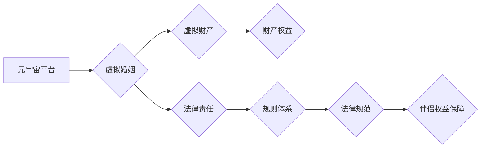

                 

## 元宇宙婚姻法:虚拟世界中的伴侣权益保障

> 关键词：元宇宙、虚拟婚姻、数字资产、智能合约、数据隐私、法律框架、伴侣权益

## 1. 背景介绍

元宇宙概念的兴起，标志着人类社会进入了一个全新的数字时代。在这个虚拟世界中，人们可以创造虚拟身份，拥有虚拟财产，并与他人进行互动交流。随着元宇宙技术的不断发展，虚拟世界中的社交关系也日益复杂化，其中包括虚拟婚姻。虚拟婚姻是指在元宇宙平台内，虚拟角色之间建立的模拟现实婚姻关系。

然而，虚拟婚姻的出现也带来了新的法律和伦理问题。例如，虚拟财产的归属权、虚拟子女的抚养权、虚拟婚姻的解除等，都需要法律法规予以明确规范。目前，现有的法律体系难以完全适应元宇宙的发展，因此迫切需要制定专门的“元宇宙婚姻法”，来保障虚拟世界中的伴侣权益。

## 2. 核心概念与联系

### 2.1 虚拟婚姻的本质

虚拟婚姻并非简单的游戏设定，它更像是一种基于虚拟技术的社会现象。虚拟伴侣之间建立的感情、承诺和责任，在一定程度上与现实婚姻具有相似性。

### 2.2 元宇宙平台与法律责任

元宇宙平台作为虚拟婚姻发生地的载体，承担着一定的法律责任。平台需要建立完善的规则体系，规范虚拟婚姻行为，并对违规行为进行处罚。同时，平台也需要对用户数据进行安全保护，防止信息泄露和滥用。

### 2.3 虚拟财产与法律归属

虚拟财产在元宇宙中具有重要的价值，包括虚拟土地、虚拟物品、虚拟货币等。虚拟婚姻关系的建立，可能会涉及虚拟财产的共同所有权、继承权等问题。需要明确虚拟财产的法律归属，并制定相应的法律机制，保障虚拟伴侣的财产权益。

**核心概念与联系流程图**



## 3. 核心算法原理 & 具体操作步骤

### 3.1 算法原理概述

元宇宙婚姻法的核心算法原理是基于智能合约技术，实现虚拟婚姻关系的自动化管理和执行。智能合约是一种自执行的代码，可以根据预先设定的规则自动执行交易和分配资源。

### 3.2 算法步骤详解

1. **虚拟伴侣身份认证:** 虚拟伴侣需要在元宇宙平台上进行身份认证，并提供必要的个人信息。
2. **虚拟婚姻协议签订:** 虚拟伴侣需要签订虚拟婚姻协议，明确虚拟婚姻的权利义务、财产分配、子女抚养等事项。
3. **智能合约部署:** 虚拟婚姻协议的内容会被转化为智能合约，并部署在元宇宙平台的区块链网络上。
4. **虚拟婚姻关系生效:** 智能合约生效后，虚拟伴侣之间的虚拟婚姻关系正式建立。
5. **虚拟婚姻关系管理:** 智能合约会自动执行虚拟婚姻关系中的各项条款，例如财产分配、子女抚养、婚姻解除等。

### 3.3 算法优缺点

**优点:**

* 自动化管理: 智能合约可以自动执行虚拟婚姻协议中的各项条款，提高效率和透明度。
* 数据安全: 智能合约部署在区块链网络上，数据安全性和不可篡改性得到保障。
* 法律效力: 智能合约具有法律效力，可以作为虚拟婚姻关系的证据。

**缺点:**

* 技术门槛: 智能合约的开发和部署需要一定的技术门槛。
* 法律规范: 目前，智能合约在法律上的适用性尚待明确。
* 人性化缺失: 智能合约的执行过于机械，缺乏人性化的考虑。

### 3.4 算法应用领域

* 虚拟婚姻关系的管理和执行
* 虚拟财产的分配和继承
* 虚拟子女的抚养权和教育权
* 虚拟伴侣之间的纠纷解决

## 4. 数学模型和公式 & 详细讲解 & 举例说明

### 4.1 数学模型构建

虚拟婚姻法的核心数学模型是基于博弈论和概率论。博弈论可以用来分析虚拟伴侣之间的利益冲突和合作关系，而概率论可以用来预测虚拟婚姻关系的稳定性和风险。

**博弈模型:**

* 参与者: 虚拟伴侣A和虚拟伴侣B
* 策略: 虚拟伴侣可以选择忠诚、背叛或离婚
* 支付矩阵: 根据不同的策略组合，虚拟伴侣获得不同的收益或损失

**概率模型:**

* 虚拟婚姻关系的稳定性可以用概率来表示，例如，虚拟伴侣A和B持续婚姻的概率。
* 虚拟婚姻关系的风险可以用概率来表示，例如，虚拟伴侣A和B离婚的概率。

### 4.2 公式推导过程

**虚拟婚姻关系的稳定性:**

$$P(稳定) = \frac{收益(忠诚) - 收益(背叛)}{收益(忠诚) + 收益(背叛)}$$

**虚拟婚姻关系的风险:**

$$P(风险) = \frac{损失(背叛) + 损失(离婚)}{收益(忠诚) + 收益(背叛)}$$

### 4.3 案例分析与讲解

假设虚拟伴侣A和B签订了虚拟婚姻协议，协议规定双方共同拥有虚拟财产，并承诺忠诚于对方。

* 如果双方都选择忠诚，则双方可以获得共同拥有虚拟财产的收益。
* 如果一方选择背叛，则另一方会损失一部分虚拟财产，并可能面临虚拟婚姻关系的破裂。
* 如果双方选择离婚，则双方会失去共同拥有虚拟财产的收益，并可能面临虚拟财产的分割问题。

通过分析博弈模型和概率模型，可以预测虚拟伴侣A和B的婚姻关系稳定性和风险。

## 5. 项目实践：代码实例和详细解释说明

### 5.1 开发环境搭建

* 开发语言: Solidity
* 区块链平台: Ethereum
* 开发工具: Remix IDE

### 5.2 源代码详细实现

```solidity
pragma solidity ^0.8.0;

contract VirtualMarriage {

    address public partnerA;
    address public partnerB;

    // 虚拟财产分配规则
    mapping(address => uint256) public propertyShare;

    // 虚拟婚姻协议
    string public agreement;

    constructor(address _partnerA, address _partnerB, string memory _agreement) {
        partnerA = _partnerA;
        partnerB = _partnerB;
        agreement = _agreement;
    }

    // 设置虚拟财产分配比例
    function setPropertyShare(address _address, uint256 _share) public {
        require(msg.sender == partnerA || msg.sender == partnerB, "Only partners can modify property share");
        propertyShare[_address] = _share;
    }

    // 虚拟婚姻解除
    function divorce() public {
        require(msg.sender == partnerA || msg.sender == partnerB, "Only partners can initiate divorce");
        // 执行离婚协议中的条款
    }
}
```

### 5.3 代码解读与分析

* `partnerA` 和 `partnerB` 存储虚拟伴侣的地址。
* `propertyShare` 映射存储虚拟财产的分配比例。
* `agreement` 存储虚拟婚姻协议的内容。
* `setPropertyShare` 函数用于设置虚拟财产的分配比例。
* `divorce` 函数用于执行虚拟婚姻解除协议。

### 5.4 运行结果展示

部署智能合约后，虚拟伴侣可以通过交互式界面进行操作，例如设置虚拟财产分配比例、解除虚拟婚姻等。

## 6. 实际应用场景

### 6.1 虚拟伴侣财产分配

在元宇宙中，虚拟伴侣可以共同拥有虚拟财产，例如虚拟土地、虚拟物品、虚拟货币等。虚拟婚姻法可以帮助虚拟伴侣明确财产分配规则，避免财产纠纷。

### 6.2 虚拟子女抚养权

虚拟伴侣可以拥有虚拟子女，虚拟婚姻法可以规定虚拟子女的抚养权和教育权，保障虚拟子女的权益。

### 6.3 虚拟婚姻关系解除

虚拟伴侣可以选择解除虚拟婚姻关系，虚拟婚姻法可以规定解除虚拟婚姻的流程和条件，保障虚拟伴侣的权益。

### 6.4 未来应用展望

随着元宇宙技术的不断发展，虚拟婚姻法的应用场景将会更加广泛，例如：

* 虚拟伴侣的遗产继承
* 虚拟伴侣的医疗保险
* 虚拟伴侣的税务申报

## 7. 工具和资源推荐

### 7.1 学习资源推荐

* **元宇宙技术入门书籍:** 《元宇宙：下一代互联网》
* **智能合约开发教程:** Solidity 官方文档
* **区块链技术学习平台:** Coursera、Udemy

### 7.2 开发工具推荐

* **Remix IDE:** 在线 Solidity 智能合约开发环境
* **Truffle Suite:** 智能合约测试和部署工具
* **Ganache:** 本地区块链测试环境

### 7.3 相关论文推荐

* **"The Legal Implications of Virtual Marriage"**
* **"Smart Contracts for Virtual Property Rights"**
* **"Blockchain Technology and the Future of Marriage"**

## 8. 总结：未来发展趋势与挑战

### 8.1 研究成果总结

元宇宙婚姻法是一个新兴的法律领域，目前的研究成果主要集中在以下几个方面:

* 虚拟婚姻的定义和特征
* 虚拟婚姻关系的法律地位
* 虚拟财产的法律归属
* 智能合约在虚拟婚姻中的应用

### 8.2 未来发展趋势

* **法律法规的完善:** 需要制定专门的法律法规，规范虚拟婚姻关系的建立、管理和解除。
* **技术标准的制定:** 需要制定相应的技术标准，保障虚拟婚姻关系的安全性、可靠性和可溯性。
* **伦理规范的建立:** 需要建立相应的伦理规范，引导虚拟伴侣的行为，保障虚拟婚姻关系的健康发展。

### 8.3 面临的挑战

* **法律适用性:** 目前，现有的法律体系难以完全适应元宇宙的发展，需要对法律进行重新解读和调整。
* **技术复杂性:** 智能合约的开发和部署需要一定的技术门槛，需要加强技术人才的培养。
* **伦理争议:** 虚拟婚姻关系的出现可能会引发一些伦理争议，需要进行深入的探讨和研究。

### 8.4 研究展望

未来，元宇宙婚姻法的研究将更加深入，涵盖更广泛的领域，例如虚拟伴侣的继承权、虚拟子女的抚养权、虚拟婚姻的税务问题等。


## 9. 附录：常见问题与解答

**1. 虚拟婚姻是否具有法律效力？**

目前，虚拟婚姻的法律效力尚待明确。

**2. 虚拟财产的归属权如何确定？**

虚拟财产的归属权需要根据虚拟婚姻协议和相关法律法规进行确定。

**3. 虚拟婚姻关系如何解除？**

虚拟婚姻关系的解除需要根据虚拟婚姻协议和相关法律法规进行操作。

**4. 虚拟伴侣的子女抚养权如何保障？**

虚拟伴侣的子女抚养权需要根据虚拟婚姻协议和相关法律法规进行确定。

**5. 虚拟婚姻关系的法律规范如何制定？**

虚拟婚姻关系的法律规范需要由政府部门和相关机构共同制定。


作者：禅与计算机程序设计艺术 / Zen and the Art of Computer Programming 
<end_of_turn>

