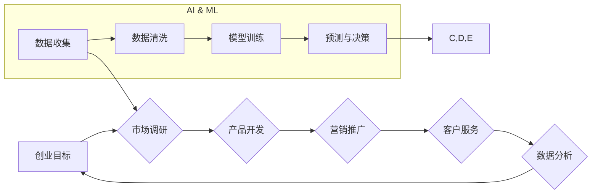

                 

## 关键词：创业自动化、人工智能、机器学习、流程自动化、数据驱动、创业模式、传统创业

## 1. 背景介绍

创业，是人类社会进步的引擎，也是个人实现价值的重要途径。传统的创业模式通常依赖于人力、资源和经验的积累，充满了不确定性和挑战。随着人工智能（AI）和机器学习（ML）技术的飞速发展，创业自动化逐渐成为一种新的创业模式，它利用算法和数据驱动，自动化完成创业过程中的许多环节，提高效率、降低成本，并为创业者提供更精准的决策支持。

### 1.1  传统创业模式的局限性

传统创业模式通常面临以下挑战：

* **效率低下:** 创业过程涉及多个环节，例如市场调研、产品开发、营销推广、客户服务等，这些环节往往需要耗费大量时间和人力。
* **成本高昂:** 创业初期，资金往往是最大的瓶颈，传统模式下，人力成本、资源成本和运营成本都相对较高。
* **决策风险:** 创业决策往往需要基于有限的经验和数据，存在较大的不确定性和风险。
* **难以规模化:** 传统模式下，创业团队规模有限，难以快速扩张和规模化运营。

### 1.2  创业自动化的机遇

创业自动化为创业者提供了新的机遇：

* **提高效率:** 通过自动化完成重复性任务，例如数据分析、市场调研、客户服务等，释放人力资源，提高创业效率。
* **降低成本:** 自动化可以减少人力成本、资源成本和运营成本，降低创业门槛。
* **精准决策:** 利用数据驱动和机器学习，为创业者提供更精准的市场分析、产品开发和营销决策支持。
* **实现规模化:** 自动化可以帮助创业团队快速扩张和规模化运营，实现可持续发展。

## 2. 核心概念与联系

创业自动化本质上是将人工智能和机器学习技术应用于创业过程，通过自动化完成创业过程中的多个环节，提高效率、降低成本，并为创业者提供更精准的决策支持。

**核心概念:**

* **人工智能 (AI):** 人工智能是指使机器能够像人类一样学习、推理和解决问题的能力。
* **机器学习 (ML):** 机器学习是人工智能的一个子领域，它通过算法训练模型，使模型能够从数据中学习并做出预测或决策。
* **流程自动化:** 流程自动化是指利用软件工具自动完成重复性任务，例如数据录入、报表生成、邮件发送等。

**架构图:**



## 3. 核心算法原理 & 具体操作步骤

### 3.1  算法原理概述

创业自动化中常用的算法包括：

* **机器学习算法:** 用于市场调研、产品开发、营销推广和客户服务等环节，例如分类算法、回归算法、聚类算法等。
* **自然语言处理 (NLP) 算法:** 用于分析用户评论、社交媒体数据等，了解用户需求和市场趋势。
* **计算机视觉算法:** 用于图像识别、视频分析等，例如产品推荐、广告投放等。

### 3.2  算法步骤详解

以市场调研为例，使用机器学习算法进行市场调研的具体步骤如下：

1. **数据收集:** 收集相关市场数据，例如用户行为数据、市场趋势数据、竞争对手数据等。
2. **数据清洗:** 对收集到的数据进行清洗和预处理，例如去除重复数据、缺失值处理、数据格式转换等。
3. **特征工程:** 从原始数据中提取特征，例如用户年龄、性别、兴趣爱好、购买行为等，这些特征将作为机器学习模型的输入。
4. **模型训练:** 选择合适的机器学习算法，例如分类算法，训练模型，并使用训练数据进行模型评估。
5. **模型部署:** 将训练好的模型部署到生产环境中，用于预测和分析新的市场数据。

### 3.3  算法优缺点

**优点:**

* **自动化:** 可以自动化完成市场调研的多个环节，提高效率。
* **数据驱动:** 基于数据分析，提供更精准的市场洞察。
* **可扩展性:** 可以处理海量数据，并随着数据量的增加而提升预测精度。

**缺点:**

* **数据依赖:** 需要大量高质量的数据进行训练，否则模型精度会降低。
* **算法选择:** 需要根据具体问题选择合适的算法，否则模型效果可能不理想。
* **解释性:** 一些机器学习算法的决策过程难以解释，这可能会导致创业者难以理解模型的预测结果。

### 3.4  算法应用领域

创业自动化中的算法可以应用于以下领域:

* **市场调研:** 分析市场趋势、用户需求、竞争对手情况等。
* **产品开发:** 预测用户需求、设计产品功能、优化产品体验等。
* **营销推广:** 精准定位目标用户、优化广告投放、提高营销转化率等。
* **客户服务:** 自动化处理客户咨询、解决客户问题、提高客户满意度等。

## 4. 数学模型和公式 & 详细讲解 & 举例说明

### 4.1  数学模型构建

创业自动化中常用的数学模型包括：

* **线性回归模型:** 用于预测连续变量，例如用户购买量、产品价格等。
* **逻辑回归模型:** 用于预测分类变量，例如用户是否会购买产品、用户是否会点击广告等。
* **支持向量机 (SVM) 模型:** 用于分类和回归问题，具有较好的泛化能力。

### 4.2  公式推导过程

以线性回归模型为例，其目标是找到一条直线，使得预测值与真实值之间的误差最小。

**公式:**

$$y = mx + c$$

其中：

* $y$ 是预测值
* $x$ 是输入特征
* $m$ 是斜率
* $c$ 是截距

**损失函数:**

$$Loss = \sum_{i=1}^{n}(y_i - \hat{y}_i)^2$$

其中：

* $n$ 是样本数量
* $y_i$ 是真实值
* $\hat{y}_i$ 是预测值

**优化目标:**

$$min Loss$$

通过梯度下降算法，不断更新 $m$ 和 $c$ 的值，使得损失函数最小化。

### 4.3  案例分析与讲解

假设我们想要预测用户购买产品的概率，可以使用逻辑回归模型。

**数据:**

* 用户年龄
* 用户性别
* 用户收入
* 用户是否购买过该产品

**模型训练:**

使用训练数据训练逻辑回归模型，得到模型参数。

**预测:**

对于新的用户，输入其特征值，模型可以预测其购买产品的概率。

## 5. 项目实践：代码实例和详细解释说明

### 5.1  开发环境搭建

* Python 3.x
* Jupyter Notebook
* scikit-learn 库

### 5.2  源代码详细实现

```python
from sklearn.linear_model import LogisticRegression
from sklearn.model_selection import train_test_split
from sklearn.metrics import accuracy_score

# 加载数据
data = ...

# 分割数据
X_train, X_test, y_train, y_test = train_test_split(data.drop('购买产品', axis=1), data['购买产品'], test_size=0.2)

# 创建模型
model = LogisticRegression()

# 训练模型
model.fit(X_train, y_train)

# 预测结果
y_pred = model.predict(X_test)

# 计算准确率
accuracy = accuracy_score(y_test, y_pred)
print(f'准确率: {accuracy}')
```

### 5.3  代码解读与分析

* 使用 `train_test_split` 函数将数据分割成训练集和测试集。
* 使用 `LogisticRegression` 类创建逻辑回归模型。
* 使用 `fit` 方法训练模型。
* 使用 `predict` 方法预测测试集的结果。
* 使用 `accuracy_score` 函数计算模型的准确率。

### 5.4  运行结果展示

运行代码后，会输出模型的准确率。

## 6. 实际应用场景

### 6.1  创业项目选择

利用机器学习算法分析市场趋势、用户需求和竞争对手情况，帮助创业者选择更有潜力的创业项目。

### 6.2  产品开发

根据用户数据和市场分析，优化产品功能、设计产品体验，提高产品竞争力。

### 6.3  营销推广

精准定位目标用户，优化广告投放策略，提高营销转化率。

### 6.4  未来应用展望

随着人工智能技术的不断发展，创业自动化将应用于更多领域，例如：

* **自动生成创业计划书:** 利用自然语言处理技术，自动生成创业计划书，帮助创业者快速完成计划书撰写。
* **自动寻找合伙人:** 利用机器学习算法分析用户数据，推荐合适的合伙人。
* **自动融资:** 利用人工智能技术分析创业项目数据，自动寻找合适的投资人。

## 7. 工具和资源推荐

### 7.1  学习资源推荐

* **在线课程:** Coursera, edX, Udacity 等平台提供人工智能和机器学习相关的在线课程。
* **书籍:** 《深度学习》、《机器学习实战》等书籍可以帮助你深入了解人工智能和机器学习的原理和应用。
* **开源项目:** TensorFlow, PyTorch 等开源项目可以帮助你实践人工智能和机器学习的知识。

### 7.2  开发工具推荐

* **Python:** 作为人工智能和机器学习的常用编程语言，Python 提供了丰富的库和工具，例如 scikit-learn, TensorFlow, PyTorch 等。
* **Jupyter Notebook:** Jupyter Notebook 是一个交互式编程环境，方便进行数据分析和模型开发。
* **云计算平台:** AWS, Azure, GCP 等云计算平台提供强大的计算资源和机器学习服务，可以帮助你快速搭建和部署人工智能应用。

### 7.3  相关论文推荐

* **《ImageNet Classification with Deep Convolutional Neural Networks》:** 这篇论文介绍了深度卷积神经网络在图像分类领域的应用。
* **《Attention Is All You Need》:** 这篇论文介绍了 Transformer 模型，一种新的序列建模方法，在自然语言处理领域取得了突破性进展。
* **《Generative Adversarial Networks》:** 这篇论文介绍了生成对抗网络 (GAN) 的概念，一种用于生成数据的生成模型。

## 8. 总结：未来发展趋势与挑战

### 8.1  研究成果总结

创业自动化利用人工智能和机器学习技术，为创业者提供更有效、更精准的决策支持，提高创业效率和成功率。

### 8.2  未来发展趋势

* **更强大的算法:** 未来将出现更强大的机器学习算法，能够处理更复杂的数据，提供更精准的预测和决策支持。
* **更广泛的应用场景:** 创业自动化将应用于更多领域，例如自动生成创业计划书、自动寻找合伙人、自动融资等。
* **更易于使用的工具:** 未来将出现更易于使用的创业自动化工具，即使没有编程经验的创业者也能轻松使用。

### 8.3  面临的挑战

* **数据质量:** 创业自动化依赖于高质量的数据，数据质量问题会影响模型的精度和可靠性。
* **算法解释性:** 一些机器学习算法的决策过程难以解释，这可能会导致创业者难以理解模型的预测结果。
* **伦理问题:** 创业自动化可能会带来一些伦理问题，例如算法偏见、数据隐私等，需要引起重视和解决。

### 8.4  研究展望

未来研究方向包括：

* 开发更强大的、更解释性的机器学习算法。
* 研究创业自动化在不同行业和场景的应用。
* 探索创业自动化带来的伦理问题，并提出相应的解决方案。

## 9. 附录：常见问题与解答

### 9.1  Q: 创业自动化是否会取代创业者？

**A:** 创业自动化不会取代创业者，而是会帮助创业者更高效地完成工作，释放他们的精力去关注更重要的战略决策和创意创新。

### 9.2  Q: 创业自动化需要哪些技术技能？

**A:** 创业自动化需要掌握人工智能、机器学习、数据分析、编程等技术技能。

### 9.3  Q: 如何学习创业自动化相关知识？

**A:** 可以通过在线课程、书籍、开源项目等方式学习创业自动化相关知识。


作者：禅与计算机程序设计艺术 / Zen and the Art of Computer Programming 
<end_of_turn>

