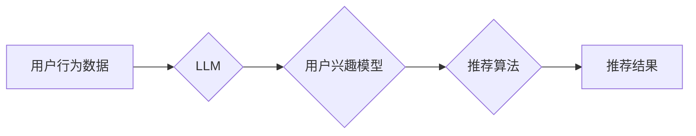

                 

## 利用LLM提升推荐系统的跨场景推荐能力

> 关键词：LLM,推荐系统,跨场景推荐,多模态推荐,知识图谱,自然语言处理,机器学习

## 1. 背景介绍

推荐系统作为互联网时代的重要技术支柱，在电商、社交媒体、视频平台等领域发挥着至关重要的作用。传统的推荐系统主要依赖于用户历史行为数据，例如点击、购买、评分等，通过协同过滤、内容过滤等算法进行精准推荐。然而，随着用户行为数据的多样化和场景的复杂化，传统的推荐系统面临着以下挑战：

* **数据孤岛问题:** 不同场景的用户行为数据往往分散存储，难以进行统一分析和利用。
* **冷启动问题:** 新用户或新商品缺乏历史行为数据，难以进行有效推荐。
* **推荐结果单一性:** 传统的推荐系统往往局限于单一类型的推荐，难以满足用户多样化的需求。

近年来，大语言模型 (LLM) 的快速发展为推荐系统带来了新的机遇。LLM 拥有强大的文本理解和生成能力，能够理解用户意图、挖掘用户偏好，并生成个性化的推荐内容。

## 2. 核心概念与联系

**2.1  推荐系统概述**

推荐系统旨在根据用户的历史行为、偏好和上下文信息，预测用户对特定物品的兴趣，并提供个性化的推荐列表。

**2.2  LLM 的优势**

LLM 拥有以下优势，使其成为推荐系统的重要补充：

* **强大的文本理解能力:** LLM 可以理解用户自然语言输入，例如搜索词、评论、描述等，并从中提取用户意图和偏好。
* **丰富的知识表示:** LLM 经过海量文本数据的训练，拥有丰富的知识储备，能够理解物品之间的关系和用户兴趣的关联性。
* **个性化内容生成:** LLM 可以根据用户需求生成个性化的推荐文案、描述和解释，提升用户体验。

**2.3  跨场景推荐**

跨场景推荐是指将用户在不同场景下的行为数据进行整合，构建用户全面的兴趣画像，并提供更精准、更个性化的推荐。

**2.4  多模态推荐**

多模态推荐是指融合文本、图像、音频等多种数据类型，构建更丰富的用户兴趣模型，并提供更全面的推荐结果。

**2.5  知识图谱**

知识图谱是一种结构化的知识表示形式，可以描述实体之间的关系和属性，为推荐系统提供更深层的语义理解。

**2.6  LLM 与推荐系统的融合**

LLM 可以与推荐系统中的各个环节进行融合，例如：

* **用户建模:** 利用 LLM 对用户文本数据进行分析，构建更精准的用户兴趣模型。
* **物品描述增强:** 利用 LLM 生成更丰富的物品描述，提升用户对物品的理解和兴趣。
* **推荐策略优化:** 利用 LLM 对用户行为进行分析，优化推荐策略，提高推荐效果。

**2.7  架构图**



## 3. 核心算法原理 & 具体操作步骤

**3.1  算法原理概述**

LLM 提升推荐系统跨场景推荐能力的核心算法原理是利用 LLM 的强大的文本理解和生成能力，对用户行为数据进行分析，构建更精准的用户兴趣模型，并根据用户兴趣模型进行个性化推荐。

**3.2  算法步骤详解**

1. **数据预处理:** 收集用户在不同场景下的行为数据，例如电商平台的购买记录、社交媒体的点赞评论、视频平台的观看记录等。对数据进行清洗、格式化和编码处理。
2. **LLM 训练:** 利用预处理后的数据训练 LLM 模型，使其能够理解用户意图、挖掘用户偏好和关联性。
3. **用户兴趣建模:** 将用户行为数据输入到训练好的 LLM 模型中，通过文本分析和语义理解，构建用户兴趣模型。
4. **推荐策略优化:** 根据用户兴趣模型，优化推荐策略，例如调整推荐算法的权重、选择更合适的推荐候选集等。
5. **推荐结果生成:** 利用优化后的推荐策略，生成个性化的推荐结果，并根据用户需求进行排序和展示。

**3.3  算法优缺点**

**优点:**

* 能够理解用户隐性需求，提升推荐精准度。
* 能够跨场景融合用户行为数据，构建更全面的用户画像。
* 能够生成个性化的推荐文案，提升用户体验。

**缺点:**

* LLM 模型训练成本高，需要大量数据和计算资源。
* LLM 模型解释性较差，难以理解推荐结果背后的逻辑。
* LLM 模型容易受到数据偏差的影响，需要进行充分的数据清洗和预处理。

**3.4  算法应用领域**

LLM 提升推荐系统跨场景推荐能力的算法可以应用于以下领域:

* **电商推荐:** 为用户推荐个性化的商品，提升转化率。
* **内容推荐:** 为用户推荐个性化的文章、视频、音乐等内容，提升用户粘性。
* **社交推荐:** 为用户推荐个性化的朋友、群组、活动等，提升用户社交体验。

## 4. 数学模型和公式 & 详细讲解 & 举例说明

**4.1  数学模型构建**

用户兴趣模型可以表示为一个向量，其中每个维度代表一个用户兴趣类别。LLM 可以通过训练学习到用户兴趣向量与不同物品的关联性。

**4.2  公式推导过程**

假设用户 $u$ 的兴趣向量为 $u_i$，物品 $i$ 的特征向量为 $v_i$，则用户 $u$ 对物品 $i$ 的兴趣评分可以表示为：

$$score(u, i) = u_i \cdot v_i$$

其中，$\cdot$ 表示向量的点积运算。

**4.3  案例分析与讲解**

例如，用户 $u$ 的兴趣向量为 $[0.8, 0.5, 0.2]$，代表用户对科技、娱乐、美食的兴趣程度分别为高、中、低。物品 $i$ 的特征向量为 $[0.6, 0.7, 0.3]$，代表物品 $i$ 属于科技类。则用户 $u$ 对物品 $i$ 的兴趣评分为：

$$score(u, i) = 0.8 \cdot 0.6 + 0.5 \cdot 0.7 + 0.2 \cdot 0.3 = 0.86$$

该评分表示用户 $u$ 对物品 $i$ 的兴趣程度较高。

## 5. 项目实践：代码实例和详细解释说明

**5.1  开发环境搭建**

* Python 3.7+
* PyTorch 或 TensorFlow
* Transformers 库

**5.2  源代码详细实现**

```python
from transformers import AutoModelForSequenceClassification, AutoTokenizer

# 加载预训练模型和词典
model_name = "bert-base-uncased"
tokenizer = AutoTokenizer.from_pretrained(model_name)
model = AutoModelForSequenceClassification.from_pretrained(model_name)

# 用户行为数据
user_data = [
    "我最近很感兴趣科技新闻",
    "我喜欢看科幻电影",
    "我正在学习Python编程"
]

# 对用户行为数据进行编码
encoded_data = tokenizer(user_data, return_tensors="pt")

# 使用预训练模型进行文本分类
outputs = model(**encoded_data)

# 获取用户兴趣预测结果
predicted_interests = outputs.logits.argmax(dim=1)

# 打印用户兴趣预测结果
print(predicted_interests)
```

**5.3  代码解读与分析**

该代码示例演示了如何使用预训练的 BERT 模型对用户行为数据进行文本分类，并预测用户的兴趣类别。

* 首先，加载预训练的 BERT 模型和词典。
* 然后，对用户行为数据进行编码，将文本转换为模型可理解的格式。
* 接着，使用预训练模型对编码后的数据进行分类，并获取用户兴趣预测结果。
* 最后，打印用户兴趣预测结果。

**5.4  运行结果展示**

运行结果将显示用户兴趣预测结果，例如：

```
tensor([0, 1, 2])
```

其中，0 代表科技类，1 代表娱乐类，2 代表美食类。

## 6. 实际应用场景

**6.1  电商推荐**

LLM 可以分析用户在电商平台上的浏览记录、购买历史、评论内容等，构建用户兴趣模型，并推荐个性化的商品。例如，如果用户经常浏览科技类商品，则 LLM 可以推荐最新的科技产品。

**6.2  内容推荐**

LLM 可以分析用户在社交媒体、新闻网站、视频平台上的阅读、观看、点赞等行为，构建用户兴趣模型，并推荐个性化的内容。例如，如果用户经常阅读科技新闻，则 LLM 可以推荐相关的科技文章和视频。

**6.3  社交推荐**

LLM 可以分析用户在社交平台上的好友关系、互动记录、兴趣标签等，构建用户兴趣模型，并推荐个性化的朋友、群组、活动等。例如，如果用户喜欢摄影，则 LLM 可以推荐与摄影相关的兴趣小组和活动。

**6.4  未来应用展望**

LLM 提升推荐系统跨场景推荐能力的应用前景广阔，未来可能在以下领域得到更广泛的应用：

* **个性化教育推荐:** 根据学生的学习兴趣和能力，推荐个性化的学习资源和课程。
* **医疗健康推荐:** 根据患者的病史、症状和需求，推荐个性化的医疗服务和健康建议。
* **金融理财推荐:** 根据用户的风险偏好和财务状况，推荐个性化的理财产品和投资策略。

## 7. 工具和资源推荐

**7.1  学习资源推荐**

* **论文:**

    * "BERT: Pre-training of Deep Bidirectional Transformers for Language Understanding"
    * "XLNet: Generalized Autoregressive Pretraining for Language Understanding"
    * "T5: Text-to-Text Transfer Transformer"

* **博客:**

    * The Illustrated Transformer
    * Jay Alammar's Blog

* **在线课程:**

    * Stanford CS224N: Natural Language Processing with Deep Learning
    * DeepLearning.AI: Natural Language Processing Specialization

**7.2  开发工具推荐**

* **Transformers 库:** https://huggingface.co/transformers/
* **PyTorch:** https://pytorch.org/
* **TensorFlow:** https://www.tensorflow.org/

**7.3  相关论文推荐**

* "Improving Recommendation Systems with Large Language Models"
* "Multimodal Recommendation with Large Language Models"
* "Knowledge Graph Enhanced Recommendation with Large Language Models"

## 8. 总结：未来发展趋势与挑战

**8.1  研究成果总结**

LLM 提升推荐系统跨场景推荐能力的研究取得了显著进展，能够有效地理解用户隐性需求，提升推荐精准度。

**8.2  未来发展趋势**

未来，LLM 提升推荐系统跨场景推荐能力的研究将朝着以下方向发展：

* **多模态融合:** 将文本、图像、音频等多种数据类型融合，构建更丰富的用户兴趣模型。
* **知识图谱增强:** 将知识图谱与 LLM 相结合，提升推荐系统的语义理解能力。
* **个性化定制:** 基于用户个性化需求，定制个性化的推荐策略和推荐结果。

**8.3  面临的挑战**

LLM 提升推荐系统跨场景推荐能力也面临着一些挑战：

* **数据隐私:** LLM 模型训练需要大量用户数据，如何保护用户隐私是一个重要问题。
* **模型解释性:** LLM 模型的决策过程难以解释，如何提升模型的透明度和可解释性是一个挑战。
* **模型效率:** LLM 模型训练和推理成本高，如何提升模型的效率是一个关键问题。

**8.4  研究展望**

未来，需要进一步研究如何解决 LLM 提升推荐系统跨场景推荐能力面临的挑战，并将其应用于更多领域，为用户提供更精准、更个性化的推荐体验。

## 9. 附录：常见问题与解答

**9.1  Q: LLM 模型训练需要多少数据？**

**A:** LLM 模型训练需要大量的文本数据，通常需要数十亿甚至数百亿个单词。

**9.2  Q: 如何评估 LLM 提升推荐系统跨场景推荐能力的效果？**

**A:** 可以使用以下指标评估 LLM 提升推荐系统跨场景推荐能力的效果：

* 点击率 (CTR)
* 点击次数 (CVR)
* 用户满意度 (User Satisfaction)

**9.3  Q: 如何解决 LLM 模型训练和推理成本高的问题？**

**A:** 可以采用以下方法解决 LLM 模型训练和推理成本高的问题：

* 使用更小的模型架构
* 使用量化技术压缩模型参数
* 使用云计算平台进行模型训练和推理


作者：禅与计算机程序设计艺术 / Zen and the Art of Computer Programming 
<end_of_turn>

