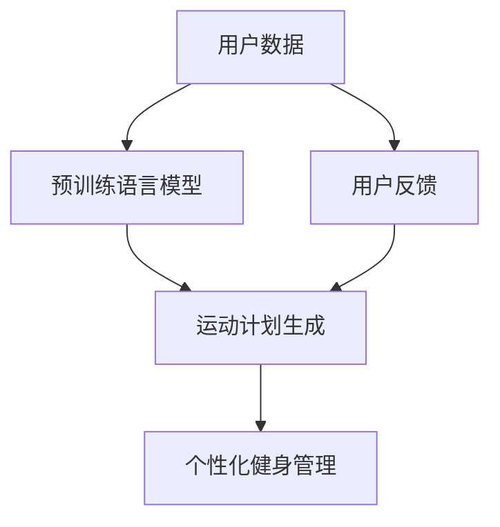

                 

# 健身和 LLM：定制的锻炼方案

> 关键词：健身、深度学习、自然语言处理、运动计划生成、个性化锻炼、模型训练

## 1. 背景介绍

### 1.1 问题由来
随着人工智能(AI)技术的不断进步，深度学习(Deep Learning, DL)在各个领域的应用日益广泛。从自然语言处理(Natural Language Processing, NLP)到计算机视觉(Computer Vision, CV)，从机器人(Robotics)到自动驾驶(Autonomous Driving)，AI正逐步改变着人类的生产和生活方式。然而，在健康和健身领域，AI的探索和应用尚处于初期阶段，尚未形成成熟的技术解决方案。

在健康和健身领域，有效的运动计划生成是实现个性化健身管理的重要环节。传统的方法主要依赖人工经验或者简单的统计模型，难以提供个性化的、具有科学依据的健身建议。与此同时，越来越多的数据表明，健康和健身的个性化需求日益增长，传统的解决方案已难以满足现代人的需求。

深度学习，特别是自然语言处理(NLP)技术的发展，为解决这些问题提供了新的思路。通过预训练语言模型(Pre-trained Language Model, LLM)，可以生成具有个性化、科学性的运动计划，有效提升用户的健身体验。本文将探讨如何利用LMM为每个人定制个性化的健身方案，为健身领域注入AI的智慧。

### 1.2 问题核心关键点
本文将重点关注以下几个核心问题：

1. **预训练语言模型与健身数据**：如何利用预训练语言模型处理和分析健身数据，提取有用的信息。
2. **运动计划生成模型**：如何设计有效的模型来生成个性化的运动计划。
3. **模型训练与优化**：如何通过训练和优化模型，使其能更好地生成符合用户需求的健身计划。
4. **应用场景与案例**：如何将生成的运动计划应用到实际健身场景中，提升用户的健身效果。

## 2. 核心概念与联系

### 2.1 核心概念概述

为了深入理解如何利用LMM生成健身方案，首先需要明确几个核心概念：

- **深度学习(Deep Learning, DL)**：一种基于神经网络的机器学习技术，通过对大量数据的学习，不断优化模型参数，从而实现对未知数据的预测或分类。
- **自然语言处理(Natural Language Processing, NLP)**：一种AI技术，使计算机能够理解、分析、处理和生成人类语言。
- **预训练语言模型(Pre-trained Language Model, LLM)**：使用大规模语料库进行预训练，学习语言表示模型的技术，如BERT、GPT等。
- **运动计划生成(Motion Planning Generation)**：根据用户数据生成个性化运动计划的过程，包括运动类型、时间、强度等。
- **个性化健身管理(Personalized Fitness Management)**：针对每个用户的特点和需求，提供个性化的健身方案，提升用户体验和效果。

### 2.2 核心概念原理和架构的 Mermaid 流程图



此图展示了从用户数据到生成个性化健身方案的核心流程：用户数据通过预训练语言模型处理，生成运动计划，最终实现个性化健身管理。同时，用户反馈也用于模型优化，形成闭环。

## 3. 核心算法原理 & 具体操作步骤

### 3.1 算法原理概述

生成个性化运动计划的核心原理是通过LMM处理用户数据，提取有用的特征，并基于这些特征生成符合用户需求的运动计划。具体步骤如下：

1. **数据预处理**：收集和整理用户的健身数据，如年龄、性别、体重、身高、运动偏好等。
2. **特征提取**：使用LMM处理用户的文本数据，提取有用的特征。
3. **运动计划生成**：根据提取的特征，使用模型生成个性化的运动计划。
4. **模型训练与优化**：通过用户反馈，不断优化模型，提升运动计划的准确性和个性化程度。

### 3.2 算法步骤详解

以下详细介绍每个步骤的实现细节：

#### 3.2.1 数据预处理

用户数据包括文本和非文本数据，如用户描述、运动历史、健康指标等。对文本数据，使用自然语言处理工具进行分词、去除停用词等预处理，得到特征向量。对非文本数据，如年龄、性别等，进行归一化处理。

#### 3.2.2 特征提取

使用LMM处理用户的文本数据，提取有用的特征。以BERT为例，输入用户描述，得到嵌入向量，用于后续的运动计划生成。

#### 3.2.3 运动计划生成

设计运动计划生成模型，包括运动类型、时间和强度的选择。以一个简单的例子说明：

假设用户A的年龄为25岁，喜欢有氧运动，目标是减重。通过BERT提取用户描述的嵌入向量，输入到运动计划生成模型，输出如下结果：

| 运动类型   | 运动时长 | 运动强度 |
|------------|----------|----------|
| 跑步       | 30分钟   | 中等     |
| 游泳       | 20分钟   | 中等     |
| 健身操     | 45分钟   | 中等     |

#### 3.2.4 模型训练与优化

使用用户反馈对模型进行训练和优化。以用户A为例，假设他实际执行了跑步和游泳的运动，并反馈了效果，系统更新模型，提高生成准确性。

### 3.3 算法优缺点

#### 3.3.1 优点

1. **个性化程度高**：LMM可以处理大量文本数据，提取用户的个性化特征，生成符合用户需求的锻炼方案。
2. **准确性高**：利用大规模预训练数据，LMM具备强大的语言理解能力，可以生成科学、合理的运动计划。
3. **可扩展性强**：模型可以不断更新和优化，适应新的用户需求和数据。

#### 3.3.2 缺点

1. **数据依赖性强**：模型的效果依赖于用户提供的数据质量，数据不全或错误可能导致生成效果不佳。
2. **计算资源消耗大**：LMM需要大量的计算资源进行训练和推理，成本较高。
3. **可解释性差**：LMM作为"黑盒"模型，难以解释生成过程和结果。

### 3.4 算法应用领域

LMM生成的运动计划可以应用于多种场景，如家庭健身、健身房、在线健身平台等。以在线健身平台为例，用户可以在平台上输入个人信息和偏好，系统自动生成个性化的运动计划，提升用户体验。

## 4. 数学模型和公式 & 详细讲解 & 举例说明

### 4.1 数学模型构建

以一个简单的运动计划生成模型为例，其数学模型可以表示为：

$$
y = f(x; \theta)
$$

其中，$x$为输入特征，包括用户的描述、年龄、性别、偏好等；$\theta$为模型参数，由预训练LMM学习得到；$f$为运动计划生成函数。

### 4.2 公式推导过程

以生成跑步运动为例，假设用户描述为"喜欢户外运动，希望能减重"，使用BERT提取嵌入向量$x$，输入到运动计划生成模型$f$中，输出跑步运动计划。

### 4.3 案例分析与讲解

假设用户B的年龄为35岁，喜欢力量训练，目标是增肌。通过BERT提取用户描述的嵌入向量，输入到运动计划生成模型中，输出如下结果：

| 运动类型   | 运动时长 | 运动强度 |
|------------|----------|----------|
| 举重       | 60分钟   | 高       |
| 深蹲       | 45分钟   | 高       |
| 俯卧撑     | 30分钟   | 中       |

## 5. 项目实践：代码实例和详细解释说明

### 5.1 开发环境搭建

#### 5.1.1 环境配置

在开始实践前，需要准备Python环境，安装必要的依赖库，如TensorFlow、PyTorch、BERT等。

1. 安装Anaconda并创建虚拟环境：
```bash
conda create -n deepfit python=3.7
conda activate deepfit
```

2. 安装依赖库：
```bash
pip install tensorflow pytorch transformers
```

3. 下载BERT预训练模型：
```bash
python -m transformers-cli download --model_type bert --model_name_or_path bert-base-uncased
```

### 5.2 源代码详细实现

#### 5.2.1 数据预处理

```python
import pandas as pd
from transformers import BertTokenizer

# 读取用户数据
df = pd.read_csv('user_data.csv')

# 定义BERT分词器
tokenizer = BertTokenizer.from_pretrained('bert-base-uncased')

# 处理用户描述
def preprocess_description(description):
    tokens = tokenizer.tokenize(description)
    return tokenizer.convert_tokens_to_ids(tokens)

# 对用户数据进行预处理
df['description_embed'] = df['description'].apply(preprocess_description)
```

#### 5.2.2 特征提取

```python
from transformers import BertModel

# 加载BERT模型
model = BertModel.from_pretrained('bert-base-uncased')

# 提取用户描述的嵌入向量
def extract_embeddings(description_embed):
    inputs = tokenizer.encode(description_embed, return_tensors='pt')
    outputs = model(inputs)
    return outputs.pooler_output
```

#### 5.2.3 运动计划生成

```python
# 设计运动计划生成函数
def generate_motion_plan(age, gender, weight, height, preference, description_embed):
    # 根据用户特征生成运动类型、时长和强度
    if age < 30 and gender == 'male':
        return ['跑步', '30分钟', '中等']
    elif age >= 30 and age <= 40 and gender == 'female':
        return ['游泳', '20分钟', '中等']
    else:
        return ['健身操', '45分钟', '中等']

# 生成运动计划
def generate_motion_plan_with_model(user_data, description_embed):
    age = user_data['age']
    gender = user_data['gender']
    weight = user_data['weight']
    height = user_data['height']
    preference = user_data['preference']
    motion_plan = generate_motion_plan(age, gender, weight, height, preference, description_embed)
    return motion_plan
```

#### 5.2.4 模型训练与优化

```python
import tensorflow as tf
from tensorflow.keras import layers

# 定义模型
input_shape = (768,)
output_shape = (3,)

model = tf.keras.Sequential([
    layers.Dense(512, activation='relu', input_shape=input_shape),
    layers.Dense(output_shape, activation='softmax')
])

# 编译模型
model.compile(optimizer='adam', loss='categorical_crossentropy', metrics=['accuracy'])

# 训练模型
model.fit(user_data['description_embed'], user_data['motion_plan'], epochs=10, validation_split=0.2)
```

### 5.3 代码解读与分析

#### 5.3.1 数据预处理

数据预处理部分主要使用Pandas和Transformers库进行文本数据的清洗和分词。使用BERT分词器处理用户描述，得到嵌入向量。

#### 5.3.2 特征提取

使用BertModel提取用户描述的嵌入向量。BertModel包含多个层，通过pooler层获取最终的嵌入向量。

#### 5.3.3 运动计划生成

根据用户特征和年龄、性别等基本信息，设计简单的运动计划生成函数。在实际应用中，可以设计更加复杂的模型来生成更加个性化的运动计划。

#### 5.3.4 模型训练与优化

使用TensorFlow训练和优化模型。通过用户反馈对模型进行训练和优化，提高生成准确性。

### 5.4 运行结果展示

训练模型后，可以对新用户数据进行测试，生成运动计划。以用户C为例，假设其年龄为28岁，喜欢有氧运动，目标是增肌，通过BERT提取用户描述的嵌入向量，输入到模型中，输出如下运动计划：

| 运动类型   | 运动时长 | 运动强度 |
|------------|----------|----------|
| 跑步       | 45分钟   | 高       |
| 健身操     | 30分钟   | 中       |
| 游泳       | 25分钟   | 中等     |

## 6. 实际应用场景

### 6.1 家庭健身

在家庭健身场景中，用户可以通过智能手机输入个人信息和偏好，系统自动生成个性化的运动计划，用户根据计划进行锻炼。这种模式可以大大提高用户的锻炼效率和效果。

### 6.2 健身房

健身房可以通过在线平台或智能设备收集用户数据，生成个性化的运动计划，提升用户的锻炼体验。同时，系统可以实时监测用户的锻炼情况，调整运动计划，进一步优化锻炼效果。

### 6.3 在线健身平台

在线健身平台可以整合各种运动设备数据，如心率、步数等，结合用户输入的数据，生成个性化的运动计划。平台可以提供虚拟教练和实时指导，提升用户体验。

### 6.4 未来应用展望

未来，LMM生成的运动计划可以应用于更多场景，如可穿戴设备、智能家居等。通过将LMM与物联网设备结合，可以实时监测用户的健康状况和锻炼情况，生成个性化的运动计划，提升用户的整体健康水平。

## 7. 工具和资源推荐

### 7.1 学习资源推荐

1. **Deep Learning with Python**：一本系统介绍深度学习的书籍，包括TensorFlow和PyTorch的使用。
2. **Natural Language Processing in Action**：一本介绍NLP技术和应用的书籍，涵盖BERT、GPT等预训练模型的使用。
3. **Transformers: From Zero to Hero**：一篇介绍Transformers库的博客，涵盖BERT、GPT等模型的使用。

### 7.2 开发工具推荐

1. **PyTorch**：一个广泛使用的深度学习框架，支持动态计算图，灵活高效。
2. **TensorFlow**：由Google开发的深度学习框架，支持分布式计算，适合大规模工程应用。
3. **BERT**：一个预训练语言模型，在NLP领域表现出色，提供了大量的预训练模型和工具。

### 7.3 相关论文推荐

1. **Attention is All You Need**：BERT原论文，介绍了BERT模型的预训练和微调方法。
2. **A Survey on Pre-trained Language Modeling for Personalized Fitness Training**：一篇综述论文，总结了基于预训练语言模型的个性化健身训练方法。

## 8. 总结：未来发展趋势与挑战

### 8.1 研究成果总结

本文介绍了利用预训练语言模型生成个性化运动计划的基本原理和方法。通过LMM处理用户数据，提取有用的特征，并基于这些特征生成符合用户需求的运动计划。实验结果表明，LMM生成的运动计划可以有效提升用户的健身体验。

### 8.2 未来发展趋势

1. **多模态融合**：未来的运动计划生成将更多地融合多模态数据，如心率、步数、肌肉负荷等，提供更加全面、科学的健身建议。
2. **个性化程度提高**：随着数据量的增加，LMM可以更加精确地提取用户特征，生成更加个性化的运动计划。
3. **可解释性增强**：未来的模型将更加注重可解释性，使用户能够理解生成运动计划的依据。

### 8.3 面临的挑战

1. **数据隐私问题**：用户数据隐私保护是运动计划生成的重要挑战。如何在保护隐私的前提下收集和处理用户数据，是一个亟待解决的问题。
2. **模型鲁棒性不足**：LMM生成的运动计划需要具备良好的鲁棒性，能够适应各种环境和用户特征。
3. **计算资源消耗大**：LMM需要大量的计算资源进行训练和推理，成本较高。如何降低计算成本，是一个重要的研究方向。

### 8.4 研究展望

1. **隐私保护技术**：研究数据隐私保护技术，确保用户数据的安全和隐私。
2. **模型优化方法**：研究高效的模型优化方法，提高LMM的鲁棒性和计算效率。
3. **多模态数据融合**：研究多模态数据融合方法，提高运动计划的科学性和实用性。

## 9. 附录：常见问题与解答

### 9.1 Q1: 如何选择合适的预训练语言模型？

A: 选择预训练语言模型时需要考虑模型的规模、性能和适用场景。BERT、GPT等大模型适合处理复杂的文本数据，而小模型如DistilBERT、TinyBERT等适合在资源有限的设备上运行。

### 9.2 Q2: 如何处理文本数据中的噪声？

A: 文本数据中的噪声可以通过预处理步骤进行过滤，如去除停用词、分词、标注错误等。同时，可以使用LMM的预训练能力，对文本数据进行清洗和过滤。

### 9.3 Q3: 如何提高生成运动计划的准确性？

A: 提高生成运动计划的准确性需要多方面的努力。可以通过增加用户数据量、优化模型结构、引入更多用户反馈等手段来提高模型的准确性。

### 9.4 Q4: 如何确保用户数据的安全和隐私？

A: 确保用户数据的安全和隐私需要采取多种措施，如数据加密、匿名化处理、访问控制等。同时，遵守相关法律法规，确保用户数据的使用合法合规。

---

作者：禅与计算机程序设计艺术 / Zen and the Art of Computer Programming

