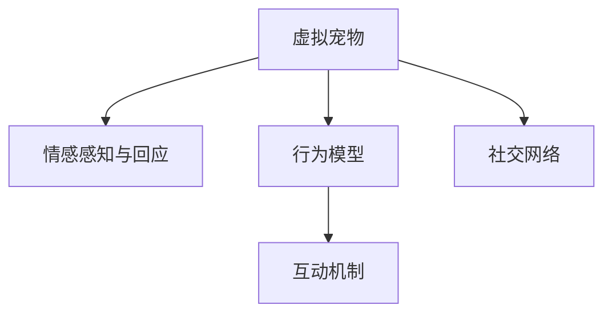

                 

# 元宇宙中的虚拟宠物：情感陪伴的新形式

## 1. 背景介绍

### 1.1 问题由来
随着虚拟现实(VR)、增强现实(AR)技术的成熟和普及，元宇宙(Metaverse)这一概念逐渐火热起来。元宇宙是一个由数字技术构建的虚拟世界，用户可以通过各种设备实时地与虚拟环境进行互动。在这个虚拟世界中，除了游戏、社交、办公等功能外，元宇宙也为情感陪伴提供了一种新的可能性。

虚拟宠物（Virtual Pets）作为一种沉浸式体验，已经在虚拟世界中展现出了巨大的魅力。它们不仅能陪伴用户，还能与用户进行互动，提供情感支持，甚至成为用户的朋友。虚拟宠物的出现，为元宇宙中的情感陪伴带来了一种全新的形式，也为技术开发者和用户体验设计者提供了广阔的探索空间。

### 1.2 问题核心关键点
虚拟宠物的开发和运营涉及多个核心问题：

- **模型构建**：如何设计虚拟宠物的行为模型，使其能够自然地与人交互？
- **互动体验**：如何设计丰富的互动机制，提升用户体验？
- **情感陪伴**：虚拟宠物如何感知和响应用户的情感，提供情感支持？
- **内容生成**：虚拟宠物如何在虚拟世界中获得多样化的行为和个性？
- **社交网络**：虚拟宠物如何与用户及其他宠物进行社交互动？

这些问题都需要综合考虑，才能打造出真正有意义的虚拟宠物。

### 1.3 问题研究意义
研究元宇宙中的虚拟宠物，对于推动虚拟世界的情感陪伴和社交互动，具有重要意义：

- **增强用户体验**：通过与虚拟宠物互动，为用户提供更多的沉浸式体验和情感支持。
- **促进社交**：虚拟宠物作为社交的桥梁，能够打破现实中的物理距离限制，促进跨地域、跨文化的交流。
- **丰富内容**：虚拟宠物在虚拟世界中的互动和行为，为元宇宙带来更丰富的内容。
- **推动技术发展**：虚拟宠物开发需要融合AI、图形渲染、交互设计等技术，推动相关技术的进一步发展。
- **探索元宇宙应用**：虚拟宠物为元宇宙中的应用探索提供了一个新的方向，具有重要的示范效应。

## 2. 核心概念与联系

### 2.1 核心概念概述

元宇宙中的虚拟宠物集成了多种技术，包括AI、自然语言处理(NLP)、计算机视觉、图形渲染等。其中，核心概念有：

- **虚拟宠物**：在虚拟世界中的数字化的动物，通常由AI驱动，具备自主行为和情感。
- **情感感知与回应**：虚拟宠物能够感知和响应用户的情感，提供情感支持。
- **行为模型**：描述虚拟宠物行为和决策的数学模型，基于心理学、行为学等理论。
- **互动机制**：虚拟宠物与用户之间的互动方式，如对话、动作等。
- **社交网络**：虚拟宠物之间的社交网络，支持虚拟宠物之间的互动和沟通。

这些概念通过以下Mermaid流程图展示：



这个流程图展示了虚拟宠物的各个核心概念及其相互关系：

1. 虚拟宠物通过行为模型进行决策，从而产生行为。
2. 行为模型受情感感知与回应的影响，能够感知并响应用户的情感。
3. 虚拟宠物通过互动机制与用户进行互动。
4. 社交网络使得虚拟宠物之间也能进行互动，丰富虚拟世界的内容。

## 3. 核心算法原理 & 具体操作步骤

### 3.1 算法原理概述

虚拟宠物的核心算法主要分为两个部分：行为模型的训练和情感感知与回应的实现。

**行为模型训练**：基于心理学和行为学的理论，构建虚拟宠物的行为模型。通过监督学习、强化学习等方法，对虚拟宠物的行为进行训练，使其能够自主地在虚拟世界中进行探索和学习。

**情感感知与回应**：利用NLP和AI技术，使虚拟宠物能够感知和响应用户的情感。通过情感分析、情绪识别等技术，将用户的情感状态转换为虚拟宠物的反应，提供情感支持。

### 3.2 算法步骤详解

**Step 1: 设计行为模型**

行为模型的设计主要包括以下几个步骤：

1. **定义虚拟宠物的行为空间**：根据虚拟宠物的特性，定义其在虚拟世界中的行为集合，如行走、跳跃、玩耍等。

2. **设计行为决策算法**：基于行为空间，设计虚拟宠物的行为决策算法。可以使用马尔科夫决策过程(MDP)、深度强化学习等方法，让虚拟宠物能够自主学习并优化行为策略。

3. **训练行为模型**：通过监督学习和强化学习等方法，训练虚拟宠物的行为模型，使其能够根据环境变化自主选择行为。

**Step 2: 实现情感感知与回应**

情感感知与回应的实现主要包括以下几个步骤：

1. **用户情感识别**：通过NLP技术，分析用户的语言、面部表情、语音等，识别用户的情感状态。

2. **情感状态转换**：将用户的情感状态转换为虚拟宠物的情感状态。例如，用户高兴时，虚拟宠物也表现出高兴的表情。

3. **行为生成**：根据虚拟宠物的情感状态，生成相应的行为反应。例如，虚拟宠物在高兴时跳跃，而在悲伤时则安静地坐着。

4. **交互反馈**：通过图形渲染技术，将虚拟宠物的行为和情感状态实时呈现给用户，形成反馈机制。

**Step 3: 设计和实现互动机制**

互动机制的设计主要包括以下几个步骤：

1. **对话生成**：设计虚拟宠物与用户之间的对话生成算法，使用NLP技术生成自然流畅的对话。

2. **动作生成**：设计虚拟宠物的动作生成算法，使用图形渲染技术生成逼真的动作。

3. **交互逻辑**：定义虚拟宠物与用户之间的交互逻辑，包括响应方式、触发条件等。

4. **社交网络构建**：设计虚拟宠物之间的社交网络，支持虚拟宠物之间的互动和沟通。

### 3.3 算法优缺点

虚拟宠物的算法具有以下优点：

- **沉浸式体验**：虚拟宠物能够与用户进行互动，提供沉浸式的情感陪伴体验。
- **灵活互动**：通过对话生成、动作生成等技术，提供丰富的互动方式，提升用户体验。
- **自主学习**：虚拟宠物通过行为模型和情感感知与回应算法，能够自主学习并优化行为策略。

同时，虚拟宠物的算法也存在以下缺点：

- **计算成本高**：虚拟宠物的情感感知与回应和行为生成，需要大量的计算资源。
- **模型复杂**：虚拟宠物的行为模型和情感感知与回应算法，需要复杂的算法和大量的训练数据。
- **交互延迟**：在实时互动中，如果模型响应速度不够快，可能会导致用户体验下降。

### 3.4 算法应用领域

虚拟宠物的核心算法已经在多个领域得到应用，例如：

- **虚拟现实游戏**：虚拟宠物在游戏中的应用，提供沉浸式的互动体验。
- **虚拟社交平台**：虚拟宠物在社交平台中的应用，增强用户之间的互动和沟通。
- **心理健康支持**：虚拟宠物在心理健康支持中的应用，提供情感陪伴和心理疏导。
- **教育培训**：虚拟宠物在教育培训中的应用，通过互动游戏提升学习兴趣和效果。
- **家庭陪伴**：虚拟宠物在家庭陪伴中的应用，提供情感支持和生活帮助。

## 4. 数学模型和公式 & 详细讲解 & 举例说明

### 4.1 数学模型构建

虚拟宠物的行为模型和情感感知与回应算法，可以通过以下数学模型进行描述：

**行为模型**：
- 定义虚拟宠物的行为空间 $\mathcal{B}$。
- 定义行为决策算法 $f: \mathcal{B} \rightarrow \mathcal{A}$，其中 $\mathcal{A}$ 为虚拟宠物的行为集合。
- 定义行为模型 $M: \mathcal{S} \rightarrow \mathcal{A}$，其中 $\mathcal{S}$ 为虚拟宠物所处的环境状态。

**情感感知与回应模型**：
- 定义用户的情感状态集合 $\mathcal{E}$。
- 定义虚拟宠物的情感状态集合 $\mathcal{F}$。
- 定义情感转换算法 $g: \mathcal{E} \rightarrow \mathcal{F}$。
- 定义行为生成算法 $h: \mathcal{F} \rightarrow \mathcal{A}$。

### 4.2 公式推导过程

**行为模型推导**：
- 假设虚拟宠物在状态 $s$ 时，行为 $a$ 的期望奖励为 $Q(s, a)$，则行为模型的目标函数为：
$$
\min_{M} \mathbb{E}[\sum_{t=0}^{\infty} \gamma^t Q(s_t, a_t)]
$$
其中 $\gamma$ 为折扣因子。

**情感感知与回应模型推导**：
- 假设用户的情感状态为 $e$，虚拟宠物的情感状态为 $f$，则情感转换算法的目标函数为：
$$
\min_{g} \mathbb{E}[\ell(e, f)]
$$
其中 $\ell$ 为损失函数，用于衡量情感转换的准确性。

**互动机制推导**：
- 假设虚拟宠物在状态 $s$ 时，用户的行为为 $u$，虚拟宠物的行为为 $a$，则互动机制的目标函数为：
$$
\min_{f} \mathbb{E}[\ell(u, a)]
$$
其中 $\ell$ 为损失函数，用于衡量互动的流畅性和自然度。

### 4.3 案例分析与讲解

**案例1: 虚拟宠物在虚拟现实游戏中的应用**

假设虚拟宠物在虚拟现实游戏中扮演伴侣角色。可以通过行为模型和情感感知与回应算法，实现虚拟宠物的行为和情感。

- **行为模型**：使用MDP模型，定义虚拟宠物的行为空间为 $\mathcal{B} = \{行走, 跳跃, 玩耍\}$。通过监督学习和强化学习，训练行为模型 $M$，使其能够根据环境变化自主选择行为。

- **情感感知与回应模型**：使用NLP技术，识别用户的语言、面部表情、语音等，识别用户的情感状态 $e$。通过情感转换算法 $g$，将用户的情感状态转换为虚拟宠物的情感状态 $f$。根据情感状态 $f$，使用行为生成算法 $h$，生成相应的行为反应 $a$。

- **互动机制**：设计对话生成算法，使用NLP技术生成自然流畅的对话。设计动作生成算法，使用图形渲染技术生成逼真的动作。定义互动逻辑，包括响应方式、触发条件等。

**案例2: 虚拟宠物在心理健康支持中的应用**

假设虚拟宠物在心理健康支持中扮演心理疏导者的角色。可以通过行为模型和情感感知与回应算法，实现虚拟宠物的行为和情感。

- **行为模型**：使用行为空间 $\mathcal{B} = \{安静, 安慰, 鼓励\}$，定义行为决策算法 $f$，训练行为模型 $M$，使其能够根据用户的情感状态自主选择行为。

- **情感感知与回应模型**：使用NLP技术，识别用户的语音、文字等，识别用户的情感状态 $e$。通过情感转换算法 $g$，将用户的情感状态转换为虚拟宠物的情感状态 $f$。根据情感状态 $f$，使用行为生成算法 $h$，生成相应的行为反应 $a$。

- **互动机制**：设计对话生成算法，生成自然流畅的对话。设计动作生成算法，生成逼真的动作。定义互动逻辑，包括响应方式、触发条件等。

## 5. 项目实践：代码实例和详细解释说明

### 5.1 开发环境搭建

在进行虚拟宠物开发前，我们需要准备好开发环境。以下是使用Python进行开发的环境配置流程：

1. 安装Anaconda：从官网下载并安装Anaconda，用于创建独立的Python环境。

2. 创建并激活虚拟环境：
```bash
conda create -n virtual_pet_env python=3.8 
conda activate virtual_pet_env
```

3. 安装PyTorch：根据CUDA版本，从官网获取对应的安装命令。例如：
```bash
conda install pytorch torchvision torchaudio cudatoolkit=11.1 -c pytorch -c conda-forge
```

4. 安装TensorFlow：
```bash
pip install tensorflow
```

5. 安装Numpy、Pandas等常用库：
```bash
pip install numpy pandas matplotlib scikit-learn tensorflow
```

完成上述步骤后，即可在`virtual_pet_env`环境中开始开发。

### 5.2 源代码详细实现

这里我们以一个简单的虚拟宠物为示例，介绍使用PyTorch进行开发的具体实现。

首先，定义虚拟宠物的行为模型：

```python
import torch
import torch.nn as nn

class BehaviorModel(nn.Module):
    def __init__(self, input_dim, output_dim):
        super(BehaviorModel, self).__init__()
        self.fc1 = nn.Linear(input_dim, 128)
        self.fc2 = nn.Linear(128, 32)
        self.fc3 = nn.Linear(32, output_dim)
    
    def forward(self, x):
        x = torch.relu(self.fc1(x))
        x = torch.relu(self.fc2(x))
        x = self.fc3(x)
        return x
```

然后，定义虚拟宠物的情感感知与回应模型：

```python
import torch
import torch.nn as nn

class EmotionModel(nn.Module):
    def __init__(self, input_dim, output_dim):
        super(EmotionModel, self).__init__()
        self.fc1 = nn.Linear(input_dim, 128)
        self.fc2 = nn.Linear(128, 64)
        self.fc3 = nn.Linear(64, output_dim)
    
    def forward(self, x):
        x = torch.relu(self.fc1(x))
        x = torch.relu(self.fc2(x))
        x = self.fc3(x)
        return x
```

接着，定义虚拟宠物的行为生成算法：

```python
import torch
import torch.nn as nn

class ActionModel(nn.Module):
    def __init__(self, input_dim, output_dim):
        super(ActionModel, self).__init__()
        self.fc1 = nn.Linear(input_dim, 128)
        self.fc2 = nn.Linear(128, 64)
        self.fc3 = nn.Linear(64, output_dim)
    
    def forward(self, x):
        x = torch.relu(self.fc1(x))
        x = torch.relu(self.fc2(x))
        x = self.fc3(x)
        return x
```

最后，定义虚拟宠物的互动机制：

```python
import torch
import torch.nn as nn

class InteractionModel(nn.Module):
    def __init__(self, input_dim, output_dim):
        super(InteractionModel, self).__init__()
        self.fc1 = nn.Linear(input_dim, 128)
        self.fc2 = nn.Linear(128, 64)
        self.fc3 = nn.Linear(64, output_dim)
    
    def forward(self, x):
        x = torch.relu(self.fc1(x))
        x = torch.relu(self.fc2(x))
        x = self.fc3(x)
        return x
```

### 5.3 代码解读与分析

这里我们详细解读一下关键代码的实现细节：

**BehaviorModel类**：
- `__init__`方法：初始化行为模型，定义三个全连接层。
- `forward`方法：前向传播，计算行为决策结果。

**EmotionModel类**：
- `__init__`方法：初始化情感感知与回应模型，定义三个全连接层。
- `forward`方法：前向传播，计算情感状态转换结果。

**ActionModel类**：
- `__init__`方法：初始化行为生成算法，定义三个全连接层。
- `forward`方法：前向传播，计算行为反应结果。

**InteractionModel类**：
- `__init__`方法：初始化互动机制，定义三个全连接层。
- `forward`方法：前向传播，计算互动响应结果。

这些类通过继承nn.Module，定义了各自的前向传播方法，可以在训练时通过反向传播更新模型参数。

## 6. 实际应用场景

### 6.1 虚拟现实游戏

在虚拟现实游戏中，虚拟宠物可以作为玩家的朋友，陪伴玩家进行冒险。游戏开发者可以利用虚拟宠物的行为模型和情感感知与回应算法，设计丰富的互动场景，提升玩家的沉浸式体验。

例如，虚拟宠物可以在游戏中扮演向导角色，根据玩家的状态和行为，生成相应的对话和动作，增强游戏的可玩性和趣味性。

### 6.2 心理健康支持

在心理健康支持中，虚拟宠物可以作为心理咨询师的助手，帮助患者进行心理疏导和情绪支持。心理咨询师可以利用虚拟宠物的行为模型和情感感知与回应算法，设计虚拟宠物的行为和互动，提升患者的互动体验和情感支持效果。

例如，虚拟宠物可以根据患者的语音、文字等，感知患者的情感状态，生成相应的安慰、鼓励等行为，帮助患者缓解情绪，增强心理健康效果。

### 6.3 虚拟社交平台

在虚拟社交平台上，虚拟宠物可以作为用户的社交伙伴，增强用户之间的互动和沟通。社交平台开发者可以利用虚拟宠物的行为模型和情感感知与回应算法，设计虚拟宠物的行为和互动，提升用户的社交体验和情感陪伴效果。

例如，虚拟宠物可以在社交平台上扮演角色，根据用户的互动行为，生成相应的对话和动作，增强用户的社交互动和情感连接。

## 7. 工具和资源推荐

### 7.1 学习资源推荐

为了帮助开发者系统掌握虚拟宠物的开发技术，这里推荐一些优质的学习资源：

1. **《元宇宙虚拟宠物开发手册》**：详细介绍了虚拟宠物的行为模型、情感感知与回应、互动机制等核心技术，适合入门学习。

2. **《AI在虚拟宠物中的应用》**：介绍AI技术在虚拟宠物中的应用，包括行为生成、情感识别、互动设计等，适合进阶学习。

3. **《虚拟宠物设计与实现》**：介绍虚拟宠物的建模、渲染、行为控制等技术，适合实用开发。

4. **《虚拟现实游戏开发》**：介绍虚拟现实游戏中的虚拟宠物设计、行为控制、互动设计等，适合游戏开发者。

5. **《虚拟社交平台开发》**：介绍虚拟社交平台中的虚拟宠物设计、行为控制、互动设计等，适合社交平台开发者。

6. **《虚拟宠物社交网络构建》**：介绍虚拟宠物之间的社交网络构建、互动设计等，适合社交平台开发者。

通过对这些资源的学习实践，相信你一定能够快速掌握虚拟宠物的开发技术，并用于解决实际的虚拟世界问题。

### 7.2 开发工具推荐

高效的开发离不开优秀的工具支持。以下是几款用于虚拟宠物开发的常用工具：

1. **PyTorch**：基于Python的开源深度学习框架，灵活动态的计算图，适合快速迭代研究。

2. **TensorFlow**：由Google主导开发的开源深度学习框架，生产部署方便，适合大规模工程应用。

3. **Numpy**：用于数值计算和科学计算的Python库，适合高性能科学计算。

4. **Pandas**：用于数据处理和分析的Python库，适合数据预处理和特征工程。

5. **Matplotlib**：用于数据可视化的Python库，适合生成图表和可视化展示。

6. **Sklearn**：用于机器学习的Python库，适合模型训练和评估。

7. **TensorBoard**：TensorFlow配套的可视化工具，可实时监测模型训练状态，并提供丰富的图表呈现方式。

合理利用这些工具，可以显著提升虚拟宠物的开发效率，加快创新迭代的步伐。

### 7.3 相关论文推荐

虚拟宠物的核心技术发展源于学界的持续研究。以下是几篇奠基性的相关论文，推荐阅读：

1. **《虚拟宠物的行为生成与交互设计》**：介绍虚拟宠物的行为生成和互动设计，涵盖行为模型、情感感知与回应、互动机制等核心技术。

2. **《情感识别与虚拟宠物的情感回应》**：介绍情感识别技术和虚拟宠物的情感回应算法，探讨虚拟宠物的情感支持能力。

3. **《虚拟宠物在虚拟现实游戏中的应用》**：介绍虚拟宠物在游戏中的应用，涵盖游戏设计、行为控制、互动设计等技术。

4. **《虚拟宠物在心理健康支持中的应用》**：介绍虚拟宠物在心理健康支持中的应用，探讨虚拟宠物的行为模型和情感感知与回应算法。

5. **《虚拟宠物在虚拟社交平台中的应用》**：介绍虚拟宠物在社交平台中的应用，探讨虚拟宠物的社交网络构建和互动设计。

这些论文代表了大语言模型微调技术的发展脉络。通过学习这些前沿成果，可以帮助研究者把握学科前进方向，激发更多的创新灵感。

## 8. 总结：未来发展趋势与挑战

### 8.1 总结

本文对元宇宙中的虚拟宠物进行了全面系统的介绍。首先阐述了虚拟宠物的研究背景和意义，明确了虚拟宠物在虚拟世界中的情感陪伴和互动功能。其次，从原理到实践，详细讲解了虚拟宠物的行为模型、情感感知与回应算法等核心技术，给出了虚拟宠物的代码实例和详细解释说明。同时，本文还广泛探讨了虚拟宠物在虚拟现实游戏、心理健康支持、虚拟社交平台等多个领域的应用前景，展示了虚拟宠物的巨大潜力。此外，本文精选了虚拟宠物开发的各类学习资源，力求为开发者提供全方位的技术指引。

通过本文的系统梳理，可以看到，虚拟宠物在元宇宙中的应用，为情感陪伴和社交互动提供了全新的可能性，为NLP技术的发展带来了新的方向。未来，伴随元宇宙技术的持续演进，虚拟宠物必将在更广泛的场景中得到应用，为虚拟世界的情感陪伴和社交互动带来深刻的变革。

### 8.2 未来发展趋势

展望未来，虚拟宠物技术将呈现以下几个发展趋势：

1. **多样性增强**：虚拟宠物的行为和个性将更加多样化和丰富，能够适应更多样的应用场景。

2. **交互深度提升**：虚拟宠物的情感感知与回应算法将更加准确和自然，提供更深入的情感支持。

3. **环境适应性增强**：虚拟宠物将能够适应更加复杂和多样化的虚拟环境，提供更丰富的互动体验。

4. **多模态融合**：虚拟宠物将能够融合视觉、语音、动作等多种模态信息，提供更加全面的互动体验。

5. **跨平台支持**：虚拟宠物将在虚拟现实、增强现实、社交平台等多个平台上得到广泛应用，提供更加灵活的互动体验。

6. **多角色设计**：虚拟宠物将不再局限于单一角色，能够扮演向导、朋友、教练等多种角色，满足不同用户的需求。

7. **智能行为优化**：虚拟宠物的行为模型和互动算法将更加智能化和高效，能够自动优化行为策略，提升用户体验。

以上趋势凸显了虚拟宠物技术的广阔前景。这些方向的探索发展，必将进一步提升虚拟宠物的互动体验和情感支持能力，为元宇宙的情感陪伴和社交互动带来更多创新。

### 8.3 面临的挑战

尽管虚拟宠物技术已经取得了一定的进展，但在迈向更加智能化、普适化应用的过程中，它仍面临着诸多挑战：

1. **计算成本高**：虚拟宠物的情感感知与回应和行为生成，需要大量的计算资源。如何在不增加计算成本的情况下提升性能，是一个重要问题。

2. **模型复杂度高**：虚拟宠物的行为模型和情感感知与回应算法，需要复杂的算法和大量的训练数据。如何在保证性能的前提下，降低模型复杂度，也是一个重要问题。

3. **互动延迟**：在实时互动中，如果模型响应速度不够快，可能会导致用户体验下降。如何优化模型性能，降低延迟，是一个重要问题。

4. **情感感知准确性**：虚拟宠物的情感感知与回应算法，需要准确识别用户的情感状态，才能提供有效的情感支持。如何在不同应用场景中提升情感识别的准确性，是一个重要问题。

5. **跨平台兼容性**：虚拟宠物需要在多个平台和设备上得到广泛应用，需要考虑跨平台兼容性和性能优化。

6. **用户体验优化**：虚拟宠物的互动体验需要不断优化，提升用户的沉浸感和互动体验。如何优化互动机制和行为设计，是一个重要问题。

这些挑战需要研究者和开发者不断探索和优化，才能实现虚拟宠物技术的突破和发展。

### 8.4 研究展望

面对虚拟宠物技术所面临的挑战，未来的研究需要在以下几个方面寻求新的突破：

1. **提升情感感知准确性**：通过更高级的情感识别算法，提高虚拟宠物对用户情感的感知能力。

2. **降低计算成本**：通过模型压缩、量化等技术，降低虚拟宠物的计算成本，提升性能。

3. **优化互动机制**：通过更自然流畅的对话生成算法和逼真的动作生成算法，提升虚拟宠物的互动体验。

4. **增强行为优化能力**：通过更智能的行为决策算法，提升虚拟宠物的行为优化能力，提高用户体验。

5. **多模态融合**：通过融合视觉、语音、动作等多种模态信息，提升虚拟宠物的互动体验。

6. **跨平台兼容性**：通过统一的模型接口和协议，实现虚拟宠物在多个平台上的兼容性和性能优化。

7. **用户个性化定制**：通过用户数据和反馈，实现虚拟宠物的个性化定制和优化，提升用户体验。

这些研究方向的探索，必将引领虚拟宠物技术迈向更高的台阶，为元宇宙的情感陪伴和社交互动带来更多创新。面向未来，虚拟宠物技术还需要与其他人工智能技术进行更深入的融合，如自然语言处理、计算机视觉等，多路径协同发力，共同推动虚拟宠物技术的进步。只有勇于创新、敢于突破，才能不断拓展虚拟宠物技术的边界，让虚拟宠物在虚拟世界中更好地服务于人类。

## 9. 附录：常见问题与解答

**Q1：虚拟宠物的行为模型是如何设计的？**

A: 虚拟宠物的行为模型设计主要包括以下几个步骤：

1. **定义行为空间**：根据虚拟宠物的特性，定义其在虚拟世界中的行为集合，如行走、跳跃、玩耍等。

2. **设计行为决策算法**：基于行为空间，设计虚拟宠物的行为决策算法。可以使用马尔科夫决策过程(MDP)、深度强化学习等方法，让虚拟宠物能够自主学习并优化行为策略。

3. **训练行为模型**：通过监督学习和强化学习等方法，训练行为模型，使其能够根据环境变化自主选择行为。

**Q2：虚拟宠物的情感感知与回应算法是如何实现的？**

A: 虚拟宠物的情感感知与回应算法主要包括以下几个步骤：

1. **用户情感识别**：通过NLP技术，分析用户的语言、面部表情、语音等，识别用户的情感状态。

2. **情感状态转换**：将用户的情感状态转换为虚拟宠物的情感状态。例如，用户高兴时，虚拟宠物也表现出高兴的表情。

3. **行为生成**：根据虚拟宠物的情感状态，生成相应的行为反应。例如，虚拟宠物在高兴时跳跃，而在悲伤时则安静地坐着。

4. **交互反馈**：通过图形渲染技术，将虚拟宠物的行为和情感状态实时呈现给用户，形成反馈机制。

**Q3：虚拟宠物在虚拟现实游戏中的应用需要注意哪些问题？**

A: 虚拟宠物在虚拟现实游戏中的应用需要注意以下几个问题：

1. **互动场景设计**：设计丰富的互动场景，提升玩家的沉浸式体验。

2. **行为控制**：设计逼真的行为控制算法，提升虚拟宠物的动作表现。

3. **情感互动**：设计自然流畅的情感互动机制，增强玩家的情感陪伴体验。

4. **多用户交互**：设计多用户互动机制，支持玩家之间的互动和沟通。

5. **数据优化**：优化数据处理和存储，提升系统的运行效率和性能。

6. **用户反馈**：收集用户反馈，不断优化虚拟宠物的行为和互动机制。

**Q4：虚拟宠物在心理健康支持中的应用需要注意哪些问题？**

A: 虚拟宠物在心理健康支持中的应用需要注意以下几个问题：

1. **情感识别准确性**：提高情感识别算法的准确性，确保虚拟宠物能够准确感知用户的情感状态。

2. **情感响应效果**：设计有效的情感响应算法，增强虚拟宠物的情感支持能力。

3. **互动机制设计**：设计自然流畅的互动机制，提升用户的互动体验。

4. **隐私保护**：保护用户隐私，确保用户数据的安全和隐私。

5. **数据质量**：确保情感识别数据和行为数据的质量，提升算法的准确性和可靠性。

6. **用户参与度**：提高用户的参与度和互动性，增强虚拟宠物的陪伴效果。

**Q5：虚拟宠物在虚拟社交平台中的应用需要注意哪些问题？**

A: 虚拟宠物在虚拟社交平台中的应用需要注意以下几个问题：

1. **社交网络构建**：设计丰富的社交网络机制，支持虚拟宠物之间的互动和沟通。

2. **互动机制设计**：设计自然流畅的互动机制，提升用户的社交互动体验。

3. **行为多样性**：设计多样化的行为策略，提升虚拟宠物的个性化和趣味性。

4. **用户体验优化**：优化用户体验，提升用户的沉浸式体验和情感陪伴效果。

5. **跨平台兼容性**：确保虚拟宠物在多个平台上的兼容性和性能优化。

6. **用户反馈收集**：收集用户反馈，不断优化虚拟宠物的行为和互动机制。

这些问题的解决将有助于虚拟宠物在元宇宙中更好地服务于人类，提供更加丰富的情感陪伴和社交互动体验。

---

作者：禅与计算机程序设计艺术 / Zen and the Art of Computer Programming

