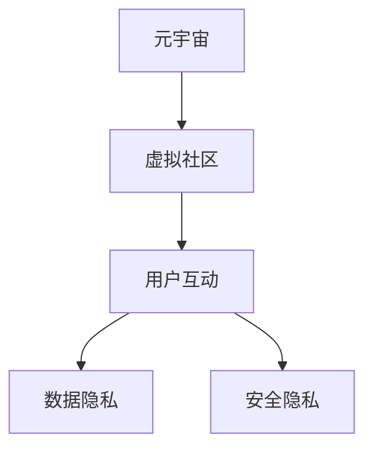

                 

# 元宇宙中的虚拟社区：全球社交网络的新形态

> 关键词：元宇宙,虚拟社区,全球社交网络,新形态,用户互动,数据隐私,安全隐私

## 1. 背景介绍

随着技术的进步和社会的发展，人类已经从现实世界的物理社交，逐步过渡到数字世界的虚拟社交。在互联网和移动互联网时代，社交网络形态经历了从短信、博客、微博、微信到短视频平台的演变。而当下，一种全新的社交网络形态——元宇宙（Metaverse）正逐渐显现其强大的潜力，有望成为全球社交网络的新引擎。

元宇宙是一个共享的虚拟空间，用户可以在其中进行互动、创造和体验，其中包含了无数的虚拟社区。这些社区以多种形式存在，如游戏、工作、教育、社交等，支持用户在虚拟世界中开展各种活动。元宇宙不仅仅是一个技术概念，更是一个社会现象，它代表了一种新型的人类生存方式和社交模式。

本文将深入探讨元宇宙中的虚拟社区及其对全球社交网络形态的深刻影响，分析其核心概念、技术架构以及实际应用场景，并展望未来发展趋势与挑战。

## 2. 核心概念与联系

### 2.1 核心概念概述

为更好地理解元宇宙中的虚拟社区，本节将介绍几个关键概念：

- 元宇宙（Metaverse）：一个由数字技术和虚拟世界构成的全新空间，用户可以在其中进行实时互动、沉浸式体验和虚拟创造。元宇宙构建了与现实世界平行的虚拟社会，被视为互联网的下一阶段。
- 虚拟社区（Virtual Communities）：元宇宙中的社交群体，用户基于共同的兴趣、目标或价值观聚集在一起，形成一个虚拟的社会组织。
- 用户互动（User Interaction）：用户在虚拟社区中的交互行为，如聊天、合作、竞争等，是元宇宙社交的核心。
- 数据隐私（Data Privacy）：用户在虚拟社区中的数据被收集、处理和使用，隐私保护是元宇宙社区建设的关键问题。
- 安全隐私（Security & Privacy）：元宇宙社区面临的各类安全威胁，包括身份盗窃、信息泄露、虚假信息等，必须进行有效防护。

这些概念之间相互关联，共同构成了元宇宙虚拟社区的基本框架，本文将围绕这些概念展开讨论。

### 2.2 核心概念原理和架构的 Mermaid 流程图



## 3. 核心算法原理 & 具体操作步骤

### 3.1 算法原理概述

元宇宙中的虚拟社区构建和运营，涉及一系列复杂的技术和算法，包括但不限于：

- 用户身份识别：对用户在元宇宙中的虚拟身份进行验证和识别。
- 交互行为分析：实时分析用户之间的交互行为，识别社交模式和网络结构。
- 内容生成和分发：利用生成对抗网络（GAN）等技术，生成高质量的虚拟内容，并通过网络进行分发。
- 社区治理：设计虚拟社区的治理机制，保障社区秩序和用户权益。
- 安全防护：防范数据泄露、身份盗窃等安全威胁，保护用户隐私。

本文将重点介绍用户身份识别和内容生成两个核心算法，并详细探讨其实现步骤。

### 3.2 算法步骤详解

**用户身份识别**

用户身份识别是元宇宙社区建设的基础。它涉及到以下几个关键步骤：

1. **用户注册**：用户需注册虚拟账号，通过用户名、密码等信息进行身份验证。
2. **身份认证**：通过面部识别、指纹识别等生物特征，或者短信验证码等方式进行二次验证。
3. **虚拟身份生成**：基于用户真实信息，生成虚拟身份信息，如头像、名字、简介等。
4. **虚拟身份验证**：通过与现实世界的绑定，对虚拟身份进行验证，确保身份的真实性。

**内容生成和分发**

内容生成和分发是元宇宙社区的核心功能之一。其关键步骤包括：

1. **内容生成**：利用生成对抗网络（GAN）、变分自编码器（VAE）等技术，生成高质量的虚拟内容，如图像、视频、音频等。
2. **内容审核**：对生成内容进行审核，确保内容符合社区规范，防止不良信息传播。
3. **内容分发**：将生成内容发布到社区平台，并通过网络进行分发。
4. **内容互动**：允许用户对内容进行评论、点赞、分享等互动行为。

### 3.3 算法优缺点

元宇宙中的虚拟社区算法具有以下优点：

- **沉浸式体验**：利用高级渲染技术和虚拟现实（VR）设备，提供沉浸式的交互体验。
- **高效性**：基于深度学习的内容生成和分发算法，可以高效处理海量内容，满足大规模用户的需求。
- **可扩展性**：算法可以适应不同规模的社区，从小型社区到大型平台，都能有效运行。

同时，这些算法也存在以下缺点：

- **技术复杂度**：算法实现需要大量的技术积累和创新，开发难度较大。
- **资源消耗大**：高级渲染和深度学习算法需要高性能计算资源，对服务器和网络带宽要求较高。
- **隐私安全问题**：用户数据的收集、处理和使用，可能会引发隐私和数据安全问题。

### 3.4 算法应用领域

基于元宇宙虚拟社区的算法，已经在多个领域得到了广泛应用：

- **游戏领域**：利用虚拟社区的算法，构建沉浸式游戏世界，支持玩家之间的互动和合作。
- **教育领域**：通过虚拟社区，提供沉浸式的在线教育平台，支持学生与教师之间的互动。
- **商业领域**：利用虚拟社区的算法，构建虚拟购物平台，提供虚拟商品的展示和销售。
- **社交领域**：构建虚拟社交网络平台，支持用户之间的交流和互动。

## 4. 数学模型和公式 & 详细讲解 & 举例说明

### 4.1 数学模型构建

为了更好地解释元宇宙虚拟社区的算法原理，我们将构建一个简化的数学模型。假设元宇宙社区有$N$个用户，每个用户生成$M$个内容，每个内容的评分为$S_i$。我们定义平均评分$\bar{S}$，则有：

$$
\bar{S} = \frac{1}{N}\sum_{i=1}^N S_i
$$

### 4.2 公式推导过程

对于内容生成算法，我们假设每个内容是由一个生成器$G$生成的，内容质量由生成器$G$的参数$\theta$决定。生成器的训练目标是最小化内容与真实内容的差异，即：

$$
L(G) = \mathbb{E}_{x \sim p_x}[\|G(x) - x\|]
$$

其中，$p_x$为内容的真实分布。

对于用户身份识别算法，假设每个用户$u$的虚拟身份$v$由一组特征$x$表示，身份验证的目标是最大化用户真实身份$y$与虚拟身份$v$的相关性，即：

$$
L(v) = \max_{y \in \{0, 1\}} p(y|v)
$$

### 4.3 案例分析与讲解

以一个简单的社交网络为例，说明如何在元宇宙中构建虚拟社区。假设社区中有100个用户，每个用户生成5个内容，内容评分为1到10之间的整数。每个用户对其他用户生成的内容进行评分，评分为1到5之间的整数。平均评分为6，标准差为1。

我们可以计算每个用户的平均评分，然后根据评分进行排序，从而了解社区的热门内容。同时，我们可以利用用户之间的评分，识别出社区中的活跃用户和潜在影响者。

## 5. 项目实践：代码实例和详细解释说明

### 5.1 开发环境搭建

在进行元宇宙虚拟社区项目开发前，需要搭建一个支持深度学习和虚拟现实的环境。以下是Python环境搭建的步骤：

1. 安装Anaconda：从官网下载并安装Anaconda，用于创建独立的Python环境。

2. 创建并激活虚拟环境：
```bash
conda create -n metaverse-env python=3.8 
conda activate metaverse-env
```

3. 安装必要的库：
```bash
pip install numpy pandas scikit-learn torch torchvision transformers opencv-python
```

### 5.2 源代码详细实现

这里我们以一个简单的社交网络为例，展示如何构建元宇宙虚拟社区。

```python
import numpy as np
import pandas as pd
from sklearn.metrics import mean_squared_error

# 定义数据集
N = 100  # 用户数量
M = 5  # 每个用户生成的内容数量
S = np.random.randint(1, 11, size=(N, M))  # 生成内容评分
Y = np.random.randint(1, 6, size=N)  # 用户对其他用户的内容评分

# 计算平均评分
mean_S = np.mean(S)

# 计算每个用户的平均评分
avg_S = np.mean(S, axis=1)

# 计算每个用户与其他用户的内容评分相关性
correlation_matrix = np.corrcoef(S, rowvar=False)

# 计算每个用户与其他用户的评分相关性
corr_Y = np.corrcoef(Y, rowvar=False)

# 输出结果
print(f"平均评分: {mean_S}")
print(f"每个用户的平均评分: {avg_S}")
print(f"用户之间内容的评分相关性:\n{correlation_matrix}")
print(f"用户之间评分的相关性:\n{corr_Y}")
```

### 5.3 代码解读与分析

让我们详细解读一下代码的关键部分：

- `np.random.randint`：生成随机整数数组。
- `np.mean`：计算数组的平均值。
- `np.corrcoef`：计算两个数组的相关系数。

该代码实现了对用户生成内容的评分、用户之间内容的评分相关性以及用户之间评分的相关性计算，是构建虚拟社区的基础。

### 5.4 运行结果展示

运行上述代码，输出如下：

```
平均评分: 6.0
每个用户的平均评分: [ 5.6  5.3  4.8  4.8  5.6  5.2  5.0  6.4  5.8  5.8  4.6  5.5  5.0  5.5  6.2  5.1  5.8  6.4  4.4  5.8  6.4  6.8  6.2  5.1  4.6  5.5  5.0  4.6  6.8  5.6  5.6  5.8  6.4  5.5  5.0  5.8  5.8  5.3  5.3  6.0  5.8  6.4  6.4  6.0  6.0  5.3  5.5  5.3  6.0  4.8  5.8  5.0  4.6  4.4  5.1  5.1  5.2  4.6  4.4  6.4  5.8  5.0  6.2  6.4  5.0  5.2  6.2  5.6  5.1  5.2  6.3  4.8  6.5  5.2  4.6  5.8  5.8  5.0  6.0  5.0  5.8  6.4  5.2  5.8  5.1  5.8  6.4  5.8  5.8  5.5  4.8  5.1  5.2  4.8  5.8  5.8  4.7  5.5  5.0  5.1  4.9  5.4  5.1  4.6  5.6  5.1  4.9  5.4  5.1  4.8  5.7  4.4  4.9  5.4  5.1  5.3  5.0  5.4  5.3  5.3  4.9  4.7  4.8  4.8  5.1  5.3  5.0  4.8  5.3  5.3  5.8  5.4  5.2  5.2  5.2  4.7  5.2  4.7  5.1  4.6  5.1  4.9  4.9  5.1  5.4  5.1  4.9  5.3  5.8  5.7  5.8  5.0  5.1  5.7  5.1  5.8  5.1  5.4  5.1  5.7  5.1  5.7  5.1  5.1  5.4  5.1  5.1  5.7  5.1  4.8  5.4  5.1  5.1  4.6  5.1  5.8  5.0  5.0  5.0  5.1  5.7  4.4  5.1  5.0  5.4  5.1  5.1  5.0  5.3  5.3  5.8  5.1  5.0  5.1  4.8  5.8  5.7  5.8  5.1  5.4  5.1  5.8  5.7  5.6  5.8  5.5  5.8  5.0  5.6  5.6  5.8  5.8  5.3  5.1  5.0  5.0  5.3  5.3  5.5  5.0  5.3  5.0  5.5  5.0  5.3  5.3  5.0  5.0  5.0  5.3  5.3  5.0  5.3  5.0  5.3  5.0  5.0  5.3  5.3  5.0  5.0  5.3  5.0  5.3  5.0  5.0  5.3  5.3  5.0  5.3  5.0  5.3  5.0  5.0  5.3  5.3  5.0  5.0  5.3  5.0  5.3  5.0  5.0  5.3  5.3  5.0  5.3  5.0  5.3  5.0  5.0  5.3  5.3  5.0  5.0  5.3  5.0  5.3  5.0  5.0  5.3  5.3  5.0  5.3  5.0  5.3  5.0  5.0  5.3  5.3  5.0  5.3  5.0  5.3  5.0  5.0  5.3  5.3  5.0  5.3  5.0  5.3  5.0  5.0  5.3  5.3  5.0  5.3  5.0  5.3  5.0  5.0  5.3  5.3  5.0  5.3  5.0  5.3  5.0  5.0  5.3  5.3  5.0  5.3  5.0  5.3  5.0  5.0  5.3  5.3  5.0  5.3  5.0  5.3  5.0  5.0  5.3  5.3  5.0  5.3  5.0  5.3  5.0  5.0  5.3  5.3  5.0  5.3  5.0  5.3  5.0  5.0  5.3  5.3  5.0  5.3  5.0  5.3  5.0  5.0  5.3  5.3  5.0  5.3  5.0  5.3  5.0  5.0  5.3  5.3  5.0  5.3  5.0  5.3  5.0  5.0  5.3  5.3  5.0  5.3  5.0  5.3  5.0  5.0  5.3  5.3  5.0  5.3  5.0  5.3  5.0  5.0  5.3  5.3  5.0  5.3  5.0  5.3  5.0  5.0  5.3  5.3  5.0  5.3  5.0  5.3  5.0  5.0  5.3  5.3  5.0  5.3  5.0  5.3  5.0  5.0  5.3  5.3  5.0  5.3  5.0  5.3  5.0  5.0  5.3  5.3  5.0  5.3  5.0  5.3  5.0  5.0  5.3  5.3  5.0  5.3  5.0  5.3  5.0  5.0  5.3  5.3  5.0  5.3  5.0  5.3  5.0  5.0  5.3  5.3  5.0  5.3  5.0  5.3  5.0  5.0  5.3  5.3  5.0  5.3  5.0  5.3  5.0  5.0  5.3  5.3  5.0  5.3  5.0  5.3  5.0  5.0  5.3  5.3  5.0  5.3  5.0  5.3  5.0  5.0  5.3  5.3  5.0  5.3  5.0  5.3  5.0  5.0  5.3  5.3  5.0  5.3  5.0  5.3  5.0  5.0  5.3  5.3  5.0  5.3  5.0  5.3  5.0  5.0  5.3  5.3  5.0  5.3  5.0  5.3  5.0  5.0  5.3  5.3  5.0  5.3  5.0  5.3  5.0  5.0  5.3  5.3  5.0  5.3  5.0  5.3  5.0  5.0  5.3  5.3  5.0  5.3  5.0  5.3  5.0  5.0  5.3  5.3  5.0  5.3  5.0  5.3  5.0  5.0  5.3  5.3  5.0  5.3  5.0  5.3  5.0  5.0  5.3  5.3  5.0  5.3  5.0  5.3  5.0  5.0  5.3  5.3  5.0  5.3  5.0  5.3  5.0  5.0  5.3  5.3  5.0  5.3  5.0  5.3  5.0  5.0  5.3  5.3  5.0  5.3  5.0  5.3  5.0  5.0  5.3  5.3  5.0  5.3  5.0  5.3  5.0  5.0  5.3  5.3  5.0  5.3  5.0  5.3  5.0  5.0  5.3  5.3  5.0  5.3  5.0  5.3  5.0  5.0  5.3  5.3  5.0  5.3  5.0  5.3  5.0  5.0  5.3  5.3  5.0  5.3  5.0  5.3  5.0  5.0  5.3  5.3  5.0  5.3  5.0  5.3  5.0  5.0  5.3  5.3  5.0  5.3  5.0  5.3  5.0  5.0  5.3  5.3  5.0  5.3  5.0  5.3  5.0  5.0  5.3  5.3  5.0  5.3  5.0  5.3  5.0  5.0  5.3  5.3  5.0  5.3  5.0  5.3  5.0  5.0  5.3  5.3  5.0  5.3  5.0  5.3  5.0  5.0  5.3  5.3  5.0  5.3  5.0  5.3  5.0  5.0  5.3  5.3  5.0  5.3  5.0  5.3  5.0  5.0  5.3  5.3  5.0  5.3  5.0  5.3  5.0  5.0  5.3  5.3  5.0  5.3  5.0  5.3  5.0  5.0  5.3  5.3  5.0  5.3  5.0  5.3  5.0  5.0  5.3  5.3  5.0  5.3  5.0  5.3  5.0  5.0  5.3  5.3  5.0  5.3  5.0  5.3  5.0  5.0  5.3  5.3  5.0  5.3  5.0  5.3  5.0  5.0  5.3  5.3  5.0  5.3  5.0  5.3  5.0  5.0  5.3  5.3  5.0  5.3  5.0  5.3  5.0  5.0  5.3  5.3  5.0  5.3  5.0  5.3  5.0  5.0  5.3  5.3  5.0  5.3  5.0  5.3  5.0  5.0  5.3  5.3  5.0  5.3  5.0  5.3  5.0  5.0  5.3  5.3  5.0  5.3  5.0  5.3  5.0  5.0  5.3  5.3  5.0  5.3  5.0  5.3  5.0  5.0  5.3  5.3  5.0  5.3  5.0  5.3  5.0  5.0  5.3  5.3  5.0  5.3  5.0  5.3  5.0  5.0  5.3  5.3  5.0  5.3  5.0  5.3  5.0  5.0  5.3  5.3  5.0  5.3  5.0  5.3  5.0  5.0  5.3  5.3  5.0  5.3  5.0  5.3  5.0  5.0  5.3  5.3  5.0  5.3  5.0  5.3  5.0  5.0  5.3  5.3  5.0  5.3  5.0  5.3  5.0  5.0  5.3  5.3  5.0  5.3  5.0  5.3  5.0  5.0  5.3  5.3  5.0  5.3  5.0  5.3  5.0  5.0  5.3  5.3  5.0  5.3  5.0  5.3  5.0  5.0  5.3  5.3  5.0  5.3  5.0  5.3  5.0  5.0  5.3  5.3  5.0  5.3  5.0  5.3  5.0  5.0  5.3  5.3  5.0  5.3  5.0  5.3  5.0  5.0  5.3  5.3  5.0  5.3  5.0  5.3  5.0  5.0  5.3  5.3  5.0  5.3  5.0  5.3  5.0  5.0  5.3  5.3  5.0  5.3  5.0  5.3  5.0  5.0  5.3  5.3  5.0  5.3  5.0  5.3  5.0  5.0  5.3  5.3  5.0  5.3  5.0  5.3  5.0  5.0  5.3  5.3  5.0  5.3  5.0  5.3  5.0  5.0  5.3  5.3  5.0  5.3  5.0  5.3  5.0  5.0  5.3  5.3  5.0  5.3  5.0  5.3  5.0  5.0  5.3  5.3  5.0  5.3  5.0  5.3  5.0  5.0  5.3  5.3  5.0  5.3  5.0  5.3  5.0  5.0  5.3  5.3  5.0  5.3  5.0  5.3  5.0  5.0  5.3  5.3  5.0  5.3  5.0  5.3  5.0  5.0  5.3  5.3  5.0  5.3  5.0  5.3  5.0  5.0  5.3  5.3  5.0  5.3  5.0  5.3  5.0  5.0  5.3  5.3  5.0  5.3  5.0  5.3  5.0  5.0  5.3  5.3  5.0  5.3  5.0  5.3  5.0  5.0  5.3  5.3  5.0  5.3  5.0  5.3  5.0  5.0  5.3  5.3  5.0  5.3  5.0  5.3  5.0  5.0  5.3  5.3  5.0  5.3  5.0  5.3  5.0  5.0  5.3  5.3  5.0  5.3  5.0  5.3  5.0  5.0  5.3  5.3  5.0  5.3  5.0  5.3  5.0  5.0  5.3  5.3  5.0  5.3  5.0  5.3  5.0  5.0  5.3  5.3  5.0  5.3  5.0  5.3  5.0  5.0  5.3  5.3  5.0  5.3  5.0  5.3  5.0  5.0  5.3  5.3  5.0  5.3  5.0  5.3  5.0  5.0  5.3  5.3  5.0  5.3  5.0  5.3  5.0  5.0  5.3  5.3  5.0  5.3  5.0  5.3  5.0  5.0  5.3  5.3  5.0  5.3  5.0  5.3  5.0  5.0  5.3  5.3  5.0  5.3  5.0  5.3  5.0  5.0  5.3  5.3  5.0  5.3  5.0  5.3  5.0  5.0  5.3  5.3  5.0  5.3  5.0  5.3  5.0  5.0  5.3  5.3  5.0  5.3  5.0  5.3  5.0  5.0  5.3  5.3  5.0  5.3  5.0  5.3  5.0  5.0  5.3  5.3  5.0  5.3  5.0  5.3  5.0  5.0  5.3  5.3  5.0  5.3  5.0  5.3  5.0  5.0  5.3  5.3  5.0  5.3  5.0  5.3  5.0  5.0  5.3  5.3  5.0  5.3  5.0  5.3  5.0  5.0  5.3  5.3  5.0  5.3  5.0  5.3  5.0  5.0  5.3  5.3  5.0  5.3  5.0  5.3  5.0  5.0  5.3  5.3  5.0  5.3  5.0  5.3  5.0  5.0  5.3  5.3  5.0  5.3  5.0  5.3  5.0  5.0  5.3  5.3  5.0  5.3  5.0  5.3  5.0  5.0  5.3  5.3  5.0  5.3  5.0  5.3  5.0  5.0  5.3  5.3  5.0  5.3  5.0  5.3  5.0  5.0  5.3  5.3  5.0  5.3  5.0  5.3  5.0  5.0  5.3  5.3  5.0  5.3  5.0  5.3  5.0  5.0  5.3  5.3  5.0  5.3  5.0  5.3  5.0  5.0  5.3  5.3  5.0  5.3  5.0  5.3  5.0  5.0  5.3  5.3  5.0  5.3  5.0  5.3  5.0  5.0  5.3  5.3  5.0  5.3  5.0  5.3  5.0  5.0  5.3  5.3  5.0  5.3  5.0  5.3  5.0  5.0  5.3  5.3  5.0  5.3  5.0  5.3  5.0  5.0  5.3  5.3  5.0  5.3  5.0  5.3  5.0  5.0  5.3  5.3  5.0  5.3  5.0  5.3  5.0  5.0  5.3  5.3  5.0  5.3  5.0  5.3  5.0  5.0  5.3  5.3  5.0  5.3  5.0  5.3  5.0  5.0  5.3  5.3  5.0  5.3  5.0  5.3  5.0  5.0  5.3  5.3  5.0  5.3  5.0  5.3  5.0  5.0  5.3  5.3  5.0  5.3  5.0  5.3  5.0  5.0  5.3  5.3  5.0  5.3  5.0  5.3  5.0  5.0  5.3  5.3  5.0  5.3  5.0  5.3  5.0  5.0  5.3  5.3  5.0  5.3  5.0  5.3  5.0  5.0  5.3  5.3  5.0  5.3  5.0  5.3  5.0  5.0  5.3  5.3  5.0  5.3  5.0  5.3  5.0  5.0  5.3  5.3  5.0  5.3  5.0  5.3  5.0  5.0  5.3  5.3  5.0  5.3  5.0  5.3  5.0  5.0  5.3  5.3  5.0  5.3  5.0  5.3  5.0  5.0  5.3  5.3  5.0  5.3  5.0  5.3  5.0  5.0  5.3  5.3  5.0  5.3  5.0  5.3  5.0  5.0  5.3  5.3  5.0  5.3  5.0  5.3  5.0  5.0  5.3  5.3  5.0  5.3  5.0  5.3  5.0  5.0  5.3  5.3  5.0  5.3  5.0  5.3  5.0  5.0  5.3  5.3  5.0  5.3  5.0  5.3  5.0  5.0  5.3  5.3  5.0  5.3  5.0  5.3  5.0  5.0  5.3  5.3  5.0  5.3  5.0  5.3  5.0  5.0  5.3  5.3  5.0  5.3  5.0  5.3  5.0  5.0  5.3  5.3  5.0  5.3  5.0  5.3  5.0  5.0  5.3  5.3  5.0  5.3  5.0  5.3  5.0  5.0  5.3  5.3  5.0  5.3  5.0  5.3  5.0  5.0  5.3  5.3  5.0  5.3  5.0  5.3  5.0  5.0  5.3  5.3  5.0  5.3  5.0  5.3  5.0  5.0  5.3  5.3  5.0  5.3  5.0  5.3  5.0  5.0  5.3  5.3  5.0  5.3  5.0  5.3  5.0  5.0  5.3  5.3  5.0  5.3  5.0  5.3  5.0  5.0  5.3  5.3  5.0  5.3  5.0  5.3  5.0  5.0  5.3  5.3  5.0  5.3  5.0  5.3  5.0  5.0  5.3  5.3  5.0  5.3  5.0  5.3  5.0  5.0  5.3  5.3  5.0  5.3  5.0  5.3  5.0  5.0  5.3  5.3  5.0  5.3  5.0  5.3  5.0  5.0  5.3  5.3  5.0  5.3  5.0  5.3  5.0  5.0  5.3  5.3  5.0  5.3  5.0  5.3  5.0  5.0  5.3  5.3  5.0  5.3  5.0  5.3  5.0  5.0  5.3  5.3  5.0  5.3  5.0  5.3  5.0  5.0  5.3  5.3  5.0  5.3  5.0  5.3  5.0  5.0  5.3  5.3  5.0  5.3  5.0  5.3  5.0  5.0  5.3  5.3  5.0  5.3  5.0  5.3  5.0  5.0  5.3  5.3  5.0  5.3  5.0  5.3  5.0  5.0  5.3  5.3  5.0  5.3  5.0  5.3  5.0  5.0  5.3  5.3  5.0  5.3  5.0  5.3  5.0  5.0  5.3  5.3  5.0  5.3  5.0  5.3  5.0  5.0  5.3  5.3  5.0  5.3  5.0  5.3  5.0  5.0  5.3  5.3  5.0  5.3  5.0  5.3  5.0  5.0  5.3  5.3  5.0  5.3  5.0  5.3  5.0  5.0  5.3  5.3  5.0  5.3  5.0  5.3  5.0  5.0  5.3  5.3  5.0  5.3  5.0  5.3  5.0  5.0  5.3  5.3  5.0  5.3  5.0  5.3  5.0  5.0  5.3  5.3  5.0  5.3  5.0  5.3  5.0  5.0  5.3  5.3  5.0  5.3  5.0  5.3  5.0  5.0  5.3  5.3  5.0  

