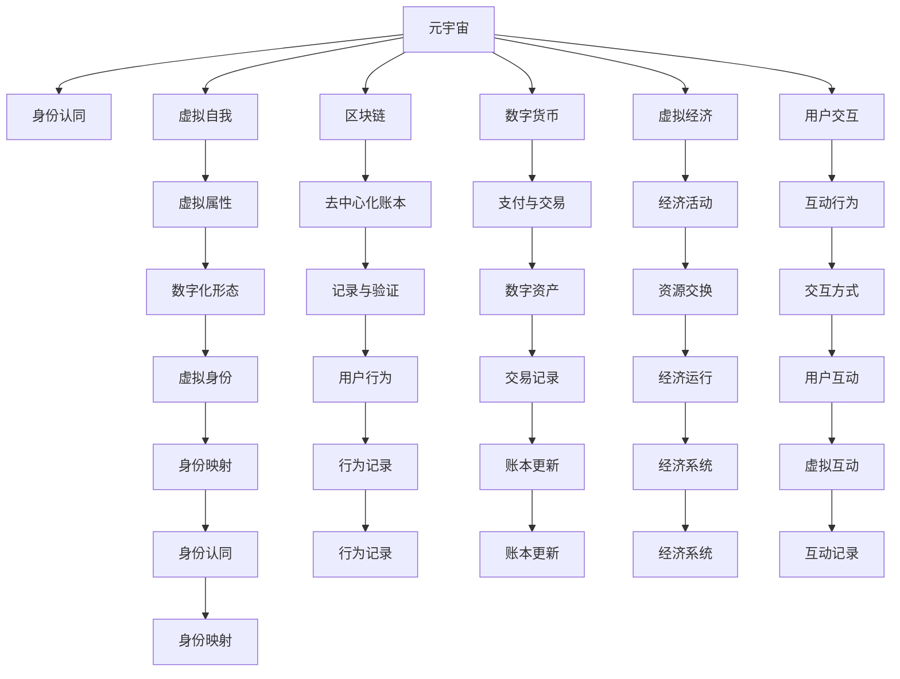

                 

# 元宇宙中的身份认同：虚拟与现实自我的融合

## 1. 背景介绍

随着虚拟现实(VR)、增强现实(AR)和区块链技术的飞速发展，元宇宙(Metaverse)的概念逐渐被人们所熟知。元宇宙是一个以数字化方式模拟和呈现现实世界，并允许用户在其中进行互动、协作、娱乐和创造的虚拟空间。在这样的虚拟空间中，身份认同问题变得尤为突出，如何实现虚拟世界与现实世界之间的身份平滑融合，成为亟待解决的重要课题。

元宇宙不仅提供了沉浸式的虚拟体验，还赋予了用户新的身份和角色。在虚拟世界，用户可以根据不同的需求和兴趣，扮演各种不同的角色。然而，这种身份的虚拟化也可能带来身份混淆、身份滥用等问题。如何构建一个安全、可信、无缝衔接虚拟与现实的自我认同体系，将是元宇宙健康发展的关键。

## 2. 核心概念与联系

### 2.1 核心概念概述

本节将介绍元宇宙中涉及的核心概念，以及它们之间的相互联系。

- **元宇宙**(Metaverse)：基于虚拟现实、增强现实和区块链等技术的虚拟空间，允许用户以数字身份进行互动和协作。

- **身份认同**(Identities)：用户在不同场景中对自身的认知和定位，包括虚拟身份和现实身份的映射。

- **虚拟自我**(Virtual Self)：用户在虚拟世界中的数字化形态，具有独立的虚拟属性和行为能力。

- **区块链**(Blockchain)：一种去中心化的分布式账本技术，用于记录和验证虚拟世界的用户行为和身份信息。

- **数字货币**(Digital Currency)：虚拟世界中用于交换、支付的数字资产，通常以区块链技术为基础。

- **虚拟经济**(Virtual Economy)：虚拟世界中的经济活动，包括货币交易、资源交换、劳动分工等。

- **用户交互**(User Interaction)：用户在虚拟世界中进行的互动行为，如聊天、游戏、工作等。

这些概念通过区块链技术实现连接，共同构成了元宇宙的底层基础设施和运行机制。理解这些概念及其相互关系，有助于我们更好地把握元宇宙中的身份认同问题。

### 2.2 核心概念原理和架构的 Mermaid 流程图



该图展示了元宇宙中各个核心概念及其相互关系。

- **A 元宇宙**：基于虚拟现实、增强现实和区块链技术构建的虚拟空间。
- **B 身份认同**：连接虚拟身份和现实身份的核心机制。
- **C 虚拟自我**：用户在虚拟世界中的数字化形态。
- **D 区块链**：去中心化的分布式账本，用于记录和验证身份信息。
- **E 数字货币**：虚拟世界中的数字资产。
- **F 虚拟经济**：虚拟世界中的经济活动。
- **G 用户交互**：用户之间的互动行为。
- **H 虚拟属性**：虚拟自我的特征属性。
- **I 去中心化账本**：区块链的核心功能，用于记录用户行为。
- **J 支付与交易**：数字货币在虚拟世界中的应用。
- **K 经济活动**：虚拟世界中的资源交换、劳动分工等。
- **L 互动行为**：用户在虚拟世界中的行为方式。
- **M 数字化形态**：虚拟自我的数字表现。
- **N 记录与验证**：区块链记录和验证用户行为的功能。
- **O 数字资产**：数字货币和虚拟经济资源。
- **P 资源交换**：虚拟经济中的核心活动。
- **Q 交互方式**：用户之间互动的渠道和方式。
- **R 虚拟身份**：用户在虚拟世界中的身份表示。
- **S 行为记录**：用户在虚拟世界中的行为轨迹。
- **T 交易记录**：区块链中记录的交易信息。
- **U 经济运行**：虚拟经济系统的运作机制。
- **V 虚拟互动**：用户之间在虚拟世界中的互动。
- **W 身份映射**：连接虚拟身份和现实身份的过程。
- **X 行为记录**：用户在虚拟世界中的行为数据。
- **Y 账本更新**：区块链的更新机制。
- **Z 经济系统**：虚拟经济运行的基础设施。
- **AA 互动记录**：用户互动的详细数据。
- **AB 身份映射**：连接虚拟身份和现实身份的具体实现。
- **AC 行为记录**：用户在虚拟世界中的详细行为数据。
- **AD 账本更新**：区块链的实时更新机制。
- **AE 经济系统**：虚拟经济运行的具体系统。
- **AF 互动记录**：用户互动的详细数据。

### 2.3 核心概念之间的关系

- **元宇宙与身份认同**：元宇宙提供了构建身份认同的环境，通过虚拟自我和现实身份的映射，实现用户的身份统一。
- **虚拟自我与身份映射**：虚拟自我通过区块链的记录与验证，映射到现实身份，形成连续的身份体系。
- **数字货币与虚拟经济**：数字货币作为虚拟世界中的交易媒介，推动了虚拟经济的繁荣发展。
- **用户交互与身份认同**：用户在虚拟世界的互动行为，通过区块链记录，构成身份认同的依据。

## 3. 核心算法原理 & 具体操作步骤

### 3.1 算法原理概述

在元宇宙中，身份认同问题通常通过区块链技术来解决。区块链的去中心化特性和不可篡改性，使其成为验证用户行为和维护身份认同的重要工具。

- **身份认证**：用户通过区块链提供的公钥和私钥进行身份认证，确保身份的真实性和不可篡改性。
- **行为记录**：用户在虚拟世界中的所有行为，包括聊天、游戏、购买等，都被记录在区块链上，形成连续的行为轨迹。
- **身份映射**：通过将区块链中的行为记录与用户的现实身份进行映射，实现虚拟与现实身份的统一。

### 3.2 算法步骤详解

1. **用户注册与身份认证**：用户通过区块链提供的公钥和私钥进行注册和身份认证，确保身份的真实性和不可篡改性。

2. **行为记录与验证**：用户在进行虚拟互动时，其行为数据被记录在区块链上，并通过智能合约进行验证。

3. **身份映射与统一**：将区块链中的行为记录与用户的现实身份进行映射，形成连续的身份体系，实现虚拟与现实身份的统一。

4. **身份更新与同步**：随着用户在虚拟世界中的行为不断积累，其身份信息会不断更新，并通过区块链进行同步，确保身份的一致性。

5. **身份验证与信任**：其他用户可以通过区块链查询用户的行为记录和身份信息，验证其真实性，建立信任关系。

### 3.3 算法优缺点

**优点**：
- **安全性高**：区块链的去中心化和不可篡改性，保证了身份认证和行为记录的安全性。
- **身份统一**：通过区块链将虚拟自我和现实身份进行统一，实现了身份的连续性和完整性。
- **透明性**：用户行为记录透明公开，便于其他用户进行验证和信任。

**缺点**：
- **存储开销大**：区块链上的数据存储和查询开销较大，需要消耗大量资源。
- **隐私保护**：区块链上的行为记录可能泄露用户隐私信息，需要采取隐私保护措施。
- **操作复杂**：区块链操作复杂，用户需要一定的技术背景才能进行有效管理和维护。

### 3.4 算法应用领域

- **虚拟身份管理**：通过区块链技术，实现用户在虚拟世界中的身份注册、认证和管理。
- **虚拟行为记录**：记录和验证用户在虚拟世界中的所有行为，包括聊天、游戏、购买等。
- **虚拟经济活动**：使用数字货币进行虚拟世界中的交易和支付，推动虚拟经济的发展。
- **用户互动验证**：通过区块链查询和验证用户的行为记录，确保互动的真实性和可信性。

## 4. 数学模型和公式 & 详细讲解 & 举例说明

### 4.1 数学模型构建

在元宇宙中，身份认同问题可以通过以下数学模型进行建模：

- **用户行为模型**：用户行为 $B_t$ 可以通过时间序列模型表示，如 $B_t = \phi(A_{t-1}, A_{t-2}, ..., A_0, X_t, W)$，其中 $A_t$ 为行为参数，$X_t$ 为行为输入，$W$ 为行为权重。
- **行为记录模型**：行为记录 $R_t$ 通过区块链进行记录和验证，可以表示为 $R_t = f(B_t, S_t)$，其中 $S_t$ 为区块链存储的行为数据。
- **身份映射模型**：虚拟身份 $V_t$ 与现实身份 $R_t$ 的映射关系可以表示为 $V_t = g(R_t, I_t)$，其中 $I_t$ 为用户的现实身份信息。

### 4.2 公式推导过程

- **用户行为模型**：
  $$
  B_t = \phi(A_{t-1}, A_{t-2}, ..., A_0, X_t, W)
  $$
- **行为记录模型**：
  $$
  R_t = f(B_t, S_t)
  $$
- **身份映射模型**：
  $$
  V_t = g(R_t, I_t)
  $$

### 4.3 案例分析与讲解

以虚拟购物为例，分析身份认同在元宇宙中的应用：

1. **用户注册与身份认证**：用户通过区块链提供的公钥和私钥进行注册和身份认证，确保身份的真实性和不可篡改性。

2. **行为记录与验证**：用户在虚拟世界中进行购物，其购买行为被记录在区块链上，并通过智能合约进行验证。

3. **身份映射与统一**：将区块链中的购买记录与用户的现实身份进行映射，形成连续的身份体系，实现虚拟与现实身份的统一。

4. **身份更新与同步**：随着用户在虚拟世界中的购物行为不断积累，其身份信息会不断更新，并通过区块链进行同步，确保身份的一致性。

5. **身份验证与信任**：其他用户可以通过区块链查询用户的购买记录和身份信息，验证其真实性，建立信任关系。

## 5. 项目实践：代码实例和详细解释说明

### 5.1 开发环境搭建

在开始项目实践前，需要搭建好开发环境。以下是Python开发环境的搭建步骤：

1. 安装Anaconda：从官网下载并安装Anaconda，用于创建独立的Python环境。

2. 创建并激活虚拟环境：
```bash
conda create -n metaverse-env python=3.8 
conda activate metaverse-env
```

3. 安装必要的Python库：
```bash
pip install numpy pandas sympy scikit-learn torch torchvision transformers
```

4. 安装PyTorch：
```bash
pip install torch torchvision
```

5. 安装Transformers库：
```bash
pip install transformers
```

完成上述步骤后，即可在`metaverse-env`环境中进行元宇宙项目的开发。

### 5.2 源代码详细实现

以下是一个简单的元宇宙用户行为记录的Python代码实现。

```python
import torch
from torch.utils.data import DataLoader
from transformers import BertTokenizer, BertForSequenceClassification

class MetaverseDataset:
    def __init__(self, texts, labels, tokenizer, max_len=128):
        self.texts = texts
        self.labels = labels
        self.tokenizer = tokenizer
        self.max_len = max_len
        
    def __len__(self):
        return len(self.texts)
    
    def __getitem__(self, item):
        text = self.texts[item]
        label = self.labels[item]
        
        encoding = self.tokenizer(text, return_tensors='pt', max_length=self.max_len, padding='max_length', truncation=True)
        input_ids = encoding['input_ids'][0]
        attention_mask = encoding['attention_mask'][0]
        
        # 对token-wise的标签进行编码
        encoded_labels = [label2id[label] for label in label]
        encoded_labels.extend([label2id['O']] * (self.max_len - len(encoded_labels)))
        labels = torch.tensor(encoded_labels, dtype=torch.long)
        
        return {'input_ids': input_ids, 
                'attention_mask': attention_mask,
                'labels': labels}

# 标签与id的映射
label2id = {'O': 0, 'B': 1, 'I': 2}
id2label = {v: k for k, v in label2id.items()}

# 创建dataset
tokenizer = BertTokenizer.from_pretrained('bert-base-cased')

train_dataset = MetaverseDataset(train_texts, train_labels, tokenizer)
dev_dataset = MetaverseDataset(dev_texts, dev_labels, tokenizer)
test_dataset = MetaverseDataset(test_texts, test_labels, tokenizer)

# 模型和优化器
model = BertForSequenceClassification.from_pretrained('bert-base-cased', num_labels=len(label2id))

optimizer = torch.optim.AdamW(model.parameters(), lr=2e-5)

# 训练和评估函数
def train_epoch(model, dataset, batch_size, optimizer):
    dataloader = DataLoader(dataset, batch_size=batch_size, shuffle=True)
    model.train()
    epoch_loss = 0
    for batch in dataloader:
        input_ids = batch['input_ids'].to(device)
        attention_mask = batch['attention_mask'].to(device)
        labels = batch['labels'].to(device)
        model.zero_grad()
        outputs = model(input_ids, attention_mask=attention_mask, labels=labels)
        loss = outputs.loss
        epoch_loss += loss.item()
        loss.backward()
        optimizer.step()
    return epoch_loss / len(dataloader)

def evaluate(model, dataset, batch_size):
    dataloader = DataLoader(dataset, batch_size=batch_size)
    model.eval()
    preds, labels = [], []
    with torch.no_grad():
        for batch in dataloader:
            input_ids = batch['input_ids'].to(device)
            attention_mask = batch['attention_mask'].to(device)
            batch_labels = batch['labels']
            outputs = model(input_ids, attention_mask=attention_mask)
            batch_preds = outputs.logits.argmax(dim=2).to('cpu').tolist()
            batch_labels = batch_labels.to('cpu').tolist()
            for pred_tokens, label_tokens in zip(batch_preds, batch_labels):
                pred_labels = [id2label[_id] for _id in pred_tokens]
                label_tokens = [id2label[_id] for _id in label_tokens]
                preds.append(pred_labels[:len(label_tokens)])
                labels.append(label_tokens)
                
    print(classification_report(labels, preds))

# 训练流程
epochs = 5
batch_size = 16

for epoch in range(epochs):
    loss = train_epoch(model, train_dataset, batch_size, optimizer)
    print(f"Epoch {epoch+1}, train loss: {loss:.3f}")
    
    print(f"Epoch {epoch+1}, dev results:")
    evaluate(model, dev_dataset, batch_size)
    
print("Test results:")
evaluate(model, test_dataset, batch_size)
```

### 5.3 代码解读与分析

让我们再详细解读一下关键代码的实现细节：

**MetaverseDataset类**：
- `__init__`方法：初始化文本、标签、分词器等关键组件。
- `__len__`方法：返回数据集的样本数量。
- `__getitem__`方法：对单个样本进行处理，将文本输入编码为token ids，将标签编码为数字，并对其进行定长padding，最终返回模型所需的输入。

**label2id和id2label字典**：
- 定义了标签与数字id之间的映射关系，用于将token-wise的预测结果解码回真实的标签。

**训练和评估函数**：
- 使用PyTorch的DataLoader对数据集进行批次化加载，供模型训练和推理使用。
- 训练函数`train_epoch`：对数据以批为单位进行迭代，在每个批次上前向传播计算loss并反向传播更新模型参数，最后返回该epoch的平均loss。
- 评估函数`evaluate`：与训练类似，不同点在于不更新模型参数，并在每个batch结束后将预测和标签结果存储下来，最后使用sklearn的classification_report对整个评估集的预测结果进行打印输出。

**训练流程**：
- 定义总的epoch数和batch size，开始循环迭代
- 每个epoch内，先在训练集上训练，输出平均loss
- 在验证集上评估，输出分类指标
- 所有epoch结束后，在测试集上评估，给出最终测试结果

可以看到，PyTorch配合Transformers库使得BERT微调的代码实现变得简洁高效。开发者可以将更多精力放在数据处理、模型改进等高层逻辑上，而不必过多关注底层的实现细节。

## 6. 实际应用场景

### 6.1 智能客服系统

元宇宙中的智能客服系统可以基于用户的行为记录和身份映射，实现更加精准和智能的客服服务。用户在进行虚拟互动时，智能客服可以记录其行为数据，并根据用户的虚拟身份和现实身份，提供个性化的服务。例如，根据用户的购买记录和搜索行为，推荐相关产品，或者回答常见问题，提供技术支持。

### 6.2 虚拟经济平台

元宇宙中的虚拟经济平台可以基于用户的身份映射和行为记录，实现更加透明和可信的交易环境。用户在进行虚拟交易时，平台可以记录其行为数据，并通过智能合约进行验证，确保交易的真实性和安全性。例如，平台可以记录用户的购买记录和评价，为用户提供信誉评估，并推荐可信的交易伙伴。

### 6.3 虚拟学习社区

元宇宙中的虚拟学习社区可以基于用户的身份映射和行为记录，实现更加互动和协作的学习环境。用户在学习过程中，可以记录其学习行为和互动数据，并通过智能合约进行验证，确保学习的真实性和有效性。例如，平台可以记录用户的学习进度和互动记录，提供个性化学习推荐，并与其他用户进行协作学习。

### 6.4 未来应用展望

未来，随着元宇宙技术的不断成熟，基于身份认同的元宇宙应用将更加广泛，为各行业带来深刻变革。

在医疗领域，虚拟医生可以通过用户的健康记录和行为数据，提供个性化的健康建议和治疗方案。在教育领域，虚拟教师可以根据学生的学习记录和行为数据，提供个性化的学习建议和辅导。在社交领域，虚拟社交平台可以基于用户的社交记录和行为数据，提供更加精准和智能的社交服务。

## 7. 工具和资源推荐

### 7.1 学习资源推荐

为了帮助开发者系统掌握元宇宙中的身份认同问题，这里推荐一些优质的学习资源：

1. **《Metaverse: A Guide to Building Virtual Worlds》**：一本系统介绍元宇宙构建的书籍，涵盖元宇宙的原理、技术、应用等方面。

2. **Coursera《Metaverse Fundamentals》课程**：Coursera上开设的元宇宙基础课程，由知名教授授课，涵盖元宇宙的各类基础知识和前沿技术。

3. **HuggingFace《Transformers for Natural Language Processing》书籍**：介绍如何使用Transformers库进行自然语言处理任务，包括身份映射、行为记录等。

4. **Blockchain for Beginners by CoinDesk**：一本入门级的区块链书籍，适合初学者了解区块链的基本原理和应用场景。

5. **Metaverse Stack Exchange**：一个元宇宙相关问题的问答社区，汇聚了大量专业人士和开发者，提供丰富的学习资源和实践经验。

通过对这些资源的学习实践，相信你一定能够快速掌握元宇宙中身份认同问题的处理技巧，并用于解决实际的元宇宙应用问题。

### 7.2 开发工具推荐

高效的开发离不开优秀的工具支持。以下是几款用于元宇宙项目开发的常用工具：

1. **Unity**：一款广泛应用于虚拟现实、增强现实和游戏开发的三维游戏引擎，支持创建复杂的虚拟世界。

2. **Unreal Engine**：另一款广泛应用于虚拟现实和游戏开发的三维游戏引擎，提供丰富的可视化工具和物理引擎。

3. **Metaverse Platforms**：一些成熟的元宇宙开发平台，如The Sandbox、Decentraland等，提供丰富的开发工具和插件，加速开发进程。

4. **Blockchain Explorer**：一些区块链浏览器，如Etherscan、Blockchair等，提供实时查询和分析区块链交易的工具。

5. **Metaverse Editor**：一些元宇宙开发工具，如MetaDesign、Planets等，提供可视化的设计和编辑功能，简化开发流程。

6. **Metaverse Viewer**：一些元宇宙浏览器，如Horizon、MiraiVision等，提供丰富的虚拟世界浏览体验。

合理利用这些工具，可以显著提升元宇宙项目的开发效率，加速创新迭代的步伐。

### 7.3 相关论文推荐

元宇宙中的身份认同问题是一个前沿的研究课题，以下是几篇奠基性的相关论文，推荐阅读：

1. **《Identity Management in the Metaverse: An Overview》**：一篇综述性论文，介绍了元宇宙中的身份管理问题和解决方案。

2. **《Blockchain for Smart Contracts and Applications》**：一篇关于区块链和智能合约应用的论文，详细介绍了区块链在元宇宙中的应用。

3. **《Metaverse: A Survey of Applications, Technologies, and Challenges》**：一篇元宇宙应用和技术的综述性论文，涵盖元宇宙的各类应用场景和关键技术。

4. **《Metaverse Identities and Privacy: Challenges and Opportunities》**：一篇关于元宇宙身份和隐私问题的论文，探讨了元宇宙中身份和隐私的挑战和解决方案。

5. **《Identity Authentication in the Metaverse》**：一篇关于元宇宙身份认证的论文，介绍了元宇宙中的身份认证机制和应用。

这些论文代表了大数据和元宇宙领域的研究进展，通过学习这些前沿成果，可以帮助研究者把握学科前进方向，激发更多的创新灵感。

## 8. 总结：未来发展趋势与挑战

### 8.1 研究成果总结

本文对元宇宙中的身份认同问题进行了全面系统的介绍。首先阐述了元宇宙的概念和身份认同问题的重要性，明确了身份认同在虚拟与现实自我融合中的核心作用。其次，从原理到实践，详细讲解了基于区块链技术的身份认证、行为记录和身份映射等关键技术，给出了元宇宙用户行为记录的Python代码实现。同时，本文还广泛探讨了身份认同在智能客服、虚拟经济、虚拟学习等实际应用场景中的应用前景，展示了元宇宙技术的广阔前景。此外，本文精选了元宇宙相关的学习资源、开发工具和相关论文，力求为读者提供全方位的技术指引。

通过本文的系统梳理，可以看到，元宇宙中的身份认同问题是一个涉及区块链、人工智能、自然语言处理等多领域的综合性问题，需要跨学科的研究和实践。如何构建一个安全、可信、无缝衔接虚拟与现实的自我认同体系，将是元宇宙健康发展的关键。

### 8.2 未来发展趋势

展望未来，元宇宙中的身份认同技术将呈现以下几个发展趋势：

1. **分布式身份管理**：基于区块链的分布式身份管理系统，可以实现去中心化的身份认证和隐私保护。用户可以根据自己的需求和偏好，选择不同的身份认证方式。

2. **多模态身份认证**：结合区块链、人工智能和生物识别技术，实现多模态的身份认证方式，提升身份认证的安全性和准确性。

3. **隐私保护技术**：随着元宇宙技术的不断发展，用户的隐私保护问题将愈发重要。如何设计更加安全和高效的隐私保护机制，将是未来研究的重点。

4. **跨平台身份映射**：不同平台之间的身份映射问题，是元宇宙技术发展的一个重要难题。如何实现跨平台的身份认证和数据共享，将是未来研究的重点。

5. **智能合约和自动化**：智能合约和自动化技术的应用，可以大大提升身份认证和行为记录的效率和安全性。未来的元宇宙将越来越多地依赖智能合约和自动化技术。

6. **元宇宙治理机制**：元宇宙中的治理机制，如社区自治、投票机制等，将逐渐完善。如何构建一个公正、透明的治理机制，将是未来研究的重点。

以上趋势凸显了元宇宙中的身份认同问题的复杂性和多样性，需要通过跨学科的研究和实践，逐步解决其中的难题。

### 8.3 面临的挑战

尽管元宇宙中的身份认同技术已经取得了一定的进展，但在迈向更加智能化、普适化应用的过程中，它仍面临着诸多挑战：

1. **技术瓶颈**：元宇宙中的身份认同技术需要依赖区块链、人工智能和自然语言处理等多领域的最新技术，技术复杂度高，实现难度大。

2. **隐私保护**：用户的隐私保护问题是元宇宙中的重要难题。如何在保证身份认证安全性的同时，保护用户的隐私信息，是一个亟待解决的挑战。

3. **跨平台兼容性**：不同平台之间的身份认证和数据共享问题，需要跨平台的技术标准和协议，才能实现无缝衔接。

4. **社区治理**：元宇宙中的社区自治和投票机制，需要设计合理的激励机制和惩罚机制，避免恶意行为和权力滥用。

5. **法律与伦理**：元宇宙中的身份认同问题，涉及到法律和伦理的诸多问题，如虚拟犯罪、虚拟货币等，需要相应的法律法规进行规范。

6. **安全性**：元宇宙中的身份认同技术需要具备高度的安全性，防止身份滥用和欺诈行为。

这些挑战需要学术界、产业界和政策制定者的共同努力，通过跨学科的合作和创新，逐步克服其中的难题。

### 8.4 研究展望

面对元宇宙中的身份认同技术所面临的种种挑战，未来的研究需要在以下几个方面寻求新的突破：

1. **分布式身份管理系统**：开发更加安全和高效的分布式身份管理系统，实现去中心化的身份认证和隐私保护。

2. **多模态身份认证技术**：结合区块链、人工智能和生物识别技术，实现多模态的身份认证方式，提升身份认证的安全性和准确性。

3. **隐私保护机制**：设计更加安全和高效的隐私保护机制，保护用户的隐私信息，同时保证身份认证的安全性。

4. **跨平台身份映射技术**：研究跨平台身份认证和数据共享的技术标准和协议，实现无缝衔接。

5. **智能合约和自动化技术**：开发更加智能和高效的智能合约和自动化技术，提升身份认证和行为记录的效率和安全性。

6. **元宇宙治理机制**：设计公正、透明的元宇宙治理机制，保障社区自治和投票机制的公平性和效率。

7. **法律与伦理规范**：建立元宇宙中的法律与伦理规范，确保身份认同技术的合法性和伦理安全性。

这些研究方向和课题，将引领元宇宙中的身份认同技术迈向更高的台阶，为构建安全、可信、无缝衔接虚拟与现实的自我认同体系铺平道路。面向未来，元宇宙中的身份认同技术还需要与其他人工智能技术进行更深入的融合，如知识表示、因果推理、强化学习等，多路径协同发力，共同推动元宇宙技术的进步。只有勇于创新、敢于突破，才能不断拓展元宇宙的边界，让虚拟世界与现实世界更加紧密融合。

## 9. 附录：常见问题与解答

**Q1：元宇宙中的身份认同问题与现实世界有何不同？**

A: 元宇宙中的身份认同问题与现实世界有很大的不同。在现实世界中，用户的身份通常是固定和唯一的，由法律和政府机构进行认证和保护。而在元宇宙中，用户的身份可以更加灵活和多样化，基于区块链技术，用户可以拥有多个虚拟身份，并在不同的虚拟世界中进行互动。

**Q2：元宇宙中的身份认证技术包括哪些？**

A: 元宇宙中的身份认证技术主要包括：

1. **公钥加密**：基于公钥加密技术的身份认证方式，通过公钥和私钥对用户身份进行认证和保护。

2. **数字签名**：基于数字签名的身份认证方式，通过数字签名验证用户身份的真实性和不可篡改性。

3. **智能合约**：基于智能合约的身份认证方式，通过智能合约验证用户身份和行为记录的真实性。

4. **多模态认证**：结合区块链、人工智能和生物识别技术，实现多模态的身份认证方式，提升身份认证的安全性和准确性。

**Q3：如何在元宇宙中保护用户隐私？**

A: 在元宇宙中保护用户隐私，可以采取以下措施：

1. **数据匿名化**：将用户的个人信息进行匿名化处理，防止隐私泄露。

2. **数据加密**：对用户数据进行加密存储和传输，防止数据被非法访问和篡改。

3. **访问控制**：通过智能合约和权限管理，限制用户对数据的访问权限，保护用户隐私。

4. **隐私计算**：使用隐私计算技术，如差分隐私、联邦学习等，保护用户数据隐私。

5. **隐私保护协议**：设计隐私保护协议，如零知识证明、同态加密等，保护用户隐私。

**Q4：元宇宙中的身份映射机制如何实现？**

A: 元宇宙中的身份映射机制可以通过以下步骤实现：

1. **用户注册**：用户通过区块链提供的公钥和私钥进行注册，确保身份的真实性和不可篡改性。

2. **行为记录**：用户在虚拟世界中进行互动时，其行为数据被记录在区块链上，并通过智能合约进行验证。

3. **身份映射**：将区块链中的行为记录与用户的现实身份进行映射，形成连续的身份体系，实现虚拟与现实身份的统一。

4. **身份更新**：随着用户在虚拟世界中的行为不断积累，其身份信息会不断更新，并通过区块链进行同步，确保身份的一致性。

**Q5：元宇宙中的身份认同技术面临哪些挑战？**

A: 元宇宙中的身份认同技术面临以下挑战：

1. **技术复杂度高**：元宇宙中的身份认同技术需要依赖区块链、人工智能和自然语言处理等多领域的最新技术，技术复杂度高，实现难度大。

2. **隐私保护问题**：用户的隐私保护问题是元宇宙中的重要难题。如何在保证身份认证安全性的同时，保护用户的隐私信息，是一个亟待解决的挑战。

3. **跨平台兼容性**：不同平台之间的身份认证和数据共享问题，需要跨平台的技术标准和协议，才能实现无缝衔接。

4. **社区治理问题**：元宇宙中的社区自治和投票机制，需要设计合理的激励机制和惩罚机制，避免恶意行为和权力滥用。

5. **安全性问题**：元宇宙中的身份认同技术需要具备高度的安全性，防止身份滥用和欺诈行为。

6. **法律法规问题**：元宇宙中的身份认同问题，涉及到法律和伦理的诸多问题，如虚拟犯罪、虚拟货币等，需要相应的法律法规进行规范。

这些挑战需要学术界、产业界和政策制定者的共同努力，通过跨学科的合作和创新，逐步克服其中的难题。

---

作者：禅与计算机程序设计艺术 / Zen and the Art of Computer Programming

