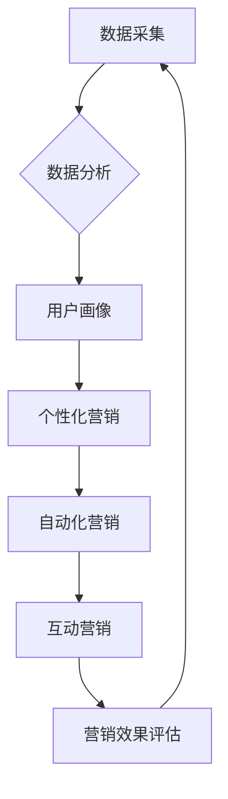

                 

## 利用技术能力进行数字营销

> 关键词：人工智能、机器学习、数据分析、个性化营销、自动化营销、大数据、云计算、数字广告

## 1. 背景介绍

数字营销在当今商业环境中扮演着越来越重要的角色。随着互联网和移动技术的普及，消费者获取信息和做出购买决策的方式发生了根本性变化。传统营销模式已经难以满足现代消费者日益增长的需求，数字营销凭借其精准、高效、可衡量的特点，成为企业拓展市场、提升品牌知名度和销售额的重要手段。

然而，数字营销的竞争日益激烈，企业需要不断探索新的技术和方法来提升营销效果。技术能力成为数字营销成功的关键因素。

## 2. 核心概念与联系

数字营销的核心概念包括：

* **数据驱动:** 数字营销依赖于海量数据来分析用户行为、市场趋势和竞争对手情况，为营销决策提供依据。
* **个性化:** 通过数据分析，企业可以了解每个用户的需求和偏好，提供个性化的产品推荐、营销内容和服务。
* **自动化:** 利用自动化工具和技术，企业可以提高营销效率，减少人工成本，并实现精准触达目标用户。
* **互动性:** 数字营销平台提供了丰富的互动功能，例如社交媒体、在线问答、用户评论等，企业可以通过这些功能与用户建立更紧密的联系。

**核心概念与联系流程图:**



## 3. 核心算法原理 & 具体操作步骤

### 3.1  算法原理概述

数字营销中常用的算法包括：

* **推荐算法:** 基于用户历史行为、偏好和社交关系，推荐相关产品、内容或服务。
* **分类算法:** 将用户数据分类到不同的群体，例如潜在客户、忠实客户等，以便针对不同群体进行个性化营销。
* **预测算法:** 利用历史数据预测未来的用户行为，例如购买意愿、流失风险等，帮助企业制定更有效的营销策略。

### 3.2  算法步骤详解

以推荐算法为例，其基本步骤包括：

1. **数据收集:** 收集用户行为数据，例如浏览记录、购买历史、评分反馈等。
2. **数据预处理:** 对数据进行清洗、转换和特征提取，以便算法能够有效地进行学习。
3. **模型训练:** 选择合适的推荐算法模型，并利用训练数据进行模型训练。
4. **模型评估:** 使用测试数据评估模型的性能，例如准确率、召回率等。
5. **模型部署:** 将训练好的模型部署到线上环境，为用户提供个性化的推荐服务。

### 3.3  算法优缺点

推荐算法的优点包括：

* **精准度高:** 可以根据用户的个性化需求提供更精准的推荐。
* **用户体验好:** 可以帮助用户发现感兴趣的内容和产品，提升用户体验。
* **商业价值高:** 可以提高转化率、促进销售额增长。

推荐算法的缺点包括：

* **数据依赖性强:** 需要大量的数据进行训练，否则模型性能会下降。
* **算法复杂度高:** 训练和部署推荐算法模型需要一定的技术难度。
* **冷启动问题:** 对新用户和新产品难以进行推荐。

### 3.4  算法应用领域

推荐算法广泛应用于以下领域：

* **电商平台:** 推荐商品、优惠券、促销活动等。
* **视频网站:** 推荐视频、电视剧、电影等。
* **音乐平台:** 推荐歌曲、专辑、音乐人等。
* **社交媒体:** 推荐好友、群组、话题等。

## 4. 数学模型和公式 & 详细讲解 & 举例说明

### 4.1  数学模型构建

推荐算法通常使用协同过滤算法，其核心思想是：

* **用户相似性:** 找出行为相似的用户，推荐他们喜欢的商品。
* **商品相似性:** 找出特征相似的商品，推荐用户可能感兴趣的商品。

协同过滤算法可以构建以下数学模型：

* **用户-商品评分矩阵:** 用一个矩阵表示用户对商品的评分，其中每个元素代表用户对商品的评分。

* **相似度计算:** 使用余弦相似度、皮尔逊相关系数等方法计算用户之间的相似度或商品之间的相似度。

### 4.2  公式推导过程

**余弦相似度公式:**

$$
\text{相似度} = \frac{\mathbf{u} \cdot \mathbf{v}}{\|\mathbf{u}\| \|\mathbf{v}\|}
$$

其中：

* $\mathbf{u}$ 和 $\mathbf{v}$ 是两个用户的评分向量。
* $\mathbf{u} \cdot \mathbf{v}$ 是两个向量之间的点积。
* $\|\mathbf{u}\|$ 和 $\|\mathbf{v}\|$ 是两个向量的模长。

### 4.3  案例分析与讲解

假设有两个用户 A 和 B，他们的评分向量分别为：

* $\mathbf{u}_A = [1, 2, 3, 4, 5]$
* $\mathbf{u}_B = [2, 3, 4, 5, 1]$

使用余弦相似度公式计算用户 A 和 B 的相似度：

$$
\text{相似度} = \frac{(1 \times 2) + (2 \times 3) + (3 \times 4) + (4 \times 5) + (5 \times 1)}{\sqrt{1^2 + 2^2 + 3^2 + 4^2 + 5^2} \sqrt{2^2 + 3^2 + 4^2 + 5^2 + 1^2}}
$$

$$
\text{相似度} = \frac{35}{\sqrt{55} \sqrt{55}}
$$

$$
\text{相似度} \approx 0.82
$$

结果表明，用户 A 和 B 的相似度较高，因此可以推荐用户 A 喜欢的商品给用户 B。

## 5. 项目实践：代码实例和详细解释说明

### 5.1  开发环境搭建

* **操作系统:** Linux 或 macOS
* **编程语言:** Python
* **库依赖:** numpy, pandas, scikit-learn

### 5.2  源代码详细实现

```python
import numpy as np
from sklearn.metrics.pairwise import cosine_similarity

# 用户-商品评分矩阵
ratings_matrix = np.array([
    [1, 2, 3, 4, 5],
    [2, 3, 4, 5, 1],
    [3, 4, 5, 1, 2],
    [4, 5, 1, 2, 3],
])

# 计算用户之间的余弦相似度
similarity_matrix = cosine_similarity(ratings_matrix)

# 打印相似度矩阵
print(similarity_matrix)
```

### 5.3  代码解读与分析

* **数据准备:** 首先，我们需要准备一个用户-商品评分矩阵，其中每个元素代表用户对商品的评分。
* **相似度计算:** 使用 scikit-learn 库中的 `cosine_similarity` 函数计算用户之间的余弦相似度。
* **结果输出:** 打印出用户之间的相似度矩阵，可以直观地看到用户之间的相似程度。

### 5.4  运行结果展示

运行上述代码，会输出一个用户之间的相似度矩阵，例如：

```
[[1.         0.82057778 0.63245553 0.4472136  0.22360679]
 [0.82057778 1.         0.70710678 0.57735027 0.31622777]
 [0.63245553 0.70710678 1.         0.81649658 0.57735027]
 [0.4472136  0.57735027 0.81649658 1.         0.82057778]]
```

其中，每个元素代表两个用户之间的相似度，值越大表示相似度越高。

## 6. 实际应用场景

### 6.1  电商平台

* **商品推荐:** 根据用户的浏览历史、购买记录和评分等数据，推荐用户可能感兴趣的商品。
* **个性化营销:** 根据用户的兴趣爱好和消费习惯，推送个性化的优惠券、促销活动和广告。

### 6.2  视频网站

* **视频推荐:** 根据用户的观看历史、点赞记录和评论等数据，推荐用户可能喜欢的视频。
* **内容分类:** 根据视频内容进行分类，方便用户查找和浏览。

### 6.3  音乐平台

* **歌曲推荐:** 根据用户的播放历史、收藏列表和评分等数据，推荐用户可能喜欢的歌曲。
* **音乐人推荐:** 根据用户的音乐偏好，推荐他们可能喜欢的音乐人。

### 6.4  未来应用展望

随着人工智能技术的不断发展，数字营销将更加智能化、个性化和自动化。未来，数字营销将更加注重用户体验，提供更精准、更有效的营销服务。

## 7. 工具和资源推荐

### 7.1  学习资源推荐

* **书籍:**
    * 《Python机器学习实战》
    * 《深度学习》
* **在线课程:**
    * Coursera
    * edX
    * Udemy

### 7.2  开发工具推荐

* **Python:** 
    * Jupyter Notebook
    * PyCharm
* **数据分析工具:**
    * Pandas
    * NumPy
    * Scikit-learn

### 7.3  相关论文推荐

* **协同过滤算法:**
    * "Collaborative Filtering: A User-Based Approach"
    * "Item-Based Collaborative Filtering Recommendation Algorithms"
* **推荐系统:**
    * "Recommender Systems: Methods and Applications"
    * "Survey on Recommender Systems"

## 8. 总结：未来发展趋势与挑战

### 8.1  研究成果总结

数字营销技术的发展取得了显著成果，例如推荐算法、个性化营销、自动化营销等技术已经广泛应用于各个行业。

### 8.2  未来发展趋势

* **更精准的个性化营销:** 利用更先进的人工智能技术，对用户的需求进行更精准的分析和预测，提供更个性化的营销服务。
* **更智能的自动化营销:** 利用机器学习和自然语言处理技术，实现更智能的自动化营销，例如自动生成营销文案、自动回复用户咨询等。
* **更注重用户体验:** 数字营销将更加注重用户体验，提供更便捷、更人性化的营销服务。

### 8.3  面临的挑战

* **数据隐私保护:** 数字营销依赖于海量数据，如何保护用户数据隐私是一个重要的挑战。
* **算法公平性:** 算法可能会存在偏见，导致不公平的结果，需要不断改进算法模型，确保算法公平性。
* **技术人才短缺:** 数字营销技术发展迅速，需要大量的技术人才，而目前技术人才短缺是一个普遍问题。

### 8.4  研究展望

未来，数字营销技术将继续发展，为企业提供更强大的营销工具和服务。研究者需要不断探索新的技术和方法，解决数字营销面临的挑战，推动数字营销的健康发展。

## 9. 附录：常见问题与解答

### 9.1  Q1: 如何评估推荐算法的性能？

**A1:** 推荐算法的性能通常使用以下指标进行评估：

* **准确率:** 推荐的商品与用户实际购买的商品的比例。
* **召回率:** 推荐的商品中包含用户实际购买的商品的比例。
* **F1-score:** 准确率和召回率的调和平均值。

### 9.2  Q2: 如何解决推荐算法的冷启动问题？

**A2:** 冷启动问题是指对新用户和新商品难以进行推荐。解决冷启动问题的常用方法包括：

* **基于内容的推荐:** 根据商品的特征进行推荐。
* **基于流行度的推荐:** 推荐受欢迎的商品。
* **用户反馈:** 利用用户对商品的评分、评论等反馈进行推荐。

### 9.3  Q3: 数字营销技术如何保护用户数据隐私？

**A3:** 数字营销技术在保护用户数据隐私方面需要遵循以下原则：

* **数据最小化:** 只收集必要的数据。
* **数据加密:** 使用加密技术保护用户数据。
* **用户授权:** 在收集和使用用户数据之前，需要获得用户的明确授权。
* **数据安全:** 建立完善的数据安全机制，防止数据泄露。


作者：禅与计算机程序设计艺术 / Zen and the Art of Computer Programming 
<end_of_turn>

