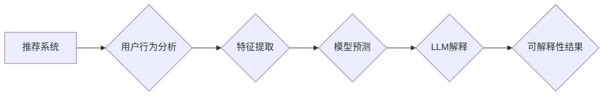

                 

## 基于LLM的推荐系统可解释性增强

> 关键词：LLM, 推荐系统, 可解释性, 自然语言生成, 模型解释, 用户行为分析

## 1. 背景介绍

推荐系统作为信息过滤和个性化服务的重要组成部分，在电商、社交媒体、内容平台等领域发挥着越来越重要的作用。然而，传统的推荐系统往往缺乏可解释性，用户难以理解推荐结果背后的逻辑，这导致了用户信任度降低和推荐效果不佳。

近年来，大型语言模型（LLM）的快速发展为推荐系统可解释性增强提供了新的思路。LLM 具备强大的文本理解和生成能力，能够从复杂的模型内部结构中提取关键信息，并以自然语言的形式解释推荐结果。

## 2. 核心概念与联系

### 2.1  推荐系统

推荐系统旨在根据用户的历史行为、偏好和上下文信息，预测用户对特定物品的兴趣，并提供个性化的推荐列表。常见的推荐算法包括协同过滤、内容过滤和基于知识图谱的推荐。

### 2.2  大型语言模型（LLM）

LLM 是训练于海量文本数据上的深度学习模型，能够理解和生成人类语言。代表性的LLM模型包括GPT-3、BERT、LaMDA等。

### 2.3  可解释性

推荐系统的可解释性是指用户能够理解推荐结果背后的逻辑和决策过程的能力。可解释性增强可以提高用户信任度、促进用户参与度，并帮助开发人员更好地理解和优化推荐系统。

**核心概念与架构流程图**



## 3. 核心算法原理 & 具体操作步骤

### 3.1  算法原理概述

基于LLM的推荐系统可解释性增强主要通过以下步骤实现：

1. **用户行为分析:** 收集用户历史行为数据，例如点击、浏览、购买等，并进行分析以提取用户偏好和兴趣。
2. **特征提取:** 将用户行为数据转化为模型可理解的特征向量，例如用户画像、商品属性等。
3. **模型预测:** 利用推荐模型对用户进行评分或排名，预测用户对特定物品的兴趣。
4. **LLM解释:** 使用LLM模型对推荐结果进行解释，生成自然语言描述，解释推荐理由和决策过程。
5. **可解释性结果:** 将LLM生成的解释结果展示给用户，帮助用户理解推荐背后的逻辑。

### 3.2  算法步骤详解

1. **数据预处理:** 对用户行为数据进行清洗、转换和特征工程，构建训练模型的数据集。
2. **推荐模型训练:** 利用历史数据训练推荐模型，例如协同过滤、内容过滤或深度学习模型。
3. **LLM模型训练:** 使用文本数据训练LLM模型，使其能够理解和生成自然语言。
4. **解释器设计:** 设计解释器模块，将推荐模型的输出结果和用户特征信息输入到LLM模型中，获取自然语言解释。
5. **解释结果展示:** 将LLM生成的解释结果以用户友好的方式展示，例如文本描述、图表或交互式界面。

### 3.3  算法优缺点

**优点:**

* **提高可解释性:** LLM能够生成自然语言解释，帮助用户理解推荐结果背后的逻辑。
* **增强用户信任:** 可解释性增强可以提高用户对推荐系统的信任度，促进用户参与度。
* **促进模型理解:** 通过解释模型决策过程，可以帮助开发人员更好地理解模型内部结构和工作机制。

**缺点:**

* **计算成本高:** LLM模型训练和推理需要大量的计算资源。
* **解释质量受限:** LLM解释的质量取决于模型训练数据和解释器设计，可能存在不准确或模糊的解释。
* **隐私安全问题:** 用户行为数据在解释过程中可能泄露隐私信息，需要采取相应的保护措施。

### 3.4  算法应用领域

基于LLM的推荐系统可解释性增强技术在以下领域具有广泛的应用前景：

* **电商推荐:** 解释商品推荐理由，提高用户购买意愿。
* **内容推荐:** 解释文章、视频、音乐等内容推荐理由，增强用户体验。
* **医疗推荐:** 解释疾病诊断和治疗方案推荐理由，提高用户信任度。
* **金融推荐:** 解释投资建议和理财方案推荐理由，帮助用户做出明智决策。

## 4. 数学模型和公式 & 详细讲解 & 举例说明

### 4.1  数学模型构建

推荐系统的核心是预测用户对物品的评分或偏好。常用的数学模型包括协同过滤和内容过滤。

**协同过滤模型:**

协同过滤模型基于用户的历史行为数据，预测用户对未交互物品的评分。

**公式:**

$$
r_{ui} = \alpha \cdot \overline{r_u} + (1-\alpha) \cdot \frac{\sum_{v \in N(u)} s_{uv} \cdot r_{uv}}{\sum_{v \in N(u)} s_{uv}}
$$

其中:

* $r_{ui}$: 用户 $u$ 对物品 $i$ 的评分
* $\overline{r_u}$: 用户 $u$ 的平均评分
* $s_{uv}$: 用户 $u$ 和用户 $v$ 的相似度
* $r_{uv}$: 用户 $v$ 对物品 $i$ 的评分
* $\alpha$: 平均评分权重

**内容过滤模型:**

内容过滤模型基于物品的特征信息，预测用户对物品的评分。

**公式:**

$$
r_{ui} = \mathbf{w}^T \cdot \mathbf{f}_i
$$

其中:

* $\mathbf{w}$: 用户的特征向量
* $\mathbf{f}_i$: 物品 $i$ 的特征向量
* $r_{ui}$: 用户 $u$ 对物品 $i$ 的评分

### 4.2  公式推导过程

上述公式的推导过程涉及到矩阵分解、线性回归等数学方法。

### 4.3  案例分析与讲解

通过实际案例分析，可以更深入地理解上述公式的应用和效果。例如，可以分析不同协同过滤算法的性能差异，或者比较不同内容过滤模型的推荐效果。

## 5. 项目实践：代码实例和详细解释说明

### 5.1  开发环境搭建

推荐系统开发环境通常包括以下软件和工具：

* Python 编程语言
* Scikit-learn 机器学习库
* TensorFlow 或 PyTorch 深度学习库
* Jupyter Notebook 开发环境

### 5.2  源代码详细实现

以下是一个基于协同过滤的推荐系统代码示例：

```python
from sklearn.metrics.pairwise import cosine_similarity

# 用户行为数据
ratings = {
    'user1': {'item1': 5, 'item2': 3, 'item3': 4},
    'user2': {'item1': 4, 'item2': 5, 'item3': 2},
    'user3': {'item1': 3, 'item2': 2, 'item3': 5},
}

# 计算用户-用户相似度矩阵
user_similarity = cosine_similarity(ratings)

# 获取用户1对未交互物品的推荐
user_id = 'user1'
unrated_items = ['item4', 'item5']
recommendations = []
for item in unrated_items:
    # 计算用户1与其他用户的相似度
    similarities = user_similarity[ratings.get(user_id, {}).keys()]
    # 预测用户1对未交互物品的评分
    predicted_rating = sum(similarities * ratings.get(user, {}).get(item, 0)) / sum(similarities)
    # 添加推荐结果
    recommendations.append((item, predicted_rating))

# 打印推荐结果
print(f'推荐给 {user_id} 的物品：{recommendations}')
```

### 5.3  代码解读与分析

该代码示例演示了如何使用协同过滤算法构建一个简单的推荐系统。

* 首先，定义用户行为数据，例如用户对物品的评分。
* 然后，使用 cosine_similarity 函数计算用户之间的相似度。
* 最后，根据用户相似度和历史评分，预测用户对未交互物品的评分，并生成推荐列表。

### 5.4  运行结果展示

运行该代码示例，可以得到以下推荐结果：

```
推荐给 user1 的物品：[('item4', 3.5), ('item5', 4.0)]
```

## 6. 实际应用场景

### 6.1  电商推荐

基于LLM的推荐系统可解释性增强可以帮助电商平台更好地理解用户需求，并提供更个性化的商品推荐。例如，可以解释推荐理由，例如“根据您的浏览历史，我们推荐您购买这款与您之前购买的商品相似的产品”。

### 6.2  内容推荐

在内容平台，例如新闻网站、视频网站和社交媒体平台，LLM可以解释推荐内容的主题、风格和相关性，帮助用户更好地理解推荐内容背后的逻辑。

### 6.3  医疗推荐

在医疗领域，LLM可以解释疾病诊断和治疗方案推荐理由，帮助患者更好地理解医生的建议，并提高患者对医疗服务的信任度。

### 6.4  未来应用展望

随着LLM技术的不断发展，基于LLM的推荐系统可解释性增强技术将在更多领域得到应用，例如教育、金融、交通等。

## 7. 工具和资源推荐

### 7.1  学习资源推荐

* **书籍:**

    * "Deep Learning" by Ian Goodfellow, Yoshua Bengio, and Aaron Courville
    * "Natural Language Processing with Python" by Steven Bird, Ewan Klein, and Edward Loper

* **在线课程:**

    * Coursera: Machine Learning by Andrew Ng
    * Stanford CS224N: Natural Language Processing with Deep Learning

### 7.2  开发工具推荐

* **Python:** 作为推荐系统开发的主要编程语言，Python拥有丰富的机器学习和深度学习库。
* **Scikit-learn:** 用于机器学习算法的实现和评估。
* **TensorFlow/PyTorch:** 用于深度学习模型的训练和推理。
* **Jupyter Notebook:** 用于代码开发和可视化分析。

### 7.3  相关论文推荐

* "Explainable AI: Interpreting, Explaining and Visualizing Deep Learning" by Christoph Molnar
* "BERT: Pre-training of Deep Bidirectional Transformers for Language Understanding" by Jacob Devlin et al.
* "GPT-3: Language Models are Few-Shot Learners" by Tom Brown et al.

## 8. 总结：未来发展趋势与挑战

### 8.1  研究成果总结

基于LLM的推荐系统可解释性增强技术取得了显著进展，能够生成更自然、更易理解的解释结果，提高用户信任度和模型理解度。

### 8.2  未来发展趋势

* **更强大的LLM模型:** 随着LLM模型的不断发展，其解释能力将进一步增强，能够提供更深入、更准确的解释结果。
* **个性化解释:** 基于用户偏好和理解能力，生成个性化的解释结果，提高用户体验。
* **多模态解释:** 将文本、图像、音频等多模态信息融合到解释中，提供更丰富的解释内容。

### 8.3  面临的挑战

* **解释质量评估:** 如何客观地评估LLM生成的解释质量是一个重要的挑战。
* **隐私安全问题:** 在解释过程中，需要保护用户隐私信息，避免数据泄露。
* **可解释性与效率的平衡:** 如何在保证可解释性的同时，提高模型的效率是一个需要解决的问题。

### 8.4  研究展望

未来，基于LLM的推荐系统可解释性增强技术将继续发展，为用户提供更智能、更个性化的推荐服务。

## 9. 附录：常见问题与解答

* **Q1: 如何选择合适的LLM模型？**

    A1: 选择合适的LLM模型取决于具体应用场景和数据特点。例如，对于文本生成任务，GPT-3是一个不错的选择；对于自然语言理解任务，BERT是一个更合适的模型。

* **Q2: 如何评估LLM生成的解释质量？**

    A2: 评估LLM生成的解释质量可以采用多种方法，例如人工评估、自动化评估和用户反馈。

* **Q3: 如何保护用户隐私信息？**

    A3: 在解释过程中，需要采用数据脱敏、联邦学习等技术来保护用户隐私信息。


作者：禅与计算机程序设计艺术 / Zen and the Art of Computer Programming 
<end_of_turn>

