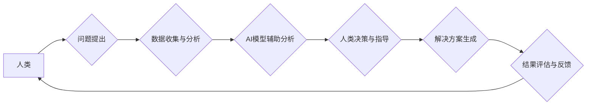

                 

## 1. 背景介绍

人工智能（AI）正以惊人的速度发展，从语音识别到图像生成，AI已经渗透到我们生活的方方面面。然而，传统的AI模型往往局限于特定的任务，缺乏人类般的泛化能力和创造力。增强智能（Augmented Intelligence，简称AI）应运而生，它旨在通过人机协同，发挥各自优势，共同完成更复杂的任务，并拓展人类认知边界。

### 1.1 人工智能的局限性

传统的AI模型，例如深度学习，主要依赖于海量数据进行训练，并通过复杂的算法学习数据中的模式。然而，这些模型存在一些局限性：

* **数据依赖性强:**  深度学习模型需要大量的 labeled 数据进行训练，而获取高质量标注数据往往成本高昂且耗时。
* **泛化能力有限:**  训练好的模型可能难以应对从未见过的场景或任务，缺乏人类般的泛化能力。
* **解释性差:**  深度学习模型的决策过程往往是“黑箱”式的，难以解释模型是如何做出决定的，这限制了模型在一些需要透明度和可信度的领域应用。

### 1.2 增强智能的优势

增强智能旨在克服传统AI的局限性，通过人机协同，发挥各自优势：

* **提升效率和准确性:** 人类可以提供领域知识和判断力，帮助AI模型更好地理解问题和做出更准确的决策。
* **增强创造力和创新力:** 人类可以利用AI辅助进行创意探索和方案设计，激发新的想法和解决方案。
* **提高可解释性和信任度:** 人机协同可以使AI决策过程更加透明，增强用户对AI模型的信任。

## 2. 核心概念与联系

增强智能的核心概念是人机协同，通过将人类的智慧和AI的计算能力相结合，实现超越单一智能的协同效应。

**Mermaid 流程图：**



**核心概念：**

* **人类:** 提供领域知识、判断力、创造力和伦理指导。
* **AI模型:** 提供数据处理、模式识别、计算能力和自动化执行。
* **协同机制:**  定义人机交互方式，例如人类提供指令、AI提供建议、共同决策等。
* **反馈机制:**  收集结果反馈，用于模型优化和人类学习。

## 3. 核心算法原理 & 具体操作步骤

增强智能的算法原理主要基于机器学习、深度学习和自然语言处理等领域的技术。

### 3.1 算法原理概述

增强智能算法的核心是将人类和AI模型的知识和能力融合在一起，实现协同决策和任务执行。常见的算法包括：

* **强化学习:**  AI模型通过与环境交互，学习最佳策略，并不断优化决策过程。
* **迁移学习:**  将已训练好的模型应用于新的任务，通过少量数据进行微调，提高效率和准确性。
* **知识图谱:**  构建知识网络，将人类知识和数据进行结构化表示，帮助AI模型理解和推理。

### 3.2 算法步骤详解

以强化学习为例，其基本步骤如下：

1. **环境建模:**  构建模拟真实世界的环境，定义状态、动作和奖励函数。
2. **代理训练:**  训练AI模型作为代理，学习在环境中采取最佳动作，以获得最大奖励。
3. **人类反馈:**  人类观察代理的行为，并提供反馈，例如奖励、惩罚或指导。
4. **模型更新:**  根据人类反馈，更新AI模型的参数，使其学习更优的策略。
5. **迭代优化:**  重复上述步骤，不断迭代优化模型，使其在环境中表现越来越好。

### 3.3 算法优缺点

**优点:**

* 能够学习复杂的任务和环境。
* 具有适应性和泛化能力。
* 可以通过人类反馈不断改进。

**缺点:**

* 训练过程可能需要大量时间和资源。
* 算法的复杂性可能难以理解和解释。
* 需要设计合理的奖励函数，否则可能导致模型学习到不期望的行为。

### 3.4 算法应用领域

强化学习在许多领域都有应用，例如：

* **游戏:**  训练AI代理玩游戏，例如围棋、Go、Dota 2等。
* **机器人:**  训练机器人完成复杂的任务，例如导航、抓取、组装等。
* **医疗:**  辅助医生诊断疾病、制定治疗方案。
* **金融:**  进行风险管理、投资决策等。

## 4. 数学模型和公式 & 详细讲解 & 举例说明

强化学习的核心数学模型是**价值函数**，它用来评估某个状态下采取某个动作的长期回报。

### 4.1 数学模型构建

价值函数通常用 $V(s)$ 表示，其中 $s$ 是状态。

**状态价值函数:**  $V(s) = E[\sum_{t=0}^{\infty} \gamma^t r_{t+1} | S_t = s]$

其中:

* $E$ 表示期望值。
* $\gamma$ 是折扣因子，控制未来回报的权重。
* $r_{t+1}$ 是在时间步 $t+1$ 获得的奖励。
* $S_t$ 是时间步 $t$ 的状态。

**动作价值函数:**  $Q(s, a) = E[\sum_{t=0}^{\infty} \gamma^t r_{t+1} | S_t = s, A_t = a]$

其中:

* $a$ 是动作。

### 4.2 公式推导过程

价值函数可以通过**动态规划**或**蒙特卡罗方法**进行估计。

**动态规划:**  利用 Bellman 方程迭代更新价值函数:

$V(s) = \max_a Q(s, a)$

$Q(s, a) = r(s, a) + \gamma \max_{a'} V(s')$

其中:

* $r(s, a)$ 是在状态 $s$ 执行动作 $a$ 得到的即时奖励。
* $s'$ 是执行动作 $a$ 后到达的状态。

**蒙特卡罗方法:**  通过收集多个轨迹的数据，估计价值函数。

### 4.3 案例分析与讲解

例如，训练一个AI代理玩游戏，我们可以定义状态为游戏画面，动作为玩家可以执行的操作，奖励为获得分数或完成任务。通过强化学习算法，AI代理可以学习到最佳策略，例如在哪些情况下采取哪些动作，以获得最大分数。

## 5. 项目实践：代码实例和详细解释说明

以下是一个简单的强化学习代码实例，使用 Python 和 OpenAI Gym 库实现：

### 5.1 开发环境搭建

需要安装 Python 和 OpenAI Gym 库。

```bash
pip install gym
```

### 5.2 源代码详细实现

```python
import gym
import numpy as np

# 创建环境
env = gym.make('CartPole-v1')

# 定义学习率和折扣因子
learning_rate = 0.1
gamma = 0.99

# 定义 Q-表
q_table = np.zeros((env.observation_space.n, env.action_space.n))

# 训练循环
for episode in range(1000):
    state = env.reset()
    done = False

    while not done:
        # 选择动作
        action = np.argmax(q_table[state])

        # 执行动作
        next_state, reward, done, _ = env.step(action)

        # 更新 Q-表
        q_table[state, action] = (1 - learning_rate) * q_table[state, action] + learning_rate * (reward + gamma * np.max(q_table[next_state]))

        # 更新状态
        state = next_state

    print(f"Episode {episode+1} completed")

# 测试
state = env.reset()
while True:
    action = np.argmax(q_table[state])
    state, reward, done, _ = env.step(action)
    env.render()
    if done:
        break
env.close()
```

### 5.3 代码解读与分析

* 代码首先创建了一个 CartPole-v1 环境，这是一个经典的强化学习环境。
* 然后定义了学习率和折扣因子，这些参数控制了模型的学习速度和对未来回报的重视程度。
* Q-表是一个用于存储动作价值的表格，其维度为状态空间大小乘以动作空间大小。
* 训练循环中，代理会根据当前状态选择动作，执行动作后获得奖励和下一个状态。
* 然后根据 Bellman 方程更新 Q-表的相应值，使模型学习到最佳策略。
* 测试阶段，代理会根据训练好的 Q-表选择动作，并执行动作，直到完成任务。

### 5.4 运行结果展示

运行代码后，代理会学习到平衡杆的策略，并在一段时间内保持平衡。

## 6. 实际应用场景

增强智能已经应用于许多领域，例如：

### 6.1 医疗保健

* 辅助医生诊断疾病，例如癌症、心血管疾病等。
* 辅助制定个性化治疗方案。
* 辅助进行手术机器人控制。

### 6.2 金融

* 进行风险管理和投资决策。
* 识别欺诈交易。
* 提供个性化理财建议。

### 6.3 制造业

* 优化生产流程和供应链管理。
* 进行设备故障预测和维护。
* 辅助机器人进行自动化生产。

### 6.4 教育

* 提供个性化学习方案。
* 辅助教师批改作业和评估学生学习进度。
* 提供虚拟实验环境。

### 6.5 未来应用展望

增强智能在未来将有更广泛的应用，例如：

* **自动驾驶:**  AI可以辅助驾驶员进行决策，提高驾驶安全性和效率。
* **个性化推荐:**  AI可以根据用户的喜好和行为，提供更精准的商品和服务推荐。
* **智能客服:**  AI可以模拟人类对话，提供更便捷的客户服务。

## 7. 工具和资源推荐

### 7.1 学习资源推荐

* **书籍:**
    * 《深度学习》
    * 《强化学习：原理、算法和应用》
    * 《人工智能：一种现代方法》
* **在线课程:**
    * Coursera: 强化学习
    * Udacity: 深度学习
    * edX: 人工智能

### 7.2 开发工具推荐

* **Python:**  广泛用于机器学习和深度学习开发。
* **TensorFlow:**  Google 开发的开源深度学习框架。
* **PyTorch:**  Facebook 开发的开源深度学习框架。
* **OpenAI Gym:**  用于强化学习环境搭建和测试的开源库。

### 7.3 相关论文推荐

* **Deep Reinforcement Learning: An Overview**
* **DQN: Deep Q-Network**
* **Policy Gradient Methods for Reinforcement Learning**

## 8. 总结：未来发展趋势与挑战

增强智能是一个充满机遇和挑战的领域。

### 8.1 研究成果总结

近年来，增强智能取得了显著进展，例如：

* **算法创新:**  提出了新的强化学习算法，例如 DQN、Policy Gradient 等，提高了模型的学习效率和性能。
* **应用拓展:**  增强智能应用于越来越多的领域，例如医疗保健、金融、制造业等。
* **技术融合:**  增强智能与其他技术，例如自然语言处理、计算机视觉等融合，实现更强大的功能。

### 8.2 未来发展趋势

* **更强大的模型:**  开发更强大的 AI 模型，例如通用人工智能，能够解决更复杂的任务。
* **更有效的学习方法:**  研究更有效的学习方法，例如迁移学习、联邦学习等，提高模型的泛化能力和效率。
* **更安全的系统:**  开发更安全的增强智能系统，确保模型的可靠性和可解释性。

### 8.3 面临的挑战

* **数据获取和标注:**  增强智能模型需要大量高质量数据进行训练，数据获取和标注成本高昂且耗时。
* **算法解释性和可信度:**  增强智能模型的决策过程往往是“黑箱”式的，难以解释模型是如何做出决定的，这限制了模型在一些需要透明度和可信度的领域应用。
* **伦理和社会影响:**  增强智能的应用可能带来伦理和社会问题，例如就业替代、算法偏见等，需要认真思考和应对。

### 8.4 研究展望

增强智能是一个充满机遇和挑战的领域，未来将会有更多的研究和探索。我们需要不断创新算法，提高模型的性能和效率，同时也要关注伦理和社会影响，确保增强智能技术能够真正造福人类。

## 9. 附录：常见问题与解答

**Q1: 增强智能和传统AI有什么区别？**

**A1:** 增强智能旨在通过人机协同，发挥各自优势，而传统AI则主要依赖于算法和数据进行训练。

**Q2: 增强智能有哪些应用场景？**

**A2:** 增强智能应用于医疗保健、金融、制造业、教育等多个领域。

**Q3: 如何学习增强智能？**

**A3:** 可以学习相关书籍、在线课程，并使用开源工具进行实践。

**作者：禅与计算机程序设计艺术 / Zen and the Art of Computer Programming**<end_of_turn>

