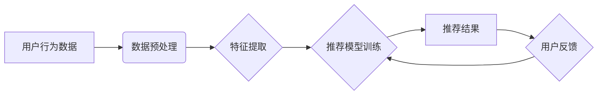

                 

## 大数据与AI 驱动的电商搜索推荐：以准确率与用户体验为中心

> 关键词：电商搜索推荐、大数据、人工智能、机器学习、深度学习、推荐算法、用户体验、准确率

## 1. 背景介绍

在当今数字经济时代，电商平台已成为人们购物的首选方式。然而，面对海量商品和日益增长的用户需求，如何精准推荐用户感兴趣的产品，提升用户购物体验，成为电商平台面临的重大挑战。传统的基于关键词匹配的搜索推荐方式已难以满足用户个性化需求，而大数据与人工智能技术的兴起为电商搜索推荐带来了新的机遇。

大数据技术能够收集、存储和分析海量用户行为数据，如浏览记录、购买历史、评价反馈等，为推荐系统提供丰富的用户画像和商品特征信息。人工智能技术，特别是机器学习和深度学习，能够从海量数据中挖掘出隐藏的模式和关系，构建更精准、更智能的推荐模型。

## 2. 核心概念与联系

电商搜索推荐的核心是利用大数据和人工智能技术，根据用户的历史行为、偏好和上下文信息，预测用户对商品的兴趣，并推荐最相关的商品。

**2.1 核心概念**

* **大数据:** 指规模庞大、结构复杂、更新速度快的海量数据。
* **人工智能 (AI):** 指能够模拟人类智能行为的计算机系统。
* **机器学习 (ML):** 指人工智能的一种实现方式，通过算法学习数据，不断提高预测和决策能力。
* **深度学习 (DL):** 指机器学习的一种高级形式，利用多层神经网络模拟人类大脑的学习过程。
* **推荐算法:** 指用于预测用户对商品的兴趣并推荐相关商品的算法。

**2.2 架构图**



**2.3 联系**

大数据为推荐系统提供丰富的用户行为数据和商品特征信息，人工智能技术，特别是机器学习和深度学习，能够从这些数据中挖掘出隐藏的模式和关系，构建更精准、更智能的推荐模型。推荐算法将用户行为数据和商品特征信息作为输入，预测用户对商品的兴趣，并输出推荐结果。用户反馈会反馈到推荐模型训练环节，不断优化推荐效果。

## 3. 核心算法原理 & 具体操作步骤

### 3.1 算法原理概述

电商搜索推荐算法主要分为以下几类：

* **基于内容的推荐算法:** 根据商品的属性和用户历史行为数据，推荐与用户兴趣相似的商品。
* **基于协同过滤的推荐算法:** 根据用户的相似度和商品的相似度，推荐用户可能感兴趣的商品。
* **基于深度学习的推荐算法:** 利用深度神经网络，从海量数据中学习用户和商品的潜在特征，进行更精准的推荐。

### 3.2 算法步骤详解

以基于协同过滤的推荐算法为例，其具体操作步骤如下：

1. **数据收集:** 收集用户行为数据，如浏览记录、购买历史、评价反馈等。
2. **数据预处理:** 对用户行为数据进行清洗、转换和格式化，例如去除无效数据、填充缺失值等。
3. **用户-商品矩阵构建:** 将用户和商品映射到二维矩阵中，其中每个元素表示用户对商品的评分或行为。
4. **相似度计算:** 计算用户之间的相似度和商品之间的相似度，常用的方法包括余弦相似度、皮尔逊相关系数等。
5. **推荐生成:** 根据用户相似度和商品相似度，推荐用户可能感兴趣的商品。

### 3.3 算法优缺点

**优点:**

* 能够推荐用户可能感兴趣但未曾接触过的商品。
* 不需要商品的显性特征信息，能够发现隐性关系。

**缺点:**

* 数据稀疏性问题: 当用户行为数据稀疏时，难以计算出准确的相似度。
* 冷启动问题: 新用户和新商品难以获得推荐。

### 3.4 算法应用领域

基于协同过滤的推荐算法广泛应用于电商平台、视频网站、音乐平台等领域，例如：

* **商品推荐:** 根据用户的购买历史和浏览记录，推荐用户可能感兴趣的商品。
* **内容推荐:** 根据用户的观看历史和点赞记录，推荐用户可能感兴趣的视频或文章。
* **音乐推荐:** 根据用户的播放历史和收藏记录，推荐用户可能感兴趣的音乐。

## 4. 数学模型和公式 & 详细讲解 & 举例说明

### 4.1 数学模型构建

基于协同过滤的推荐算法的核心是用户-商品矩阵，其数学模型可以表示为：

$$
R = \begin{bmatrix}
r_{11} & r_{12} & \cdots & r_{1m} \\
r_{21} & r_{22} & \cdots & r_{2m} \\
\vdots & \vdots & \ddots & \vdots \\
r_{n1} & r_{n2} & \cdots & r_{nm}
\end{bmatrix}
$$

其中：

* $R$ 是用户-商品矩阵，$n$ 表示用户数量，$m$ 表示商品数量。
* $r_{ij}$ 表示用户 $i$ 对商品 $j$ 的评分或行为。

### 4.2 公式推导过程

用户相似度计算公式：

$$
Sim(u_i, u_j) = \frac{\sum_{k=1}^{m} r_{ik} \cdot r_{jk}}{\sqrt{\sum_{k=1}^{m} r_{ik}^2} \cdot \sqrt{\sum_{k=1}^{m} r_{jk}^2}}
$$

商品相似度计算公式：

$$
Sim(i, j) = \frac{\sum_{u=1}^{n} r_{ui} \cdot r_{uj}}{\sqrt{\sum_{u=1}^{n} r_{ui}^2} \cdot \sqrt{\sum_{u=1}^{n} r_{uj}^2}}
$$

### 4.3 案例分析与讲解

假设有两个用户 $u_1$ 和 $u_2$，他们对以下商品的评分如下：

| 商品 | $u_1$ | $u_2$ |
|---|---|---|
| 商品 A | 5 | 4 |
| 商品 B | 3 | 5 |
| 商品 C | 4 | 3 |

根据上述公式，我们可以计算出用户 $u_1$ 和 $u_2$ 的相似度为：

$$
Sim(u_1, u_2) = \frac{(5 \cdot 4) + (3 \cdot 5) + (4 \cdot 3)}{\sqrt{(5^2 + 3^2 + 4^2)} \cdot \sqrt{(4^2 + 5^2 + 3^2)}} = 0.8
$$

该结果表明，用户 $u_1$ 和 $u_2$ 的兴趣偏好相似度较高。

## 5. 项目实践：代码实例和详细解释说明

### 5.1 开发环境搭建

推荐系统开发环境搭建需要以下软件和工具：

* **编程语言:** Python
* **机器学习库:** scikit-learn, TensorFlow, PyTorch
* **数据处理库:** pandas, numpy
* **数据库:** MySQL, MongoDB

### 5.2 源代码详细实现

以下代码示例展示了基于协同过滤的推荐算法的简单实现：

```python
import pandas as pd
from sklearn.metrics.pairwise import cosine_similarity

# 加载用户-商品矩阵数据
data = pd.read_csv('user_item_matrix.csv')

# 计算用户相似度
user_similarity = cosine_similarity(data)

# 获取用户 ID
user_id = 1

# 获取用户 $user_id$ 相似用户
similar_users = user_similarity[user_id].argsort()[:-10:-1]

# 推荐商品
recommended_items = data.iloc[similar_users].mean().sort_values(ascending=False)

# 打印推荐结果
print(recommended_items)
```

### 5.3 代码解读与分析

* **数据加载:** 使用 pandas 库加载用户-商品矩阵数据。
* **相似度计算:** 使用 scikit-learn 库的 cosine_similarity 函数计算用户之间的相似度。
* **相似用户获取:** 根据用户 ID 获取其相似用户列表。
* **商品推荐:** 计算相似用户对商品的平均评分，并排序推荐。

### 5.4 运行结果展示

运行上述代码后，将输出用户 $user_id$ 相似用户对商品的平均评分，并按照评分从高到低排序，得到推荐商品列表。

## 6. 实际应用场景

### 6.1 电商平台商品推荐

电商平台利用大数据和 AI 技术，根据用户的浏览记录、购买历史、评价反馈等数据，推荐用户可能感兴趣的商品。例如，当用户浏览了某款手机时，电商平台可能会推荐其他同类手机、配件或相关产品。

### 6.2 视频网站内容推荐

视频网站利用用户观看历史、点赞记录、评论等数据，推荐用户可能感兴趣的视频内容。例如，当用户观看了一部科幻电影时，视频网站可能会推荐其他科幻电影、电视剧或相关主题内容。

### 6.3 音乐平台音乐推荐

音乐平台利用用户播放历史、收藏记录、创建的歌单等数据，推荐用户可能感兴趣的音乐。例如，当用户播放了一首流行歌曲时，音乐平台可能会推荐其他流行歌曲、同类型音乐或该歌手的其他作品。

### 6.4 未来应用展望

随着大数据和 AI 技术的不断发展，电商搜索推荐将更加精准、个性化和智能化。未来，电商搜索推荐可能应用于以下领域：

* **个性化商品组合推荐:** 根据用户的需求和偏好，推荐个性化的商品组合。
* **场景化商品推荐:** 根据用户的场景和需求，推荐相关的商品。
* **跨平台推荐:** 将用户行为数据整合到多个平台，实现跨平台的个性化推荐。

## 7. 工具和资源推荐

### 7.1 学习资源推荐

* **书籍:**
    * 《推荐系统实践》
    * 《机器学习》
    * 《深度学习》
* **在线课程:**
    * Coursera: 机器学习
    * Udacity: 深度学习
    * edX: 数据科学

### 7.2 开发工具推荐

* **Python:** 
    * scikit-learn
    * TensorFlow
    * PyTorch
* **数据处理工具:**
    * pandas
    * numpy
* **数据库:**
    * MySQL
    * MongoDB

### 7.3 相关论文推荐

* **协同过滤:**
    * "Collaborative Filtering for Implicit Feedback Datasets"
    * "Matrix Factorization Techniques for Recommender Systems"
* **深度学习推荐:**
    * "Deep Learning for Recommender Systems"
    * "Neural Collaborative Filtering"

## 8. 总结：未来发展趋势与挑战

### 8.1 研究成果总结

大数据与 AI 技术的应用，为电商搜索推荐带来了革命性的变化。基于协同过滤、内容过滤和深度学习的推荐算法，能够提供更加精准、个性化的商品推荐，提升用户购物体验。

### 8.2 未来发展趋势

* **更精准的推荐:** 利用更先进的机器学习和深度学习算法，挖掘更深层次的用户和商品特征，实现更精准的推荐。
* **更个性化的推荐:** 结合用户画像、行为轨迹、上下文信息等多方面数据，提供更加个性化的推荐。
* **更智能的推荐:** 利用自然语言处理、知识图谱等技术，构建更智能的推荐系统，能够理解用户的意图，提供更符合用户需求的推荐。

### 8.3 面临的挑战

* **数据稀疏性:** 用户行为数据往往是稀疏的，难以训练出准确的推荐模型。
* **冷启动问题:** 新用户和新商品难以获得推荐。
* **用户隐私保护:** 大数据收集和分析可能会涉及用户隐私问题，需要采取相应的措施保护用户隐私。

### 8.4 研究展望

未来，电商搜索推荐研究将继续朝着更精准、更个性化、更智能的方向发展。 

## 9. 附录：常见问题与解答

**Q1: 如何解决数据稀疏性问题？**

**A1:** 可以采用以下方法解决数据稀疏性问题：

* **数据增强:** 通过人工标注、聚类等方法增加数据量。
* **协同过滤算法改进:** 使用基于矩阵分解的协同过滤算法，例如 SVD、ALS 等。
* **混合推荐算法:** 将协同过滤算法与内容过滤算法相结合，利用商品的显性特征信息进行补充。

**Q2: 如何解决冷启动问题？**

**A2:** 可以采用以下方法解决冷启动问题：

* **利用用户属性信息:** 根据用户的性别、年龄、兴趣爱好等属性信息进行推荐。
* **利用商品属性信息:** 根据商品的类别、价格、品牌等属性信息进行推荐。
* **利用社会化推荐:** 利用用户的社交关系进行推荐。


作者：禅与计算机程序设计艺术 / Zen and the Art of Computer Programming 
<end_of_turn>

