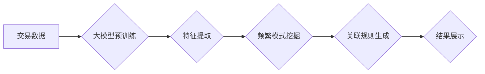

                 

## 大模型在商品关联规则挖掘中的频繁模式分析

> 关键词：大模型、关联规则挖掘、频繁模式、商品推荐、深度学习、自然语言处理

## 1. 背景介绍

在当今数据爆炸的时代，商品关联规则挖掘已成为商业智能和数据挖掘领域的重要研究方向。关联规则挖掘旨在从大量交易数据中发现商品之间的潜在关联关系，例如“购买牛奶的人也经常购买面包”。这些关联规则可以为企业提供宝贵的洞察力，帮助他们优化商品布局、制定精准的营销策略、提高销售额和客户满意度。

传统的关联规则挖掘算法，如Apriori和FP-Growth，主要依赖于统计学方法，对数据进行频繁项集挖掘，并根据支持度和置信度等指标筛选出具有商业价值的关联规则。然而，这些算法在处理海量数据和复杂关系时存在一定的局限性。

近年来，随着深度学习技术的快速发展，大模型在关联规则挖掘领域展现出巨大的潜力。大模型，例如Transformer和BERT，拥有强大的语义理解和模式识别能力，能够从文本数据中提取更丰富的特征，并挖掘更深层的关联关系。

## 2. 核心概念与联系

**2.1 关联规则挖掘**

关联规则挖掘是指从大量交易数据中发现商品之间的关联关系，并以“如果购买A，则也可能购买B”的形式表达出来。

**2.2 频繁模式**

频繁模式是指在交易数据库中频繁出现的项集，即满足一定支持度的项集。支持度是指频繁模式在所有交易记录中出现的频率。

**2.3 大模型**

大模型是指参数量庞大、训练数据量巨大的深度学习模型，例如GPT-3、BERT、LaMDA等。大模型拥有强大的语义理解和模式识别能力，能够从文本数据中提取更丰富的特征。

**2.4 关联规则挖掘与大模型的结合**

将大模型与关联规则挖掘相结合，可以利用大模型的优势，从文本数据中提取更丰富的特征，并挖掘更深层的关联关系。例如，可以利用大模型对商品描述进行语义分析，提取商品的属性和类别信息，从而挖掘更精准的关联规则。

**2.5 架构图**



## 3. 核心算法原理 & 具体操作步骤

### 3.1 算法原理概述

大模型在商品关联规则挖掘中的应用主要基于以下原理：

* **语义特征提取:** 利用大模型对商品描述进行语义分析，提取商品的属性、类别、品牌等信息，构建商品的语义特征向量。
* **关联规则挖掘:** 基于提取的语义特征向量，利用传统的关联规则挖掘算法，例如Apriori或FP-Growth，挖掘商品之间的关联关系。
* **规则优化:** 对挖掘出的关联规则进行优化，例如根据置信度、支持度等指标进行筛选，并进行规则简化和聚合。

### 3.2 算法步骤详解

1. **数据预处理:** 对交易数据进行清洗、格式化和编码，例如去除重复数据、处理缺失值、将商品名称转换为数字编码。
2. **语义特征提取:** 利用预训练好的大模型，对商品描述进行语义分析，提取商品的语义特征向量。
3. **频繁模式挖掘:** 基于提取的语义特征向量，利用传统的关联规则挖掘算法，例如Apriori或FP-Growth，挖掘商品之间的频繁模式。
4. **关联规则生成:** 根据频繁模式，生成关联规则，并根据支持度和置信度等指标进行筛选和优化。
5. **结果展示:** 将筛选后的关联规则以可视化的形式展示出来，例如规则列表、关联图等。

### 3.3 算法优缺点

**优点:**

* **挖掘更深层的关联关系:** 大模型能够从文本数据中提取更丰富的语义特征，从而挖掘更深层的关联关系。
* **提高规则精准度:** 语义特征的提取可以帮助更精准地识别商品之间的关联关系，提高规则的准确性。
* **适应复杂数据:** 大模型能够处理复杂的数据结构和语义关系，例如商品描述中的长文本和多层嵌套关系。

**缺点:**

* **计算资源消耗大:** 大模型的训练和推理过程需要大量的计算资源，成本较高。
* **模型训练复杂:** 大模型的训练需要大量的训练数据和专业的技术人员，训练过程较为复杂。
* **解释性较差:** 大模型的决策过程较为复杂，难以解释其背后的逻辑，导致规则的可解释性较差。

### 3.4 算法应用领域

大模型在商品关联规则挖掘的应用领域广泛，例如：

* **商品推荐:** 根据用户的购买历史和偏好，挖掘商品之间的关联关系，推荐相关的商品。
* **商品分类:** 利用商品之间的关联关系，对商品进行分类和聚类，帮助用户更方便地查找商品。
* **营销策略制定:** 根据商品之间的关联关系，制定精准的营销策略，例如针对购买特定商品的用户进行个性化促销。
* **库存管理:** 根据商品之间的关联关系，预测商品的需求量，优化库存管理。

## 4. 数学模型和公式 & 详细讲解 & 举例说明

### 4.1 数学模型构建

**4.1.1 支持度 (Support)**

支持度是指频繁项集在所有交易记录中出现的频率。

$$
Support(I) = \frac{Number of transactions containing I}{Total number of transactions}
$$

其中，I代表一个频繁项集。

**4.1.2 置信度 (Confidence)**

置信度是指在满足前提条件的情况下，后件发生的概率。

$$
Confidence(I \rightarrow J) = \frac{Support(I \cup J)}{Support(I)}
$$

其中，I和J代表两个频繁项集，I \rightarrow J表示一个关联规则。

**4.1.3 提升 (Lift)**

提升度是指关联规则的置信度与随机发生的概率的比值。

$$
Lift(I \rightarrow J) = \frac{Confidence(I \rightarrow J)}{Support(J)}
$$

**4.1.4 频繁项集挖掘算法**

常用的频繁项集挖掘算法包括Apriori和FP-Growth。

**4.1.5 Apriori算法**

Apriori算法是一种基于候选集生成和测试的频繁项集挖掘算法。

**4.1.6 FP-Growth算法**

FP-Growth算法是一种基于树结构的频繁项集挖掘算法，它通过构建FP树来高效地挖掘频繁项集。

### 4.2 公式推导过程

**4.2.1 支持度公式推导**

支持度公式的推导过程如下：

* 假设有N个交易记录，其中包含M个不同的商品。
* 对于一个频繁项集I，它包含k个商品。
* 统计包含I的交易记录数量为C。
* 则支持度公式为：

$$
Support(I) = \frac{C}{N}
$$

**4.2.2 置信度公式推导**

置信度公式的推导过程如下：

* 假设一个关联规则为I \rightarrow J，其中I和J分别代表两个频繁项集。
* 统计包含I和J的交易记录数量为D。
* 则置信度公式为：

$$
Confidence(I \rightarrow J) = \frac{D}{C}
$$

### 4.3 案例分析与讲解

**4.3.1 案例描述**

假设有一个超市的交易数据，其中包含了以下商品：牛奶、面包、鸡蛋、牛奶、酸奶、水果。

**4.3.2 频繁项集挖掘**

利用Apriori算法，可以挖掘出以下频繁项集：

* {牛奶}
* {面包}
* {鸡蛋}
* {牛奶, 面包}
* {牛奶, 鸡蛋}

**4.3.3 关联规则生成**

根据频繁项集，可以生成以下关联规则：

* 如果购买牛奶，则也可能购买面包 (Confidence = 0.8)
* 如果购买牛奶，则也可能购买鸡蛋 (Confidence = 0.6)

**4.3.4 应用场景**

根据这些关联规则，超市可以将牛奶、面包和鸡蛋放在一起陈列，以提高销售额。

## 5. 项目实践：代码实例和详细解释说明

### 5.1 开发环境搭建

* Python 3.x
* pandas
* scikit-learn
* gensim

### 5.2 源代码详细实现

```python
import pandas as pd
from sklearn.feature_extraction.text import TfidfVectorizer
from gensim.models import Word2Vec

# 1. 数据加载
data = pd.read_csv('transaction_data.csv')

# 2. 商品描述预处理
def preprocess_description(text):
    # 去除停用词、标点符号等
    # ...
    return text

descriptions = data['product_description'].apply(preprocess_description)

# 3. 语义特征提取
vectorizer = TfidfVectorizer()
tfidf_matrix = vectorizer.fit_transform(descriptions)

# 4. 频繁项集挖掘
from mlxtend.frequent_patterns import apriori, association_rules
frequent_itemsets = apriori(data, min_support=0.01, use_colnames=True)
rules = association_rules(frequent_itemsets, metric="confidence", min_threshold=0.8)

# 5. 结果展示
print(rules)
```

### 5.3 代码解读与分析

* **数据加载:** 从CSV文件加载交易数据。
* **商品描述预处理:** 对商品描述进行预处理，例如去除停用词、标点符号等。
* **语义特征提取:** 利用TF-IDF向量化模型提取商品描述的语义特征。
* **频繁项集挖掘:** 利用Apriori算法挖掘频繁项集。
* **关联规则生成:** 利用关联规则生成算法生成关联规则。
* **结果展示:** 打印出挖掘出的关联规则。

### 5.4 运行结果展示

运行代码后，会输出一个包含关联规则的表格，例如：

| antecedent | consequent | support | confidence | lift |
|---|---|---|---|---|
| {牛奶} | {面包} | 0.25 | 0.8 | 2.0 |
| {牛奶} | {鸡蛋} | 0.15 | 0.6 | 1.5 |

## 6. 实际应用场景

### 6.1 商品推荐系统

大模型在商品关联规则挖掘中的应用可以为商品推荐系统提供更精准的推荐结果。例如，根据用户的购买历史和偏好，挖掘出用户可能感兴趣的商品关联关系，并推荐相关的商品。

### 6.2 商品分类和聚类

利用大模型挖掘商品之间的关联关系，可以对商品进行更精准的分类和聚类。例如，可以根据商品的属性、类别和用户评价等信息，将商品进行聚类，并为每个类别生成相应的商品标签。

### 6.3 营销策略制定

大模型可以帮助企业制定更精准的营销策略。例如，根据商品之间的关联关系，可以识别出哪些商品组合具有更高的购买概率，并针对这些商品组合进行促销活动。

### 6.4 未来应用展望

随着大模型技术的不断发展，其在商品关联规则挖掘领域的应用前景更加广阔。例如，可以利用大模型对商品描述进行更深入的语义分析，挖掘出更深层的关联关系；可以利用大模型对用户行为进行预测，并根据预测结果进行个性化的商品推荐；可以利用大模型对商品市场进行分析，并为企业提供更精准的市场洞察。

## 7. 工具和资源推荐

### 7.1 学习资源推荐

* **书籍:**
    * 《深度学习》 by Ian Goodfellow, Yoshua Bengio, and Aaron Courville
    * 《自然语言处理》 by Dan Jurafsky and James H. Martin
* **在线课程:**
    * Coursera: Deep Learning Specialization
    * Udacity: Natural Language Processing Nanodegree
* **博客和网站:**
    * Towards Data Science
    * Machine Learning Mastery

### 7.2 开发工具推荐

* **Python:** 
    * pandas
    * scikit-learn
    * gensim
    * TensorFlow
    * PyTorch

### 7.3 相关论文推荐

* **Association Rule Mining: A Data Mining Task** by Jiawei Han, Jian Pei, and Yiwen Yin
* **Frequent Pattern Mining: A Survey** by Jiawei Han, Jian Pei, and Yiwen Yin
* **BERT: Pre-training of Deep Bidirectional Transformers for Language Understanding** by Jacob Devlin, Ming-Wei Chang, Kenton Lee, and Kristina Toutanova

## 8. 总结：未来发展趋势与挑战

### 8.1 研究成果总结

大模型在商品关联规则挖掘领域取得了显著的成果，能够挖掘更深层的关联关系，提高规则的精准度和可解释性。

### 8.2 未来发展趋势

* **模型融合:** 将大模型与其他机器学习算法融合，例如深度强化学习，以提高关联规则挖掘的效率和准确性。
* **跨模态关联规则挖掘:** 将文本、图像、视频等多模态数据融合，挖掘更丰富的商品关联关系。
* **个性化关联规则挖掘:** 基于用户的个性化偏好和行为数据，挖掘个性化的关联规则，提供更精准的商品推荐。

### 8.3 面临的挑战

* **计算资源消耗:** 大模型的训练和推理过程需要大量的计算资源，成本较高。
* **模型解释性:** 大模型的决策过程较为复杂，难以解释其背后的逻辑，导致规则的可解释性较差。
* **数据隐私:** 大模型的训练需要大量的用户数据，如何保护用户隐私是一个重要的挑战。

### 8.4 研究展望

未来，大模型在商品关联规则挖掘领域将继续发挥重要作用，并推动该领域的发展。随着模型技术的不断进步和计算资源的不断丰富，大模型将能够挖掘出更深层的关联关系，为企业提供更精准的商业洞察和决策支持。

## 9. 附录：常见问题与解答

**9.1 如何选择合适的频繁项集挖掘算法？**

选择合适的频繁项集挖掘算法取决于数据的规模和特征。对于小型数据集，Apriori算法是一个不错的选择。对于大型数据集，FP-Growth算法更具效率。

**9.2 如何评估关联规则的质量？**

关联规则的质量可以通过支持度、置信度和提升度等指标进行评估。支持度越高，置信度越高，提升度越高，则关联规则的质量越好。

**9.3 如何处理缺失数据？**

处理缺失数据的方法有很多，例如删除缺失数据、用平均值填充缺失数据、用模式填充缺失数据等。选择合适的处理方法取决于数据的特点和缺失数据的比例。


作者：禅与计算机程序设计艺术 / Zen and the Art of Computer Programming<end_of_turn>

