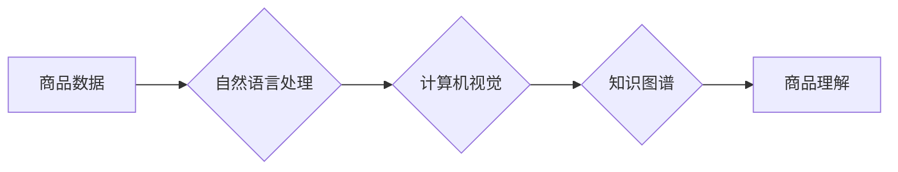

                 

## 大模型在商品理解方面的优势

> 关键词：大模型、商品理解、自然语言处理、计算机视觉、知识图谱、推荐系统、电商

## 1. 背景介绍

随着电商行业的蓬勃发展，商品理解已成为电商平台的核心竞争力之一。传统的商品理解方法主要依赖人工标注和规则引擎，效率低下且难以应对商品信息的多样性和复杂性。近年来，大模型技术在自然语言处理、计算机视觉等领域取得了突破性进展，为商品理解带来了新的机遇。

大模型是指参数规模庞大、训练数据海量的人工智能模型。其强大的学习能力和泛化能力使其能够从海量商品数据中学习商品的特征、属性、关系等，实现更精准、更智能的商品理解。

## 2. 核心概念与联系

### 2.1 商品理解

商品理解是指机器能够理解商品的属性、特征、描述、用户需求等信息，并能够根据这些信息进行相关操作，例如商品分类、搜索、推荐、问答等。

### 2.2 大模型

大模型是指参数规模庞大、训练数据海量的人工智能模型。其强大的学习能力和泛化能力使其能够从海量数据中学习复杂的模式和关系，并应用于各种任务。

### 2.3 核心技术

大模型在商品理解中应用的核心技术包括：

* **自然语言处理 (NLP)**：用于理解商品的文本描述、用户评论等自然语言信息。
* **计算机视觉 (CV)**：用于理解商品的图像和视频信息，例如商品的外观、材质、尺寸等。
* **知识图谱 (KG)**：用于构建商品的知识表示，例如商品的类别、属性、品牌、关系等。

**Mermaid 流程图**



## 3. 核心算法原理 & 具体操作步骤

### 3.1 算法原理概述

大模型在商品理解中的核心算法主要包括：

* **Transformer**:  一种基于注意力机制的深度学习模型，能够有效地捕捉文本序列中的长距离依赖关系，在商品文本描述理解方面表现出色。
* **CNN**:  一种卷积神经网络，能够有效地提取图像中的特征，在商品图像识别和分类方面表现出色。
* **Graph Neural Networks (GNN)**:  一种能够处理图结构数据的深度学习模型，能够有效地学习商品之间的关系，在商品推荐和知识图谱构建方面表现出色。

### 3.2 算法步骤详解

**以 Transformer 模型为例，商品文本描述理解的具体操作步骤如下：**

1. **数据预处理**: 将商品文本描述进行清洗、分词、词嵌入等预处理操作，使其能够被模型理解。
2. **模型输入**: 将预处理后的文本序列输入到 Transformer 模型中。
3. **编码**: Transformer 模型的编码器部分将文本序列编码成一个表示商品语义的向量。
4. **解码**: Transformer 模型的解码器部分根据编码后的向量生成商品的理解结果，例如商品类别、属性、描述等。
5. **结果输出**: 将解码后的结果输出，并进行后处理，例如解码、格式化等。

### 3.3 算法优缺点

**Transformer 模型的优缺点：**

* **优点**: 能够有效地捕捉文本序列中的长距离依赖关系，在商品文本描述理解方面表现出色。
* **缺点**: 参数规模庞大，训练成本高，对训练数据要求较高。

### 3.4 算法应用领域

大模型在商品理解中的应用领域广泛，包括：

* **商品分类**: 根据商品的文本描述和图像信息，自动将商品分类到不同的类别。
* **商品搜索**: 根据用户的搜索关键词，从海量商品数据中检索出相关的商品。
* **商品推荐**: 根据用户的历史购买记录、浏览记录等信息，推荐用户可能感兴趣的商品。
* **商品问答**: 回答用户关于商品的各种问题，例如商品的属性、价格、库存等。

## 4. 数学模型和公式 & 详细讲解 & 举例说明

### 4.1 数学模型构建

Transformer 模型的核心是注意力机制，其数学模型可以表示为：

$$
Attention(Q, K, V) = softmax(\frac{QK^T}{\sqrt{d_k}})V
$$

其中：

* $Q$：查询矩阵
* $K$：键矩阵
* $V$：值矩阵
* $d_k$：键向量的维度
* $softmax$：softmax 函数

### 4.2 公式推导过程

注意力机制的目的是计算查询向量 $Q$ 与键向量 $K$ 之间的相关性，并根据相关性对值向量 $V$ 进行加权求和。

* $QK^T$：计算查询向量与键向量的点积，得到一个得分矩阵。
* $\frac{QK^T}{\sqrt{d_k}}$：对得分矩阵进行归一化，使得每个元素的范围在0到1之间。
* $softmax$：对归一化后的得分矩阵应用 softmax 函数，得到每个键向量的权重。
* $V$：根据权重对值向量进行加权求和，得到最终的输出向量。

### 4.3 案例分析与讲解

假设我们有一个商品描述序列 "这款手机拍照效果很好，屏幕也很大"，我们想要理解其关键信息。

* $Q$：查询向量可以表示为 "手机的拍照效果"。
* $K$：键向量可以表示为每个词的语义向量，例如 "拍照"、"效果"、"很好" 等。
* $V$：值向量可以表示为每个词的语义信息，例如 "拍照效果" 的语义信息。

通过注意力机制，模型可以计算出 "拍照"、"效果"、"很好" 等词与 "手机的拍照效果" 之间的相关性，并根据相关性对 "拍照效果" 的语义信息进行加权求和，最终得到 "这款手机拍照效果很好" 的理解结果。

## 5. 项目实践：代码实例和详细解释说明

### 5.1 开发环境搭建

* Python 3.7+
* PyTorch 1.7+
* Transformers 库

### 5.2 源代码详细实现

```python
from transformers import AutoModelForSequenceClassification, AutoTokenizer

# 加载预训练模型和词典
model_name = "bert-base-uncased"
tokenizer = AutoTokenizer.from_pretrained(model_name)
model = AutoModelForSequenceClassification.from_pretrained(model_name)

# 输入商品文本描述
text = "这款手机拍照效果很好，屏幕也很大"

# 对文本进行编码
inputs = tokenizer(text, return_tensors="pt")

# 使用模型进行预测
outputs = model(**inputs)

# 获取预测结果
predicted_class = outputs.logits.argmax().item()

# 打印预测结果
print(f"预测结果: {predicted_class}")
```

### 5.3 代码解读与分析

* 代码首先加载预训练的 BERT 模型和词典。
* 然后对输入的商品文本描述进行编码，将文本转换为模型可以理解的格式。
* 使用模型进行预测，得到商品分类的概率分布。
* 最后根据概率分布选择最可能的分类结果。

### 5.4 运行结果展示

运行上述代码，可以得到商品分类的结果，例如 "手机"、"电子产品"、"数码产品" 等。

## 6. 实际应用场景

大模型在商品理解方面的应用场景广泛，例如：

* **电商平台商品搜索**: 根据用户的搜索关键词，利用大模型对商品文本描述和图像进行理解，提高搜索结果的准确性和相关性。
* **个性化商品推荐**: 利用大模型对用户的历史购买记录、浏览记录等信息进行理解，推荐用户可能感兴趣的商品。
* **智能客服**: 利用大模型对用户的商品咨询进行理解，自动回答用户的问题，提高客服效率。
* **商品内容生成**: 利用大模型生成商品的描述、标题、广告文案等内容，提高商品的吸引力和转化率。

### 6.4 未来应用展望

随着大模型技术的不断发展，其在商品理解方面的应用场景将更加广泛，例如：

* **多模态商品理解**: 将文本、图像、视频等多种模态信息融合，实现更全面的商品理解。
* **个性化商品定制**: 根据用户的需求和喜好，利用大模型生成个性化的商品设计方案。
* **商品溯源**: 利用大模型对商品的生产、流通、销售等信息进行理解，实现商品的溯源追踪。

## 7. 工具和资源推荐

### 7.1 学习资源推荐

* **Hugging Face Transformers**: https://huggingface.co/docs/transformers/index
* **OpenAI GPT-3**: https://openai.com/api/
* **Google BERT**: https://ai.googleblog.com/2018/11/open-sourcing-bert-state-of-art-pre.html

### 7.2 开发工具推荐

* **PyTorch**: https://pytorch.org/
* **TensorFlow**: https://www.tensorflow.org/
* **Jupyter Notebook**: https://jupyter.org/

### 7.3 相关论文推荐

* **Attention Is All You Need**: https://arxiv.org/abs/1706.03762
* **BERT: Pre-training of Deep Bidirectional Transformers for Language Understanding**: https://arxiv.org/abs/1810.04805
* **Graph Convolutional Networks**: https://arxiv.org/abs/1609.02907

## 8. 总结：未来发展趋势与挑战

### 8.1 研究成果总结

大模型在商品理解方面取得了显著的成果，例如：

* **提高了商品分类、搜索、推荐等任务的准确率和效率。**
* **实现了商品的多模态理解，例如文本、图像、视频的融合。**
* **为个性化商品定制和商品溯源等新应用场景提供了技术支持。**

### 8.2 未来发展趋势

* **模型规模的进一步扩大**: 随着计算资源的不断提升，大模型的规模将进一步扩大，模型的理解能力和泛化能力将得到进一步提升。
* **多模态理解的深入研究**: 将文本、图像、视频等多种模态信息融合，实现更全面的商品理解。
* **场景化模型的开发**: 开发针对特定场景的商品理解模型，例如电商平台、智能客服等。
* **可解释性研究的加强**: 研究大模型的决策过程，提高模型的可解释性和可信任性。

### 8.3 面临的挑战

* **数据获取和标注**: 大模型的训练需要海量数据，数据获取和标注成本高昂。
* **模型训练和部署**: 大模型的训练和部署需要强大的计算资源，成本较高。
* **模型安全性和隐私性**: 大模型可能存在安全性和隐私性问题，需要采取相应的措施进行保护。

### 8.4 研究展望

未来，大模型在商品理解方面的研究将更加深入，将为电商平台、智能客服、商品设计等领域带来更多创新应用。


## 9. 附录：常见问题与解答

**Q1: 大模型的训练成本很高，如何降低训练成本？**

**A1:** 

* 使用预训练模型进行微调，减少训练数据和训练时间。
* 采用分布式训练技术，将模型训练任务分发到多个机器上进行并行训练。
* 优化模型架构，减少模型参数数量。

**Q2: 大模型的解释性差，如何提高模型的可解释性？**

**A2:** 

* 使用注意力机制等技术，分析模型对输入数据的关注点。
* 开发可解释性评估指标，量化模型的可解释性。
* 研究基于规则的模型解释方法，将模型的决策过程转化为可理解的规则。


作者：禅与计算机程序设计艺术 / Zen and the Art of Computer Programming 
<end_of_turn>

