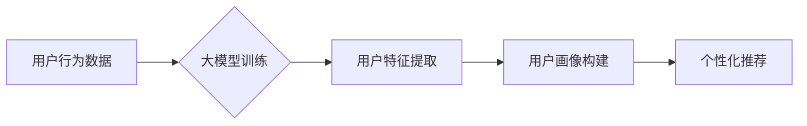

                 

## 大模型对推荐系统用户画像的增强

> 关键词：大模型、用户画像、推荐系统、深度学习、自然语言处理、个性化推荐

## 1. 背景介绍

推荐系统作为互联网时代的重要技术支柱，旨在根据用户的历史行为、偏好和上下文信息，精准推荐用户感兴趣的内容或商品。用户画像作为推荐系统的核心基础，是构建用户行为模型、理解用户需求的关键。传统的用户画像构建方法主要依赖于用户显性反馈（如评分、评论）和隐性反馈（如点击、浏览、购买），但这些数据往往是碎片化、结构化的，难以全面刻画用户的复杂需求和多维特征。

近年来，大模型技术蓬勃发展，其强大的语义理解和文本生成能力为用户画像构建带来了新的机遇。大模型能够从海量文本数据中学习用户兴趣、价值观、生活方式等深层特征，构建更加精准、全面的用户画像，从而提升推荐系统的个性化推荐效果。

## 2. 核心概念与联系

### 2.1 大模型

大模型是指参数规模庞大、训练数据海量的人工智能模型，通常拥有数十亿甚至千亿个参数。通过深度学习技术，大模型能够学习复杂的模式和关系，展现出强大的泛化能力和语义理解能力。

### 2.2 用户画像

用户画像是指对用户进行深入分析和描述，构建出用户特征、行为模式、兴趣偏好等多维度的综合描述。用户画像是推荐系统的重要基础，用于理解用户需求、预测用户行为，从而提供个性化推荐服务。

### 2.3 关系

大模型能够从海量文本数据中学习用户特征，为用户画像构建提供新的数据来源和分析方法。大模型的语义理解能力可以帮助挖掘用户隐性需求，构建更加精准的用户画像。

**Mermaid 流程图**



## 3. 核心算法原理 & 具体操作步骤

### 3.1 算法原理概述

大模型在用户画像构建中的核心算法主要包括：

* **文本嵌入:** 将文本数据转换为向量表示，以便模型进行语义分析和比较。常用的文本嵌入方法包括Word2Vec、GloVe、BERT等。
* **聚类算法:** 将用户特征向量进行聚类，将具有相似特征的用户归为同一类，构建用户群体画像。常用的聚类算法包括K-means、DBSCAN等。
* **深度学习模型:** 利用深度学习模型，例如循环神经网络（RNN）、Transformer等，从用户文本数据中学习用户兴趣、偏好等深层特征，构建更加精准的用户画像。

### 3.2 算法步骤详解

1. **数据收集:** 收集用户相关的文本数据，例如用户评论、社交媒体帖子、浏览历史等。
2. **数据预处理:** 对文本数据进行清洗、去停用词、分词等预处理，以便模型训练。
3. **文本嵌入:** 使用文本嵌入模型将文本数据转换为向量表示。
4. **特征提取:** 从用户文本向量中提取用户特征，例如兴趣爱好、生活方式、价值观等。
5. **聚类分析:** 使用聚类算法将用户特征向量进行聚类，构建用户群体画像。
6. **用户画像构建:** 基于聚类结果和用户特征，构建用户画像，包括用户基本信息、兴趣偏好、行为模式等。

### 3.3 算法优缺点

**优点:**

* 能够从海量文本数据中学习用户深层特征，构建更加精准的用户画像。
* 能够挖掘用户隐性需求，提供更加个性化的推荐服务。
* 能够动态更新用户画像，适应用户的行为变化。

**缺点:**

* 需要海量文本数据进行训练，数据获取和处理成本较高。
* 模型训练复杂，需要专业的技术人员进行操作。
* 存在隐私安全问题，需要妥善处理用户敏感信息。

### 3.4 算法应用领域

大模型在用户画像构建中的应用领域广泛，包括：

* **电商推荐:** 建立用户兴趣偏好画像，推荐个性化商品。
* **内容推荐:** 建立用户阅读习惯画像，推荐个性化内容。
* **社交推荐:** 建立用户社交关系画像，推荐潜在好友。
* **广告推荐:** 建立用户兴趣画像，精准投放广告。

## 4. 数学模型和公式 & 详细讲解 & 举例说明

### 4.1 数学模型构建

用户画像构建可以看作是一个特征提取和聚类的问题。

* **特征提取:** 可以使用神经网络模型，例如Transformer，将用户文本数据映射到一个低维特征空间。

* **聚类:** 可以使用K-means算法将用户特征向量进行聚类，将具有相似特征的用户归为同一类。

### 4.2 公式推导过程

**K-means算法**

1. **初始化:** 随机选择K个用户作为初始聚类中心。
2. **分配:** 将每个用户分配到距离其最近的聚类中心所属的类别。
3. **更新:** 计算每个聚类中心的新的位置，作为所有该类别用户特征向量的均值。
4. **重复:** 重复步骤2和3，直到聚类中心不再变化或达到最大迭代次数。

**公式:**

* **距离计算:** 使用欧氏距离或余弦相似度等距离度量方法计算用户特征向量与聚类中心的距离。
* **聚类中心更新:**

$$
\mu_i = \frac{1}{n_i} \sum_{j=1}^{n_i} x_j
$$

其中，$\mu_i$ 是第i个聚类中心的特征向量，$x_j$ 是第j个属于第i个聚类的用户特征向量，$n_i$ 是第i个聚类中用户的数量。

### 4.3 案例分析与讲解

假设我们有一个电商平台，想要构建用户的兴趣偏好画像。我们可以收集用户的商品浏览历史、购买记录、评论等文本数据。

1. 使用BERT模型将用户文本数据转换为向量表示。
2. 使用K-means算法将用户特征向量进行聚类，例如将用户分为“电子产品爱好者”、“服装爱好者”、“美食爱好者”等类别。
3. 构建用户画像，包括用户基本信息、兴趣偏好类别、购买频率等。

## 5. 项目实践：代码实例和详细解释说明

### 5.1 开发环境搭建

* Python 3.7+
* TensorFlow/PyTorch
* NLTK/SpaCy
* scikit-learn

### 5.2 源代码详细实现

```python
# 导入必要的库
import tensorflow as tf
from sklearn.cluster import KMeans

# 加载预训练的BERT模型
bert_model = tf.keras.applications.BERT_EN_uncased.BERT_EN_uncased(weights='bert_base_uncased')

# 定义文本预处理函数
def preprocess_text(text):
  # ... (文本清洗、分词等预处理操作)

# 定义特征提取函数
def extract_features(text):
  # 使用BERT模型提取文本特征
  inputs = bert_model(text)
  # 返回BERT模型输出的最后一个隐藏层的输出向量
  return inputs[0][:, 0, :]

# 加载用户文本数据
user_texts = []
# ... (加载用户文本数据)

# 预处理文本数据
processed_texts = [preprocess_text(text) for text in user_texts]

# 提取用户特征
user_features = [extract_features(text) for text in processed_texts]

# 使用K-means算法进行聚类
kmeans = KMeans(n_clusters=5, random_state=42)
kmeans.fit(user_features)

# 获取聚类结果
user_clusters = kmeans.labels_

# 构建用户画像
user_profiles = []
for i, cluster in enumerate(user_clusters):
  user_profile = {
    'user_id': i,
    'cluster': cluster,
    # ... (其他用户特征)
  }
  user_profiles.append(user_profile)

# ... (保存用户画像数据)
```

### 5.3 代码解读与分析

* 代码首先导入必要的库，并加载预训练的BERT模型。
* 定义了文本预处理和特征提取函数，将用户文本数据转换为向量表示。
* 使用K-means算法进行聚类，将用户特征向量进行分组。
* 根据聚类结果构建用户画像，包括用户ID、聚类类别以及其他用户特征。

### 5.4 运行结果展示

运行代码后，将得到每个用户的聚类类别，以及相应的用户画像信息。

## 6. 实际应用场景

### 6.1 电商推荐

大模型可以帮助电商平台构建更加精准的用户画像，推荐个性化商品。例如，可以根据用户的浏览历史、购买记录、评论等文本数据，分析用户的兴趣偏好、消费习惯等，推荐用户可能感兴趣的商品。

### 6.2 内容推荐

大模型可以帮助内容平台构建用户阅读习惯画像，推荐个性化内容。例如，可以根据用户的阅读历史、点赞记录、评论等文本数据，分析用户的兴趣领域、阅读偏好等，推荐用户可能感兴趣的文章、视频等内容。

### 6.3 社交推荐

大模型可以帮助社交平台构建用户社交关系画像，推荐潜在好友。例如，可以根据用户的社交媒体帖子、评论、点赞等文本数据，分析用户的兴趣爱好、价值观等，推荐与用户兴趣相似的用户。

### 6.4 未来应用展望

大模型在用户画像构建领域的应用前景广阔，未来可能在以下方面得到进一步发展：

* **多模态用户画像:** 将文本数据与其他模态数据，例如图像、音频、视频等，进行融合，构建更加全面的用户画像。
* **动态用户画像:** 利用大模型的在线学习能力，实时更新用户画像，适应用户的行为变化。
* **个性化用户体验:** 基于用户画像，提供更加个性化的用户体验，例如个性化推荐、个性化内容定制等。

## 7. 工具和资源推荐

### 7.1 学习资源推荐

* **书籍:**
    * 《深度学习》 by Ian Goodfellow, Yoshua Bengio, Aaron Courville
    * 《自然语言处理》 by Dan Jurafsky, James H. Martin
* **在线课程:**
    * Coursera: Deep Learning Specialization
    * Stanford CS224N: Natural Language Processing with Deep Learning

### 7.2 开发工具推荐

* **TensorFlow:** 开源深度学习框架
* **PyTorch:** 开源深度学习框架
* **Hugging Face Transformers:** 预训练大模型库

### 7.3 相关论文推荐

* BERT: Pre-training of Deep Bidirectional Transformers for Language Understanding
* GPT-3: Language Models are Few-Shot Learners
* T5: Text-to-Text Transfer Transformer

## 8. 总结：未来发展趋势与挑战

### 8.1 研究成果总结

大模型技术在用户画像构建领域取得了显著进展，能够从海量文本数据中学习用户深层特征，构建更加精准的用户画像。这为推荐系统提供了更加强大的数据支撑，提升了推荐系统的个性化推荐效果。

### 8.2 未来发展趋势

未来，大模型在用户画像构建领域将朝着以下方向发展：

* **多模态用户画像:** 将文本数据与其他模态数据融合，构建更加全面的用户画像。
* **动态用户画像:** 利用大模型的在线学习能力，实时更新用户画像，适应用户的行为变化。
* **个性化用户体验:** 基于用户画像，提供更加个性化的用户体验，例如个性化推荐、个性化内容定制等。

### 8.3 面临的挑战

大模型在用户画像构建领域也面临一些挑战：

* **数据获取和隐私保护:** 大模型需要海量数据进行训练，如何获取高质量数据并保护用户隐私是一个重要问题。
* **模型 interpretability:** 大模型的决策过程往往是复杂的，如何解释模型的决策结果，提高模型的透明度和可信度是一个挑战。
* **模型效率:** 大模型的训练和推理过程往往需要大量的计算资源，如何提高模型的效率是一个重要的研究方向。

### 8.4 研究展望

未来，我们需要继续探索大模型在用户画像构建领域的应用，解决上述挑战，推动大模型技术在推荐系统领域的进一步发展。


## 9. 附录：常见问题与解答

**Q1: 大模型训练需要多少数据？**

A1: 大模型的训练数据量通常在数十亿甚至千亿级别。

**Q2: 如何保护用户隐私？**

A2: 在使用大模型构建用户画像时，需要采取措施保护用户隐私，例如数据匿名化、差分隐私等技术。

**Q3: 如何评估大模型的用户画像质量？**

A3: 可以使用各种指标来评估大模型的用户画像质量，例如聚类准确率、用户画像覆盖率等。


作者：禅与计算机程序设计艺术 / Zen and the Art of Computer Programming 
<end_of_turn>

