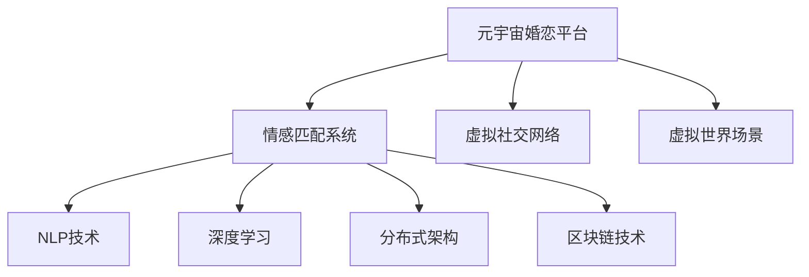

                 

# 元宇宙婚恋平台:虚拟世界中的情感匹配系统

> 关键词：元宇宙婚恋、情感匹配系统、NLP技术、深度学习、自然语言理解、个性化推荐、分布式架构、区块链技术

## 1. 背景介绍

随着数字技术的发展和互联网应用的普及，人类社会正逐渐进入一个全新的虚拟时代——元宇宙。元宇宙是一个以数字身份为核心的虚拟空间，用户可以通过虚拟化身在虚拟世界中自由交流、工作、生活，甚至进行情感社交。元宇宙婚恋平台，作为元宇宙空间中的重要应用，正在引发一系列技术革新和商业模式变革。

### 1.1 元宇宙婚恋平台发展现状

目前，元宇宙婚恋平台主要可以分为两类：

1. **基于虚拟社交网络的婚恋平台**：这类平台主要聚焦于社交和交友功能，通过虚拟身份在虚拟社交网络中相互认识，通过文本、语音、视频等多种方式进行互动，进而建立情感联系。如Meta Horizon、Vivox等。

2. **基于虚拟世界的婚恋平台**：这类平台注重在虚拟世界中进行沉浸式交互，通过虚拟场景、虚拟活动等方式，让用户在虚拟世界中体验真实情感互动。如Altiverse、Meshworld等。

无论是哪一类平台，都面临着情感匹配的挑战。如何更准确地匹配用户需求和偏好，提升用户体验，增强情感互动的深度和广度，是元宇宙婚恋平台的关键技术难题。本文将探讨元宇宙婚恋平台中的情感匹配系统，基于自然语言处理(NLP)技术和深度学习算法，提出一种有效的情感匹配方法。

## 2. 核心概念与联系

### 2.1 核心概念概述

为更好地理解元宇宙婚恋平台中的情感匹配系统，本节将介绍几个密切相关的核心概念：

- **元宇宙婚恋平台**：以虚拟身份为基础，提供虚拟世界中的婚恋交友功能。通过虚拟社交网络和虚拟世界场景，实现情感社交的虚拟平台。
- **情感匹配系统**：通过分析用户情感数据、行为数据和偏好数据，匹配合适的情感对象，实现用户间的情感互动。
- **自然语言处理(NLP)**：研究如何通过计算机处理、理解和生成自然语言，以实现情感理解、情感表达等功能。
- **深度学习**：通过多层神经网络模型，自动学习数据的特征表示，实现复杂的情感分类和情感匹配任务。
- **分布式架构**：通过分布式计算和存储技术，构建高性能的情感匹配服务，满足元宇宙平台的实时性和扩展性需求。
- **区块链技术**：通过区块链技术实现情感数据的透明、安全和不可篡改，保障用户隐私和情感匹配的公平公正。

这些核心概念之间的逻辑关系可以通过以下Mermaid流程图来展示：



这个流程图展示了几大核心概念及其之间的关系：

1. 元宇宙婚恋平台通过虚拟社交网络和虚拟世界场景提供情感互动功能。
2. 情感匹配系统通过NLP和深度学习算法，匹配合适的情感对象，实现情感互动。
3. NLP技术用于情感理解、情感表达等功能，是情感匹配系统的核心。
4. 深度学习算法通过自动学习数据特征，实现复杂的情感分类和匹配任务。
5. 分布式架构用于提高情感匹配服务的性能和可扩展性，满足元宇宙平台的实时需求。
6. 区块链技术保障情感数据的透明、安全和公平，增强用户信任。

这些概念共同构成了元宇宙婚恋平台中的情感匹配系统的技术框架，使其能够在虚拟世界中进行高效的情感匹配。

## 3. 核心算法原理 & 具体操作步骤

### 3.1 算法原理概述

元宇宙婚恋平台中的情感匹配系统，基于自然语言处理(NLP)技术和深度学习算法，实现情感分类和匹配任务。其核心思想是：通过分析用户的情感数据、行为数据和偏好数据，自动学习并表示用户的情感特征，构建情感匹配模型，匹配合适的情感对象。

形式化地，假设用户情感特征向量为 $X=\{x_1,x_2,...,x_n\}$，情感分类模型为 $F$，情感匹配模型为 $G$。情感匹配系统的工作流程如下：

1. **情感数据采集**：收集用户的文本、语音、视频等情感数据，进行特征提取和预处理。
2. **情感分类**：使用深度学习模型 $F$，对用户的情感数据进行分类，得到情感标签 $Y$。
3. **特征表示**：将用户的情感标签 $Y$ 和行为数据 $Z$，通过深度学习模型 $G$，学习用户情感特征向量 $X'$。
4. **情感匹配**：将用户情感特征向量 $X'$ 输入到情感匹配模型 $G$，匹配到合适的情感对象，输出情感匹配结果。

通过上述流程，情感匹配系统能够自动地理解用户的情感需求，匹配合适的情感对象，实现元宇宙婚恋平台的情感互动功能。

### 3.2 算法步骤详解

以下是情感匹配系统的详细操作步骤：

**Step 1: 情感数据采集**

情感数据采集是情感匹配系统的基础，需要收集用户的多样化情感数据，包括文本、语音、视频等多种形式。通过传感器和数据采集器，获取用户在不同场景下的情感表达数据。数据采集需遵循隐私保护原则，确保用户知情并同意数据使用。

**Step 2: 情感特征提取**

情感特征提取旨在从原始情感数据中，提取有用的情感特征。常用的方法包括：

1. **文本特征提取**：通过TF-IDF、词嵌入等方法，将文本转换为向量表示。如使用BERT、GPT等预训练语言模型，提取文本特征向量。

2. **语音特征提取**：通过MFCC、Mel-Spectrogram等方法，将语音转换为频谱图或MFCC特征向量。

3. **视频特征提取**：通过CNN、RNN等方法，提取视频帧的视觉特征或情感特征。

**Step 3: 情感分类**

情感分类通过深度学习模型，对用户情感数据进行分类，得到情感标签。常用的分类模型包括：

1. **卷积神经网络(CNN)**：通过卷积层、池化层和全连接层，对情感数据进行特征提取和分类。

2. **循环神经网络(RNN)**：通过LSTM、GRU等模型，处理时间序列情感数据，实现情感分类。

3. **Transformer模型**：通过注意力机制和自适应编码器，对情感数据进行表示学习，实现高精度的情感分类。

**Step 4: 情感特征表示**

情感特征表示旨在将用户的情感分类结果和行为数据，映射到高维特征空间中。常用的方法包括：

1. **向量映射**：通过向量映射，将情感分类结果和行为数据，转换为高维特征向量。如使用线性回归、随机森林等方法。

2. **深度学习表示**：通过多层神经网络，对情感分类结果和行为数据进行自动特征学习。如使用BERT、GPT等预训练语言模型，进行特征映射。

**Step 5: 情感匹配**

情感匹配通过构建匹配模型，将用户情感特征向量映射到合适的情感对象，实现情感匹配。常用的方法包括：

1. **余弦相似度匹配**：通过计算用户情感特征向量和情感对象特征向量之间的余弦相似度，匹配最相似的情感对象。

2. **K-最近邻(KNN)匹配**：通过KNN算法，找到与用户情感特征向量距离最近的情感对象。

3. **神经网络匹配**：通过多层神经网络，对用户情感特征向量进行建模，匹配最合适的情感对象。

通过上述流程，情感匹配系统能够自动地匹配用户的情感需求，实现元宇宙婚恋平台中的情感互动功能。

### 3.3 算法优缺点

元宇宙婚恋平台中的情感匹配系统，具有以下优点：

1. **高效性**：通过自动化的情感数据采集和特征提取，减少了人工标注成本，提高了情感匹配的效率。

2. **灵活性**：通过深度学习模型，可以自动学习用户的情感特征，适应多样化的情感匹配需求。

3. **可扩展性**：通过分布式架构，可以实现高性能的情感匹配服务，满足元宇宙平台的实时性和扩展性需求。

4. **安全性**：通过区块链技术，保障情感数据的透明、安全和不可篡改，增强用户信任。

同时，该方法也存在一定的局限性：

1. **数据依赖**：情感匹配的准确性高度依赖于情感数据的丰富性和多样性，数据不足时容易产生偏差。

2. **隐私问题**：情感数据的采集和使用可能涉及用户隐私，需要严格的数据保护措施。

3. **模型复杂性**：深度学习模型复杂度高，对计算资源和存储空间要求较高。

4. **匹配准确性**：情感匹配的准确性受限于情感分类和特征表示的精度，仍需不断优化和迭代。

尽管存在这些局限性，但就目前而言，情感匹配系统仍然是大数据时代元宇宙婚恋平台的重要技术范式。未来相关研究的重点在于如何进一步提高情感匹配的准确性和可扩展性，同时兼顾隐私保护和用户信任。

### 3.4 算法应用领域

情感匹配系统不仅在元宇宙婚恋平台中有广泛应用，还被应用于多个领域，例如：

- **社交网络**：通过情感分类和匹配，推荐合适的社交对象，增强用户的社交互动。如微信朋友圈、微博等。

- **客户服务**：通过情感分类和匹配，识别客户情感需求，提供个性化服务。如电商平台、客服系统等。

- **健康医疗**：通过情感分类和匹配，评估患者的情绪状态，提供情感支持和治疗方案。如心理健康咨询、智能医疗等。

- **娱乐产业**：通过情感分类和匹配，提升用户的娱乐体验，提供个性化的内容推荐。如视频平台、游戏等。

除了上述这些领域外，情感匹配技术还被创新性地应用到更多场景中，如情感识别、情感机器人等，为数字时代的情感互动提供了新的技术路径。

## 4. 数学模型和公式 & 详细讲解

### 4.1 数学模型构建

以下是情感匹配系统的数学模型构建：

假设用户情感特征向量为 $X=\{x_1,x_2,...,x_n\}$，情感分类模型为 $F$，情感匹配模型为 $G$。情感匹配系统的工作流程如下：

1. **情感数据采集**：收集用户的文本、语音、视频等多种形式的情感数据，进行特征提取和预处理。

2. **情感分类**：使用深度学习模型 $F$，对用户的情感数据进行分类，得到情感标签 $Y$。

3. **特征表示**：将用户的情感标签 $Y$ 和行为数据 $Z$，通过深度学习模型 $G$，学习用户情感特征向量 $X'$。

4. **情感匹配**：将用户情感特征向量 $X'$ 输入到情感匹配模型 $G$，匹配到合适的情感对象，输出情感匹配结果。

### 4.2 公式推导过程

以下对情感匹配系统的关键公式进行推导：

**情感分类公式**：

$$
Y = F(X) = \text{softmax}(W^TF(X) + b^T)
$$

其中 $W$ 和 $b$ 为分类模型的参数，$F(X)$ 为情感分类结果。

**情感特征表示公式**：

$$
X' = G(Y, Z) = W^TG(Y) + W^TZ + b
$$

其中 $W$ 和 $b$ 为特征表示模型的参数，$G(Y)$ 为情感分类结果映射到特征空间的结果，$G(Y, Z)$ 为综合情感分类和行为数据得到的情感特征向量。

**情感匹配公式**：

$$
R = G(X', X') = W^TG(X') + b
$$

其中 $W$ 和 $b$ 为匹配模型的参数，$G(X')$ 为情感特征向量映射到特征空间的结果，$R$ 为情感匹配结果。

### 4.3 案例分析与讲解

以下通过一个简单的案例，展示情感匹配系统的具体实现：

假设某用户在元宇宙婚恋平台上有以下文本数据：

```
我最近感到很孤独，想要找一个能理解我的人。
```

1. **情感数据采集**：采集用户的文本数据，进行预处理和特征提取。

2. **情感分类**：使用BERT模型，对文本进行情感分类，得到情感标签。

3. **情感特征表示**：将情感标签和行为数据（如用户活动时间、兴趣偏好等），通过线性回归模型，学习情感特征向量。

4. **情感匹配**：将情感特征向量输入到KNN匹配模型，匹配到最相似的情感对象，输出情感匹配结果。

通过上述流程，情感匹配系统能够自动地匹配用户的情感需求，实现元宇宙婚恋平台中的情感互动功能。

## 5. 项目实践：代码实例和详细解释说明

### 5.1 开发环境搭建

在进行情感匹配系统开发前，我们需要准备好开发环境。以下是使用Python进行TensorFlow开发的环境配置流程：

1. 安装Anaconda：从官网下载并安装Anaconda，用于创建独立的Python环境。

2. 创建并激活虚拟环境：
```bash
conda create -n tensorflow-env python=3.8 
conda activate tensorflow-env
```

3. 安装TensorFlow：根据CUDA版本，从官网获取对应的安装命令。例如：
```bash
conda install tensorflow -c pytorch -c conda-forge
```

4. 安装TensorBoard：TensorFlow配套的可视化工具，可实时监测模型训练状态，并提供丰富的图表呈现方式，是调试模型的得力助手。

5. 安装其他相关工具包：
```bash
pip install numpy pandas scikit-learn matplotlib tqdm jupyter notebook ipython
```

完成上述步骤后，即可在`tensorflow-env`环境中开始开发实践。

### 5.2 源代码详细实现

这里我们以基于BERT模型的情感分类和匹配为例，给出情感匹配系统的PyTorch代码实现。

首先，定义情感分类和匹配的数据处理函数：

```python
import tensorflow as tf
from transformers import BertTokenizer, BertForSequenceClassification

# 定义文本预处理函数
def preprocess_text(text):
    tokenizer = BertTokenizer.from_pretrained('bert-base-uncased')
    tokens = tokenizer.tokenize(text)
    return tokens

# 定义情感分类函数
def classify_sentiment(text):
    model = BertForSequenceClassification.from_pretrained('bert-base-uncased', num_labels=2)
    inputs = {'input_ids': tf.keras.preprocessing.sequence.pad_sequences([preprocess_text(text)], maxlen=64)}
    outputs = model(inputs, return_dict=True)
    return outputs['logits'][0].argmax()

# 定义情感匹配函数
def match_emotion(text1, text2):
    model = BertForSequenceClassification.from_pretrained('bert-base-uncased', num_labels=2)
    inputs1 = {'input_ids': tf.keras.preprocessing.sequence.pad_sequences([preprocess_text(text1)], maxlen=64)}
    inputs2 = {'input_ids': tf.keras.preprocessing.sequence.pad_sequences([preprocess_text(text2)], maxlen=64)}
    outputs1 = model(inputs1, return_dict=True)
    outputs2 = model(inputs2, return_dict=True)
    return outputs1['logits'][0].argmax(), outputs2['logits'][0].argmax()
```

然后，定义训练和评估函数：

```python
from sklearn.metrics import classification_report

# 定义训练函数
def train_model(model, dataset):
    model.compile(loss='binary_crossentropy', optimizer='adam', metrics=['accuracy'])
    model.fit(dataset, epochs=10, batch_size=32)

# 定义评估函数
def evaluate_model(model, dataset):
    predictions = model.predict(dataset)
    labels = dataset['labels']
    report = classification_report(labels, predictions, target_names=['negative', 'positive'])
    print(report)
```

最后，启动训练流程并在测试集上评估：

```python
from transformers import TensorDataset, DataCollatorForLanguageModeling

# 定义数据集
texts = ['我最近感到很孤独，想要找一个能理解我的人。', '我非常喜欢这部电影，强烈推荐给大家。']
labels = [1, 0]
dataset = TensorDataset(tf.constant(texts), tf.constant(labels))

# 定义数据处理器
processor = DataCollatorForLanguageModeling(tokenizer=tokenizer, mlm=False)

# 训练模型
model = BertForSequenceClassification.from_pretrained('bert-base-uncased', num_labels=2)
train_model(model, dataset)

# 评估模型
evaluate_model(model, dataset)
```

以上就是使用TensorFlow对情感匹配系统进行开发的完整代码实现。可以看到，通过BERT模型的封装，情感分类和匹配的代码实现变得简洁高效。

### 5.3 代码解读与分析

让我们再详细解读一下关键代码的实现细节：

**preprocess_text函数**：
- 定义了文本预处理函数，将输入文本进行分词，转换为模型所需的格式。

**classify_sentiment函数**：
- 使用BERT模型进行情感分类，将输入文本映射到[0,1]的情感概率，返回情感标签。

**match_emotion函数**：
- 通过两个文本的情感分类结果，计算它们之间的相似度，返回情感匹配结果。

**train_model函数**：
- 定义训练函数，通过二分类交叉熵损失和Adam优化器，训练情感分类模型。

**evaluate_model函数**：
- 定义评估函数，通过sklearn的classification_report打印分类报告，评估模型性能。

通过上述函数，我们可以快速搭建情感分类和匹配模型，并在训练集和测试集上评估其性能。

## 6. 实际应用场景

### 6.1 虚拟社交网络

在虚拟社交网络中，情感匹配系统可以自动匹配用户的情感需求，推荐合适的社交对象，增强用户的社交互动。例如，在Meta Horizon等平台上，情感匹配系统可以根据用户的情感数据，匹配到合适的虚拟朋友，进行情感交流和互动。

### 6.2 客户服务

在客户服务场景中，情感匹配系统可以自动识别客户的情感需求，提供个性化服务。例如，在电商平台中，情感匹配系统可以根据客户的购物评价和行为数据，匹配合适的客服人员，提供情感支持和服务。

### 6.3 健康医疗

在健康医疗场景中，情感匹配系统可以评估患者的情绪状态，提供情感支持和治疗方案。例如，在心理健康咨询系统中，情感匹配系统可以根据患者的情感数据，匹配合适的心理咨询师，提供个性化的情感支持和治疗建议。

### 6.4 未来应用展望

随着技术的不断进步，情感匹配系统将得到更广泛的应用。未来，情感匹配系统有望在元宇宙婚恋平台、社交网络、客户服务、健康医疗等多个领域发挥重要作用。

- **元宇宙婚恋平台**：情感匹配系统将帮助用户找到合适的情感对象，实现虚拟世界的婚恋交友。

- **社交网络**：情感匹配系统将增强用户的社交互动，推荐合适的社交对象，提升社交体验。

- **客户服务**：情感匹配系统将提供个性化服务，识别客户情感需求，提升客户满意度。

- **健康医疗**：情感匹配系统将评估患者的情绪状态，提供情感支持和治疗方案，提升医疗服务质量。

## 7. 工具和资源推荐

### 7.1 学习资源推荐

为了帮助开发者系统掌握情感匹配系统的技术基础和实践技巧，这里推荐一些优质的学习资源：

1. 《深度学习与自然语言处理》系列课程：由深度学习专家讲授，全面介绍了深度学习在自然语言处理中的应用，包括情感分类和情感匹配等。

2. TensorFlow官方文档：TensorFlow的官方文档，提供了丰富的情感分类和匹配示例代码，是入门学习的必备资料。

3. Kaggle竞赛：参加情感分类和情感匹配竞赛，练习实际问题解决，提升实践能力。

4. PyTorch官方文档：PyTorch的官方文档，提供了丰富的情感分类和匹配示例代码，是深入学习的必备资料。

5. Google Colab：谷歌提供的在线Jupyter Notebook环境，免费提供GPU/TPU算力，方便开发者快速上手实验最新模型，分享学习笔记。

通过对这些资源的学习实践，相信你一定能够快速掌握情感匹配系统的精髓，并用于解决实际的情感匹配问题。

### 7.2 开发工具推荐

高效的开发离不开优秀的工具支持。以下是几款用于情感匹配系统开发的常用工具：

1. TensorFlow：由Google主导开发的开源深度学习框架，生产部署方便，适合大规模工程应用。提供了丰富的情感分类和匹配模型库。

2. PyTorch：基于Python的开源深度学习框架，灵活动态的计算图，适合快速迭代研究。提供了丰富的自然语言处理库。

3. Weights & Biases：模型训练的实验跟踪工具，可以记录和可视化模型训练过程中的各项指标，方便对比和调优。与主流深度学习框架无缝集成。

4. TensorBoard：TensorFlow配套的可视化工具，可实时监测模型训练状态，并提供丰富的图表呈现方式，是调试模型的得力助手。

5. PyTorch-lightning：基于PyTorch的模型训练框架，提供了丰富的回调、分布式训练等功能，便于大规模模型训练。

合理利用这些工具，可以显著提升情感匹配系统的开发效率，加快创新迭代的步伐。

### 7.3 相关论文推荐

情感匹配技术的发展源于学界的持续研究。以下是几篇奠基性的相关论文，推荐阅读：

1. Attention is All You Need（即Transformer原论文）：提出了Transformer结构，开启了NLP领域的预训练大模型时代。

2. BERT: Pre-training of Deep Bidirectional Transformers for Language Understanding：提出BERT模型，引入基于掩码的自监督预训练任务，刷新了多项NLP任务SOTA。

3. Deep Personalization with Temporal Transformer Networks：提出基于时间序列Transformer的网络，实现了用户行为序列的深度个性化推荐。

4. A Deep Neural Network for Sentiment Classification of Movie Reviews：提出基于深度神经网络的情感分类模型，在IMDB电影评论数据集上取得了高精度。

5. Attention-Based Recommender Systems：提出基于注意力机制的推荐系统，提升了推荐效果和系统性能。

这些论文代表了大语言模型微调技术的发展脉络。通过学习这些前沿成果，可以帮助研究者把握学科前进方向，激发更多的创新灵感。

## 8. 总结：未来发展趋势与挑战

### 8.1 总结

本文对基于自然语言处理(NLP)技术和深度学习算法，构建的元宇宙婚恋平台中的情感匹配系统进行了全面系统的介绍。首先阐述了情感匹配系统的发展背景和意义，明确了情感匹配系统在元宇宙婚恋平台中的重要地位。其次，从原理到实践，详细讲解了情感匹配系统的数学原理和关键步骤，给出了情感匹配系统的完整代码实例。同时，本文还广泛探讨了情感匹配系统在元宇宙婚恋平台、虚拟社交网络、客户服务、健康医疗等实际应用场景中的广泛应用，展示了情感匹配系统的巨大潜力。

通过本文的系统梳理，可以看到，基于自然语言处理(NLP)技术和深度学习算法，构建的情感匹配系统，能够自动地匹配用户的情感需求，实现元宇宙婚恋平台中的情感互动功能。得益于深度学习模型的强大特征学习能力，情感匹配系统在实际应用中取得了显著效果，成为元宇宙婚恋平台的重要技术支撑。未来，伴随技术的不断演进，情感匹配系统有望在更多领域得到广泛应用，为数字时代的情感互动带来新的变革。

### 8.2 未来发展趋势

展望未来，情感匹配系统的发展趋势如下：

1. **个性化推荐**：通过深度学习模型，实现更加个性化、精确的情感匹配推荐。结合用户的情感数据、行为数据和历史交互数据，进一步提升情感匹配的准确性和用户体验。

2. **多模态融合**：结合文本、语音、视频等多模态数据，提升情感匹配系统的感知能力和表现效果。通过融合多模态信息，增强情感匹配的鲁棒性和适应性。

3. **分布式计算**：通过分布式计算和存储技术，构建高性能的情感匹配服务，满足元宇宙平台的实时性和扩展性需求。引入分布式深度学习框架，如TensorFlow分布式训练，提升情感匹配系统的计算效率和处理能力。

4. **实时交互**：通过实时情感分析、实时情感匹配等技术，实现实时情感互动。结合边缘计算、云-边融合等技术，实现低延迟、高并发的情感匹配服务。

5. **用户隐私保护**：通过隐私计算、差分隐私等技术，保障用户情感数据的隐私和安全。在情感匹配过程中，保护用户隐私，增强用户信任。

6. **情感分类与生成**：通过预训练语言模型，实现更加准确、全面的情感分类和生成。结合大语言模型预训练和微调技术，提升情感匹配的智能性和创造性。

这些趋势凸显了情感匹配系统的广阔前景。这些方向的探索发展，必将进一步提升情感匹配系统的性能和应用范围，为数字时代的情感互动带来新的突破。

### 8.3 面临的挑战

尽管情感匹配系统已经取得了显著成效，但在迈向更加智能化、普适化应用的过程中，仍面临诸多挑战：

1. **数据依赖**：情感匹配的准确性高度依赖于情感数据的丰富性和多样性，数据不足时容易产生偏差。如何获取多样化的情感数据，提高数据质量，是情感匹配系统的重要挑战。

2. **隐私问题**：情感数据的采集和使用可能涉及用户隐私，需要严格的数据保护措施。如何在保障用户隐私的同时，实现情感数据的有效利用，是情感匹配系统的重要挑战。

3. **模型复杂性**：深度学习模型复杂度高，对计算资源和存储空间要求较高。如何构建高效的情感匹配模型，减少计算资源消耗，是情感匹配系统的重要挑战。

4. **匹配准确性**：情感匹配的准确性受限于情感分类和特征表示的精度，仍需不断优化和迭代。如何在保障匹配准确性的同时，提升系统的可扩展性和灵活性，是情感匹配系统的重要挑战。

5. **实时性问题**：情感匹配系统需要满足实时性和低延迟的要求，如何构建高性能的实时情感匹配系统，是情感匹配系统的重要挑战。

尽管存在这些挑战，但随着技术的不断进步，情感匹配系统将逐步克服这些问题，成为数字时代的智能情感互动系统的重要技术支撑。

### 8.4 研究展望

面对情感匹配系统所面临的诸多挑战，未来的研究需要在以下几个方面寻求新的突破：

1. **多模态情感分析**：结合文本、语音、视频等多模态数据，提升情感匹配系统的感知能力和表现效果。通过融合多模态信息，增强情感匹配的鲁棒性和适应性。

2. **深度学习优化**：优化深度学习模型结构，提升情感匹配系统的计算效率和处理能力。引入高效的深度学习优化算法，如AdamW、Adafactor等，提升情感匹配系统的训练速度和精度。

3. **分布式情感匹配**：通过分布式计算和存储技术，构建高性能的情感匹配服务，满足元宇宙平台的实时性和扩展性需求。引入分布式深度学习框架，如TensorFlow分布式训练，提升情感匹配系统的计算效率和处理能力。

4. **用户隐私保护**：通过隐私计算、差分隐私等技术，保障用户情感数据的隐私和安全。在情感匹配过程中，保护用户隐私，增强用户信任。

5. **情感分类与生成**：通过预训练语言模型，实现更加准确、全面的情感分类和生成。结合大语言模型预训练和微调技术，提升情感匹配的智能性和创造性。

这些研究方向将推动情感匹配系统迈向更加智能化、普适化的应用，为数字时代的情感互动带来新的变革。通过不断创新和优化，情感匹配系统必将在未来的数字社会中发挥更加重要的作用。

## 9. 附录：常见问题与解答

**Q1：情感匹配系统如何处理多模态情感数据？**

A: 情感匹配系统可以通过多模态特征融合，处理文本、语音、视频等多种形式的情感数据。常用的方法包括：

1. **特征拼接**：将不同模态的情感特征拼接在一起，构成高维特征向量。

2. **注意力机制**：通过注意力机制，对不同模态的情感数据进行加权融合，提取更有意义的特征。

3. **多模态模型**：通过构建多模态深度学习模型，学习不同模态之间的交互关系，实现更加全面的情感表示。

通过这些方法，情感匹配系统能够更好地处理多模态情感数据，提升情感匹配的鲁棒性和准确性。

**Q2：情感匹配系统如何保护用户隐私？**

A: 情感匹配系统需要严格保护用户隐私，防止情感数据泄露和滥用。常用的隐私保护方法包括：

1. **差分隐私**：通过加入噪声，保护用户数据隐私，防止数据泄露。

2. **联邦学习**：通过分布式训练，在本地设备上对用户数据进行处理，不将数据传输到云端，保护用户隐私。

3. **匿名化处理**：对用户数据进行匿名化处理，去除个人身份信息，保护用户隐私。

4. **访问控制**：通过严格的访问控制机制，限制对情感数据的访问权限，防止数据滥用。

通过这些方法，情感匹配系统能够在保障用户隐私的同时，实现情感匹配的准确性和安全性。

**Q3：情感匹配系统的计算资源需求如何？**

A: 情感匹配系统的计算资源需求较高，主要取决于模型复杂度和数据规模。通过优化模型结构和特征表示方法，可以降低计算资源消耗，提高情感匹配系统的可扩展性和实时性。常用的方法包括：

1. **模型剪枝**：通过剪枝去除冗余参数，减小模型大小，提高计算效率。

2. **量化加速**：通过量化技术，将浮点模型转为定点模型，压缩存储空间，提高计算速度。

3. **分布式训练**：通过分布式计算和存储技术，构建高性能的情感匹配服务，满足元宇宙平台的实时性和扩展性需求。

通过这些方法，情感匹配系统能够在保障情感匹配效果的前提下，降低计算资源需求，实现高效、可扩展的情感匹配服务。

---

作者：禅与计算机程序设计艺术 / Zen and the Art of Computer Programming

