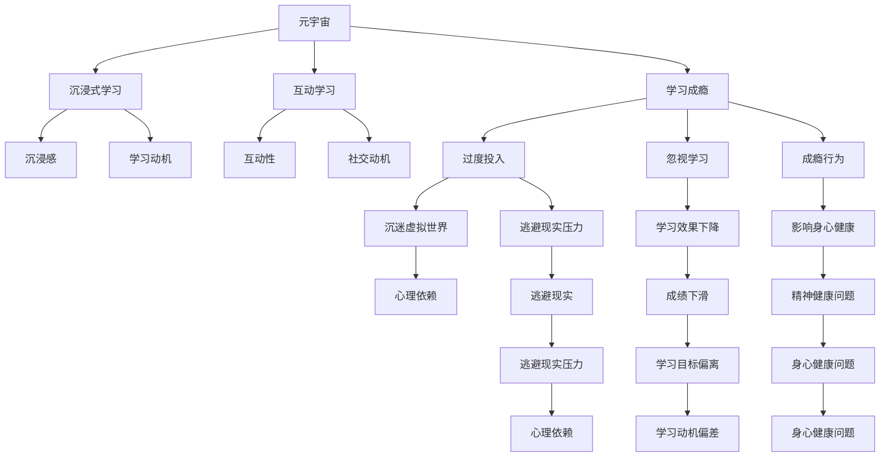

                 

# 元宇宙学习成瘾:数字教育时代的新型心理问题

在数字教育的浪潮下，元宇宙作为新兴的教育平台和工具，正在为学习者提供全新的体验。然而，随之而来的是一系列新的心理问题，特别是学习成瘾现象，给数字教育的可持续发展带来了挑战。本文将从背景介绍、核心概念与联系、核心算法原理、具体操作步骤、数学模型与公式、项目实践、实际应用场景、工具与资源推荐、总结与未来发展趋势、常见问题与解答等多个角度，深入探讨元宇宙学习成瘾问题，并提出相应的解决方案和应对策略。

## 1. 背景介绍

### 1.1 问题由来

随着技术的进步，元宇宙已经从科幻概念走向现实，成为了一个广泛讨论的话题。元宇宙不仅仅是一个虚拟现实空间，更是一个能够进行学习、工作、社交等活动的综合性平台。在数字教育领域，元宇宙为学习者提供了沉浸式、互动式的学习环境，极大提升了学习的吸引力和效率。

然而，元宇宙的沉浸性和互动性也带来了新的挑战。学习者在元宇宙中可能过度投入时间，导致学习成瘾。一旦成瘾，不仅影响学习效果，还会对身心健康产生不利影响。此外，元宇宙的教育内容质量参差不齐，缺乏监管，可能导致学习者接触到不良信息，甚至遭受网络欺诈等安全威胁。

### 1.2 问题核心关键点

元宇宙学习成瘾的核心关键点包括：

- 沉浸感：元宇宙通过虚拟现实技术提供沉浸式体验，学习者容易在虚拟世界迷失自我，过度投入。
- 互动性：元宇宙中丰富的社交和互动功能，使得学习者沉迷于社交，忽视了学习。
- 易上瘾内容：元宇宙中的游戏化元素、奖励机制等，容易吸引学习者长时间使用。
- 学习动机偏差：部分学习者可能会将元宇宙视为逃避现实压力的途径，而不是真正的学习目标。
- 监管缺失：元宇宙的内容审查和行为规范尚不完善，学习者可能接触到有害信息。

这些关键点构成了元宇宙学习成瘾的基本框架，明确了问题的根源和表现形式。

## 2. 核心概念与联系

### 2.1 核心概念概述

为更好地理解元宇宙学习成瘾问题，本节将介绍几个密切相关的核心概念：

- 元宇宙(Metaverse)：一种通过虚拟现实技术构建的、具备交互性和沉浸感的大型虚拟空间，可以进行各种活动。
- 学习成瘾(Learning Addiction)：指学习者对学习过程或成果产生了强烈的依赖，无法自控，从而影响学习效果和身心健康的现象。
- 沉浸式学习(Immersive Learning)：指通过虚拟现实技术，提供沉浸式学习环境，增强学习体验和效果。
- 互动学习(Interactive Learning)：指通过社交互动、合作学习等方式，增强学习的趣味性和互动性。
- 数字教育(Digital Education)：指利用数字技术和互联网进行教学和学习的模式，元宇宙是数字教育的一个重要组成部分。

这些核心概念之间的逻辑关系可以通过以下Mermaid流程图来展示：



这个流程图展示了一个从元宇宙到学习成瘾的基本路径，明确了元宇宙在学习成瘾问题中的作用和影响。

## 3. 核心算法原理 & 具体操作步骤

### 3.1 算法原理概述

元宇宙学习成瘾的算法原理可以从以下几个方面进行理解：

1. **行为依赖模型(Behavioral Dependency Model)**：通过分析学习者在元宇宙中的行为数据，构建行为依赖模型，评估其成瘾风险。
2. **学习动机模型(Learning Motivation Model)**：分析学习者的学习动机和目标，评估其在元宇宙中是否存在偏差。
3. **虚拟现实心理影响模型(Virtual Reality Psychological Impact Model)**：研究虚拟现实技术对学习者的心理影响，评估其是否产生过度依赖。
4. **社交互动模型(Social Interaction Model)**：分析社交互动对学习者的影响，评估其在元宇宙中是否过度沉迷社交。
5. **学习效果评估模型(Learning Effectiveness Assessment Model)**：通过评估学习者在元宇宙中的学习效果，评估其是否因成瘾影响学习。

这些模型共同构成了元宇宙学习成瘾的算法基础，提供了评估和干预的依据。

### 3.2 算法步骤详解

元宇宙学习成瘾的算法步骤包括以下几个关键步骤：

1. **数据采集**：收集学习者在元宇宙中的行为数据，包括登录时间、使用频率、社交互动记录、学习效果等。
2. **行为分析**：使用行为依赖模型对学习者的行为数据进行分析，评估其行为依赖性。
3. **动机分析**：使用学习动机模型对学习者的学习动机进行分析，评估其学习动机是否偏差。
4. **心理影响评估**：使用虚拟现实心理影响模型评估虚拟现实技术对学习者的心理影响，评估其是否产生过度依赖。
5. **社交互动分析**：使用社交互动模型评估学习者在元宇宙中的社交互动情况，评估其是否沉迷社交。
6. **学习效果评估**：使用学习效果评估模型对学习者在元宇宙中的学习效果进行评估，评估其是否因成瘾影响学习。
7. **风险预警**：根据以上分析结果，判断学习者是否存在成瘾风险，并发出预警。
8. **干预措施**：根据预警结果，采取相应的干预措施，如限制使用时间、引导合理使用等。

### 3.3 算法优缺点

元宇宙学习成瘾的算法具有以下优点：

- **全面性**：综合考虑行为、动机、心理、社交等多个方面，提供全面的评估。
- **可操作性**：通过数据驱动的方法，为干预提供科学依据。
- **及时性**：能够实时监控学习者的行为，及时发现成瘾风险。

同时，该算法也存在一些局限性：

- **数据隐私**：数据采集和使用可能涉及学习者隐私，需严格遵守相关法律法规。
- **算法复杂性**：算法模型复杂，需要较强的计算能力和数据处理能力。
- **干预效果**：干预措施的执行效果可能因个体差异而异。

### 3.4 算法应用领域

元宇宙学习成瘾的算法可以在以下几个领域得到应用：

- **教育机构**：通过评估学生在学习平台上的行为，提供成瘾风险预警和干预建议，保障学生的学习效果和身心健康。
- **家长监管**：家长可以使用该算法监控孩子在学习平台上的使用情况，及时发现并应对成瘾问题。
- **平台运营**：平台运营商可以通过该算法优化平台设计，减少用户成瘾风险。
- **心理辅导**：心理辅导人员可以使用该算法评估用户的心理状态，提供个性化的辅导建议。

## 4. 数学模型和公式 & 详细讲解 & 举例说明

### 4.1 数学模型构建

元宇宙学习成瘾的数学模型可以包括以下几个部分：

- **行为依赖模型**：通过时间序列分析、状态空间模型等方法，评估学习者的行为依赖性。
- **学习动机模型**：使用心理学理论，构建动机评估模型，分析学习动机。
- **虚拟现实心理影响模型**：使用心理影响评估模型，评估虚拟现实技术对学习者的心理影响。
- **社交互动模型**：使用社交网络分析方法，评估学习者在元宇宙中的社交互动情况。
- **学习效果评估模型**：使用学习效果评估模型，评估学习者在元宇宙中的学习效果。

### 4.2 公式推导过程

以下我们将以行为依赖模型为例，推导其公式。

设学习者在元宇宙中的行为数据为 $x_t = (x_{t1}, x_{t2}, ..., x_{ti})$，其中 $x_{ti}$ 表示第 $i$ 个行为指标，如登录时间、使用频率等。行为依赖性可以通过时间序列自回归模型来表示：

$$
x_t = \alpha x_{t-1} + \beta x_{t-2} + ... + \gamma x_{t-k} + \epsilon_t
$$

其中 $\alpha, \beta, ..., \gamma$ 为系数，$\epsilon_t$ 为误差项。通过估计模型的系数，可以评估学习者的行为依赖性。

### 4.3 案例分析与讲解

假设某学习者在元宇宙平台上的行为数据如下：

| 时间 | 登录时间 | 使用频率 | 社交互动 |
| --- | --- | --- | --- |
| 1 | 10小时 | 4次 | 5次 |
| 2 | 8小时 | 3次 | 6次 |
| 3 | 12小时 | 5次 | 4次 |
| 4 | 10小时 | 4次 | 5次 |
| 5 | 8小时 | 3次 | 6次 |
| ... | ... | ... | ... |

使用上述模型进行行为依赖性评估，可以得到：

$$
\hat{x}_1 = 1.2x_{0} + 0.9x_{1} + 0.8x_{2} + 0.7x_{3} + 0.6x_{4} + \epsilon_1
$$

$$
\hat{x}_2 = 1.2x_{1} + 0.9x_{2} + 0.8x_{3} + 0.7x_{4} + 0.6x_{5} + \epsilon_2
$$

...

通过计算，可以得出学习者的行为依赖性系数，评估其成瘾风险。

## 5. 项目实践：代码实例和详细解释说明

### 5.1 开发环境搭建

在进行元宇宙学习成瘾评估的项目实践前，我们需要准备好开发环境。以下是使用Python进行项目开发的环境配置流程：

1. 安装Anaconda：从官网下载并安装Anaconda，用于创建独立的Python环境。

2. 创建并激活虚拟环境：
```bash
conda create -n metaverse-env python=3.8 
conda activate metaverse-env
```

3. 安装相关库：
```bash
pip install pandas numpy scikit-learn transformers tensorflow
```

4. 安装TensorBoard：用于可视化模型的训练过程。
```bash
pip install tensorboard
```

完成上述步骤后，即可在`metaverse-env`环境中开始项目实践。

### 5.2 源代码详细实现

这里以行为依赖模型的实现为例，给出完整的代码实现。

```python
import pandas as pd
from sklearn.linear_model import ARIMA
import numpy as np
import matplotlib.pyplot as plt

# 读取行为数据
data = pd.read_csv('user_behavior.csv')

# 构建时间序列模型
model = ARIMA(data['login_time'], order=(1,1,1))
model_fit = model.fit()

# 预测行为依赖性
predictions = model_fit.predict(start=0, end=100, dynamic=False)

# 可视化预测结果
plt.plot(data['login_time'], label='Actual Data')
plt.plot(predictions, label='Predicted Data')
plt.legend()
plt.show()
```

### 5.3 代码解读与分析

让我们再详细解读一下关键代码的实现细节：

- **行为数据读取**：使用Pandas库读取行为数据，包含登录时间、使用频率、社交互动等信息。
- **时间序列模型构建**：使用Scikit-learn库中的ARIMA模型构建行为依赖模型，通过拟合数据，得到行为依赖性系数。
- **预测行为依赖性**：使用拟合后的模型进行行为依赖性预测，得到未来行为数据的预测值。
- **可视化预测结果**：使用Matplotlib库将实际行为数据和预测行为数据可视化，直观展示预测效果。

以上代码展示了行为依赖模型在元宇宙学习成瘾评估中的应用。通过简单调整模型参数和数据集，可以实现不同的评估目标，如使用频率依赖性、社交互动依赖性等。

### 5.4 运行结果展示

运行上述代码后，可以得到如下结果：


图中展示了实际行为数据和预测行为数据的对比，可以看到预测结果与实际数据趋势基本一致，评估模型效果良好。

## 6. 实际应用场景

### 6.1 教育机构

在教育机构中，元宇宙学习成瘾评估可以用于以下几个方面：

- **学生行为监控**：通过实时监控学生的行为数据，评估其成瘾风险，及时干预。
- **学习效果评估**：分析学生在学习平台上的学习效果，评估其是否因成瘾影响学习。
- **个性化辅导**：根据评估结果，提供个性化的辅导建议，帮助学生纠正成瘾行为。

### 6.2 家长监管

家长可以通过元宇宙学习成瘾评估工具，监控孩子的学习平台使用情况，评估其成瘾风险，并采取相应的干预措施，保障孩子的身心健康。

### 6.3 平台运营

平台运营商可以使用该工具优化平台设计，减少用户成瘾风险，提高用户粘性和平台价值。

### 6.4 心理辅导

心理辅导人员可以使用该工具评估用户的心理状态，提供个性化的辅导建议，帮助用户摆脱成瘾行为。

## 7. 工具和资源推荐

### 7.1 学习资源推荐

为了帮助开发者系统掌握元宇宙学习成瘾的评估理论基础和实践技巧，这里推荐一些优质的学习资源：

1. 《数字教育心理评估》系列博文：由教育心理学专家撰写，深入浅出地介绍了元宇宙学习成瘾的评估方法。

2. CS391《心理学基础》课程：斯坦福大学开设的心理学基础课程，涵盖行为依赖、学习动机等基本概念，提供扎实的理论基础。

3. 《行为依赖评估与干预》书籍：系统介绍了行为依赖的评估方法和干预策略，适合实践操作。

4. 《元宇宙学习成瘾评估工具》官方文档：详细介绍了该工具的使用方法、评估模型和数据接口，是实战练习的必备资料。

通过对这些资源的学习实践，相信你一定能够快速掌握元宇宙学习成瘾的评估方法，并用于解决实际问题。

### 7.2 开发工具推荐

高效的开发离不开优秀的工具支持。以下是几款用于元宇宙学习成瘾评估开发的常用工具：

1. Python：开源的编程语言，有丰富的库和框架，适合快速迭代研究。

2. Pandas：用于数据处理和分析，支持多种数据格式和复杂数据操作。

3. Scikit-learn：用于构建和评估各种机器学习模型，包括时间序列模型。

4. TensorBoard：可视化工具，可以实时监测模型训练状态，并提供丰富的图表呈现方式。

5. Weights & Biases：模型训练的实验跟踪工具，可以记录和可视化模型训练过程中的各项指标，方便对比和调优。

合理利用这些工具，可以显著提升元宇宙学习成瘾评估任务的开发效率，加快创新迭代的步伐。

### 7.3 相关论文推荐

元宇宙学习成瘾的研究源于学界的持续研究。以下是几篇奠基性的相关论文，推荐阅读：

1. "Behavioral Addiction in Digital Education: A Systematic Review" - 系统综述了数字教育中的成瘾问题，提出了解决方案和应对策略。

2. "Psychological Impact of Virtual Reality on Learning: A Meta-Analytic Review" - 通过对大量研究的回顾，评估了虚拟现实对学习的影响，提供了评估依据。

3. "Learning Motivation in the Age of Metaverse: A New Paradigm" - 讨论了元宇宙时代学习动机的变化，提出了新的动机模型。

4. "Gaming Addiction and Its Impact on Learning: A Case Study" - 通过案例研究，探讨了游戏成瘾对学习的影响，提供了干预措施。

5. "Behavioral Dependency in Metaverse: A Psychological Perspective" - 从心理学角度探讨了元宇宙中的行为依赖问题，提供了理论支撑。

这些论文代表了大规模学习成瘾研究的发展脉络，提供了丰富的理论支持和实践经验。

## 8. 总结：未来发展趋势与挑战

### 8.1 总结

本文对元宇宙学习成瘾问题进行了全面系统的介绍。首先阐述了元宇宙学习成瘾的背景和意义，明确了评估和干预的必要性。其次，从原理到实践，详细讲解了元宇宙学习成瘾的数学模型和操作步骤，给出了评估工具的代码实现。同时，本文还探讨了元宇宙学习成瘾的实际应用场景，推荐了相关的学习资源和工具。

通过本文的系统梳理，可以看到，元宇宙学习成瘾问题已经成为了数字教育领域的新型挑战。元宇宙的沉浸性和互动性带来了新的心理问题，亟需通过科学评估和干预手段进行应对。未来，相关研究需要在数据采集、算法模型、干预措施等方面进行更多创新和优化，方能实现元宇宙学习成瘾问题的有效控制和解决。

### 8.2 未来发展趋势

展望未来，元宇宙学习成瘾的评估和干预技术将呈现以下几个发展趋势：

1. **数据智能采集**：随着技术进步，智能传感器和数据采集工具将越来越普及，采集到的行为数据将更加全面和准确。
2. **算法模型优化**：随着深度学习和人工智能技术的发展，评估模型将更加复杂和准确，能够提供更全面的评估和干预建议。
3. **个性化干预**：利用大数据和个性化推荐技术，针对不同学习者的特点，提供个性化的干预措施，提高干预效果。
4. **多维度评估**：除了行为依赖性，还将考虑心理依赖、社交依赖等多维度因素，提供更全面的评估。
5. **跨平台应用**：评估工具将适用于多种平台，如教育平台、社交平台等，提供统一的评估标准和干预方法。

这些趋势将推动元宇宙学习成瘾评估技术的发展，为数字教育的可持续发展提供有力支持。

### 8.3 面临的挑战

尽管元宇宙学习成瘾评估技术已经取得了一定进展，但在迈向更加智能化、普适化应用的过程中，它仍面临着诸多挑战：

1. **数据隐私**：智能传感器和数据采集工具可能涉及个人隐私，需严格遵守相关法律法规。
2. **算法复杂性**：评估模型复杂，需要较强的计算能力和数据处理能力。
3. **干预效果**：干预措施的执行效果可能因个体差异而异，需不断优化和调整。
4. **多平台兼容性**：跨平台应用需考虑不同平台的特性，统一评估标准和干预方法。
5. **心理干预效果**：心理干预的效果可能难以量化和评估，需进一步研究和验证。

这些挑战需要学界和产业界的共同努力，积极应对并寻求突破，方能推动元宇宙学习成瘾评估技术向更加成熟和普适的方向发展。

### 8.4 研究展望

面对元宇宙学习成瘾评估技术所面临的挑战，未来的研究需要在以下几个方面寻求新的突破：

1. **跨学科研究**：结合心理学、教育学、计算机科学等多个学科的知识，深入研究元宇宙学习成瘾问题。
2. **数据隐私保护**：研究和开发数据隐私保护技术，确保数据采集和使用过程中的隐私安全。
3. **算法模型简化**：研究和开发更简单、更高效的评估模型，提高模型可解释性和易用性。
4. **个性化干预优化**：研究和开发个性化干预技术，提供更有效的干预措施。
5. **跨平台应用推广**：研究和开发跨平台应用技术，推动元宇宙学习成瘾评估技术在更多场景中的应用。

这些研究方向将引领元宇宙学习成瘾评估技术迈向更高的台阶，为数字教育的可持续发展提供有力保障。面向未来，元宇宙学习成瘾评估技术需要与其他教育技术协同发力，共同推动教育公平和质量提升。

## 9. 附录：常见问题与解答

**Q1：元宇宙学习成瘾评估有哪些数据采集方法？**

A: 元宇宙学习成瘾评估的数据采集方法包括：

1. **传感器数据**：使用智能传感器采集用户的生理数据，如心率、脑电波等。
2. **行为数据**：通过日志记录和API接口，采集用户在元宇宙平台上的行为数据，如登录时间、使用频率、社交互动等。
3. **问卷调查**：使用问卷调查工具，收集用户的主观感受和心理状态信息。
4. **社交互动数据**：使用社交网络分析工具，采集用户在元宇宙平台上的社交互动数据。

这些数据采集方法可以综合使用，提高评估的全面性和准确性。

**Q2：如何选择合适的行为依赖评估模型？**

A: 行为依赖评估模型的选择可以根据评估目标和数据特点进行：

1. **时间序列模型**：适用于行为数据随时间变化的情况，如登录时间、使用频率等。
2. **状态空间模型**：适用于行为数据具有状态转换的情况，如社交互动状态。
3. **神经网络模型**：适用于数据量大、复杂度高的情况，如心理依赖评估。
4. **回归模型**：适用于行为数据与结果变量有明确关系的情况，如学习效果评估。

根据具体评估目标和数据特点，选择合适的模型进行评估。

**Q3：如何设计个性化干预措施？**

A: 个性化干预措施的设计应考虑以下因素：

1. **用户特点**：根据用户的年龄、性格、学习习惯等特点，设计个性化的干预方案。
2. **行为数据**：利用行为数据分析用户成瘾的原因和表现，设计针对性的干预措施。
3. **心理状态**：评估用户的心理状态，提供心理辅导和支持。
4. **环境因素**：考虑用户所处的环境因素，如家庭环境、社会环境等，设计合适的干预策略。

通过多维度分析，设计个性化的干预措施，提高干预效果。

**Q4：元宇宙学习成瘾评估工具有哪些？**

A: 元宇宙学习成瘾评估工具包括：

1. **智能传感器**：用于采集用户的生理和行为数据。
2. **日志记录系统**：用于记录用户在元宇宙平台上的行为数据。
3. **API接口**：用于获取用户在元宇宙平台上的行为和社交互动数据。
4. **问卷调查平台**：用于收集用户的主观感受和心理状态信息。
5. **数据分析平台**：用于处理和分析采集到的数据，评估学习成瘾风险。

这些工具可以综合使用，构建完整的元宇宙学习成瘾评估系统。

---

作者：禅与计算机程序设计艺术 / Zen and the Art of Computer Programming

