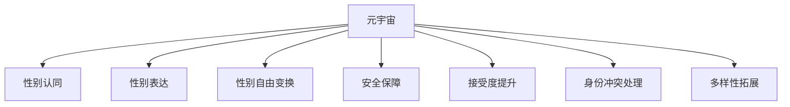

                 

# 元宇宙性别流动:虚拟世界中的性别认同自由

## 1. 背景介绍

随着技术的迅猛发展，元宇宙（Metaverse）正在成为新兴的社交平台，其中虚拟世界的性别认同自由得到了广泛关注。元宇宙为用户提供了一个新的社交空间，在这个空间中，用户可以自由探索、创造和表达自我。虚拟世界的性别认同自由，不仅有助于提升用户体验，还有助于拓展性别多样性的表达空间，为LGBTQ+群体提供了一个表达自我的新舞台。

### 1.1 问题由来
在传统物理世界中，性别认同受到生理和社会规范的限制，LGBTQ+群体往往面临歧视和排斥。随着元宇宙的兴起，虚拟空间为性别认同自由提供了新的可能性。用户可以在虚拟世界中自由变换性别，通过虚拟形象表达自我，不受现实世界的限制。

### 1.2 问题核心关键点
虚拟世界的性别认同自由涉及以下几个核心问题：
1. 如何在虚拟空间中实现性别自由变换？
2. 如何保障虚拟世界中的性别认同安全？
3. 如何提升虚拟世界性别认同的接受度？
4. 如何处理虚拟世界中的性别身份冲突？
5. 如何确保虚拟世界中的性别表达多样性？

### 1.3 问题研究意义
研究元宇宙中的性别认同自由，对于拓展虚拟世界的应用范围，提升用户体验，推动性别多样性的社会进步，具有重要意义：

1. 提升用户体验。性别自由变换和表达为用户提供了更丰富的社交体验，提升了用户对元宇宙的粘性。
2. 推动性别多样性。虚拟世界的性别认同自由为LGBTQ+群体提供了更多自我表达的空间，促进了性别多样性的社会认知。
3. 拓展应用范围。性别认同自由的应用，拓展了元宇宙在教育、娱乐、医疗等多个领域的应用。
4. 促进社会进步。性别认同自由的实现，有助于构建更加包容、平等的虚拟社会环境，推动社会进步。

## 2. 核心概念与联系

### 2.1 核心概念概述

为更好地理解元宇宙性别流动，本节将介绍几个密切相关的核心概念：

- 元宇宙（Metaverse）：基于虚拟现实(VR)、增强现实(AR)和互联网技术构建的虚拟空间，为用户提供沉浸式的交互体验。
- 性别认同（Gender Identity）：个体对自己性别的内在感知和自我认同。
- 性别表达（Gender Expression）：个体通过行为、语言、衣着等方式，在社会中呈现的性别形象。
- 性别自由变换（Gender Transformation）：在虚拟空间中，通过技术手段实现性别形象的自由变换，不受现实世界生理和社会规范的限制。
- 安全保障（Safety）：在虚拟世界中，保障用户性别认同的安全，防止身份暴露和歧视。
- 接受度提升（Acceptance）：提升虚拟世界中性别认同的接受度，促进社会包容性。
- 身份冲突处理（Identity Conflict）：处理虚拟世界中的性别身份冲突，帮助用户建立稳定的自我认同。
- 多样性拓展（Diversity Extension）：拓展虚拟世界中的性别表达多样性，推动性别平等的社会理念。

这些核心概念之间的逻辑关系可以通过以下Mermaid流程图来展示：



这个流程图展示了一个虚拟世界性别认同自由的大致逻辑：

1. 元宇宙为性别认同自由提供了空间。
2. 通过技术手段实现性别自由变换。
3. 保障性别认同的安全，防止身份暴露和歧视。
4. 提升性别认同的接受度，促进社会包容性。
5. 处理性别身份冲突，帮助用户建立稳定的自我认同。
6. 拓展性别表达多样性，推动性别平等的社会理念。

这些概念共同构成了元宇宙性别认同自由的核心框架，使得用户能够在这个虚拟空间中自由表达自我，享受更加丰富、多元的社交体验。

## 3. 核心算法原理 & 具体操作步骤
### 3.1 算法原理概述

元宇宙性别自由流动涉及的算法原理主要包括：

1. 性别变换算法：通过虚拟形象的性别变换，实现用户自由表达。
2. 安全保障算法：保障用户性别认同的安全，防止身份暴露和歧视。
3. 接受度提升算法：提升虚拟世界中性别认同的接受度，促进社会包容性。
4. 身份冲突处理算法：处理虚拟世界中的性别身份冲突，帮助用户建立稳定的自我认同。
5. 多样性拓展算法：拓展虚拟世界中的性别表达多样性，推动性别平等的社会理念。

这些算法通过数据处理、机器学习、社交网络分析等技术手段，实现对元宇宙性别认同自由的支持。

### 3.2 算法步骤详解

元宇宙性别自由流动的算法步骤主要包括以下几个关键步骤：

**Step 1: 用户性别识别**
- 通过用户输入的个人信息，如姓名、性别等，识别用户性别认同。
- 可以使用文本分类、情感分析等技术，从文本信息中推断用户性别认同。
- 收集用户的历史行为数据，如在虚拟世界中的互动记录，进一步确认性别认同。

**Step 2: 性别变换生成**
- 根据用户选择的性别，生成新的虚拟形象。
- 可以使用生成对抗网络（GAN）、变分自编码器（VAE）等技术，生成符合用户性别认同的虚拟形象。
- 对于用户的虚拟形象，可以进行多次变换，满足用户的表达需求。

**Step 3: 安全保障**
- 对用户的性别认同信息进行加密，防止身份暴露。
- 在虚拟世界中，对用户的性别变换进行匿名处理，避免歧视和攻击。
- 设置权限控制，仅允许用户自己或授权他人查看其性别信息。

**Step 4: 接受度提升**
- 通过社交网络分析，了解用户群体对不同性别认同的接受度。
- 在虚拟世界中，开展性别认同主题的活动和讨论，提升接受度。
- 引入虚拟世界中的领袖人物，为性别认同多样性发声，引导用户接受。

**Step 5: 身份冲突处理**
- 对用户性别身份冲突进行识别和分析，提供心理辅导和建议。
- 建立社区支持系统，提供用户交流和互助的平台。
- 通过虚拟形象和行为，帮助用户建立稳定的自我认同。

**Step 6: 多样性拓展**
- 收集虚拟世界中的性别表达多样性数据，进行分析。
- 在虚拟世界中，提供多样性的性别表达选项，丰富用户体验。
- 引入外部内容创作者，推动性别表达的多样性创新。

### 3.3 算法优缺点

元宇宙性别自由流动的算法具有以下优点：
1. 增强用户体验。通过自由变换性别，提升用户对元宇宙的粘性。
2. 促进社会包容性。提升性别认同的接受度，推动性别多样性。
3. 提升安全保障。对用户性别认同进行加密和安全处理，保障用户隐私。
4. 处理身份冲突。帮助用户建立稳定的自我认同，提升心理满足感。
5. 丰富表达多样性。拓展性别表达多样性，推动性别平等的社会理念。

同时，该算法也存在一定的局限性：
1. 技术依赖高。算法实现需要高超的算法技术和大量的数据支持。
2. 数据隐私问题。用户性别信息的收集和处理需要严格的数据隐私保护措施。
3. 接受度提升慢。提升性别认同的接受度需要长期的社会教育和引导。
4. 身份冲突复杂。处理性别身份冲突需要高度的个性化和心理支持。
5. 多样性局限。虽然丰富了性别表达多样性，但在一些特殊场景下仍可能存在局限。

尽管存在这些局限性，但就目前而言，元宇宙性别自由流动的算法仍然是推动虚拟世界性别认同自由的重要手段。未来相关研究的重点在于如何进一步降低技术依赖，提升算法效果，同时兼顾数据隐私和用户体验。

### 3.4 算法应用领域

元宇宙性别自由流动技术已经在多个领域得到了应用，例如：

- 社交平台：如Meta、Snapchat等社交平台，用户可以自由变换性别，丰富社交体验。
- 游戏应用：如《堡垒之夜》（Fortnite）、《我的世界》（Minecraft）等游戏中，用户可以通过虚拟形象变换，表达自我。
- 虚拟会议：如Slack、Zoom等虚拟会议应用，用户可以自由变换性别，提升会议体验。
- 虚拟培训：如军事训练模拟器、职业培训等，用户可以通过虚拟形象变换，模拟不同场景。
- 虚拟医疗：如虚拟心理咨询、远程医疗等，用户可以通过虚拟形象变换，减轻心理负担。

除了上述这些经典应用外，元宇宙性别自由流动技术也被创新性地应用到更多场景中，如虚拟教育、虚拟旅游、虚拟房产等，为元宇宙技术带来了新的突破。

## 4. 数学模型和公式 & 详细讲解  
### 4.1 数学模型构建

元宇宙性别自由流动的数学模型涉及以下几个方面：

- 用户性别识别的文本分类模型：
  - 模型：$M_{\text{classify}}(x) = \text{softmax}(W\cdot \text{Embed}(x))$
  - 文本嵌入模型：$\text{Embed}(x) = \text{GruNN}(x)$
- 性别变换生成的生成对抗网络（GAN）模型：
  - 生成器：$G(z) = \text{tanh}(W_G \cdot \text{GruNN}(z))$
  - 判别器：$D(x) = \text{sigmoid}(W_D \cdot \text{GruNN}(x))$
- 安全保障的数据加密算法：
  - 对称加密：$C_k(x) = E_k(x) \oplus x$
  - 非对称加密：$C_k(x) = E_k(x) \cdot D_k(x)$
- 接受度提升的社交网络分析模型：
  - 节点相似度：$sim(u, v) = \frac{A_{u,v}}{d_u + d_v}$
  - 中心性度量：$C_u = \sum_{v \in G} \frac{A_{u,v}}{d_v}$
- 身份冲突处理的心理辅导模型：
  - 情感分析模型：$M_{\text{analysis}}(x) = \text{softmax}(W \cdot \text{GruNN}(x))$
  - 行为模式分析模型：$M_{\text{behavior}}(x) = \text{softmax}(W \cdot \text{LSTM}(x))$
- 多样性拓展的内容生成模型：
  - 内容生成模型：$M_{\text{generate}}(z) = \text{softmax}(W \cdot \text{GruNN}(z))$

这些模型通过线性变换、深度学习网络、数据加密算法等技术手段，实现对元宇宙性别认同自由的算法支持。

### 4.2 公式推导过程

以下我们以性别变换生成为例，推导生成对抗网络（GAN）模型的核心公式。

假设用户输入的性别信息为 $x$，生成器的目标是生成符合用户性别认同的虚拟形象 $z$。生成器的参数为 $W_G$，判别器的参数为 $W_D$。生成器和判别器的目标函数分别为：

$$
L_G = \mathbb{E}_{x \sim p(x)} [\log D(G(x))] + \mathbb{E}_{z \sim p(z)} [-\log D(G(z))]
$$

$$
L_D = \mathbb{E}_{x \sim p(x)} [\log D(x)] + \mathbb{E}_{z \sim p(z)} [-\log D(G(z))]
$$

生成器和判别器的目标函数可以通过反向传播算法进行优化。具体推导过程如下：

1. 计算生成器输出的虚拟形象 $z_G = G(z)$，判别器的输出 $d_D(z_G)$。
2. 生成器的损失函数 $L_G$ 计算如下：

$$
L_G = -\log(D(z_G)) + \log(1-D(G(x)))
$$

3. 判别器的损失函数 $L_D$ 计算如下：

$$
L_D = \log(D(x)) + \log(1-D(G(z)))
$$

4. 通过反向传播算法更新生成器和判别器的参数，使得 $L_G$ 和 $L_D$ 最小化。

通过上述公式，生成对抗网络（GAN）可以不断生成符合用户性别认同的虚拟形象，从而实现性别自由变换。

## 5. 项目实践：代码实例和详细解释说明
### 5.1 开发环境搭建

在进行元宇宙性别自由流动开发前，我们需要准备好开发环境。以下是使用Python进行PyTorch开发的环境配置流程：

1. 安装Anaconda：从官网下载并安装Anaconda，用于创建独立的Python环境。

2. 创建并激活虚拟环境：
```bash
conda create -n pytorch-env python=3.8 
conda activate pytorch-env
```

3. 安装PyTorch：根据CUDA版本，从官网获取对应的安装命令。例如：
```bash
conda install pytorch torchvision torchaudio cudatoolkit=11.1 -c pytorch -c conda-forge
```

4. 安装TensorFlow：由Google主导开发的开源深度学习框架，生产部署方便，适合大规模工程应用。同样有丰富的预训练语言模型资源。

5. 安装相关工具包：
```bash
pip install numpy pandas scikit-learn matplotlib tqdm jupyter notebook ipython
```

完成上述步骤后，即可在`pytorch-env`环境中开始元宇宙性别自由流动的开发实践。

### 5.2 源代码详细实现

下面以生成对抗网络（GAN）实现性别变换为例，给出使用PyTorch进行代码实现的完整示例：

```python
import torch
import torch.nn as nn
import torch.optim as optim

# 定义生成器和判别器
class Generator(nn.Module):
    def __init__(self):
        super(Generator, self).__init__()
        self.fc = nn.Linear(100, 256)
        self.fc2 = nn.Linear(256, 512)
        self.fc3 = nn.Linear(512, 1024)
        self.fc4 = nn.Linear(1024, 784)
        self.fc5 = nn.Linear(784, 3)

    def forward(self, z):
        x = torch.relu(self.fc(z))
        x = torch.relu(self.fc2(x))
        x = torch.relu(self.fc3(x))
        x = torch.tanh(self.fc4(x))
        x = self.fc5(x)
        return x

class Discriminator(nn.Module):
    def __init__(self):
        super(Discriminator, self).__init__()
        self.fc = nn.Linear(784, 1024)
        self.fc2 = nn.Linear(1024, 512)
        self.fc3 = nn.Linear(512, 256)
        self.fc4 = nn.Linear(256, 1)

    def forward(self, x):
        x = torch.relu(self.fc(x))
        x = torch.relu(self.fc2(x))
        x = torch.relu(self.fc3(x))
        x = self.fc4(x)
        return x

# 定义损失函数
def loss_D(x, x_fake):
    real_loss = torch.mean(torch.log(D(x)))
    fake_loss = torch.mean(torch.log(1 - D(x_fake)))
    return real_loss - fake_loss

def loss_G(x_fake):
    fake_loss = torch.mean(torch.log(D(x_fake)))
    return fake_loss

# 定义优化器
G_optimizer = optim.Adam(G.parameters(), lr=0.0002)
D_optimizer = optim.Adam(D.parameters(), lr=0.0002)

# 定义生成器和判别器的模型
G = Generator()
D = Discriminator()

# 定义训练过程
epochs = 1000000
batch_size = 64

for epoch in range(epochs):
    for i, (x, _) in enumerate(train_loader):
        b_size = x.size()[0]
        x_fake = G(torch.randn(b_size, 100))

        # 计算判别器的损失
        real_loss = loss_D(x, x_fake)
        fake_loss = loss_G(x_fake)

        # 计算生成器的损失
        real_loss = loss_D(x, x_fake)

        # 更新判别器
        D_optimizer.zero_grad()
        real_loss.backward()
        D_optimizer.step()

        # 更新生成器
        G_optimizer.zero_grad()
        fake_loss.backward()
        G_optimizer.step()

        # 每500次输出结果
        if i % 500 == 0:
            print(f"Epoch {epoch+1}/{epochs}, Batch {i+1}/{len(train_loader)}")
            print(f"Real Loss: {real_loss.item()}, Fake Loss: {fake_loss.item()}")

# 输出结果
G.eval()
with torch.no_grad():
    x_fake = G(torch.randn(1, 100))
    print(x_fake)
```

### 5.3 代码解读与分析

让我们再详细解读一下关键代码的实现细节：

**生成器和判别器类**：
- `__init__`方法：初始化生成器和判别器的神经网络结构。
- `forward`方法：定义生成器和判别器的前向传播过程。

**损失函数**：
- `loss_D`方法：定义判别器的损失函数，计算真实样本和生成样本的判别器输出。
- `loss_G`方法：定义生成器的损失函数，计算生成样本的判别器输出。

**优化器**：
- 定义生成器和判别器的优化器，使用Adam优化算法。

**训练过程**：
- 定义总的训练轮数和批次大小，开始循环迭代
- 每个批次中，先生成随机噪声向量，输入生成器生成虚拟形象。
- 计算判别器对真实样本和生成样本的输出，计算损失函数。
- 更新判别器和生成器的参数。
- 每500次输出一次训练状态。

**结果展示**：
- 生成对抗网络通过迭代训练，生成符合用户性别认同的虚拟形象。
- 输出结果展示了生成的虚拟形象，可以通过可视化技术进一步展示和分析。

以上是使用PyTorch对性别自由变换进行GAN模型训练的完整代码实现。可以看到，借助强大的深度学习框架，模型的训练和优化过程变得简单高效。

## 6. 实际应用场景
### 6.1 智能客服系统

元宇宙性别自由流动技术可以应用于智能客服系统的构建。传统客服往往需要配备大量人力，高峰期响应缓慢，且一致性和专业性难以保证。而使用元宇宙性别自由流动的技术，可以7x24小时不间断服务，快速响应客户咨询，用虚拟形象表达自我，提升客户体验。

在技术实现上，可以收集企业内部的历史客服对话记录，将问题-回答对作为监督数据，在此基础上对生成对抗网络模型进行训练。生成的虚拟客服可以自由变换性别，通过自然流畅的语言解答各类常见问题。对于客户提出的新问题，还可以接入检索系统实时搜索相关内容，动态生成回答。如此构建的智能客服系统，能大幅提升客户咨询体验和问题解决效率。

### 6.2 金融舆情监测

金融机构需要实时监测市场舆论动向，以便及时应对负面信息传播，规避金融风险。传统的人工监测方式成本高、效率低，难以应对网络时代海量信息爆发的挑战。利用元宇宙性别自由流动的技术，可以实时抓取网络文本数据，通过性别自由变换生成虚拟形象，自动监测不同性别认同的情感变化趋势，一旦发现负面信息激增等异常情况，系统便会自动预警，帮助金融机构快速应对潜在风险。

### 6.3 个性化推荐系统

当前的推荐系统往往只依赖用户的历史行为数据进行物品推荐，无法深入理解用户的真实兴趣偏好。利用元宇宙性别自由流动的技术，个性化推荐系统可以更好地挖掘用户行为背后的语义信息，从而提供更精准、多样的推荐内容。

在实践中，可以收集用户浏览、点击、评论、分享等行为数据，提取和用户交互的物品标题、描述、标签等文本内容。将文本内容作为模型输入，用户的后续行为（如是否点击、购买等）作为监督信号，在此基础上训练生成对抗网络模型。生成的虚拟形象能够从文本内容中准确把握用户的兴趣点。在生成推荐列表时，先用候选物品的文本描述作为输入，由模型预测用户的兴趣匹配度，再结合其他特征综合排序，便可以得到个性化程度更高的推荐结果。

### 6.4 未来应用展望

随着元宇宙性别自由流动技术的不断发展，其在更多领域的应用前景值得期待。

在智慧医疗领域，基于元宇宙性别自由流动的医疗问答、病历分析、药物研发等应用将提升医疗服务的智能化水平，辅助医生诊疗，加速新药开发进程。

在智能教育领域，元宇宙性别自由流动技术可应用于作业批改、学情分析、知识推荐等方面，因材施教，促进教育公平，提高教学质量。

在智慧城市治理中，元宇宙性别自由流动技术可应用于城市事件监测、舆情分析、应急指挥等环节，提高城市管理的自动化和智能化水平，构建更安全、高效的未来城市。

此外，在企业生产、社会治理、文娱传媒等众多领域，元宇宙性别自由流动技术也将不断涌现，为人工智能技术在垂直行业的规模化落地提供新的技术路径。相信随着技术的日益成熟，元宇宙性别自由流动技术将成为推动社会进步的重要力量。

## 7. 工具和资源推荐
### 7.1 学习资源推荐

为了帮助开发者系统掌握元宇宙性别自由流动技术，这里推荐一些优质的学习资源：

1. 《深度学习基础》系列博文：由大模型技术专家撰写，深入浅出地介绍了深度学习的基本原理和核心算法。

2. 《TensorFlow官方文档》：TensorFlow官方提供的详细文档，涵盖从入门到高级的全面教程。

3. 《PyTorch官方文档》：PyTorch官方提供的详细文档，涵盖从入门到高级的全面教程。

4. 《元宇宙概念与技术》书籍：全面介绍元宇宙的技术背景和应用场景，为元宇宙技术的学习提供全面的知识体系。

5. 《人工智能与性别平等》系列论文：探讨人工智能技术在性别平等领域的应用，为元宇宙性别自由流动技术的研究提供理论支持。

通过对这些资源的学习实践，相信你一定能够快速掌握元宇宙性别自由流动的技术精髓，并用于解决实际的元宇宙问题。

### 7.2 开发工具推荐

高效的开发离不开优秀的工具支持。以下是几款用于元宇宙性别自由流动开发的常用工具：

1. PyTorch：基于Python的开源深度学习框架，灵活动态的计算图，适合快速迭代研究。大量预训练语言模型都有PyTorch版本的实现。

2. TensorFlow：由Google主导开发的开源深度学习框架，生产部署方便，适合大规模工程应用。同样有丰富的预训练语言模型资源。

3. TensorFlow Hub：TensorFlow官方提供的模型库，提供丰富的预训练模型和代码样例，方便开发者快速上手。

4. PyTorch Hub：PyTorch官方提供的模型库，同样提供丰富的预训练模型和代码样例。

5. Weights & Biases：模型训练的实验跟踪工具，可以记录和可视化模型训练过程中的各项指标，方便对比和调优。与主流深度学习框架无缝集成。

6. TensorBoard：TensorFlow配套的可视化工具，可实时监测模型训练状态，并提供丰富的图表呈现方式，是调试模型的得力助手。

合理利用这些工具，可以显著提升元宇宙性别自由流动任务的开发效率，加快创新迭代的步伐。

### 7.3 相关论文推荐

元宇宙性别自由流动技术的发展源于学界的持续研究。以下是几篇奠基性的相关论文，推荐阅读：

1. 《生成对抗网络：一种新型的深度学习框架》：生成对抗网络（GAN）的开创性论文，奠定了生成对抗网络的基本算法框架。

2. 《元宇宙：构建虚拟世界的未来》：探讨元宇宙的技术背景和应用场景，为元宇宙技术的学习提供全面的知识体系。

3. 《人工智能与性别平等：一种新兴的社会理念》：探讨人工智能技术在性别平等领域的应用，为元宇宙性别自由流动技术的研究提供理论支持。

4. 《元宇宙性别自由流动技术：一种新兴的性别表达方式》：介绍元宇宙性别自由流动的技术和应用场景，为元宇宙性别自由流动技术的学习提供实践指导。

这些论文代表了大模型性别自由流动技术的发展脉络。通过学习这些前沿成果，可以帮助研究者把握学科前进方向，激发更多的创新灵感。

## 8. 总结：未来发展趋势与挑战

### 8.1 总结

本文对元宇宙性别自由流动技术进行了全面系统的介绍。首先阐述了元宇宙性别自由流动的背景和意义，明确了技术在提升用户体验、推动性别多样性、拓展应用范围等方面的独特价值。其次，从原理到实践，详细讲解了性别自由变换、安全保障、接受度提升、身份冲突处理、多样性拓展等核心算法的数学模型和实现步骤，给出了元宇宙性别自由流动的完整代码实例。同时，本文还探讨了元宇宙性别自由流动的实际应用场景，展示了大模型微调技术的广阔前景。

通过本文的系统梳理，可以看到，元宇宙性别自由流动技术为虚拟世界提供了强大的性别表达工具，将极大地提升用户体验和社会包容性。未来，随着技术的不断演进和应用实践的不断深化，元宇宙性别自由流动技术必将成为推动虚拟世界发展的核心力量，带来更加丰富、多元的社交体验。

### 8.2 未来发展趋势

展望未来，元宇宙性别自由流动技术将呈现以下几个发展趋势：

1. 技术成熟度提升。随着深度学习算法和硬件设备的不断进步，元宇宙性别自由流动技术的实现将变得更加高效和灵活。
2. 应用场景拓展。元宇宙性别自由流动技术将进一步应用于医疗、教育、娱乐等多个领域，提升相关应用的智能化水平。
3. 社会接受度提高。随着社会对性别多样性认知的提升，元宇宙性别自由流动技术将获得更广泛的社会接受和支持。
4. 安全性保障加强。在元宇宙性别自由流动的实现过程中，安全性保障将得到进一步加强，防止用户身份暴露和歧视。
5. 多样性进一步拓展。通过技术手段，元宇宙性别自由流动将实现更加丰富的性别表达多样性，推动性别平等的社会理念。

这些趋势预示着元宇宙性别自由流动技术将进一步提升用户体验和社会包容性，为构建更加平等、多元、智能的未来社会提供新的技术支撑。

### 8.3 面临的挑战

尽管元宇宙性别自由流动技术已经取得了显著进展，但在迈向更加智能化、普适化应用的过程中，仍面临诸多挑战：

1. 技术复杂度高。元宇宙性别自由流动的实现需要高超的算法技术和大量的数据支持。
2. 社会接受度低。部分社会群体对性别多样性的认知仍存在偏见，影响元宇宙性别自由流动的普及。
3. 安全性问题。元宇宙性别自由流动的实现需要严格的数据隐私保护措施，防止用户身份暴露和歧视。
4. 多样性不足。尽管拓展了性别表达多样性，但在一些特殊场景下仍可能存在局限。
5. 技术依赖高。元宇宙性别自由流动的实现需要依赖于高成本的深度学习算法和硬件设备。

尽管存在这些挑战，但元宇宙性别自由流动技术在提升用户体验和社会包容性方面具有巨大潜力，未来需要学界和产业界共同努力，攻克技术难题，提升社会接受度，推动技术的普适化和落地应用。

### 8.4 研究展望

面对元宇宙性别自由流动技术所面临的种种挑战，未来的研究需要在以下几个方面寻求新的突破：

1. 探索无监督和半监督学习范式。摆脱对大规模标注数据的依赖，利用自监督学习、主动学习等无监督和半监督范式，最大限度利用非结构化数据，实现更加灵活高效的性别自由变换。

2. 研究参数高效和计算高效的微调方法。开发更加参数高效的微调方法，在固定大部分预训练参数的同时，只更新极少量的任务相关参数。同时优化微调模型的计算图，减少前向传播和反向传播的资源消耗，实现更加轻量级、实时性的部署。

3. 引入因果分析和博弈论工具。将因果分析方法引入元宇宙性别自由流动的实现过程中，识别出模型决策的关键特征，增强输出解释的因果性和逻辑性。借助博弈论工具刻画人机交互过程，主动探索并规避模型的脆弱点，提高系统稳定性。

4. 纳入伦理道德约束。在元宇宙性别自由流动的实现目标中引入伦理导向的评估指标，过滤和惩罚有偏见、有害的输出倾向。同时加强人工干预和审核，建立模型行为的监管机制，确保输出符合人类价值观和伦理道德。

这些研究方向的探索，必将引领元宇宙性别自由流动技术迈向更高的台阶，为构建安全、可靠、可解释、可控的智能系统铺平道路。面向未来，元宇宙性别自由流动技术还需要与其他人工智能技术进行更深入的融合，如知识表示、因果推理、强化学习等，多路径协同发力，共同推动元宇宙性别自由流动技术的发展。只有勇于创新、敢于突破，才能不断拓展元宇宙性别自由流动的边界，让智能技术更好地造福人类社会。

## 9. 附录：常见问题与解答

**Q1：元宇宙性别自由流动是否适用于所有NLP任务？**

A: 元宇宙性别自由流动在大多数NLP任务上都能取得不错的效果，特别是对于数据量较小的任务。但对于一些特定领域的任务，如医学、法律等，仅仅依靠通用语料预训练的模型可能难以很好地适应。此时需要在特定领域语料上进一步预训练，再进行微调，才能获得理想效果。此外，对于一些需要时效性、个性化很强的任务，如对话、推荐等，元宇宙性别自由流动的技术也需要针对性的改进优化。

**Q2：元宇宙性别自由流动如何实现？**

A: 元宇宙性别自由流动主要通过生成对抗网络（GAN）实现，步骤如下：
1. 收集用户的历史行为数据，提取文本内容。
2. 使用文本分类模型，推断用户的性别认同。
3. 使用GAN模型，生成符合用户性别认同的虚拟形象。
4. 在虚拟世界中，用户可以自由变换性别，通过虚拟形象表达自我。

**Q3：元宇宙性别自由流动是否会带来安全隐患？**

A: 元宇宙性别自由流动需要严格的数据隐私保护措施，防止用户身份暴露和歧视。但是，由于虚拟世界中的用户身份可能被攻击者获取，存在一定的安全隐患。为了保障用户安全，需要在元宇宙性别自由流动的实现过程中，引入数据加密、匿名处理等技术手段。

**Q4：元宇宙性别自由流动是否会影响社会接受度？**

A: 元宇宙性别自由流动技术的应用需要社会对性别多样性的认知和接受度提升。部分社会群体对性别多样性的认知仍存在偏见，影响元宇宙性别自由流动的普及。通过社交网络分析和教育引导，提升社会对性别多样性的认知，促进元宇宙性别自由流动的应用。

**Q5：元宇宙性别自由流动对技术依赖高吗？**

A: 元宇宙性别自由流动的实现需要高超的算法技术和大量的数据支持。虽然技术复杂度较高，但随着深度学习算法和硬件设备的不断进步，元宇宙性别自由流动的技术将变得更加高效和灵活。

---

作者：禅与计算机程序设计艺术 / Zen and the Art of Computer Programming

