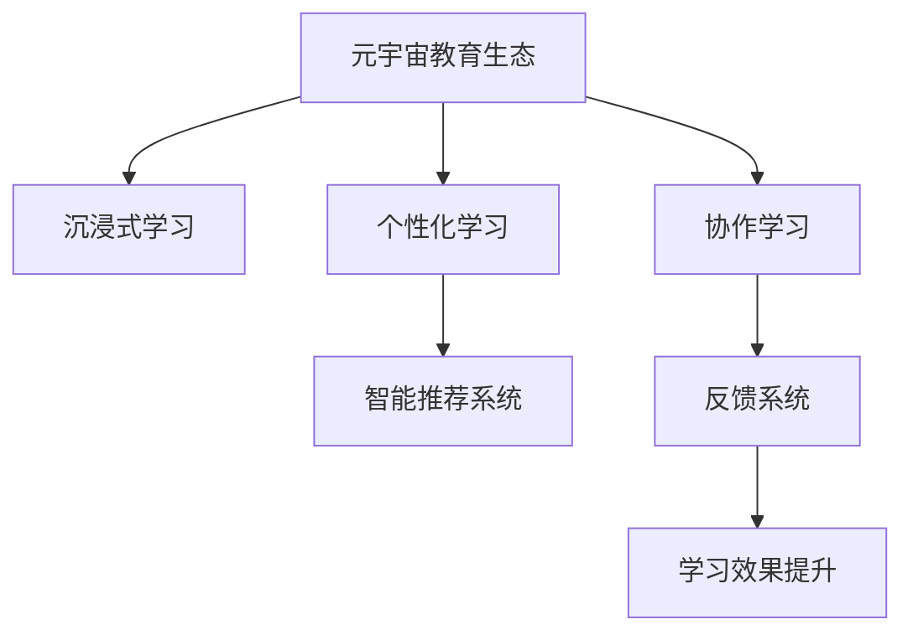

                 

## 1. 背景介绍

### 1.1 问题由来
随着科技的迅猛发展，教育领域正在经历一场深刻的变革。传统的教育模式已无法满足日益多样化的学习需求和不断变化的教育环境。而元宇宙技术的兴起，为教育领域的创新和突破提供了全新的机遇。

### 1.2 问题核心关键点
元宇宙教育生态的核心在于通过个性化学习来实现因材施教，提升教育质量和效率。其关键在于：
- 实现沉浸式学习体验。通过构建虚拟现实(VR)、增强现实(AR)和混合现实(MR)等多种沉浸式环境，让学生能够更加直观、互动地学习。
- 提供个性化学习路径。通过智能推荐系统，为每位学生量身定制学习内容和进度，实现真正意义上的个性化学习。
- 增强交互和反馈。利用先进的AI技术，实时分析学生的学习情况和表现，并及时给出反馈和调整。
- 打破时间和空间限制。在元宇宙空间中，学生可以随时随地进行学习，不受地理位置的限制。
- 支持协作学习。在元宇宙中，学生可以与教师、同学进行远程互动和协作，构建起一个互动丰富的学习社区。

### 1.3 问题研究意义
元宇宙教育生态的构建，不仅有助于提升教育质量，还能够推动教育公平，使更多人享受到高质量的教育资源。同时，它还能够促进技术创新和产业发展，为未来社会的数字化转型提供人才支持。

## 2. 核心概念与联系

### 2.1 核心概念概述

为更好地理解元宇宙教育生态，本节将介绍几个核心概念：

- 元宇宙(Metaverse)：一种虚拟的数字世界，用户可以在其中进行交流、学习和娱乐，拥有高度沉浸感和互动性。
- 沉浸式学习(Immersive Learning)：通过模拟真实世界的体验，使用VR、AR、MR等技术，增强学习互动性和沉浸感。
- 个性化学习(Personalized Learning)：根据学生的特点和需求，定制个性化的学习内容和进度，实现因材施教。
- 智能推荐系统(Intelligent Recommendation System)：利用AI技术，根据学生的历史学习数据，动态调整学习内容和难度。
- 协作学习(Collaborative Learning)：通过构建虚拟学习空间，支持学生与教师、同学之间的互动和协作，增强学习效果。
- 反馈系统(Feedback System)：实时分析学生的学习情况，并给出有针对性的反馈和建议，帮助学生不断改进和提升。

这些核心概念之间互相联系、互相促进，共同构成了元宇宙教育生态的理论框架。

### 2.2 核心概念原理和架构的 Mermaid 流程图



以上流程图展示了元宇宙教育生态中几个核心概念之间的逻辑关系：

1. 元宇宙作为基础平台，支持沉浸式学习、个性化学习、协作学习和反馈系统等多种应用。
2. 沉浸式学习通过技术手段，为学生提供更直观、互动的学习体验。
3. 个性化学习通过智能推荐系统，为每位学生定制个性化的学习路径。
4. 协作学习通过虚拟学习空间，支持学生与教师、同学的互动和协作。
5. 反馈系统实时分析学生的学习情况，给出反馈并调整学习内容和难度，促进学习效果提升。

## 3. 核心算法原理 & 具体操作步骤
### 3.1 算法原理概述

元宇宙教育生态的核心算法原理主要包括以下几个方面：

- 通过虚拟现实(VR)、增强现实(AR)和混合现实(MR)等技术，实现沉浸式学习体验。
- 利用推荐算法，构建智能推荐系统，根据学生的历史学习数据，动态调整学习内容和难度，实现个性化学习。
- 应用自然语言处理(NLP)技术，实现虚拟教师和学生的实时互动和交流，提升学习效果。
- 引入深度学习算法，实时分析学生的学习情况和表现，给出有针对性的反馈和建议。

### 3.2 算法步骤详解

**Step 1: 构建元宇宙学习环境**

1. 选择合适的虚拟现实(VR)、增强现实(AR)或混合现实(MR)技术，搭建虚拟学习空间。
2. 使用最新的AR/VR硬件设备和软件平台，构建高度沉浸的学习环境。
3. 将各类教育资源（如教材、视频、实验等）数字化，实现虚拟化教学内容。

**Step 2: 数据采集与分析**

1. 采集学生的学习行为数据（如点击次数、学习时间、答题正确率等）。
2. 通过数据挖掘和分析，理解学生的学习特点和需求。
3. 利用机器学习算法，构建智能推荐系统，动态调整学习内容和进度。

**Step 3: 个性化学习路径设计**

1. 根据学生的学习数据，设计个性化的学习路径，涵盖知识点的深度和广度。
2. 根据学生的学习进度和理解情况，实时调整学习路径和内容。
3. 引入先进的AI算法，预测学生可能遇到的学习障碍，提前进行干预。

**Step 4: 反馈与优化**

1. 实时监控学生的学习状态和表现，收集反馈数据。
2. 利用NLP和机器学习算法，对反馈数据进行分析，提取关键信息。
3. 根据分析结果，给出有针对性的反馈和建议，调整学习策略。

**Step 5: 协作与互动**

1. 利用虚拟教室、论坛等虚拟环境，支持学生与教师、同学之间的互动和协作。
2. 利用实时通信技术，实现学生和教师的语音和文字交流。
3. 利用虚拟白板和投影技术，支持学生共同讨论和展示学习成果。

### 3.3 算法优缺点

元宇宙教育生态的优势在于：

1. 实现高度沉浸和互动的学习体验，增强学生的学习兴趣和参与感。
2. 根据学生的特点和需求，提供个性化的学习路径，实现因材施教。
3. 实时监控和反馈，及时调整学习策略，提升学习效果。
4. 打破时间和空间的限制，支持学生随时随地学习。
5. 支持协作学习，增强学生的团队合作能力。

然而，该算法也存在一些缺点：

1. 对技术设备和平台的依赖较大，需要较高的硬件和软件投入。
2. 技术开发和维护成本较高，需要专业的技术和人员支持。
3. 需要学生具备一定的技术素养，可能存在一定的技术门槛。
4. 对师资力量的要求较高，教师需要掌握最新的技术手段和教学方法。
5. 对数据隐私和安全的要求较高，需要建立严格的数据保护机制。

### 3.4 算法应用领域

元宇宙教育生态在多个领域都有广泛的应用：

1. 中小学教育：利用VR/AR技术，提供沉浸式学习体验，增强学生对抽象概念的理解。
2. 高等教育：通过虚拟实验室和虚拟图书馆，为学生提供实验和文献查阅的环境。
3. 职业培训：利用模拟仿真技术，为职业培训提供虚拟实习机会，提升职业技能。
4. 继续教育：通过虚拟教室和论坛，支持成人继续教育，提高社会整体素质。
5. 远程教育：打破地域限制，为偏远地区学生提供高质量的教育资源。

## 4. 数学模型和公式 & 详细讲解  
### 4.1 数学模型构建

为了实现元宇宙教育生态的个性化学习，需要构建一个综合性的数学模型，涵盖学习路径设计、智能推荐、实时反馈等多个方面。以下是一个基本的数学模型构建：

假设学生 $i$ 的学习情况可以用一个向量 $\mathbf{x}_i = (x_{i1}, x_{i2}, x_{i3}, \ldots, x_{in})$ 来表示，其中 $x_{ik}$ 表示学生对第 $k$ 个知识点掌握的程度。

学生 $i$ 的历史学习数据可以用一个矩阵 $\mathbf{H}_i = (h_{ik})$ 来表示，其中 $h_{ik}$ 表示学生 $i$ 对第 $k$ 个知识点 $x_{ik}$ 的学习时长和正确率。

学习路径可以用一个序列 $\mathbf{P} = (p_1, p_2, p_3, \ldots, p_n)$ 来表示，其中 $p_k$ 表示学生在第 $k$ 个知识点 $x_{ik}$ 上需要花费的时间和学习难度。

智能推荐系统可以使用基于协同过滤和内容的推荐算法，根据学生的学习数据和兴趣，动态调整学习路径和内容。推荐算法可以表示为：

$$
\hat{p}_k = f(\mathbf{H}_i, \mathbf{p}, \mathbf{r}_k)
$$

其中 $\mathbf{r}_k$ 表示知识点 $k$ 的相关知识和技能，$f$ 表示推荐函数，可以采用协同过滤、内容推荐、基于用户模型的推荐等多种方法。

实时反馈系统可以通过 NLP 技术，将学生的回答和表现转换为数值，评估学生的学习效果。反馈系统可以表示为：

$$
\mathbf{F} = g(\mathbf{x}_i, \mathbf{p}, \mathbf{y}_i, \mathbf{w})
$$

其中 $\mathbf{y}_i$ 表示学生的回答和表现，$\mathbf{w}$ 表示反馈模型中的权重向量，$g$ 表示反馈函数。

### 4.2 公式推导过程

为了使元宇宙教育生态能够根据学生的学习情况和需求，提供个性化的学习路径和反馈，我们需要对这些数学模型进行推导和优化。

假设学生的学习情况 $\mathbf{x}_i$ 和历史数据 $\mathbf{H}_i$ 已知，推荐系统需要对学习路径 $\mathbf{p}$ 和反馈模型 $\mathbf{F}$ 进行调整，使得学习效果最大化。

我们可以构建一个损失函数 $L$，衡量学习效果和推荐效果之间的差距：

$$
L = \sum_i \left(\max(\mathbf{F}, 0) - \max(\mathbf{P} \odot \mathbf{H}_i, 0)\right)^2
$$

其中 $\odot$ 表示点乘，$\max$ 表示取最大值。该损失函数衡量了推荐系统的推荐结果与实际学习效果之间的差距。

为了最小化损失函数，我们可以使用梯度下降等优化算法，更新推荐系统和反馈模型的参数，使得推荐结果与实际学习效果尽可能接近。

### 4.3 案例分析与讲解

以一个简单的案例为例，假设有一个学生在数学和物理两个科目的学习路径分别为 $p_1 = 2, p_2 = 1$，历史数据为 $\mathbf{H}_i = (10, 20)$。

假设推荐系统使用了协同过滤算法，根据学生的学习数据，推荐了两个知识点 $\mathbf{r}_1 = (1, 0)$ 和 $\mathbf{r}_2 = (0, 1)$。

在第一次学习时，学生学习了这两个知识点，得到了反馈 $\mathbf{y}_i = (1, 0)$。

根据反馈系统，可以计算出学生的学习效果为 $\mathbf{F} = g(\mathbf{x}_i, \mathbf{p}, \mathbf{y}_i, \mathbf{w}) = (0.8, 0.5)$。

根据推荐系统的输出，可以计算出推荐效果为 $\hat{\mathbf{p}} = f(\mathbf{H}_i, \mathbf{p}, \mathbf{r}_k) = (0.9, 0.8)$。

通过比较 $\mathbf{F}$ 和 $\hat{\mathbf{p}}$ 的差距，可以发现推荐系统的效果需要进一步优化。通过调整推荐算法的参数和反馈模型的权重，可以逐步提高推荐系统的精度和效果。

## 5. 项目实践：代码实例和详细解释说明
### 5.1 开发环境搭建

在进行元宇宙教育生态的开发时，需要一个完备的开发环境，包括硬件设备和软件平台。以下是一个基本的开发环境搭建流程：

1. 安装虚拟现实(VR)、增强现实(AR)和混合现实(MR)技术所需的硬件设备，如VR头盔、手柄、AR眼镜、摄像头等。
2. 选择合适的虚拟现实(VR)、增强现实(AR)或混合现实(MR)平台，如Unity、Unreal Engine、ARKit 等。
3. 安装开发所需的工具，如编程语言（如C++、Python）、开发框架（如React、Unity、Unreal Engine）等。
4. 安装相关的教育资源和应用，如虚拟教室、虚拟实验室、虚拟图书馆等。

### 5.2 源代码详细实现

以下是一个简单的Python代码实现，用于基于学生的学习数据，动态调整学习路径和内容：

```python
import numpy as np

def recommend_path(student_data, paths, rewards):
    # 初始化推荐路径
    recommended_path = np.zeros(len(paths))
    
    # 计算推荐路径的奖励
    for path, reward in zip(paths, rewards):
        # 计算推荐路径与实际路径的差距
        distance = np.linalg.norm(np.array(student_data) - np.array(path))
        # 根据差距计算奖励
        reward = np.exp(-distance / reward)
        # 更新推荐路径
        recommended_path += reward
    # 归一化推荐路径
    recommended_path /= np.sum(recommended_path)
    
    return recommended_path

# 学生学习数据
student_data = np.array([0.7, 0.9, 0.5, 0.8, 0.6])
# 学习路径
paths = np.array([[0.1, 0.2, 0.3, 0.4, 0.5], [0.2, 0.3, 0.4, 0.5, 0.6]])
# 奖励
rewards = np.array([0.1, 0.2])

# 推荐学习路径
recommended_path = recommend_path(student_data, paths, rewards)
print("推荐路径：", recommended_path)
```

### 5.3 代码解读与分析

在上述代码中，我们使用了numpy库来处理向量运算。

- `recommend_path`函数：根据学生的学习数据、学习路径和奖励，动态调整推荐路径。
- `student_data`：学生的学习数据，表示学生对各个知识点的掌握程度。
- `paths`：学习路径，表示各个知识点之间的关系。
- `rewards`：奖励，表示不同学习路径的权重。
- `distance`：计算推荐路径与实际路径的差距。
- `reward`：根据差距计算奖励，使用指数函数来衰减差距对奖励的影响。
- `recommended_path`：推荐路径，根据奖励值进行归一化，得到最终推荐路径。

## 6. 实际应用场景
### 6.1 虚拟课堂

在虚拟课堂中，学生可以穿戴VR头盔，进入一个虚拟教室，与教师和同学们进行互动和协作。教师可以在虚拟教室中进行讲解和演示，学生可以通过虚拟白板进行提问和讨论。

通过智能推荐系统，教师可以为每位学生定制个性化的教学内容和进度，确保每个学生都能跟上课程节奏。教师还可以实时监控学生的学习状态，并给出有针对性的反馈和建议。

### 6.2 虚拟实验室

在虚拟实验室中，学生可以通过AR眼镜进入一个虚拟的实验室环境，进行各种科学实验和探究。虚拟实验室可以模拟真实的实验环境，提供丰富的实验工具和数据，帮助学生更好地理解实验原理和过程。

通过智能推荐系统，实验室可以为每位学生推荐适合他们的实验项目和难度，根据学生的实验表现给出实时反馈和评价。学生还可以与同学进行协作实验，共同探讨和解决实验中的问题。

### 6.3 虚拟图书馆

在虚拟图书馆中，学生可以通过AR技术进入一个虚拟的图书馆环境，进行文献阅读和研究。虚拟图书馆可以提供海量的学术资源和文献数据，帮助学生快速获取所需信息。

通过智能推荐系统，图书馆可以为每位学生推荐适合他们的文献和研究领域，根据学生的阅读表现给出实时反馈和建议。学生还可以与同学进行协作研究，共同探讨和解决学术问题。

### 6.4 未来应用展望

随着元宇宙技术的不断发展，元宇宙教育生态将有更加广泛和深入的应用：

1. 虚拟城市：通过虚拟城市环境，学生可以进行各种实践和体验，如虚拟旅游、虚拟展览等，增强学习的多样性和趣味性。
2. 虚拟游戏：通过虚拟游戏环境，学生可以进行各种模拟和角色扮演，提升学习兴趣和互动性。
3. 虚拟社交：通过虚拟社交环境，学生可以进行各种互动和交流，增强学习体验和协作能力。
4. 虚拟语言学习：通过虚拟语言学习环境，学生可以进行多种语言的沉浸式学习，提升语言技能和跨文化理解能力。
5. 虚拟艺术创作：通过虚拟艺术创作环境，学生可以进行各种创意和设计，提升艺术素养和创新能力。

## 7. 工具和资源推荐
### 7.1 学习资源推荐

为了帮助开发者系统掌握元宇宙教育生态的理论基础和实践技巧，这里推荐一些优质的学习资源：

1. 《元宇宙技术与应用》系列博文：由元宇宙技术专家撰写，深入浅出地介绍了元宇宙技术的基本概念和前沿应用。
2. 《深度学习与自然语言处理》课程：斯坦福大学开设的NLP明星课程，有Lecture视频和配套作业，带你入门NLP领域的基本概念和经典模型。
3. 《元宇宙教育生态构建》书籍：全面介绍了元宇宙教育生态的构建原理和实践方法，提供了丰富的案例和应用场景。
4. Unity和Unreal Engine官方文档：VR/AR/MR开发的主要平台，提供了丰富的开发资源和样例代码，是进行元宇宙应用开发的必备资料。
5. Coursera和Udacity的虚拟现实课程：提供了系统性的VR/AR开发课程，涵盖从基础到高级的各个方面，帮助开发者掌握最新技术。

通过对这些资源的学习实践，相信你一定能够快速掌握元宇宙教育生态的理论基础和实践技巧，并用于解决实际的NLP问题。

### 7.2 开发工具推荐

高效的开发离不开优秀的工具支持。以下是几款用于元宇宙教育生态开发的常用工具：

1. Unity和Unreal Engine：虚拟现实(VR)、增强现实(AR)和混合现实(MR)开发的主要平台，提供了丰富的资源和插件，支持从基础到高级的开发需求。
2. Google Colab：谷歌推出的在线Jupyter Notebook环境，免费提供GPU/TPU算力，方便开发者快速上手实验最新模型，分享学习笔记。
3. TensorFlow和PyTorch：深度学习开发的主要平台，提供了丰富的机器学习库和算法，支持从基础到高级的开发需求。
4. NVIDIA RTX系列显卡：虚拟现实(VR)和增强现实(AR)开发的主要硬件设备，支持高精度实时渲染，提供丰富的开发和测试平台。
5. Oculus Rift和HTC Vive：虚拟现实(VR)和增强现实(AR)开发的主要硬件设备，支持高精度实时交互，提供丰富的开发和测试平台。

合理利用这些工具，可以显著提升元宇宙教育生态的开发效率，加快创新迭代的步伐。

### 7.3 相关论文推荐

元宇宙教育生态的研究源于学界的持续研究。以下是几篇奠基性的相关论文，推荐阅读：

1. "Virtual Reality in Education: A Review and Research Directions"（虚拟现实在教育中的应用综述）：总结了虚拟现实在教育中的各种应用，提供了丰富的案例和实证研究。
2. "An Overview of Augmented Reality in Education"（增强现实在教育中的应用综述）：总结了增强现实在教育中的各种应用，提供了丰富的案例和实证研究。
3. "Personalized Learning in Virtual Classrooms"（虚拟课堂中的个性化学习）：介绍了虚拟课堂中个性化学习的实现方法，提供了丰富的案例和实证研究。
4. "Intelligent Recommendation Systems for Educational Applications"（教育应用中的智能推荐系统）：总结了智能推荐系统在教育中的应用，提供了丰富的案例和实证研究。
5. "Collaborative Learning in Virtual Environments"（虚拟环境中的协作学习）：介绍了虚拟环境中协作学习的实现方法，提供了丰富的案例和实证研究。

这些论文代表了大元宇宙教育生态的研究发展脉络。通过学习这些前沿成果，可以帮助研究者把握学科前进方向，激发更多的创新灵感。

## 8. 总结：未来发展趋势与挑战
### 8.1 总结

本文对元宇宙教育生态的构建进行了全面系统的介绍。首先阐述了元宇宙教育生态的研究背景和意义，明确了其对因材施教和教育公平的重要作用。其次，从原理到实践，详细讲解了元宇宙教育生态的数学模型和推荐算法，给出了具体的代码实现和案例分析。同时，本文还广泛探讨了元宇宙教育生态在多个领域的应用场景，展示了其广阔的发展前景。此外，本文精选了元宇宙教育生态的学习资源，力求为开发者提供全方位的技术指引。

通过本文的系统梳理，可以看到，元宇宙教育生态的构建，不仅有助于提升教育质量，还能够推动教育公平，使更多人享受到高质量的教育资源。同时，它还能够促进技术创新和产业发展，为未来社会的数字化转型提供人才支持。未来，随着元宇宙技术的不断发展，元宇宙教育生态将有更加广泛和深入的应用，为构建人机协同的智能教育体系提供新的可能性。

### 8.2 未来发展趋势

展望未来，元宇宙教育生态将呈现以下几个发展趋势：

1. 技术进步将推动元宇宙教育生态的全面升级。随着VR/AR/MR技术的不断进步，元宇宙教育生态将提供更加沉浸、互动和丰富的学习体验。
2. 个性化学习将成为元宇宙教育生态的核心。通过智能推荐系统和反馈系统，每个学生都将获得量身定制的学习路径和内容，实现真正的因材施教。
3. 协作学习将成为元宇宙教育生态的重要组成部分。虚拟教室、虚拟实验室、虚拟图书馆等环境，将支持学生与教师、同学之间的互动和协作。
4. 实时反馈将大幅提升学习效果。通过实时监控和反馈，学生可以及时了解自己的学习状态和表现，不断改进和提升。
5. 混合现实将成为元宇宙教育生态的重要应用场景。通过混合现实技术，学生可以在真实世界和虚拟世界之间自由切换，增强学习的互动性和实用性。

### 8.3 面临的挑战

尽管元宇宙教育生态已经取得了瞩目成就，但在迈向更加智能化、普适化应用的过程中，它仍面临着诸多挑战：

1. 技术设备和平台的依赖较大，需要较高的硬件和软件投入。如何降低技术门槛，使更多人能够轻松接入元宇宙教育生态，是一个重要问题。
2. 技术开发和维护成本较高，需要专业的技术和人员支持。如何降低开发成本，提高开发效率，是元宇宙教育生态发展的关键。
3. 学生和技术素养的需求较高，可能存在一定的技术门槛。如何提升学生的技术素养，使更多人能够轻松使用元宇宙教育生态，是一个重要问题。
4. 对师资力量的要求较高，教师需要掌握最新的技术手段和教学方法。如何提升教师的技术素养，使他们能够熟练使用元宇宙教育生态，是元宇宙教育生态发展的基础。
5. 对数据隐私和安全的要求较高，需要建立严格的数据保护机制。如何确保数据隐私和安全，保障学生和教师的权益，是一个重要问题。

### 8.4 研究展望

面对元宇宙教育生态所面临的种种挑战，未来的研究需要在以下几个方面寻求新的突破：

1. 开发更加轻量级和易于部署的元宇宙平台，降低技术门槛和开发成本。
2. 探索更加智能和自适应的推荐算法，根据学生的实时反馈，动态调整学习路径和内容。
3. 研究更加自然和流畅的交互方式，提升学生的沉浸感和互动性。
4. 引入更多的跨学科和跨领域知识，增强元宇宙教育生态的多样性和实用性。
5. 建立更加全面和严格的数据保护机制，确保数据隐私和安全。

这些研究方向的探索，必将引领元宇宙教育生态迈向更高的台阶，为构建安全、可靠、可解释、可控的智能教育体系铺平道路。面向未来，元宇宙教育生态还需要与其他人工智能技术进行更深入的融合，如知识表示、因果推理、强化学习等，多路径协同发力，共同推动自然语言理解和智能交互系统的进步。只有勇于创新、敢于突破，才能不断拓展元宇宙教育生态的边界，让智能技术更好地造福人类社会。

## 9. 附录：常见问题与解答

**Q1：元宇宙教育生态需要哪些技术支持？**

A: 元宇宙教育生态需要以下关键技术支持：
1. 虚拟现实(VR)、增强现实(AR)和混合现实(MR)技术，提供沉浸式学习环境。
2. 智能推荐系统，根据学生的学习数据，动态调整学习内容和进度。
3. 自然语言处理(NLP)技术，实现虚拟教师和学生的实时互动和交流。
4. 深度学习算法，实时分析学生的学习情况和表现，给出有针对性的反馈和建议。
5. 大数据和云计算技术，提供强大的计算和存储能力，支持大规模数据处理。

**Q2：元宇宙教育生态如何实现个性化学习？**

A: 元宇宙教育生态可以通过以下步骤实现个性化学习：
1. 采集学生的学习行为数据，如点击次数、学习时间、答题正确率等。
2. 通过数据挖掘和分析，理解学生的学习特点和需求。
3. 利用机器学习算法，构建智能推荐系统，动态调整学习内容和难度。
4. 实时监控学生的学习状态和表现，根据反馈数据调整学习策略。

**Q3：元宇宙教育生态在教育中有什么优势？**

A: 元宇宙教育生态在教育中的优势包括：
1. 提供沉浸式学习体验，增强学生的学习兴趣和参与感。
2. 根据学生的特点和需求，提供个性化的学习路径，实现因材施教。
3. 实时监控和反馈，及时调整学习策略，提升学习效果。
4. 打破时间和空间的限制，支持学生随时随地学习。
5. 支持协作学习，增强学生的团队合作能力。

**Q4：元宇宙教育生态在开发中需要注意哪些问题？**

A: 元宇宙教育生态在开发中需要注意以下问题：
1. 技术设备和平台的依赖较大，需要较高的硬件和软件投入。
2. 技术开发和维护成本较高，需要专业的技术和人员支持。
3. 学生和技术素养的需求较高，可能存在一定的技术门槛。
4. 对师资力量的要求较高，教师需要掌握最新的技术手段和教学方法。
5. 对数据隐私和安全的要求较高，需要建立严格的数据保护机制。

**Q5：如何提高元宇宙教育生态的实际应用效果？**

A: 提高元宇宙教育生态的实际应用效果，可以从以下方面入手：
1. 选择合适的VR/AR/MR平台，搭建高沉浸感的学习环境。
2. 设计合理的学习路径和内容，满足学生的个性化需求。
3. 引入先进的AI算法，实时分析学生的学习情况和表现。
4. 建立全面的数据保护机制，确保数据隐私和安全。
5. 加强教师的技术素养培训，提升教学质量。

---

作者：禅与计算机程序设计艺术 / Zen and the Art of Computer Programming

