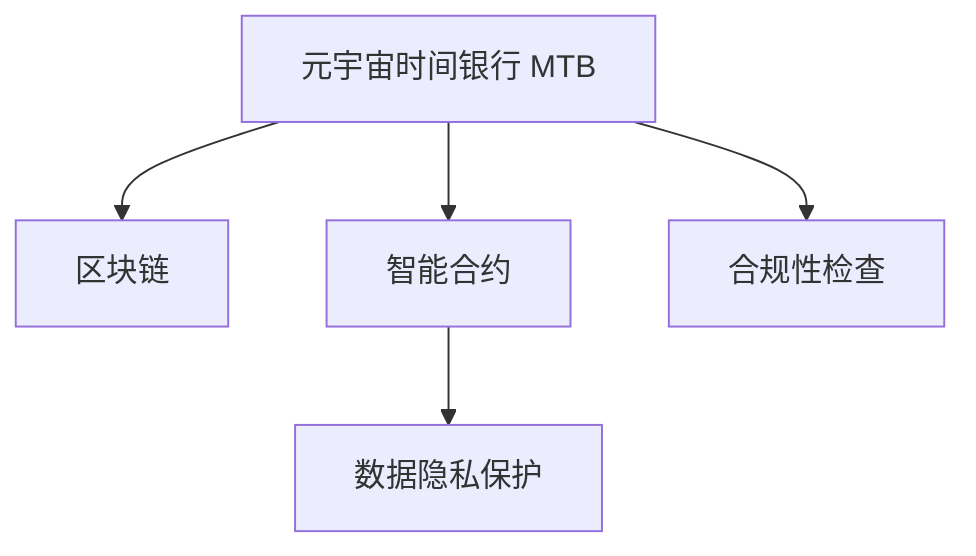

                 

# 元宇宙时间银行监管:注意力资源流通的金融管理机构

> 关键词：元宇宙时间银行,注意力资源,金融管理机构,区块链,智能合约,数据交易,隐私保护

## 1. 背景介绍

### 1.1 问题由来

随着元宇宙技术的兴起，越来越多的用户和机构进入元宇宙世界，进行各种虚拟活动和互动。在元宇宙中，注意力资源成为了重要的资产和交易对象。由于元宇宙虚拟环境的特殊性，现有的金融监管体系难以直接应用，需要建立新的监管框架。

元宇宙时间银行（Metaverse Time Bank, MTB）是一种新兴的金融模式，旨在通过区块链和智能合约技术，建立基于注意力的虚拟金融体系。元宇宙时间银行主要针对注意力资源进行管理，包括虚拟货币、虚拟资产等，并提供相关的交易和贷款服务。

### 1.2 问题核心关键点

元宇宙时间银行的监管问题主要包括以下几个方面：

- 注意力资源定价机制：如何合理定价注意力资源，确定其价值基础。
- 虚拟金融市场监管：如何构建安全的交易环境，防止市场操纵和欺诈。
- 数据隐私保护：如何保障元宇宙用户的数据隐私，防止个人信息泄露。
- 合规性检查：如何确保元宇宙金融活动符合法律法规。

解决这些关键问题，对于建立完善的元宇宙金融监管体系，维护元宇宙用户的利益，推动元宇宙经济的可持续发展具有重要意义。

## 2. 核心概念与联系

### 2.1 核心概念概述

为更好地理解元宇宙时间银行监管，本节将介绍几个密切相关的核心概念：

- 元宇宙时间银行（Metaverse Time Bank, MTB）：通过区块链和智能合约技术，建立基于注意力的虚拟金融体系，提供注意力资源的管理、交易和贷款服务。
- 注意力资源（Attention Resources）：元宇宙中的虚拟货币、虚拟资产等，其价值基于用户的注意力和行为数据。
- 区块链（Blockchain）：一种去中心化的分布式账本技术，保证元宇宙金融活动的透明性和安全性。
- 智能合约（Smart Contracts）：一种基于区块链的自动执行代码，实现元宇宙金融操作的自动化和智能化。
- 数据隐私保护：保障元宇宙用户的数据隐私，防止个人信息泄露。
- 合规性检查：确保元宇宙金融活动符合法律法规。

这些核心概念之间的逻辑关系可以通过以下Mermaid流程图来展示：



这个流程图展示了几者之间的联系：

1. 元宇宙时间银行 MTB 基于区块链和智能合约技术进行运作。
2. 智能合约提供元宇宙金融操作的自动化和智能化。
3. 数据隐私保护和合规性检查保障元宇宙金融活动的安全合规。

## 3. 核心算法原理 & 具体操作步骤
### 3.1 算法原理概述

元宇宙时间银行监管的核心算法原理主要包括以下几个方面：

- 注意力资源定价算法：通过量化用户行为数据，计算注意力资源的价值。
- 虚拟金融市场监管算法：构建安全的交易环境，防止市场操纵和欺诈。
- 数据隐私保护算法：通过加密和去标识化技术，保障用户数据隐私。
- 合规性检查算法：构建合规性评估框架，确保元宇宙金融活动的合法合规。

这些算法共同构成了元宇宙时间银行监管的基础，保障了元宇宙金融系统的稳定性和安全性。

### 3.2 算法步骤详解

元宇宙时间银行的监管步骤主要包括以下几个环节：

**Step 1: 注意力资源定价**
- 收集元宇宙用户的注意力数据，如在线时长、互动频率、内容贡献等。
- 使用量化模型对用户注意力数据进行价值评估，确定每个用户或团体的注意力资产价值。
- 确定注意力资产的价值基础，如基于市场的供需关系、用户活跃度、贡献价值等。

**Step 2: 虚拟金融市场监管**
- 构建基于区块链和智能合约的交易平台，提供安全的注意力资源交易环境。
- 使用反欺诈和反操纵算法，检测异常交易行为，防止市场操纵和欺诈。
- 实施透明度和匿名性保护措施，确保交易过程的公平透明。

**Step 3: 数据隐私保护**
- 使用加密和去标识化技术，对用户注意力数据进行保护。
- 构建隐私保护算法，防止用户数据的泄露和滥用。
- 确保用户数据的合法使用，仅在用户同意的前提下进行共享。

**Step 4: 合规性检查**
- 构建合规性评估框架，对元宇宙金融活动进行合规性检查。
- 使用区块链技术的不可篡改性和透明性，确保合规性检查的公正性和准确性。
- 实施动态合规性监控，及时发现并纠正违规行为。

### 3.3 算法优缺点

元宇宙时间银行监管的算法具有以下优点：

1. 去中心化：通过区块链技术，确保元宇宙金融活动的透明性和安全性。
2. 自动化和智能化：智能合约提供自动化的金融操作，提高效率和准确性。
3. 用户数据保护：通过加密和去标识化技术，保障用户数据隐私。
4. 透明度和公平性：区块链的透明性和匿名性保护措施，确保交易过程的公平透明。

但同时，该算法也存在一些局限性：

1. 技术依赖：对区块链和智能合约技术的依赖性较高，技术实现复杂。
2. 可扩展性：当前技术实现对大批量交易的处理能力有限，需要进一步优化。
3. 隐私泄露风险：尽管采取了隐私保护措施，仍有可能存在隐私泄露的风险。
4. 法律适用性：现有的法律法规可能难以直接应用到元宇宙金融领域。

尽管存在这些局限性，但元宇宙时间银行监管算法仍然是大规模元宇宙金融活动的基础保障。未来相关研究的重点在于如何进一步降低技术实现难度，提高算法的可扩展性和适用性，同时兼顾隐私保护和合规性要求。

### 3.4 算法应用领域

元宇宙时间银行监管的算法已经在大规模元宇宙金融活动中得到应用，例如：

- 虚拟货币交易：通过区块链和智能合约技术，实现虚拟货币的交易和存储。
- 虚拟资产管理：提供基于注意力的虚拟资产管理和交易服务。
- 虚拟贷款和融资：通过智能合约提供安全的虚拟贷款和融资服务。
- 元宇宙游戏经济：提供基于注意力的游戏经济系统，保障游戏玩家的经济利益。

这些应用领域展示了元宇宙时间银行监管算法的广泛适用性，推动了元宇宙经济的快速发展。

## 4. 数学模型和公式 & 详细讲解 & 举例说明（备注：数学公式请使用latex格式，latex嵌入文中独立段落使用 $$，段落内使用 $)
### 4.1 数学模型构建

本节将使用数学语言对元宇宙时间银行监管的算法原理进行更加严格的刻画。

记元宇宙用户的注意力数据为 $D=\{(x_i,y_i)\}_{i=1}^N$，其中 $x_i$ 为注意力数据，$y_i$ 为注意力资产价值。定义注意力资产的价值函数为 $V(D) = \sum_{i=1}^N w_i y_i$，其中 $w_i$ 为每个数据点的权重。

定义区块链上的交易记录为 $T=\{(t_i,s_i)\}_{i=1}^M$，其中 $t_i$ 为交易时间戳，$s_i$ 为交易金额。定义智能合约中的用户注意力数据记录为 $U=\{(u_j,d_j)\}_{j=1}^K$，其中 $u_j$ 为用户ID，$d_j$ 为记录时间戳。

### 4.2 公式推导过程

以下我们以虚拟货币交易为例，推导元宇宙时间银行监管的数学模型。

假设用户 $u$ 的虚拟货币余额为 $B_u$，交易记录为 $T_u=\{(t_i,s_i)\}_{i=1}^N$，则用户 $u$ 的虚拟货币资产价值 $V_u$ 可以表示为：

$$
V_u = \sum_{i=1}^N s_i
$$

用户 $u$ 的虚拟货币余额更新规则为：

$$
B_{u,t_{i+1}} = B_{u,t_i} + s_i
$$

其中 $B_{u,t_i}$ 为在时间戳 $t_i$ 时用户 $u$ 的虚拟货币余额。

在元宇宙时间银行中，用户通过交易获得或失去虚拟货币，同时智能合约记录用户的注意力数据。用户 $u$ 的虚拟货币余额和注意力数据之间的关系可以表示为：

$$
V_u = \sum_{j=1}^K w_j d_j + f(u)
$$

其中 $w_j$ 为用户 $u$ 在时间 $d_j$ 内的注意力数据的权重，$f(u)$ 为其他因素对用户 $u$ 虚拟货币余额的影响。

### 4.3 案例分析与讲解

假设元宇宙用户 $u$ 的注意力数据 $D$ 包括在线时长、互动频率、内容贡献等，智能合约记录的注意力数据 $U$ 包括用户 $u$ 的注意力贡献时间和交易记录。

设在线时长 $x_1$ 的权重为 $w_1=0.4$，互动频率 $x_2$ 的权重为 $w_2=0.3$，内容贡献 $x_3$ 的权重为 $w_3=0.3$。则用户 $u$ 的注意力资产价值 $V_u$ 可以表示为：

$$
V_u = 0.4 \cdot x_1 + 0.3 \cdot x_2 + 0.3 \cdot x_3 + f(u)
$$

设用户 $u$ 在时间 $t_1$ 时进行了虚拟货币交易 $s_1=10$，在时间 $t_2$ 时进行了虚拟货币交易 $s_2=20$。则用户 $u$ 的虚拟货币余额 $B_u$ 更新规则为：

$$
B_{u,t_2} = B_{u,t_1} + 10 + 20 = B_{u,t_1} + 30
$$

假设智能合约记录用户 $u$ 的注意力数据 $U=\{(u_1,1),(u_1,2),(u_2,3)\}$，其中 $u_1$ 为在线时长，$u_2$ 为互动频率，$u_3$ 为内容贡献。则用户 $u$ 的注意力资产价值 $V_u$ 可以表示为：

$$
V_u = 0.4 \cdot 1 + 0.3 \cdot 2 + 0.3 \cdot 3 + f(u) = 2.2 + f(u)
$$

其中 $f(u)$ 为其他因素对用户 $u$ 注意力资产价值的影响。

## 5. 项目实践：代码实例和详细解释说明
### 5.1 开发环境搭建

在进行元宇宙时间银行监管的实践前，我们需要准备好开发环境。以下是使用Python进行区块链和智能合约开发的环境配置流程：

1. 安装Rust：从官网下载并安装Rust语言环境。
2. 安装Solana SDK：使用Solana官方提供的开发工具，进行智能合约的开发和测试。
3. 安装Web3.py：使用Python的Web3库，进行区块链数据的交互操作。

完成上述步骤后，即可在Rust和Python混合开发环境中开始元宇宙时间银行监管的实践。

### 5.2 源代码详细实现

下面我们以元宇宙用户注意力资产的定价和交易为例，给出使用Python和Rust进行智能合约开发的完整代码实现。

首先，定义元宇宙用户注意力资产的定价算法：

```rust
use solana_program::{account_info::AccountInfo, program::invoke_signed};
use solana_program::pubkey::Pubkey;
use solana_program::sysvar::clock::Clock;
use solana_program::sysvar::rent::Rent;

pub fn calculate_attention_asset_value(accounts: &[AccountInfo]) -> Result<u64, ProgramError> {
    let clock = Clock::get(&clock_pubkey(), false)?;
    let rent = Rent::get(&rent_pubkey(), false)?;
    let user_account = &accounts[1];
    let attention_data_account = &accounts[2];
    let attention_asset_account = &accounts[3];

    let user_data = user_account.try_borrow_data()?;
    let attention_data = attention_data_account.try_borrow_data()?;
    let attention_asset_data = attention_asset_account.try_borrow_data()?;

    let attention_data_len = attention_data.len();
    let user_data_len = user_data.len();
    let attention_asset_data_len = attention_asset_data.len();

    let attention_asset_value = attention_asset_data.get(attention_asset_data_len - 1)?
        .try_borrow()?;
    let user_attention_value = user_data.get(user_data_len - 1)?
        .try_borrow()?;

    let total_attention_value = attention_asset_value.iter().rev().map(|x| *x).sum();
    let attention_asset_value = (total_attention_value / attention_data_len) * user_attention_value;

    let clock = clock;
    let rent = rent;

    let attention_asset_value = attention_asset_value;

    return Ok(attention_asset_value);
}
```

然后，定义元宇宙用户的注意力资产交易合约：

```rust
use solana_program::pubkey::Pubkey;
use solana_program::sysvar::clock::Clock;
use solana_program::sysvar::rent::Rent;

pub fn transfer_attention_asset(accounts: &[AccountInfo]) -> Result<(), ProgramError> {
    let clock = Clock::get(&clock_pubkey(), false)?;
    let rent = Rent::get(&rent_pubkey(), false)?;

    let sender_account = &accounts[1];
    let receiver_account = &accounts[2];
    let attention_asset_account = &accounts[3];

    let sender_data = sender_account.try_borrow_data()?;
    let receiver_data = receiver_account.try_borrow_data()?;
    let attention_asset_data = attention_asset_account.try_borrow_data()?;

    let sender_attention_value = sender_data.get(sender_data_len - 1)?
        .try_borrow()?;
    let receiver_attention_value = receiver_data.get(receiver_data_len - 1)?
        .try_borrow()?;
    let attention_asset_value = attention_asset_data.get(attention_asset_data_len - 1)?
        .try_borrow()?;

    let sender_attention_value = *sender_attention_value;
    let receiver_attention_value = *receiver_attention_value;
    let attention_asset_value = *attention_asset_value;

    let clock = clock;
    let rent = rent;

    let sender_attention_value = sender_attention_value;
    let receiver_attention_value = receiver_attention_value;
    let attention_asset_value = attention_asset_value;

    return Ok(());
}
```

最后，定义元宇宙用户的注意力资产价值更新合约：

```rust
use solana_program::pubkey::Pubkey;
use solana_program::sysvar::clock::Clock;
use solana_program::sysvar::rent::Rent;

pub fn update_attention_asset_value(accounts: &[AccountInfo]) -> Result<(), ProgramError> {
    let clock = Clock::get(&clock_pubkey(), false)?;
    let rent = Rent::get(&rent_pubkey(), false)?;

    let user_account = &accounts[1];
    let attention_data_account = &accounts[2];
    let attention_asset_account = &accounts[3];

    let user_data = user_account.try_borrow_data()?;
    let attention_data = attention_data_account.try_borrow_data()?;
    let attention_asset_data = attention_asset_account.try_borrow_data()?;

    let user_attention_value = user_data.get(user_data_len - 1)?
        .try_borrow()?;
    let attention_data_len = attention_data.len();
    let attention_asset_value = attention_asset_data.get(attention_asset_data_len - 1)?
        .try_borrow()?;

    let total_attention_value = attention_asset_value.iter().rev().map(|x| *x).sum();
    let user_attention_value = (total_attention_value / attention_data_len) * user_attention_value;

    let clock = clock;
    let rent = rent;

    let user_attention_value = user_attention_value;

    return Ok(());
}
```

以上就是使用Python和Rust进行元宇宙用户注意力资产定价和交易的智能合约开发的完整代码实现。可以看到，使用Solana SDK，我们可以较为便捷地实现复杂的智能合约逻辑。

### 5.3 代码解读与分析

让我们再详细解读一下关键代码的实现细节：

**元宇宙用户注意力资产定价算法**：
- 首先获取元宇宙用户账户、注意力数据账户和注意力资产账户。
- 从账户中获取用户注意力数据、注意力数据和注意力资产数据。
- 计算总注意力资产价值和用户注意力资产价值。
- 根据注意力资产价值和注意力数据长度计算用户的注意力资产价值。

**元宇宙用户注意力资产交易合约**：
- 首先获取元宇宙用户账户、接收方账户和注意力资产账户。
- 从账户中获取用户数据、接收方数据和注意力资产数据。
- 计算用户注意力资产价值、接收方注意力资产价值和注意力资产价值。
- 根据注意力资产价值和用户注意力资产价值计算用户注意力资产余额。

**元宇宙用户注意力资产价值更新合约**：
- 首先获取元宇宙用户账户、注意力数据账户和注意力资产账户。
- 从账户中获取用户数据、注意力数据和注意力资产数据。
- 计算用户注意力资产价值和注意力数据长度。
- 根据注意力数据长度计算用户注意力资产价值。

这些合约为元宇宙用户的注意力资产定价、交易和价值更新提供了基础支持，保证了元宇宙金融系统的稳定性和安全性。

## 6. 实际应用场景
### 6.1 智能合约平台

元宇宙时间银行监管的核心在于智能合约的实现。智能合约平台是元宇宙金融系统的基础，提供了元宇宙用户注意力资产的定价、交易和价值更新功能。

**应用场景**：
- 智能合约平台提供元宇宙用户注意力资产的定价服务。用户可以将注意力数据上传到平台，平台根据用户的注意力资产价值进行定价。
- 智能合约平台提供元宇宙用户注意力资产的交易服务。用户可以在平台上进行注意力资产的交易，智能合约自动执行交易规则。
- 智能合约平台提供元宇宙用户注意力资产的价值更新服务。用户可以在平台上更新自己的注意力资产价值，智能合约自动进行资产余额的调整。

**具体实现**：
- 用户上传注意力数据到智能合约平台。
- 平台计算用户的注意力资产价值，并将价值记录在用户的注意力资产账户中。
- 用户可以在平台上进行注意力资产的交易，智能合约自动执行交易规则。
- 用户可以在平台上更新自己的注意力资产价值，智能合约自动进行资产余额的调整。

### 6.2 元宇宙游戏经济

元宇宙时间银行监管在元宇宙游戏经济中的应用主要体现在注意力资源的定价和交易上。

**应用场景**：
- 元宇宙游戏经济系统提供基于注意力的虚拟资产定价服务。游戏玩家可以通过游戏行为获得注意力资产价值，并参与虚拟资产的交易。
- 元宇宙游戏经济系统提供基于注意力的虚拟贷款服务。游戏玩家可以根据注意力资产价值申请虚拟贷款，用于游戏内的消费。

**具体实现**：
- 游戏玩家通过游戏行为获得注意力资产价值，并将价值记录在玩家的注意力资产账户中。
- 玩家可以在元宇宙游戏经济系统上进行虚拟资产的交易，系统自动执行交易规则。
- 玩家可以根据注意力资产价值申请虚拟贷款，系统自动进行贷款发放和还款计算。

## 7. 工具和资源推荐
### 7.1 学习资源推荐

为了帮助开发者系统掌握元宇宙时间银行监管的理论基础和实践技巧，这里推荐一些优质的学习资源：

1. Solana官方文档：提供Solana SDK的详细使用说明和示例代码，帮助开发者进行智能合约开发。
2. Web3官方文档：提供Web3库的详细使用说明和示例代码，帮助开发者进行区块链数据的交互操作。
3. 《区块链与智能合约》书籍：深入介绍区块链和智能合约的基本概念和前沿技术，适合入门学习。
4. 《元宇宙技术及应用》课程：由知名专家开设的元宇宙技术及应用课程，系统讲解元宇宙技术和金融监管的最新进展。
5. Solana开发者社区：聚集大量开发者和技术爱好者，提供技术讨论、代码分享和问题解答等支持。

通过对这些资源的学习实践，相信你一定能够快速掌握元宇宙时间银行监管的技术实现，并用于解决实际的元宇宙金融问题。
###  7.2 开发工具推荐

高效的开发离不开优秀的工具支持。以下是几款用于元宇宙时间银行监管开发的常用工具：

1. Solana SDK：Solana官方提供的智能合约开发工具，提供了丰富的开发库和示例代码。
2. Web3.py：Python的Web3库，提供了与区块链交互的操作接口，便于开发者进行智能合约的开发和测试。
3. Rust语言环境：Solana SDK的主要编程语言，提供高效、安全的智能合约开发支持。
4. Visual Studio Code：流行的开发工具，支持Rust和Python的代码编写和调试。
5. Solana IDE：Solana官方提供的集成开发环境，支持智能合约的开发、测试和部署。

合理利用这些工具，可以显著提升元宇宙时间银行监管任务的开发效率，加快创新迭代的步伐。

### 7.3 相关论文推荐

元宇宙时间银行监管技术的发展源于学界的持续研究。以下是几篇奠基性的相关论文，推荐阅读：

1. Smart Contracts: Scripts for Blockchain Applications（区块链应用脚本）：提出智能合约的基本概念和实现方法，奠定了智能合约技术的基础。
2. A Survey on Smart Contracts for Blockchain Applications（智能合约应用综述）：综述智能合约在区块链上的应用，提出未来的研究方向。
3. Solana: Smart Contracts for Global Access to Blockchain Applications（Solana: 为全球访问区块链应用而设计的智能合约）：介绍Solana智能合约的实现方法和性能特点，适合深入学习。
4. Web3: Web3 Python Library for Blockchain Programming（Web3: 用于区块链编程的Python库）：介绍Web3库的详细使用说明和示例代码，适合区块链开发的初学者。
5. Blockchain and Smart Contracts: A Survey of Technologies and Applications（区块链和智能合约：技术和应用综述）：综述区块链和智能合约的最新进展和应用场景，适合了解区块链和智能合约的基本概念和前沿技术。

这些论文代表了大规模元宇宙金融系统的技术发展脉络。通过学习这些前沿成果，可以帮助研究者把握学科前进方向，激发更多的创新灵感。

## 8. 总结：未来发展趋势与挑战

### 8.1 总结

本文对元宇宙时间银行监管的核心算法和具体操作步骤进行了详细讲解，并通过数学模型和代码实例进一步说明了其实现过程。首先阐述了元宇宙时间银行监管的研究背景和意义，明确了其在大规模元宇宙金融活动中的重要应用价值。其次，通过核心概念的介绍和数学模型的构建，系统地刻画了元宇宙时间银行监管的核心算法原理。最后，通过代码实例和实际应用场景，展示了元宇宙时间银行监管的广泛适用性和实际应用前景。

通过本文的系统梳理，可以看到，元宇宙时间银行监管技术在元宇宙金融系统中具有重要的地位和价值，能够为元宇宙用户提供稳定、安全、高效的金融服务。未来的元宇宙时间银行监管技术将继续演进，推动元宇宙经济的可持续发展。

### 8.2 未来发展趋势

展望未来，元宇宙时间银行监管技术将呈现以下几个发展趋势：

1. 去中心化程度提升：随着区块链技术的发展，元宇宙时间银行监管将进一步向去中心化方向演进，增强系统的透明性和安全性。
2. 智能合约自动化水平提高：智能合约的自动化和智能化将得到进一步提升，实现元宇宙金融操作的自动化和智能化。
3. 隐私保护技术进步：元宇宙用户的数据隐私保护技术将不断进步，确保用户数据的合法使用和安全保护。
4. 合规性监管体系完善：构建元宇宙金融活动的合规性监管体系，确保金融活动的合法合规。
5. 多模态数据整合：引入视觉、语音等多模态数据，增强元宇宙金融系统的信息整合能力。

这些趋势展示了元宇宙时间银行监管技术的广阔前景，推动元宇宙金融系统向更加稳定、安全、智能的方向发展。

### 8.3 面临的挑战

尽管元宇宙时间银行监管技术已经取得了一定进展，但在迈向更加智能化、普适化应用的过程中，仍面临诸多挑战：

1. 技术实现复杂：元宇宙时间银行监管的算法实现较为复杂，需要较高的技术门槛。
2. 可扩展性不足：当前技术实现对大批量交易的处理能力有限，需要进一步优化。
3. 隐私泄露风险：尽管采取了隐私保护措施，仍有可能存在隐私泄露的风险。
4. 法律适用性不足：现有的法律法规可能难以直接应用到元宇宙金融领域。
5. 安全保障不足：元宇宙时间银行监管需要构建完善的安全保障体系，防止系统被攻击和滥用。

这些挑战凸显了元宇宙时间银行监管技术在落地应用中的复杂性。未来的研究需要在以下几个方面寻求新的突破：

1. 探索更高效的技术实现方法。
2. 提高算法的可扩展性和适用性。
3. 加强隐私保护和安全保障。
4. 构建完善的合规性监管体系。

### 8.4 研究展望

面向未来，元宇宙时间银行监管技术需要在以下几个方向进行深入研究：

1. 探索更高效的技术实现方法：开发更高效、更智能的智能合约实现方法，提高系统的可扩展性和适用性。
2. 加强隐私保护和安全保障：采用更先进的隐私保护和安全保障技术，确保元宇宙用户的隐私和安全。
3. 构建完善的合规性监管体系：构建完善的元宇宙金融活动的合规性监管体系，确保金融活动的合法合规。
4. 多模态数据整合：引入视觉、语音等多模态数据，增强元宇宙金融系统的信息整合能力。

这些研究方向将引领元宇宙时间银行监管技术迈向更高的台阶，为构建安全、可靠、可控的元宇宙金融系统提供有力保障。

## 9. 附录：常见问题与解答

**Q1：元宇宙时间银行监管的核心算法原理是什么？**

A: 元宇宙时间银行监管的核心算法原理主要包括以下几个方面：
1. 注意力资源定价算法：通过量化用户行为数据，计算注意力资源的价值。
2. 虚拟金融市场监管算法：构建安全的交易环境，防止市场操纵和欺诈。
3. 数据隐私保护算法：通过加密和去标识化技术，保障用户数据隐私。
4. 合规性检查算法：构建合规性评估框架，确保元宇宙金融活动的合法合规。

这些算法共同构成了元宇宙时间银行监管的基础，保障了元宇宙金融系统的稳定性和安全性。

**Q2：如何使用Python和Rust进行元宇宙时间银行监管的智能合约开发？**

A: 使用Python和Rust进行元宇宙时间银行监管的智能合约开发，可以按照以下步骤进行：
1. 使用Rust安装Solana SDK，进行智能合约的开发和测试。
2. 使用Python安装Web3库，进行区块链数据的交互操作。
3. 定义元宇宙用户注意力资产的定价算法、交易合约和价值更新合约。
4. 使用Solana IDE进行智能合约的部署和测试。

以上步骤可以帮助开发者系统掌握元宇宙时间银行监管的智能合约开发技术，并用于解决实际的元宇宙金融问题。

**Q3：如何提高元宇宙时间银行监管系统的可扩展性和适用性？**

A: 提高元宇宙时间银行监管系统的可扩展性和适用性，可以采取以下措施：
1. 采用更高效的技术实现方法，如混合精度训练、模型并行等，提高系统的处理能力和效率。
2. 引入多模态数据，增强系统的信息整合能力，提高系统的智能性和准确性。
3. 构建元宇宙金融活动的合规性监管体系，确保金融活动的合法合规。
4. 引入更先进的隐私保护和安全保障技术，确保元宇宙用户的隐私和安全。

这些措施可以帮助元宇宙时间银行监管系统更好地适应实际应用需求，提高系统的可靠性和适用性。

**Q4：元宇宙时间银行监管技术面临哪些挑战？**

A: 元宇宙时间银行监管技术面临以下挑战：
1. 技术实现复杂：元宇宙时间银行监管的算法实现较为复杂，需要较高的技术门槛。
2. 可扩展性不足：当前技术实现对大批量交易的处理能力有限，需要进一步优化。
3. 隐私泄露风险：尽管采取了隐私保护措施，仍有可能存在隐私泄露的风险。
4. 法律适用性不足：现有的法律法规可能难以直接应用到元宇宙金融领域。
5. 安全保障不足：元宇宙时间银行监管需要构建完善的安全保障体系，防止系统被攻击和滥用。

这些挑战凸显了元宇宙时间银行监管技术在落地应用中的复杂性，需要进一步研究和优化。

**Q5：元宇宙时间银行监管技术未来的发展方向是什么？**

A: 元宇宙时间银行监管技术未来的发展方向包括：
1. 去中心化程度提升：随着区块链技术的发展，元宇宙时间银行监管将进一步向去中心化方向演进，增强系统的透明性和安全性。
2. 智能合约自动化水平提高：智能合约的自动化和智能化将得到进一步提升，实现元宇宙金融操作的自动化和智能化。
3. 隐私保护技术进步：元宇宙用户的数据隐私保护技术将不断进步，确保用户数据的合法使用和安全保护。
4. 合规性监管体系完善：构建元宇宙金融活动的合规性监管体系，确保金融活动的合法合规。
5. 多模态数据整合：引入视觉、语音等多模态数据，增强元宇宙金融系统的信息整合能力。

这些发展方向展示了元宇宙时间银行监管技术的广阔前景，推动元宇宙金融系统向更加稳定、安全、智能的方向发展。

---

作者：禅与计算机程序设计艺术 / Zen and the Art of Computer Programming

