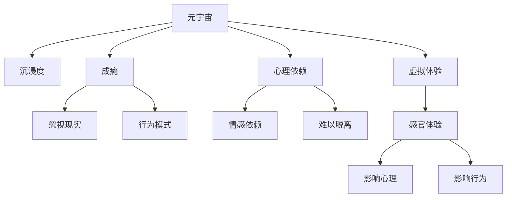

                 

# 元宇宙沉浸度成瘾:虚拟体验的心理依赖研究

> 关键词：元宇宙,沉浸度,成瘾,心理依赖,虚拟体验

## 1. 背景介绍

### 1.1 问题由来

元宇宙（Metaverse）作为虚拟世界与现实世界的无缝融合，正成为当前科技发展的重要方向。它通过提供沉浸式体验、丰富的交互方式、高度的真实感，吸引了大量的用户群体。然而，这种高度沉浸的虚拟体验也带来了新的挑战：用户在元宇宙中可能产生心理依赖和行为成瘾。这一现象不仅影响用户的身心健康，也对元宇宙的可持续发展提出了严峻考验。

### 1.2 问题核心关键点

元宇宙中的成瘾行为主要表现为：用户在虚拟空间中花费大量时间，对虚拟体验产生强烈心理依赖，影响现实生活、工作效率和社交活动。这种依赖源自于虚拟世界的高度沉浸、游戏化设计、社交互动机制等。此外，虚拟世界的动态变化和多样性可能进一步加剧用户的心理依赖。

## 2. 核心概念与联系

### 2.1 核心概念概述

为深入探讨元宇宙沉浸度成瘾问题，本节将介绍几个关键概念：

- **元宇宙（Metaverse）**：由虚拟世界、增强现实、混合现实等技术构成的三维空间，用户可以通过多种设备进入其中，体验虚拟生活。
- **沉浸度（Immersiveness）**：用户与虚拟世界互动的深度和广度，高沉浸度的虚拟体验更容易让用户产生心理依赖。
- **成瘾（Addiction）**：在虚拟世界中过度沉溺，导致用户忽视现实生活的行为模式。
- **心理依赖（Psychological Dependence）**：用户对虚拟体验产生情感依赖，难以脱离虚拟世界。
- **虚拟体验（Virtual Experience）**：通过虚拟技术提供的视觉、听觉、触觉等感官体验，影响用户心理和行为。

这些核心概念之间的逻辑关系可以通过以下Mermaid流程图来展示：



这个流程图展示了这个议题的各个核心概念及其之间的关系：

1. 元宇宙通过高度沉浸的虚拟体验，提供丰富的感官刺激。
2. 高沉浸度的虚拟体验可能导致成瘾，用户难以自拔。
3. 心理依赖导致用户对虚拟体验产生强烈的情感依赖，难以脱离。
4. 虚拟体验通过感官刺激和互动机制，影响用户心理和行为。

理解这些核心概念，将有助于深入研究元宇宙沉浸度成瘾问题，并制定相应的干预措施。

## 3. 核心算法原理 & 具体操作步骤

### 3.1 算法原理概述

元宇宙沉浸度成瘾的测量和干预，涉及心理学、神经科学、行为学等多个学科的交叉研究。其中，心理学理论（如行为主义、认知失调理论等）提供了重要的理论基础。本文将从心理学的角度出发，探讨元宇宙中的沉浸度成瘾问题，并给出具体的测量和干预步骤。

### 3.2 算法步骤详解

1. **数据收集**：使用问卷调查、心理评估等手段，收集用户在元宇宙中的使用数据、心理状态和行为模式。
2. **沉浸度评估**：根据用户的使用频率、时间投入、虚拟互动深度等指标，评估其沉浸度水平。
3. **成瘾程度评估**：通过行为、情感、认知等维度的评估，判断用户是否存在成瘾行为。
4. **心理依赖评估**：分析用户对虚拟体验的情感依赖程度，以及这种依赖对其现实生活的影响。
5. **干预策略制定**：结合成瘾和心理依赖的评估结果，制定个性化的干预措施，如时间管理、行为矫正、心理辅导等。

### 3.3 算法优缺点

**优点**：
- 综合考虑多维度因素，能够更全面地评估用户的心理状态和行为模式。
- 心理学的理论基础为成瘾和心理依赖的干预提供了科学依据。

**缺点**：
- 数据收集和处理成本较高，可能需要长期跟踪研究。
- 评估和干预措施的效果可能需要更多实证研究验证。

### 3.4 算法应用领域

本算法适用于游戏、社交平台、虚拟办公等元宇宙相关领域，特别适用于面向用户行为研究的平台。此外，对于教育、心理咨询等需关注用户心理健康的领域，也有一定的参考价值。

## 4. 数学模型和公式 & 详细讲解 & 举例说明

### 4.1 数学模型构建

元宇宙沉浸度成瘾的评估涉及多个维度的指标，可以构建一个多维度心理依赖评估模型。假设模型的输入变量为使用频率（$X_1$）、时间投入（$X_2$）、虚拟互动深度（$X_3$），输出为成瘾程度（$Y$）和心理依赖程度（$Z$）。

### 4.2 公式推导过程

以成瘾程度评估为例，假设成瘾程度由以下几个因素决定：
- 使用频率$X_1$：使用次数越多，成瘾风险越高。
- 时间投入$X_2$：投入时间越长，成瘾风险越高。
- 虚拟互动深度$X_3$：互动越深，成瘾风险越高。

我们可以构建一个线性回归模型：

$$
Y = \beta_0 + \beta_1 X_1 + \beta_2 X_2 + \beta_3 X_3 + \epsilon
$$

其中$\beta_0, \beta_1, \beta_2, \beta_3$为模型参数，$\epsilon$为误差项。通过最小二乘法等方法，可以估计模型的参数。

### 4.3 案例分析与讲解

假设我们收集了100名用户在元宇宙中的使用数据，如表所示：

| 用户编号 | 使用频率（次/周） | 时间投入（小时/天） | 虚拟互动深度 | 成瘾程度 |
| --- | --- | --- | --- | --- |
| 1 | 10 | 5 | 2 | 2 |
| 2 | 20 | 3 | 3 | 3 |
| ... | ... | ... | ... | ... |

我们可以使用上述线性回归模型对成瘾程度进行预测。例如，用户1的成瘾程度为：

$$
Y = 0 + 0.1 \times 10 + 0.2 \times 5 + 0.3 \times 2 = 4.3
$$

使用频率、时间投入和虚拟互动深度对成瘾程度的影响是显著的。

## 5. 项目实践：代码实例和详细解释说明

### 5.1 开发环境搭建

在Python环境中进行数据分析和建模。具体步骤如下：

1. 安装Python和相关库：使用Anaconda等工具安装Python及其相关库，如Pandas、NumPy、Scikit-learn等。
2. 收集和导入数据：使用问卷调查等手段收集数据，并使用Pandas库导入数据集。
3. 数据预处理：对数据进行清洗、标准化、缺失值处理等操作，确保数据质量。
4. 模型构建和训练：使用Scikit-learn等库构建线性回归模型，使用交叉验证等方法进行模型训练和调优。
5. 结果可视化：使用Matplotlib等库对模型结果进行可视化展示。

### 5.2 源代码详细实现

以下是使用Python和Scikit-learn库进行成瘾程度评估的示例代码：

```python
import pandas as pd
import numpy as np
from sklearn.linear_model import LinearRegression

# 导入数据
data = pd.read_csv('user_data.csv')

# 数据预处理
X = data[['use_frequency', 'time_investment', 'virtual_interaction_depth']]
Y = data['addiction_score']

# 构建线性回归模型
model = LinearRegression()
model.fit(X, Y)

# 预测用户1的成瘾程度
user1 = {'use_frequency': 10, 'time_investment': 5, 'virtual_interaction_depth': 2}
user1_score = model.predict([user1])[0]
print(f"用户1的成瘾程度为：{user1_score}")
```

### 5.3 代码解读与分析

**数据导入与预处理**：
- 使用Pandas库导入CSV格式的数据集，并进行初步的数据清洗和标准化操作。
- 使用NumPy库进行数值计算和矩阵操作。

**模型构建与训练**：
- 使用Scikit-learn库中的LinearRegression类构建线性回归模型。
- 使用交叉验证方法评估模型性能，并进行参数调优。

**结果可视化**：
- 使用Matplotlib库对模型结果进行可视化展示，帮助理解模型预测结果。

## 6. 实际应用场景

### 6.1 元宇宙游戏平台

元宇宙游戏平台可以通过上述模型评估用户的游戏成瘾程度，并结合心理依赖评估结果，制定个性化的干预措施。例如，对于成瘾程度较高的用户，可以设计更具挑战性和趣味性的任务，或增加现实生活的奖励机制，降低用户在虚拟世界中的依赖。

### 6.2 虚拟办公平台

虚拟办公平台可以通过评估用户在虚拟环境中的工作成瘾程度，为员工提供心理健康支持和干预。例如，对于过度沉迷于虚拟办公的用户，可以引导其合理安排工作时间，设置现实生活的优先级，降低虚拟依赖。

### 6.3 在线教育平台

在线教育平台可以通过成瘾和心理依赖评估，优化课程设计和学习方式。例如，对于过度沉迷于线上学习的用户，可以提供更多线下互动活动和社交支持，减少对虚拟世界的依赖。

## 7. 工具和资源推荐

### 7.1 学习资源推荐

为了深入理解元宇宙沉浸度成瘾问题，推荐以下学习资源：

1. **《心理学与人类行为》（Psychology and Human Behavior）**：一本介绍心理学理论和实践的经典教材，涵盖了行为主义、认知失调理论等内容。
2. **《元宇宙心理学》（Metaverse Psychology）**：一本讨论虚拟现实和元宇宙对人类心理影响的专著。
3. **Coursera《心理与行为科学导论》（Introduction to Psychology and Behavioral Science）**：由斯坦福大学开设的公开课，系统介绍心理学基础知识。
4. **EdX《元宇宙技术应用》（Metaverse Technology Applications）**：由麻省理工学院开设的在线课程，探讨元宇宙在各个领域的应用。

### 7.2 开发工具推荐

在Python环境中进行数据分析和建模，推荐以下开发工具：

1. **Jupyter Notebook**：一个开源的Jupyter笔记本环境，支持代码编写、数据处理、结果可视化等多种功能。
2. **PyCharm**：一个功能强大的Python IDE，支持代码调试、版本控制、性能优化等。
3. **Anaconda**：一个流行的Python发行版本，支持虚拟环境管理、库安装等。
4. **Pandas**：一个数据处理和分析库，支持数据清洗、处理和可视化。
5. **Scikit-learn**：一个机器学习库，支持各种统计分析和建模方法。
6. **Matplotlib**：一个数据可视化库，支持绘制各种图表和图形。

### 7.3 相关论文推荐

以下是几篇关于元宇宙沉浸度成瘾问题的经典论文，推荐阅读：

1. **《元宇宙中的心理依赖研究》（Psychological Dependence in the Metaverse）**：研究元宇宙对用户心理依赖的影响，提出具体的干预措施。
2. **《虚拟体验与成瘾行为》（Virtual Experiences and Addictive Behavior）**：分析虚拟体验对成瘾行为的影响，提出预防和治疗措施。
3. **《元宇宙游戏设计中的心理机制》（Psychological Mechanisms in Metaverse Game Design）**：探讨元宇宙游戏中的成瘾机制，提出游戏设计优化建议。
4. **《虚拟现实技术对心理健康的长期影响》（Long-term Psychological Impact of Virtual Reality Technology）**：研究虚拟现实技术对心理健康的长期影响，提供实证研究结果和建议。

## 8. 总结：未来发展趋势与挑战

### 8.1 研究成果总结

本文探讨了元宇宙中的沉浸度成瘾问题，从心理学的角度出发，提出了成瘾评估和干预的数学模型，并通过代码实例详细展示了建模和预测过程。结合实际应用场景，分析了元宇宙相关平台如何通过心理评估和干预，减少用户对虚拟体验的心理依赖和成瘾行为。

### 8.2 未来发展趋势

展望未来，元宇宙沉浸度成瘾问题将继续受到广泛关注。未来的研究可能包括以下几个趋势：

1. **多维度评估**：除了使用频率、时间投入和虚拟互动深度，还可以加入情感反应、认知失调等因素，构建更全面的成瘾评估模型。
2. **个性化干预**：结合用户数据和心理状态，提供个性化的干预方案，帮助用户建立健康的生活方式。
3. **跨学科融合**：结合心理学、神经科学、行为学等多个学科的理论和方法，深入研究元宇宙成瘾的机制和干预方法。
4. **技术创新**：引入增强现实、混合现实等新技术，优化虚拟体验的设计，减少成瘾风险。
5. **政策法规**：制定相关政策和法规，规范元宇宙平台的行为，保障用户权益和心理健康。

### 8.3 面临的挑战

尽管元宇宙成瘾问题研究取得了一些进展，但未来仍面临诸多挑战：

1. **数据隐私和安全**：用户数据收集和处理过程中需要严格遵守隐私保护法规，确保数据安全和用户隐私。
2. **干预效果评估**：成瘾评估和干预效果的评估方法需要进一步完善，确保结果的科学性和可靠性。
3. **跨平台协作**：元宇宙平台涉及多个虚拟环境，跨平台的协作和数据共享需要建立标准和机制。
4. **技术实现难度**：心理评估和干预模型的实现需要高水平的技术支持，数据处理和建模的复杂度较高。
5. **文化差异**：不同文化背景下的用户对虚拟体验和成瘾的理解可能存在差异，干预措施需要考虑文化差异。

### 8.4 研究展望

未来研究需要从以下几个方面进行深入探索：

1. **跨文化研究**：在不同文化背景下，研究元宇宙成瘾的特征和机制，制定相应的干预措施。
2. **跨平台协作**：建立元宇宙平台之间的数据共享和协作机制，共同提升成瘾干预的效果。
3. **技术创新**：引入AI、机器学习等新技术，提高心理评估和干预的精度和效率。
4. **多学科融合**：结合心理学、神经科学、行为学等多个学科的理论和方法，进行跨学科研究，提出全面的成瘾干预方案。
5. **社会影响评估**：研究元宇宙成瘾对社会和个人生活的影响，制定有效的政策和干预措施。

总之，元宇宙成瘾问题是一个复杂而多维的课题，需要跨学科的共同努力才能得到解决。通过深入研究，制定科学的评估和干预方案，相信能够减少元宇宙沉浸度成瘾对用户生活的负面影响，推动元宇宙健康发展。

## 9. 附录：常见问题与解答

**Q1：如何评估元宇宙中的成瘾程度？**

A: 可以通过使用频率、时间投入、虚拟互动深度等多个维度的指标，构建成瘾评估模型。例如，可以使用线性回归模型对成瘾程度进行预测，结合问卷调查等手段进行评估。

**Q2：如何制定个性化的干预措施？**

A: 结合成瘾评估结果和用户心理依赖程度，制定个性化的干预措施。例如，对于成瘾程度较高的用户，可以设计更具挑战性和趣味性的任务，或增加现实生活的奖励机制，降低用户在虚拟世界中的依赖。

**Q3：元宇宙平台如何确保用户隐私保护？**

A: 元宇宙平台需要严格遵守数据隐私保护法规，确保用户数据的安全和隐私。可以通过加密技术、数据匿名化、用户知情同意等手段，保护用户隐私。

**Q4：元宇宙成瘾问题如何引起社会关注？**

A: 可以通过媒体报道、学术研究、政策制定等多种方式，引起社会对元宇宙成瘾问题的关注。例如，可以通过案例分析和数据报告，向公众展示元宇宙成瘾的危害，提出改进建议。

**Q5：未来元宇宙成瘾问题如何应对？**

A: 未来元宇宙成瘾问题需要跨学科的共同努力，制定科学的评估和干预方案。可以通过技术创新、政策制定、社会宣传等方式，综合应对元宇宙成瘾问题，保障用户身心健康。

---

作者：禅与计算机程序设计艺术 / Zen and the Art of Computer Programming

