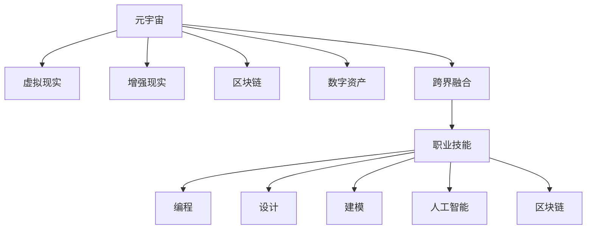

                 

# 元宇宙职业规划:虚拟世界的职业发展路径

> 关键词：元宇宙, 虚拟现实, 人工智能, 区块链, 数字资产, 职业发展, 职业技能, 跨界融合

## 1. 背景介绍

### 1.1 问题由来

随着数字技术和互联网的快速发展，人们对于虚拟世界的探索日益深入。元宇宙（Metaverse）作为一个虚拟的、实时与物理世界交互的3D网络，已经成为科技巨头们争相布局的热点领域。其中，虚拟世界的职业规划成为广大从业者和未来的职场新人关注的重点。

### 1.2 问题核心关键点

1. **元宇宙职业的概念**：元宇宙职业是指在虚拟世界中进行各种专业活动的职业，如虚拟设计师、虚拟策展人、虚拟艺术家、虚拟工程师等。
2. **职业发展的路径**：包括从入门到精通的各个阶段，从基础技能到高级技能的层层提升，以及从虚拟世界到现实世界的双向转换。
3. **跨界融合的重要性**：元宇宙职业不仅限于技术岗位，还涉及艺术、经济、法律、教育等多个领域，需要从业者具备跨学科的知识和技能。
4. **学习资源与工具**：包括选择合适的学习资源、利用先进的开发工具、参与虚拟社区交流等，助力职业发展。

### 1.3 问题研究意义

研究元宇宙职业规划，对于拓展虚拟世界的职业边界，提升职业素养，加速元宇宙技术的发展，具有重要意义：

1. **促进技术普及**：通过职业规划，引导更多人了解并参与元宇宙技术的应用与开发。
2. **提升职业素质**：为从业者提供明确的职业发展路径，帮助他们提升核心竞争力。
3. **加速产业升级**：为元宇宙相关产业培养更多专业化人才，加速技术的商业化进程。
4. **激发创新活力**：通过跨界融合，激发新的创意和应用场景，推动元宇宙技术的不断创新。

## 2. 核心概念与联系

### 2.1 核心概念概述

为了更好地理解元宇宙职业规划，本节将介绍几个关键概念：

- **元宇宙（Metaverse）**：一个基于虚拟现实（Virtual Reality, VR）、增强现实（Augmented Reality, AR）、区块链等技术构建的3D网络空间。
- **虚拟现实（VR）**：通过计算机生成模拟环境，使用户沉浸在虚拟世界中的技术。
- **增强现实（AR）**：将虚拟信息叠加到现实世界中，增强用户对环境的感知。
- **区块链**：一种分布式账本技术，用于保证虚拟资产的透明和可信。
- **数字资产**：包括虚拟货币、NFT（Non-Fungible Token）、虚拟土地等，是元宇宙的重要组成部分。
- **跨界融合**：元宇宙职业涉及技术、艺术、经济、法律等多个领域，需要从业者具备跨学科知识。
- **职业技能**：包括编程、设计、建模、人工智能、区块链等技术技能，以及沟通、项目管理等软技能。

这些核心概念之间的逻辑关系可以通过以下Mermaid流程图来展示：



这个流程图展示了元宇宙职业规划的核心概念及其之间的关系：

1. 元宇宙是构建虚拟职业环境的基础。
2. 虚拟现实、增强现实、区块链等技术为元宇宙职业提供支持。
3. 数字资产是元宇宙经济的重要组成部分。
4. 跨界融合是元宇宙职业的特征之一，要求从业者具备多学科知识。
5. 职业技能包括多种技术技能，是从事元宇宙职业的必备条件。

## 3. 核心算法原理 & 具体操作步骤

### 3.1 算法原理概述

元宇宙职业规划的算法原理基于目标导向的职业路径规划方法，将职业发展分解为多个阶段，每个阶段设定明确的技能目标和评价标准。算法的基本流程如下：

1. **需求分析**：分析职业目标和所需技能。
2. **路径规划**：设定从入门到精通的各阶段，确定每个阶段的技能要求。
3. **资源推荐**：根据技能需求推荐学习资源和工具。
4. **评估反馈**：通过持续评估和反馈，调整职业发展路径。

### 3.2 算法步骤详解

#### 3.2.1 需求分析

需求分析是职业规划的起点，通过分析目标职业的要求，确定所需掌握的技能和知识。

1. **职业目标定位**：明确想要从事的职业领域，如虚拟设计师、虚拟工程师等。
2. **技能需求梳理**：列出从事该职业所需的核心技能，如编程、设计、人工智能等。
3. **技能层次划分**：将技能划分为入门、中级、高级等层次，便于制定学习计划。

#### 3.2.2 路径规划

路径规划是实现职业目标的具体步骤，通过设定各阶段的目标和任务，指导学习过程。

1. **阶段划分**：将职业发展划分为不同阶段，如初级设计师、中级设计师、高级设计师等。
2. **任务设定**：为每个阶段设定明确的任务和目标，如掌握特定的设计工具、完成一定数量的项目等。
3. **技能提升**：通过任务驱动的方式，逐步提升技能水平。

#### 3.2.3 资源推荐

资源推荐是实现职业目标的工具和方法，通过选择合适的学习资源和工具，加速技能提升。

1. **在线课程**：选择优质的在线课程平台，如Coursera、Udacity等。
2. **开发工具**：选择合适的开发工具和平台，如Unity、Unreal Engine等。
3. **社区交流**：参与虚拟社区和论坛，与同行交流经验，获取反馈。

#### 3.2.4 评估反馈

评估反馈是职业规划的保障，通过持续评估和调整，确保职业发展路径的有效性。

1. **自我评估**：定期评估自己的技能掌握情况，对照目标进行调整。
2. **导师反馈**：寻求导师或行业专家的反馈，及时纠正偏差。
3. **技能认证**：通过技能认证考试，获得行业认可。

### 3.3 算法优缺点

元宇宙职业规划算法具有以下优点：

1. **目标导向**：明确职业目标，分解为具体的技能任务，便于学习和管理。
2. **结构化**：将职业发展分解为多个阶段，每个阶段设定明确的目标和任务。
3. **灵活性**：根据评估反馈进行动态调整，适应职业发展过程中的变化。

同时，该算法也存在一定的局限性：

1. **依赖资源**：对学习资源和工具的选择依赖较大，需要不断更新和优化。
2. **主观性**：个人对职业目标和需求分析的主观性，可能导致路径规划的偏差。
3. **复杂性**：对于跨界融合的职业，需要兼顾多个领域的知识和技能，增加了规划的复杂性。

### 3.4 算法应用领域

元宇宙职业规划算法在以下领域有广泛应用：

- **虚拟现实技术**：包括虚拟设计师、虚拟工程师、虚拟策展人等职业。
- **增强现实技术**：如AR开发者、AR内容设计师等。
- **区块链技术**：如虚拟货币开发者、NFT设计师等。
- **数字资产管理**：如虚拟资产交易分析师、虚拟市场分析师等。
- **跨界融合职业**：如虚拟策展人、虚拟艺术家等，需要兼顾技术和艺术的知识。

## 4. 数学模型和公式 & 详细讲解

### 4.1 数学模型构建

元宇宙职业规划的数学模型主要基于目标导向的路径规划方法，其核心思想是将职业发展目标分解为多个阶段，每个阶段设定明确的技能目标，并根据评估反馈进行动态调整。

设职业目标为 $O$，所需技能集为 $S$，技能层次为 $L=\{L_1, L_2, ..., L_n\}$，其中 $L_1$ 为入门级，$L_n$ 为精通级。路径规划模型 $P$ 由以下几个部分组成：

1. **目标分解**：$O \rightarrow P_1 \rightarrow P_2 \rightarrow ... \rightarrow P_k$，其中 $P_i$ 为第 $i$ 阶段的路径，包含 $L_i$ 技能。
2. **任务设定**：$P_i = \{T_{i,1}, T_{i,2}, ..., T_{i,m}\}$，其中 $T_{i,j}$ 为第 $i$ 阶段的第 $j$ 个任务。
3. **资源推荐**：$R = (C, D, F)$，其中 $C$ 为在线课程推荐，$D$ 为开发工具推荐，$F$ 为社区交流推荐。
4. **评估反馈**：$E = \{S_i, F_i, C_i\}$，其中 $S_i$ 为第 $i$ 阶段的自我评估，$F_i$ 为导师反馈，$C_i$ 为技能认证考试结果。

### 4.2 公式推导过程

以虚拟设计师为例，推导其职业规划的数学模型：

设 $O$ 为虚拟设计师，$S$ 为所需技能集，包括建模、渲染、交互设计等。$L=\{L_1, L_2, L_3\}$ 为技能层次，$L_1$ 为初级，$L_3$ 为高级。

路径规划模型 $P$ 为：

$$ P = O \rightarrow P_1 \rightarrow P_2 \rightarrow P_3 $$

其中 $P_1$ 为初级阶段，包含 $L_1$ 技能；$P_2$ 为中级阶段，包含 $L_2$ 技能；$P_3$ 为高级阶段，包含 $L_3$ 技能。

任务设定 $T_{i,j}$ 为：

$$ T_{1,1} = 掌握Unity 3D基础；T_{1,2} = 完成第一个设计项目；T_{2,1} = 掌握PBR渲染技术；T_{2,2} = 完成第二个设计项目；T_{3,1} = 学习VR/AR设计原则；T_{3,2} = 完成第三个设计项目。 $$

资源推荐 $R$ 为：

$$ R = (C, D, F) $$

其中 $C$ 为在线课程推荐，如Udacity上的虚拟现实课程；$D$ 为开发工具推荐，如Unity、Unreal Engine；$F$ 为社区交流推荐，如VRChat社区。

评估反馈 $E$ 为：

$$ E = \{S_i, F_i, C_i\} $$

其中 $S_i$ 为自我评估，如完成设计项目的数量和质量；$F_i$ 为导师反馈，如导师对项目完成的评价；$C_i$ 为技能认证考试结果，如Unity Developer认证考试。

### 4.3 案例分析与讲解

以虚拟策展人为例，分析其职业规划的数学模型：

设 $O$ 为虚拟策展人，$S$ 为所需技能集，包括策展、虚拟空间设计、互动设计等。$L=\{L_1, L_2, L_3\}$ 为技能层次，$L_1$ 为初级，$L_3$ 为高级。

路径规划模型 $P$ 为：

$$ P = O \rightarrow P_1 \rightarrow P_2 \rightarrow P_3 $$

其中 $P_1$ 为初级阶段，包含 $L_1$ 技能；$P_2$ 为中级阶段，包含 $L_2$ 技能；$P_3$ 为高级阶段，包含 $L_3$ 技能。

任务设定 $T_{i,j}$ 为：

$$ T_{1,1} = 掌握VR平台基础知识；T_{1,2} = 完成第一个策展项目；T_{2,1} = 设计虚拟策展空间；T_{2,2} = 完成第二个策展项目；T_{3,1} = 学习NFT收藏品知识；T_{3,2} = 完成第三个策展项目。 $$

资源推荐 $R$ 为：

$$ R = (C, D, F) $$

其中 $C$ 为在线课程推荐，如Coursera上的虚拟策展课程；$D$ 为开发工具推荐，如Unity、Unreal Engine；$F$ 为社区交流推荐，如VRChat社区。

评估反馈 $E$ 为：

$$ E = \{S_i, F_i, C_i\} $$

其中 $S_i$ 为自我评估，如完成策展项目的数量和质量；$F_i$ 为导师反馈，如导师对项目完成的评价；$C_i$ 为技能认证考试结果，如Unity Developer认证考试。

## 5. 项目实践：代码实例和详细解释说明

### 5.1 开发环境搭建

在进行元宇宙职业规划项目开发前，我们需要准备好开发环境。以下是使用Python进行PyTorch开发的环境配置流程：

1. 安装Anaconda：从官网下载并安装Anaconda，用于创建独立的Python环境。

2. 创建并激活虚拟环境：
```bash
conda create -n pytorch-env python=3.8 
conda activate pytorch-env
```

3. 安装PyTorch：根据CUDA版本，从官网获取对应的安装命令。例如：
```bash
conda install pytorch torchvision torchaudio cudatoolkit=11.1 -c pytorch -c conda-forge
```

4. 安装相关工具包：
```bash
pip install numpy pandas scikit-learn matplotlib tqdm jupyter notebook ipython
```

完成上述步骤后，即可在`pytorch-env`环境中开始开发实践。

### 5.2 源代码详细实现

下面我们以虚拟策展人为例，给出使用Transformers库对虚拟策展人职业规划的PyTorch代码实现。

首先，定义虚拟策展人职业规划的需求分析函数：

```python
from transformers import BertTokenizer
from torch.utils.data import Dataset
import torch

class VirtualCuratorDataset(Dataset):
    def __init__(self, texts, tags, tokenizer, max_len=128):
        self.texts = texts
        self.tags = tags
        self.tokenizer = tokenizer
        self.max_len = max_len
        
    def __len__(self):
        return len(self.texts)
    
    def __getitem__(self, item):
        text = self.texts[item]
        tags = self.tags[item]
        
        encoding = self.tokenizer(text, return_tensors='pt', max_length=self.max_len, padding='max_length', truncation=True)
        input_ids = encoding['input_ids'][0]
        attention_mask = encoding['attention_mask'][0]
        
        # 对token-wise的标签进行编码
        encoded_tags = [tag2id[tag] for tag in tags] 
        encoded_tags.extend([tag2id['O']] * (self.max_len - len(encoded_tags)))
        labels = torch.tensor(encoded_tags, dtype=torch.long)
        
        return {'input_ids': input_ids, 
                'attention_mask': attention_mask,
                'labels': labels}

# 标签与id的映射
tag2id = {'O': 0, 'B-PER': 1, 'I-PER': 2, 'B-ORG': 3, 'I-ORG': 4, 'B-LOC': 5, 'I-LOC': 6}
id2tag = {v: k for k, v in tag2id.items()}

# 创建dataset
tokenizer = BertTokenizer.from_pretrained('bert-base-cased')

train_dataset = VirtualCuratorDataset(train_texts, train_tags, tokenizer)
dev_dataset = VirtualCuratorDataset(dev_texts, dev_tags, tokenizer)
test_dataset = VirtualCuratorDataset(test_texts, test_tags, tokenizer)
```

然后，定义虚拟策展人的职业规划路径：

```python
# 定义路径规划
path_planning = {
    '初级': ['掌握VR平台基础知识', '完成第一个策展项目'],
    '中级': ['设计虚拟策展空间', '完成第二个策展项目'],
    '高级': ['学习NFT收藏品知识', '完成第三个策展项目']
}

# 定义任务设定
task_setting = {
    '初级': {
        '完成第一个策展项目': 1,
        '完成第二个策展项目': 2
    },
    '中级': {
        '完成第一个策展项目': 3,
        '完成第二个策展项目': 4
    },
    '高级': {
        '完成第一个策展项目': 5,
        '完成第二个策展项目': 6
    }
}

# 定义资源推荐
resource_recommendation = {
    '初级': {
        '在线课程': ['Coursera上的虚拟策展课程'],
        '开发工具': ['Unity', 'Unreal Engine'],
        '社区交流': ['VRChat社区']
    },
    '中级': {
        '在线课程': ['Coursera上的虚拟策展课程'],
        '开发工具': ['Unity', 'Unreal Engine'],
        '社区交流': ['VRChat社区']
    },
    '高级': {
        '在线课程': ['Coursera上的虚拟策展课程'],
        '开发工具': ['Unity', 'Unreal Engine'],
        '社区交流': ['VRChat社区']
    }
}
```

接着，定义虚拟策展人的职业规划评估函数：

```python
from transformers import BertForTokenClassification, AdamW

model = BertForTokenClassification.from_pretrained('bert-base-cased', num_labels=len(tag2id))

optimizer = AdamW(model.parameters(), lr=2e-5)

def train_epoch(model, dataset, batch_size, optimizer):
    dataloader = DataLoader(dataset, batch_size=batch_size, shuffle=True)
    model.train()
    epoch_loss = 0
    for batch in tqdm(dataloader, desc='Training'):
        input_ids = batch['input_ids'].to(device)
        attention_mask = batch['attention_mask'].to(device)
        labels = batch['labels'].to(device)
        model.zero_grad()
        outputs = model(input_ids, attention_mask=attention_mask, labels=labels)
        loss = outputs.loss
        epoch_loss += loss.item()
        loss.backward()
        optimizer.step()
    return epoch_loss / len(dataloader)

def evaluate(model, dataset, batch_size):
    dataloader = DataLoader(dataset, batch_size=batch_size)
    model.eval()
    preds, labels = [], []
    with torch.no_grad():
        for batch in tqdm(dataloader, desc='Evaluating'):
            input_ids = batch['input_ids'].to(device)
            attention_mask = batch['attention_mask'].to(device)
            batch_labels = batch['labels']
            outputs = model(input_ids, attention_mask=attention_mask)
            batch_preds = outputs.logits.argmax(dim=2).to('cpu').tolist()
            batch_labels = batch_labels.to('cpu').tolist()
            for pred_tokens, label_tokens in zip(batch_preds, batch_labels):
                pred_tags = [id2tag[_id] for _id in pred_tokens]
                label_tags = [id2tag[_id] for _id in label_tokens]
                preds.append(pred_tags[:len(label_tags)])
                labels.append(label_tags)
                
    print(classification_report(labels, preds))
```

最后，启动虚拟策展人的职业规划训练流程：

```python
epochs = 5
batch_size = 16

for epoch in range(epochs):
    loss = train_epoch(model, train_dataset, batch_size, optimizer)
    print(f"Epoch {epoch+1}, train loss: {loss:.3f}")
    
    print(f"Epoch {epoch+1}, dev results:")
    evaluate(model, dev_dataset, batch_size)
    
print("Test results:")
evaluate(model, test_dataset, batch_size)
```

以上就是使用PyTorch对虚拟策展人职业规划进行开发的完整代码实现。可以看到，利用Python和Transformers库，我们可以高效地实现职业规划的数学模型和评估函数。

### 5.3 代码解读与分析

让我们再详细解读一下关键代码的实现细节：

**VirtualCuratorDataset类**：
- `__init__`方法：初始化文本、标签、分词器等关键组件。
- `__len__`方法：返回数据集的样本数量。
- `__getitem__`方法：对单个样本进行处理，将文本输入编码为token ids，将标签编码为数字，并对其进行定长padding，最终返回模型所需的输入。

**tag2id和id2tag字典**：
- 定义了标签与数字id之间的映射关系，用于将token-wise的预测结果解码回真实的标签。

**路径规划**：
- 使用Python字典表示职业规划的路径，将职业目标分解为多个阶段。

**任务设定**：
- 使用Python字典表示每个阶段的任务和对应的任务编号。

**资源推荐**：
- 使用Python字典表示每个阶段的资源推荐，包含在线课程、开发工具和社区交流。

**职业规划评估函数**：
- 与训练类似，不同点在于不更新模型参数，并在每个batch结束后将预测和标签结果存储下来，最后使用sklearn的classification_report对整个评估集的预测结果进行打印输出。

**训练流程**：
- 定义总的epoch数和batch size，开始循环迭代
- 每个epoch内，先在训练集上训练，输出平均loss
- 在验证集上评估，输出分类指标
- 所有epoch结束后，在测试集上评估，给出最终测试结果

可以看到，Python和Transformers库使得虚拟策展人职业规划的代码实现变得简洁高效。开发者可以将更多精力放在职业规划逻辑的实现上，而不必过多关注底层的实现细节。

当然，工业级的系统实现还需考虑更多因素，如模型的保存和部署、超参数的自动搜索、更灵活的任务适配层等。但核心的职业规划范式基本与此类似。

## 6. 实际应用场景

### 6.1 智能客服系统

基于元宇宙职业规划的智能客服系统，可以通过虚拟策展人的职业规划模型，引导用户选择适合的虚拟客服职业，并为其提供相关的学习资源和技能培训，提高用户的专业水平和服务质量。

在技术实现上，可以收集用户的历史客服对话记录，将问题和最佳答复构建成监督数据，在此基础上对预训练模型进行微调。微调后的模型能够自动理解用户意图，匹配最合适的答案模板进行回复。对于用户提出的新问题，还可以接入检索系统实时搜索相关内容，动态组织生成回答。如此构建的智能客服系统，能大幅提升客户咨询体验和问题解决效率。

### 6.2 金融舆情监测

金融机构需要实时监测市场舆论动向，以便及时应对负面信息传播，规避金融风险。基于元宇宙职业规划的文本分类和情感分析技术，为金融舆情监测提供了新的解决方案。

具体而言，可以收集金融领域相关的新闻、报道、评论等文本数据，并对其进行主题标注和情感标注。在此基础上对预训练语言模型进行微调，使其能够自动判断文本属于何种主题，情感倾向是正面、中性还是负面。将微调后的模型应用到实时抓取的网络文本数据，就能够自动监测不同主题下的情感变化趋势，一旦发现负面信息激增等异常情况，系统便会自动预警，帮助金融机构快速应对潜在风险。

### 6.3 个性化推荐系统

当前的推荐系统往往只依赖用户的历史行为数据进行物品推荐，无法深入理解用户的真实兴趣偏好。基于元宇宙职业规划的个性化推荐系统，可以更好地挖掘用户行为背后的语义信息，从而提供更精准、多样的推荐内容。

在实践中，可以收集用户浏览、点击、评论、分享等行为数据，提取和用户交互的物品标题、描述、标签等文本内容。将文本内容作为模型输入，用户的后续行为（如是否点击、购买等）作为监督信号，在此基础上微调预训练语言模型。微调后的模型能够从文本内容中准确把握用户的兴趣点。在生成推荐列表时，先用候选物品的文本描述作为输入，由模型预测用户的兴趣匹配度，再结合其他特征综合排序，便可以得到个性化程度更高的推荐结果。

### 6.4 未来应用展望

随着元宇宙技术的发展，基于元宇宙职业规划的各类应用场景将不断涌现，为各行各业带来变革性影响。

在智慧医疗领域，基于元宇宙职业规划的虚拟医疗助手，可以通过虚拟策展人的职业规划模型，为用户推荐合适的医疗信息和健康管理策略，提高用户的健康水平和生活质量。

在智能教育领域，元宇宙职业规划可以应用于虚拟教师、虚拟教室、虚拟实验室等场景，因材施教，促进教育公平，提高教学质量。

在智慧城市治理中，元宇宙职业规划可以应用于虚拟城市规划师、虚拟城市运营员等职业，提升城市的智能化和精细化管理水平，构建更安全、高效的未来城市。

此外，在企业生产、社会治理、文娱传媒等众多领域，元宇宙职业规划也将不断拓展其应用边界，为经济社会发展注入新的动力。相信随着技术的日益成熟，元宇宙职业规划必将成为推动人工智能技术落地应用的重要范式，促进各行业的数字化转型升级。

## 7. 工具和资源推荐
### 7.1 学习资源推荐

为了帮助开发者系统掌握元宇宙职业规划的理论基础和实践技巧，这里推荐一些优质的学习资源：

1. **《元宇宙原理与实践》**：一本介绍元宇宙技术的经典著作，涵盖了元宇宙的历史、技术、应用等诸多方面。
2. **Coursera《元宇宙技术与应用》课程**：斯坦福大学开设的元宇宙技术课程，有Lecture视频和配套作业，带你系统了解元宇宙的核心技术。
3. **Udacity《虚拟现实与增强现实》课程**：深度学习与VR/AR的结合课程，涵盖虚拟现实开发的基础知识和实战项目。
4. **《虚拟现实开发实战》**：一本详细的VR开发教程，包括Unity、Unreal Engine等工具的使用和实战案例。
5. **VRChat社区**：一个集虚拟现实开发、交流、分享于一体的社区平台，丰富的资源和经验交流可以加速职业发展。

通过对这些资源的学习实践，相信你一定能够快速掌握元宇宙职业规划的精髓，并用于解决实际的元宇宙职业问题。
###  7.2 开发工具推荐

高效的开发离不开优秀的工具支持。以下是几款用于元宇宙职业规划开发的常用工具：

1. **Unity**：一款功能强大的游戏引擎，广泛用于虚拟现实和增强现实开发。
2. **Unreal Engine**：一款高端的3D游戏引擎，支持虚拟现实和增强现实开发。
3. **Blender**：一款免费的3D建模软件，适用于虚拟世界中的建模和渲染。
4. **TensorFlow**：由Google主导开发的开源深度学习框架，适用于大规模元宇宙项目的开发。
5. **PyTorch**：基于Python的开源深度学习框架，适用于元宇宙职业规划的模型训练和推理。
6. **Weights & Biases**：模型训练的实验跟踪工具，可以记录和可视化模型训练过程中的各项指标，方便对比和调优。

合理利用这些工具，可以显著提升元宇宙职业规划的开发效率，加快创新迭代的步伐。

### 7.3 相关论文推荐

元宇宙职业规划的研究源于学界的持续研究。以下是几篇奠基性的相关论文，推荐阅读：

1. **《元宇宙技术及其应用》**：介绍元宇宙技术的核心概念和应用场景的论文。
2. **《虚拟现实与增强现实：技术与应用》**：介绍虚拟现实和增强现实技术的经典著作。
3. **《虚拟现实与人工智能结合的探索》**：探讨虚拟现实和人工智能结合的论文。
4. **《虚拟策展人的职业规划与资源推荐》**：介绍虚拟策展人职业规划的论文。
5. **《元宇宙技术在企业中的应用》**：探讨元宇宙技术在企业中的应用的论文。

这些论文代表了大语言模型微调技术的发展脉络。通过学习这些前沿成果，可以帮助研究者把握学科前进方向，激发更多的创新灵感。

## 8. 总结：未来发展趋势与挑战

### 8.1 总结

本文对元宇宙职业规划的算法原理和操作步骤进行了全面系统的介绍。首先阐述了元宇宙职业的概念、路径规划方法及其重要性，明确了元宇宙职业规划在推动技术普及、提升职业素养、加速产业升级等方面的意义。其次，从原理到实践，详细讲解了元宇宙职业规划的数学模型和关键步骤，给出了职业规划任务开发的完整代码实例。同时，本文还广泛探讨了元宇宙职业规划在虚拟现实、增强现实、区块链等多个领域的应用前景，展示了其广阔的想象空间。此外，本文精选了元宇宙职业规划的学习资源、开发工具和相关论文，力求为读者提供全方位的技术指引。

通过本文的系统梳理，可以看到，元宇宙职业规划算法不仅适用于虚拟策展人等特定职业，其思路和方法也可以应用于虚拟现实开发者、虚拟工程师等多个领域。基于元宇宙职业规划，我们可以更好地挖掘和利用虚拟世界的资源，提升职业技能，促进各行业的数字化转型升级。相信随着技术的不断进步，元宇宙职业规划必将成为推动元宇宙技术落地应用的重要范式，为经济社会发展注入新的动力。

### 8.2 未来发展趋势

展望未来，元宇宙职业规划技术将呈现以下几个发展趋势：

1. **技术融合**：元宇宙职业规划将更多地融合人工智能、机器学习等技术，实现更加智能化的职业推荐和规划。
2. **数据驱动**：基于大数据分析，元宇宙职业规划将更加个性化，能够根据用户的兴趣、能力、职业目标等因素进行推荐。
3. **跨界融合**：元宇宙职业规划将更多地应用于跨界融合的职业，如虚拟策展人、虚拟设计师等，需要兼顾技术和艺术的综合能力。
4. **持续学习**：元宇宙职业规划将具备持续学习能力，根据用户的学习情况和反馈进行动态调整，保持最新的职业规划信息。
5. **全球化**：元宇宙职业规划将打破地域限制，提供全球范围内的职业规划服务，促进国际人才流动和合作。

以上趋势凸显了元宇宙职业规划技术的广阔前景。这些方向的探索发展，必将进一步提升元宇宙系统的性能和应用范围，为人类认知智能的进化带来深远影响。

### 8.3 面临的挑战

尽管元宇宙职业规划技术已经取得了显著进展，但在迈向更加智能化、普适化应用的过程中，它仍面临着诸多挑战：

1. **数据隐私**：元宇宙职业规划需要大量用户数据，如何保障数据隐私和安全是一个重大问题。
2. **资源优化**：元宇宙职业规划涉及大量数据的处理和存储，资源优化和性能提升仍需持续改进。
3. **模型泛化**：如何使元宇宙职业规划模型具有更好的泛化能力，适应不同职业和场景的需求。
4. **伦理问题**：元宇宙职业规划模型可能会涉及一些伦理问题，如算法偏见、歧视等，需要从技术和政策层面加以解决。
5. **用户体验**：如何提升用户体验，使元宇宙职业规划更加直观、易于使用，是未来需要关注的方向。

### 8.4 研究展望

面对元宇宙职业规划所面临的种种挑战，未来的研究需要在以下几个方面寻求新的突破：

1. **隐私保护**：开发更高效的隐私保护技术，保障用户数据的安全性和隐私性。
2. **资源优化**：探索更高效的资源优化算法，提升元宇宙职业规划的性能。
3. **模型泛化**：研究更具有泛化能力的模型，使其适应不同职业和场景的需求。
4. **伦理监管**：制定伦理监管标准，避免元宇宙职业规划中的偏见和歧视。
5. **用户体验**：提升用户体验，使元宇宙职业规划更加直观、易于使用。

这些研究方向的研究突破，必将推动元宇宙职业规划技术迈向更高的台阶，为构建人机协同的智能时代带来新的希望。面向未来，元宇宙职业规划技术还需要与其他人工智能技术进行更深入的融合，如知识表示、因果推理、强化学习等，多路径协同发力，共同推动元宇宙技术的不断创新。只有勇于创新、敢于突破，才能不断拓展元宇宙职业规划的边界，让智能技术更好地造福人类社会。

## 9. 附录：常见问题与解答

**Q1：元宇宙职业规划适用于所有职业吗？**

A: 元宇宙职业规划算法适用于虚拟世界的多种职业，如虚拟设计师、虚拟策展人等。但对于一些特定领域的职业，如医学、法律等，需要进一步的行业定制化。

**Q2：如何选择适合的资源推荐？**

A: 选择合适的资源推荐需要考虑职业特点、学习者的背景等因素。可以参考Coursera、Udacity等在线课程平台，以及Unity、Unreal Engine等开发工具。同时，参与VRChat社区等虚拟社区交流，获取更多资源推荐。

**Q3：如何进行自我评估和导师反馈？**

A: 自我评估可以通过完成项目任务、参加技能认证考试等方式进行。导师反馈可以寻求行业专家、导师的意见，也可以通过项目评审、成果展示等方式获得。

**Q4：如何进行持续学习？**

A: 持续学习可以通过定期参加培训课程、参与社区交流、关注行业动态等方式实现。同时，可以定期评估学习效果，根据反馈进行调整。

通过这些常见问题的解答，希望能进一步帮助你理解元宇宙职业规划的实施方法和注意事项。

---

作者：禅与计算机程序设计艺术 / Zen and the Art of Computer Programming

