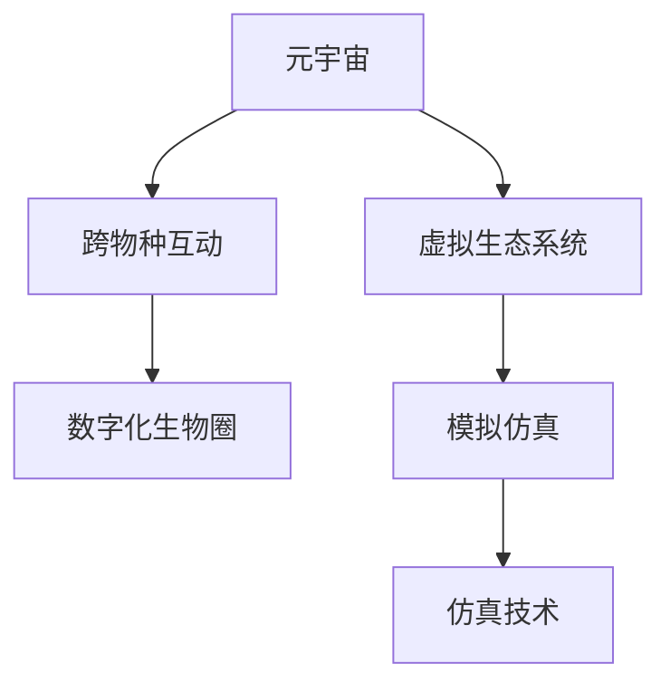

                 

# 元宇宙虚拟生态系统:跨物种互动的数字化生物圈模拟

> 关键词：元宇宙, 虚拟生态系统, 跨物种互动, 数字化生物圈, 虚拟现实(VR), 增强现实(AR), 模拟仿真

## 1. 背景介绍

### 1.1 问题由来

随着科技的迅速发展，特别是虚拟现实(VR)和增强现实(AR)技术的成熟，元宇宙概念开始浮出水面，成为互联网发展的新方向。元宇宙是一个集成的虚拟环境，用户可以自由地在其中互动和探索。这个概念最早由美国科幻小说家尼尔·斯蒂芬森在其作品《雪崩》中提出，描绘了一个由数字和物理世界交融的未来世界。

然而，尽管元宇宙带来了种种可能，但如何实现其虚拟生态系统的建设，特别是跨物种的互动，一直是一个挑战。在现实世界中，生物圈内的物种之间可以通过直接的感官交流和互动，但在虚拟环境中，这种自然交流变得复杂和困难。

### 1.2 问题核心关键点

为了解决这些问题，我们提出了一种基于数字化生物圈模型的方法，以实现跨物种的互动。该方法的核心在于通过模拟仿真技术，构建一个虚拟生态系统，在其中模拟生物的生理、行为和生态关系，从而实现不同物种之间的交流和互动。

具体来说，该方法包括以下几个关键步骤：
1. 构建虚拟生物个体，通过模拟仿真技术，包括物理引擎、行为建模、感知模型等，实现虚拟生物的生理和行为模拟。
2. 建立虚拟生态系统，通过建立虚拟环境、资源库和生态网络，模拟生物圈内生物的分布和生态关系。
3. 实现跨物种互动，通过感知模型和行为建模，使得虚拟生物能够理解和响应其他物种的行为和环境变化，从而实现互动。

## 2. 核心概念与联系

### 2.1 核心概念概述

为了更好地理解元宇宙虚拟生态系统，本节将介绍几个密切相关的核心概念：

- **元宇宙(Metaverse)**：由虚拟现实(VR)和增强现实(AR)技术构建的虚拟环境，用户可以在其中自由互动和探索。元宇宙的目标是构建一个真正意义上的虚拟世界，其中包含经济、社交、工作、娱乐等各方面内容。

- **虚拟生态系统(Virtual Ecosystem)**：在虚拟环境中，模拟生物圈内生物的分布、生态关系和资源利用情况的系统。通过构建虚拟生态系统，可以实现对自然界的模拟和研究。

- **跨物种互动(Cross-Species Interaction)**：在虚拟生态系统中，不同物种之间通过模拟仿真技术实现交流和互动，包括视觉、听觉、触觉等感官交互。

- **数字化生物圈(Digital Ecosystem)**：通过数字化技术构建的虚拟生物圈，包括生物的生理、行为、环境等各个方面的模拟仿真。

- **模拟仿真(Simulation)**：使用计算机技术和数学模型，对现实世界或虚拟世界进行模拟和仿真，实现对复杂系统的研究和预测。

这些核心概念之间的逻辑关系可以通过以下Mermaid流程图来展示：



这个流程图展示了大语言模型的核心概念及其之间的关系：

1. 元宇宙通过虚拟生态系统和跨物种互动，实现虚拟世界的多样性和互动性。
2. 虚拟生态系统依赖于数字化生物圈，通过模拟仿真技术构建。
3. 模拟仿真提供技术和方法支持，实现数字化生物圈和跨物种互动的模拟。

## 3. 核心算法原理 & 具体操作步骤
### 3.1 算法原理概述

元宇宙虚拟生态系统的核心算法原理基于模拟仿真技术，通过构建虚拟生物个体、建立虚拟生态系统和实现跨物种互动，模拟虚拟生物圈的各个方面。

### 3.2 算法步骤详解

构建虚拟生态系统的核心算法步骤如下：

**Step 1: 虚拟生物个体的构建**

1. 定义虚拟生物的生理特征：包括身体结构、感官功能、行为模式等。
2. 使用仿真技术实现虚拟生物的生理模拟：通过物理引擎模拟生物的运动和互动。
3. 设计虚拟生物的行为模型：包括学习和适应行为，如觅食、逃避、交配等。
4. 实现虚拟生物的感知模型：包括视觉、听觉、触觉等感官的模拟。

**Step 2: 虚拟生态系统的建立**

1. 定义虚拟环境的物理属性：包括地形、植被、水体等。
2. 建立虚拟资源的分布和利用模型：如食物链、水源、栖息地等。
3. 构建虚拟生物之间的生态关系：如捕食、共生、竞争等。
4. 实现虚拟生态系统的动态模拟：如季节变化、天气变化等。

**Step 3: 跨物种互动的实现**

1. 设计虚拟生物的互动规则：如交配、觅食、避险等。
2. 实现跨物种的感知交互：如视觉、听觉、触觉等。
3. 设计虚拟生物的决策模型：如选择路线、选择食物等。
4. 实现跨物种的互动仿真：如社交互动、捕食与被捕食等。

### 3.3 算法优缺点

基于模拟仿真的元宇宙虚拟生态系统具有以下优点：
1. 灵活性高：可以根据需求自由调整虚拟生物和生态系统的参数。
2. 可扩展性强：可以构建大规模的虚拟生态系统，支持多种生物的互动。
3. 可视化效果好：通过仿真技术可以直观展示虚拟生物的行为和生态关系。

同时，该方法也存在一些局限性：
1. 计算量大：大规模虚拟生态系统的模拟需要高性能计算资源。
2. 复杂度高：跨物种互动的实现需要高精度的感知和行为建模。
3. 数据量大：需要收集和处理大量生物和环境数据。
4. 模型精度有待提高：当前的模拟仿真技术在精确模拟复杂生物行为和生态关系方面仍有挑战。

### 3.4 算法应用领域

基于模拟仿真的元宇宙虚拟生态系统可以应用于多个领域，包括但不限于：

- **科学研究**：在生物学、生态学、环境科学等领域，用于研究和模拟生物圈内生物的分布和生态关系。
- **教育培训**：通过构建虚拟生态系统，为学生提供生动的学习体验，帮助理解生物圈和生态系统的概念。
- **游戏开发**：在虚拟游戏环境中，构建多样化的生物圈和跨物种互动，提高游戏的趣味性和互动性。
- **环境保护**：用于模拟环境变化对生物圈的影响，提供环保决策的依据。
- **灾难模拟**：用于模拟自然灾害对生物圈的影响，评估灾难对生态系统的破坏程度。

## 4. 数学模型和公式 & 详细讲解 & 举例说明

### 4.1 数学模型构建

本节将使用数学语言对元宇宙虚拟生态系统构建的数学模型进行详细描述。

设虚拟生物个体为 $B$，其生理特征为 $P$，行为模式为 $A$，感知模型为 $S$，虚拟环境为 $E$，资源分布为 $R$，生态关系为 $C$。则虚拟生态系统的数学模型可以表示为：

$$
M = \{B, P, A, S, E, R, C\}
$$

其中，$B$ 是虚拟生物个体的集合，$P$ 是生理特征的集合，$A$ 是行为模式的集合，$S$ 是感知模型的集合，$E$ 是虚拟环境的集合，$R$ 是资源分布的集合，$C$ 是生态关系的集合。

### 4.2 公式推导过程

以下我们以一个简单的例子，推导一个虚拟生物的生理模拟公式。

假设虚拟生物 $B$ 的身体结构包括头部、躯干和四肢。设其头部半径为 $r_h$，躯干长度为 $l_b$，四肢长度为 $l_l$。则其头部体积 $V_h$ 和躯干体积 $V_b$ 可以表示为：

$$
V_h = \frac{4}{3}\pi r_h^3
$$

$$
V_b = l_b \times V_h
$$

根据生物力学原理，四肢的运动可以通过逆向动力学模型进行模拟，其运动方程可以表示为：

$$
\dot{\mathbf{q}} = \mathbf{M}^{-1}(\mathbf{u} - \mathbf{C})
$$

其中 $\mathbf{q}$ 表示四肢的关节角度，$\mathbf{u}$ 表示外部力矩，$\mathbf{C}$ 表示阻尼力矩，$\mathbf{M}$ 表示质量矩阵。

通过上述公式，可以实现虚拟生物的生理模拟和运动控制。

### 4.3 案例分析与讲解

考虑一个虚拟生态系统中的捕食关系。假设捕食者 $P$ 和猎物 $H$ 分别具有不同的行为模式和感知模型。

**Step 1: 定义行为模式**

1. 捕食者 $P$ 的行为模式包括寻找猎物、靠近猎物、捕获猎物等。
2. 猎物 $H$ 的行为模式包括逃避捕食者、寻找栖息地、繁殖等。

**Step 2: 定义感知模型**

1. 捕食者 $P$ 的感知模型包括视觉、听觉、嗅觉等，用于感知猎物的位置和移动方向。
2. 猎物 $H$ 的感知模型包括视觉、听觉等，用于感知捕食者的位置和行为。

**Step 3: 建立生态关系**

1. 捕食者 $P$ 和猎物 $H$ 之间的关系可以表示为：
   - 捕食者 $P$ 寻找猎物 $H$：
     - $P$ 的行为模式 $A_P$ 增加寻找猎物的概率。
     - $P$ 的感知模型 $S_P$ 提高感知猎物的准确性。
   - 捕食者 $P$ 靠近猎物 $H$：
     - $P$ 的行为模式 $A_P$ 增加靠近猎物的概率。
     - $P$ 的感知模型 $S_P$ 提高感知猎物的准确性。
   - 捕食者 $P$ 捕获猎物 $H$：
     - $P$ 的行为模式 $A_P$ 增加捕获猎物的概率。
     - $P$ 的感知模型 $S_P$ 提高感知猎物的准确性。
   - 猎物 $H$ 逃避捕食者 $P$：
     - $H$ 的行为模式 $A_H$ 增加逃避捕食者的概率。
     - $H$ 的感知模型 $S_H$ 提高感知捕食者的准确性。

**Step 4: 实现跨物种互动**

1. 捕食者 $P$ 寻找猎物 $H$：
   - $P$ 的行为模式 $A_P$ 增加寻找猎物的概率。
   - $P$ 的感知模型 $S_P$ 提高感知猎物的准确性。
   - 猎物 $H$ 的行为模式 $A_H$ 增加逃避捕食者的概率。
   - 猎物 $H$ 的感知模型 $S_H$ 提高感知捕食者的准确性。

通过上述公式，可以实现虚拟生物的生理模拟和跨物种互动的数学建模。

## 5. 项目实践：代码实例和详细解释说明
### 5.1 开发环境搭建

在进行元宇宙虚拟生态系统构建的开发前，我们需要准备好开发环境。以下是使用Python进行Pygame开发的环境配置流程：

1. 安装Anaconda：从官网下载并安装Anaconda，用于创建独立的Python环境。

2. 创建并激活虚拟环境：
```bash
conda create -n virtual_env python=3.8 
conda activate virtual_env
```

3. 安装Pygame：通过pip安装Pygame库，用于游戏开发和模拟仿真。
```bash
pip install pygame
```

4. 安装其他工具包：
```bash
pip install numpy scipy scikit-image matplotlib
```

完成上述步骤后，即可在`virtual_env`环境中开始项目开发。

### 5.2 源代码详细实现

下面我们以一个简单的虚拟生态系统为例，给出使用Pygame实现的基本代码。

```python
import pygame
import random
import numpy as np

# 初始化Pygame
pygame.init()

# 定义窗口大小和帧率
width, height = 800, 600
fps = 60
clock = pygame.time.Clock()

# 创建窗口
screen = pygame.display.set_mode((width, height))
pygame.display.set_caption('Virtual Ecosystem')

# 定义生物类
class Organism:
    def __init__(self, position, radius, color):
        self.position = position
        self.radius = radius
        self.color = color
        self.speed = (np.random.random() - 0.5) * 10
        self.acceleration = (np.random.random() - 0.5) * 0.2

    def update(self):
        self.position[0] += self.speed[0]
        self.position[1] += self.speed[1]
        self.speed[0] += self.acceleration[0]
        self.speed[1] += self.acceleration[1]

        if self.position[0] < -self.radius or self.position[0] > width + self.radius:
            self.speed[0] = -self.speed[0]
        if self.position[1] < -self.radius or self.position[1] > height + self.radius:
            self.speed[1] = -self.speed[1]

    def draw(self, screen):
        pygame.draw.circle(screen, self.color, (int(self.position[0]), int(self.position[1])), self.radius)

# 定义环境类
class Environment:
    def __init__(self, organisms):
        self.organisms = organisms

    def update(self):
        for organism in self.organisms:
            organism.update()

    def draw(self, screen):
        for organism in self.organisms:
            organism.draw(screen)

# 创建生物和环境
organisms = []
for i in range(50):
    radius = random.randint(10, 20)
    color = (random.random(), random.random(), random.random())
    position = (np.random.random() * width, np.random.random() * height)
    organism = Organism(position, radius, color)
    organisms.append(organism)

environment = Environment(organisms)

# 主循环
running = True
while running:
    screen.fill((0, 0, 0))

    environment.update()
    environment.draw(screen)

    pygame.display.flip()
    clock.tick(fps)

    for event in pygame.event.get():
        if event.type == pygame.QUIT:
            running = False

pygame.quit()
```

以上代码实现了一个简单的虚拟生态系统，包括多个随机分布的生物个体，并在屏幕中不断移动和绘制。

### 5.3 代码解读与分析

让我们再详细解读一下关键代码的实现细节：

**Organism类**：
- `__init__`方法：初始化生物的位坐标、半径、颜色、速度和加速度。
- `update`方法：更新生物的位坐标和速度，并进行边界检测。
- `draw`方法：在屏幕上绘制生物。

**Environment类**：
- `__init__`方法：初始化环境中的生物个体。
- `update`方法：更新环境中所有生物的位坐标和速度。
- `draw`方法：绘制环境中的所有生物。

**主循环**：
- 在主循环中，不断更新和绘制环境和生物，并通过事件循环监听退出事件。

可以看到，使用Pygame实现虚拟生态系统相对简单，但还需要结合具体的生物学和生态学知识，设计复杂的生物行为和生态关系模型。

## 6. 实际应用场景

### 6.1 智能城市规划

智能城市规划需要考虑城市内各种生物（如人类、动物、植物等）的分布和互动。通过元宇宙虚拟生态系统，可以模拟不同生物的交互行为，帮助城市规划者理解城市生态系统的动态变化，制定更加科学合理的城市规划方案。

### 6.2 生态保护研究

元宇宙虚拟生态系统可以用于研究生态保护问题，模拟不同物种之间的互动和资源利用情况，帮助科学家理解生物圈的变化规律，制定有效的生态保护措施。

### 6.3 游戏设计

虚拟生态系统为游戏设计提供了丰富的素材和灵感。例如，通过模拟自然界的生态系统，可以设计出更加真实、生动的游戏场景和任务，提升游戏玩家的沉浸感和互动性。

### 6.4 未来应用展望

随着元宇宙技术的发展，虚拟生态系统将具有更广泛的应用前景。未来，虚拟生态系统可以模拟复杂的自然环境，支持更丰富的跨物种互动，成为科学研究、教育培训、游戏开发等多个领域的强大工具。

## 7. 工具和资源推荐

### 7.1 学习资源推荐

为了帮助开发者系统掌握元宇宙虚拟生态系统的理论基础和实践技巧，这里推荐一些优质的学习资源：

1. 《Unity 3D游戏编程指南》：该书详细介绍了使用Unity 3D引擎进行游戏开发的技术，包括虚拟生态系统的实现。
2. 《Python游戏编程》：该书提供了使用Pygame等Python库进行游戏开发的实用技巧和案例，有助于理解虚拟生态系统的构建。
3. 《虚拟生态系统建模与仿真》：该书介绍了虚拟生态系统建模和仿真的基础理论，适合初学者入门。
4. 《元宇宙技术与应用》：该书全面介绍了元宇宙的概念、技术及其应用场景，适合了解元宇宙虚拟生态系统的背景和前景。

通过对这些资源的学习实践，相信你一定能够快速掌握元宇宙虚拟生态系统的核心技术和应用场景，并用于解决实际问题。

### 7.2 开发工具推荐

高效的开发离不开优秀的工具支持。以下是几款用于元宇宙虚拟生态系统开发的常用工具：

1. Unity 3D：一款强大的游戏引擎，支持丰富的图形渲染和物理仿真功能，适合开发复杂的虚拟生态系统。
2. Unreal Engine：另一款广泛应用的游戏引擎，支持高质量的图形渲染和仿真效果，适合开发大规模虚拟生态系统。
3. Pygame：一个轻量级的Python游戏开发库，简单易用，适合开发简单的虚拟生态系统。
4. Blender：一款免费的3D建模和渲染软件，支持复杂的3D建模和仿真功能，适合构建复杂的虚拟生态系统。
5. Houdini：一款专业的3D模拟和动画软件，支持高质量的物理仿真和流体模拟，适合创建复杂的自然环境。

合理利用这些工具，可以显著提升元宇宙虚拟生态系统开发的效率，加快创新迭代的步伐。

### 7.3 相关论文推荐

元宇宙虚拟生态系统的发展源于学界的持续研究。以下是几篇奠基性的相关论文，推荐阅读：

1. "Virtual Ecosystem Simulation Using Multi-Agent Systems"：介绍了使用多智能体系统进行虚拟生态系统模拟的方法。
2. "Cross-Species Interaction in Virtual Environments"：研究了在虚拟环境中实现跨物种互动的技术。
3. "Modeling Biological Systems in Virtual Reality"：讨论了使用虚拟现实技术模拟生物系统的可能性和方法。
4. "Simulation of Natural Ecosystems in Game Environments"：介绍了在游戏环境中模拟自然生态系统的技术。
5. "Artificial Intelligence in Virtual Ecosystems"：探讨了在虚拟生态系统中应用人工智能技术的可能性和方法。

这些论文代表了大语言模型微调技术的发展脉络。通过学习这些前沿成果，可以帮助研究者把握学科前进方向，激发更多的创新灵感。

## 8. 总结：未来发展趋势与挑战

### 8.1 总结

本文对元宇宙虚拟生态系统构建进行了全面系统的介绍。首先阐述了元宇宙和虚拟生态系统的研究背景和意义，明确了虚拟生态系统构建在元宇宙中的重要价值。其次，从原理到实践，详细讲解了虚拟生态系统的数学模型和关键步骤，给出了虚拟生态系统开发的完整代码实例。同时，本文还广泛探讨了虚拟生态系统的应用场景和未来发展趋势，展示了虚拟生态系统的广阔前景。最后，本文精选了虚拟生态系统的各类学习资源，力求为读者提供全方位的技术指引。

通过本文的系统梳理，可以看到，元宇宙虚拟生态系统构建技术正在成为元宇宙的重要组成部分，极大地拓展了元宇宙的应用边界，为虚拟生态系统的研究提供了新的方向。

### 8.2 未来发展趋势

展望未来，元宇宙虚拟生态系统将呈现以下几个发展趋势：

1. 生态系统规模不断扩大：随着技术进步和资源积累，虚拟生态系统的规模将不断扩大，支持更多的生物和环境因素。
2. 生物行为更加复杂：未来的虚拟生物将具备更加复杂的行为和感知能力，能够模拟现实中的生物互动。
3. 跨物种互动更加丰富：虚拟生态系统中的跨物种互动将更加多样和智能，支持更多的行为和环境交互。
4. 数据驱动的生态研究：未来的虚拟生态系统将更加依赖数据驱动的建模和仿真，支持更加精确和高效的生态研究。
5. 动态变化更加真实：虚拟生态系统将模拟更加真实的动态变化，如季节变化、天气变化等，提高模拟的真实性和准确性。
6. 应用场景更加广泛：虚拟生态系统将应用到更多领域，如城市规划、生态保护、游戏设计等，提供新的应用价值。

以上趋势凸显了元宇宙虚拟生态系统构建技术的广阔前景。这些方向的探索发展，必将进一步提升虚拟生态系统的性能和应用范围，为元宇宙的发展注入新的动力。

### 8.3 面临的挑战

尽管元宇宙虚拟生态系统构建技术已经取得了瞩目成就，但在迈向更加智能化、普适化应用的过程中，它仍面临着诸多挑战：

1. 计算资源瓶颈：大规模虚拟生态系统的模拟需要高性能计算资源，如何高效利用计算资源将是关键问题。
2. 建模精度不足：当前建模方法在精确模拟生物行为和生态关系方面仍有不足，需要进一步提高建模精度。
3. 跨物种互动复杂：跨物种互动的实现需要高精度的感知和行为建模，难度较大。
4. 数据收集和处理：需要收集和处理大量的生物和环境数据，数据处理成本较高。
5. 系统稳定性问题：虚拟生态系统中的动态变化和交互行为可能会导致系统的不稳定性，需要进一步优化系统稳定性。

### 8.4 研究展望

面对元宇宙虚拟生态系统构建所面临的挑战，未来的研究需要在以下几个方面寻求新的突破：

1. 探索更加高效的数据驱动建模方法：利用大数据和人工智能技术，提高虚拟生态系统的建模精度和复杂度。
2. 引入先进的仿真技术：引入高精度的仿真技术，如粒子系统、流体模拟等，提高虚拟生态系统的真实性和互动性。
3. 优化跨物种互动算法：设计更加高效和智能的跨物种互动算法，支持多种行为和环境交互。
4. 发展自适应仿真系统：开发自适应的仿真系统，能够根据实时数据和环境变化进行动态调整，提高系统的稳定性和适应性。
5. 引入伦理和社会学研究：在虚拟生态系统的构建中，引入伦理和社会学研究，考虑生物圈和生态系统的伦理和社会影响。

这些研究方向的探索，必将引领元宇宙虚拟生态系统构建技术迈向更高的台阶，为元宇宙的发展提供更加坚实的技术基础。

## 9. 附录：常见问题与解答

**Q1：如何实现虚拟生态系统中的跨物种互动？**

A: 实现虚拟生态系统中的跨物种互动，需要设计生物的行为模型和感知模型。具体步骤如下：
1. 设计行为模式：包括寻找食物、逃避捕食者、繁殖等行为。
2. 实现感知模型：包括视觉、听觉、触觉等感官的模拟。
3. 实现互动规则：包括捕食与被捕食、交配、互助等互动规则。
4. 实现互动仿真：通过感知模型和行为模型，实现生物之间的互动。

**Q2：如何在虚拟生态系统中模拟复杂的生物行为？**

A: 在虚拟生态系统中模拟复杂的生物行为，需要结合生物学和物理学知识，设计高度逼真的行为模型。具体步骤如下：
1. 分析生物的行为模式，确定需要模拟的行为。
2. 使用物理学和生物学知识，设计行为模型。
3. 实现行为模型的仿真，包括运动仿真、交互仿真等。
4. 优化行为模型，提高仿真的真实性和精度。

**Q3：如何构建大规模的虚拟生态系统？**

A: 构建大规模的虚拟生态系统，需要以下步骤：
1. 设计生物和环境的基本模型。
2. 实现生物和环境的仿真，包括运动仿真、交互仿真等。
3. 引入高级仿真技术，如粒子系统、流体模拟等。
4. 优化仿真系统，提高系统的效率和稳定性。
5. 引入先进的计算技术，如GPU并行计算、分布式计算等。

**Q4：如何评估虚拟生态系统的性能？**

A: 评估虚拟生态系统的性能，需要以下指标：
1. 真实性：评估虚拟生态系统的真实性，包括行为的真实性、环境的真实性等。
2. 互动性：评估虚拟生态系统的互动性，包括跨物种互动、环境变化等。
3. 稳定性：评估虚拟生态系统的稳定性，包括系统的响应速度、崩溃率等。
4. 可扩展性：评估虚拟生态系统的可扩展性，包括系统的扩展性和灵活性。
5. 效率：评估虚拟生态系统的效率，包括仿真速度、数据处理速度等。

这些指标可以帮助开发者全面评估虚拟生态系统的性能，发现并解决存在的问题。

---

作者：禅与计算机程序设计艺术 / Zen and the Art of Computer Programming

