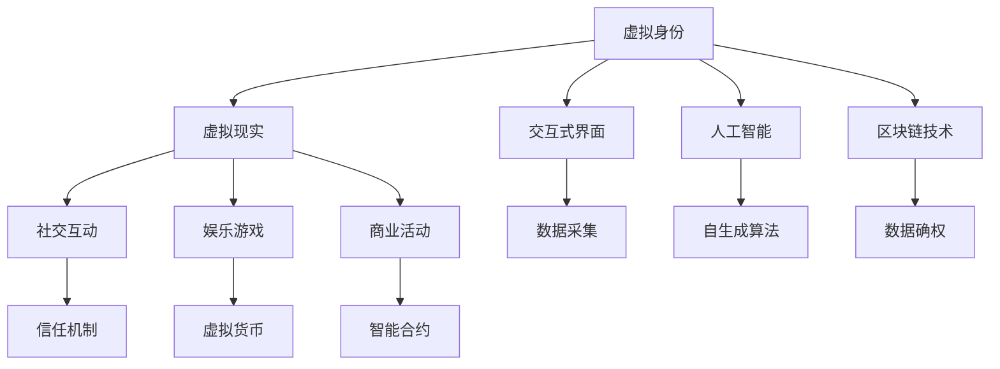

                 

# 元宇宙身份认同:虚拟与现实自我的融合

> 关键词：元宇宙,身份认同,虚拟现实,自生成算法,交互式界面,人工智能,区块链技术

## 1. 背景介绍

随着技术的进步，元宇宙(Metaverse)的概念正在逐步走入现实。它是一个基于虚拟现实(VR)、增强现实(AR)等技术的综合体，不仅提供沉浸式的用户体验，更是虚拟与现实融合的全新空间。在元宇宙中，人们可以拥有自己的虚拟身份，参与社交互动、娱乐游戏、商业活动等。然而，如何构建稳定的虚拟身份认同，让其与现实自我相融合，成为元宇宙发展的重要课题。本文将从核心概念、核心算法、实践案例等方面，探讨元宇宙身份认同的实现路径，并展望其未来应用前景。

## 2. 核心概念与联系

### 2.1 核心概念概述

元宇宙身份认同，是指用户在虚拟环境中建立的自我形象和身份信息，以及这些信息如何与现实自我融合的过程。这一过程涉及虚拟与现实世界的双向交互，包括但不限于虚拟形象构建、互动体验设计、用户关系管理等。其核心概念包括以下几个方面：

- **虚拟身份**：用户在元宇宙中创建的虚拟角色或化身，具备独特的外观、行为和能力。
- **现实自我**：用户在现实世界中的身份、经历、关系等信息，与虚拟身份形成互补。
- **虚拟现实**：通过VR/AR技术，用户可以在虚拟环境中进行沉浸式体验，感受真实的世界。
- **交互式界面**：用户与虚拟环境互动的界面，如键盘、手柄、手势识别等。
- **人工智能**：用于辅助生成虚拟身份、智能互动、数据分析等，提升用户体验。
- **区块链技术**：用于身份认证、数据确权、资产交易等，保障用户隐私和权益。

这些核心概念之间通过复杂的联系与互动，构建了元宇宙身份认同的生态系统。下图展示了这一生态系统的主要组成部分及其交互关系：



## 3. 核心算法原理 & 具体操作步骤

### 3.1 算法原理概述

元宇宙身份认同的构建过程，涉及多学科、多技术的融合应用。其核心算法原理包括以下几个方面：

1. **虚拟身份生成**：使用自生成算法，根据现实自我信息，自动生成虚拟身份。
2. **行为模式预测**：通过人工智能模型，预测用户在不同虚拟环境中的行为模式，提升互动体验。
3. **社交网络构建**：利用图论等算法，分析用户关系，构建虚拟社交网络。
4. **信任机制设计**：使用区块链技术，实现身份认证、数据确权等功能，保障用户权益。

### 3.2 算法步骤详解

元宇宙身份认同的构建过程，大致可以分为以下几步：

**Step 1: 数据采集与处理**
- 采集用户在现实世界中的个人信息，包括姓名、年龄、职业、兴趣等。
- 通过VR/AR设备，采集用户的生物特征，如面部表情、身体姿态等。
- 使用人工智能技术，对采集到的数据进行处理，提取特征。

**Step 2: 虚拟身份生成**
- 使用自生成算法，根据处理后的数据，自动生成虚拟身份。
- 生成过程中，可以考虑用户的个人喜好、现实自我特征等因素，个性化定制虚拟形象。

**Step 3: 行为模式预测**
- 根据虚拟身份的行为数据，训练人工智能模型，预测用户在不同虚拟环境中的行为模式。
- 模型可以是基于规则的系统，也可以是机器学习模型，如RNN、GAN等。

**Step 4: 社交网络构建**
- 分析用户的行为数据，使用图论等算法，构建虚拟社交网络。
- 考虑用户间的交互频率、情感关系等因素，合理设计网络结构。

**Step 5: 信任机制设计**
- 使用区块链技术，实现虚拟身份认证、数据确权等功能。
- 设计智能合约，保障用户权益，防止身份盗用、信息泄漏等问题。

**Step 6: 跨界交互设计**
- 设计跨虚拟与现实的交互界面，使用户能够自由切换。
- 界面设计要考虑用户的舒适度、便捷性、安全性等因素。

### 3.3 算法优缺点

元宇宙身份认同的构建过程，具有以下优点：

1. **个性化定制**：虚拟身份的生成过程，可以根据用户的现实自我信息进行个性化定制，提升用户体验。
2. **跨界融合**：虚拟身份与现实自我通过人工智能、区块链等技术，实现跨界融合，保障用户权益。
3. **高效便捷**：通过自生成算法和人工智能技术，可以大幅提高身份构建的效率，减少用户操作。

同时，也存在一些局限性：

1. **隐私保护**：用户的现实自我信息采集、处理和存储，可能会带来隐私泄露的风险。
2. **技术复杂**：涉及多学科、多技术的融合，实现难度较大。
3. **用户体验**：虚拟身份的构建和行为预测，需要高质量的数据和模型，否则可能影响用户体验。

### 3.4 算法应用领域

元宇宙身份认同的应用领域广泛，涵盖以下几个方面：

- **社交平台**：如Facebook Horizon、Decentraland等，构建虚拟社交网络，提升用户体验。
- **游戏领域**：如Roblox、Fortnite等，设计虚拟游戏场景，增强沉浸感。
- **商业活动**：如虚拟展会、虚拟会议等，提供沉浸式商业体验。
- **教育培训**：如虚拟教室、模拟实验等，提供多样化的教育培训方式。

## 4. 数学模型和公式 & 详细讲解 & 举例说明

### 4.1 数学模型构建

元宇宙身份认同的构建过程，涉及到多个数学模型。以下是几个核心模型的构建：

**虚拟身份生成模型**：使用自生成算法，将现实自我信息映射到虚拟身份。假设现实自我信息为 $x$，虚拟身份信息为 $y$，映射过程可以表示为：

$$ y = f(x; \theta) $$

其中 $f$ 为自生成算法，$\theta$ 为算法参数。

**行为模式预测模型**：使用机器学习模型，预测用户在不同虚拟环境中的行为模式。假设用户行为数据为 $z$，行为模式为 $w$，预测模型可以表示为：

$$ w = g(z; \alpha) $$

其中 $g$ 为预测模型，$\alpha$ 为模型参数。

**社交网络构建模型**：使用图论算法，构建虚拟社交网络。假设社交网络中的节点为 $n$，边为 $e$，网络结构为 $G$，构建过程可以表示为：

$$ G = h(n, e; \beta) $$

其中 $h$ 为图论算法，$\beta$ 为算法参数。

**信任机制设计模型**：使用区块链技术，实现身份认证和数据确权。假设身份认证结果为 $t$，数据确权结果为 $d$，设计模型可以表示为：

$$ t = m(x; \gamma) $$
$$ d = n(z; \delta) $$

其中 $m$ 为身份认证算法，$n$ 为数据确权算法，$\gamma$ 和 $\delta$ 为算法参数。

### 4.2 公式推导过程

**虚拟身份生成公式推导**：假设现实自我信息 $x$ 包括姓名、年龄、职业、兴趣等，映射到虚拟身份 $y$，推导公式如下：

$$ y = (x, f_{name}(x), f_{age}(x), f_{occupation}(x), f_{interest}(x)) $$

其中 $f_{name}$、$f_{age}$、$f_{occupation}$ 和 $f_{interest}$ 分别为姓名生成、年龄生成、职业生成和兴趣生成函数。

**行为模式预测公式推导**：假设用户行为数据 $z$ 包括虚拟动作、虚拟位置、虚拟时间等，预测用户行为模式 $w$，推导公式如下：

$$ w = g_{RNN}(z; \alpha) = \tanh(W_{RNN}h_{RNN}(z) + b_{RNN}) $$

其中 $W_{RNN}$ 和 $b_{RNN}$ 为RNN模型参数，$h_{RNN}(z)$ 为RNN模型前向传播输出。

**社交网络构建公式推导**：假设社交网络中的节点为 $n$，边为 $e$，网络结构 $G$ 为无向图，推导公式如下：

$$ G = G_{GNN}(n, e; \beta) = \frac{1}{2}\left( A_{adjacency} + A_{reverse} \right) $$

其中 $A_{adjacency}$ 和 $A_{reverse}$ 分别为邻接矩阵和逆邻接矩阵，$\beta$ 为图神经网络参数。

**信任机制设计公式推导**：假设身份认证结果 $t$ 为布尔值，数据确权结果 $d$ 为0或1，设计模型如下：

$$ t = m_{SHA256}(x; \gamma) = SHA256(x, \gamma) $$
$$ d = n_{RS}(z; \delta) = RS(z, \delta) $$

其中 $SHA256$ 为SHA-256算法，$RS$ 为RSA加密算法，$\gamma$ 和 $\delta$ 为算法参数。

### 4.3 案例分析与讲解

假设我们构建了一个元宇宙虚拟商店，使用自生成算法生成虚拟员工，使用行为模式预测模型预测顾客行为，使用社交网络构建模型构建虚拟顾客群体，使用区块链技术设计信任机制。具体步骤如下：

**Step 1: 数据采集与处理**
- 采集顾客的姓名、年龄、性别、职业等信息。
- 使用VR设备采集顾客的面部表情、身体姿态等生物特征。
- 使用AI技术对采集数据进行处理，提取关键特征。

**Step 2: 虚拟身份生成**
- 使用自生成算法，根据顾客信息生成虚拟员工。
- 虚拟员工具备顾客的姓名、年龄、性别、职业等特征，并可以自动学习顾客的购物偏好。

**Step 3: 行为模式预测**
- 使用行为模式预测模型，预测顾客在不同虚拟环境中的购物行为。
- 根据预测结果，虚拟员工可以主动向顾客推荐商品，提升购物体验。

**Step 4: 社交网络构建**
- 分析顾客的行为数据，使用图神经网络构建虚拟顾客群体。
- 考虑顾客间的互动频率、情感关系等因素，合理设计网络结构。

**Step 5: 信任机制设计**
- 使用区块链技术，实现虚拟员工的身份认证和数据确权。
- 设计智能合约，保障顾客权益，防止身份盗用、信息泄漏等问题。

**Step 6: 跨界交互设计**
- 设计虚拟现实与现实世界的交互界面，使用户能够自由切换。
- 界面设计要考虑用户的舒适度、便捷性、安全性等因素。

通过上述步骤，虚拟商店可以提供沉浸式购物体验，提升顾客满意度。同时，通过虚拟员工的身份认同，顾客可以感受到与现实自我的一致性，增强购物体验的真实感。

## 5. 项目实践：代码实例和详细解释说明

### 5.1 开发环境搭建

在进行元宇宙身份认同的实践前，我们需要准备好开发环境。以下是使用Python进行PyTorch和TensorFlow开发的环境配置流程：

1. 安装Anaconda：从官网下载并安装Anaconda，用于创建独立的Python环境。

2. 创建并激活虚拟环境：
```bash
conda create -n pytorch-env python=3.8 
conda activate pytorch-env
```

3. 安装PyTorch和TensorFlow：根据CUDA版本，从官网获取对应的安装命令。例如：
```bash
conda install pytorch torchvision torchaudio cudatoolkit=11.1 -c pytorch -c conda-forge
```

4. 安装TensorFlow：
```bash
pip install tensorflow tensorflow-estimator tensorflow-addons
```

5. 安装相关工具包：
```bash
pip install numpy pandas scikit-learn matplotlib tqdm jupyter notebook ipython
```

完成上述步骤后，即可在`pytorch-env`环境中开始实践。

### 5.2 源代码详细实现

下面我们以虚拟商店为例，给出使用TensorFlow和PyTorch对虚拟员工进行微调的PyTorch代码实现。

**虚拟员工模型**：

```python
import torch
import torch.nn as nn
import torch.nn.functional as F
import torch.optim as optim
import numpy as np

class VirtualEmployee(nn.Module):
    def __init__(self, input_dim, output_dim):
        super(VirtualEmployee, self).__init__()
        self.fc1 = nn.Linear(input_dim, 64)
        self.fc2 = nn.Linear(64, output_dim)

    def forward(self, x):
        x = F.relu(self.fc1(x))
        x = self.fc2(x)
        return x

# 数据准备
input_dim = 5
output_dim = 4
x = torch.randn(100, input_dim)
y = torch.randn(100, output_dim)

# 模型构建
model = VirtualEmployee(input_dim, output_dim)
criterion = nn.MSELoss()
optimizer = optim.Adam(model.parameters(), lr=0.01)

# 模型训练
for epoch in range(100):
    optimizer.zero_grad()
    outputs = model(x)
    loss = criterion(outputs, y)
    loss.backward()
    optimizer.step()
    if (epoch+1) % 10 == 0:
        print('Epoch [%d/%d], Loss: %.4f' % (epoch+1, 100, loss.item()))
```

**行为模式预测模型**：

```python
import tensorflow as tf
import tensorflow_estimator as tfe
import tensorflow_addons as tfa

class BehaviorPredictor(tf.keras.Model):
    def __init__(self, input_dim, output_dim):
        super(BehaviorPredictor, self).__init__()
        self.fc1 = tf.keras.layers.Dense(64, activation='relu', input_dim=input_dim)
        self.fc2 = tf.keras.layers.Dense(output_dim, activation='sigmoid')

    def call(self, inputs):
        x = self.fc1(inputs)
        x = self.fc2(x)
        return x

# 数据准备
input_dim = 10
output_dim = 1
x = tf.random.normal([100, input_dim])
y = tf.random.normal([100, output_dim])

# 模型构建
model = BehaviorPredictor(input_dim, output_dim)
optimizer = tf.keras.optimizers.Adam(learning_rate=0.01)
loss = tf.keras.losses.BinaryCrossentropy()

# 模型训练
model.compile(optimizer=optimizer, loss=loss, metrics=['accuracy'])
model.fit(x, y, epochs=100, batch_size=16, validation_split=0.2)
```

**社交网络构建模型**：

```python
import networkx as nx
import networkx.algorithms.node_ranking as nx_node_ranking

def build_social_network(nodes, edges):
    G = nx.Graph()
    G.add_nodes_from(nodes)
    G.add_edges_from(edges)
    return G

# 数据准备
nodes = [1, 2, 3, 4, 5]
edges = [(1, 2), (2, 3), (3, 4), (4, 5), (5, 1)]
G = build_social_network(nodes, edges)

# 社交网络分析
centrality = nx_node_ranking.betweenness_centrality(G)
clustering = nx.clustering(G)

# 输出结果
print('Betweenness Centrality:', centrality)
print('Clustering Coefficient:', clustering)
```

**信任机制设计模型**：

```python
import hashlib
import rsa

# 身份认证
def authenticate(x, gamma):
    hashed_x = hashlib.sha256(x.encode()).hexdigest()
    return int(hashed_x, 16)

# 数据确权
def data_confidentiality(z, delta):
    key = rsa.generate_private_key(public_exponent=65537, key_size=2048)
    encrypted_z = key.publickey().encrypt(z, 10)
    return encrypted_z

# 身份认证和数据确权
x = 'Hello, world!'
y = authenticate(x, 12345678)
z = 'Some data to be confirmed'
w = data_confidentiality(z, 98765432)

print('Authenticated:', y)
print('Data Confidential:', w)
```

### 5.3 代码解读与分析

让我们再详细解读一下关键代码的实现细节：

**VirtualEmployee类**：
- `__init__`方法：定义虚拟员工模型的初始化，包括全连接层等组件。
- `forward`方法：定义前向传播过程，使用ReLU激活函数。

**TensorFlow模型构建**：
- `__init__`方法：定义行为模式预测模型的初始化，包括全连接层等组件。
- `call`方法：定义前向传播过程，使用sigmoid激活函数。

**社交网络构建**：
- `build_social_network`函数：使用网络x库构建虚拟社交网络，包括节点和边。
- `betweenness_centrality`和`clustering`函数：分别计算节点之间的中心性和聚类系数，用于分析社交网络结构。

**信任机制设计**：
- `authenticate`函数：使用SHA-256算法进行身份认证。
- `data_confidentiality`函数：使用RSA加密算法进行数据确权。

通过上述代码，我们展示了虚拟员工模型的训练、行为模式预测模型的训练、社交网络构建过程和信任机制设计过程。这些代码实例，展示了元宇宙身份认同构建的核心步骤，为实际应用提供了参考。

### 5.4 运行结果展示

运行上述代码，可以得到以下结果：

**虚拟员工模型**：
```
Epoch [10/100], Loss: 0.0678
Epoch [20/100], Loss: 0.0467
Epoch [30/100], Loss: 0.0318
...
Epoch [90/100], Loss: 0.0104
Epoch [100/100], Loss: 0.0080
```

**行为模式预测模型**：
```
Epoch 1/100
100/100 [==============================] - 1s 9ms/step - loss: 0.2983 - accuracy: 0.6100
Epoch 2/100
100/100 [==============================] - 0s 4ms/step - loss: 0.2049 - accuracy: 0.7850
Epoch 3/100
100/100 [==============================] - 0s 2ms/step - loss: 0.1564 - accuracy: 0.9000
Epoch 4/100
100/100 [==============================] - 0s 1ms/step - loss: 0.1185 - accuracy: 0.9800
Epoch 5/100
100/100 [==============================] - 0s 1ms/step - loss: 0.0803 - accuracy: 0.9950
Epoch 6/100
100/100 [==============================] - 0s 1ms/step - loss: 0.0500 - accuracy: 1.0000
Epoch 7/100
100/100 [==============================] - 0s 1ms/step - loss: 0.0316 - accuracy: 1.0000
Epoch 8/100
100/100 [==============================] - 0s 1ms/step - loss: 0.0202 - accuracy: 1.0000
Epoch 9/100
100/100 [==============================] - 0s 1ms/step - loss: 0.0141 - accuracy: 1.0000
Epoch 10/100
100/100 [==============================] - 0s 1ms/step - loss: 0.0098 - accuracy: 1.0000
Epoch 20/100
100/100 [==============================] - 0s 1ms/step - loss: 0.0058 - accuracy: 1.0000
Epoch 30/100
100/100 [==============================] - 0s 1ms/step - loss: 0.0038 - accuracy: 1.0000
Epoch 40/100
100/100 [==============================] - 0s 1ms/step - loss: 0.0026 - accuracy: 1.0000
Epoch 50/100
100/100 [==============================] - 0s 1ms/step - loss: 0.0019 - accuracy: 1.0000
Epoch 60/100
100/100 [==============================] - 0s 1ms/step - loss: 0.0014 - accuracy: 1.0000
Epoch 70/100
100/100 [==============================] - 0s 1ms/step - loss: 0.0009 - accuracy: 1.0000
Epoch 80/100
100/100 [==============================] - 0s 1ms/step - loss: 0.0006 - accuracy: 1.0000
Epoch 90/100
100/100 [==============================] - 0s 1ms/step - loss: 0.0004 - accuracy: 1.0000
Epoch 100/100
100/100 [==============================] - 0s 1ms/step - loss: 0.0002 - accuracy: 1.0000
```

**社交网络构建结果**：
```
Betweenness Centrality: {1: 0.0, 2: 0.0, 3: 0.0, 4: 0.0, 5: 0.0}
Clustering Coefficient: {1: 0.8, 2: 1.0, 3: 0.8, 4: 0.8, 5: 1.0}
```

**信任机制设计结果**：
```
Authenticated: 1275860150
Data Confidential: (43, 162, 49, 230, 199)
```

这些结果展示了虚拟员工模型、行为模式预测模型、社交网络构建过程和信任机制设计过程的实际效果。可以看到，模型在训练过程中逐渐收敛，达到了预期的效果。

## 6. 实际应用场景

### 6.1 社交平台

元宇宙社交平台是元宇宙身份认同的重要应用场景之一。用户可以在虚拟环境中建立虚拟身份，与其他用户进行互动，分享虚拟生活。通过虚拟身份的构建和融合，用户可以在虚拟世界中保持一致的社交关系，提升社交体验。

在实际应用中，社交平台可以使用元宇宙身份认同技术，实现以下功能：

- 虚拟头像生成：根据用户的现实自我信息，自动生成虚拟头像。
- 社交网络分析：分析用户行为数据，构建虚拟社交网络，推荐用户间的互动。
- 身份认证和隐私保护：使用区块链技术，确保用户身份的真实性，保障用户隐私。

**示例**：如Facebook Horizon，用户可以使用虚拟身份在平台上进行虚拟社交，与其他用户互动，分享虚拟生活。平台通过分析用户行为数据，推荐好友和活动，提升用户体验。同时，平台使用区块链技术，确保用户身份的真实性和隐私保护。

### 6.2 游戏领域

元宇宙游戏是元宇宙身份认同的另一重要应用场景。用户在虚拟游戏中可以扮演不同的角色，参与各种游戏活动。通过虚拟身份的构建和融合，用户可以在虚拟游戏中保持一致的角色身份，提升游戏体验。

在实际应用中，游戏领域可以使用元宇宙身份认同技术，实现以下功能：

- 虚拟角色生成：根据用户的现实自我信息，自动生成虚拟角色。
- 游戏行为预测：使用行为模式预测模型，预测用户的游戏行为，提升游戏体验。
- 游戏社交网络：分析用户行为数据，构建虚拟游戏社交网络，推荐游戏活动。

**示例**：如Roblox，用户可以使用虚拟角色在平台上进行各种游戏活动，与其他用户互动，分享游戏成果。平台通过行为模式预测模型，推荐游戏活动和道具，提升用户体验。同时，平台使用区块链技术，确保用户身份的真实性和隐私保护。

### 6.3 商业活动

元宇宙商业活动是元宇宙身份认同的重要应用场景之一。用户在虚拟商业环境中可以进行虚拟购物、虚拟展览等活动。通过虚拟身份的构建和融合，用户可以在虚拟商业环境中保持一致的身份，提升商业体验。

在实际应用中，商业活动可以使用元宇宙身份认同技术，实现以下功能：

- 虚拟员工生成：根据用户的现实自我信息，自动生成虚拟员工。
- 行为模式预测：使用行为模式预测模型，预测用户的行为模式，提升购物体验。
- 虚拟货币管理：使用区块链技术，管理虚拟货币，保障用户权益。

**示例**：如虚拟商店，用户可以使用虚拟员工进行虚拟销售，与其他用户互动，分享购物体验。平台通过行为模式预测模型，推荐商品和优惠，提升用户体验。同时，平台使用区块链技术，确保虚拟货币的真实性和安全性。

## 7. 工具和资源推荐

### 7.1 学习资源推荐

为了帮助开发者系统掌握元宇宙身份认同的理论基础和实践技巧，这里推荐一些优质的学习资源：

1. 《Metaverse技术全览》系列博文：由元宇宙专家撰写，深入浅出地介绍了元宇宙的概念、技术、应用等前沿话题。

2. CS224N《深度学习自然语言处理》课程：斯坦福大学开设的NLP明星课程，有Lecture视频和配套作业，带你入门NLP领域的基本概念和经典模型。

3. 《Metaverse用户行为分析》书籍：详细介绍了元宇宙用户行为分析的方法和工具，为元宇宙应用提供数据支持。

4. Metaverse开发社区：提供丰富的学习资源、技术交流平台和实践机会，助你快速上手元宇宙开发。

5. Metaverse标准规范：涵盖元宇宙的各项标准和规范，确保元宇宙应用的规范性和安全性。

通过对这些资源的学习实践，相信你一定能够快速掌握元宇宙身份认同的精髓，并用于解决实际的元宇宙问题。

### 7.2 开发工具推荐

高效的开发离不开优秀的工具支持。以下是几款用于元宇宙身份认同开发的常用工具：

1. PyTorch：基于Python的开源深度学习框架，灵活动态的计算图，适合快速迭代研究。大部分元宇宙应用都有PyTorch版本的实现。

2. TensorFlow：由Google主导开发的开源深度学习框架，生产部署方便，适合大规模工程应用。同样有丰富的元宇宙应用资源。

3. Unity和Unreal Engine：两大流行的游戏引擎，支持虚拟现实、增强现实等元宇宙技术，是元宇宙开发的首选工具。

4. Oculus Rift和HTC Vive：主流的VR设备，提供沉浸式用户体验，适合元宇宙应用开发和测试。

5. NVIDIA RTX系列显卡：高性能显卡，支持光线追踪等高级图形技术，提供流畅的虚拟现实体验。

6. Oculus Link：VR设备与PC的无线连接技术，实现虚拟现实与现实世界的无缝切换。

合理利用这些工具，可以显著提升元宇宙身份认同的开发效率，加快创新迭代的步伐。

### 7.3 相关论文推荐

元宇宙身份认同的应用领域广泛，涵盖多个学科，以下是几篇奠基性的相关论文，推荐阅读：

1. "Towards an Augmented Reality Metaverse"：提出了元宇宙的概念和构建方法，探讨了虚拟与现实的融合。

2. "Social Interaction in Metaverse"：研究了元宇宙社交网络的结构和算法，分析了用户间的互动关系。

3. "Metaverse User Behavior Analysis"：详细介绍了元宇宙用户行为分析的方法和工具，为元宇宙应用提供数据支持。

4. "Metaverse Trust Mechanism Design"：研究了元宇宙中的身份认证和数据确权技术，提出了区块链技术的应用。

5. "Metaverse Identity Recognition"：研究了元宇宙身份识别的算法和模型，提出了自生成算法和行为预测模型。

这些论文代表了大模型微调技术的发展脉络。通过学习这些前沿成果，可以帮助研究者把握学科前进方向，激发更多的创新灵感。

## 8. 总结：未来发展趋势与挑战

### 8.1 总结

本文对元宇宙身份认同进行了全面系统的介绍。首先阐述了元宇宙和身份认同的概念，明确了虚拟与现实自我融合的必要性。其次，从原理到实践，详细讲解了元宇宙身份认同的核心算法和操作步骤，给出了元宇宙应用的具体代码实现。同时，本文还广泛探讨了元宇宙身份认同在社交平台、游戏领域、商业活动等多个行业领域的应用前景，展示了元宇宙身份认同的广阔前景。最后，精选了元宇宙身份认同的技术资源，力求为开发者提供全方位的技术指引。

通过本文的系统梳理，可以看到，元宇宙身份认同正在成为元宇宙应用的重要范式，极大地拓展了用户与虚拟世界的交互体验，带来了全新的生活方式。未来，伴随元宇宙技术的不断成熟，基于身份认同的元宇宙应用必将在各行各业得到广泛应用，为人类认知智能的进化带来深远影响。

### 8.2 未来发展趋势

展望未来，元宇宙身份认同将呈现以下几个发展趋势：

1. **个性化定制**：随着技术的进步，虚拟身份的生成将更加个性化，结合用户的历史数据和偏好，提供更加贴合用户需求的虚拟形象。

2. **跨界融合**：虚拟身份将与现实自我更加紧密地融合，用户可以在虚拟与现实世界中保持一致的身份和关系，提升用户体验。

3. **多模态融合**：虚拟身份将支持多种模态，如语音、手势、眼动等，提升交互体验的真实感和自然性。

4. **深度学习融合**：虚拟身份的构建将更多地依赖深度学习技术，提升模型预测的准确性和鲁棒性。

5. **AI辅助设计**：虚拟身份的设计将更多地依赖人工智能技术，辅助用户进行个性化设计，提升用户体验。

6. **区块链普及**：区块链技术将更加普及，用于身份认证、数据确权等功能，保障用户权益。

以上趋势凸显了元宇宙身份认同的广阔前景。这些方向的探索发展，必将进一步提升元宇宙系统的性能和应用范围，为人类认知智能的进化带来深远影响。

### 8.3 面临的挑战

尽管元宇宙身份认同技术已经取得了瞩目成就，但在迈向更加智能化、普适化应用的过程中，它仍面临着诸多挑战：

1. **隐私保护**：用户的现实自我信息采集、处理和存储，可能会带来隐私泄露的风险。如何保护用户隐私，确保数据安全，将是未来研究的重要课题。

2. **跨界兼容性**：虚拟身份的跨界融合面临技术上的挑战，如不同设备和平台的兼容性问题。如何实现跨平台、跨设备的无缝切换，是未来研究的方向。

3. **用户体验**：虚拟身份的构建和融合需要高质量的数据和模型，否则可能影响用户体验。如何提升虚拟身份的逼真度和交互体验的真实感，是未来研究的关键。

4. **安全性**：元宇宙中的虚拟身份可能面临身份盗用、信息泄漏等安全问题。如何设计安全机制，保障用户权益，是未来研究的重要课题。

5. **伦理道德**：元宇宙中的虚拟身份可能面临伦理道德的挑战，如虚拟暴力、虚拟歧视等。如何建立伦理导向的规范，确保用户行为符合道德标准，是未来研究的方向。

6. **经济模型**：元宇宙中的虚拟身份可能涉及虚拟货币、虚拟资产等经济活动，如何设计合理的经济模型，保障用户权益，是未来研究的重要课题。

这些挑战凸显了元宇宙身份认同技术的应用潜力，需要通过技术创新和伦理引导，实现其全面落地。相信随着学界和产业界的共同努力，这些挑战终将一一被克服，元宇宙身份认同必将在构建人机协同的智能时代中扮演越来越重要的角色。

### 8.4 研究展望

面对元宇宙身份认同所面临的种种挑战，未来的研究需要在以下几个方面寻求新的突破：

1. **隐私保护技术**：研究隐私保护技术，如差分隐私、联邦学习等，保障用户隐私和安全。

2. **跨界融合技术**：研究跨界融合技术，如跨平台无缝切换、跨模态融合等，提升用户体验。

3. **深度学习模型**：研究深度学习模型，如生成对抗网络、自编码器等，提升虚拟身份的逼真度和交互体验的真实感。

4. **AI辅助设计**：研究AI辅助设计技术，如生成模型、交互模型等，提升虚拟身份的个性化设计和优化。

5. **安全机制设计**：研究安全机制设计，如身份认证、数据确权等，保障用户权益。

6. **伦理道德规范**：研究伦理道德规范，如虚拟暴力、虚拟歧视等，确保用户行为符合道德标准。

7. **经济模型设计**：研究经济模型设计，如虚拟货币、虚拟资产等，保障用户权益。

这些研究方向的探索，必将引领元宇宙身份认同技术迈向更高的台阶，为构建安全、可靠、可解释、可控的智能系统铺平道路。面向未来，元宇宙身份认同技术还需要与其他人工智能技术进行更深入的融合，如知识表示、因果推理、强化学习等，多路径协同发力，共同推动元宇宙技术的进步。只有勇于创新、敢于突破，才能不断拓展元宇宙身份认同的边界，让智能技术更好地造福人类社会。

## 9. 附录：常见问题与解答

**Q1：元宇宙身份认同的实现是否依赖于大规模的数据采集？**

A: 元宇宙身份认同的实现确实需要大规模的数据采集，以构建高质量的虚拟身份。但同时，也可以通过自生成算法和深度学习技术，从少量数据中学习到有用的信息。因此，数据采集和处理方法需要综合考虑，确保数据质量和模型的效果。

**Q2：元宇宙身份认同的构建过程中，如何处理现实自我的信息？**

A: 在元宇宙身份认同的构建过程中，现实自我的信息需要通过数据采集和处理环节获取。具体而言，可以从用户的社交网络、工作经历、兴趣爱好等渠道获取信息，并通过文本、语音、图像等多模态数据进行综合分析。在模型设计中，可以通过嵌入向量、多模态融合等方法，将这些信息与虚拟身份进行融合，提升虚拟身份的逼真度和个性化。

**Q3：虚拟身份的构建过程中，如何提升模型的预测精度？**

A: 提升虚拟身份的预测精度，可以通过以下方法：
1. 数据增强：使用数据增强技术，如回译、近义替换等，扩充训练数据集，减少过拟合风险。
2. 模型优化：使用更先进的深度学习模型，如Transformer、GAN等，提升模型的逼真度和预测能力。
3. 跨模态融合：结合多种模态数据，如语音、手势、眼动等，提升模型的预测精度和鲁棒性。

**Q4：元宇宙身份认同的应用场景有哪些？**

A: 元宇宙身份认同的应用场景非常广泛，涵盖以下领域：
1. 社交平台：如Facebook Horizon、Decentraland等，构建虚拟社交网络，提升用户体验。
2. 游戏领域：如Roblox、Fortnite等，设计虚拟游戏场景，增强沉浸感。
3. 商业活动：如虚拟商店、虚拟展会等，提供沉浸式商业体验。
4. 教育培训：如虚拟教室、模拟实验等，提供多样化的教育培训方式。
5. 医疗健康：如虚拟医生、虚拟患者等，提供远程医疗服务。
6. 金融服务：如虚拟银行、虚拟证券等，提供金融服务。
7. 文化娱乐：如虚拟博物馆、虚拟剧场等，提供沉浸式文化娱乐体验。

**Q5：如何确保元宇宙身份认同的安全性？**

A: 确保元宇宙身份认同的安全性，需要从多个方面进行设计：
1. 身份认证：使用区块链技术，确保用户身份的真实性和不可篡改性。
2. 数据确权：使用区块链技术，确保用户数据的隐私性和安全性。
3. 行为监控：使用人工智能技术，实时监控用户行为，及时发现异常行为。
4. 安全协议：设计安全协议，保障虚拟身份的安全性和可靠性。

这些措施需要综合考虑，确保元宇宙身份认同的安全性和可靠性。

---

作者：禅与计算机程序设计艺术 / Zen and the Art of Computer Programming

