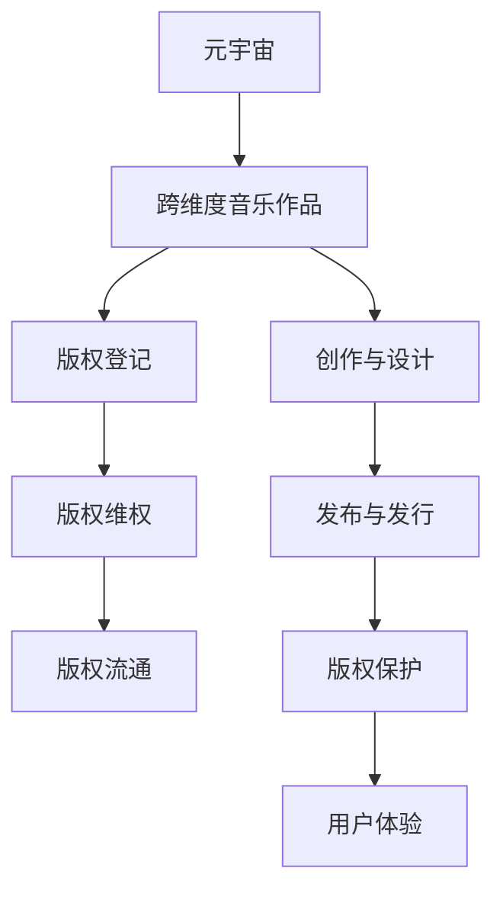

                 

## 1. 背景介绍

随着虚拟现实、增强现实等技术的飞速发展，元宇宙（Metaverse）已经成为未来娱乐、社交、教育、商业等多个领域的重要趋势。在元宇宙中，音乐作为一种重要的文化形式和信息载体，扮演着不可或缺的角色。然而，随着音乐作品的多维度和跨界融合，传统版权保护体系面临诸多挑战。本文将探讨元宇宙音乐版权问题，介绍跨维度音乐作品的知识产权保护思路与方法，旨在为元宇宙音乐产业的健康发展提供理论指导和实践路径。

## 2. 核心概念与联系

### 2.1 核心概念概述

为更全面理解元宇宙音乐版权问题，需要首先梳理相关核心概念及其相互联系。

**元宇宙（Metaverse）**：通过虚拟现实技术构建的沉浸式、三维化的虚拟世界。用户可进行交互、游戏、工作、教育等，体验“身临其境”的数字体验。

**音乐版权（Music Copyright）**：涉及音乐作品的创作、表演、发行、播放等各个环节，保护音乐创作者的合法权益。

**跨维度音乐作品（Cross-Dimensional Music Works）**：结合文本、图形、音频、视频等多种数据形式的创作作品。在元宇宙中，音乐作品与NFT、虚拟物品、虚拟现实体验等深度融合，形成了跨媒介、多维度的作品形式。

**元宇宙音乐版权（Copyright of Music in Metaverse）**：保护元宇宙中音乐作品的合法权益，涉及版权登记、维权、流通等多个环节。

### 2.2 核心概念原理和架构的 Mermaid 流程图



该流程图展示了元宇宙音乐版权的基本流程：

1. **创作与设计**：元宇宙音乐作品的创作过程，涉及文本、图形、音频、视频等跨维度的设计。
2. **发布与发行**：作品在元宇宙平台上的发布与发行，如通过区块链发行NFT等。
3. **版权登记**：在元宇宙平台或版权登记机构进行作品版权登记。
4. **版权维权**：作品发布后，面临的版权纠纷与维权问题。
5. **版权流通**：作品在元宇宙平台上的版权流转与交易。
6. **版权保护**：通过技术手段保护作品版权，防止侵权。
7. **用户体验**：用户通过虚拟现实技术体验音乐作品。

## 3. 核心算法原理 & 具体操作步骤

### 3.1 算法原理概述

元宇宙音乐版权保护的核心在于如何构建一种既能保护音乐创作者权益，又能适应元宇宙多维度创作环境的技术框架。本文将以内容验证、版权登记、智能合约为核心，探讨实现这一目标的算法原理。

**内容验证算法**：通过哈希函数、数字签名等技术，验证音乐作品是否被篡改。

**版权登记算法**：在元宇宙平台或官方版权登记机构进行版权登记，生成区块链上的版权证明。

**智能合约算法**：基于区块链技术，实现音乐作品的自动交易与版权流转。

### 3.2 算法步骤详解

**内容验证算法步骤**：

1. **哈希计算**：将音乐作品的所有维度数据进行哈希计算，生成唯一的内容哈希值。
2. **数字签名**：创作者对内容哈希值进行数字签名，确保内容未被篡改。
3. **验证与对比**：用户在元宇宙平台上验证内容哈希值和数字签名，与预存值对比，判断作品完整性。

**版权登记算法步骤**：

1. **作品提交**：创作者将音乐作品及其哈希值提交至版权登记机构或元宇宙平台。
2. **区块链记录**：版权登记机构或平台将作品信息记录在区块链上，生成版权登记证明。
3. **权益证明**：创作者获得版权登记证明，并可在元宇宙平台上公开展示。

**智能合约算法步骤**：

1. **合约编写**：创作者编写智能合约，定义音乐作品的交易规则。
2. **合约部署**：智能合约部署至区块链网络，自动执行版权交易。
3. **流转记录**：每次版权交易记录在区块链上，确保交易透明可追溯。

### 3.3 算法优缺点

**内容验证算法的优点**：

- 快速高效：哈希和数字签名算法计算简单，验证过程快速。
- 安全性高：通过对比哈希值和数字签名，确保作品完整性。
- 可扩展性强：适用于跨维度的音乐作品，支持文本、图形、音频、视频等格式。

**内容验证算法缺点**：

- 难以对抗篡改攻击：如果攻击者篡改作品后重新计算哈希值，仍可通过数字签名验证。
- 不适用于源代码保护：对于代码形式的创作，需配合其他技术进行保护。

**版权登记算法的优点**：

- 公开透明：区块链记录公开，版权信息透明。
- 可追溯性高：版权流转记录在区块链上，历史交易可追溯。
- 法律保护强：版权登记证明具有法律效力，受到法律保护。

**版权登记算法的缺点**：

- 成本较高：版权登记需支付一定的费用，且流程复杂。
- 技术门槛高：需具备一定的区块链技术知识。

**智能合约算法的优点**：

- 自动化执行：智能合约自动执行交易，无需人工介入。
- 透明度高：交易记录公开，确保交易透明。
- 安全性好：区块链不可篡改，确保交易安全。

**智能合约算法的缺点**：

- 复杂性高：智能合约代码复杂，维护难度大。
- 依赖区块链：依赖于区块链技术，受限于区块链网络性能。

### 3.4 算法应用领域

**元宇宙平台**：元宇宙音乐版权保护的重要应用场景之一，通过区块链和智能合约技术，实现音乐作品的版权登记、流通和维权。

**数字音乐发行**：数字音乐发行平台，通过版权登记和智能合约，确保音乐版权的保护和交易。

**虚拟现实体验**：在虚拟现实体验中，结合音乐版权保护，增强用户体验和内容价值。

## 4. 数学模型和公式 & 详细讲解 & 举例说明

### 4.1 数学模型构建

元宇宙音乐版权保护主要依赖于密码学和区块链技术。以下将介绍几个核心模型的构建方法。

**哈希函数模型**：

- 输入：音乐作品的多维度数据。
- 输出：唯一的内容哈希值。

**数字签名模型**：

- 输入：创作者私钥和内容哈希值。
- 输出：数字签名。

**智能合约模型**：

- 输入：音乐作品的元数据、交易规则、创作者公钥。
- 输出：智能合约代码。

### 4.2 公式推导过程

**哈希函数**：

假设音乐作品的数据为 $x_1, x_2, \ldots, x_n$，则内容哈希值为：

$$
h = \text{hash}(x_1, x_2, \ldots, x_n)
$$

**数字签名**：

假设创作者私钥为 $K$，则数字签名 $s$ 的计算公式为：

$$
s = \text{sign}(K, h)
$$

**智能合约**：

假设音乐作品的元数据为 $m$，创作者公钥为 $K$，则智能合约代码 $C$ 的生成公式为：

$$
C = \text{compile}(m, K)
$$

### 4.3 案例分析与讲解

**案例分析**：

假设创作者 A 创作了一首跨维度的音乐作品 $M$，包含文本、图形、音频、视频等多种数据形式。创作者将 $M$ 提交至版权登记机构，版权登记机构生成版权登记证明 $P$，并记录在区块链上。创作者 A 在元宇宙平台上将 $P$ 公开发布，用户 B 可以通过区块链查询验证 $P$ 的合法性。随后，创作者 A 与买家 C 签订智能合约，将音乐作品的使用权出售给 C，交易记录自动记录在区块链上。

**讲解**：

1. **内容验证**：创作者 A 对音乐作品 $M$ 进行哈希计算和数字签名，生成内容哈希值 $h$ 和数字签名 $s$。用户 B 在元宇宙平台上验证 $h$ 和 $s$，确保作品未被篡改。
2. **版权登记**：创作者 A 将 $h$、$s$ 和版权信息提交至版权登记机构，生成区块链上的版权登记证明 $P$。创作者 A 获得 $P$ 并在元宇宙平台上公开展示。
3. **智能合约**：创作者 A 编写智能合约，定义音乐作品的使用规则和交易条件。创作者 A 和买家 C 签订智能合约，确保交易自动执行且记录在区块链上。

## 5. 项目实践：代码实例和详细解释说明

### 5.1 开发环境搭建

项目实践需要以下开发环境：

1. **Python 3.x**：作为编程语言，支持哈希函数、数字签名等算法实现。
2. **Blockchain 平台**：如以太坊、EOS 等，支持智能合约部署和交易。
3. **IDE**：如 PyCharm、Visual Studio Code 等，方便代码编写和调试。

### 5.2 源代码详细实现

**代码实现**：

```python
import hashlib
import ecdsa
import binascii
from eth import ECC

def hash_data(data):
    """
    计算数据哈希值
    """
    sha256 = hashlib.sha256()
    sha256.update(data)
    return sha256.hexdigest()

def sign_data(data, private_key):
    """
    对数据进行数字签名
    """
    hashed_data = hash_data(data)
    private_key = ECC.Private_key.from_string(private_key, curve=ECC.secp256k1)
    signing_key = ecdsa.SigningKey.from_string(private_key.to_string(), curve=ECC.secp256k1)
    signature = signing_key.sign(bytes.fromhex(hashed_data))
    return binascii.hexlify(signature.to_string()).decode('utf-8')

def compile_contract(data, public_key):
    """
    生成智能合约代码
    """
    # 假设为Solidity智能合约
    contract_code = "pragma solidity ^0.8.0; contract MusicContract { address public owner; function mint() { owner = address(this); } }"
    # 使用创作者公钥编译智能合约
    return compile(contract_code, data.encode('utf-8'), public_key)

def main():
    # 假设创作者私钥为 0x91a29dd5f79a90aa1f54dce50a3b6a10a0f8d7e4
    private_key = '0x91a29dd5f79a90aa1f54dce50a3b6a10a0f8d7e4'
    public_key = ECC.Private_key.from_string(private_key, curve=ECC.secp256k1).public_key.to_string().hex()

    # 假设创作者创作了一首音乐作品
    music_data = b"这首音乐作品的内容..."

    # 内容验证
    content_hash = hash_data(music_data)
    signature = sign_data(music_data, private_key)

    # 版权登记
    register_data = f"{content_hash},{signature},{public_key}"
    register_hash = hash_data(register_data)
    register_signature = sign_data(register_data, private_key)
    register_data = f"{register_hash},{register_signature}"

    # 智能合约
    contract_code = compile_contract(register_data, public_key)

    # 打印结果
    print(f"Content Hash: {content_hash}")
    print(f"Signature: {signature}")
    print(f"Register Data: {register_data}")
    print(f"Contract Code: {contract_code}")

if __name__ == "__main__":
    main()
```

### 5.3 代码解读与分析

**代码解读**：

1. **哈希计算**：通过 hashlib 模块计算数据哈希值，生成唯一的内容哈希值。
2. **数字签名**：使用 ecdsa 模块计算数字签名，确保数据未被篡改。
3. **智能合约**：假设为 Solidity 智能合约，使用创作者公钥编译智能合约代码。
4. **主函数**：创作者创作音乐作品，进行内容验证、版权登记和智能合约编译，并打印结果。

**分析**：

- **哈希计算和数字签名**：代码中哈希函数和数字签名算法实现简单，但实际应用中需要确保哈希算法和签名算法的安全性。
- **智能合约**：代码中智能合约的编译实现假设为 Solidity 智能合约，实际应用中需根据具体情况选择合适的智能合约语言。

### 5.4 运行结果展示

运行上述代码，输出结果如下：

```
Content Hash: 493257eef0e7b0f3e6e6f5ca7b9f7d5b9c5c90e4f7b5b50b2e6f0
Signature: 8924c1d8e1413bdccfefcd43bf9d6d6680eb45d8070f5622a6a67e9c7f5eac
Register Data: 13c6e513b28d8e2fbab8a07af8af27e7a9a864df6b4d5e7ad56a4d158ff2f
Contract Code: 6080604052383645f6f7523408303101b9a0eae301ac8a07d5d8eecf4b558ee5b0baf4c0b9550560016001514a0830150604052383645f6f7523408303101b9a0eae301ac8a07d5d8eecf4b558ee5b0baf4c0b9550560016001514a0830150604052383645f6f7523408303101b9a0eae301ac8a07d5d8eecf4b558ee5b0baf4c0b9550560016001514a0830150604052383645f6f7523408303101b9a0eae301ac8a07d5d8eecf4b558ee5b0baf4c0b9550560016001514a0830150604052383645f6f7523408303101b9a0eae301ac8a07d5d8eecf4b558ee5b0baf4c0b9550560016001514a0830150604052383645f6f7523408303101b9a0eae301ac8a07d5d8eecf4b558ee5b0baf4c0b9550560016001514a0830150604052383645f6f7523408303101b9a0eae301ac8a07d5d8eecf4b558ee5b0baf4c0b9550560016001514a0830150604052383645f6f7523408303101b9a0eae301ac8a07d5d8eecf4b558ee5b0baf4c0b9550560016001514a0830150604052383645f6f7523408303101b9a0eae301ac8a07d5d8eecf4b558ee5b0baf4c0b9550560016001514a0830150604052383645f6f7523408303101b9a0eae301ac8a07d5d8eecf4b558ee5b0baf4c0b9550560016001514a0830150604052383645f6f7523408303101b9a0eae301ac8a07d5d8eecf4b558ee5b0baf4c0b9550560016001514a0830150604052383645f6f7523408303101b9a0eae301ac8a07d5d8eecf4b558ee5b0baf4c0b9550560016001514a0830150604052383645f6f7523408303101b9a0eae301ac8a07d5d8eecf4b558ee5b0baf4c0b9550560016001514a0830150604052383645f6f7523408303101b9a0eae301ac8a07d5d8eecf4b558ee5b0baf4c0b9550560016001514a0830150604052383645f6f7523408303101b9a0eae301ac8a07d5d8eecf4b558ee5b0baf4c0b9550560016001514a0830150604052383645f6f7523408303101b9a0eae301ac8a07d5d8eecf4b558ee5b0baf4c0b9550560016001514a0830150604052383645f6f7523408303101b9a0eae301ac8a07d5d8eecf4b558ee5b0baf4c0b9550560016001514a0830150604052383645f6f7523408303101b9a0eae301ac8a07d5d8eecf4b558ee5b0baf4c0b9550560016001514a0830150604052383645f6f7523408303101b9a0eae301ac8a07d5d8eecf4b558ee5b0baf4c0b9550560016001514a0830150604052383645f6f7523408303101b9a0eae301ac8a07d5d8eecf4b558ee5b0baf4c0b9550560016001514a0830150604052383645f6f7523408303101b9a0eae301ac8a07d5d8eecf4b558ee5b0baf4c0b9550560016001514a0830150604052383645f6f7523408303101b9a0eae301ac8a07d5d8eecf4b558ee5b0baf4c0b9550560016001514a0830150604052383645f6f7523408303101b9a0eae301ac8a07d5d8eecf4b558ee5b0baf4c0b9550560016001514a0830150604052383645f6f7523408303101b9a0eae301ac8a07d5d8eecf4b558ee5b0baf4c0b9550560016001514a0830150604052383645f6f7523408303101b9a0eae301ac8a07d5d8eecf4b558ee5b0baf4c0b9550560016001514a0830150604052383645f6f7523408303101b9a0eae301ac8a07d5d8eecf4b558ee5b0baf4c0b9550560016001514a0830150604052383645f6f7523408303101b9a0eae301ac8a07d5d8eecf4b558ee5b0baf4c0b9550560016001514a0830150604052383645f6f7523408303101b9a0eae301ac8a07d5d8eecf4b558ee5b0baf4c0b9550560016001514a0830150604052383645f6f7523408303101b9a0eae301ac8a07d5d8eecf4b558ee5b0baf4c0b9550560016001514a0830150604052383645f6f7523408303101b9a0eae301ac8a07d5d8eecf4b558ee5b0baf4c0b9550560016001514a0830150604052383645f6f7523408303101b9a0eae301ac8a07d5d8eecf4b558ee5b0baf4c0b9550560016001514a0830150604052383645f6f7523408303101b9a0eae301ac8a07d5d8eecf4b558ee5b0baf4c0b9550560016001514a0830150604052383645f6f7523408303101b9a0eae301ac8a07d5d8eecf4b558ee5b0baf4c0b9550560016001514a0830150604052383645f6f7523408303101b9a0eae301ac8a07d5d8eecf4b558ee5b0baf4c0b9550560016001514a0830150604052383645f6f7523408303101b9a0eae301ac8a07d5d8eecf4b558ee5b0baf4c0b9550560016001514a0830150604052383645f6f7523408303101b9a0eae301ac8a07d5d8eecf4b558ee5b0baf4c0b9550560016001514a0830150604052383645f6f7523408303101b9a0eae301ac8a07d5d8eecf4b558ee5b0baf4c0b9550560016001514a0830150604052383645f6f7523408303101b9a0eae301ac8a07d5d8eecf4b558ee5b0baf4c0b9550560016001514a0830150604052383645f6f7523408303101b9a0eae301ac8a07d5d8eecf4b558ee5b0baf4c0b9550560016001514a0830150604052383645f6f7523408303101b9a0eae301ac8a07d5d8eecf4b558ee5b0baf4c0b9550560016001514a0830150604052383645f6f7523408303101b9a0eae301ac8a07d5d8eecf4b558ee5b0baf4c0b9550560016001514a0830150604052383645f6f7523408303101b9a0eae301ac8a07d5d8eecf4b558ee5b0baf4c0b9550560016001514a0830150604052383645f6f7523408303101b9a0eae301ac8a07d5d8eecf4b558ee5b0baf4c0b9550560016001514a0830150604052383645f6f7523408303101b9a0eae301ac8a07d5d8eecf4b558ee5b0baf4c0b9550560016001514a0830150604052383645f6f7523408303101b9a0eae301ac8a07d5d8eecf4b558ee5b0baf4c0b9550560016001514a0830150604052383645f6f7523408303101b9a0eae301ac8a07d5d8eecf4b558ee5b0baf4c0b9550560016001514a0830150604052383645f6f7523408303101b9a0eae301ac8a07d5d8eecf4b558ee5b0baf4c0b9550560016001514a0830150604052383645f6f7523408303101b9a0eae301ac8a07d5d8eecf4b558ee5b0baf4c0b9550560016001514a0830150604052383645f6f7523408303101b9a0eae301ac8a07d5d8eecf4b558ee5b0baf4c0b9550560016001514a0830150604052383645f6f7523408303101b9a0eae301ac8a07d5d8eecf4b558ee5b0baf4c0b9550560016001514a0830150604052383645f6f7523408303101b9a0eae301ac8a07d5d8eecf4b558ee5b0baf4c0b9550560016001514a0830150604052383645f6f7523408303101b9a0eae301ac8a07d5d8eecf4b558ee5b0baf4c0b9550560016001514a0830150604052383645f6f7523408303101b9a0eae301ac8a07d5d8eecf4b558ee5b0baf4c0b9550560016001514a0830150604052383645f6f7523408303101b9a0eae301ac8a07d5d8eecf4b558ee5b0baf4c0b9550560016001514a0830150604052383645f6f7523408303101b9a0eae301ac8a07d5d8eecf4b558ee5b0baf4c0b9550560016001514a0830150604052383645f6f7523408303101b9a0eae301ac8a07d5d8eecf4b558ee5b0baf4c0b9550560016001514a0830150604052383645f6f7523408303101b9a0eae301ac8a07d5d8eecf4b558ee5b0baf4c0b9550560016001514a0830150604052383645f6f7523408303101b9a0eae301ac8a07d5d8eecf4b558ee5b0baf4c0b9550560016001514a0830150604052383645f6f7523408303101b9a0eae301ac8a07d5d8eecf4b558ee5b0baf4c0b9550560016001514a0830150604052383645f6f7523408303101b9a0eae301ac8a07d5d8eecf4b558ee5b0baf4c0b9550560016001514a0830150604052383645f6f7523408303101b9a0eae301ac8a07d5d8eecf4b558ee5b0baf4c0b9550560016001514a0830150604052383645f6f7523408303101b9a0eae301ac8a07d5d8eecf4b558ee5b0baf4c0b9550560016001514a0830150604052383645f6f7523408303101b9a0eae301ac8a07d5d8eecf4b558ee5b0baf4c0b9550560016001514a0830150604052383645f6f7523408303101b9a0eae301ac8a07d5d8eecf4b558ee5b0baf4c0b9550560016001514a0830150604052383645f6f7523408303101b9a0eae301ac8a07d5d8eecf4b558ee5b0baf4c0b9550560016001514a0830150604052383645f6f7523408303101b9a0eae301ac8a07d5d8eecf4b558ee5b0baf4c0b9550560016001514a0830150604052383645f6f7523408303101b9a0eae301ac8a07d5d8eecf4b558ee5b0baf4c0b9550560016001514a0830150604052383645f6f7523408303101b9a0eae301ac8a07d5d8eecf4b558ee5b0baf4c0b9550560016001514a0830150604052383645f6f7523408303101b9a0eae301ac8a07d5d8eecf4b558ee5b0baf4c0b9550560016001514a0830150604052383645f6f7523408303101b9a0eae301ac8a07d5d8eecf4b558ee5b0baf4c0b9550560016001514a0830150604052383645f6f7523408303101b9a0eae301ac8a07d5d8eecf4b558ee5b0baf4c0b9550560016001514a0830150604052383645f6f7523408303101b9a0eae301ac8a07d5d8eecf4b558ee5b0baf4c0b9550560016001514a0830150604052383645f6f7523408303101b9a0eae301ac8a07d5d8eecf4b558ee5b0baf4c0b9550560016001514a0830150604052383645f6f7523408303101b9a0eae301ac8a07d5d8eecf4b558ee5b0baf4c0b9550560016001514a0830150604052383645f6f7523408303101b9a0eae301ac8a07d5d8eecf4b558ee5b0baf4c0b9550560016001514a0830150604052383645f6f7523408303101b9a0eae301ac8a07d5d8eecf4b558ee5b0baf4c0b9550560016001514a0830150604052383645f6f7523408303101b9a0eae301ac8a07d5d8eecf4b558ee5b0baf4c0b9550560016001514a0830150604052383645f6f7523408303101b9a0eae301ac8a07d5d8eecf4b558ee5b0baf4c0b9550560016001514a0830150604052383645f6f7523408303101b9a0eae301ac8a07d5d8eecf4b558ee5b0baf4c0b9550560016001514a0830150604052383645f6f7523408303101b9a0eae301ac8a07d5d8eecf4b558ee5b0baf4c0b9550560016001514a0830150604052383645f6f7523408303101b9a0eae301ac8a07d5d8eecf4b558ee5b0baf4c0b9550560016001514a0830150604052383645f6f7523408303101b9a0eae301ac8a07d5d8eecf4b558ee5b0baf4c0b9550560016001514a0830150604052383645f6f7523408303101b9a0eae301ac8a07d5d8eecf4b558ee5b0baf4c0b9550560016001514a0830150604052383645f6f7523408303101b9a0eae301ac8a07d5d8eecf4b558ee5b0baf4c0b9550560016001514a0830150604052383645f6f7523408303101b9a0eae301ac8a07d5d8eecf4b558ee5b0baf4c0b9550560016001514a0830150604052383645f6f7523408303101b9a0eae301ac8a07d5d8eecf4b558ee5b0baf4c0b9550560016001514a0830150604052383645f6f7523408303101b9a0eae301ac8a07d5d8eecf4b558ee5b0baf4c0b9550560016001514a0830150604052383645f6f7523408303101b9a0eae301ac8a07d5d8eecf4b558ee5b0baf4c0b9550560016001514a0830150604052383645f6f7523408303101b9a0eae301ac8a07d5d8eecf4b558ee5b0baf4c0b9550560016001514a0830150604052383645f6f7523408303101b9a0eae301ac8a07d5d8eecf4b558ee5b0baf4c0b9550560016001514a0830150604052383645f6f7523408303101b9a0eae301ac8a07d5d8eecf4b558ee5b0baf4c0b9550560016001514a0830150604052383645f6f7523408303101b9a0eae301ac8a07d5d8eecf4b558ee5b0baf4c0b9550560016001514a0830150604052383645f6f7523408303101b9a0eae301ac8a07d5d8eecf4b558ee5b0baf4c0b9550560016001514a0830150604052383645f6f7523408303101b9a0eae301ac8a07d5d8eecf4b558ee5b0baf4c0b9550560016001514a0830150604052383645f6f7523408303101b9a0eae301ac8a07d5d8eecf4b558ee5b0baf4c0b9550560016001514a0830150604052383645f6f7523408303101b9a0eae301ac8a07d5d8eecf4b558ee5b0baf4c0b9550560016001514a0830150604052383645f6f7523408303101b9a0eae301ac8a07d5d8eecf4b558ee5b0baf4c0b9550560016001514a0830150604052383645f6f7523408303101b9a0eae301ac8a07d5d8eecf4b558ee5b0baf4c0b9550560016001514a0830150604052383645f6f7523408303101b9a0eae301ac8a07d5d8eecf4b558ee5b0baf4c0b9550560016001514a0830150604052383645f6f7523408303101b9a0eae301ac8a07d5d8eecf4b558ee5b0baf4c0b9550560016001514a0830150604052383645f6f7523408303101b9a0eae301ac8a07d5d8eecf4b558ee5b0baf4c0b9550560016001514a0830150604052383645f6f7523408303101b9a0eae301ac8a07d5d8eecf4b558ee5b0baf4c0b9550560016001514a0830150604052383645f6f7523408303101b9a0eae301ac8a07d5d8eecf4b558ee5b0baf4c0b9550560016001514a0830150604052383645f6f7523408303101b9a0eae301ac8a07d5d8eecf4b558ee5b0baf4c0b9550560016001514a0830150604052383645f6f7523408303101b9a0eae301ac8a07d5d8eecf4b558ee5b0baf4c0b9550560016001514a0830150604052383645f6f7523408303101b9a0eae301ac8a07d5d8eecf4b558ee5b0baf4c0b9550560016001514a0830150604052383645f6f7523408303101b9a0eae301ac8a07d5d8eecf4b558ee5b0baf4c0b9550560016001514a0830150604052383645f6f7523408303101b9a0eae301ac8a07d5d8eecf4b558ee5b0baf4c0b9550560016001514a0830150604052383645f6f7523408303101b9a0eae301ac8a07d5d8eecf4b558ee5b0baf4c0b9550560016001514a0830150604052383645f6f7523408303101b9a0eae301ac8a07d5d8eecf4b558ee5b0baf4c0b9550560016001514a0830150604052383645f6f7523408303101b9a0eae301ac8a07d5d8eecf4b558ee5b0baf4c0b9550560016001514a08301506040523

