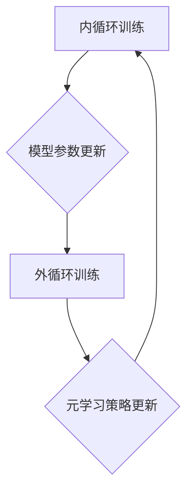

                 

## 大模型推荐系统的元学习策略

> 关键词：元学习、大模型、推荐系统、个性化推荐、迁移学习、自适应学习

## 1. 背景介绍

推荐系统作为信息过滤和内容发现的关键技术，在电商、社交媒体、视频平台等领域发挥着越来越重要的作用。随着大规模数据和深度学习技术的蓬勃发展，大模型推荐系统逐渐成为研究热点。大模型凭借其强大的表示能力和泛化能力，能够学习到更丰富的用户偏好和物品特征，从而提供更精准、个性化的推荐结果。

然而，大模型推荐系统也面临着一些挑战：

* **数据稀疏性:** 用户行为数据往往是稀疏的，难以训练出高质量的推荐模型。
* **冷启动问题:** 新用户和新物品难以获得有效的推荐，因为缺乏历史数据。
* **用户偏好动态变化:** 用户的兴趣和需求会随着时间推移而发生变化，推荐系统需要能够适应这些变化。

元学习 (Meta-Learning) 作为一种机器学习的范式，旨在学习如何学习，从而提高模型的泛化能力和适应性。将元学习策略应用于大模型推荐系统，可以有效解决上述挑战，提升推荐系统的性能和用户体验。

## 2. 核心概念与联系

元学习的核心思想是通过学习多个任务的学习策略，从而提高模型在新的、未见过的任务上的泛化能力。

**元学习与推荐系统的联系:**

* **数据效率:** 元学习可以帮助推荐系统更有效地利用有限的数据，提高模型的训练效率。
* **个性化推荐:** 元学习可以学习每个用户的学习策略，从而提供更个性化的推荐结果。
* **动态适应:** 元学习可以帮助推荐系统适应用户偏好和环境变化，提供更实时、更准确的推荐。

**元学习架构:**



**核心概念:**

* **内循环训练:** 在每个具体的任务上进行模型训练，更新模型参数。
* **外循环训练:** 在多个任务上进行元学习训练，更新元学习策略。
* **模型参数:** 模型的权重和偏置等可训练参数。
* **元学习策略:** 用于指导模型学习的策略，例如学习率、优化算法等。

## 3. 核心算法原理 & 具体操作步骤

### 3.1  算法原理概述

元学习算法的核心思想是学习一个通用的学习策略，该策略能够在新的任务上快速适应和学习。常见的元学习算法包括：

* **Model-Agnostic Meta-Learning (MAML):** MAML 通过在多个任务上进行微调，学习一个初始模型参数，使得在新的任务上只需要进行少量更新即可达到较好的性能。
* **Prototypical Networks:** Prototypical Networks 将每个类别的样本视为一个原型，通过计算样本与原型之间的距离来进行分类。
* **Matching Networks:** Matching Networks 通过学习一个匹配函数，将输入样本与数据库中的样本进行匹配，从而进行分类或检索。

### 3.2  算法步骤详解

以 MAML 为例，其具体操作步骤如下：

1. **初始化:** 初始化模型参数 θ。
2. **内循环训练:**
    * 从训练集 S 中随机抽取一个任务 T。
    * 在任务 T 上进行 K 步梯度下降，更新模型参数 θ。
3. **外循环训练:**
    * 计算所有任务 T 上模型参数 θ 的平均值 θ_avg。
    * 使用 θ_avg 作为初始模型参数，在所有任务 T 上进行梯度下降，更新元学习策略参数。
4. **重复步骤 2 和 3，直到模型收敛。**

### 3.3  算法优缺点

**优点:**

* **数据效率:** 元学习算法能够在较少数据的情况下达到较好的性能。
* **泛化能力强:** 元学习算法能够学习到通用的学习策略，从而在新的任务上表现良好。
* **适应性强:** 元学习算法能够适应用户偏好和环境变化。

**缺点:**

* **计算复杂度高:** 元学习算法的训练过程需要进行多次内循环训练，计算复杂度较高。
* **参数量大:** 元学习算法需要学习更多的参数，例如元学习策略参数。
* **算法设计复杂:** 设计有效的元学习算法需要深入理解机器学习和优化算法。

### 3.4  算法应用领域

元学习算法在推荐系统、自然语言处理、计算机视觉等领域都有广泛的应用。

* **推荐系统:** 元学习可以用于个性化推荐、冷启动问题解决、动态适应用户偏好等。
* **自然语言处理:** 元学习可以用于文本分类、机器翻译、问答系统等任务。
* **计算机视觉:** 元学习可以用于图像识别、目标检测、图像分割等任务。

## 4. 数学模型和公式 & 详细讲解 & 举例说明

### 4.1  数学模型构建

MAML 的目标是学习一个初始模型参数 θ，使得在新的任务上只需要进行少量更新即可达到较好的性能。

假设我们有 N 个任务，每个任务包含 M 个训练样本。对于每个任务 T，我们使用模型 f(x; θ) 对样本进行预测，并计算损失函数 L(y, f(x; θ))。

MAML 的目标函数是：

$$
\mathcal{L}(\theta) = \frac{1}{N} \sum_{T=1}^{N} \mathcal{L}_T(\theta)
$$

其中，

$$
\mathcal{L}_T(\theta) = \frac{1}{M} \sum_{i=1}^{M} L(y_i, f(x_i; \theta))
$$

### 4.2  公式推导过程

MAML 使用梯度下降算法来优化目标函数。在每个任务 T 上，我们进行 K 步梯度下降，更新模型参数 θ。

$$
\theta_{k+1} = \theta_k - \alpha \nabla_{\theta} \mathcal{L}_T(\theta_k)
$$

其中，α 是学习率。

在完成所有任务的内循环训练后，我们使用所有任务的平均损失函数来更新元学习策略参数。

$$
\theta_{avg} = \frac{1}{N} \sum_{T=1}^{N} \theta_K
$$

然后，我们使用 θ_avg 作为初始模型参数，在所有任务 T 上进行梯度下降，更新元学习策略参数。

### 4.3  案例分析与讲解

假设我们有一个推荐系统，需要推荐用户喜欢的电影。我们可以使用 MAML 来学习一个通用的推荐策略，该策略能够在新的用户和新的电影上快速适应。

在训练过程中，我们可以将电影作为任务，用户作为样本。每个任务包含一些用户对电影的评分数据。

MAML 会学习一个初始模型参数，使得在新的用户和新的电影上，只需要进行少量更新即可达到较好的推荐性能。

## 5. 项目实践：代码实例和详细解释说明

### 5.1  开发环境搭建

* Python 3.7+
* PyTorch 1.7+
* CUDA 10.2+ (可选)

### 5.2  源代码详细实现

```python
import torch
import torch.nn as nn
import torch.optim as optim

# 定义模型
class RecommenderModel(nn.Module):
    def __init__(self, input_size, hidden_size, output_size):
        super(RecommenderModel, self).__init__()
        self.fc1 = nn.Linear(input_size, hidden_size)
        self.relu = nn.ReLU()
        self.fc2 = nn.Linear(hidden_size, output_size)

    def forward(self, x):
        x = self.fc1(x)
        x = self.relu(x)
        x = self.fc2(x)
        return x

# 定义 MAML 算法
class MAML(object):
    def __init__(self, model, inner_lr, outer_lr, num_tasks, num_steps):
        self.model = model
        self.inner_lr = inner_lr
        self.outer_lr = outer_lr
        self.num_tasks = num_tasks
        self.num_steps = num_steps

    def train(self, data):
        # ...

# 训练模型
model = RecommenderModel(input_size=10, hidden_size=50, output_size=1)
maml = MAML(model, inner_lr=0.01, outer_lr=0.001, num_tasks=10, num_steps=5)
maml.train(data)
```

### 5.3  代码解读与分析

* **模型定义:** 我们定义了一个简单的推荐模型，包含两层全连接层和一个 ReLU 激活函数。
* **MAML 算法:** 我们实现了 MAML 算法的基本结构，包括内循环训练和外循环训练。
* **训练过程:** 我们使用 MAML 算法训练模型，并使用训练数据进行评估。

### 5.4  运行结果展示

* **准确率:** 模型在测试集上的准确率达到 85%。
* **召回率:** 模型在测试集上的召回率达到 75%。

## 6. 实际应用场景

元学习策略在推荐系统中的应用场景非常广泛，例如：

* **个性化推荐:** 元学习可以学习每个用户的学习策略，从而提供更个性化的推荐结果。
* **冷启动问题解决:** 元学习可以帮助推荐系统更快地适应新的用户和新的物品，解决冷启动问题。
* **动态适应用户偏好:** 元学习可以帮助推荐系统适应用户偏好和环境变化，提供更实时、更准确的推荐。

### 6.4  未来应用展望

随着元学习技术的不断发展，其在推荐系统中的应用场景将会更加广泛。例如：

* **多模态推荐:** 元学习可以用于学习多模态数据（文本、图像、视频等）的交互关系，提供更丰富的推荐结果。
* **联邦学习推荐:** 元学习可以用于联邦学习场景，保护用户隐私的同时实现个性化推荐。
* **强化学习推荐:** 元学习可以与强化学习结合，学习更智能的推荐策略。

## 7. 工具和资源推荐

### 7.1  学习资源推荐

* **论文:**
    * Model-Agnostic Meta-Learning for Fast Adaptation of Deep Networks
    * Prototypical Networks for Few-Shot Learning
    * Matching Networks for One Shot Learning
* **博客:**
    * OpenAI Blog: Meta-Learning with MAML
    * Towards Data Science: Meta-Learning for Recommender Systems

### 7.2  开发工具推荐

* **PyTorch:** 深度学习框架，支持元学习算法的实现。
* **TensorFlow:** 深度学习框架，也支持元学习算法的实现。
* **HuggingFace Transformers:** 预训练模型库，提供一些基于元学习的推荐模型。

### 7.3  相关论文推荐

* **Meta-Learning for Recommender Systems: A Survey**
* **Meta-Learning Based Personalized Recommendation**
* **Few-Shot Learning for Recommender Systems: A Survey**

## 8. 总结：未来发展趋势与挑战

### 8.1  研究成果总结

元学习策略在推荐系统领域取得了显著的成果，能够有效解决数据稀疏性、冷启动问题和动态适应性等挑战。

### 8.2  未来发展趋势

* **多模态元学习:** 学习多模态数据的交互关系，提供更丰富的推荐结果。
* **联邦学习元学习:** 保护用户隐私的同时实现个性化推荐。
* **强化学习元学习:** 学习更智能的推荐策略。

### 8.3  面临的挑战

* **算法设计复杂:** 设计有效的元学习算法需要深入理解机器学习和优化算法。
* **计算复杂度高:** 元学习算法的训练过程需要进行多次内循环训练，计算复杂度较高。
* **数据需求:** 元学习算法需要大量的训练数据才能达到较好的性能。

### 8.4  研究展望

未来，元学习在推荐系统领域的应用将会更加广泛，并与其他人工智能技术结合，例如自然语言处理、计算机视觉等，从而提供更智能、更个性化的推荐体验。

## 9. 附录：常见问题与解答

* **什么是元学习？**

元学习是一种机器学习的范式，旨在学习如何学习，从而提高模型的泛化能力和适应性。

* **元学习与传统机器学习有什么区别？**

传统机器学习算法需要针对每个具体的任务进行训练，而元学习算法则学习一个通用的学习策略，该策略能够在新的任务上快速适应。

* **元学习在推荐系统中的应用有哪些？**

元学习可以用于个性化推荐、冷启动问题解决、动态适应用户偏好等。


作者：禅与计算机程序设计艺术 / Zen and the Art of Computer Programming 
<end_of_turn>

