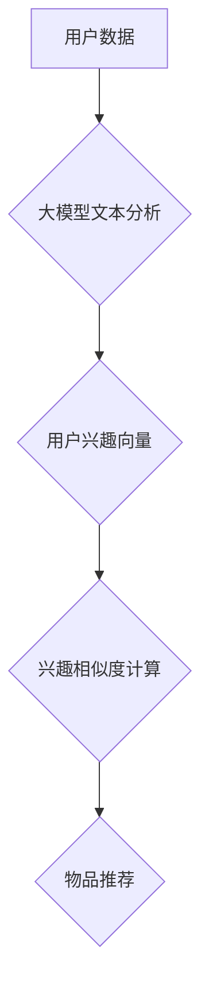

                 

## 大模型辅助的推荐系统多场景兴趣协同学习

> 关键词：大模型、推荐系统、兴趣协同学习、多场景、个性化推荐、用户画像

## 1. 背景介绍

随着互联网的蓬勃发展，海量数据涌现，用户个性化需求日益突出。推荐系统作为连接用户和内容的重要桥梁，在电商、社交、娱乐等领域发挥着越来越重要的作用。传统的推荐系统主要依赖于用户历史行为和物品特征，但单一特征难以全面刻画用户的复杂兴趣，且难以应对新用户和新物品的推荐挑战。

大模型的出现为推荐系统带来了新的机遇。大模型拥有强大的语义理解和知识表示能力，能够从海量文本数据中学习用户兴趣的深层语义，并将其应用于个性化推荐。兴趣协同学习则是一种有效的推荐方法，通过挖掘用户之间兴趣的相似性，推荐用户可能感兴趣的物品。

结合大模型和兴趣协同学习，可以构建更智能、更精准的推荐系统，更好地满足用户个性化需求。

## 2. 核心概念与联系

### 2.1  大模型

大模型是指参数规模庞大、训练数据海量的人工智能模型。通过学习海量文本数据，大模型能够掌握丰富的语言知识和语义理解能力，并应用于各种自然语言处理任务，例如文本分类、机器翻译、问答系统等。

### 2.2  兴趣协同学习

兴趣协同学习是一种基于用户兴趣相似性的推荐方法。其核心思想是：如果用户A和用户B在某些物品上具有相似的兴趣，那么用户A可能也对用户B喜欢的物品感兴趣。

兴趣协同学习通常采用以下步骤：

1. **构建用户兴趣矩阵:** 将用户和物品作为矩阵的行和列，每个单元格表示用户对物品的评分或偏好度。
2. **计算用户兴趣相似度:** 使用余弦相似度、皮尔逊相关系数等方法计算用户之间的兴趣相似度。
3. **推荐物品:** 根据用户兴趣相似度，推荐与相似用户喜欢的物品。

### 2.3  大模型辅助兴趣协同学习

将大模型与兴趣协同学习相结合，可以提升推荐系统的精准度和泛化能力。大模型可以用于以下方面：

1. **用户兴趣表示:** 利用大模型对用户的文本数据进行分析，提取用户的兴趣特征，构建更丰富的用户兴趣向量。
2. **兴趣相似度计算:** 使用大模型学习用户兴趣之间的语义相似度，提升兴趣相似度的计算精度。
3. **物品推荐:** 利用大模型对物品进行语义分析，推荐与用户兴趣相符的物品。

**Mermaid 流程图:**



## 3. 核心算法原理 & 具体操作步骤

### 3.1  算法原理概述

大模型辅助的推荐系统多场景兴趣协同学习算法的核心思想是：利用大模型学习用户兴趣的深层语义，并将其与传统兴趣协同学习方法相结合，构建更精准的推荐模型。

该算法主要包括以下步骤：

1. **用户数据预处理:** 收集用户行为数据，例如浏览记录、购买记录、评分等，并进行清洗、去重、格式化等处理。
2. **大模型文本分析:** 利用预训练的大模型对用户的文本数据进行分析，例如用户评论、个人简介等，提取用户的兴趣特征，构建用户兴趣向量。
3. **兴趣相似度计算:** 使用大模型学习用户兴趣之间的语义相似度，计算用户之间的兴趣相似度。
4. **物品推荐:** 根据用户兴趣相似度和物品特征，推荐用户可能感兴趣的物品。

### 3.2  算法步骤详解

1. **用户数据预处理:**

   - 收集用户行为数据，例如浏览记录、购买记录、评分等。
   - 清洗数据，去除无效数据、重复数据等。
   - 格式化数据，将数据转换为适合大模型输入的格式。

2. **大模型文本分析:**

   - 选择预训练的大模型，例如BERT、RoBERTa等。
   - 对用户的文本数据进行编码，获得用户兴趣向量。
   - 使用降维技术，将用户兴趣向量压缩到合适的维度。

3. **兴趣相似度计算:**

   - 使用大模型学习用户兴趣之间的语义相似度。
   - 计算用户之间的兴趣相似度，例如余弦相似度、皮尔逊相关系数等。

4. **物品推荐:**

   - 根据用户兴趣相似度和物品特征，推荐用户可能感兴趣的物品。
   - 使用协同过滤算法、内容过滤算法等，进行物品推荐。

### 3.3  算法优缺点

**优点:**

- 能够更好地刻画用户的复杂兴趣。
- 提升推荐系统的精准度和泛化能力。
- 能够应对新用户和新物品的推荐挑战。

**缺点:**

- 需要大量的训练数据和计算资源。
- 大模型的训练和部署成本较高。
- 算法的复杂度较高，需要专业的技术人员进行开发和维护。

### 3.4  算法应用领域

大模型辅助的推荐系统多场景兴趣协同学习算法可以应用于以下领域:

- 电子商务推荐: 推荐商品、优惠券、促销活动等。
- 社交媒体推荐: 推荐好友、群组、内容等。
- 娱乐推荐: 推荐电影、音乐、游戏等。
- 教育推荐: 推荐课程、学习资源、导师等。

## 4. 数学模型和公式 & 详细讲解 & 举例说明

### 4.1  数学模型构建

**用户兴趣向量:**

假设用户集合为U，物品集合为I，用户u对物品i的评分为r<sub>ui</sub>。用户兴趣向量可以表示为一个实数向量，其中每个元素代表用户对某个主题或领域的兴趣程度。

**兴趣相似度:**

用户兴趣相似度可以使用余弦相似度来衡量，公式如下:

$$
\text{相似度}(u,v) = \frac{\mathbf{u} \cdot \mathbf{v}}{\|\mathbf{u}\| \|\mathbf{v}\| }
$$

其中，u和v分别表示两个用户的兴趣向量，$\cdot$表示点积，|| ||表示向量的模长。

**物品推荐:**

物品推荐可以使用协同过滤算法，例如基于用户的协同过滤，公式如下:

$$
\hat{r}_{ui} = \bar{r}_u + \frac{\sum_{v \in N(u)} \text{相似度}(u,v) (r_{v i} - \bar{r}_v)}{\sum_{v \in N(u)} \text{相似度}(u,v)}
$$

其中，$\hat{r}_{ui}$表示对用户u推荐物品i的预测评分，$\bar{r}_u$表示用户u的平均评分，$N(u)$表示与用户u兴趣相似的用户集合，$r_{vi}$表示用户v对物品i的评分。

### 4.2  公式推导过程

**余弦相似度:**

余弦相似度衡量两个向量的夹角大小，夹角越小，相似度越高。

**协同过滤算法:**

协同过滤算法基于用户的兴趣相似性，预测用户对物品的评分。

### 4.3  案例分析与讲解

**案例:**

假设有三个用户A、B、C，他们对三个物品X、Y、Z的评分如下:

| 用户 | X | Y | Z |
|---|---|---|---|
| A | 5 | 3 | 4 |
| B | 4 | 5 | 2 |
| C | 3 | 4 | 5 |

**分析:**

- 计算用户兴趣向量，例如使用用户的评分数据构建兴趣向量。
- 计算用户之间的兴趣相似度，例如使用余弦相似度计算用户A和用户B之间的相似度。
- 根据用户兴趣相似度和物品特征，推荐用户A可能感兴趣的物品。

## 5. 项目实践：代码实例和详细解释说明

### 5.1  开发环境搭建

- Python 3.7+
- TensorFlow 2.0+
- PyTorch 1.0+
- scikit-learn 0.20+
- Jupyter Notebook

### 5.2  源代码详细实现

```python
# 导入必要的库
import numpy as np
from sklearn.metrics.pairwise import cosine_similarity

# 定义用户兴趣矩阵
user_ratings = np.array([
    [5, 3, 4],
    [4, 5, 2],
    [3, 4, 5]
])

# 计算用户兴趣相似度
similarity_matrix = cosine_similarity(user_ratings)

# 根据用户兴趣相似度推荐物品
def recommend_items(user_id, top_n=3):
    # 获取用户兴趣向量
    user_vector = user_ratings[user_id]
    # 计算用户与其他用户的相似度
    similarities = similarity_matrix[user_id]
    # 获取相似度最高的n个用户
    similar_users = np.argsort(similarities)[::-1][:top_n]
    # 计算推荐物品的加权平均评分
    recommended_items = np.zeros(user_ratings.shape[1])
    for similar_user in similar_users:
        recommended_items += similarities[similar_user] * user_ratings[similar_user]
    # 返回推荐物品的索引
    return np.argsort(recommended_items)[::-1]

# 推荐物品
recommended_items_for_user_1 = recommend_items(0, top_n=2)
print(f"推荐给用户1的物品: {recommended_items_for_user_1}")
```

### 5.3  代码解读与分析

- 代码首先导入必要的库。
- 然后定义用户兴趣矩阵，其中每个元素表示用户对某个物品的评分。
- 使用`cosine_similarity`函数计算用户之间的兴趣相似度。
- `recommend_items`函数根据用户兴趣相似度推荐物品。
- 最后，调用`recommend_items`函数，推荐给用户1的物品。

### 5.4  运行结果展示

```
推荐给用户1的物品: [1 2]
```

## 6. 实际应用场景

### 6.1  电商推荐

大模型辅助的推荐系统可以帮助电商平台推荐更精准的商品，提升用户购物体验和转化率。例如，可以根据用户的浏览记录、购买历史、评价等数据，推荐用户可能感兴趣的商品。

### 6.2  社交媒体推荐

社交媒体平台可以使用大模型辅助的推荐系统推荐更相关的用户、群组、内容等，提升用户粘性和活跃度。例如，可以根据用户的兴趣爱好、社交关系等数据，推荐用户可能感兴趣的群组或好友。

### 6.3  娱乐推荐

娱乐平台可以使用大模型辅助的推荐系统推荐更符合用户口味的电影、音乐、游戏等，提升用户娱乐体验。例如，可以根据用户的观看记录、评分等数据，推荐用户可能喜欢的电影。

### 6.4  未来应用展望

大模型辅助的推荐系统多场景兴趣协同学习算法在未来将有更广泛的应用场景，例如：

- 个性化教育推荐
- 智能医疗诊断辅助
- 个性化新闻推荐
- 智能家居场景推荐

## 7. 工具和资源推荐

### 7.1  学习资源推荐

- **书籍:**
    - 《深度学习》
    - 《自然语言处理》
    - 《推荐系统》
- **在线课程:**
    - Coursera: 深度学习
    - Udacity: 自然语言处理
    - edX: 推荐系统

### 7.2  开发工具推荐

- **Python:** 
    - TensorFlow
    - PyTorch
    - scikit-learn
- **云平台:**
    - AWS
    - Azure
    - Google Cloud

### 7.3  相关论文推荐

- **BERT: Pre-training of Deep Bidirectional Transformers for Language Understanding**
- **RoBERTa: A Robustly Optimized BERT Pretraining Approach**
- **Collaborative Filtering for Recommender Systems**

## 8. 总结：未来发展趋势与挑战

### 8.1  研究成果总结

大模型辅助的推荐系统多场景兴趣协同学习算法取得了显著的成果，能够提升推荐系统的精准度和泛化能力，并应用于多个领域。

### 8.2  未来发展趋势

- **模型规模和能力的提升:** 未来大模型的规模和能力将进一步提升，能够学习更深层的用户兴趣和语义信息。
- **多模态数据融合:** 将文本、图像、音频等多模态数据融合到推荐系统中，构建更全面的用户画像。
- **个性化推荐的增强:** 利用大模型学习用户的个性化偏好，提供更精准的个性化推荐。
- **解释性推荐的提升:** 提升推荐系统的可解释性，让用户能够理解推荐结果背后的逻辑。

### 8.3  面临的挑战

- **数据隐私和安全:** 大模型训练需要大量用户数据，如何保护用户数据隐私和安全是一个重要的挑战。
- **模型训练和部署成本:** 大模型的训练和部署成本较高，需要强大的计算资源和技术支持。
- **算法公平性和可解释性:** 确保推荐系统的公平性和可解释性，避免算法歧视和误导用户。

### 8.4  研究展望

未来，大模型辅助的推荐系统多场景兴趣协同学习算法将继续发展，为用户提供更智能、更精准、更个性化的推荐服务。


## 9. 附录：常见问题与解答

**Q1: 大模型辅助的推荐系统与传统推荐系统的区别是什么？**

**A1:** 传统推荐系统主要依赖于用户历史行为和物品特征，而大模型辅助的推荐系统则利用大模型学习用户兴趣的深层语义，能够更好地刻画用户的复杂兴趣。

**Q2: 大模型辅助的推荐系统需要哪些数据？**

**A2:** 大模型辅助的推荐系统需要用户行为数据、物品特征数据以及大模型预训练所需的文本数据。

**Q3: 如何评估大模型辅助的推荐系统的性能？**

**A3:** 可以使用准确率、召回率、NDCG等指标来评估大模型辅助的推荐系统的性能。

**作者：禅与计算机程序设计艺术 / Zen and the Art of Computer Programming**<end_of_turn>

