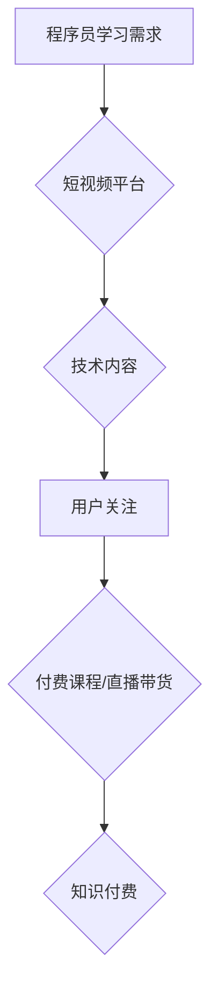

                 

## 如何利用短视频平台卖课：程序员版

> 关键词：短视频、在线教育、程序员、知识付费、内容营销、技术分享、直播教学、社群运营

## 1. 背景介绍

在当今数字化时代，互联网技术飞速发展，短视频平台作为信息传播的全新载体，迅速崛起，并成为内容消费的热门趋势。与此同时，程序员群体规模不断扩大，对技术学习的需求也日益增长。两者结合，为程序员打造了一个全新的知识付费平台——短视频卖课。

传统的在线教育模式往往以文字、音频、视频课程为主，缺乏互动性和趣味性，难以吸引年轻程序员的注意力。而短视频平台则以其碎片化、易于传播、互动性强的特点，能够更有效地触达目标用户，激发他们的学习兴趣。

## 2. 核心概念与联系

### 2.1 短视频卖课模式

短视频卖课模式是指利用短视频平台发布技术内容，吸引用户关注，并通过付费课程、直播带货、会员体系等方式实现知识付费。

### 2.2 程序员学习需求

程序员学习需求主要体现在以下几个方面：

* **技能提升:** 程序员需要不断学习新技术、掌握新工具，以适应行业发展和自身职业晋升。
* **项目实战:** 程序员需要通过实际项目实践，巩固理论知识，提升解决实际问题的能力。
* **技术交流:** 程序员需要与同行交流学习，分享经验，共同进步。

### 2.3 短视频平台优势

短视频平台拥有以下优势，使其成为程序员卖课的理想平台：

* **用户规模庞大:** 短视频平台拥有海量的用户群体，其中包括大量的程序员。
* **传播速度快:** 短视频内容传播速度快，能够快速触达目标用户。
* **互动性强:** 短视频平台支持评论、点赞、分享等互动功能，能够增强用户参与度。
* **内容形式多样:** 短视频平台支持多种内容形式，例如视频教程、技术分享、项目案例等。

**Mermaid 流程图**



## 3. 核心算法原理 & 具体操作步骤

### 3.1 算法原理概述

短视频卖课的核心算法原理在于利用数据分析和推荐算法，精准匹配用户需求和课程内容，提高用户转化率。

### 3.2 算法步骤详解

1. **用户画像构建:** 通过用户行为数据，例如观看记录、点赞评论、关注列表等，构建用户画像，分析用户的兴趣爱好、技术水平、学习目标等。
2. **课程内容分析:** 对课程内容进行分析，提取关键词、标签、技术领域等信息，构建课程知识图谱。
3. **推荐算法:** 基于用户画像和课程内容分析结果，采用协同过滤、内容过滤、深度学习等推荐算法，推荐符合用户需求的课程内容。
4. **个性化推送:** 根据用户的学习进度、反馈情况等，进行个性化推送，提高用户学习体验。
5. **数据反馈:** 收集用户学习数据，反馈到算法模型中，不断优化推荐算法，提升推荐精准度。

### 3.3 算法优缺点

**优点:**

* **精准推荐:** 能够根据用户需求精准推荐课程内容，提高用户转化率。
* **个性化学习:** 提供个性化学习路径，满足不同用户需求。
* **数据驱动:** 基于数据分析，不断优化算法模型，提升推荐效果。

**缺点:**

* **数据依赖:** 算法效果依赖于数据质量和用户行为数据量。
* **算法复杂:** 推荐算法模型复杂，需要专业的技术人员进行开发和维护。
* **用户隐私:** 数据收集和分析需要考虑用户隐私保护问题。

### 3.4 算法应用领域

短视频卖课的推荐算法广泛应用于以下领域:

* **在线教育:** 推荐课程、学习资源、学习计划等。
* **电商平台:** 推荐商品、优惠券、促销活动等。
* **社交媒体:** 推荐好友、话题、内容等。

## 4. 数学模型和公式 & 详细讲解 & 举例说明

### 4.1 数学模型构建

推荐算法模型通常采用协同过滤或内容过滤方法。

**协同过滤:** 基于用户对相似物品的评分或行为数据，预测用户对未评分或未交互的物品的兴趣。

**内容过滤:** 基于物品的特征和用户偏好，预测用户对物品的兴趣。

### 4.2 公式推导过程

**协同过滤:**

* **用户相似度计算:** 使用余弦相似度或皮尔逊相关系数计算用户之间的相似度。

$$
\text{相似度}(u_i, u_j) = \frac{\sum_{k=1}^{n} (r_{ik} - \bar{r}_i)(r_{jk} - \bar{r}_j)}{\sqrt{\sum_{k=1}^{n} (r_{ik} - \bar{r}_i)^2} \sqrt{\sum_{k=1}^{n} (r_{jk} - \bar{r}_j)^2}}
$$

* **预测评分:** 使用用户相似度加权平均预测用户对物品的评分。

$$
\hat{r}_{ui} = \frac{\sum_{j \in N(i)} \text{相似度}(u_i, u_j) \cdot r_{uj}}{\sum_{j \in N(i)} \text{相似度}(u_i, u_j)}
$$

**内容过滤:**

* **物品特征向量:** 将物品的特征转换为向量形式。
* **用户偏好向量:** 将用户的偏好转换为向量形式。
* **预测评分:** 使用点积计算物品特征向量和用户偏好向量的内积。

$$
\hat{r}_{ui} = \mathbf{v}_i \cdot \mathbf{u}_i
$$

### 4.3 案例分析与讲解

假设有一个短视频平台，用户 A 和用户 B 都喜欢编程技术，用户 A 对 Python 课程感兴趣，用户 B 对 Java 课程感兴趣。

使用协同过滤算法，可以根据用户 A 和用户 B 的观看记录和点赞行为，计算出他们之间的相似度。如果相似度较高，则可以推荐用户 A 观看用户 B 喜欢的 Java 课程，反之亦然。

## 5. 项目实践：代码实例和详细解释说明

### 5.1 开发环境搭建

* **操作系统:** Windows/macOS/Linux
* **编程语言:** Python
* **框架:** Flask/Django
* **数据库:** MySQL/PostgreSQL
* **工具:** Git、Docker

### 5.2 源代码详细实现

```python
# Flask 框架示例代码

from flask import Flask, render_template

app = Flask(__name__)

@app.route('/')
def index():
    return render_template('index.html')

if __name__ == '__main__':
    app.run(debug=True)
```

**代码解读:**

* 创建一个 Flask 应用实例。
* 定义一个路由 `/`，返回 `index.html` 模板页面。
* 启动 Flask 应用。

### 5.3 代码解读与分析

* Flask 框架是一个轻量级的 Python Web 框架，易于学习和使用。
* `render_template()` 函数用于渲染 HTML 模板。
* `debug=True` 参数开启调试模式，方便开发和调试。

### 5.4 运行结果展示

运行上述代码，访问 `http://127.0.0.1:5000/`，即可看到 Flask 应用的首页。

## 6. 实际应用场景

### 6.1 程序员知识付费平台

* **课程内容:** 提供编程语言、框架、工具、算法、数据结构等方面的课程。
* **付费模式:** 付费课程、直播带货、会员体系等。
* **平台优势:** 

    * **精准推荐:** 根据用户需求推荐课程内容。
    * **互动学习:** 提供在线答疑、社区讨论等互动功能。
    * **技术社区:** 建立技术社区，促进程序员交流学习。

### 6.2 技术博客与视频分享

* **内容形式:** 技术博客文章、视频教程、项目案例分享等。
* **盈利模式:** 广告收入、赞助、会员订阅等。
* **平台优势:** 

    * **内容深度:** 提供高质量的技术内容，满足程序员的学习需求。
    * **个人品牌:** 建立个人品牌，提升知名度和影响力。
    * **技术交流:** 与读者互动交流，分享技术经验。

### 6.3 企业技术培训

* **培训内容:** 公司内部技术培训、新技术学习、技能提升等。
* **培训模式:** 线上直播、录播课程、线下培训等。
* **平台优势:** 

    * **定制化培训:** 根据企业需求定制培训内容。
    * **高效学习:** 线上培训模式，提高学习效率。
    * **知识沉淀:** 将企业技术知识沉淀下来，方便知识共享。

### 6.4 未来应用展望

* **人工智能技术:** 利用人工智能技术，实现更精准的课程推荐、个性化的学习路径、智能化的答疑系统等。
* **虚拟现实技术:** 利用虚拟现实技术，打造沉浸式的学习体验，例如虚拟实验室、模拟项目场景等。
* **元宇宙技术:** 利用元宇宙技术，构建虚拟的学习社区，实现程序员之间的互动交流、协同学习等。

## 7. 工具和资源推荐

### 7.1 学习资源推荐

* **在线学习平台:** Coursera、edX、Udemy、Udacity
* **技术博客:** CSDN、博客园、SegmentFault
* **开源社区:** GitHub、GitLab、Bitbucket

### 7.2 开发工具推荐

* **代码编辑器:** VS Code、Sublime Text、Atom
* **版本控制工具:** Git
* **云平台:** AWS、Azure、GCP

### 7.3 相关论文推荐

* **推荐系统:**

    * "Collaborative Filtering for Implicit Feedback Datasets"
    * "Matrix Factorization Techniques for Recommender Systems"

* **深度学习:**

    * "Deep Learning"
    * "Generative Adversarial Networks"

## 8. 总结：未来发展趋势与挑战

### 8.1 研究成果总结

短视频卖课模式为程序员提供了便捷高效的学习方式，并推动了技术内容的传播和分享。

### 8.2 未来发展趋势

* **个性化学习:** 利用人工智能技术，提供更精准的课程推荐和个性化的学习路径。
* **沉浸式体验:** 利用虚拟现实技术，打造沉浸式的学习体验。
* **元宇宙学习:** 利用元宇宙技术，构建虚拟的学习社区，实现程序员之间的互动交流、协同学习等。

### 8.3 面临的挑战

* **内容质量:** 确保课程内容的质量和权威性。
* **用户体验:** 提升用户学习体验，提高用户粘性。
* **商业模式:** 探索可持续的商业模式，实现平台盈利。

### 8.4 研究展望

未来，短视频卖课模式将继续发展，并与人工智能、虚拟现实、元宇宙等新技术融合，为程序员提供更优质的学习体验。


## 9. 附录：常见问题与解答

**常见问题:**

* **如何选择合适的短视频平台？**

**解答:** 

选择短视频平台需要考虑平台用户规模、内容生态、技术支持等因素。

* **如何制作高质量的短视频课程？**

**解答:** 

制作高质量的短视频课程需要注重内容策划、画面制作、音频效果等方面。

* **如何推广短视频课程？**

**解答:** 

推广短视频课程可以通过平台推荐、社群运营、付费广告等方式。


作者：禅与计算机程序设计艺术 / Zen and the Art of Computer Programming 
<end_of_turn>

