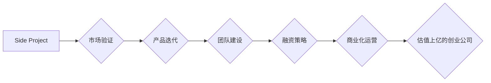

                 

## 如何将Side Project转化为估值上亿的创业公司

> 关键词：Side Project, 创业公司, 技术产品, 市场验证, 团队建设, 融资策略, 产品迭代, 用户增长

### 1. 背景介绍

在当今科技飞速发展的时代，Side Project（兼职项目）已成为许多程序员、设计师和创业者探索新想法、积累经验和实现梦想的重要途径。 然而，将一个Side Project发展成为估值上亿的创业公司，并非易事。 

这需要具备清晰的战略规划、敏锐的市场洞察力、强大的执行力以及持续的创新能力。 本文将从多个方面探讨如何将Side Project转化为成功的创业公司，为有志于创业的开发者提供宝贵的经验和指导。

### 2. 核心概念与联系

**2.1 核心概念**

* **Side Project:** 指个人在业余时间进行的项目，通常具有探索性、学习性或创业性的目的。
* **创业公司:** 以商业化为目标，致力于解决特定问题或满足特定需求，并通过产品或服务创造价值的组织。
* **估值:** 指公司价值的评估，通常以货币单位表示，反映了公司未来的盈利能力和成长潜力。

**2.2 联系**

将Side Project转化为创业公司，本质上是将个人兴趣和技能转化为商业价值的过程。 

需要将Side Project的核心价值 proposition（核心价值主张）清晰地定义，并将其与市场需求相匹配。 

同时，需要建立专业的团队、制定有效的商业模式和融资策略，最终实现公司规模化发展和商业化成功。

**2.3 Mermaid 流程图**

### 3. 核心算法原理 & 具体操作步骤

**3.1 算法原理概述**

将Side Project转化为创业公司，需要遵循一个类似于算法的步骤，每个步骤都具有特定的原理和操作方法。 

* **市场验证:** 通过调研、用户访谈等方式，验证市场对Side Project的需求和价值。
* **产品迭代:** 根据市场反馈，不断改进和完善产品功能，提升用户体验。
* **团队建设:** 构建一支专业的团队，具备技术、运营、市场等方面的能力。
* **融资策略:** 制定合理的融资计划，获得资金支持，推动公司发展。
* **商业化运营:** 建立有效的商业模式，实现公司盈利和可持续发展。

**3.2 算法步骤详解**

1. **市场验证:** 

    * 确定目标用户群体，了解他们的需求和痛点。
    * 进行市场调研，分析竞争对手和市场趋势。
    * 通过用户访谈、问卷调查等方式，收集用户反馈。
    * 评估市场规模和增长潜力，判断Side Project的可行性。

2. **产品迭代:**

    * 根据市场验证结果，确定产品功能和定位。
    * 开发最小可行产品（MVP），快速验证市场需求。
    * 收集用户反馈，进行产品迭代和优化。
    * 持续改进产品功能和用户体验，提升产品竞争力。

3. **团队建设:**

    * 确定团队成员的职责和分工。
    * 招募具备专业技能和创业精神的团队成员。
    * 建立良好的团队文化和沟通机制。
    * 培养团队成员的协作能力和创新能力。

4. **融资策略:**

    * 制定合理的融资计划，确定融资目标和融资方式。
    * 寻找合适的投资人，进行融资谈判。
    * 确保融资资金的合理使用和回报。

5. **商业化运营:**

    * 建立有效的商业模式，确定收入来源和成本控制。
    * 推广产品和服务，拓展市场份额。
    * 提供优质的客户服务，提升用户满意度。
    * 持续优化运营流程，提高运营效率。

**3.3 算法优缺点**

* **优点:** 

    * 逻辑清晰，步骤明确，易于理解和执行。
    * 强调市场验证和用户反馈，提高产品成功率。
    * 关注团队建设和融资策略，为公司发展提供保障。

* **缺点:** 

    * 算法过于简单，无法应对复杂和动态的市场环境。
    * 缺乏对创新和创意的重视，可能导致产品缺乏竞争力。
    * 忽略了个人因素和外部环境的影响，可能导致计划难以实施。

**3.4 算法应用领域**

该算法适用于所有类型的Side Project，包括但不限于：

* 软件开发
* 移动应用开发
* Web 网站开发
* 数据分析
* AI 算法开发
* 新材料研发

### 4. 数学模型和公式 & 详细讲解 & 举例说明

**4.1 数学模型构建**

将Side Project转化为创业公司是一个复杂的系统，可以构建一个数学模型来描述其发展过程。 

该模型可以包含以下变量：

* **市场需求 (M):** 目标用户群体的需求量和支付意愿。
* **产品价值 (P):** 产品的功能、性能和用户体验带来的价值。
* **竞争优势 (C):** 产品相对于竞争对手的独特优势。
* **团队能力 (T):** 团队成员的技能、经验和协作能力。
* **融资规模 (F):** 公司获得的资金支持。

**4.2 公式推导过程**

可以将公司估值 (V) 定义为以下公式：

$$V = f(M, P, C, T, F)$$

其中，f() 是一个复杂的函数，代表公司估值与上述变量之间的关系。 

该函数的具体形式取决于具体的行业、市场环境和公司发展阶段。

**4.3 案例分析与讲解**

假设一家开发移动应用的创业公司，其市场需求 (M) 为 100 万用户，产品价值 (P) 为 10 美元/用户，竞争优势 (C) 为 20%，团队能力 (T) 为 4 分，融资规模 (F) 为 100 万美元。 

根据上述公式，可以计算出该公司的估值 (V)。 

需要注意的是，该公式只是一个简化的模型，实际估值过程更加复杂，需要考虑更多的因素。

### 5. 项目实践：代码实例和详细解释说明

**5.1 开发环境搭建**

* 选择合适的编程语言和框架，例如 Python、Node.js、React 等。
* 安装必要的软件和工具，例如 IDE、版本控制系统、数据库管理工具等。
* 设置开发环境变量和配置参数。

**5.2 源代码详细实现**

* 编写代码实现产品的核心功能，例如用户注册、登录、数据处理、算法计算等。
* 使用测试框架进行单元测试和集成测试，确保代码质量。
* 遵循代码规范和风格指南，提高代码可读性和维护性。

**5.3 代码解读与分析**

* 详细解释代码的逻辑结构和功能实现。
* 分析代码的性能和效率，优化代码结构和算法。
* 编写代码文档，方便其他开发者理解和维护代码。

**5.4 运行结果展示**

* 部署代码到测试环境，进行功能测试和性能测试。
* 收集测试数据和用户反馈，分析测试结果。
* 根据测试结果进行代码修改和优化，最终发布稳定版本。

### 6. 实际应用场景

**6.1 应用场景举例**

* **人工智能:** 将Side Project开发的AI算法应用于图像识别、自然语言处理、机器翻译等领域。
* **大数据分析:** 将Side Project开发的数据分析工具应用于商业智能、市场营销、风险管理等领域。
* **物联网:** 将Side Project开发的物联网设备应用于智能家居、智能交通、智能农业等领域。

**6.2 未来应用展望**

随着科技的不断发展，Side Project将有更多机会被应用于新的领域，例如：

* **元宇宙:** 开发元宇宙相关的虚拟现实、增强现实和区块链应用。
* **Web3:** 开发去中心化应用、加密货币和智能合约。
* **量子计算:** 开发量子计算算法和应用。

### 7. 工具和资源推荐

**7.1 学习资源推荐**

* **在线课程:** Coursera、edX、Udemy 等平台提供丰富的技术课程。
* **书籍:** 《编程之美》、《设计模式》、《算法导论》等经典书籍。
* **博客和论坛:** Hacker News、Stack Overflow、Medium 等平台提供技术资讯和社区讨论。

**7.2 开发工具推荐**

* **IDE:** Visual Studio Code、IntelliJ IDEA、Eclipse 等。
* **版本控制系统:** Git、GitHub、GitLab 等。
* **数据库管理工具:** MySQL Workbench、PostgreSQL、MongoDB Compass 等。

**7.3 相关论文推荐**

* **人工智能:** 《深度学习》、《强化学习原理与算法》等。
* **大数据分析:** 《大数据技术与应用》、《数据挖掘与机器学习》等。
* **物联网:** 《物联网技术与应用》、《嵌入式系统设计》等。

### 8. 总结：未来发展趋势与挑战

**8.1 研究成果总结**

将Side Project转化为估值上亿的创业公司是一个复杂的过程，需要多方面的努力和投入。 

通过市场验证、产品迭代、团队建设、融资策略和商业化运营等步骤，可以提高Side Project成功的概率。

**8.2 未来发展趋势**

未来，Side Project将更加注重创新和创意，并与新兴技术如人工智能、区块链、元宇宙等深度融合。 

创业者需要不断学习和探索，才能抓住新的机遇。

**8.3 面临的挑战**

将Side Project转化为创业公司面临着许多挑战，例如：

* **市场竞争:** 竞争日益激烈，需要不断创新和提升产品竞争力。
* **融资难:** 融资环境复杂，需要具备优秀的融资能力。
* **团队建设:** 构建一支高效的团队，是创业成功的关键。

**8.4 研究展望**

未来研究将更加关注Side Project的创新模式、商业化策略和团队管理方法，为创业者提供更有效的指导和支持。

### 9. 附录：常见问题与解答

**9.1 如何进行市场验证？**

* 通过调研、用户访谈、问卷调查等方式，了解目标用户群体的需求和痛点。
* 分析竞争对手和市场趋势，评估市场规模和增长潜力。

**9.2 如何进行产品迭代？**

* 开发最小可行产品（MVP），快速验证市场需求。
* 收集用户反馈，进行产品改进和优化。
* 持续迭代产品功能和用户体验，提升产品竞争力。

**9.3 如何构建团队？**

* 确定团队成员的职责和分工。
* 招募具备专业技能和创业精神的团队成员。
* 建立良好的团队文化和沟通机制。

**9.4 如何进行融资？**

* 制定合理的融资计划，确定融资目标和融资方式。
* 寻找合适的投资人，进行融资谈判。
* 确保融资资金的合理使用和回报。

作者：禅与计算机程序设计艺术 / Zen and the Art of Computer Programming 
<end_of_turn>

