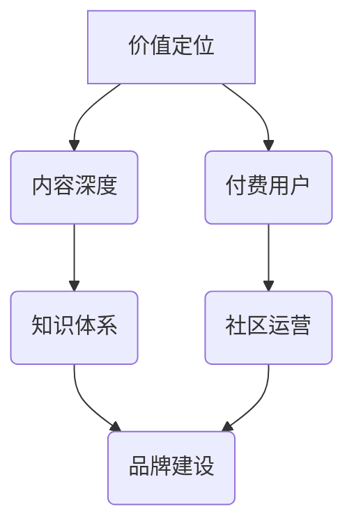

                 

## 如何打造高客单价的程序员知识产品

> 关键词：程序员知识产品、高客单价、价值定位、内容深度、知识体系、付费用户、社区运营、品牌建设

## 1. 背景介绍

程序员知识产品市场近年来蓬勃发展，从在线课程到书籍、博客到开源项目，各种形式的知识产品层出不穷。然而，在激烈的市场竞争中，如何打造高客单价的程序员知识产品，成为众多创作者和企业面临的挑战。

高客单价的程序员知识产品，不仅意味着更高的收入，更代表着产品本身的价值得到了充分认可。它意味着产品能够解决用户真实痛点，提供独到见解和实用的技能，并建立起长期的用户粘性。

## 2. 核心概念与联系

打造高客单价的程序员知识产品，需要从以下几个核心概念入手：

* **价值定位**: 明确产品所提供的价值，并将其与目标用户的需求和痛点相匹配。
* **内容深度**: 提供高质量、深入、有价值的内容，而非肤浅的表面知识。
* **知识体系**: 将知识点进行系统化、结构化的梳理，形成完整的知识体系，方便用户学习和理解。
* **付费用户**: 构建付费用户群体，并提供优质的服务和支持，以提升用户体验和忠诚度。
* **社区运营**: 建立活跃的社区，促进用户之间的交流和互动，形成知识共享和共同进步的氛围。
* **品牌建设**: 打造独特的品牌形象和声誉，提升产品在市场中的竞争力。

这些核心概念相互关联，共同构成了打造高客单价程序员知识产品的关键要素。

## 3. 核心算法原理 & 具体操作步骤

### 3.1  算法原理概述

打造高客单价程序员知识产品，本质上是一种算法优化问题。我们需要通过一系列步骤，将知识转化为用户能够理解和吸收的价值，并将其转化为付费行为。

### 3.2  算法步骤详解

1. **需求分析**: 深入了解目标用户的需求和痛点，明确他们想要解决的问题和学习的目标。
2. **内容策划**: 根据需求分析结果，策划高质量、深入、有价值的内容，并将其组织成完整的知识体系。
3. **知识结构化**: 将知识点进行分类、归纳、关联，形成清晰的知识结构，方便用户学习和理解。
4. **内容创作**: 根据知识结构，创作高质量的学习内容，包括文字、视频、音频、代码等多种形式。
5. **平台搭建**: 选择合适的平台，搭建知识产品的线上销售和交付系统。
6. **用户运营**: 通过社区运营、活动推广等方式，吸引用户关注和参与，并提供优质的服务和支持。
7. **数据分析**: 收集用户数据，分析用户行为和反馈，不断优化产品内容和运营策略。

### 3.3  算法优缺点

* **优点**: 能够有效地将知识转化为价值，并提升用户体验和付费意愿。
* **缺点**: 需要投入大量的时间和精力进行需求分析、内容策划和用户运营。

### 3.4  算法应用领域

该算法适用于所有类型的程序员知识产品，包括在线课程、书籍、博客、开源项目等。

## 4. 数学模型和公式 & 详细讲解 & 举例说明

### 4.1  数学模型构建

我们可以用一个简单的数学模型来描述高客单价程序员知识产品的价值：

$$Value = Content Depth * Knowledge Structure * User Engagement$$

其中：

* **Content Depth**: 内容深度，指内容的质量、深度和实用性。
* **Knowledge Structure**: 知识结构，指知识体系的清晰度、完整性和易懂性。
* **User Engagement**: 用户参与度，指用户对产品的关注度、参与度和忠诚度。

### 4.2  公式推导过程

该公式的推导过程基于以下假设：

* 用户愿意为高质量、有价值的内容付费。
* 用户更容易理解和吸收结构化、清晰的知识体系。
* 用户参与度越高，对产品的价值感知越强，付费意愿也越高。

### 4.3  案例分析与讲解

例如，一个深度讲解机器学习算法的在线课程，其内容深度较高，知识结构清晰，并提供丰富的实践案例和社区支持，因此其价值较高，能够吸引付费用户。

## 5. 项目实践：代码实例和详细解释说明

### 5.1  开发环境搭建

为了打造高客单价的程序员知识产品，需要搭建一个完善的开发环境，包括：

* **代码编辑器**: 选择一款功能强大、易于使用的代码编辑器，例如VS Code、Sublime Text等。
* **版本控制系统**: 使用Git等版本控制系统，管理代码版本和协作开发。
* **云平台**: 选择合适的云平台，例如AWS、Azure、GCP等，部署和运行知识产品。

### 5.2  源代码详细实现

具体代码实现取决于知识产品的类型和功能，例如：

* **在线课程**: 需要实现课程内容的上传、管理、播放、互动等功能。
* **书籍**: 需要实现书籍内容的排版、格式化、出版等功能。
* **博客**: 需要实现文章发布、评论、分享等功能。

### 5.3  代码解读与分析

代码解读和分析需要根据具体代码实现进行，重点关注以下几个方面：

* **代码结构**: 代码是否清晰、易懂、易维护？
* **算法效率**: 算法是否高效，能够满足用户需求？
* **安全性**: 代码是否安全可靠，能够防止攻击和漏洞？

### 5.4  运行结果展示

运行结果展示需要根据知识产品的类型进行，例如：

* **在线课程**: 展示课程内容的播放效果、互动功能等。
* **书籍**: 展示书籍的排版效果、阅读体验等。
* **博客**: 展示文章的发布效果、评论互动等。

## 6. 实际应用场景

高客单价程序员知识产品在实际应用场景中具有广泛的应用前景，例如：

* **企业培训**: 企业可以利用高客单价知识产品，为员工提供专业技能培训，提升员工素质和竞争力。
* **个人学习**: 程序员可以利用高客单价知识产品，学习新技术、提升技能，实现职业发展。
* **开源社区**: 开源社区可以利用高客单价知识产品，为开发者提供更深入的学习资源，促进开源项目的开发和推广。

### 6.4  未来应用展望

未来，随着人工智能、虚拟现实等技术的不断发展，高客单价程序员知识产品的应用场景将更加广泛，例如：

* **个性化学习**: 基于人工智能技术，为用户提供个性化的学习方案和内容推荐。
* **沉浸式学习**: 利用虚拟现实技术，打造沉浸式的学习环境，提升用户学习体验。
* **远程协作**: 利用云计算技术，实现远程协作学习，打破地域限制。

## 7. 工具和资源推荐

### 7.1  学习资源推荐

* **Coursera**: 提供各种在线课程，涵盖计算机科学、数据科学、人工智能等领域。
* **Udacity**: 提供以项目为中心的在线课程，帮助用户掌握实战技能。
* **edX**: 提供来自世界知名大学的在线课程，涵盖各种学科。

### 7.2  开发工具推荐

* **VS Code**: 功能强大的代码编辑器，支持多种编程语言和扩展插件。
* **Sublime Text**: 轻量级、高效的代码编辑器，拥有丰富的插件生态系统。
* **Git**: 强大的版本控制系统，用于管理代码版本和协作开发。

### 7.3  相关论文推荐

* **Deep Learning**: 由Ian Goodfellow、Yoshua Bengio和Aaron Courville撰写的深度学习经典著作。
* **The Elements of Programming Interviews**: 由 Adnan Aziz、Amit Prakash、和Tsung-Hsien Lee撰写的编程面试经典书籍。
* **Clean Code**: 由Robert C. Martin撰写的代码规范经典书籍。

## 8. 总结：未来发展趋势与挑战

### 8.1  研究成果总结

打造高客单价程序员知识产品，需要从价值定位、内容深度、知识体系、付费用户、社区运营、品牌建设等多个方面入手，并不断优化算法和策略。

### 8.2  未来发展趋势

未来，高客单价程序员知识产品的趋势将更加注重个性化、沉浸式、远程协作等体验，并与人工智能、虚拟现实等新技术深度融合。

### 8.3  面临的挑战

打造高客单价程序员知识产品面临着诸多挑战，例如：

* **内容更新**: 需要不断更新内容，以满足用户不断变化的需求。
* **用户运营**: 需要建立活跃的社区，并提供优质的服务和支持。
* **市场竞争**: 需要在激烈的市场竞争中保持竞争力。

### 8.4  研究展望

未来，需要进一步研究高客单价程序员知识产品的算法优化、用户体验提升、市场推广等方面，以推动该领域的持续发展。

## 9. 附录：常见问题与解答

* **如何确定知识产品的价值定位？**: 通过深入了解目标用户的需求和痛点，明确他们想要解决的问题和学习的目标。
* **如何提高知识产品的深度和实用性？**: 提供深入的理论知识、丰富的实践案例、实用的技能指导等。
* **如何建立活跃的社区？**: 通过举办线上线下活动、提供优质的服务和支持、鼓励用户互动交流等方式。

作者：禅与计算机程序设计艺术 / Zen and the Art of Computer Programming 
<end_of_turn>

