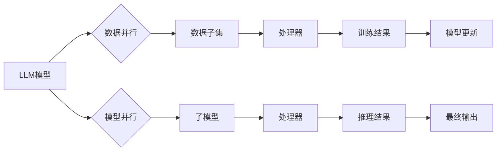

                 

## 并行AI：LLM的多线程处理能力

> 关键词：LLM, 多线程, 并行处理, 效率提升, 计算资源, 性能优化, 深度学习, 自然语言处理

## 1. 背景介绍

近年来，大型语言模型（LLM）在自然语言处理（NLP）领域取得了令人瞩目的成就。从文本生成、翻译到问答和代码编写，LLM展现出强大的能力，深刻地改变了我们与人工智能的交互方式。然而，LLM的训练和推理过程通常需要消耗大量的计算资源和时间，这限制了其在实际应用中的推广和普及。

为了解决这一瓶颈，并行处理技术成为了LLM发展的重要方向。通过将任务分解成多个子任务，并分别在不同的处理器上进行计算，可以显著提高LLM的训练和推理效率。本文将深入探讨LLM的多线程处理能力，分析其核心概念、算法原理、实践应用以及未来发展趋势。

## 2. 核心概念与联系

### 2.1 多线程处理

多线程处理是一种并行处理技术，它允许一个程序同时执行多个任务。每个任务被称为一个线程，每个线程拥有自己的执行栈和局部变量，可以独立运行。通过利用多核处理器或多线程环境，可以将任务分配给不同的线程，从而提高程序的整体执行效率。

### 2.2 LLM并行处理

在LLM领域，多线程处理主要应用于以下两个方面：

* **模型并行:** 将一个大型模型拆分成多个子模型，分别在不同的处理器上进行训练或推理。
* **数据并行:** 将训练数据分割成多个子集，分别在不同的处理器上进行处理。

### 2.3 架构图



## 3. 核心算法原理 & 具体操作步骤

### 3.1 算法原理概述

LLM的多线程处理主要基于以下算法原理：

* **任务分解:** 将大型任务分解成多个独立的子任务，每个子任务可以由一个线程独立处理。
* **数据分配:** 将数据分配给不同的线程，每个线程负责处理一部分数据。
* **结果汇总:** 将各个线程处理的结果汇总，得到最终的输出结果。

### 3.2 算法步骤详解

1. **任务分解:** 根据LLM的训练或推理过程，将任务分解成多个子任务。例如，在文本生成任务中，可以将文本分解成多个句子，每个句子由一个线程处理。
2. **数据分配:** 将训练数据或推理输入数据分配给不同的线程。每个线程负责处理一部分数据，并进行相应的计算。
3. **并行计算:** 每个线程独立运行，并行处理其分配的数据。
4. **结果汇总:** 各个线程处理完成后，将结果汇总，得到最终的输出结果。

### 3.3 算法优缺点

**优点:**

* **提高效率:** 通过并行处理，可以显著提高LLM的训练和推理速度。
* **利用资源:** 可以充分利用多核处理器或多线程环境的计算资源。
* **扩展性:** 可以根据需要增加线程数量，提高处理能力。

**缺点:**

* **复杂性:** 实现多线程处理需要考虑线程同步、数据共享等问题，增加了程序的复杂度。
* **开销:** 创建和管理线程需要消耗一定的系统资源。

### 3.4 算法应用领域

LLM的多线程处理技术广泛应用于以下领域：

* **自然语言理解:** 文本分类、情感分析、问答系统等。
* **自然语言生成:** 文本摘要、机器翻译、对话系统等。
* **代码生成:** 代码补全、代码生成、代码翻译等。
* **图像识别:** 图像分类、目标检测、图像分割等。

## 4. 数学模型和公式 & 详细讲解 & 举例说明

### 4.1 数学模型构建

LLM的多线程处理可以抽象为一个并行计算模型，其中每个线程代表一个计算单元，数据流代表计算过程中的数据传递。

假设一个LLM模型有N个参数，需要进行M次迭代训练。每个线程负责处理模型参数的子集，并独立进行计算。

### 4.2 公式推导过程

设每个线程处理的参数数量为n，则每个线程需要进行M/k次迭代训练，其中k为线程数量。

训练时间可以表示为：

$$T = \frac{M}{k} \times t$$

其中t为每个线程处理一个参数的训练时间。

### 4.3 案例分析与讲解

假设一个LLM模型有1000万个参数，需要进行1000次迭代训练。如果使用4个线程进行并行处理，则每个线程需要处理250万个参数，并进行250次迭代训练。

训练时间可以计算为：

$$T = \frac{1000}{4} \times t = 250 \times t$$

如果单线程训练时间为10小时，则使用4个线程并行处理，训练时间可以缩短到2.5小时。

## 5. 项目实践：代码实例和详细解释说明

### 5.1 开发环境搭建

* 操作系统：Linux/macOS
* Python版本：3.7+
* 深度学习框架：PyTorch/TensorFlow

### 5.2 源代码详细实现

```python
import torch
import torch.multiprocessing as mp

# 定义LLM模型
class LLM(torch.nn.Module):
    # ... 模型定义 ...

# 数据加载
data_loader = ...

# 定义训练函数
def train_step(model, data_loader):
    # ... 训练逻辑 ...

# 创建进程池
num_processes = mp.cpu_count()
process_pool = mp.Pool(processes=num_processes)

# 分配数据并并行训练
for i in range(num_processes):
    process_pool.apply_async(train_step, args=(model, data_loader))

# 关闭进程池
process_pool.close()
process_pool.join()
```

### 5.3 代码解读与分析

* 使用 `torch.multiprocessing` 库创建进程池，并行执行训练任务。
* `mp.cpu_count()` 获取可用CPU核心数量，动态分配进程数量。
* `process_pool.apply_async()` 将训练函数异步提交到进程池中执行。
* `process_pool.close()` 关闭进程池，不再接受新的任务。
* `process_pool.join()` 等待所有进程完成执行。

### 5.4 运行结果展示

通过并行处理，可以显著缩短LLM的训练时间，提高训练效率。

## 6. 实际应用场景

### 6.1 文本生成

在文本生成任务中，LLM可以并行处理多个句子，提高生成速度和效率。例如，在自动写作工具中，可以利用多线程处理生成多个段落，从而加快写作速度。

### 6.2 机器翻译

机器翻译任务通常需要处理大量文本数据，多线程处理可以显著提高翻译速度和效率。例如，在在线翻译工具中，可以利用多线程处理翻译多个句子，从而提供更快速的服务。

### 6.3 代码生成

代码生成任务需要处理复杂的代码逻辑，多线程处理可以提高代码生成速度和效率。例如，在代码补全工具中，可以利用多线程处理生成多个代码建议，从而提高用户体验。

### 6.4 未来应用展望

随着计算资源的不断发展，LLM的多线程处理能力将得到更广泛的应用。例如，可以利用多线程处理进行更复杂的LLM训练，例如训练更大规模的模型或进行更精细的微调。

## 7. 工具和资源推荐

### 7.1 学习资源推荐

* **书籍:**
    * Deep Learning by Ian Goodfellow, Yoshua Bengio, and Aaron Courville
    * Hands-On Machine Learning with Scikit-Learn, Keras & TensorFlow by Aurélien Géron
* **在线课程:**
    * Stanford CS231n: Convolutional Neural Networks for Visual Recognition
    * Deep Learning Specialization by Andrew Ng

### 7.2 开发工具推荐

* **深度学习框架:** PyTorch, TensorFlow
* **并行处理库:** multiprocessing, Dask
* **云计算平台:** AWS, Google Cloud, Azure

### 7.3 相关论文推荐

* **BERT: Pre-training of Deep Bidirectional Transformers for Language Understanding**
* **GPT-3: Language Models are Few-Shot Learners**
* **T5: Text-to-Text Transfer Transformer**

## 8. 总结：未来发展趋势与挑战

### 8.1 研究成果总结

LLM的多线程处理技术取得了显著的成果，显著提高了LLM的训练和推理效率。

### 8.2 未来发展趋势

* **模型并行:** 将LLM模型进一步拆分，并利用分布式计算平台进行训练。
* **数据并行:** 利用大规模数据并行处理技术，提高LLM的训练精度和泛化能力。
* **混合并行:** 结合模型并行和数据并行，实现更有效的LLM训练。

### 8.3 面临的挑战

* **模型复杂度:** 随着LLM模型规模的不断增长，并行处理的复杂度也随之增加。
* **数据分布:** 数据分布不均匀会导致并行处理效率下降。
* **硬件限制:** 计算资源的限制会影响LLM的并行处理能力。

### 8.4 研究展望

未来研究将重点关注以下方面：

* **开发更有效的并行处理算法:** 针对LLM模型的特殊结构和计算需求，开发更有效的并行处理算法。
* **解决数据分布问题:** 研究数据分布不均匀问题，并提出相应的解决方案。
* **探索新型硬件架构:** 研究新型硬件架构，例如GPU和TPU，以提高LLM的并行处理能力。

## 9. 附录：常见问题与解答

### 9.1 如何选择合适的并行处理策略？

选择合适的并行处理策略取决于LLM模型的规模、数据分布和硬件资源等因素。

### 9.2 如何评估并行处理的效率？

可以通过计算并行处理的加速比来评估效率。加速比是指单线程处理时间与并行处理时间之比。

### 9.3 如何解决并行处理中的数据同步问题？

可以使用锁、队列等机制来解决数据同步问题。


作者：禅与计算机程序设计艺术 / Zen and the Art of Computer Programming 
<end_of_turn>

