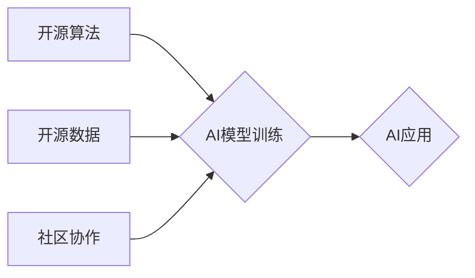

                 

## 开源技术推动AI进步的重要性

> 关键词：开源、人工智能、AI模型、算法、数据、社区、协作、创新、可持续发展

## 1. 背景介绍

人工智能（AI）正以惊人的速度发展，深刻地改变着我们生活的方方面面。从自动驾驶汽车到医疗诊断，从个性化推荐到自然语言处理，AI技术的应用场景日益广泛。然而，AI的发展离不开强大的算法、海量数据和持续的创新。开源技术在推动AI进步方面发挥着至关重要的作用，它为AI研究和应用提供了宝贵的资源和平台。

## 2. 核心概念与联系

### 2.1 开源技术

开源技术是指源代码公开可供任何人免费使用、修改和再发布的技术。开源软件的开发通常由社区驱动，鼓励协作和共同进步。

### 2.2 人工智能

人工智能是指模拟人类智能的计算机系统。AI系统能够学习、推理、解决问题和做出决策，就像人类一样。

### 2.3 关系

开源技术为AI的发展提供了以下关键支持：

* **算法共享:** 开源AI算法库，如TensorFlow、PyTorch和Scikit-learn，为研究人员和开发者提供了广泛的工具和资源，加速了AI算法的创新和应用。
* **数据开放:** 开源数据集，如ImageNet和MNIST，为AI模型的训练和测试提供了高质量的数据，推动了AI模型的性能提升。
* **社区协作:** 开源社区为AI研究和开发提供了平台，鼓励知识共享、问题解决和共同进步。

**Mermaid 流程图**



## 3. 核心算法原理 & 具体操作步骤

### 3.1 算法原理概述

深度学习是目前AI领域最热门的算法之一，它利用多层神经网络来模拟人类大脑的学习过程。深度学习算法能够从海量数据中自动提取特征，并学习复杂的模式，从而实现强大的AI能力。

### 3.2 算法步骤详解

1. **数据预处理:** 将原始数据转换为深度学习模型可以理解的格式，包括数据清洗、特征工程和数据归一化。
2. **网络结构设计:** 根据具体任务选择合适的深度学习网络结构，例如卷积神经网络（CNN）用于图像识别，循环神经网络（RNN）用于自然语言处理。
3. **模型训练:** 使用训练数据训练深度学习模型，通过调整模型参数来最小化模型预测误差。
4. **模型评估:** 使用测试数据评估模型的性能，例如准确率、召回率和F1-score。
5. **模型调优:** 根据评估结果调整模型参数和网络结构，进一步提高模型性能。
6. **模型部署:** 将训练好的模型部署到实际应用场景中，例如云平台、边缘设备或移动设备。

### 3.3 算法优缺点

**优点:**

* 能够从海量数据中自动提取特征，学习复杂的模式。
* 性能优异，在图像识别、自然语言处理等领域取得了突破性进展。

**缺点:**

* 训练数据量大，计算资源需求高。
* 模型解释性差，难以理解模型的决策过程。

### 3.4 算法应用领域

* **图像识别:** 人脸识别、物体检测、图像分类。
* **自然语言处理:** 机器翻译、文本摘要、情感分析。
* **语音识别:** 语音转文本、语音助手。
* **推荐系统:** 商品推荐、内容推荐。
* **医疗诊断:** 病情预测、疾病诊断。

## 4. 数学模型和公式 & 详细讲解 & 举例说明

### 4.1 数学模型构建

深度学习模型的核心是神经网络，它由多个层组成，每层包含多个神经元。神经元之间通过连接权重进行信息传递。

**神经网络模型**

$$
y = f(W_1x_1 + b_1)
$$

其中：

* $y$ 是输出值
* $x_1$ 是输入值
* $W_1$ 是连接权重
* $b_1$ 是偏置项
* $f$ 是激活函数

### 4.2 公式推导过程

深度学习模型的训练过程是通过反向传播算法来优化连接权重。反向传播算法的核心思想是：

1. 计算模型预测值与真实值的误差。
2. 根据误差反向传播，计算每个神经元的梯度。
3. 使用梯度下降算法更新连接权重，减小模型预测误差。

### 4.3 案例分析与讲解

**举例说明:**

假设我们有一个简单的线性回归模型，用于预测房价。输入特征包括房屋面积和房间数量，输出是房价。

**模型公式:**

$$
y = W_1x_1 + W_2x_2 + b
$$

其中：

* $y$ 是房价
* $x_1$ 是房屋面积
* $x_2$ 是房间数量
* $W_1$ 和 $W_2$ 是连接权重
* $b$ 是偏置项

**训练过程:**

1. 使用训练数据，计算模型预测值与真实值的误差。
2. 计算每个权重和偏置项的梯度。
3. 使用梯度下降算法更新权重和偏置项，减小模型预测误差。

## 5. 项目实践：代码实例和详细解释说明

### 5.1 开发环境搭建

* Python 3.x
* TensorFlow 或 PyTorch
* Jupyter Notebook

### 5.2 源代码详细实现

```python
import tensorflow as tf

# 定义模型
model = tf.keras.models.Sequential([
  tf.keras.layers.Dense(64, activation='relu', input_shape=(2,)),
  tf.keras.layers.Dense(1)
])

# 编译模型
model.compile(optimizer='adam', loss='mse')

# 训练模型
model.fit(x_train, y_train, epochs=10)

# 评估模型
loss = model.evaluate(x_test, y_test)
```

### 5.3 代码解读与分析

* **定义模型:** 使用 TensorFlow 的 Keras API 定义一个简单的多层感知机模型。
* **编译模型:** 使用 Adam 优化器和均方误差损失函数编译模型。
* **训练模型:** 使用训练数据训练模型，设置训练轮数为 10。
* **评估模型:** 使用测试数据评估模型的性能，并打印损失值。

### 5.4 运行结果展示

训练完成后，可以将模型应用于新的数据进行预测。

## 6. 实际应用场景

* **医疗诊断:** 使用深度学习模型分析医学图像，辅助医生诊断疾病。
* **金融风险评估:** 使用深度学习模型分析金融数据，识别潜在的风险。
* **智能客服:** 使用深度学习模型构建智能聊天机器人，提供客户服务。
* **自动驾驶:** 使用深度学习模型处理传感器数据，实现自动驾驶功能。

### 6.4 未来应用展望

* **个性化教育:** 使用深度学习模型提供个性化的学习方案。
* **精准农业:** 使用深度学习模型分析农业数据，提高农业生产效率。
* **科学发现:** 使用深度学习模型分析大数据，加速科学发现。

## 7. 工具和资源推荐

### 7.1 学习资源推荐

* **课程:** Coursera、edX、Udacity 等平台提供深度学习课程。
* **书籍:** 《深度学习》、《动手学深度学习》等书籍。
* **博客:** TensorFlow Blog、PyTorch Blog 等博客。

### 7.2 开发工具推荐

* **TensorFlow:** Google 开发的开源深度学习框架。
* **PyTorch:** Facebook 开发的开源深度学习框架。
* **Keras:** TensorFlow 的高层API，简化深度学习模型开发。

### 7.3 相关论文推荐

* **《ImageNet Classification with Deep Convolutional Neural Networks》**
* **《Attention Is All You Need》**
* **《BERT: Pre-training of Deep Bidirectional Transformers for Language Understanding》**

## 8. 总结：未来发展趋势与挑战

### 8.1 研究成果总结

开源技术为AI发展提供了强大的支持，促进了AI算法的创新、数据共享和社区协作。深度学习算法取得了突破性进展，在图像识别、自然语言处理等领域取得了显著成果。

### 8.2 未来发展趋势

* **模型规模和复杂度提升:** 未来AI模型将更加庞大，更加复杂，能够处理更复杂的任务。
* **数据安全和隐私保护:** 随着AI模型对数据的依赖性越来越高，数据安全和隐私保护将成为越来越重要的挑战。
* **AI伦理和社会影响:** AI技术的快速发展引发了伦理和社会影响方面的担忧，需要加强相关研究和讨论。

### 8.3 面临的挑战

* **计算资源需求:** 训练大型AI模型需要大量的计算资源，这对于资源有限的开发者和研究机构来说是一个挑战。
* **模型解释性和可信度:** 深度学习模型的决策过程难以理解，这降低了模型的可信度。
* **数据标注成本:** 训练高质量的AI模型需要大量的标注数据，数据标注成本高昂。

### 8.4 研究展望

* **高效的训练算法:** 研究更有效的训练算法，降低训练成本和时间。
* **可解释性AI:** 研究可解释性AI技术，提高模型的透明度和可信度。
* **联邦学习:** 研究联邦学习技术，解决数据隐私保护问题。

## 9. 附录：常见问题与解答

* **什么是开源技术？**

开源技术是指源代码公开可供任何人免费使用、修改和再发布的技术。

* **开源技术对AI发展有什么影响？**

开源技术为AI发展提供了以下关键支持：

* **算法共享:** 开源AI算法库，如TensorFlow、PyTorch和Scikit-learn，为研究人员和开发者提供了广泛的工具和资源，加速了AI算法的创新和应用。
* **数据开放:** 开源数据集，如ImageNet和MNIST，为AI模型的训练和测试提供了高质量的数据，推动了AI模型的性能提升。
* **社区协作:** 开源社区为AI研究和开发提供了平台，鼓励知识共享、问题解决和共同进步。

* **如何学习深度学习？**

可以参考以下资源：

* **课程:** Coursera、edX、Udacity 等平台提供深度学习课程。
* **书籍:** 《深度学习》、《动手学深度学习》等书籍。
* **博客:** TensorFlow Blog、PyTorch Blog 等博客。


作者：禅与计算机程序设计艺术 / Zen and the Art of Computer Programming 
<end_of_turn>

