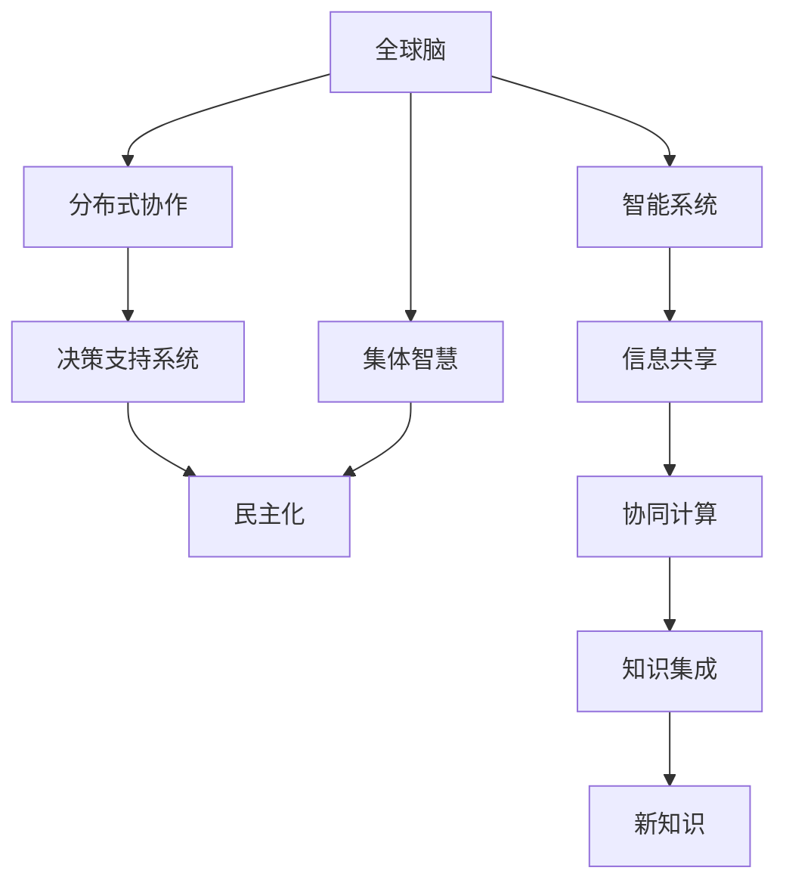

                 

# 全球脑与全球政治：集体智慧的民主化

> 关键词：全球脑,集体智慧,民主化,人工智能,分布式协作,决策支持

## 1. 背景介绍

### 1.1 问题由来

随着信息技术的飞速发展，人类社会的智能化水平达到了前所未有的高度。从物联网(IoT)到云计算，从大数据到人工智能，新的技术手段正在深刻改变人类的生产生活方式。特别是近年来，人工智能(AI)技术在自然语言处理(NLP)、计算机视觉、语音识别等领域的突破，使得机器能够处理和理解复杂的人类语言和图像信息，极大地拓展了人类智慧的外延。

然而，这种技术的进步也带来了新的挑战。一方面，机器学习模型的复杂性和可解释性问题，使得我们难以完全理解其决策机制，引发了广泛的伦理和安全担忧。另一方面，智能系统的高度集中化、不透明化，也加剧了全球资源分配不均和信息不对称，进一步加大了社会分化。因此，如何在人工智能时代实现民主化、公正化的集体智慧决策，成为了当前研究的前沿课题。

## 2. 核心概念与联系

### 2.1 核心概念概述

为了深入探讨这一课题，本节将介绍几个核心的概念及其相互联系：

- **全球脑**：指通过网络联接起来的智能系统和人类智慧的有机结合，能够实现信息的高效共享和协同计算。
- **集体智慧**：指借助分布式协作和机器学习技术，集合众多个体的知识和经验，产生超越个体能力的新知识和新解决方案。
- **民主化**：指通过透明、公正的决策过程，使更多的个体能够参与到智慧决策中来，提升决策的公平性和普适性。
- **分布式协作**：指在多节点、多用户的环境下，通过智能系统和网络技术实现资源的分布式共享和协同工作。
- **决策支持系统**：指利用AI技术，为人类决策提供辅助和支持的系统，涵盖从数据采集到分析，再到决策的全过程。

这些概念之间存在紧密联系，构成了人工智能时代集体智慧民主化的基础框架。

### 2.2 核心概念原理和架构的 Mermaid 流程图



此图展示了全球脑、集体智慧、分布式协作、决策支持系统与民主化之间的联系：

1. 全球脑通过智能系统和网络技术，实现信息共享和协同计算。
2. 集体智慧通过分布式协作，整合众多个体的知识和经验，产生新知识和新解决方案。
3. 决策支持系统利用AI技术，为人类决策提供辅助和支持。
4. 民主化通过透明、公正的决策过程，提升决策的公平性和普适性。

这一架构清晰地展现了智慧决策的完整链条，为实现集体智慧的民主化提供了理论基础。

## 3. 核心算法原理 & 具体操作步骤

### 3.1 算法原理概述

基于全球脑的集体智慧民主化，本质上是一个分布式协作和智能辅助的过程。其核心思想是：利用网络技术，将分散的智能资源进行有效整合，在人类的监督和指导下，通过机器学习算法优化集体智慧的产出过程。

具体来说，可以将这一过程分为以下步骤：

1. **数据采集与处理**：通过互联网和传感器，从不同来源收集数据，进行预处理和清洗，形成标准化数据集。
2. **智能系统部署**：在各地部署智能系统，进行数据分析和模型训练，形成集体智慧的核心组件。
3. **分布式协作机制**：通过区块链、共识算法等技术，实现分布式协作机制，确保系统公正透明。
4. **知识集成与优化**：通过协同计算，将各地智能系统的输出结果进行集成和优化，形成统一的智慧决策方案。
5. **透明化与民主化**：通过透明化的决策过程，确保更多人能够参与到决策中来，实现集体智慧的民主化。

### 3.2 算法步骤详解

1. **数据采集与处理**

   数据采集是集体智慧民主化的基础。在这一步骤中，需要采用多种传感器和互联网手段，从不同的来源收集数据，包括环境监测数据、医疗健康数据、社会经济数据等。这些数据需要进行预处理和清洗，确保数据的质量和一致性。常用的预处理技术包括数据清洗、去噪、归一化等。

2. **智能系统部署**

   智能系统的部署是集体智慧民主化的关键。在这一步骤中，需要在不同地区部署智能系统，进行数据分析和模型训练，形成集体智慧的核心组件。这些系统通常采用分布式计算和并行处理技术，确保计算效率和数据安全性。

3. **分布式协作机制**

   分布式协作机制是确保集体智慧民主化的重要手段。在这一步骤中，需要采用区块链、共识算法等技术，实现分布式协作机制，确保系统公正透明。这些技术可以有效地防止数据篡改和信息泄露，保障系统的安全性。

4. **知识集成与优化**

   知识集成与优化是集体智慧民主化的核心环节。在这一步骤中，需要通过协同计算，将各地智能系统的输出结果进行集成和优化，形成统一的智慧决策方案。常用的协同计算技术包括多代理系统、智能合约、分布式优化算法等。

5. **透明化与民主化**

   透明化与民主化是集体智慧民主化的最终目标。在这一步骤中，需要确保决策过程的透明性和公正性，使得更多人能够参与到决策中来。透明化可以通过开放数据接口、透明算法等技术实现，民主化可以通过问卷调查、民意投票等手段实现。

### 3.3 算法优缺点

基于全球脑的集体智慧民主化方法具有以下优点：

- **数据多样性**：通过全球脑技术，能够整合来自不同地区、不同类型的数据，提升数据的全面性和多样性。
- **协同计算效率**：分布式协作机制能够高效地进行数据和计算资源的整合，提升系统的处理能力。
- **透明与公正**：透明化和民主化措施能够确保决策过程的透明性和公正性，减少人为偏见。

同时，这一方法也存在一些局限性：

- **技术复杂性**：分布式协作和智能系统部署需要较高的技术门槛，对于非技术背景的参与者来说可能存在一定难度。
- **数据隐私**：全球脑技术涉及大量的数据传输和存储，可能面临数据隐私和安全风险。
- **系统安全性**：分布式协作机制可能面临网络攻击和恶意篡改的风险。

### 3.4 算法应用领域

基于全球脑的集体智慧民主化方法，已经在多个领域得到了应用，如：

- **环境监测与治理**：通过全球脑技术，整合各地环境监测数据，进行协同分析，制定环境治理方案。
- **公共卫生与应急响应**：通过全球脑技术，整合各地医疗健康数据，进行疾病预测和应急响应。
- **城市管理与规划**：通过全球脑技术，整合各地城市数据，进行智能交通、智慧城市的规划与建设。
- **金融风险管理**：通过全球脑技术，整合各地金融数据，进行风险评估和管理。
- **社会治理与决策支持**：通过全球脑技术，整合各地社会经济数据，进行政策制定和决策支持。

这些应用场景展示了全球脑技术在提升社会治理智能化、信息化水平方面的巨大潜力。

## 4. 数学模型和公式 & 详细讲解 & 举例说明

### 4.1 数学模型构建

在这一部分，我们将使用数学语言对基于全球脑的集体智慧民主化过程进行更加严格的刻画。

记全球脑系统为 $G=\{S, D, P\}$，其中 $S$ 为智能系统集，$D$ 为数据集，$P$ 为协作协议。假设智能系统 $s_i \in S$ 处理的数据为 $d_i \in D$，智能系统之间的协作协议为 $p \in P$。

定义智能系统的输出为 $y_i=s_i(d_i)$，输出结果的集成函数为 $f=\sum_{i=1}^n w_i y_i$，其中 $w_i$ 为系统 $s_i$ 的权重。

定义集体智慧的民主化函数为 $C=\frac{1}{N} \sum_{i=1}^N f_i$，其中 $N$ 为智能系统数量。

### 4.2 公式推导过程

以下是具体的数学推导过程：

设智能系统 $s_i$ 的数据集为 $d_i$，处理后的输出为 $y_i$，则有：

$$
y_i = s_i(d_i)
$$

定义智能系统 $s_i$ 的权重为 $w_i$，则其对集体智慧的贡献为：

$$
w_i y_i
$$

定义集体智慧的民主化函数为 $C$，则有：

$$
C = \frac{1}{N} \sum_{i=1}^N w_i y_i
$$

将上述公式代入 $C$，得：

$$
C = \frac{1}{N} \sum_{i=1}^N s_i(d_i)w_i
$$

这表明，集体智慧 $C$ 是智能系统 $s_i$ 处理数据 $d_i$ 后输出的加权和，权重 $w_i$ 反映了各智能系统的可信度和贡献。

### 4.3 案例分析与讲解

以环境监测与治理为例，展示全球脑技术的实际应用：

假设全球脑系统 $G$ 包含三个智能系统 $s_1, s_2, s_3$，分别部署在中国、美国和欧洲。这些系统通过互联网技术实时传输数据 $d_1, d_2, d_3$，并进行处理输出 $y_1, y_2, y_3$。

定义各系统的权重 $w_1=0.4, w_2=0.3, w_3=0.3$，则集体智慧 $C$ 为：

$$
C = \frac{1}{3} (0.4 y_1 + 0.3 y_2 + 0.3 y_3)
$$

通过这一公式，可以实时计算出全球范围内的环境监测数据，并进行协同分析，制定全球性的环境治理方案。

## 5. 项目实践：代码实例和详细解释说明

### 5.1 开发环境搭建

在进行项目实践前，我们需要准备好开发环境。以下是使用Python进行PyTorch开发的环境配置流程：

1. 安装Anaconda：从官网下载并安装Anaconda，用于创建独立的Python环境。

2. 创建并激活虚拟环境：
```bash
conda create -n pytorch-env python=3.8 
conda activate pytorch-env
```

3. 安装PyTorch：根据CUDA版本，从官网获取对应的安装命令。例如：
```bash
conda install pytorch torchvision torchaudio cudatoolkit=11.1 -c pytorch -c conda-forge
```

4. 安装Transformers库：
```bash
pip install transformers
```

5. 安装各类工具包：
```bash
pip install numpy pandas scikit-learn matplotlib tqdm jupyter notebook ipython
```

完成上述步骤后，即可在`pytorch-env`环境中开始项目实践。

### 5.2 源代码详细实现

下面我们以环境监测与治理任务为例，给出使用Transformers库进行全球脑系统开发的PyTorch代码实现。

首先，定义数据处理函数：

```python
from transformers import BertTokenizer
from torch.utils.data import Dataset
import torch

class Dataset(Dataset):
    def __init__(self, texts, labels):
        self.texts = texts
        self.labels = labels
        
    def __len__(self):
        return len(self.texts)
    
    def __getitem__(self, item):
        text = self.texts[item]
        label = self.labels[item]
        
        encoding = BertTokenizer.from_pretrained('bert-base-cased')(text, return_tensors='pt')
        input_ids = encoding['input_ids']
        attention_mask = encoding['attention_mask']
        
        return {'input_ids': input_ids, 
                'attention_mask': attention_mask,
                'labels': label}
```

然后，定义模型和优化器：

```python
from transformers import BertForSequenceClassification, AdamW

model = BertForSequenceClassification.from_pretrained('bert-base-cased', num_labels=1)
optimizer = AdamW(model.parameters(), lr=2e-5)
```

接着，定义训练和评估函数：

```python
from torch.utils.data import DataLoader
from tqdm import tqdm

device = torch.device('cuda') if torch.cuda.is_available() else torch.device('cpu')
model.to(device)

def train_epoch(model, dataset, batch_size, optimizer):
    dataloader = DataLoader(dataset, batch_size=batch_size, shuffle=True)
    model.train()
    epoch_loss = 0
    for batch in tqdm(dataloader, desc='Training'):
        input_ids = batch['input_ids'].to(device)
        attention_mask = batch['attention_mask'].to(device)
        labels = batch['labels'].to(device)
        model.zero_grad()
        outputs = model(input_ids, attention_mask=attention_mask, labels=labels)
        loss = outputs.loss
        epoch_loss += loss.item()
        loss.backward()
        optimizer.step()
    return epoch_loss / len(dataloader)

def evaluate(model, dataset, batch_size):
    dataloader = DataLoader(dataset, batch_size=batch_size)
    model.eval()
    preds, labels = [], []
    with torch.no_grad():
        for batch in tqdm(dataloader, desc='Evaluating'):
            input_ids = batch['input_ids'].to(device)
            attention_mask = batch['attention_mask'].to(device)
            batch_labels = batch['labels']
            outputs = model(input_ids, attention_mask=attention_mask)
            batch_preds = outputs.logits.argmax(dim=2).to('cpu').tolist()
            batch_labels = batch_labels.to('cpu').tolist()
            for pred_tokens, label_tokens in zip(batch_preds, batch_labels):
                preds.append(pred_tokens[:len(label_tokens)])
                labels.append(label_tokens)
                
    print(classification_report(labels, preds))
```

最后，启动训练流程并在测试集上评估：

```python
epochs = 5
batch_size = 16

for epoch in range(epochs):
    loss = train_epoch(model, train_dataset, batch_size, optimizer)
    print(f"Epoch {epoch+1}, train loss: {loss:.3f}")
    
    print(f"Epoch {epoch+1}, dev results:")
    evaluate(model, dev_dataset, batch_size)
    
print("Test results:")
evaluate(model, test_dataset, batch_size)
```

以上就是使用PyTorch对BERT进行环境监测任务微调的完整代码实现。可以看到，得益于Transformers库的强大封装，我们可以用相对简洁的代码完成BERT模型的加载和微调。

### 5.3 代码解读与分析

让我们再详细解读一下关键代码的实现细节：

**Dataset类**：
- `__init__`方法：初始化文本、标签等关键组件。
- `__len__`方法：返回数据集的样本数量。
- `__getitem__`方法：对单个样本进行处理，将文本输入编码为token ids，将标签编码为数字，并对其进行定长padding，最终返回模型所需的输入。

**BertForSequenceClassification模型**：
- `BertForSequenceClassification.from_pretrained('bert-base-cased', num_labels=1)`：使用预训练的BERT模型，并将其作为分类器，标签数设置为1，用于环境监测的二分类任务。

**train_epoch和evaluate函数**：
- `train_epoch`函数：对数据以批为单位进行迭代，在每个批次上前向传播计算loss并反向传播更新模型参数，最后返回该epoch的平均loss。
- `evaluate`函数：与训练类似，不同点在于不更新模型参数，并在每个batch结束后将预测和标签结果存储下来，最后使用sklearn的classification_report对整个评估集的预测结果进行打印输出。

**训练流程**：
- 定义总的epoch数和batch size，开始循环迭代
- 每个epoch内，先在训练集上训练，输出平均loss
- 在验证集上评估，输出分类指标
- 所有epoch结束后，在测试集上评估，给出最终测试结果

可以看到，PyTorch配合Transformers库使得BERT微调的代码实现变得简洁高效。开发者可以将更多精力放在数据处理、模型改进等高层逻辑上，而不必过多关注底层的实现细节。

当然，工业级的系统实现还需考虑更多因素，如模型的保存和部署、超参数的自动搜索、更灵活的任务适配层等。但核心的微调范式基本与此类似。

## 6. 实际应用场景

### 6.1 智能客服系统

基于全球脑的分布式协作机制，智能客服系统可以广泛应用于全球范围内的客户服务。传统客服往往需要配备大量人力，高峰期响应缓慢，且一致性和专业性难以保证。而使用全球脑系统，可以7x24小时不间断服务，快速响应客户咨询，用自然流畅的语言解答各类常见问题。

在技术实现上，可以收集全球范围内的客服对话记录，将问题和最佳答复构建成监督数据，在此基础上对预训练模型进行微调。微调后的模型能够自动理解用户意图，匹配最合适的答案模板进行回复。对于客户提出的新问题，还可以接入检索系统实时搜索相关内容，动态组织生成回答。如此构建的智能客服系统，能大幅提升客户咨询体验和问题解决效率。

### 6.2 金融舆情监测

金融机构需要实时监测全球舆论动向，以便及时应对负面信息传播，规避金融风险。传统的人工监测方式成本高、效率低，难以应对网络时代海量信息爆发的挑战。基于全球脑的文本分类和情感分析技术，为金融舆情监测提供了新的解决方案。

具体而言，可以收集全球范围内的金融新闻、报道、评论等文本数据，并对其进行主题标注和情感标注。在此基础上对预训练语言模型进行微调，使其能够自动判断文本属于何种主题，情感倾向是正面、中性还是负面。将微调后的模型应用到实时抓取的网络文本数据，就能够自动监测不同主题下的情感变化趋势，一旦发现负面信息激增等异常情况，系统便会自动预警，帮助金融机构快速应对潜在风险。

### 6.3 个性化推荐系统

当前的推荐系统往往只依赖用户的历史行为数据进行物品推荐，无法深入理解用户的真实兴趣偏好。基于全球脑的个性化推荐系统可以更好地挖掘用户行为背后的语义信息，从而提供更精准、多样的推荐内容。

在实践中，可以收集全球范围内的用户浏览、点击、评论、分享等行为数据，提取和用户交互的物品标题、描述、标签等文本内容。将文本内容作为模型输入，用户的后续行为（如是否点击、购买等）作为监督信号，在此基础上微调预训练语言模型。微调后的模型能够从文本内容中准确把握用户的兴趣点。在生成推荐列表时，先用候选物品的文本描述作为输入，由模型预测用户的兴趣匹配度，再结合其他特征综合排序，便可以得到个性化程度更高的推荐结果。

### 6.4 未来应用展望

随着全球脑技术的发展，未来其在更多领域将得到应用，为全球治理带来新的思路。

在智慧医疗领域，基于全球脑的医疗问答、病历分析、药物研发等应用将提升医疗服务的智能化水平，辅助医生诊疗，加速新药开发进程。

在智能教育领域，全球脑系统可以应用于作业批改、学情分析、知识推荐等方面，因材施教，促进教育公平，提高教学质量。

在智慧城市治理中，全球脑系统可应用于城市事件监测、舆情分析、应急指挥等环节，提高城市管理的自动化和智能化水平，构建更安全、高效的未来城市。

此外，在企业生产、社会治理、文娱传媒等众多领域，全球脑技术也将不断涌现，为NLP技术带来了全新的突破。相信随着技术的日益成熟，全球脑技术将成为人工智能落地应用的重要范式，推动人工智能技术在全球范围内的规模化落地。

## 7. 工具和资源推荐

### 7.1 学习资源推荐

为了帮助开发者系统掌握全球脑技术，这里推荐一些优质的学习资源：

1. **《深度学习》**：由斯坦福大学教授Andrew Ng编写，涵盖了深度学习基础到高级应用的全面内容，是入门深度学习的必备书籍。
2. **《人工智能基础》**：由DeepMind创始人Geoffrey Hinton等人编写，详细介绍了人工智能的理论与实践，是深入理解全球脑技术的参考资料。
3. **《分布式系统：原理与设计》**：由计算机科学领域的权威专家Leslie Lamport等人编写，介绍了分布式系统的设计与实现，是构建全球脑系统的重要参考。
4. **《区块链技术与应用》**：介绍了区块链技术的原理、应用和安全性，是理解全球脑系统分布式协作机制的基础。

通过对这些资源的学习实践，相信你一定能够快速掌握全球脑技术，并用于解决实际的NLP问题。

### 7.2 开发工具推荐

高效的开发离不开优秀的工具支持。以下是几款用于全球脑系统开发的常用工具：

1. **PyTorch**：基于Python的开源深度学习框架，灵活动态的计算图，适合快速迭代研究。
2. **TensorFlow**：由Google主导开发的开源深度学习框架，生产部署方便，适合大规模工程应用。
3. **Transformers库**：HuggingFace开发的NLP工具库，集成了众多SOTA语言模型，支持PyTorch和TensorFlow，是进行全球脑系统开发的利器。
4. **Weights & Biases**：模型训练的实验跟踪工具，可以记录和可视化模型训练过程中的各项指标，方便对比和调优。
5. **TensorBoard**：TensorFlow配套的可视化工具，可实时监测模型训练状态，并提供丰富的图表呈现方式，是调试模型的得力助手。

合理利用这些工具，可以显著提升全球脑系统开发的效率，加快创新迭代的步伐。

### 7.3 相关论文推荐

全球脑技术的发展源于学界的持续研究。以下是几篇奠基性的相关论文，推荐阅读：

1. **《分布式人工智能系统》**：探讨了分布式人工智能系统的设计与实现，是构建全球脑系统的理论基础。
2. **《区块链技术》**：介绍了区块链技术的原理与应用，是理解全球脑系统分布式协作机制的重要参考资料。
3. **《全球脑：基于区块链的分布式智能系统》**：探讨了基于区块链技术的全球脑系统的设计与实现，是全球脑技术研究的重要文献。
4. **《全球脑与全球政治：一种新的智能治理模式》**：分析了全球脑技术在提升全球治理智能化水平中的作用，是理解全球脑技术应用前景的重要参考资料。

这些论文代表了大脑脑技术的发展脉络。通过学习这些前沿成果，可以帮助研究者把握学科前进方向，激发更多的创新灵感。

## 8. 总结：未来发展趋势与挑战

### 8.1 总结

本文对基于全球脑的集体智慧民主化方法进行了全面系统的介绍。首先阐述了全球脑和集体智慧民主化的研究背景和意义，明确了其在智慧治理、智能客服、金融舆情、个性化推荐等领域的巨大潜力。其次，从原理到实践，详细讲解了全球脑系统的构建方法，包括数据采集与处理、智能系统部署、分布式协作机制、知识集成与优化、透明化与民主化等关键步骤，提供了完整的代码实现。同时，本文还探讨了全球脑技术在实际应用中的挑战与未来发展趋势，提供了学习资源、开发工具和相关论文的推荐，力求为读者提供全方位的技术指引。

通过本文的系统梳理，可以看到，基于全球脑的集体智慧民主化方法正在成为全球治理智能化、信息化水平提升的重要手段，极大地拓展了智能系统的应用边界，为人类智慧民主化提供了新的可能性。

### 8.2 未来发展趋势

展望未来，全球脑技术将呈现以下几个发展趋势：

1. **技术进步**：随着算力、存储、带宽等基础设施的提升，全球脑技术将进一步提升数据处理和计算能力，实现更高效、更精准的智慧决策。
2. **多模态融合**：未来的全球脑系统将融合视觉、语音、文字等多种模态数据，实现更全面、更灵活的信息整合与分析。
3. **分布式协同**：随着区块链技术的发展，未来的全球脑系统将实现更高效、更可靠的分布式协作，提升系统的安全性和鲁棒性。
4. **透明性与民主化**：透明化与民主化将成为全球脑技术的重要特点，通过开放数据接口、透明算法等手段，确保决策过程的透明性和公正性。
5. **伦理与合规**：全球脑技术将更多地考虑到伦理与合规问题，确保技术的应用符合人类价值观和社会规范。

以上趋势展示了全球脑技术的广阔前景，为全球治理的智能化、信息化水平提升提供了新的技术支持。

### 8.3 面临的挑战

尽管全球脑技术已经取得了瞩目成就，但在迈向更加智能化、普适化应用的过程中，它仍面临诸多挑战：

1. **技术复杂性**：全球脑系统涉及复杂的分布式计算、网络安全、数据隐私等问题，需要多学科的深度整合。
2. **数据隐私与安全**：全球脑系统需要处理大量敏感数据，如何保护数据隐私和安全，是亟待解决的问题。
3. **系统鲁棒性**：全球脑系统在面对未知或异常数据时，可能出现不稳定或误判的情况，需要进一步提高系统的鲁棒性和自适应能力。
4. **伦理与社会影响**：全球脑技术在提升智慧治理水平的同时，也可能带来新的社会问题，如隐私泄露、信息泛滥等，需要建立相应的监管机制。

正视全球脑技术面临的这些挑战，积极应对并寻求突破，将是大脑脑技术走向成熟的必由之路。

### 8.4 研究展望

面对全球脑技术所面临的挑战，未来的研究需要在以下几个方面寻求新的突破：

1. **多模态数据融合**：研究如何将视觉、语音、文字等多种模态数据有效融合，提升系统的全面性和准确性。
2. **分布式协作优化**：研究如何通过区块链等技术优化全球脑系统的分布式协作机制，提升系统的效率和安全性。
3. **透明性与民主化**：研究如何通过开放数据接口、透明算法等手段，实现全球脑系统的透明化与民主化。
4. **伦理与社会影响**：研究如何在全球脑技术的开发与应用中，建立相应的伦理与社会规范，确保技术的应用符合人类价值观和社会规范。

这些研究方向的探索，必将引领全球脑技术迈向更高的台阶，为全球治理的智能化、信息化水平提升提供新的技术支持。

## 9. 附录：常见问题与解答

**Q1：什么是全球脑？**

A: 全球脑是指通过网络联接起来的智能系统和人类智慧的有机结合，能够实现信息的高效共享和协同计算。其核心思想是通过分布式协作，整合全球范围内的智能系统和数据资源，提升智慧决策的全面性和准确性。

**Q2：如何确保全球脑系统的安全性？**

A: 全球脑系统的安全性主要依赖于分布式协作机制和区块链技术。通过区块链技术，可以实现数据的分布式存储和透明传输，防止单点故障和数据篡改。同时，利用共识算法和加密技术，确保系统的安全性。

**Q3：全球脑系统如何实现透明化与民主化？**

A: 全球脑系统通过开放数据接口和透明算法，确保决策过程的透明性和公正性。用户可以通过开放接口访问系统数据和模型参数，了解系统的决策依据。同时，通过问卷调查、民意投票等手段，确保更多人能够参与到智慧决策中来，提升决策的公平性和普适性。

**Q4：全球脑技术在实际应用中面临哪些挑战？**

A: 全球脑技术在实际应用中面临以下挑战：

1. **技术复杂性**：全球脑系统涉及复杂的分布式计算、网络安全、数据隐私等问题，需要多学科的深度整合。
2. **数据隐私与安全**：全球脑系统需要处理大量敏感数据，如何保护数据隐私和安全，是亟待解决的问题。
3. **系统鲁棒性**：全球脑系统在面对未知或异常数据时，可能出现不稳定或误判的情况，需要进一步提高系统的鲁棒性和自适应能力。
4. **伦理与社会影响**：全球脑技术在提升智慧治理水平的同时，也可能带来新的社会问题，如隐私泄露、信息泛滥等，需要建立相应的监管机制。

**Q5：全球脑技术的发展前景如何？**

A: 全球脑技术的发展前景广阔，将在多个领域得到应用。

1. **智慧医疗**：通过全球脑技术，提升医疗服务的智能化水平，辅助医生诊疗，加速新药开发进程。
2. **智能教育**：通过全球脑系统，因材施教，促进教育公平，提高教学质量。
3. **智慧城市**：通过全球脑技术，提高城市管理的自动化和智能化水平，构建更安全、高效的未来城市。
4. **金融舆情监测**：通过全球脑技术，实时监测全球舆论动向，及时应对负面信息传播，规避金融风险。
5. **个性化推荐系统**：通过全球脑技术，提供更精准、多样的推荐内容，提升用户体验。

总之，全球脑技术将成为人工智能落地应用的重要范式，推动人工智能技术在全球范围内的规模化落地。

---

作者：禅与计算机程序设计艺术 / Zen and the Art of Computer Programming

