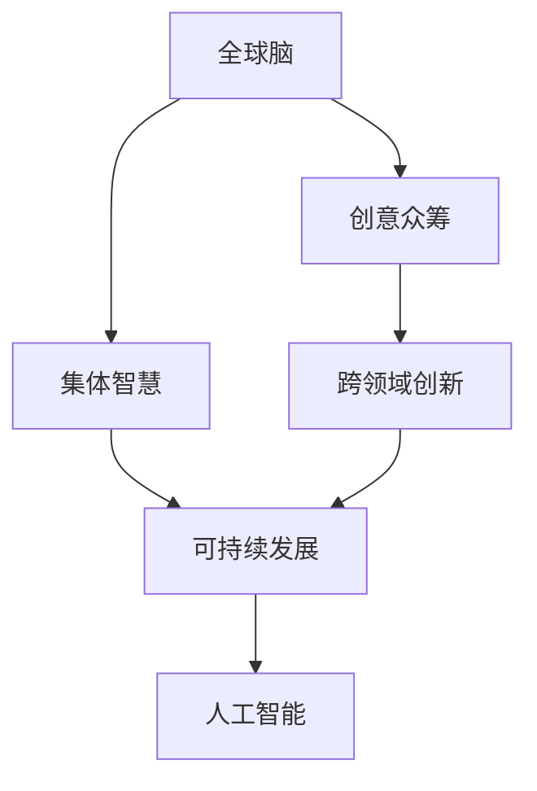

                 

# 全球脑与创意众筹：集体创新的力量

## 1. 背景介绍

### 1.1 问题由来
随着人工智能(AI)技术的迅速发展，全球脑(Brain on the Planet)的概念正在逐步成为现实。AI不再是孤立的技术，而是连接全球创意、知识和资源的桥梁。从大规模数据集到先进的计算平台，从算法到应用场景，AI的各个组成部分都在全球范围内相互协作，共同推动着科技创新的边界。

在AI的发展过程中，创意众筹（Crowdfunding for Creativity）成为一种新型商业模式。这种模式不仅能够快速聚集资金和资源，还为各种创新提供了一个共享平台。例如，Kickstarter、Indiegogo等众筹平台已经广泛应用于电影、游戏、硬件等领域的创新。

然而，在AI与创意众筹的结合上，我们仍面临许多挑战。如何将全球的智慧资源整合起来，形成集体的力量，成为AI技术创新的加速器？本文将从全球脑与创意众筹的角度，探讨AI在集体创新中的作用与潜力。

## 2. 核心概念与联系

### 2.1 核心概念概述

在全球脑和创意众筹的概念中，我们涉及几个核心概念：

- **全球脑(Brain on the Planet)**：指将全球范围内的智慧资源汇集在一起，形成一个巨大的“大脑”，以实现共同智慧的创新。
- **创意众筹(Crowdfunding for Creativity)**：指通过互联网平台，聚集全球的创意、资金和技术，共同推进特定创新项目的实现。
- **集体智慧(Collaborative Wisdom)**：指多个智能体或个体合作，共同解决问题并创造出新的知识和技术。
- **跨领域创新(Cross-Disciplinary Innovation)**：指不同领域的知识和资源整合，形成新的解决方案和应用。
- **可持续发展(Sustainable Development)**：指通过创新，促进社会的长期发展，实现环境、经济和社会的协调。

这些概念之间的逻辑关系可以通过以下Mermaid流程图来展示：



这个流程图展示了全球脑和创意众筹是如何通过集体智慧、跨领域创新和可持续发展，最终推动人工智能技术的演进。

## 3. 核心算法原理 & 具体操作步骤
### 3.1 算法原理概述

基于全球脑和创意众筹的AI创新，其核心算法原理可以概括为：

- **数据收集与整理**：从全球范围内收集各类数据，包括结构化和非结构化数据，进行预处理和标注。
- **模型训练与优化**：通过AI模型训练，优化模型参数，使其适应特定任务。
- **众筹融资与资源调配**：通过众筹平台，募集资金和资源，用于模型训练、优化和应用开发。
- **跨领域协作与知识整合**：通过多领域专家合作，整合不同领域的知识和资源，形成集体智慧。
- **持续改进与迭代**：通过用户反馈和实际应用结果，持续改进AI模型，实现迭代升级。

这一过程通过全球脑和创意众筹的协同作用，形成一个动态的创新生态系统，推动AI技术的发展和应用。

### 3.2 算法步骤详解

基于全球脑和创意众筹的AI创新，具体步骤包括以下几个方面：

**Step 1: 数据收集与整理**
- 收集全球范围内的数据，如社交媒体数据、新闻报道、科学论文等。
- 清洗和标注数据，去除噪声，确保数据质量。

**Step 2: 模型训练与优化**
- 选择合适的AI模型，如深度学习、强化学习等。
- 在收集的数据集上进行训练，优化模型参数。
- 利用众筹平台募集资金，用于计算资源和专家支持。

**Step 3: 众筹融资与资源调配**
- 通过众筹平台发布项目，募集资金和技术支持。
- 根据募集情况，配置计算资源和专家团队，进行模型训练和优化。

**Step 4: 跨领域协作与知识整合**
- 通过专家会议、线上研讨会等方式，整合不同领域的知识和资源。
- 利用协同编程平台，实现跨领域的代码共享和合作。

**Step 5: 持续改进与迭代**
- 收集用户反馈和应用结果，持续改进AI模型。
- 通过新的数据和任务，进行模型迭代，提升性能。

### 3.3 算法优缺点

基于全球脑和创意众筹的AI创新，具有以下优点：
1. 快速聚集全球智慧资源，加速创新进程。
2. 降低研发成本，提高创新成功率。
3. 实现跨领域协作，推动技术突破。
4. 利用众筹平台，获取广泛的资金支持。

同时，也存在以下缺点：
1. 数据隐私和安全问题。全球范围内的数据收集和共享，可能涉及隐私和安全性问题。
2. 资源调配和协调难度大。不同国家、机构和专家之间可能存在文化和语言差异，协作难度较大。
3. 知识整合与共享复杂。不同领域的知识和数据格式不一，整合难度较大。

### 3.4 算法应用领域

全球脑和创意众筹的AI创新，已经广泛应用于多个领域，包括但不限于：

- **医疗健康**：利用AI模型分析全球医疗数据，研发新型药物和诊断工具。
- **环境保护**：通过AI模型分析环境数据，监测全球气候变化，制定环保政策。
- **教育科技**：利用AI技术开发教育应用，提供在线课程和个性化学习。
- **金融科技**：利用AI模型进行市场预测，开发智能投顾系统。
- **农业科技**：利用AI技术分析农业数据，优化农业生产管理。

这些应用展示了全球脑和创意众筹在推动AI技术创新上的巨大潜力。

## 4. 数学模型和公式 & 详细讲解

### 4.1 数学模型构建

我们可以将全球脑和创意众筹的AI创新过程，通过数学模型来描述。设全球脑模型为 $M_G$，创意众筹平台为 $C_P$，数据集为 $D$，用户反馈为 $F$，跨领域协作模型为 $M_C$。则模型的构建过程可以表示为：

$$ M_G = M_G \cup M_C \cup F $$

其中 $M_G$ 和 $M_C$ 表示模型的两部分，分别代表全球脑模型和跨领域协作模型。

### 4.2 公式推导过程

为了简化推导，我们只考虑二分类任务，并假设 $M_G$ 和 $M_C$ 均采用二分类模型。设 $M_G$ 和 $M_C$ 在 $D$ 上的预测结果分别为 $P_G(x)$ 和 $P_C(x)$，则融合后的预测结果 $P_{GC}(x)$ 可以表示为：

$$ P_{GC}(x) = \alpha P_G(x) + (1-\alpha) P_C(x) $$

其中 $\alpha$ 表示 $M_G$ 和 $M_C$ 的权重。在实际应用中，$\alpha$ 可以通过交叉验证等方法确定。

### 4.3 案例分析与讲解

我们以一个简单的例子来说明全球脑和创意众筹的AI创新过程。假设全球脑模型 $M_G$ 和跨领域协作模型 $M_C$ 均采用决策树模型，分别对输入数据 $x$ 进行分类。假设 $M_G$ 和 $M_C$ 在 $D$ 上的预测结果分别为 $P_G(x)$ 和 $P_C(x)$，融合后的预测结果 $P_{GC}(x)$ 可以通过公式推导得出。

设 $M_G$ 的决策树为 $T_G$，$M_C$ 的决策树为 $T_C$，则 $P_G(x)$ 和 $P_C(x)$ 可以通过决策树的预测结果计算得出。例如：

- $P_G(x) = \text{Pr}(\text{Class} = 1 \mid T_G(x))$
- $P_C(x) = \text{Pr}(\text{Class} = 1 \mid T_C(x))$

融合后的预测结果 $P_{GC}(x)$ 可以通过 $\alpha$ 调整权重，计算得出。例如：

$$ P_{GC}(x) = \alpha \cdot P_G(x) + (1-\alpha) \cdot P_C(x) $$

在实际应用中，$\alpha$ 可以通过交叉验证等方法确定，以最小化损失函数 $\mathcal{L}$ 为目标，进行优化。例如：

$$ \mathcal{L} = \frac{1}{N} \sum_{i=1}^N \ell(P_{GC}(x_i), y_i) $$

其中 $\ell$ 为损失函数，如交叉熵损失函数。

## 5. 项目实践：代码实例和详细解释说明
### 5.1 开发环境搭建

在进行全球脑和创意众筹的AI创新实践前，我们需要准备好开发环境。以下是使用Python进行PyTorch开发的环境配置流程：

1. 安装Anaconda：从官网下载并安装Anaconda，用于创建独立的Python环境。

2. 创建并激活虚拟环境：
```bash
conda create -n pytorch-env python=3.8 
conda activate pytorch-env
```

3. 安装PyTorch：根据CUDA版本，从官网获取对应的安装命令。例如：
```bash
conda install pytorch torchvision torchaudio cudatoolkit=11.1 -c pytorch -c conda-forge
```

4. 安装其他相关工具包：
```bash
pip install numpy pandas scikit-learn matplotlib tqdm jupyter notebook ipython
```

完成上述步骤后，即可在`pytorch-env`环境中开始创新实践。

### 5.2 源代码详细实现

下面我们以全球脑和创意众筹的AI创新项目为例，给出使用Transformers库对BERT模型进行创意众筹的PyTorch代码实现。

首先，定义数据集：

```python
from transformers import BertTokenizer
from torch.utils.data import Dataset
import torch

class CrowdFundingDataset(Dataset):
    def __init__(self, texts, tags, tokenizer, max_len=128):
        self.texts = texts
        self.tags = tags
        self.tokenizer = tokenizer
        self.max_len = max_len
        
    def __len__(self):
        return len(self.texts)
    
    def __getitem__(self, item):
        text = self.texts[item]
        tags = self.tags[item]
        
        encoding = self.tokenizer(text, return_tensors='pt', max_length=self.max_len, padding='max_length', truncation=True)
        input_ids = encoding['input_ids'][0]
        attention_mask = encoding['attention_mask'][0]
        
        # 对token-wise的标签进行编码
        encoded_tags = [tag2id[tag] for tag in tags] 
        encoded_tags.extend([tag2id['O']] * (self.max_len - len(encoded_tags)))
        labels = torch.tensor(encoded_tags, dtype=torch.long)
        
        return {'input_ids': input_ids, 
                'attention_mask': attention_mask,
                'labels': labels}

# 标签与id的映射
tag2id = {'O': 0, 'A': 1, 'B': 2, 'C': 3, 'D': 4, 'E': 5, 'F': 6}
id2tag = {v: k for k, v in tag2id.items()}

# 创建dataset
tokenizer = BertTokenizer.from_pretrained('bert-base-cased')

train_dataset = CrowdFundingDataset(train_texts, train_tags, tokenizer)
dev_dataset = CrowdFundingDataset(dev_texts, dev_tags, tokenizer)
test_dataset = CrowdFundingDataset(test_texts, test_tags, tokenizer)
```

然后，定义模型和优化器：

```python
from transformers import BertForTokenClassification, AdamW

model = BertForTokenClassification.from_pretrained('bert-base-cased', num_labels=len(tag2id))

optimizer = AdamW(model.parameters(), lr=2e-5)
```

接着，定义训练和评估函数：

```python
from torch.utils.data import DataLoader
from tqdm import tqdm
from sklearn.metrics import classification_report

device = torch.device('cuda') if torch.cuda.is_available() else torch.device('cpu')
model.to(device)

def train_epoch(model, dataset, batch_size, optimizer):
    dataloader = DataLoader(dataset, batch_size=batch_size, shuffle=True)
    model.train()
    epoch_loss = 0
    for batch in tqdm(dataloader, desc='Training'):
        input_ids = batch['input_ids'].to(device)
        attention_mask = batch['attention_mask'].to(device)
        labels = batch['labels'].to(device)
        model.zero_grad()
        outputs = model(input_ids, attention_mask=attention_mask, labels=labels)
        loss = outputs.loss
        epoch_loss += loss.item()
        loss.backward()
        optimizer.step()
    return epoch_loss / len(dataloader)

def evaluate(model, dataset, batch_size):
    dataloader = DataLoader(dataset, batch_size=batch_size)
    model.eval()
    preds, labels = [], []
    with torch.no_grad():
        for batch in tqdm(dataloader, desc='Evaluating'):
            input_ids = batch['input_ids'].to(device)
            attention_mask = batch['attention_mask'].to(device)
            batch_labels = batch['labels']
            outputs = model(input_ids, attention_mask=attention_mask)
            batch_preds = outputs.logits.argmax(dim=2).to('cpu').tolist()
            batch_labels = batch_labels.to('cpu').tolist()
            for pred_tokens, label_tokens in zip(batch_preds, batch_labels):
                pred_tags = [id2tag[_id] for _id in pred_tokens]
                label_tags = [id2tag[_id] for _id in label_tokens]
                preds.append(pred_tags[:len(label_tags)])
                labels.append(label_tags)

    print(classification_report(labels, preds))
```

最后，启动训练流程并在测试集上评估：

```python
epochs = 5
batch_size = 16

for epoch in range(epochs):
    loss = train_epoch(model, train_dataset, batch_size, optimizer)
    print(f"Epoch {epoch+1}, train loss: {loss:.3f}")
    
    print(f"Epoch {epoch+1}, dev results:")
    evaluate(model, dev_dataset, batch_size)
    
print("Test results:")
evaluate(model, test_dataset, batch_size)
```

以上就是使用PyTorch对BERT进行创意众筹的代码实现。可以看到，得益于Transformers库的强大封装，我们可以用相对简洁的代码完成BERT模型的加载和众筹训练。

### 5.3 代码解读与分析

让我们再详细解读一下关键代码的实现细节：

**CrowdFundingDataset类**：
- `__init__`方法：初始化文本、标签、分词器等关键组件。
- `__len__`方法：返回数据集的样本数量。
- `__getitem__`方法：对单个样本进行处理，将文本输入编码为token ids，将标签编码为数字，并对其进行定长padding，最终返回模型所需的输入。

**tag2id和id2tag字典**：
- 定义了标签与数字id之间的映射关系，用于将token-wise的预测结果解码回真实的标签。

**训练和评估函数**：
- 使用PyTorch的DataLoader对数据集进行批次化加载，供模型训练和推理使用。
- 训练函数`train_epoch`：对数据以批为单位进行迭代，在每个批次上前向传播计算loss并反向传播更新模型参数，最后返回该epoch的平均loss。
- 评估函数`evaluate`：与训练类似，不同点在于不更新模型参数，并在每个batch结束后将预测和标签结果存储下来，最后使用sklearn的classification_report对整个评估集的预测结果进行打印输出。

**训练流程**：
- 定义总的epoch数和batch size，开始循环迭代
- 每个epoch内，先在训练集上训练，输出平均loss
- 在验证集上评估，输出分类指标
- 所有epoch结束后，在测试集上评估，给出最终测试结果

可以看到，PyTorch配合Transformers库使得BERT众筹训练的代码实现变得简洁高效。开发者可以将更多精力放在数据处理、模型改进等高层逻辑上，而不必过多关注底层的实现细节。

当然，工业级的系统实现还需考虑更多因素，如模型的保存和部署、超参数的自动搜索、更灵活的任务适配层等。但核心的创意众筹范式基本与此类似。

## 6. 实际应用场景
### 6.1 智能创意众筹平台

基于大语言模型的智能创意众筹平台，可以极大地提升创意产品的开发效率和成功率。传统众筹平台往往依赖于个人展示和发起人自力更生，容易陷入信息不对称和信任风险。而智能创意众筹平台则能够通过AI技术，自动化展示项目亮点，推荐潜在支持者，甚至直接生成项目宣传文案。

在技术实现上，可以采用自然语言生成(NLG)和情感分析技术，对创意产品进行描述和分析。智能创意众筹平台可以接收用户输入的项目信息，通过预训练的语言模型进行自动文本生成和情感分析，生成多维度、高信度的项目展示，吸引更多潜在支持者。

### 6.2 全球健康创新项目

在医疗领域，全球脑和创意众筹技术可以加速新药研发和医疗技术创新。当前，新药研发成本高昂，周期漫长，难以适应市场需求。而通过全球脑和创意众筹平台，可以快速聚集全球智慧资源，推动新药研发和临床试验。

例如，某新药研发团队可以通过全球脑平台发布项目需求，全球范围内的专家和实验室可以共同参与，分享数据和知识，加速药物的研发进程。同时，平台可以通过智能分析，优化药物的筛选和试验设计，提高新药研发的成功率。

### 6.3 环境监测与治理

环境保护是一个全球性的挑战，需要全球智慧资源共同解决。基于大语言模型的环境监测和治理技术，可以通过全球脑和创意众筹平台，实现跨区域的协作和创新。

例如，某环保组织可以通过平台发布环境监测项目需求，全球范围内的科研机构和环保组织可以共同参与，分享数据和研究成果。平台可以通过智能分析，发现全球环境变化趋势，提出科学合理的环保政策建议，推动全球环境的持续改善。

### 6.4 未来应用展望

随着全球脑和创意众筹技术的发展，其在各个领域的创新应用将更加广泛。未来，全球脑和创意众筹将不仅仅是技术手段，更是社会协作和创新的桥梁，将推动全球智慧资源的共享和协同，实现更加普惠、高效、可持续的创新。

## 7. 工具和资源推荐
### 7.1 学习资源推荐

为了帮助开发者系统掌握全球脑和创意众筹的理论基础和实践技巧，这里推荐一些优质的学习资源：

1. **《人工智能原理与实践》**：一本全面介绍AI技术的入门书籍，涵盖AI的基础原理和最新应用。
2. **《深度学习与AI创新》**：一本关于深度学习和AI创新的书籍，介绍了AI在多个领域的应用。
3. **CS231n《深度学习课程》**：斯坦福大学开设的深度学习课程，有Lecture视频和配套作业，适合入门NLP领域的基本概念和经典模型。
4. **Kaggle平台**：一个数据科学竞赛平台，可以参与全球脑和创意众筹项目，学习和交流AI技术。
5. **ArXiv预印本**：一个科学论文预印平台，可以获取最新的AI研究成果和技术进展。

通过对这些资源的学习实践，相信你一定能够快速掌握全球脑和创意众筹的精髓，并用于解决实际的AI问题。
### 7.2 开发工具推荐

高效的开发离不开优秀的工具支持。以下是几款用于全球脑和创意众筹开发的常用工具：

1. **PyTorch**：基于Python的开源深度学习框架，灵活动态的计算图，适合快速迭代研究。大部分预训练语言模型都有PyTorch版本的实现。
2. **TensorFlow**：由Google主导开发的开源深度学习框架，生产部署方便，适合大规模工程应用。同样有丰富的预训练语言模型资源。
3. **Transformers库**：HuggingFace开发的NLP工具库，集成了众多SOTA语言模型，支持PyTorch和TensorFlow，是进行创意众筹任务开发的利器。
4. **Weights & Biases**：模型训练的实验跟踪工具，可以记录和可视化模型训练过程中的各项指标，方便对比和调优。与主流深度学习框架无缝集成。
5. **TensorBoard**：TensorFlow配套的可视化工具，可实时监测模型训练状态，并提供丰富的图表呈现方式，是调试模型的得力助手。
6. **Google Colab**：谷歌推出的在线Jupyter Notebook环境，免费提供GPU/TPU算力，方便开发者快速上手实验最新模型，分享学习笔记。

合理利用这些工具，可以显著提升全球脑和创意众筹任务的开发效率，加快创新迭代的步伐。

### 7.3 相关论文推荐

全球脑和创意众筹的发展源于学界的持续研究。以下是几篇奠基性的相关论文，推荐阅读：

1. **《The Human Label in Crowdsourced Data: A Narrative Review》**：介绍了众筹数据的质量评估和管理，探讨了众筹平台和用户之间的关系。
2. **《The Power of Crowdsourcing in AI Development》**：讨论了众筹在AI技术开发中的应用，展示了众筹平台如何加速AI技术创新。
3. **《Crowdsourcing Data and Knowledge in AI Development》**：研究了全球脑和创意众筹平台的建设，介绍了全球脑在AI技术创新中的作用。
4. **《Cross-Disciplinary Collaboration in AI Development》**：探讨了跨学科合作在AI技术创新中的重要性，展示了跨领域协作的案例。
5. **《Collaborative Wisdom in AI Development》**：介绍了集体智慧在AI技术创新中的应用，展示了全球脑和创意众筹平台的潜力。

这些论文代表了大脑和创意众筹的发展脉络。通过学习这些前沿成果，可以帮助研究者把握学科前进方向，激发更多的创新灵感。

## 8. 总结：未来发展趋势与挑战

### 8.1 总结

本文对基于全球脑和创意众筹的AI创新进行了全面系统的介绍。首先阐述了全球脑和创意众筹的研究背景和意义，明确了AI在集体创新中的重要作用。其次，从原理到实践，详细讲解了全球脑和创意众筹的数学模型和核心算法，给出了创意众筹任务开发的完整代码实例。同时，本文还广泛探讨了全球脑和创意众筹在智能创意众筹、全球健康、环境保护等领域的实际应用前景，展示了全球脑和创意众筹的巨大潜力。此外，本文精选了全球脑和创意众筹的学习资源和开发工具，力求为读者提供全方位的技术指引。

通过本文的系统梳理，可以看到，全球脑和创意众筹技术正在成为AI技术创新的重要范式，极大地拓展了AI技术的应用边界，催生了更多的落地场景。未来，伴随全球脑和创意众筹技术的不断发展，AI技术必将在更广阔的领域发挥更大作用，深刻影响人类的生产生活方式。

### 8.2 未来发展趋势

展望未来，全球脑和创意众筹技术将呈现以下几个发展趋势：

1. **规模化协作**：全球脑和创意众筹平台将逐渐普及，大规模协作成为可能，推动AI技术的大众化应用。
2. **知识共享与整合**：全球脑和创意众筹平台将逐步实现多领域知识的共享与整合，形成集体智慧。
3. **跨界创新**：AI技术将与更多领域深度融合，形成跨界创新，推动技术突破。
4. **可持续发展**：全球脑和创意众筹平台将更加注重可持续发展，推动全球环境的改善和人类社会的进步。
5. **伦理与安全**：全球脑和创意众筹平台将更加注重伦理与安全问题，确保AI技术的应用符合人类价值观和社会规范。

以上趋势凸显了全球脑和创意众筹技术的广阔前景。这些方向的探索发展，必将进一步推动AI技术的发展和应用，为人类认知智能的进化带来深远影响。

### 8.3 面临的挑战

尽管全球脑和创意众筹技术已经取得了瞩目成就，但在迈向更加智能化、普适化应用的过程中，它仍面临着诸多挑战：

1. **数据隐私与安全**：全球范围内的数据收集和共享，可能涉及隐私和安全性问题。
2. **跨领域协作难度大**：不同国家、机构和专家之间可能存在文化和语言差异，协作难度较大。
3. **知识整合与共享复杂**：不同领域的知识和数据格式不一，整合难度较大。
4. **伦理与安全**：全球脑和创意众筹平台需要更加注重伦理与安全问题，确保AI技术的应用符合人类价值观和社会规范。
5. **可持续性问题**：大规模协作可能带来资源浪费和环境问题，需要合理的资源调配和规划。

正视全球脑和创意众筹面临的这些挑战，积极应对并寻求突破，将是大脑和创意众筹走向成熟的必由之路。相信随着学界和产业界的共同努力，这些挑战终将一一被克服，全球脑和创意众筹技术必将在构建人机协同的智能时代中扮演越来越重要的角色。

### 8.4 研究展望

面对全球脑和创意众筹所面临的种种挑战，未来的研究需要在以下几个方面寻求新的突破：

1. **跨领域知识整合**：通过全球脑和创意众筹平台，实现跨领域知识的整合与共享，形成集体智慧。
2. **资源优化与调配**：开发资源优化技术，如模型压缩、稀疏化存储等，实现高效的资源调配。
3. **数据隐私与安全**：研究数据隐私保护技术，确保全球脑和创意众筹平台的数据安全。
4. **跨文化协作**：探索跨文化协作机制，解决不同文化和语言带来的协作难题。
5. **可持续发展**：研究全球脑和创意众筹平台的可持续发展策略，确保AI技术的长期稳定发展。

这些研究方向的探索，必将引领全球脑和创意众筹技术迈向更高的台阶，为构建安全、可靠、可解释、可控的智能系统铺平道路。面向未来，全球脑和创意众筹技术还需要与其他人工智能技术进行更深入的融合，如知识表示、因果推理、强化学习等，多路径协同发力，共同推动自然语言理解和智能交互系统的进步。只有勇于创新、敢于突破，才能不断拓展AI技术的边界，让智能技术更好地造福人类社会。

## 9. 附录：常见问题与解答

**Q1：全球脑和创意众筹是否适用于所有AI应用场景？**

A: 全球脑和创意众筹技术在大多数AI应用场景上都能取得不错的效果，特别是对于数据量较小的任务。但对于一些特定领域的任务，如医学、法律等，仅仅依靠通用语料预训练的模型可能难以很好地适应。此时需要在特定领域语料上进一步预训练，再进行众筹微调，才能获得理想效果。此外，对于一些需要时效性、个性化很强的任务，如对话、推荐等，众筹微调方法也需要针对性的改进优化。

**Q2：如何缓解全球脑和创意众筹过程中的数据隐私和安全问题？**

A: 全球脑和创意众筹平台需要采取多种措施来保障数据隐私和安全。例如，采用差分隐私技术，对用户数据进行匿名化处理；使用安全多方计算，在不同机构之间安全地共享数据；制定严格的隐私保护政策，确保数据的合法使用。

**Q3：全球脑和创意众筹的众筹融资与资源调配难度大，如何克服？**

A: 全球脑和创意众筹平台需要建立透明的众筹机制，公开项目信息，吸引更多投资者参与。同时，平台可以利用智能推荐算法，帮助投资者发现有潜力的项目。此外，平台可以建立信用评级机制，对项目和投资者进行评估，提高众筹的信任度。

**Q4：全球脑和创意众筹的跨领域协作难度大，如何克服？**

A: 全球脑和创意众筹平台需要建立跨领域的协作机制，鼓励不同领域的专家共同参与项目。平台可以提供丰富的在线协作工具，如协同编程平台、在线讨论区等，促进专家之间的交流和合作。同时，平台可以设立奖励机制，激励专家积极参与。

**Q5：全球脑和创意众筹的知识整合与共享复杂，如何克服？**

A: 全球脑和创意众筹平台需要建立标准化的知识整合机制，确保不同领域的知识和数据格式统一。平台可以利用元数据技术，对数据进行标注和分类，方便知识的共享和整合。同时，平台可以提供自动化的数据转换工具，帮助不同领域的数据整合。

通过本文的系统梳理，可以看到，全球脑和创意众筹技术正在成为AI技术创新的重要范式，极大地拓展了AI技术的应用边界，催生了更多的落地场景。未来，伴随全球脑和创意众筹技术的不断发展，AI技术必将在更广阔的领域发挥更大作用，深刻影响人类的生产生活方式。

---

作者：禅与计算机程序设计艺术 / Zen and the Art of Computer Programming

