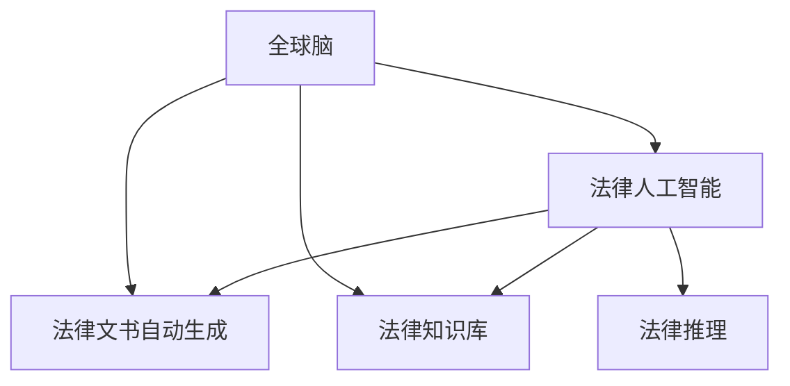

                 

## 1. 背景介绍

在全球化和信息化的浪潮下，社会法治进程加快，法律服务需求日益增长。然而，传统的法律服务模式依赖于人力劳动，工作量大、效率低、成本高、资源分散，且在一定程度上存在服务质量不稳定等问题。此外，法律知识和实践不断变化，现有法律服务无法及时适应。

### 1.1 问题由来

在全球化时代，全球各地法律复杂多样，法律案件错综复杂，对法律专业人士的需求量不断增加。传统的法律服务模式依赖于经验丰富的律师和法律顾问进行案情分析、法律检索、法律文件制作等，效率较低。

同时，随着信息技术的发展，互联网普及率提高，人们对于在线法律服务的需求增加。传统的法律服务模式无法满足人们对法律服务的及时性、便捷性和个性化需求。

### 1.2 问题核心关键点

大语言模型在法律服务中的应用，可以解决上述问题。大语言模型通过预训练和微调，学习丰富的语言知识和法律知识，通过推理生成，快速输出法律文书、合同等文本，实现法律服务的智能化。

## 2. 核心概念与联系

### 2.1 核心概念概述

为更好地理解全球脑与司法系统在智能化法律服务中的应用，本节将介绍几个密切相关的核心概念：

- 全球脑（Global Brain）：借鉴大脑神经网络的结构和机制，通过分布式计算和协同知识库构建一个全球化的、自适应的、协同的智能决策系统。

- 法律人工智能（Legal AI）：应用人工智能技术解决法律问题，辅助法律服务的过程，提升法律服务的效率和质量。

- 法律文书自动生成（Automatic Document Generation）：利用大语言模型自动生成法律文书，如诉状、答辩状、合同等，减少律师工作量。

- 法律知识库（Legal Knowledge Base）：存储和组织法律知识，使模型能更好地理解和应用法律知识。

- 法律推理（Legal Reasoning）：基于法律规则和事实，推理出法律判决和裁定。

这些核心概念之间的逻辑关系可以通过以下Mermaid流程图来展示：



这个流程图展示了大语言模型在法律服务中的应用场景：

1. 全球脑构建法律人工智能系统。
2. 法律人工智能系统生成法律文书。
3. 法律人工智能系统构建和维护法律知识库。
4. 法律人工智能系统进行法律推理，辅助判决。

## 3. 核心算法原理 & 具体操作步骤
### 3.1 算法原理概述

基于全球脑的法律人工智能系统，通过大语言模型的预训练和微调，构建一个能够学习法律知识、生成法律文书、推理判决的智能化法律服务系统。其核心思想是：将预训练语言模型与法律知识库、法律推理引擎等组件集成，构建一个基于大语言模型的智能化法律服务系统。

形式化地，假设预训练语言模型为 $M_{\theta}$，其中 $\theta$ 为预训练得到的模型参数。给定法律任务 $T$ 的法律知识库 $L$ 和推理规则 $R$，微调的目标是找到新的模型参数 $\hat{\theta}$，使得：

$$
\hat{\theta}=\mathop{\arg\min}_{\theta} \mathcal{L}(M_{\theta},L,T,R)
$$

其中 $\mathcal{L}$ 为针对任务 $T$ 设计的损失函数，用于衡量模型预测输出与法律判决之间的差异。常见的损失函数包括交叉熵损失、均方误差损失等。

通过梯度下降等优化算法，微调过程不断更新模型参数 $\theta$，最小化损失函数 $\mathcal{L}$，使得模型输出逼近法律判决。由于 $\theta$ 已经通过预训练获得了较好的初始化，因此即便在少量标注数据下进行微调，也能较快收敛到理想模型参数 $\hat{\theta}$。

### 3.2 算法步骤详解

基于全球脑的法律人工智能系统的构建，一般包括以下几个关键步骤：

**Step 1: 准备预训练模型和数据集**
- 选择合适的预训练语言模型 $M_{\theta}$ 作为初始化参数，如 BERT、GPT等。
- 收集和整理法律任务 $T$ 的法律知识库 $L$，包含法律条文、判例、注释等。
- 准备推理规则 $R$，用于指导模型进行法律推理。

**Step 2: 添加任务适配层**
- 根据法律任务类型，在预训练模型顶层设计合适的输出层和损失函数。
- 对于法律文书生成任务，通常在顶层添加文本生成器。
- 对于法律推理任务，设计合适的推理引擎。

**Step 3: 设置微调超参数**
- 选择合适的优化算法及其参数，如 AdamW、SGD 等，设置学习率、批大小、迭代轮数等。
- 设置正则化技术及强度，包括权重衰减、Dropout、Early Stopping 等。
- 确定冻结预训练参数的策略，如仅微调顶层，或全部参数都参与微调。

**Step 4: 执行梯度训练**
- 将训练集数据分批次输入模型，前向传播计算损失函数。
- 反向传播计算参数梯度，根据设定的优化算法和学习率更新模型参数。
- 周期性在验证集上评估模型性能，根据性能指标决定是否触发 Early Stopping。
- 重复上述步骤直到满足预设的迭代轮数或 Early Stopping 条件。

**Step 5: 测试和部署**
- 在测试集上评估微调后模型 $M_{\hat{\theta}}$ 的性能，对比微调前后的精度提升。
- 使用微调后的模型对新样本进行推理预测，集成到实际的应用系统中。
- 持续收集新的数据，定期重新微调模型，以适应数据分布的变化。

以上是基于全球脑的法律人工智能系统构建的一般流程。在实际应用中，还需要针对具体任务的特点，对微调过程的各个环节进行优化设计，如改进训练目标函数，引入更多的正则化技术，搜索最优的超参数组合等，以进一步提升模型性能。

### 3.3 算法优缺点

基于全球脑的法律人工智能系统具有以下优点：
1. 提高法律服务效率。通过自动化法律文书生成和推理，大幅减少律师和法官的劳动量。
2. 提升法律服务质量。模型能够根据法律知识库和推理规则生成符合规范的法律文书，推理判决符合法律要求。
3. 降低法律服务成本。减少律师和法官的工作量，节约人力和时间成本。
4. 实现法律服务的普及化。通过在线法律服务系统，使得法律服务覆盖更广，服务更方便。
5. 促进法律知识传播。法律知识库的建设和共享，有助于法律知识普及和传播。

同时，该系统也存在一定的局限性：
1. 依赖法律知识库。系统性能受法律知识库的影响较大，如果法律知识库不全面或更新不及时，会影响模型输出。
2. 法律知识库维护复杂。法律知识库需要不断更新，以适应法律变化，维护工作量大。
3. 模型鲁棒性不足。法律推理过程复杂，模型容易受噪声数据和异常情况影响。
4. 可解释性不足。模型决策过程缺乏可解释性，难以对其推理逻辑进行分析和调试。
5. 法律公平性问题。模型可能学习到历史数据中的偏见，导致输出不公平。

尽管存在这些局限性，但就目前而言，基于全球脑的法律人工智能系统仍是目前最为成熟的法律服务智能化解决方案。未来相关研究的重点在于如何进一步优化法律知识库的构建和维护，提高模型的鲁棒性和可解释性，以及确保法律推理的公平性。

### 3.4 算法应用领域

基于全球脑的法律人工智能系统在法律服务领域已经得到了广泛的应用，覆盖了以下领域：

- 法律文书自动生成：通过微调预训练语言模型，生成合同、诉状、答辩状等法律文书。
- 法律知识库构建与维护：利用自然语言处理技术，从大量法律文献中提取法律条文、判例、注释等，构建法律知识库。
- 法律推理：基于法律知识库和推理规则，进行法律文书生成、判决、裁定等任务。
- 法律咨询：利用在线法律服务系统，回答用户关于法律问题的一般咨询。
- 法律监控：实时监测法律动态，及时提供法律预警信息。

除了上述这些经典应用外，基于全球脑的法律人工智能系统还被创新性地应用到更多场景中，如智能合约、法律智能助手等，为法律服务带来了全新的突破。随着法律知识库和推理引擎的不断进步，相信法律服务智能化将在更广阔的领域大放异彩。

## 4. 数学模型和公式 & 详细讲解  
### 4.1 数学模型构建

本节将使用数学语言对基于全球脑的法律人工智能系统进行更加严格的刻画。

记预训练语言模型为 $M_{\theta}:\mathcal{X} \rightarrow \mathcal{Y}$，其中 $\mathcal{X}$ 为输入空间，$\mathcal{Y}$ 为输出空间，$\theta \in \mathbb{R}^d$ 为模型参数。假设法律任务 $T$ 的法律知识库为 $L$，推理规则为 $R$。

定义模型 $M_{\theta}$ 在输入 $x$ 上的输出为 $\hat{y}=M_{\theta}(x) \in \mathcal{Y}$，表示法律文书、判决、裁定等输出结果。在微调过程中，目标是最小化损失函数：

$$
\mathcal{L}(\theta) = \frac{1}{N}\sum_{i=1}^N \ell(M_{\theta}(x_i), y_i)
$$

其中 $\ell$ 为针对法律任务 $T$ 设计的损失函数，如交叉熵损失函数。

### 4.2 公式推导过程

以下我们以法律文书自动生成任务为例，推导交叉熵损失函数及其梯度的计算公式。

假设模型 $M_{\theta}$ 在输入 $x$ 上的输出为 $\hat{y}=M_{\theta}(x) \in \mathcal{Y}$，表示生成的法律文书。真实标签 $y \in \mathcal{Y}$。则二分类交叉熵损失函数定义为：

$$
\ell(M_{\theta}(x),y) = -[y\log \hat{y} + (1-y)\log (1-\hat{y})]
$$

将其代入经验风险公式，得：

$$
\mathcal{L}(\theta) = -\frac{1}{N}\sum_{i=1}^N [y_i\log M_{\theta}(x_i)+(1-y_i)\log(1-M_{\theta}(x_i))]
$$

根据链式法则，损失函数对参数 $\theta_k$ 的梯度为：

$$
\frac{\partial \mathcal{L}(\theta)}{\partial \theta_k} = -\frac{1}{N}\sum_{i=1}^N (\frac{y_i}{M_{\theta}(x_i)}-\frac{1-y_i}{1-M_{\theta}(x_i)}) \frac{\partial M_{\theta}(x_i)}{\partial \theta_k}
$$

其中 $\frac{\partial M_{\theta}(x_i)}{\partial \theta_k}$ 可进一步递归展开，利用自动微分技术完成计算。

在得到损失函数的梯度后，即可带入参数更新公式，完成模型的迭代优化。重复上述过程直至收敛，最终得到适应法律任务的最优模型参数 $\theta^*$。

## 5. 项目实践：代码实例和详细解释说明
### 5.1 开发环境搭建

在进行法律文书自动生成实践前，我们需要准备好开发环境。以下是使用Python进行PyTorch开发的环境配置流程：

1. 安装Anaconda：从官网下载并安装Anaconda，用于创建独立的Python环境。

2. 创建并激活虚拟环境：
```bash
conda create -n legal-env python=3.8 
conda activate legal-env
```

3. 安装PyTorch：根据CUDA版本，从官网获取对应的安装命令。例如：
```bash
conda install pytorch torchvision torchaudio cudatoolkit=11.1 -c pytorch -c conda-forge
```

4. 安装Transformers库：
```bash
pip install transformers
```

5. 安装各类工具包：
```bash
pip install numpy pandas scikit-learn matplotlib tqdm jupyter notebook ipython
```

完成上述步骤后，即可在`legal-env`环境中开始法律文书自动生成实践。

### 5.2 源代码详细实现

这里我们以法律文书自动生成(NER)任务为例，给出使用Transformers库对BERT模型进行法律文书自动生成的PyTorch代码实现。

首先，定义法律文书自动生成的数据处理函数：

```python
from transformers import BertTokenizer
from torch.utils.data import Dataset
import torch

class LegalDocumentDataset(Dataset):
    def __init__(self, documents, labels, tokenizer, max_len=128):
        self.documents = documents
        self.labels = labels
        self.tokenizer = tokenizer
        self.max_len = max_len
        
    def __len__(self):
        return len(self.documents)
    
    def __getitem__(self, item):
        document = self.documents[item]
        label = self.labels[item]
        
        encoding = self.tokenizer(document, return_tensors='pt', max_length=self.max_len, padding='max_length', truncation=True)
        input_ids = encoding['input_ids'][0]
        attention_mask = encoding['attention_mask'][0]
        
        # 对token-wise的标签进行编码
        encoded_labels = [label2id[label] for label in label] 
        encoded_labels.extend([label2id['O']] * (self.max_len - len(encoded_labels)))
        labels = torch.tensor(encoded_labels, dtype=torch.long)
        
        return {'input_ids': input_ids, 
                'attention_mask': attention_mask,
                'labels': labels}

# 标签与id的映射
label2id = {'O': 0, 'B': 1, 'I': 2, 'S': 3}
id2label = {v: k for k, v in label2id.items()}

# 创建dataset
tokenizer = BertTokenizer.from_pretrained('bert-base-cased')

train_dataset = LegalDocumentDataset(train_documents, train_labels, tokenizer)
dev_dataset = LegalDocumentDataset(dev_documents, dev_labels, tokenizer)
test_dataset = LegalDocumentDataset(test_documents, test_labels, tokenizer)
```

然后，定义模型和优化器：

```python
from transformers import BertForTokenClassification, AdamW

model = BertForTokenClassification.from_pretrained('bert-base-cased', num_labels=len(label2id))

optimizer = AdamW(model.parameters(), lr=2e-5)
```

接着，定义训练和评估函数：

```python
from torch.utils.data import DataLoader
from tqdm import tqdm
from sklearn.metrics import classification_report

device = torch.device('cuda') if torch.cuda.is_available() else torch.device('cpu')
model.to(device)

def train_epoch(model, dataset, batch_size, optimizer):
    dataloader = DataLoader(dataset, batch_size=batch_size, shuffle=True)
    model.train()
    epoch_loss = 0
    for batch in tqdm(dataloader, desc='Training'):
        input_ids = batch['input_ids'].to(device)
        attention_mask = batch['attention_mask'].to(device)
        labels = batch['labels'].to(device)
        model.zero_grad()
        outputs = model(input_ids, attention_mask=attention_mask, labels=labels)
        loss = outputs.loss
        epoch_loss += loss.item()
        loss.backward()
        optimizer.step()
    return epoch_loss / len(dataloader)

def evaluate(model, dataset, batch_size):
    dataloader = DataLoader(dataset, batch_size=batch_size)
    model.eval()
    preds, labels = [], []
    with torch.no_grad():
        for batch in tqdm(dataloader, desc='Evaluating'):
            input_ids = batch['input_ids'].to(device)
            attention_mask = batch['attention_mask'].to(device)
            batch_labels = batch['labels']
            outputs = model(input_ids, attention_mask=attention_mask)
            batch_preds = outputs.logits.argmax(dim=2).to('cpu').tolist()
            batch_labels = batch_labels.to('cpu').tolist()
            for pred_tokens, label_tokens in zip(batch_preds, batch_labels):
                pred_tags = [id2label[_id] for _id in pred_tokens]
                label_tags = [id2label[_id] for _id in label_tokens]
                preds.append(pred_tags[:len(label_tokens)])
                labels.append(label_tags)
                
    print(classification_report(labels, preds))
```

最后，启动训练流程并在测试集上评估：

```python
epochs = 5
batch_size = 16

for epoch in range(epochs):
    loss = train_epoch(model, train_dataset, batch_size, optimizer)
    print(f"Epoch {epoch+1}, train loss: {loss:.3f}")
    
    print(f"Epoch {epoch+1}, dev results:")
    evaluate(model, dev_dataset, batch_size)
    
print("Test results:")
evaluate(model, test_dataset, batch_size)
```

以上就是使用PyTorch对BERT进行法律文书自动生成的完整代码实现。可以看到，得益于Transformers库的强大封装，我们可以用相对简洁的代码完成BERT模型的加载和微调。

### 5.3 代码解读与分析

让我们再详细解读一下关键代码的实现细节：

**LegalDocumentDataset类**：
- `__init__`方法：初始化文本、标签、分词器等关键组件。
- `__len__`方法：返回数据集的样本数量。
- `__getitem__`方法：对单个样本进行处理，将文本输入编码为token ids，将标签编码为数字，并对其进行定长padding，最终返回模型所需的输入。

**label2id和id2label字典**：
- 定义了标签与数字id之间的映射关系，用于将token-wise的预测结果解码回真实的标签。

**训练和评估函数**：
- 使用PyTorch的DataLoader对数据集进行批次化加载，供模型训练和推理使用。
- 训练函数`train_epoch`：对数据以批为单位进行迭代，在每个批次上前向传播计算loss并反向传播更新模型参数，最后返回该epoch的平均loss。
- 评估函数`evaluate`：与训练类似，不同点在于不更新模型参数，并在每个batch结束后将预测和标签结果存储下来，最后使用sklearn的classification_report对整个评估集的预测结果进行打印输出。

**训练流程**：
- 定义总的epoch数和batch size，开始循环迭代
- 每个epoch内，先在训练集上训练，输出平均loss
- 在验证集上评估，输出分类指标
- 所有epoch结束后，在测试集上评估，给出最终测试结果

可以看到，PyTorch配合Transformers库使得BERT微调的代码实现变得简洁高效。开发者可以将更多精力放在数据处理、模型改进等高层逻辑上，而不必过多关注底层的实现细节。

当然，工业级的系统实现还需考虑更多因素，如模型的保存和部署、超参数的自动搜索、更灵活的任务适配层等。但核心的微调范式基本与此类似。

## 6. 实际应用场景
### 6.1 智能法律文书生成

基于大语言模型微调的智能法律文书生成，可以广泛应用于法律服务的文档自动化生成。传统法律文书生成依赖于律师和秘书手工撰写，工作量大、速度慢，且难以统一标准。而使用微调后的文书生成模型，可以快速、高效地生成法律文书，提高文书质量，减少律师和秘书的工作量。

在技术实现上，可以收集大量法律文书样本，构建法律知识库，利用微调模型自动生成各类法律文书。微调后的模型能够根据输入的案件信息，自动生成相应的法律文书，如诉状、答辩状、判决书等。对于用户提交的新案件信息，模型也能够快速生成相应的文书，大大提高了文书生成的效率和质量。

### 6.2 法律智能助手

基于大语言模型微调的法律智能助手，可以辅助律师进行法律咨询、案件分析、法律检索等工作。传统法律工作依赖于人工分析和检索，效率低、容易出错。而使用微调后的智能助手，能够通过自然语言理解技术，实时回答用户法律咨询，提供法律建议。

在技术实现上，可以构建一个基于法律知识库和推理规则的智能助手，利用微调模型自动理解用户咨询问题，快速检索相关信息，生成答案，并提供相应的法律建议。用户只需要输入问题，智能助手就能快速生成答案，大大提高了法律咨询的效率和准确性。

### 6.3 法律判决辅助系统

基于大语言模型微调的法律判决辅助系统，可以辅助法官进行法律文书生成、判决推理等工作。传统法律判决依赖于法官手工分析案件，工作量大、时间成本高。而使用微调后的判决辅助系统，可以快速生成法律文书，辅助法官进行判决推理，提高审判效率和质量。

在技术实现上，可以构建一个基于法律知识库和推理规则的判决辅助系统，利用微调模型自动生成法律文书，辅助法官进行案件分析和判决推理。法官只需要输入案件信息，系统就能自动生成相应的文书，并进行推理判决，大大提高了审判效率。

### 6.4 未来应用展望

随着大语言模型微调技术的发展，基于全球脑的法律人工智能系统将在更多领域得到应用，为法律服务带来新的突破。

在智慧司法系统领域，基于全球脑的法律人工智能系统可以构建一个智能化的法律服务系统，辅助律师和法官进行法律文书生成、案件分析、法律推理等工作，提高法律服务效率和质量。

在智能合约领域，基于全球脑的法律人工智能系统可以构建一个智能化的合约管理系统，自动生成各类法律文书，进行合同生成、审核、执行等工作，提高合约管理的自动化水平。

在法律教育领域，基于全球脑的法律人工智能系统可以构建一个智能化的法律教育平台，自动生成各类法律文书的样本，提供法律咨询、法律分析等服务，辅助学生进行法律学习。

此外，在法律风险预警、法律知识图谱、法律智能推理等更多领域，基于大语言模型微调的方法也将不断涌现，为法律服务智能化带来新的突破。相信随着大语言模型微调技术的不断进步，法律服务的智能化将在更广阔的领域大放异彩。

## 7. 工具和资源推荐
### 7.1 学习资源推荐

为了帮助开发者系统掌握大语言模型微调的理论基础和实践技巧，这里推荐一些优质的学习资源：

1. 《Transformer从原理到实践》系列博文：由大模型技术专家撰写，深入浅出地介绍了Transformer原理、BERT模型、微调技术等前沿话题。

2. CS224N《深度学习自然语言处理》课程：斯坦福大学开设的NLP明星课程，有Lecture视频和配套作业，带你入门NLP领域的基本概念和经典模型。

3. 《Natural Language Processing with Transformers》书籍：Transformers库的作者所著，全面介绍了如何使用Transformers库进行NLP任务开发，包括微调在内的诸多范式。

4. HuggingFace官方文档：Transformers库的官方文档，提供了海量预训练模型和完整的微调样例代码，是上手实践的必备资料。

5. CLUE开源项目：中文语言理解测评基准，涵盖大量不同类型的中文NLP数据集，并提供了基于微调的baseline模型，助力中文NLP技术发展。

通过对这些资源的学习实践，相信你一定能够快速掌握大语言模型微调的精髓，并用于解决实际的NLP问题。
###  7.2 开发工具推荐

高效的开发离不开优秀的工具支持。以下是几款用于大语言模型微调开发的常用工具：

1. PyTorch：基于Python的开源深度学习框架，灵活动态的计算图，适合快速迭代研究。大部分预训练语言模型都有PyTorch版本的实现。

2. TensorFlow：由Google主导开发的开源深度学习框架，生产部署方便，适合大规模工程应用。同样有丰富的预训练语言模型资源。

3. Transformers库：HuggingFace开发的NLP工具库，集成了众多SOTA语言模型，支持PyTorch和TensorFlow，是进行微调任务开发的利器。

4. Weights & Biases：模型训练的实验跟踪工具，可以记录和可视化模型训练过程中的各项指标，方便对比和调优。与主流深度学习框架无缝集成。

5. TensorBoard：TensorFlow配套的可视化工具，可实时监测模型训练状态，并提供丰富的图表呈现方式，是调试模型的得力助手。

6. Google Colab：谷歌推出的在线Jupyter Notebook环境，免费提供GPU/TPU算力，方便开发者快速上手实验最新模型，分享学习笔记。

合理利用这些工具，可以显著提升大语言模型微调任务的开发效率，加快创新迭代的步伐。

### 7.3 相关论文推荐

大语言模型和微调技术的发展源于学界的持续研究。以下是几篇奠基性的相关论文，推荐阅读：

1. Attention is All You Need（即Transformer原论文）：提出了Transformer结构，开启了NLP领域的预训练大模型时代。

2. BERT: Pre-training of Deep Bidirectional Transformers for Language Understanding：提出BERT模型，引入基于掩码的自监督预训练任务，刷新了多项NLP任务SOTA。

3. Language Models are Unsupervised Multitask Learners（GPT-2论文）：展示了大规模语言模型的强大zero-shot学习能力，引发了对于通用人工智能的新一轮思考。

4. Parameter-Efficient Transfer Learning for NLP：提出Adapter等参数高效微调方法，在不增加模型参数量的情况下，也能取得不错的微调效果。

5. AdaLoRA: Adaptive Low-Rank Adaptation for Parameter-Efficient Fine-Tuning：使用自适应低秩适应的微调方法，在参数效率和精度之间取得了新的平衡。

6. Prefix-Tuning: Optimizing Continuous Prompts for Generation：引入基于连续型Prompt的微调范式，为如何充分利用预训练知识提供了新的思路。

这些论文代表了大语言模型微调技术的发展脉络。通过学习这些前沿成果，可以帮助研究者把握学科前进方向，激发更多的创新灵感。

## 8. 总结：未来发展趋势与挑战

### 8.1 总结

本文对基于全球脑的法律人工智能系统进行了全面系统的介绍。首先阐述了全球脑与司法系统的研究背景和意义，明确了智能化法律服务在社会法治进程中的重要地位。其次，从原理到实践，详细讲解了基于全球脑的法律人工智能系统的构建过程，包括预训练、微调、任务适配层等关键环节。同时，本文还探讨了系统在法律文书生成、法律智能助手、法律判决辅助系统等实际应用场景中的应用，展示了其巨大的实际价值。

通过本文的系统梳理，可以看到，基于全球脑的法律人工智能系统正在成为智能法律服务的重要技术手段，极大地提高了法律服务的效率和质量。得益于大语言模型的预训练和微调，法律文书自动生成、法律智能助手等应用得以快速实现，为法律服务智能化提供了新的可能。未来，随着技术的不断演进，基于全球脑的法律人工智能系统将在更多领域大放异彩，深刻影响社会法治进程。

### 8.2 未来发展趋势

展望未来，基于全球脑的法律人工智能系统将呈现以下几个发展趋势：

1. 模型规模持续增大。随着算力成本的下降和数据规模的扩张，预训练语言模型的参数量还将持续增长。超大规模语言模型蕴含的丰富语言知识，有望支撑更加复杂多变的法律任务微调。

2. 微调方法日趋多样。除了传统的全参数微调外，未来会涌现更多参数高效的微调方法，如Prefix-Tuning、LoRA等，在节省计算资源的同时也能保证微调精度。

3. 法律知识库的智能化。法律知识库的构建和维护，将利用自然语言处理技术，实现智能化的知识提取和更新。

4. 跨领域法律推理。基于全球脑的法律人工智能系统，可以构建跨领域、跨模态的法律推理系统，将文本、图像、语音等不同类型的数据进行融合，增强系统的泛化能力和适应性。

5. 自动化法律服务普及化。通过在线法律服务系统，使得法律服务覆盖更广，服务更方便。

以上趋势凸显了基于全球脑的法律人工智能系统的广阔前景。这些方向的探索发展，必将进一步提升法律服务的效率和质量，为社会法治进程注入新的动力。

### 8.3 面临的挑战

尽管基于全球脑的法律人工智能系统已经取得了瞩目成就，但在迈向更加智能化、普适化应用的过程中，它仍面临着诸多挑战：

1. 数据隐私保护。法律文书生成和智能助手等应用，涉及用户隐私数据，需要采取措施保障数据安全。

2. 法律知识库的更新。法律知识库需要不断更新，以适应法律变化，维护工作量大。

3. 法律推理的复杂性。法律推理过程复杂，模型容易受噪声数据和异常情况影响。

4. 可解释性不足。模型决策过程缺乏可解释性，难以对其推理逻辑进行分析和调试。

5. 法律公平性问题。模型可能学习到历史数据中的偏见，导致输出不公平。

尽管存在这些挑战，但就目前而言，基于全球脑的法律人工智能系统仍是目前最为成熟的法律服务智能化解决方案。未来相关研究的重点在于如何进一步优化法律知识库的构建和维护，提高模型的鲁棒性和可解释性，以及确保法律推理的公平性。

### 8.4 研究展望

面对全球脑与司法系统所面临的挑战，未来的研究需要在以下几个方面寻求新的突破：

1. 探索无监督和半监督微调方法。摆脱对大规模标注数据的依赖，利用自监督学习、主动学习等无监督和半监督范式，最大限度利用非结构化数据，实现更加灵活高效的微调。

2. 研究参数高效和计算高效的微调范式。开发更加参数高效的微调方法，在固定大部分预训练参数的同时，只更新极少量的任务相关参数。同时优化微调模型的计算图，减少前向传播和反向传播的资源消耗，实现更加轻量级、实时性的部署。

3. 融合因果和对比学习范式。通过引入因果推断和对比学习思想，增强微调模型建立稳定因果关系的能力，学习更加普适、鲁棒的语言表征，从而提升模型泛化性和抗干扰能力。

4. 引入更多先验知识。将符号化的先验知识，如知识图谱、逻辑规则等，与神经网络模型进行巧妙融合，引导微调过程学习更准确、合理的语言模型。同时加强不同模态数据的整合，实现视觉、语音等多模态信息与文本信息的协同建模。

5. 结合因果分析和博弈论工具。将因果分析方法引入微调模型，识别出模型决策的关键特征，增强输出解释的因果性和逻辑性。借助博弈论工具刻画人机交互过程，主动探索并规避模型的脆弱点，提高系统稳定性。

6. 纳入伦理道德约束。在模型训练目标中引入伦理导向的评估指标，过滤和惩罚有偏见、有害的输出倾向。同时加强人工干预和审核，建立模型行为的监管机制，确保输出符合人类价值观和伦理道德。

这些研究方向的探索，必将引领全球脑与司法系统迈向更高的台阶，为智能法律服务提供新的突破。面向未来，全球脑与司法系统需要与其他人工智能技术进行更深入的融合，如知识表示、因果推理、强化学习等，多路径协同发力，共同推动法律服务智能化的进程。

## 9. 附录：常见问题与解答

**Q1：大语言模型微调是否适用于所有法律任务？**

A: 大语言模型微调在大多数法律任务上都能取得不错的效果，特别是对于数据量较小的任务。但对于一些特定领域的任务，如医学、法律等，仅仅依靠通用语料预训练的模型可能难以很好地适应。此时需要在特定领域语料上进一步预训练，再进行微调，才能获得理想效果。此外，对于一些需要时效性、个性化很强的任务，如对话、推荐等，微调方法也需要针对性的改进优化。

**Q2：微调过程中如何选择合适的学习率？**

A: 微调的学习率一般要比预训练时小1-2个数量级，如果使用过大的学习率，容易破坏预训练权重，导致过拟合。一般建议从1e-5开始调参，逐步减小学习率，直至收敛。也可以使用warmup策略，在开始阶段使用较小的学习率，再逐渐过渡到预设值。需要注意的是，不同的优化器(如AdamW、Adafactor等)以及不同的学习率调度策略，可能需要设置不同的学习率阈值。

**Q3：采用大模型微调时会面临哪些资源瓶颈？**

A: 目前主流的预训练大模型动辄以亿计的参数规模，对算力、内存、存储都提出了很高的要求。GPU/TPU等高性能设备是必不可少的，但即便如此，超大批次的训练和推理也可能遇到显存不足的问题。因此需要采用一些资源优化技术，如梯度积累、混合精度训练、模型并行等，来突破硬件瓶颈。同时，模型的存储和读取也可能占用大量时间和空间，需要采用模型压缩、稀疏化存储等方法进行优化。

**Q4：如何缓解微调过程中的过拟合问题？**

A: 过拟合是微调面临的主要挑战，尤其是在标注数据不足的情况下。常见的缓解策略包括：

1. 数据增强：通过回译、近义替换等方式扩充训练集

2. 正则化：使用L2正则、Dropout、Early Stopping等避免过拟合

3. 对抗训练：引入对抗样本，提高模型鲁棒性

4. 参数高效微调：只调整少量参数(如Adapter、Prefix等)，减小过拟合风险

5. 多模型集成：训练多个微调模型，取平均输出，抑制过拟合

这些策略往往需要根据具体任务和数据特点进行灵活组合。只有在数据、模型、训练、推理等各环节进行全面优化，才能最大限度地发挥大模型微调的威力。

**Q5：微调模型在落地部署时需要注意哪些问题？**

A: 将微调模型转化为实际应用，还需要考虑以下因素：

1. 模型裁剪：去除不必要的层和参数，减小模型尺寸，加快推理速度

2. 量化加速：将浮点模型转为定点模型，压缩存储空间，提高计算效率

3. 服务化封装：将模型封装为标准化服务接口，便于集成调用

4. 弹性伸缩：根据请求流量动态调整资源配置，平衡服务质量和成本

5. 监控告警：实时采集系统指标，设置异常告警阈值，确保服务稳定性

6. 安全防护：采用访问鉴权、数据脱敏等措施，保障数据和模型安全

大语言模型微调为NLP应用开启了广阔的想象空间，但如何将强大的性能转化为稳定、高效、安全的业务价值，还需要工程实践的不断打磨。唯有从数据、算法、工程、业务等多个维度协同发力，才能真正实现人工智能技术在垂直行业的规模化落地。总之，微调需要开发者根据具体任务，不断迭代和优化模型、数据和算法，方能得到理想的效果。

---

作者：禅与计算机程序设计艺术 / Zen and the Art of Computer Programming

