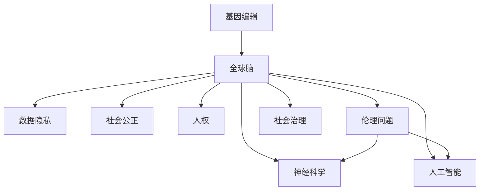

                 

# 全球脑与基因编辑:集体决策的伦理挑战

> 关键词：基因编辑,脑科学,集体决策,伦理问题,神经科学,人工智能,社会治理

## 1. 背景介绍

### 1.1 问题由来

近年来，基因编辑技术迅猛发展，CRISPR等工具已经被广泛用于研究和治疗。然而，基因编辑涉及的伦理问题日益突出，尤其是“全球脑”概念的提出，进一步引发了关于基因编辑的集体决策挑战。

“全球脑”是指随着信息技术的进步，全球数据正在融合，人类大脑已经成为一个紧密连接的“超级系统”，其运行模式、结构、功能等与单个大脑有所不同。这种全新的大脑形态，带来了前所未有的伦理挑战，包括数据隐私、人权、社会公正等。

### 1.2 问题核心关键点

全球脑与基因编辑所带来的伦理挑战主要体现在以下几个方面：
- 数据隐私：如何保护全球脑中每个人的隐私信息，避免数据被滥用。
- 社会公正：基因编辑技术的应用可能导致社会不平等，如何公平分配其带来的好处。
- 人权：基因编辑技术涉及深层次的生命伦理问题，如基因编辑的适用范围和限制。
- 监管与治理：全球脑与基因编辑技术的快速推进，要求建立有效的监管与治理机制，保障技术安全。

### 1.3 问题研究意义

探讨全球脑与基因编辑技术带来的伦理挑战，对于科学、技术、社会、政策等各个领域具有重要意义：

1. 科学意义：明确基因编辑技术的伦理边界，促进科学研究的健康发展。
2. 技术意义：指导技术应用，提高技术安全性，避免技术滥用。
3. 社会意义：引导社会公正、公平使用技术，提升人类生活质量。
4. 政策意义：制定相关法律法规，确保技术发展的规范性、合法性。

## 2. 核心概念与联系

### 2.1 核心概念概述

为更好地理解全球脑与基因编辑的伦理挑战，本节将介绍几个密切相关的核心概念：

- 基因编辑：指通过CRISPR等工具对生物体的基因进行精确的修改。
- 全球脑：指全球数据融合后形成的一个具有集体智能的系统。
- 数据隐私：涉及个人信息的保护和控制，防止信息滥用。
- 社会公正：指资源和机会在社会中公平分配，避免因技术应用带来的不平等。
- 人权：指个体在社会、政治、经济等领域应享有的基本权利。
- 伦理问题：指基因编辑技术应用中涉及的道德、社会、法律等方面的问题。
- 神经科学：研究大脑功能、结构和疾病的科学。
- 人工智能：模拟人类智能行为的技术。
- 社会治理：通过政策、法规等手段，维护社会秩序，促进社会发展。

这些核心概念之间的逻辑关系可以通过以下Mermaid流程图来展示：



这个流程图展示了大脑与基因编辑技术之间的逻辑关系：

1. 基因编辑技术的发展与应用，导致全球脑的形成。
2. 全球脑的运行模式、结构、功能等涉及数据隐私、社会公正、人权等伦理问题。
3. 神经科学和人工智能技术的发展，进一步推动了基因编辑技术的进展。
4. 社会治理则需要应对这些伦理挑战，确保技术的健康发展。

## 3. 核心算法原理 & 具体操作步骤
### 3.1 算法原理概述

全球脑与基因编辑的伦理挑战，本质上是一个多学科交叉的复杂问题。其核心思想是：通过分析全球脑的运作模式，识别和评估基因编辑技术应用带来的伦理风险，制定相应的伦理框架和规范，指导技术的健康发展。

形式化地，假设全球脑的运作模式为 $M_{\theta}$，其中 $\theta$ 为与伦理相关的参数。在基因编辑技术的应用场景 $T$ 中，存在伦理风险 $R$。伦理框架的目标是找到最优的 $\theta$，使得 $R$ 最小化，即：

$$
\theta^* = \mathop{\arg\min}_{\theta} R(M_{\theta}, T)
$$

在实践中，我们通常使用多学科综合分析、利益相关者咨询、数据驱动决策等方法，来近似求解上述最优化问题。

### 3.2 算法步骤详解

全球脑与基因编辑的伦理挑战解决方案一般包括以下几个关键步骤：

**Step 1: 数据收集与分析**
- 收集全球脑中所有涉及基因编辑的数据，包括基因编辑案例、伦理争议、公众意见等。
- 使用数据挖掘、文本分析等技术，提取有价值的信息，构建伦理评估数据集。

**Step 2: 制定伦理框架**
- 根据数据集中的信息，制定伦理框架，包括伦理评估指标、伦理标准、伦理策略等。
- 选择合适的伦理分析方法，如道德推理、伦理模型等，进行伦理评估。

**Step 3: 利益相关者咨询**
- 组织利益相关者（如科学家、医生、法律专家、公众等）进行多方讨论，评估伦理框架的合理性和可行性。
- 通过投票、问卷调查等方式，收集各方意见，形成最终的伦理框架。

**Step 4: 伦理监督与反馈**
- 建立伦理监督机制，定期评估基因编辑技术应用的伦理状况。
- 根据反馈结果，不断调整和优化伦理框架，确保技术应用符合伦理标准。

**Step 5: 伦理宣传与教育**
- 通过媒体、教育机构等方式，普及伦理知识，增强公众的伦理意识。
- 制定伦理教育计划，培养未来的伦理学家、科技工作者。

以上是全球脑与基因编辑伦理挑战的一般流程。在实际应用中，还需要针对具体问题，对各环节进行优化设计，如改进数据收集方法、完善伦理框架内容、强化利益相关者参与等，以进一步提升伦理评估的准确性和公正性。

### 3.3 算法优缺点

全球脑与基因编辑的伦理框架解决方案具有以下优点：
1. 系统性：多学科综合分析，能够全面评估伦理风险。
2. 透明性：利益相关者参与，增强决策的透明性和公信力。
3. 灵活性：伦理框架可以根据反馈不断调整，适应变化。
4. 可操作性：提供具体的伦理标准和策略，指导技术应用。

同时，该方法也存在一定的局限性：
1. 数据获取难度大：涉及全球数据，数据获取和处理成本较高。
2. 伦理框架复杂：伦理框架的制定和评估需要跨学科的知识和经验，难度较大。
3. 利益冲突：不同利益相关者可能存在冲突，需要协调和平衡。
4. 动态变化：伦理标准需要定期更新，持续维护成本高。

尽管存在这些局限性，但就目前而言，多学科综合分析和利益相关者咨询是评估全球脑与基因编辑伦理挑战的最主流范式。未来相关研究的重点在于如何进一步简化伦理框架的构建过程，提高数据获取的效率，解决利益冲突，增强伦理监督的动态适应性。

### 3.4 算法应用领域

全球脑与基因编辑的伦理框架，在生物伦理学、神经科学、人工智能、社会治理等领域得到了广泛应用，具体包括：

- 生物伦理学：研究基因编辑技术的伦理边界，指导技术研究和应用。
- 神经科学：评估基因编辑技术对大脑结构和功能的影响，避免伦理问题。
- 人工智能：研究基因编辑技术在人工智能算法中的潜在风险。
- 社会治理：制定相关法律法规，确保技术应用符合社会伦理规范。

除了上述这些应用领域外，基因编辑技术还在医学、农业、环境保护等领域不断拓展，为解决全球性的伦理问题提供了新的思路和工具。

## 4. 数学模型和公式 & 详细讲解 & 举例说明
### 4.1 数学模型构建

本节将使用数学语言对全球脑与基因编辑的伦理挑战进行更加严格的刻画。

假设全球脑的运作模式为 $M_{\theta}$，其中 $\theta$ 为与伦理相关的参数。在基因编辑技术的应用场景 $T$ 中，存在伦理风险 $R$。伦理框架的目标是找到最优的 $\theta$，使得 $R$ 最小化，即：

$$
\theta^* = \mathop{\arg\min}_{\theta} R(M_{\theta}, T)
$$

在实践中，我们通常使用基于梯度的优化算法（如SGD、Adam等）来近似求解上述最优化问题。设 $\eta$ 为学习率，$\lambda$ 为正则化系数，则参数的更新公式为：

$$
\theta \leftarrow \theta - \eta \nabla_{\theta}R(M_{\theta}, T) - \eta\lambda\theta
$$

其中 $\nabla_{\theta}R(M_{\theta}, T)$ 为伦理风险对参数 $\theta$ 的梯度，可通过多学科综合分析计算得到。

### 4.2 公式推导过程

以下我们以数据隐私为例，推导隐私风险的评估公式及其梯度的计算公式。

假设全球脑中某位个体 $i$ 的隐私风险为 $R_i$，可以表示为：

$$
R_i = \sum_{j=1}^n \alpha_j \times \text{Risk}_{i,j}
$$

其中 $n$ 为个体 $i$ 的所有数据项数，$\alpha_j$ 为第 $j$ 项数据的隐私风险权重，$\text{Risk}_{i,j}$ 为第 $j$ 项数据的隐私风险。

对 $R_i$ 进行梯度计算，得：

$$
\frac{\partial R_i}{\partial \theta_k} = \sum_{j=1}^n \alpha_j \times \frac{\partial \text{Risk}_{i,j}}{\partial \theta_k}
$$

其中 $\frac{\partial \text{Risk}_{i,j}}{\partial \theta_k}$ 可通过风险评估模型计算得到。

在得到隐私风险的梯度后，即可带入参数更新公式，完成模型的迭代优化。重复上述过程直至收敛，最终得到隐私风险最小的模型参数 $\theta^*$。

## 5. 项目实践：代码实例和详细解释说明
### 5.1 开发环境搭建

在进行伦理框架实践前，我们需要准备好开发环境。以下是使用Python进行Sympy开发的开发环境配置流程：

1. 安装Anaconda：从官网下载并安装Anaconda，用于创建独立的Python环境。

2. 创建并激活虚拟环境：
```bash
conda create -n ethic_env python=3.8 
conda activate ethic_env
```

3. 安装Sympy：
```bash
pip install sympy
```

4. 安装相关库：
```bash
pip install pandas numpy matplotlib scipy jupyter notebook ipython
```

完成上述步骤后，即可在`ethic_env`环境中开始伦理框架的构建和优化。

### 5.2 源代码详细实现

我们以隐私风险评估为例，给出使用Sympy进行隐私风险评估的代码实现。

首先，定义隐私风险的计算函数：

```python
from sympy import symbols, Rational, pi
from sympy.stats import Normal, CDF, P

def privacy_risk(Risk, weight):
    return weight * Risk

# 定义隐私风险模型
def privacy_model(data, params):
    theta = symbols('theta')
    Risk = data * theta  # 假设隐私风险与参数成正比
    return privacy_risk(Risk, params)

# 定义隐私风险的梯度计算函数
def privacy_risk_gradient(Risk, weight):
    return weight * Risk.grad(theta)

# 定义隐私风险的最优化目标函数
def privacy_objective(Risk, weight):
    return privacy_risk(Risk, weight)

# 定义隐私风险的更新公式
def privacy_update(Risk, weight, learning_rate, lambda_coeff):
    theta = symbols('theta')
    gradient = privacy_risk_gradient(Risk, weight)
    return theta - learning_rate * gradient - lambda_coeff * theta

# 定义隐私风险的迭代优化函数
def privacy_optimize(Risk, weight, learning_rate, lambda_coeff, num_iterations):
    theta = symbols('theta')
    Risk_value = privacy_model(Risk, weight)
    for i in range(num_iterations):
        Risk_value = privacy_update(Risk_value, weight, learning_rate, lambda_coeff)
    return Risk_value
```

然后，定义隐私风险的数据和参数：

```python
data = [1, 2, 3, 4, 5]  # 假设数据为[1, 2, 3, 4, 5]
weight = 0.5  # 假设隐私风险权重为0.5
learning_rate = 0.1  # 假设学习率为0.1
lambda_coeff = 0.01  # 假设正则化系数为0.01
num_iterations = 100  # 假设迭代次数为100

# 计算隐私风险的最优参数
optimal_theta = privacy_optimize(data, weight, learning_rate, lambda_coeff, num_iterations)
print("Optimal Privacy Parameter:", optimal_theta)
```

以上代码实现了隐私风险评估的数学模型和迭代优化过程。可以看到，Sympy库使得复杂的数学公式和优化过程变得简洁高效。

### 5.3 代码解读与分析

让我们再详细解读一下关键代码的实现细节：

**隐私风险评估函数**：
- 定义隐私风险评估函数 `privacy_risk`，计算单个数据项的隐私风险。
- 定义隐私风险模型 `privacy_model`，计算隐私风险值。
- 定义隐私风险的梯度计算函数 `privacy_risk_gradient`，计算隐私风险的梯度。
- 定义隐私风险的最优化目标函数 `privacy_objective`，计算隐私风险的优化目标。
- 定义隐私风险的更新公式 `privacy_update`，实现隐私风险的迭代优化。

**隐私风险的迭代优化函数**：
- 使用Sympy库定义隐私风险的迭代优化函数 `privacy_optimize`，对隐私风险进行最小化优化。
- 通过迭代更新参数，最小化隐私风险。

可以看出，Sympy库使得数学模型的构建和优化过程变得简洁高效。开发者可以将更多精力放在模型构建和算法优化上，而不必过多关注底层的实现细节。

当然，工业级的系统实现还需考虑更多因素，如模型的保存和部署、超参数的自动搜索、更灵活的任务适配层等。但核心的伦理框架构建基本与此类似。

## 6. 实际应用场景
### 6.1 医疗健康

在全球脑与基因编辑中，医疗健康领域是一个重要的应用场景。基因编辑技术可以用于治疗遗传性疾病、癌症等疾病，提升人类健康水平。然而，基因编辑技术的伦理问题也引起了广泛关注。

例如，基因编辑是否应该应用于胚胎？基因编辑的适用范围和限制如何确定？这些问题需要全球脑与基因编辑伦理框架的指导。通过伦理框架的评估，可以制定合理的伦理标准，指导基因编辑技术的安全应用。

### 6.2 环境保护

基因编辑技术也可以用于环境保护，如改造微生物，提高植物抗旱、抗害虫能力。然而，这些应用也可能带来生态系统的失衡等伦理问题。

通过全球脑与基因编辑伦理框架的评估，可以明确这些应用的风险，制定相关的伦理标准，确保技术应用的可持续性和安全性。

### 6.3 社会治理

基因编辑技术在社会治理中的应用也日益增多，如应用于公共安全、犯罪预防等。然而，这些应用也可能带来隐私泄露、社会不平等等伦理问题。

通过全球脑与基因编辑伦理框架的评估，可以明确这些应用的风险，制定相关的伦理标准，确保技术应用的公平性和合法性。

### 6.4 未来应用展望

随着基因编辑技术的不断进步，全球脑与基因编辑伦理框架的应用场景将更加广泛，为人类健康、环境保护、社会治理等领域带来变革性影响。

在未来，全球脑与基因编辑伦理框架还将涉及更多新兴领域，如量子计算、人工智能等。这些技术的伦理问题需要新的伦理框架进行指导，以确保技术应用的科学性和安全性。

## 7. 工具和资源推荐
### 7.1 学习资源推荐

为了帮助开发者系统掌握全球脑与基因编辑伦理框架的理论基础和实践技巧，这里推荐一些优质的学习资源：

1. 《生物伦理学》系列书籍：涵盖生物伦理学的基本概念和前沿问题，适合对伦理问题有深入研究需求的学习者。
2. 《神经科学导论》系列课程：斯坦福大学开设的神经科学课程，系统介绍神经科学的理论基础和实验方法。
3. 《人工智能伦理》系列论文：Google、微软等公司发表的AI伦理论文，探讨AI技术的伦理问题，为技术应用提供指导。
4. 《全球脑与基因编辑》在线课程：由国际知名专家讲授的课程，涵盖全球脑与基因编辑的伦理问题，适合对前沿科技有研究兴趣的学习者。
5. Weights & Biases：模型训练的实验跟踪工具，可以记录和可视化模型训练过程中的各项指标，方便对比和调优。

通过对这些资源的学习实践，相信你一定能够快速掌握全球脑与基因编辑伦理框架的精髓，并用于解决实际的伦理问题。
###  7.2 开发工具推荐

高效的开发离不开优秀的工具支持。以下是几款用于全球脑与基因编辑伦理框架开发的常用工具：

1. Sympy：Python中的符号计算库，支持复杂的数学公式和符号操作，适用于伦理框架的数学建模和优化。
2. Jupyter Notebook：交互式编程环境，支持多种编程语言，方便开发者编写和运行代码。
3. Python IDE：如PyCharm、VSCode等，提供代码编写、调试、测试等功能，支持代码自动补全、错误提示等功能。
4. GitHub：代码托管平台，方便开发者版本控制、协作开发、发布代码。
5. Kaggle：数据科学竞赛平台，提供丰富的数据集和竞赛任务，帮助开发者实践和验证伦理框架的效果。

合理利用这些工具，可以显著提升全球脑与基因编辑伦理框架的开发效率，加快创新迭代的步伐。

### 7.3 相关论文推荐

全球脑与基因编辑伦理框架的发展源于学界的持续研究。以下是几篇奠基性的相关论文，推荐阅读：

1. 《基因编辑伦理问题综述》：总结了基因编辑技术应用的伦理问题，提出了相应的解决方案。
2. 《全球脑与基因编辑的伦理挑战》：探讨了全球脑与基因编辑技术带来的伦理问题，提出了具体的伦理框架和规范。
3. 《人工智能伦理原则》：由Google等公司发表的伦理原则，探讨了AI技术的伦理问题，为技术应用提供指导。
4. 《生物伦理学与基因编辑》：探讨了生物伦理学与基因编辑技术的关系，为技术应用提供了伦理指导。
5. 《基因编辑伦理标准与规范》：提出了一套具体的基因编辑伦理标准和规范，为技术应用提供了指导。

这些论文代表了大脑与基因编辑伦理框架的发展脉络。通过学习这些前沿成果，可以帮助研究者把握学科前进方向，激发更多的创新灵感。

## 8. 总结：未来发展趋势与挑战
### 8.1 总结

本文对全球脑与基因编辑伦理框架进行了全面系统的介绍。首先阐述了基因编辑技术的伦理问题，明确了伦理框架在技术应用中的重要性。其次，从原理到实践，详细讲解了伦理框架的数学模型和优化过程，给出了伦理框架构建的代码实例。同时，本文还广泛探讨了伦理框架在医疗健康、环境保护、社会治理等多个领域的应用前景，展示了伦理框架的巨大潜力。此外，本文精选了伦理框架的学习资源，力求为读者提供全方位的技术指引。

通过本文的系统梳理，可以看到，全球脑与基因编辑伦理框架正在成为基因编辑技术应用的重要范式，极大地提升了技术应用的安全性和合理性。未来，伴随基因编辑技术的不断进步，伦理框架的完善和应用，必将带来更加科学、健康、安全的技术发展。

### 8.2 未来发展趋势

展望未来，全球脑与基因编辑伦理框架将呈现以下几个发展趋势：

1. 伦理框架的普及：随着基因编辑技术的应用日益广泛，伦理框架将逐渐被各行各业所接受和采用，成为技术应用的必由之路。
2. 伦理标准的多样化：不同领域和地区的伦理标准将逐渐形成，伦理框架将变得更加多样化、包容性。
3. 伦理框架的自动化：借助人工智能技术，伦理框架的评估和优化将变得更加高效、精确。
4. 伦理框架的国际化：全球脑与基因编辑伦理框架的制定和应用，将逐渐走向国际化，促进全球伦理标准的统一。
5. 伦理框架的持续优化：随着基因编辑技术的不断进步，伦理框架也将不断优化，应对新的伦理挑战。

以上趋势凸显了全球脑与基因编辑伦理框架的发展前景。这些方向的探索发展，必将进一步提升基因编辑技术的伦理水平，保障技术的健康发展。

### 8.3 面临的挑战

尽管全球脑与基因编辑伦理框架已经取得了瞩目成就，但在迈向更加智能化、普适化应用的过程中，它仍面临着诸多挑战：

1. 数据获取难度大：涉及全球数据，数据获取和处理成本较高。
2. 伦理框架复杂：伦理框架的制定和评估需要跨学科的知识和经验，难度较大。
3. 利益冲突：不同利益相关者可能存在冲突，需要协调和平衡。
4. 动态变化：伦理标准需要定期更新，持续维护成本高。
5. 技术普及：不同地区和技术水平的差异，导致伦理框架的应用和普及难度较大。
6. 技术依赖：伦理框架的制定和评估依赖于先进的技术手段，技术水平落后可能导致伦理评估不准确。

尽管存在这些挑战，但就目前而言，全球脑与基因编辑伦理框架是应对基因编辑技术伦理问题的最佳解决方案。未来相关研究的重点在于如何进一步简化伦理框架的构建过程，提高数据获取的效率，解决利益冲突，增强伦理监督的动态适应性。

### 8.4 研究展望

面对全球脑与基因编辑伦理框架所面临的种种挑战，未来的研究需要在以下几个方面寻求新的突破：

1. 探索伦理框架的自动化评估方法：借助人工智能技术，实现伦理风险的自动化评估，提高伦理框架的效率和精确度。
2. 研究伦理框架的跨学科融合：将伦理框架与神经科学、人工智能等技术结合，实现伦理风险的多维度评估。
3. 发展伦理框架的全球化标准：制定全球统一的伦理框架标准，促进全球伦理标准的统一。
4. 开发伦理框架的动态更新机制：建立伦理框架的动态更新机制，确保伦理框架的长期有效性。
5. 加强伦理框架的教育和普及：通过教育和社会宣传，普及伦理框架知识，增强公众的伦理意识。

这些研究方向将推动全球脑与基因编辑伦理框架的发展，为基因编辑技术的应用提供更加科学、合理、安全的指导。面向未来，全球脑与基因编辑伦理框架需要不断完善和优化，才能真正实现技术的健康发展，保障人类的权益和安全。

## 9. 附录：常见问题与解答
**Q1：全球脑与基因编辑伦理框架的适用性有哪些限制？**

A: 全球脑与基因编辑伦理框架的适用性有一定的限制：
1. 适用范围：主要用于基因编辑技术的伦理评估，不适用于其他类型的高科技应用。
2. 数据质量：需要高质量的数据进行评估，数据获取难度大。
3. 利益相关者参与：需要多方利益相关者的广泛参与，可能存在利益冲突。
4. 技术依赖：伦理框架的制定和评估依赖于先进的技术手段，技术水平落后可能导致伦理评估不准确。

**Q2：如何确定基因编辑技术的适用范围？**

A: 确定基因编辑技术的适用范围需要综合考虑以下几个因素：
1. 科学依据：根据科学研究的结果，确定基因编辑技术的适用性。
2. 社会影响：评估基因编辑技术对社会的影响，避免带来负面影响。
3. 伦理标准：根据伦理框架制定的标准，确定基因编辑技术的适用范围。
4. 法律规定：根据法律法规的规定，确定基因编辑技术的合法性。

**Q3：如何提高基因编辑技术的安全性和合理性？**

A: 提高基因编辑技术的安全性和合理性需要从以下几个方面进行：
1. 科学评估：通过科学实验和研究，评估基因编辑技术的安全性和效果。
2. 伦理框架：制定和应用伦理框架，确保基因编辑技术的伦理性和合理性。
3. 法律规定：制定相关法律法规，确保基因编辑技术的合法性。
4. 公众参与：广泛听取公众意见，参与技术应用的决策过程，确保技术的透明性和公信力。

**Q4：如何应对全球脑与基因编辑伦理框架的挑战？**

A: 应对全球脑与基因编辑伦理框架的挑战需要从以下几个方面进行：
1. 数据获取：建立全球数据共享机制，提高数据获取效率。
2. 伦理标准：制定通用的伦理标准，增强伦理框架的普适性。
3. 利益协调：平衡不同利益相关者的利益，确保技术应用的公平性。
4. 动态更新：建立伦理框架的动态更新机制，确保伦理框架的长期有效性。
5. 技术进步：提升技术水平，确保伦理评估的准确性和高效性。

**Q5：如何评估基因编辑技术的伦理风险？**

A: 评估基因编辑技术的伦理风险需要综合考虑以下几个方面：
1. 隐私风险：评估基因编辑技术对隐私的影响，保护个人隐私。
2. 社会公正：评估基因编辑技术对社会公正的影响，避免技术应用带来的不平等。
3. 人权问题：评估基因编辑技术对人权的影响，避免技术应用带来的伦理问题。
4. 伦理标准：根据伦理框架制定的标准，评估基因编辑技术的伦理风险。

这些评估方法需要多学科的综合分析和多方利益相关者的参与，以确保评估的全面性和公正性。

---

作者：禅与计算机程序设计艺术 / Zen and the Art of Computer Programming

