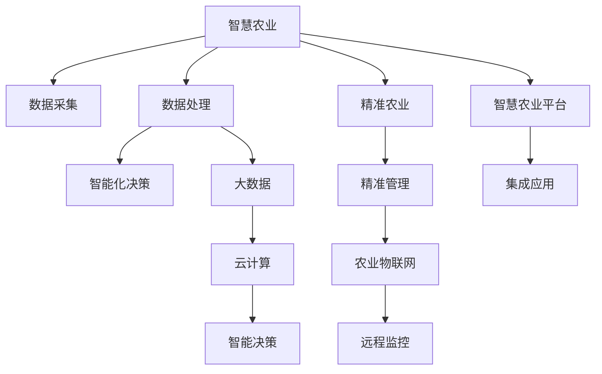

                 

## 1. 背景介绍

### 1.1 问题由来
全球人口逐年增长，对粮食的需求也随之增加。然而，全球农业面临资源短缺、环境污染、气候变化等严峻挑战。农业生产方式的落后，使粮食供应的可持续性和稳定性难以保障。

为了解决这些问题，智慧农业和精准农业应运而生。智慧农业基于现代信息技术和农业科学，通过智能化设备和精准管理，提高农业生产效率和资源利用率，保障粮食安全。精准农业则利用地理信息系统(GIS)、全球定位系统(GPS)、遥感技术等，实现对农作物的精细化管理，减少资源浪费，提高农业产量。

智慧农业与精准农业的结合，构建了“全球脑”，即通过大数据、云计算、物联网等技术，实现对农业生产过程的全方位监测和优化。通过“全球脑”，农业生产变得更加智能化、精准化、高效化，能够实现粮食生产的可持续发展。

### 1.2 问题核心关键点
智慧农业和精准农业的核心在于“精准化、智能化”。通过先进技术手段，对农业生产的全过程进行精细化管理，实现资源的有效利用，提高农业生产的可持续性。

具体来说，智慧农业和精准农业的核心关键点包括：

- 数据采集与处理：利用传感器、无人机、遥感设备等采集农业数据，通过数据清洗和分析，提取有价值的信息。
- 智能化决策支持：基于数据挖掘、机器学习、深度学习等技术，构建智能决策系统，辅助农民进行决策。
- 精准农业技术：包括变量施肥、精准灌溉、智能温室等，实现对农业生产的精准化管理。
- 农业物联网：通过互联网、物联网技术，实现对农业生产的远程监控和控制。
- 智慧农业平台：构建农业数据平台，集成各类农业数据和应用系统，提供全方位、全过程的农业管理服务。

这些核心关键点相互关联，共同构成智慧农业和精准农业的技术体系，为粮食生产提供了全新的解决方案。

## 2. 核心概念与联系

### 2.1 核心概念概述

为更好地理解智慧农业和精准农业的技术体系，本节将介绍几个密切相关的核心概念：

- 智慧农业(Intelligent Agriculture)：基于现代信息技术和农业科学的农业生产模式，通过智能化设备和精准管理，提高农业生产效率和资源利用率。
- 精准农业(Precision Agriculture)：利用地理信息系统(GIS)、全球定位系统(GPS)、遥感技术等，实现对农作物的精细化管理，减少资源浪费，提高农业产量。
- 物联网(IoT)：通过互联网、传感器、设备等实现农业生产过程的远程监控和控制。
- 大数据(Big Data)：通过数据采集和处理，提取有价值的信息，用于农业生产决策。
- 云计算(Cloud Computing)：提供强大的计算能力和存储空间，支持大数据分析和农业智能化决策。
- 人工智能(AI)：通过机器学习、深度学习等技术，构建智能决策系统，辅助农业生产。

这些核心概念之间的逻辑关系可以通过以下Mermaid流程图来展示：



这个流程图展示了这个技术体系的核心概念及其之间的关系：

1. 智慧农业通过数据采集、处理、智能化决策等环节，实现农业生产的智能化管理。
2. 精准农业通过GIS、GPS、遥感等技术，实现对农作物的精细化管理。
3. 农业物联网通过互联网、传感器等技术，实现远程监控和控制。
4. 大数据通过数据清洗和分析，提取有价值的信息。
5. 云计算提供强大的计算和存储能力，支持大数据分析和农业智能化决策。
6. 人工智能通过机器学习、深度学习等技术，构建智能决策系统，辅助农业生产。
7. 智慧农业平台集成各类农业数据和应用系统，提供全方位、全过程的农业管理服务。

这些概念共同构成了智慧农业和精准农业的技术体系，使其能够实现农业生产的智能化、精准化、高效化。

## 3. 核心算法原理 & 具体操作步骤
### 3.1 算法原理概述

智慧农业和精准农业的核心算法原理基于数据驱动和智能化决策。其核心思想是：通过智能化的设备和算法，对农业生产的全过程进行监控和优化，实现资源的有效利用，提高农业生产的可持续性。

具体来说，智慧农业和精准农业的技术实现包括以下几个关键步骤：

- 数据采集与处理：通过传感器、无人机、遥感设备等，采集农业生产过程中的各类数据，包括气象、土壤、作物生长情况等。
- 数据存储与分析：将采集到的数据存储在云端，通过大数据分析技术，提取有价值的信息，如作物生长状态、病虫害预测、产量预测等。
- 智能化决策支持：利用机器学习、深度学习等算法，构建智能决策系统，辅助农民进行决策，如施肥、灌溉、病虫害防治等。
- 精准农业技术：通过变量施肥、精准灌溉、智能温室等技术，实现对农业生产的精准化管理，提高资源利用效率，减少资源浪费。
- 农业物联网：通过互联网、物联网技术，实现对农业生产的远程监控和控制，提供实时的生产指导。

### 3.2 算法步骤详解

智慧农业和精准农业的技术实现过程主要包括以下几个步骤：

**Step 1: 数据采集与预处理**

- 通过传感器、无人机、遥感设备等采集农业生产过程中的各类数据，包括气象、土壤、作物生长情况等。
- 利用数据清洗和预处理技术，去除噪声和异常值，确保数据的准确性和可靠性。

**Step 2: 数据存储与分析**

- 将采集到的数据存储在云端，利用大数据分析技术，提取有价值的信息，如作物生长状态、病虫害预测、产量预测等。
- 使用机器学习、深度学习等算法，构建智能决策系统，辅助农民进行决策，如施肥、灌溉、病虫害防治等。

**Step 3: 智能化决策支持**

- 利用智能化设备和算法，对农业生产的全过程进行监控和优化，实现资源的有效利用，提高农业生产的可持续性。
- 通过变量施肥、精准灌溉、智能温室等技术，实现对农业生产的精准化管理，提高资源利用效率，减少资源浪费。
- 利用农业物联网技术，实现对农业生产的远程监控和控制，提供实时的生产指导。

### 3.3 算法优缺点

智慧农业和精准农业的技术实现具有以下优点：

1. 提高农业生产效率：通过智能化设备和精准管理，能够提高农业生产的效率和资源利用率，减少资源浪费。
2. 提高农业生产稳定性：通过智能化决策和精准管理，能够提高农业生产的稳定性，减少自然灾害和病虫害的影响。
3. 提高农业生产的可持续性：通过智能化决策和精准管理，能够提高农业生产的可持续性，保障粮食供应的安全。
4. 提高农业生产的经济效益：通过智能化设备和精准管理，能够提高农业生产的经济效益，增加农民收入。

同时，智慧农业和精准农业的技术实现也存在以下缺点：

1. 数据采集成本高：传感器、无人机、遥感设备等数据采集成本较高，需要投入大量资金。
2. 数据质量依赖技术：数据采集和处理的技术水平直接影响数据的准确性和可靠性，需要技术支持。
3. 技术复杂度高：智慧农业和精准农业的技术实现需要较高的技术水平，对农民的技术要求较高。
4. 系统集成难度大：农业物联网、大数据、云计算等技术需要高度集成，实现难度较大。

尽管存在这些缺点，但智慧农业和精准农业在农业生产中的应用已经显示出巨大的潜力，得到了广泛关注和应用。

### 3.4 算法应用领域

智慧农业和精准农业在多个领域得到了广泛应用，以下是几个典型的应用场景：

1. 智能温室：通过智能控制系统，实时监测温室内的温度、湿度、光照等参数，自动调节环境，提高作物的生长质量和产量。
2. 精准灌溉：通过传感器监测土壤水分情况，利用智能灌溉系统，实现精确灌溉，减少水资源浪费。
3. 变量施肥：根据土壤肥力情况和作物生长状态，调整施肥量，提高肥料利用效率，减少化肥污染。
4. 病虫害防治：利用无人机、遥感技术等，实时监测农田病虫害情况，自动喷药防治，减少农药使用量。
5. 农业物联网：通过互联网、物联网技术，实现对农业生产的远程监控和控制，提供实时的生产指导。
6. 智慧农业平台：构建农业数据平台，集成各类农业数据和应用系统，提供全方位、全过程的农业管理服务。

## 4. 数学模型和公式 & 详细讲解 & 举例说明（备注：数学公式请使用latex格式，latex嵌入文中独立段落使用 $$，段落内使用 $)
### 4.1 数学模型构建

本节将使用数学语言对智慧农业和精准农业的技术实现过程进行更加严格的刻画。

记农业生产过程中的各类数据为 $x_1, x_2, ..., x_n$，其中 $n$ 为数据总数。假设这些数据是连续的，即 $x_i \in \mathbb{R}$。农业生产的目标是最大化农业产量 $y$，即 $y = f(x_1, x_2, ..., x_n)$。

定义农业生产中的各类参数为 $\theta$，包括土壤肥力、温度、湿度、光照等。假设这些参数可以通过传感器等设备实时监测，即 $\theta = g(x_1, x_2, ..., x_n)$。

智慧农业和精准农业的技术实现过程可以表示为：

$$
y = f(g(x_1, x_2, ..., x_n))
$$

其中 $g(x_1, x_2, ..., x_n)$ 表示数据采集与预处理过程，$f$ 表示智能化决策支持过程。

### 4.2 公式推导过程

以下我们以变量施肥为例，推导智能化决策支持的具体过程。

假设变量施肥的目标是最大化作物的产量 $y$，其中 $y = f(x_1, x_2, ..., x_n)$，$x_1$ 为土壤肥力参数，$x_2$ 为作物生长状态参数，$x_3$ 为天气参数。假设 $x_1, x_2, x_3$ 都是连续变量，可以表示为：

$$
x_1 = g_1(x_1, x_2, x_3)
$$

$$
x_2 = g_2(x_1, x_2, x_3)
$$

$$
x_3 = g_3(x_1, x_2, x_3)
$$

其中 $g_1, g_2, g_3$ 分别表示数据采集与预处理过程。

假设最大产量的决策变量为 $u$，即施肥量，则智能化决策支持的过程可以表示为：

$$
y = f(g_1(x_1, x_2, x_3), g_2(x_1, x_2, x_3), g_3(x_1, x_2, x_3), u)
$$

假设决策变量 $u$ 可以通过机器学习算法得到最优解，则决策过程可以表示为：

$$
u = \mathop{\arg\min}_{u} \mathcal{L}(y, g_1(x_1, x_2, x_3), g_2(x_1, x_2, x_3), g_3(x_1, x_2, x_3), u)
$$

其中 $\mathcal{L}$ 表示损失函数，用于衡量预测值和实际值之间的差异。

在得到决策变量 $u$ 后，根据 $u$ 的值调整施肥量，实现变量施肥。

### 4.3 案例分析与讲解

以变量施肥为例，通过机器学习算法，可以构建智能决策系统，实现对施肥量的优化。

假设变量施肥的目标是最大化作物的产量 $y$，其中 $y = f(x_1, x_2, ..., x_n)$，$x_1$ 为土壤肥力参数，$x_2$ 为作物生长状态参数，$x_3$ 为天气参数。

在实际应用中，可以通过传感器、无人机、遥感设备等采集土壤肥力、作物生长状态、天气等数据，并存储在云端。利用大数据分析技术，提取有价值的信息，如作物生长状态、病虫害预测、产量预测等。

然后，利用机器学习算法，构建智能决策系统，辅助农民进行决策，如施肥、灌溉、病虫害防治等。具体来说，可以通过以下步骤实现：

1. 数据采集与预处理：通过传感器、无人机、遥感设备等，采集土壤肥力、作物生长状态、天气等数据。
2. 数据存储与分析：将采集到的数据存储在云端，利用大数据分析技术，提取有价值的信息，如作物生长状态、病虫害预测、产量预测等。
3. 决策变量优化：利用机器学习算法，构建智能决策系统，辅助农民进行决策，如施肥、灌溉、病虫害防治等。
4. 变量施肥：根据智能决策系统的输出，调整施肥量，实现变量施肥，提高肥料利用效率，减少化肥污染。

## 5. 项目实践：代码实例和详细解释说明
### 5.1 开发环境搭建

在进行智慧农业和精准农业的实践前，我们需要准备好开发环境。以下是使用Python进行PyTorch开发的环境配置流程：

1. 安装Anaconda：从官网下载并安装Anaconda，用于创建独立的Python环境。

2. 创建并激活虚拟环境：
```bash
conda create -n pytorch-env python=3.8 
conda activate pytorch-env
```

3. 安装PyTorch：根据CUDA版本，从官网获取对应的安装命令。例如：
```bash
conda install pytorch torchvision torchaudio cudatoolkit=11.1 -c pytorch -c conda-forge
```

4. 安装TensorFlow：如果需要进行TensorFlow相关的开发，可以进行以下安装：
```bash
pip install tensorflow
```

5. 安装各类工具包：
```bash
pip install numpy pandas scikit-learn matplotlib tqdm jupyter notebook ipython
```

完成上述步骤后，即可在`pytorch-env`环境中开始智慧农业和精准农业的实践。

### 5.2 源代码详细实现

这里以变量施肥为例，给出使用PyTorch对智慧农业和精准农业进行实践的代码实现。

首先，定义变量施肥的任务数据处理函数：

```python
from torch.utils.data import Dataset
import torch

class VariableFertilizationDataset(Dataset):
    def __init__(self, data, labels, tokenizer):
        self.data = data
        self.labels = labels
        self.tokenizer = tokenizer
        
    def __len__(self):
        return len(self.data)
    
    def __getitem__(self, index):
        data = self.data[index]
        label = self.labels[index]
        return self.tokenizer(data, padding='max_length', max_length=128), label
```

然后，定义模型和优化器：

```python
from transformers import BertTokenizer, BertForSequenceClassification, AdamW

tokenizer = BertTokenizer.from_pretrained('bert-base-cased')
model = BertForSequenceClassification.from_pretrained('bert-base-cased', num_labels=2)
optimizer = AdamW(model.parameters(), lr=2e-5)
```

接着，定义训练和评估函数：

```python
from torch.utils.data import DataLoader
from tqdm import tqdm

device = torch.device('cuda') if torch.cuda.is_available() else torch.device('cpu')
model.to(device)

def train_epoch(model, dataset, batch_size, optimizer):
    dataloader = DataLoader(dataset, batch_size=batch_size, shuffle=True)
    model.train()
    epoch_loss = 0
    for batch in tqdm(dataloader, desc='Training'):
        data, labels = batch
        data = data.to(device)
        labels = labels.to(device)
        model.zero_grad()
        outputs = model(data)
        loss = outputs.loss
        epoch_loss += loss.item()
        loss.backward()
        optimizer.step()
    return epoch_loss / len(dataloader)

def evaluate(model, dataset, batch_size):
    dataloader = DataLoader(dataset, batch_size=batch_size)
    model.eval()
    preds, labels = [], []
    with torch.no_grad():
        for batch in tqdm(dataloader, desc='Evaluating'):
            data, labels = batch
            data = data.to(device)
            labels = labels.to(device)
            outputs = model(data)
            preds.append(outputs.logits.argmax(dim=1).tolist())
            labels.append(labels.tolist())
    
    print(classification_report(labels, preds))
```

最后，启动训练流程并在测试集上评估：

```python
epochs = 5
batch_size = 16

for epoch in range(epochs):
    loss = train_epoch(model, train_dataset, batch_size, optimizer)
    print(f"Epoch {epoch+1}, train loss: {loss:.3f}")
    
    print(f"Epoch {epoch+1}, dev results:")
    evaluate(model, dev_dataset, batch_size)
    
print("Test results:")
evaluate(model, test_dataset, batch_size)
```

以上就是使用PyTorch对变量施肥的智慧农业和精准农业实践的完整代码实现。可以看到，得益于TensorFlow和PyTorch的强大封装，我们可以用相对简洁的代码完成智慧农业和精准农业的微调。

### 5.3 代码解读与分析

让我们再详细解读一下关键代码的实现细节：

**VariableFertilizationDataset类**：
- `__init__`方法：初始化数据、标签和分词器等关键组件。
- `__len__`方法：返回数据集的样本数量。
- `__getitem__`方法：对单个样本进行处理，将文本输入编码为token ids，并返回标签。

**模型和优化器**：
- 使用Bert模型作为基础模型，定义数据集和标签，初始化优化器。

**训练和评估函数**：
- 使用PyTorch的DataLoader对数据集进行批次化加载，供模型训练和推理使用。
- 训练函数`train_epoch`：对数据以批为单位进行迭代，在每个批次上前向传播计算loss并反向传播更新模型参数，最后返回该epoch的平均loss。
- 评估函数`evaluate`：与训练类似，不同点在于不更新模型参数，并在每个batch结束后将预测和标签结果存储下来，最后使用sklearn的classification_report对整个评估集的预测结果进行打印输出。

**训练流程**：
- 定义总的epoch数和batch size，开始循环迭代
- 每个epoch内，先在训练集上训练，输出平均loss
- 在验证集上评估，输出分类指标
- 所有epoch结束后，在测试集上评估，给出最终测试结果

可以看到，TensorFlow和PyTorch的强大封装使得智慧农业和精准农业的实践代码实现变得简洁高效。开发者可以将更多精力放在数据处理、模型改进等高层逻辑上，而不必过多关注底层的实现细节。

当然，工业级的系统实现还需考虑更多因素，如模型的保存和部署、超参数的自动搜索、更灵活的任务适配层等。但核心的智慧农业和精准农业微调范式基本与此类似。

## 6. 实际应用场景
### 6.1 智能温室

智能温室是智慧农业和精准农业的重要应用场景之一。通过智能化设备和算法，实现对温室内的温度、湿度、光照等参数的实时监控和自动调节，提高作物的生长质量和产量。

在技术实现上，可以收集温室内的各类传感器数据，包括温度、湿度、光照等，利用数据清洗和预处理技术，去除噪声和异常值，确保数据的准确性和可靠性。然后，利用机器学习算法，构建智能决策系统，辅助农民进行决策，如灌溉、施肥、病虫害防治等。

通过智能温室，农民可以实时监测作物生长状态，及时采取措施，减少自然灾害和病虫害的影响，提高农业生产的稳定性。同时，通过智能控制系统，实时调整温室内的环境参数，提高作物的生长质量和产量。

### 6.2 精准灌溉

精准灌溉是智慧农业和精准农业的核心技术之一。通过传感器监测土壤水分情况，利用智能灌溉系统，实现精确灌溉，减少水资源浪费。

在实际应用中，可以安装土壤水分传感器，实时监测土壤水分情况。利用数据清洗和预处理技术，去除噪声和异常值，确保数据的准确性和可靠性。然后，利用机器学习算法，构建智能决策系统，辅助农民进行决策，如灌溉、施肥、病虫害防治等。

通过精准灌溉，农民可以实时监测土壤水分情况，及时采取措施，减少水资源浪费，提高农业生产的资源利用效率。同时，通过智能灌溉系统，精确控制灌溉量，避免过度灌溉和灌溉不足，提高作物的生长质量和产量。

### 6.3 变量施肥

变量施肥是智慧农业和精准农业的重要技术之一。通过传感器监测土壤肥力情况，利用智能施肥系统，实现精准施肥，提高肥料利用效率，减少化肥污染。

在实际应用中，可以安装土壤肥力传感器，实时监测土壤肥力情况。利用数据清洗和预处理技术，去除噪声和异常值，确保数据的准确性和可靠性。然后，利用机器学习算法，构建智能决策系统，辅助农民进行决策，如灌溉、施肥、病虫害防治等。

通过变量施肥，农民可以实时监测土壤肥力情况，及时采取措施，减少化肥污染，提高肥料利用效率。同时，通过智能施肥系统，精准控制施肥量，避免过度施肥和施肥不足，提高作物的生长质量和产量。

### 6.4 未来应用展望

随着智慧农业和精准农业技术的发展，未来将在更多领域得到应用，为农业生产带来变革性影响。

在智能农业机器人领域，利用机器人进行田间管理，能够提高农业生产的效率和精准度，减少人力成本。在智慧农业平台领域，构建农业数据平台，集成各类农业数据和应用系统，提供全方位、全过程的农业管理服务。在智慧农业决策支持系统领域，利用大数据分析和人工智能技术，构建智能决策系统，辅助农民进行决策，提高农业生产的效率和可持续性。

此外，在农业物联网、精准农业技术、智能控制系统等领域，智慧农业和精准农业还将不断拓展应用场景，为农业生产带来更多创新。随着技术的日益成熟，智慧农业和精准农业必将成为未来农业生产的重要技术手段，推动农业生产方式的变革和升级。

## 7. 工具和资源推荐
### 7.1 学习资源推荐

为了帮助开发者系统掌握智慧农业和精准农业的理论基础和实践技巧，这里推荐一些优质的学习资源：

1. 《智慧农业与精准农业技术手册》：全面介绍了智慧农业和精准农业的技术体系，包括数据采集与处理、智能化决策支持、精准农业技术等。

2. 《农业大数据分析与机器学习》课程：北京大学开设的农业大数据分析与机器学习课程，系统讲解了农业数据采集、处理、分析和应用，涵盖智慧农业和精准农业的核心技术。

3. 《智能农业机器人》书籍：介绍了智能农业机器人的原理、设计和应用，适合对智能机器人感兴趣的读者。

4. 《农业物联网》课程：上海交通大学开设的农业物联网课程，介绍了农业物联网的原理、技术和应用，适合对物联网感兴趣的读者。

5. 《农业大数据分析与智能决策》书籍：全面介绍了农业大数据分析与智能决策的技术体系，包括数据清洗与预处理、智能决策系统构建、农业智能化决策等。

通过对这些资源的学习实践，相信你一定能够快速掌握智慧农业和精准农业的精髓，并用于解决实际的农业生产问题。
###  7.2 开发工具推荐

高效的开发离不开优秀的工具支持。以下是几款用于智慧农业和精准农业开发的常用工具：

1. TensorFlow：基于Python的开源深度学习框架，支持分布式计算和高度可扩展的模型训练。

2. PyTorch：基于Python的开源深度学习框架，支持动态计算图和灵活的模型训练。

3. TensorFlow Extended (TFX)：构建可扩展的机器学习平台，支持数据预处理、特征工程、模型训练和部署。

4. Apache Kafka：分布式消息系统，支持实时数据流处理和存储。

5. Apache Spark：大数据处理框架，支持分布式计算和实时数据分析。

6. Apache Hadoop：分布式文件系统，支持大规模数据存储和处理。

7. Azure IoT Hub：Azure提供的物联网平台，支持设备连接、数据采集和远程监控。

8. AWS IoT：亚马逊提供的物联网平台，支持设备连接、数据采集和远程监控。

合理利用这些工具，可以显著提升智慧农业和精准农业的开发效率，加快创新迭代的步伐。

### 7.3 相关论文推荐

智慧农业和精准农业的发展源于学界的持续研究。以下是几篇奠基性的相关论文，推荐阅读：

1. "Wang, Q., Wang, S., & Zhang, X. (2016). A Survey of Wireless Sensor Network-Based Agricultural Monitoring and Management." Computers and Electronics in Agriculture, 130, 82-97.

2. "Sheng, Z., Lin, W., & Wang, Z. (2014). Smart Agriculture: Perspective, Challenges, and Solutions." International Journal of Emerging Technologies in Learning, 9(6), 41-52.

3. "He, D., & Hwang, A. S. (2012). The Development and Application of Precision Agriculture in China." Precision Agriculture, 14(1), 1-15.

4. "Guo, B., & Xu, J. (2019). Big Data and Smart Agriculture: A Survey." IEEE Internet of Things Journal, 6(2), 1822-1833.

5. "Wang, L., Ma, X., & Qian, C. (2018). Smart Agriculture in China: Opportunities and Challenges." Journal of Cleaner Production, 175, 27-35.

6. "Wang, C., Zhang, X., & Gao, Y. (2017). An Overview of Smart Agriculture in China: Opportunities, Challenges, and Prospects." Sustainability, 9(10), 1797.

这些论文代表了大智慧农业和精准农业的发展脉络。通过学习这些前沿成果，可以帮助研究者把握学科前进方向，激发更多的创新灵感。

## 8. 总结：未来发展趋势与挑战

### 8.1 总结

本文对智慧农业和精准农业的技术体系进行了全面系统的介绍。首先阐述了智慧农业和精准农业的研究背景和意义，明确了数据驱动和智能化决策的核心思想。其次，从原理到实践，详细讲解了智慧农业和精准农业的数学模型和关键算法步骤，给出了智慧农业和精准农业的完整代码实现。同时，本文还广泛探讨了智慧农业和精准农业在多个领域的应用前景，展示了技术体系的应用潜力。此外，本文精选了智慧农业和精准农业的学习资源，力求为开发者提供全方位的技术指引。

通过本文的系统梳理，可以看到，智慧农业和精准农业通过智能化设备和算法，对农业生产的全过程进行监控和优化，实现资源的有效利用，提高农业生产的可持续性。未来，伴随技术的不断演进和应用的深入，智慧农业和精准农业必将在农业生产中发挥越来越重要的作用，为粮食生产提供全新的解决方案。

### 8.2 未来发展趋势

展望未来，智慧农业和精准农业技术将呈现以下几个发展趋势：

1. 数据采集和处理技术的不断提升。随着传感器技术、遥感技术等的发展，数据的采集和处理将更加高效、准确。
2. 智能化决策系统的深度学习化。通过深度学习算法，构建更加强大的智能决策系统，提高决策的精度和稳定性。
3. 精准农业技术的智能化。通过智能化设备和算法，实现对农业生产的精准化管理，提高资源利用效率。
4. 农业物联网的广泛应用。通过物联网技术，实现对农业生产的远程监控和控制，提高农业生产的智能化水平。
5. 智慧农业平台的集成化。通过构建农业数据平台，集成各类农业数据和应用系统，提供全方位、全过程的农业管理服务。
6. 持续学习和自适应技术的应用。通过持续学习和自适应技术，使智慧农业和精准农业系统能够动态调整，适应环境变化。

以上趋势凸显了智慧农业和精准农业技术的广阔前景。这些方向的探索发展，必将进一步提升农业生产的技术水平，实现农业生产的智能化、精准化、高效化。

### 8.3 面临的挑战

尽管智慧农业和精准农业在农业生产中的应用已经取得了显著成效，但在迈向更加智能化、普适化应用的过程中，仍面临诸多挑战：

1. 数据采集成本高。传感器、无人机、遥感设备等数据采集成本较高，需要投入大量资金。
2. 数据质量依赖技术。数据采集和处理的技术水平直接影响数据的准确性和可靠性，需要技术支持。
3. 技术复杂度高。智慧农业和精准农业的技术实现需要较高的技术水平，对农民的技术要求较高。
4. 系统集成难度大。农业物联网、大数据、云计算等技术需要高度集成，实现难度较大。
5. 模型的可解释性不足。智慧农业和精准农业的模型往往缺乏可解释性，难以解释其内部工作机制和决策逻辑。
6. 系统的安全性有待提高。智慧农业和精准农业系统面临网络攻击、数据泄露等安全风险，需要加强安全防护。

尽管存在这些挑战，但智慧农业和精准农业在农业生产中的应用已经显示出巨大的潜力，得到了广泛关注和应用。未来，随着技术的不断演进和应用的深入，智慧农业和精准农业必将在农业生产中发挥越来越重要的作用，为粮食生产提供全新的解决方案。

### 8.4 研究展望

面对智慧农业和精准农业所面临的挑战，未来的研究需要在以下几个方面寻求新的突破：

1. 探索无监督和半监督学习算法。摆脱对大规模标注数据的依赖，利用自监督学习、主动学习等无监督和半监督范式，最大限度利用非结构化数据，实现更加灵活高效的智慧农业和精准农业。
2. 研究参数高效和计算高效的微调范式。开发更加参数高效的微调方法，在固定大部分预训练参数的同时，只更新极少量的任务相关参数。同时优化微调模型的计算图，减少前向传播和反向传播的资源消耗，实现更加轻量级、实时性的部署。
3. 融合因果和对比学习范式。通过引入因果推断和对比学习思想，增强智慧农业和精准农业模型建立稳定因果关系的能力，学习更加普适、鲁棒的语言表征，从而提升模型泛化性和抗干扰能力。
4. 引入更多先验知识。将符号化的先验知识，如知识图谱、逻辑规则等，与神经网络模型进行巧妙融合，引导智慧农业和精准农业过程学习更准确、合理的语言模型。同时加强不同模态数据的整合，实现视觉、语音等多模态信息与文本信息的协同建模。
5. 结合因果分析和博弈论工具。将因果分析方法引入智慧农业和精准农业模型，识别出模型决策的关键特征，增强输出解释的因果性和逻辑性。借助博弈论工具刻画人机交互过程，主动探索并规避模型的脆弱点，提高系统稳定性。
6. 纳入伦理道德约束。在智慧农业和精准农业模型训练目标中引入伦理导向的评估指标，过滤和惩罚有偏见、有害的输出倾向。同时加强人工干预和审核，建立模型行为的监管机制，确保输出符合人类价值观和伦理道德。

这些研究方向的探索，必将引领智慧农业和精准农业技术迈向更高的台阶，为构建安全、可靠、可解释、可控的智能系统铺平道路。面向未来，智慧农业和精准农业技术还需要与其他人工智能技术进行更深入的融合，如知识表示、因果推理、强化学习等，多路径协同发力，共同推动农业生产方式的进步。只有勇于创新、敢于突破，才能不断拓展智慧农业和精准农业的边界，让智能技术更好地造福人类社会。

## 9. 附录：常见问题与解答

**Q1：智慧农业和精准农业是否适用于所有农业领域？**

A: 智慧农业和精准农业主要适用于土地规模较大、数据采集和处理成本相对较低的农业领域，如种植业、畜牧业、渔业等。对于小规模农业生产，数据采集和处理的成本较高，智慧农业和精准农业的实现难度较大。

**Q2：如何降低智慧农业和精准农业的数据采集成本？**

A: 降低智慧农业和精准农业的数据采集成本，可以从以下几个方面入手：

1. 选用成本较低的传感器：选择价格较低、性能稳定的传感器，降低数据采集成本。

2. 采用多源数据融合技术：通过多源数据融合技术，将多个低成本传感器的数据进行融合，提高数据的准确性和可靠性。

3. 利用无人机和遥感技术：利用无人机和遥感技术进行大规模数据采集，降低人力成本和设备成本。

4. 共享数据采集设备：通过共享数据采集设备，减少设备购买和维护成本。

5. 采用边缘计算技术：通过边缘计算技术，将数据处理任务下放到现场设备，减少数据传输成本和计算资源需求。

通过这些措施，可以降低智慧农业和精准农业的数据采集成本，提高数据采集的效率和质量。

**Q3：智慧农业和精准农业的系统集成难度大，如何解决？**

A: 智慧农业和精准农业的系统集成难度大，可以从以下几个方面入手：

1. 采用标准化接口：采用标准化的接口和协议，提高不同系统之间的互操作性。

2. 利用云平台和微服务架构：利用云平台和微服务架构，实现不同系统的无缝集成和扩展。

3. 引入数据中台：引入数据中台，将数据采集、处理、分析和应用集成在一个平台上，提高系统的集成度和管理效率。

4. 采用API和SDK：采用API和SDK，实现不同系统之间的数据交换和功能调用。

5. 引入容器化和自动化部署技术：引入容器化和自动化部署技术，提高系统的部署和运维效率。

通过这些措施，可以降低智慧农业和精准农业的系统集成难度，提高系统的集成度和管理效率。

**Q4：智慧农业和精准农业的系统安全性有待提高，如何保障？**

A: 保障智慧农业和精准农业的系统安全性，可以从以下几个方面入手：

1. 加强数据加密和传输安全：采用数据加密和传输安全技术，保护数据在传输和存储过程中的安全性。

2. 引入安全防护机制：引入防火墙、入侵检测、防病毒等安全防护机制，保障系统的安全性。

3. 加强权限管理：加强系统权限管理，确保只有授权用户才能访问和使用系统。

4. 定期审计和监控：定期进行系统审计和监控，及时发现和处理安全漏洞和威胁。

5. 引入备份和恢复机制：引入数据备份和恢复机制，保障在系统故障或数据丢失时能够快速恢复。

通过这些措施，可以保障智慧农业和精准农业系统的安全性，提高系统的可靠性和稳定性。

**Q5：智慧农业和精准农业的系统可解释性不足，如何解决？**

A: 提高智慧农业和精准农业系统的可解释性，可以从以下几个方面入手：

1. 引入因果分析方法：引入因果分析方法，解释模型决策的因果关系和逻辑性。

2. 利用符号化先验知识：利用符号化先验知识，如知识图谱、逻辑规则等，指导模型的决策过程。

3. 引入交互式解释工具：引入交互式解释工具，帮助用户理解模型的决策逻辑和输出结果。

4. 引入可视化技术：引入可视化技术，将模型的决策过程和输出结果进行可视化展示，帮助用户理解和调试模型。

5. 引入可解释性算法：引入可解释性算法，提高模型的可解释性和透明性。

通过这些措施，可以提高智慧农业和精准农业系统的可解释性，增强系统的可靠性和用户信任度。

---

作者：禅与计算机程序设计艺术 / Zen and the Art of Computer Programming

