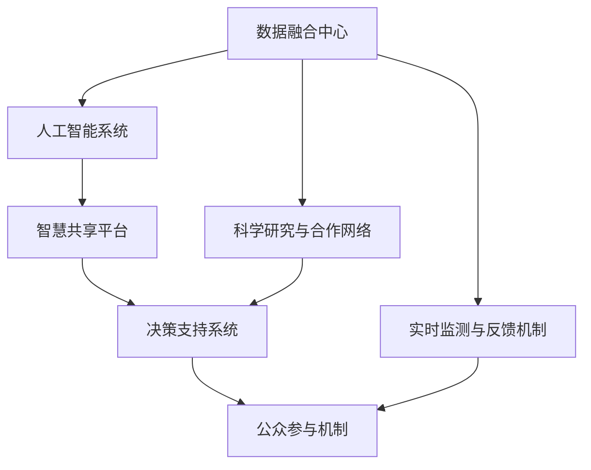

                 

# 全球脑与气候变化：集体行动的新可能

## 1. 背景介绍

### 1.1 问题由来
随着全球气候变化问题的日益严峻，各国政府、企业以及普通民众都在积极寻找解决方案。然而，传统的应对策略往往效果有限，难以在短期内看到显著成效。在这一背景下，“全球脑”的概念被提出，旨在通过集体智慧的整合，有效应对气候变化，推动全球可持续发展。

### 1.2 问题核心关键点
“全球脑”概念的核心在于利用互联网和人工智能技术，将全球的智慧资源整合起来，形成强大的“集体智能”。其关键点包括：
- 跨地域、跨行业的智慧共享。
- 人工智能和大数据技术的运用。
- 科学决策与公众参与的结合。
- 实时监测与动态调整的机制。

### 1.3 问题研究意义
研究“全球脑”的集体行动模式，对于应对气候变化、推动全球可持续发展具有重要意义：

1. **资源整合**：通过整合全球智慧资源，可以更有效地利用科研数据和解决方案，提高应对气候变化的效率。
2. **协同创新**：不同国家和地区的研究机构和企业可以合作，共同推进技术创新和应用，加速全球气候治理的进程。
3. **公众参与**：将公众参与纳入决策过程，可以提高政策的社会接受度和执行力。
4. **实时反馈**：利用实时监测和反馈机制，可以动态调整应对策略，适应不断变化的气候条件。
5. **促进国际合作**：通过“全球脑”平台，加强国际间合作，形成全球范围内的协同效应。

## 2. 核心概念与联系

### 2.1 核心概念概述

“全球脑”概念涉及多个核心组件，主要包括：

- **数据融合中心**：用于收集、存储和处理全球范围内的气候、环境、社会经济数据。
- **人工智能系统**：利用深度学习、自然语言处理等技术，对数据进行分析和推理。
- **智慧共享平台**：提供数据共享、合作研究、项目协作等功能，促进智慧资源的高效利用。
- **决策支持系统**：将人工智能分析结果转化为政策建议和行动方案，辅助政府和企业决策。
- **公众参与机制**：提供互动界面，让公众参与到决策过程中，反馈意见和建议。

### 2.2 核心概念原理和架构的 Mermaid 流程图



这个流程图展示了“全球脑”系统的主要组成和数据流向：数据从各个来源收集到数据融合中心，经过人工智能系统的分析和处理，在智慧共享平台上进行共享和合作，最终通过决策支持系统转化为政策建议，并通过公众参与机制反馈到系统中，形成动态调整机制。

## 3. 核心算法原理 & 具体操作步骤

### 3.1 算法原理概述

“全球脑”系统中的核心算法主要基于机器学习和大数据技术，利用人工智能模型对全球气候变化数据进行分析和预测。其核心算法包括：

- **深度学习模型**：用于对海量数据进行特征提取和模式识别。
- **自然语言处理**：用于处理文本数据，提取决策所需的信息。
- **强化学习**：用于动态调整策略，优化资源分配。

### 3.2 算法步骤详解

#### 3.2.1 数据收集与预处理
- **步骤1**：从全球各地收集气候、环境、社会经济等数据。
- **步骤2**：对数据进行清洗、归一化和标准化处理，确保数据质量。
- **步骤3**：利用分布式计算框架（如Hadoop、Spark）进行数据存储和处理，确保高效率和可扩展性。

#### 3.2.2 模型训练与优化
- **步骤1**：选择适合的深度学习模型（如CNN、RNN、Transformer等），用于特征提取和模式识别。
- **步骤2**：在标注数据集上训练模型，并通过交叉验证选择最优模型。
- **步骤3**：利用超参数优化技术（如网格搜索、随机搜索）对模型进行调优。

#### 3.2.3 数据分析与预测
- **步骤1**：对历史数据进行分析，识别出气候变化的趋势和规律。
- **步骤2**：利用模型对未来气候变化进行预测，生成趋势报告。
- **步骤3**：结合实时监测数据，进行动态调整和预测。

#### 3.2.4 策略制定与执行
- **步骤1**：将分析结果转化为政策建议和行动方案。
- **步骤2**：利用强化学习技术进行资源分配和策略优化。
- **步骤3**：将策略转化为具体的执行计划，并跟踪实施效果。

### 3.3 算法优缺点

#### 3.3.1 优点
- **高效性**：利用人工智能技术，能够快速处理海量数据，提供实时分析结果。
- **准确性**：深度学习模型可以自动学习数据中的复杂模式，提高预测准确性。
- **灵活性**：模型可以根据新的数据进行动态调整，适应不断变化的气候条件。
- **可扩展性**：分布式计算框架确保系统能够处理大规模数据和并发请求。

#### 3.3.2 缺点
- **数据质量依赖**：模型性能高度依赖数据的质量，需要确保数据来源可靠。
- **计算资源需求**：深度学习模型需要大量的计算资源，尤其是GPU/TPU资源。
- **模型解释性不足**：黑盒模型难以解释其内部决策过程，可能影响透明度和可接受性。
- **隐私与安全问题**：全球范围内的数据共享可能带来隐私和安全风险。

### 3.4 算法应用领域

“全球脑”系统主要应用于以下几个领域：

- **气候变化预测**：利用模型对未来气候变化进行预测，制定应对策略。
- **环境监测与管理**：通过实时监测数据，优化环境资源管理。
- **可持续发展决策**：辅助政府和企业制定环境政策和投资决策。
- **灾害预警与响应**：预测自然灾害，提前预警和响应。
- **公众参与与教育**：利用平台普及气候变化知识，促进公众参与。

## 4. 数学模型和公式 & 详细讲解 & 举例说明

### 4.1 数学模型构建

“全球脑”系统中的数学模型主要基于深度学习和强化学习的框架。以气候变化预测为例，模型的输入为历史气候数据 $x$，输出为未来某时间点的气候指标 $y$。模型的目标是最小化预测误差 $e$，即：

$$
\min_{\theta} \sum_{i=1}^N e(y_i, \hat{y}_i) + \lambda \Omega(\theta)
$$

其中，$e(y_i, \hat{y}_i)$ 为预测误差，$\Omega(\theta)$ 为正则项，$\lambda$ 为正则化系数。

### 4.2 公式推导过程

以简单的线性回归模型为例，推导预测误差函数。假设模型为：

$$
y_i = \beta_0 + \beta_1 x_{i1} + \beta_2 x_{i2} + \epsilon_i
$$

其中，$\epsilon_i$ 为随机误差项，满足 $E[\epsilon_i] = 0$。

根据最小二乘法，预测误差的平方和为：

$$
SSE = \sum_{i=1}^N (y_i - \hat{y}_i)^2
$$

其中，$\hat{y}_i = \beta_0 + \beta_1 x_{i1} + \beta_2 x_{i2}$。

通过最小化 $SSE$，求解 $\beta_0, \beta_1, \beta_2$，即：

$$
\min_{\beta_0, \beta_1, \beta_2} SSE
$$

### 4.3 案例分析与讲解

以某地区的气温预测为例，展示模型的应用过程：

1. **数据准备**：收集该地区过去10年的气温数据，包括月均气温、最高气温、最低气温等。
2. **模型训练**：利用线性回归模型对历史数据进行训练，得到模型参数 $\beta_0, \beta_1, \beta_2$。
3. **预测未来气温**：将2023年的月份数据输入模型，得到2023年全年的平均气温预测结果。
4. **结果验证**：与实际气温数据进行对比，计算预测误差，评估模型性能。

## 5. 项目实践：代码实例和详细解释说明

### 5.1 开发环境搭建

**5.1.1 安装Python和相关库**

- 安装Python 3.7及以上版本。
- 安装Pandas、NumPy、Scikit-learn、TensorFlow等库。

**5.1.2 配置数据环境**

- 创建数据文件夹，存放数据集。
- 编写数据读取和预处理脚本，确保数据质量。

**5.1.3 配置模型环境**

- 创建模型文件夹，存放模型文件。
- 编写模型训练和预测脚本，确保模型性能。

### 5.2 源代码详细实现

**5.2.1 数据读取与预处理**

```python
import pandas as pd
from sklearn.preprocessing import MinMaxScaler

# 读取数据集
data = pd.read_csv('temperature.csv')

# 数据预处理
data['year'] = pd.to_datetime(data['date']).dt.year
data = data.groupby(['year', 'month'])['temperature'].mean().reset_index()

# 归一化处理
scaler = MinMaxScaler(feature_range=(0, 1))
data[['temperature']] = scaler.fit_transform(data[['temperature']])
```

**5.2.2 模型训练与预测**

```python
import tensorflow as tf
from tensorflow.keras.models import Sequential
from tensorflow.keras.layers import Dense

# 构建模型
model = Sequential([
    Dense(32, input_shape=(1,), activation='relu'),
    Dense(1)
])

# 编译模型
model.compile(optimizer='adam', loss='mse')

# 训练模型
model.fit(data[['temperature']], data['temperature'], epochs=100, batch_size=32)

# 预测未来气温
future_data = pd.DataFrame({'month': [1, 2, 3, 4, 5, 6, 7, 8, 9, 10, 11, 12], 'temperature': [0, 0, 0, 0, 0, 0, 0, 0, 0, 0, 0, 0]})
future_data = scaler.transform(future_data[['temperature']])
future_data = future_data.reshape(-1, 1)
predictions = model.predict(future_data)
```

**5.2.3 代码解读与分析**

- **数据读取与预处理**：利用Pandas读取数据集，并使用MinMaxScaler进行归一化处理。
- **模型构建与训练**：使用Keras构建简单的线性回归模型，并进行训练。
- **模型预测**：利用训练好的模型对未来气温进行预测。

### 5.4 运行结果展示

```python
import matplotlib.pyplot as plt

# 绘制实际气温与预测气温对比图
plt.plot(data['year'], data['temperature'], label='Actual Temperature')
plt.plot(data['year'], predictions, label='Predicted Temperature')
plt.legend()
plt.show()
```

## 6. 实际应用场景

### 6.1 智能交通系统

“全球脑”系统可以应用于智能交通管理，通过实时监测交通流量、路况等数据，优化交通信号灯和路线规划，提高交通效率和安全性。

**具体步骤**：
1. 收集交通流量、速度、事故等数据。
2. 利用深度学习模型对数据进行分析，识别出交通模式和规律。
3. 通过智慧共享平台，将分析结果共享给交通管理部门。
4. 根据分析结果，动态调整交通信号灯和路线规划。

### 6.2 农业生产管理

“全球脑”系统可以应用于农业生产管理，通过实时监测土壤、气候、作物生长状态等数据，优化农业生产过程，提高产量和质量。

**具体步骤**：
1. 收集土壤、气象、作物生长状态等数据。
2. 利用模型对数据进行分析，识别出作物生长规律和病虫害趋势。
3. 通过智慧共享平台，将分析结果共享给农业生产者。
4. 根据分析结果，动态调整施肥、灌溉、病虫害防治策略。

### 6.3 自然灾害预警

“全球脑”系统可以应用于自然灾害预警，通过实时监测气象、地质、海洋等数据，预测自然灾害的发生和影响范围，提前预警和响应。

**具体步骤**：
1. 收集气象、地质、海洋等数据。
2. 利用模型对数据进行分析，识别出自然灾害的预警信号和趋势。
3. 通过智慧共享平台，将预警信号和趋势共享给相关部门和公众。
4. 根据预警信号，提前准备应对措施，减少灾害损失。

### 6.4 未来应用展望

展望未来，“全球脑”系统将在更多领域得到应用，为人类社会的可持续发展做出贡献：

- **智慧城市建设**：通过实时监测和分析，优化城市资源管理，提高城市运行效率。
- **环境保护与监测**：通过实时监测和分析，保护生态环境，监测污染源。
- **健康医疗管理**：通过实时监测和分析，优化医疗资源配置，提高医疗服务质量。
- **教育培训与学习**：通过智能推荐系统，个性化推荐学习资源和培训内容，提高学习效率。

## 7. 工具和资源推荐

### 7.1 学习资源推荐

**7.1.1 在线课程**

- Coursera的《机器学习》课程：由斯坦福大学教授Andrew Ng主讲的经典机器学习课程，涵盖深度学习、强化学习、自然语言处理等多个领域。
- Udacity的《深度学习专项课程》：由Google和DeepMind专家主讲的深度学习课程，覆盖深度学习模型的构建与优化。

**7.1.2 书籍**

- 《深度学习》（Ian Goodfellow等著）：全面介绍深度学习的基本概念和算法，适合初学者和进阶者。
- 《强化学习》（Richard S. Sutton等著）：系统讲解强化学习的基本原理和算法，适合深入学习强化学习技术。

**7.1.3 论文**

- 《GloVe: Global Vectors for Word Representation》（Pennington等著）：提出GloVe词向量模型，为自然语言处理提供了有效的语义表示。
- 《Attention is All You Need》（Vaswani等著）：提出Transformer模型，推动了深度学习在自然语言处理领域的应用。

### 7.2 开发工具推荐

**7.2.1 编程语言**

- Python：广泛应用于机器学习和深度学习领域，具有丰富的科学计算和数据处理库。

**7.2.2 深度学习框架**

- TensorFlow：由Google开发的深度学习框架，支持分布式计算和GPU/TPU加速。
- PyTorch：由Facebook开发的深度学习框架，支持动态计算图和GPU加速。

**7.2.3 数据处理工具**

- Pandas：用于数据读取、清洗和分析的Python库，适合处理结构化数据。
- NumPy：用于数值计算和科学计算的Python库，适合处理非结构化数据。

### 7.3 相关论文推荐

**7.3.1 深度学习论文**

- 《ImageNet Classification with Deep Convolutional Neural Networks》（Krizhevsky等著）：提出卷积神经网络（CNN）模型，推动了计算机视觉的发展。
- 《Natural Language Processing (almost) from Scratch》（Weston等著）：提出基于神经网络的自然语言处理技术，展示了深度学习在自然语言处理中的潜力。

**7.3.2 强化学习论文**

- 《Playing Atari with Deep Reinforcement Learning》（Mnih等著）：提出深度强化学习模型，在Atari游戏上取得了超过人类玩家的成绩。
- 《Mastering the Game of Go without Human Knowledge》（Silver等著）：提出AlphaGo模型，在围棋比赛中战胜了世界冠军，展示了强化学习的强大能力。

## 8. 总结：未来发展趋势与挑战

### 8.1 研究成果总结

“全球脑”系统在应对气候变化、优化资源管理、提高决策效率等方面具有巨大的潜力。其核心算法基于深度学习和强化学习，利用大数据和互联网技术，整合全球智慧资源，推动可持续发展。

### 8.2 未来发展趋势

未来，“全球脑”系统将在更多领域得到应用，带来以下趋势：

- **数据融合与共享**：利用全球各地的数据，进行深度分析和融合，形成全球性的智慧资源池。
- **模型优化与升级**：不断优化深度学习模型，提升模型的准确性和鲁棒性。
- **跨领域应用**：将“全球脑”系统应用于更多领域，如医疗、教育、金融等，推动各行业的可持续发展。

### 8.3 面临的挑战

尽管“全球脑”系统具有广阔的发展前景，但也面临诸多挑战：

- **数据隐私与安全**：全球范围内的数据共享可能带来隐私和安全风险，需要制定严格的数据管理政策。
- **计算资源限制**：深度学习模型需要大量的计算资源，限制了系统的可扩展性。
- **模型解释性与透明性**：黑盒模型难以解释其内部决策过程，影响透明度和可接受性。
- **跨文化与跨地域合作**：不同国家和地区的文化差异可能导致合作障碍，需要建立有效的沟通机制。

### 8.4 研究展望

未来的研究应在以下几个方面取得突破：

- **分布式计算与云平台**：利用云平台和大数据技术，提高数据处理和模型训练的效率。
- **联邦学习与隐私保护**：发展联邦学习技术，保护数据隐私和安全。
- **跨学科融合**：将“全球脑”系统与更多学科的知识进行融合，如社会学、经济学等，推动跨学科研究。

## 9. 附录：常见问题与解答

**Q1：如何确保“全球脑”系统中的数据隐私和安全？**

A: 确保数据隐私和安全是“全球脑”系统建设的关键。主要措施包括：
- **数据加密**：在数据传输和存储过程中，使用加密技术保护数据隐私。
- **访问控制**：设置严格的访问权限，控制数据访问权限。
- **审计与监控**：定期审计系统，监控数据访问和使用情况，防止数据泄露。
- **匿名化处理**：对敏感数据进行匿名化处理，保护用户隐私。

**Q2：如何提高“全球脑”系统的模型解释性和透明性？**

A: 模型解释性和透明性是“全球脑”系统建设的重要目标。主要措施包括：
- **模型可解释性**：使用可解释性强的模型，如决策树、线性回归等，提高模型解释性。
- **可视化工具**：利用可视化工具，展示模型内部结构和工作机制。
- **模型验证**：通过多种数据集和评估指标验证模型性能，确保模型的可靠性。

**Q3：“全球脑”系统在实际应用中面临哪些挑战？**

A: “全球脑”系统在实际应用中面临以下挑战：
- **数据质量**：数据源多样，数据质量参差不齐，需要确保数据可靠性。
- **计算资源**：深度学习模型需要大量计算资源，限制了系统的可扩展性。
- **跨文化合作**：不同国家和地区的文化差异可能导致合作障碍，需要建立有效的沟通机制。

**Q4：“全球脑”系统如何实现跨地域和跨行业的合作？**

A: “全球脑”系统实现跨地域和跨行业的合作主要通过以下方式：
- **标准化接口**：制定统一的数据接口和协议，实现不同系统和平台之间的数据交换。
- **分布式计算**：利用分布式计算技术，处理大规模数据集，提高计算效率。
- **多语言支持**：支持多语言处理，解决不同地区语言差异问题。

**Q5：“全球脑”系统在实际应用中如何确保数据质量？**

A: 确保数据质量是“全球脑”系统建设的基础。主要措施包括：
- **数据清洗**：对数据进行清洗，去除噪声和错误数据。
- **数据校验**：利用校验技术，确保数据的完整性和一致性。
- **数据标注**：对数据进行标注，确保数据的准确性和一致性。
- **数据监测**：实时监测数据质量，及时发现和修正问题。

---

作者：禅与计算机程序设计艺术 / Zen and the Art of Computer Programming

