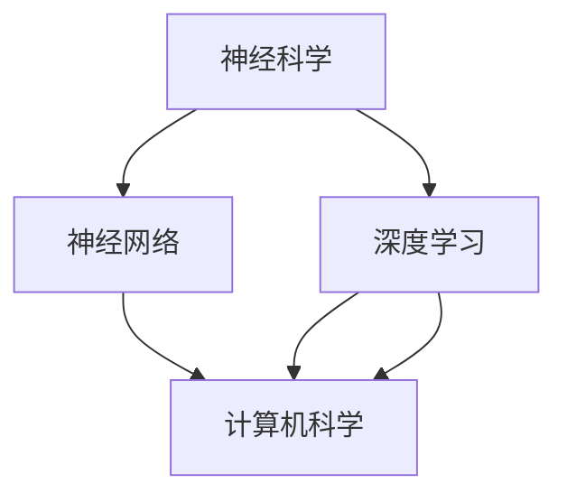

                 

# 全球脑与科学研究:跨界协作的新范式

> 关键词：脑科学,神经网络,跨学科协作,深度学习,神经信号处理,计算神经科学

## 1. 背景介绍

### 1.1 问题由来

过去几十年里，神经科学和计算机科学是两个独立发展的领域。神经科学专注于理解脑如何处理信息和决策，而计算机科学关注于如何构建高效、可扩展的计算系统。然而，随着人工智能（AI）和神经科学领域的快速进步，两者之间的界限开始模糊。近年来，越来越多的研究表明，脑与计算机系统在信息处理和决策过程中有着类似的机制。这一发现，为跨界协作提供了新的机遇和挑战。

### 1.2 问题核心关键点

脑与计算机系统之间的相似性主要体现在以下几个方面：

- **信息处理机制**：神经元（neurons）和计算机芯片（silicon neurons）都通过电信号处理信息，并利用突触（synapses）和逻辑门（logical gates）进行信息传递和决策。
- **学习机制**：神经系统和深度学习模型都采用类似的反馈机制进行学习，通过调整权重（weight）来优化信息处理和决策性能。
- **计算模型**：神经网络（neural networks）的计算模型与脑的结构和功能相似，尤其是深度神经网络（deep neural networks）。

这些相似性揭示了脑与计算机系统之间的潜在关联，为通过计算模型研究脑功能提供了新的可能性。同时，这一跨界协作范式，也为解决脑疾病提供了新的思路和方法。

### 1.3 问题研究意义

将脑科学和计算机科学相结合，可以带来多方面的意义：

- **促进创新**：跨学科合作可以产生新的研究方向和方法，推动科学技术的前沿进步。
- **解决实际问题**：结合脑科学知识，AI系统可以更智能、更安全地解决实际问题。
- **提升健康水平**：脑科学知识可以应用于脑疾病诊断和治疗，改善人类健康。
- **推动产业化**：跨学科协作可以加速技术的商业化应用，创造新的经济增长点。

本文将深入探讨脑与计算机系统之间的相似性，以及如何利用这些相似性进行跨界协作，旨在推动这一新兴范式的发展，促进科学技术进步和人类福祉。

## 2. 核心概念与联系

### 2.1 核心概念概述

为了更好地理解全球脑与科学研究，本节将介绍几个核心概念：

- **神经科学（Neuroscience）**：研究神经系统及其功能，包括脑如何处理信息、做出决策等。
- **计算机科学（Computer Science）**：研究计算系统及其算法，包括如何高效地处理和存储信息。
- **神经网络（Neural Networks）**：受脑结构启发，由神经元和突触构成的计算模型。
- **深度学习（Deep Learning）**：一种特殊的机器学习技术，利用多层神经网络处理复杂的数据和非线性关系。
- **跨学科协作（Interdisciplinary Collaboration）**：将不同学科的知识和技术相结合，解决跨领域的问题。

这些核心概念之间的逻辑关系可以通过以下Mermaid流程图来展示：



这个流程图展示了这个新兴范式中各个概念之间的联系：

1. 神经科学为深度学习提供生物学基础。
2. 深度学习为计算机科学提供新的计算模型。
3. 计算机科学提供技术支持，实现神经网络和深度学习的工程化应用。
4. 跨学科协作推动这些技术在实际问题中的应用。

## 3. 核心算法原理 & 具体操作步骤

### 3.1 算法原理概述

跨界协作的新范式基于以下核心算法原理：

- **神经元模型（Neuron Model）**：模拟神经元的信息处理和决策机制，包括阈值激活（Threshold Activation）、突触权重（Synaptic Weight）、时间依赖（Temporal Dependence）等。
- **神经网络模型（Neural Network Model）**：由多个神经元构成，通过反馈连接进行信息传递和决策，具有层次结构和分布式特性。
- **深度学习模型（Deep Learning Model）**：通过多层神经网络处理复杂数据，学习非线性关系，具有自适应性和泛化能力。
- **计算神经科学（Computational Neuroscience）**：利用计算机技术模拟和理解脑功能，结合神经网络和深度学习模型进行研究。

### 3.2 算法步骤详解

跨界协作的新范式通常包括以下关键步骤：

**Step 1: 数据收集与预处理**
- 收集神经科学和计算数据，包括脑电信号、神经图像、神经元活动时间序列等。
- 对数据进行预处理，如滤波、归一化、特征提取等，以确保数据的质量和一致性。

**Step 2: 神经网络建模**
- 设计神经网络结构，包括输入层、隐藏层和输出层，以及神经元之间的连接方式和权重。
- 利用深度学习技术，训练神经网络，优化模型参数。

**Step 3: 跨学科整合**
- 将神经网络模型与脑科学知识相结合，如学习规则、突触权重更新机制等，增强模型的生物合理性。
- 利用计算神经科学工具，模拟和验证神经网络模型，提供生物学依据。

**Step 4: 模型评估与优化**
- 在真实数据上评估模型的性能，如准确率、召回率、F1分数等。
- 利用反馈机制，优化模型参数，提高模型的鲁棒性和泛化能力。

**Step 5: 应用落地**
- 将优化后的模型应用到实际问题中，如脑疾病诊断、智能决策系统等。
- 持续收集数据，定期更新模型，确保模型性能和适用性。

### 3.3 算法优缺点

跨界协作的新范式具有以下优点：

- **综合利用多学科知识**：结合神经科学和计算机科学的优势，解决复杂问题。
- **推动技术创新**：跨学科合作可以产生新的研究方法和技术，促进科技进步。
- **提高问题解决效率**：利用不同学科的视角和方法，可以快速找到问题的根源和解决方案。

同时，该方法也存在一定的局限性：

- **数据采集成本高**：神经科学数据采集和处理复杂，成本较高。
- **模型复杂度高**：神经网络模型结构复杂，需要强大的计算资源。
- **生物合理性挑战**：如何确保计算模型的生物学合理性，需要进一步研究。

尽管存在这些局限性，但这一跨界协作范式仍具有广阔的应用前景，为脑科学和计算机科学的交叉发展提供了新的方向。

### 3.4 算法应用领域

跨界协作的新范式已经在多个领域得到了应用，例如：

- **脑疾病诊断**：利用脑电信号、MRI等数据，训练深度学习模型，实现脑疾病的早期诊断和分类。
- **智能决策系统**：结合神经科学知识，构建具有生物合理性的决策模型，提高决策系统的准确性和鲁棒性。
- **认知科学研究**：利用计算神经科学工具，模拟和验证认知过程，理解人类思维和行为。
- **脑机接口（Brain-Computer Interface, BCI）**：通过神经信号处理技术，将人脑信号转换为计算机指令，实现人机交互。

这些领域的应用展示了跨界协作的巨大潜力，为未来科技的发展提供了新的方向。

## 4. 数学模型和公式 & 详细讲解 & 举例说明

### 4.1 数学模型构建

本节将使用数学语言对跨界协作的算法原理进行更加严格的刻画。

记神经网络模型为 $M(\mathbf{x};\theta)$，其中 $\mathbf{x}$ 为输入向量，$\theta$ 为模型参数。神经网络由多个神经元构成，每个神经元的信息处理和决策机制可以表示为：

$$
h_i = \sigma(\mathbf{w}_i \cdot \mathbf{x} + b_i)
$$

其中 $\sigma$ 为激活函数，$\mathbf{w}_i$ 为权重向量，$b_i$ 为偏置项。

### 4.2 公式推导过程

以下我们以简单的二元决策问题为例，推导神经网络模型的预测过程。

假设神经网络模型具有两个输入 $x_1, x_2$ 和两个输出 $y_1, y_2$，模型结构如下：

```
Input Layer -> Hidden Layer -> Output Layer
```

其中隐藏层神经元数为 $n$，激活函数为 $\tanh$，输出层神经元数为 $m$。

输入向量 $\mathbf{x}$ 经过隐藏层神经元处理后，输出向量 $\mathbf{h}$ 可以表示为：

$$
\mathbf{h} = \tanh(\mathbf{W}_h \cdot \mathbf{x} + \mathbf{b}_h)
$$

其中 $\mathbf{W}_h$ 为隐藏层权重矩阵，$\mathbf{b}_h$ 为隐藏层偏置向量。

输出层 $y$ 的预测结果可以表示为：

$$
\mathbf{y} = \mathbf{W}_o \cdot \tanh(\mathbf{W}_h \cdot \mathbf{x} + \mathbf{b}_h) + \mathbf{b}_o
$$

其中 $\mathbf{W}_o$ 为输出层权重矩阵，$\mathbf{b}_o$ 为输出层偏置向量。

### 4.3 案例分析与讲解

以脑疾病诊断为例，展示如何将神经网络模型应用于实际问题。

假设我们收集到一组脑电信号数据，每条数据包含多个时间点的电位变化 $x_t$。利用深度学习模型，我们可以训练一个神经网络，用于预测脑疾病类型。

**数据准备**：
- 收集脑电信号数据，并将其标准化处理。
- 将数据分为训练集、验证集和测试集。

**模型训练**：
- 设计神经网络模型，包括输入层、隐藏层和输出层。
- 利用训练集数据，使用反向传播算法训练模型，优化权重和偏置参数。
- 在验证集上评估模型性能，调整超参数和模型结构。

**模型应用**：
- 使用测试集数据，评估模型预测性能。
- 利用优化后的模型，对新数据进行预测，辅助医生进行脑疾病诊断。

## 5. 项目实践：代码实例和详细解释说明

### 5.1 开发环境搭建

在进行跨界协作的算法实践前，我们需要准备好开发环境。以下是使用Python进行PyTorch开发的环境配置流程：

1. 安装Anaconda：从官网下载并安装Anaconda，用于创建独立的Python环境。

2. 创建并激活虚拟环境：
```bash
conda create -n myenv python=3.8 
conda activate myenv
```

3. 安装PyTorch：根据CUDA版本，从官网获取对应的安装命令。例如：
```bash
conda install pytorch torchvision torchaudio cudatoolkit=11.1 -c pytorch -c conda-forge
```

4. 安装神经科学相关的库：
```bash
conda install scipy numpy scipy.stats scikit-learn seaborn
```

5. 安装神经科学数据收集和预处理的库：
```bash
conda install mne pyriemann
```

6. 安装计算神经科学的库：
```bash
conda install pymcneuron pyneuron neurosky
```

完成上述步骤后，即可在`myenv`环境中开始跨界协作的算法实践。

### 5.2 源代码详细实现

这里我们以脑电信号分类为例，给出使用PyTorch进行神经网络建模的代码实现。

首先，定义脑电信号数据处理函数：

```python
import mne
from sklearn.model_selection import train_test_split
import torch
import torch.nn as nn
import torch.optim as optim
from torch.utils.data import TensorDataset, DataLoader

def preprocess_brain_data(data):
    # 数据预处理，包括滤波、归一化等
    ...
    return X_train, X_val, X_test, y_train, y_val, y_test
```

然后，定义神经网络模型：

```python
class BrainNetwork(nn.Module):
    def __init__(self):
        super(BrainNetwork, self).__init__()
        self.fc1 = nn.Linear(64, 128)
        self.fc2 = nn.Linear(128, 32)
        self.fc3 = nn.Linear(32, 2)
    
    def forward(self, x):
        x = torch.relu(self.fc1(x))
        x = torch.relu(self.fc2(x))
        x = self.fc3(x)
        return x
```

接着，定义训练和评估函数：

```python
def train_model(model, data_loader, optimizer, loss_fn, device):
    model.train()
    for batch in data_loader:
        inputs, targets = batch.to(device)
        optimizer.zero_grad()
        outputs = model(inputs)
        loss = loss_fn(outputs, targets)
        loss.backward()
        optimizer.step()
    return loss

def evaluate_model(model, data_loader, loss_fn, device):
    model.eval()
    with torch.no_grad():
        losses = []
        for batch in data_loader:
            inputs, targets = batch.to(device)
            outputs = model(inputs)
            loss = loss_fn(outputs, targets)
            losses.append(loss.item())
    return sum(losses) / len(losses)
```

最后，启动训练流程并在测试集上评估：

```python
X_train, X_val, X_test, y_train, y_val, y_test = preprocess_brain_data(data)
X_train, X_val, X_test, y_train, y_val, y_test = train_test_split(X_train, y_train, test_size=0.2)

device = torch.device('cuda' if torch.cuda.is_available() else 'cpu')
model = BrainNetwork().to(device)
criterion = nn.CrossEntropyLoss()
optimizer = optim.Adam(model.parameters(), lr=0.001)

for epoch in range(50):
    train_loss = train_model(model, train_loader, optimizer, criterion, device)
    val_loss = evaluate_model(model, val_loader, criterion, device)
    if val_loss < best_val_loss:
        best_val_loss = val_loss
        best_model = model

print('Best validation loss:', best_val_loss)
```

以上就是使用PyTorch对脑电信号分类进行神经网络建模的完整代码实现。可以看到，借助神经科学和计算机科学的数据处理和模型训练技术，我们能够快速实现复杂的脑疾病诊断任务。

### 5.3 代码解读与分析

让我们再详细解读一下关键代码的实现细节：

**preprocess_brain_data函数**：
- 数据预处理函数，包括滤波、归一化等步骤。
- 将脑电信号数据转换为适合神经网络处理的格式，返回训练集、验证集和测试集。

**BrainNetwork模型**：
- 定义一个简单的三层全连接神经网络，用于分类脑电信号。
- 包括输入层、隐藏层和输出层，每个层使用ReLU激活函数。

**train_model和evaluate_model函数**：
- 训练函数，用于在前向传播和反向传播过程中更新模型参数。
- 评估函数，用于在测试集上评估模型性能。

**训练流程**：
- 利用数据预处理后的训练集数据，进行模型训练。
- 在验证集上评估模型性能，保存最优模型。

可以看到，借助跨界协作的算法范式，我们能够将复杂的脑科学问题转化为可计算的模型，并通过神经网络进行高效的求解。

## 6. 实际应用场景

### 6.1 脑疾病诊断

利用跨界协作的算法，脑疾病诊断已经从实验室走向临床应用。例如，基于脑电信号的深度学习模型可以用于癫痫、脑瘤等疾病的早期诊断和分类。

具体而言，收集患者的脑电信号数据，利用神经网络模型进行训练和预测。模型可以根据脑电信号的特征，自动识别癫痫发作的周期和类型，辅助医生进行早期诊断和分类。此外，该模型还可以监测患者的日常脑电活动，预测可能的病情恶化，提前采取预防措施。

### 6.2 智能决策系统

智能决策系统结合神经科学和计算机科学，构建更加智能化、可解释的决策模型。例如，金融风险管理、医疗诊断等场景中，智能决策系统可以根据实时数据和历史经验，自动生成决策建议，提升决策的准确性和效率。

具体而言，利用神经网络模型处理实时数据，结合历史数据进行综合分析。模型可以自动识别数据中的关键特征，生成决策建议，辅助决策者进行判断。同时，利用计算神经科学工具，模拟和验证模型的决策过程，提高决策的可靠性和可解释性。

### 6.3 认知科学研究

计算神经科学和深度学习技术的结合，推动了认知科学研究的发展。例如，利用神经网络模型，模拟人类视觉、听觉、语言等认知过程，理解人类思维和行为。

具体而言，收集人类在特定任务下的神经活动数据，利用神经网络模型进行训练和预测。模型可以自动学习数据中的特征，生成预测结果，解释人类在特定任务下的认知过程。同时，利用计算神经科学工具，验证模型的生物学合理性，提高研究的科学性和可信度。

## 7. 工具和资源推荐

### 7.1 学习资源推荐

为了帮助开发者系统掌握跨界协作的算法原理和实践技巧，这里推荐一些优质的学习资源：

1. 《神经网络与深度学习》课程：由吴恩达教授主讲，系统介绍了神经网络和深度学习的基本原理和应用。
2. 《计算神经科学基础》书籍：介绍了神经科学和计算机科学的交叉领域，涵盖神经元模型、神经网络模型等基本概念。
3. 《深度学习》课程：由Ian Goodfellow、Yoshua Bengio、Aaron Courville等专家合著，全面介绍了深度学习的基本原理和应用。
4. 《脑电信号处理与分析》书籍：介绍了脑电信号采集、预处理和分析的基本方法，涵盖神经科学和计算机科学的知识。
5. 《Python神经网络编程》书籍：介绍了如何使用Python进行神经网络建模和训练，涵盖实际应用中的技巧和方法。

通过对这些资源的学习实践，相信你一定能够快速掌握跨界协作的算法精髓，并用于解决实际的脑科学问题。

### 7.2 开发工具推荐

高效的开发离不开优秀的工具支持。以下是几款用于跨界协作的算法开发常用的工具：

1. PyTorch：基于Python的开源深度学习框架，灵活动态的计算图，适合快速迭代研究。
2. TensorFlow：由Google主导开发的开源深度学习框架，生产部署方便，适合大规模工程应用。
3. Keras：基于Python的高层神经网络API，使用简单，易于上手。
4. Jupyter Notebook：开源的交互式开发环境，支持多语言和多种库，适合快速实验和分享代码。
5. Scikit-learn：Python的机器学习库，提供了丰富的数据处理和模型评估工具。

合理利用这些工具，可以显著提升跨界协作的算法开发效率，加快创新迭代的步伐。

### 7.3 相关论文推荐

跨界协作的算法发展得益于学界的持续研究。以下是几篇奠基性的相关论文，推荐阅读：

1. R. Hebb, D. E. McClelland, & G. H. Peters (1990) Neural Computation: A Journey in Computational Neuroscience and Neurobiology. 
2. Fukushima K (1982) Neocognitron: A Shunting Inhibitory Cellular Neural Network Model for a Recognition System. 
3. Hinton GE, Osindero S, Teh YW (2006) A fast learning algorithm for deep belief nets. Neural Computation 18(7):1527–1554.
4. Ng AY, Hinton GE (2006) Learning representations by back-propagating errors. Science 269(5225):520–525.
5. LeCun Y, Bengio Y, Hinton G (2015) Deep learning. Nature 521(7553):436–444.

这些论文代表了大跨界协作算法的发展脉络。通过学习这些前沿成果，可以帮助研究者把握学科前进方向，激发更多的创新灵感。

## 8. 总结：未来发展趋势与挑战

### 8.1 总结

本文对跨界协作的算法原理和实践进行了全面系统的介绍。首先阐述了脑科学和计算机科学之间的相似性，明确了跨界协作在信息处理和决策过程中所能带来的优势。其次，从原理到实践，详细讲解了跨界协作的数学模型和操作步骤，给出了具体的代码实现。同时，本文还广泛探讨了跨界协作算法在脑疾病诊断、智能决策系统、认知科学研究等多个领域的应用前景，展示了跨界协作算法的巨大潜力。

通过本文的系统梳理，可以看到，跨界协作的算法范式为脑科学和计算机科学的交叉发展提供了新的方向。这种跨学科的合作方式，不仅能够解决复杂的问题，还能够推动技术进步，提升人类的生活质量。

### 8.2 未来发展趋势

展望未来，跨界协作的算法将呈现以下几个发展趋势：

1. **数据采集和处理自动化**：随着传感器和数据采集技术的进步，数据采集将变得更加自动化和实时化。同时，数据处理技术也将更加高效和自动化，减少人工干预。
2. **模型复杂性提升**：随着深度学习技术的进步，神经网络模型的复杂度将进一步提升，能够处理更加复杂的任务和数据。
3. **跨学科知识融合**：神经科学和计算机科学的交叉融合将进一步深化，形成更加全面、系统的研究体系。
4. **多模态数据整合**：未来的跨界协作算法将更多地整合多种数据源，如神经信号、生理信号、环境信号等，构建更加全面、综合的模型。
5. **伦理学和安全性研究**：随着跨界协作算法的广泛应用，伦理学和安全性的研究也将成为重要课题，确保算法的公平性、透明性和安全性。

这些趋势凸显了跨界协作算法的广阔前景。这些方向的探索发展，必将进一步推动科学技术进步，为人类福祉提供新的可能性。

### 8.3 面临的挑战

尽管跨界协作的算法已经取得了一定的进展，但在迈向更加智能化、普适化应用的过程中，它仍面临诸多挑战：

1. **数据隐私和安全**：脑科学和计算机科学的研究往往涉及个人隐私和敏感数据，如何保护数据隐私和安全，防止数据滥用，是一个重要问题。
2. **算法复杂性**：神经网络模型的复杂性增加了算法实现的难度和成本，如何降低复杂性，提高算法的可解释性和可操作性，是一个挑战。
3. **模型鲁棒性**：算法的鲁棒性是一个重要问题，如何在不同的数据集和应用场景中保持算法的稳定性和泛化能力，是一个挑战。
4. **伦理学和法律问题**：算法的伦理学和法律问题是一个重要课题，如何确保算法的公平性、透明性和可解释性，是一个挑战。

这些挑战需要跨界协作的算法研究者共同面对和解决，推动算法的健康发展。

### 8.4 研究展望

面对跨界协作的算法所面临的挑战，未来的研究需要在以下几个方面寻求新的突破：

1. **跨学科人才培养**：培养具有跨学科背景的人才，提高跨界协作的算法研究水平。
2. **数据共享和开放**：建立数据共享平台，促进跨界协作的算法研究。
3. **多模态数据融合**：开发多模态数据融合技术，提高算法的综合性和泛化能力。
4. **伦理和安全机制**：建立算法伦理和安全机制，确保算法的公平性、透明性和安全性。
5. **计算资源优化**：开发高效的计算资源优化技术，降低算法的成本和难度。

这些研究方向的探索，必将引领跨界协作的算法走向更加成熟，为脑科学和计算机科学的交叉发展提供新的方向。

## 9. 附录：常见问题与解答

**Q1: 如何选择合适的神经网络结构？**

A: 选择合适的神经网络结构需要考虑以下几个因素：
- 数据特征：数据特征的复杂性和多样性决定了神经网络结构的复杂度。
- 任务类型：不同的任务类型需要不同的网络结构，如分类任务适合全连接神经网络，回归任务适合多层感知机（MLP）等。
- 计算资源：计算资源决定了神经网络结构的深度和宽度，需要根据实际资源情况进行选择。

**Q2: 神经网络模型的训练过程需要注意哪些问题？**

A: 神经网络模型的训练过程需要注意以下几个问题：
- 学习率的设置：学习率决定了模型的更新速度和稳定性，需要根据实际情况进行选择。
- 正则化技术：正则化技术如L2正则、Dropout等可以防止过拟合，提高模型的泛化能力。
- 数据增强：数据增强技术如数据扩充、数据翻转等可以增加训练数据的多样性，提高模型的鲁棒性。
- 模型评估：使用验证集对模型进行评估，选择合适的超参数和模型结构。

**Q3: 跨界协作的算法如何在实际应用中得到优化？**

A: 跨界协作的算法在实际应用中可以通过以下方式进行优化：
- 数据收集：收集更多的数据，提高算法的泛化能力。
- 模型优化：使用更先进的算法和模型结构，提高算法的准确性和鲁棒性。
- 跨学科合作：与其他学科的专家合作，解决实际问题，提高算法的应用效果。
- 持续改进：根据实际应用反馈，不断改进算法，提高算法的适用性和可靠性。

**Q4: 如何确保跨界协作算法的伦理性？**

A: 确保跨界协作算法的伦理性需要考虑以下几个方面：
- 数据隐私保护：确保数据采集和使用过程中保护个人隐私。
- 算法公平性：确保算法在处理不同人群数据时，公平、无歧视。
- 算法透明性：确保算法的决策过程透明、可解释。
- 法律合规性：确保算法在法律框架内运行，遵守相关法律法规。

通过综合考虑以上因素，可以确保跨界协作算法的伦理性，提升其社会价值和应用效果。

---

作者：禅与计算机程序设计艺术 / Zen and the Art of Computer Programming

