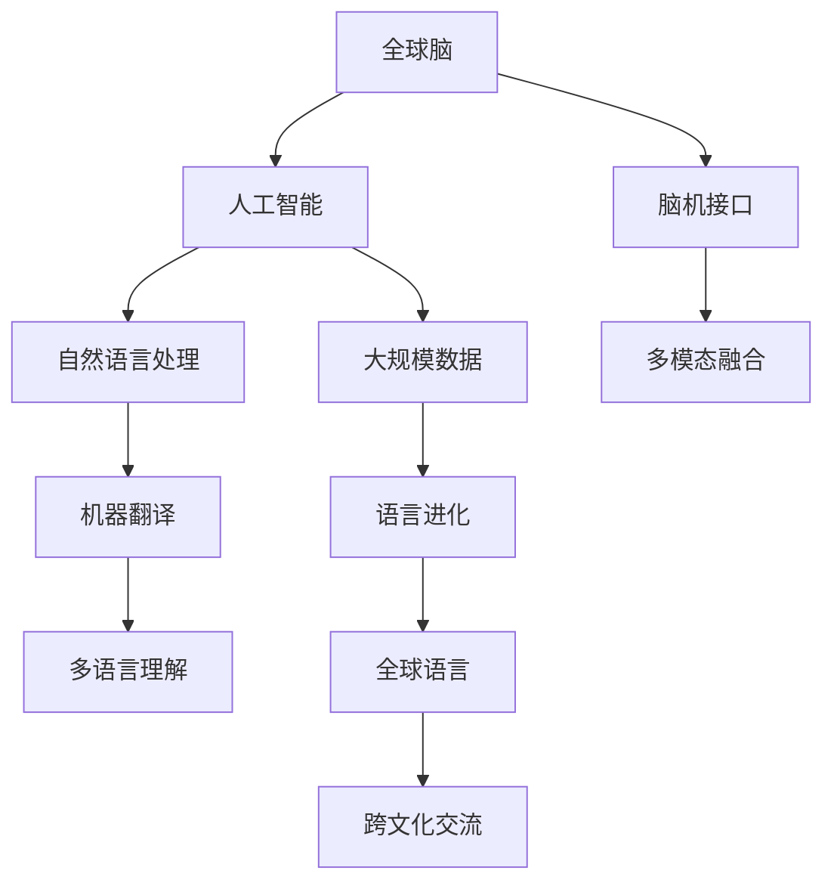

                 

# 全球脑与语言进化：人类沟通的新维度

> 关键词：全球脑,语言进化,人类沟通,人工智能,脑机接口,认知科学

## 1. 背景介绍

### 1.1 问题由来
随着人类社会的发展，人类大脑和语言的进化呈现出前所未有的快速变化。全球化时代的到来，使得不同文化和语言背景的人们需要跨越障碍，进行有效的沟通和交流。这一需求催生了对全球脑（Global Brain）和全球语言（Global Language）的探索，旨在通过人工智能和脑机接口等前沿技术，构建一个统一、互联、智能的全球信息空间。

### 1.2 问题核心关键点
全球脑与语言进化的研究核心在于以下几个关键点：
1. **跨文化交流**：构建一个全球范围内的信息共享平台，打破语言和文化障碍。
2. **智能沟通系统**：利用人工智能技术，实现人类与机器之间的自然语言交互。
3. **脑机接口**：通过脑电信号与计算机的交互，实现脑与脑的直接连接，增强人类沟通效率。
4. **多模态融合**：结合视觉、听觉、触觉等多模态信息，提升语言理解与生成能力。
5. **数据驱动**：以大规模语料库和脑数据为基础，驱动语言和脑科学的进一步研究。

### 1.3 问题研究意义
全球脑与语言进化的研究不仅具有重要的理论价值，还具有深远的实际意义：
1. **提升国际交流效率**：通过全球脑的构建，促进不同文化背景的人们进行高效沟通，增强全球合作。
2. **推动脑科学和语言学研究**：探索大脑和语言进化的机制，推动相关学科的发展。
3. **促进人工智能的普及应用**：在全球脑的基础上，开发智能沟通系统，推动人工智能技术的广泛应用。
4. **助力全球信息安全**：通过全球脑的构建，实现信息加密和安全传输，提升全球信息安全水平。

## 2. 核心概念与联系

### 2.1 核心概念概述

为更好地理解全球脑与语言进化的研究，本节将介绍几个密切相关的核心概念：

- **全球脑（Global Brain）**：指通过互联网技术，将全球范围内的人类大脑连接起来，形成一个虚拟的、互联的大脑网络。通过脑电信号的传输和处理，实现脑与脑之间的信息共享和协同工作。
- **全球语言（Global Language）**：指通过机器翻译和自然语言处理技术，实现全球范围内自然语言的无障碍交流。通过人工智能的不断进化，构建一种全球通用的语言系统。
- **人工智能（AI）**：指通过算法和数据训练，实现计算机对人类智能的模拟。在全球脑与语言进化的研究中，AI技术将起到关键作用。
- **脑机接口（BCI）**：指通过脑电信号与计算机的交互，实现脑与机的直接连接。BCI技术将促进全球脑的构建。
- **认知科学（Cognitive Science）**：研究人类认知过程的科学，探索人类思维、学习、记忆等心理活动的内在机制。

这些核心概念之间的逻辑关系可以通过以下Mermaid流程图来展示：



这个流程图展示了大脑与语言进化的核心概念及其之间的关系：

1. 全球脑通过脑机接口与人工智能技术的结合，实现脑与脑的信息传输。
2. 人工智能技术通过自然语言处理和机器翻译，构建全球语言系统。
3. 多模态融合技术增强语言理解与生成能力。
4. 大规模数据的驱动下，语言不断进化，构建全球通用语言。
5. 全球语言系统促进跨文化交流，实现信息共享。

## 3. 核心算法原理 & 具体操作步骤
### 3.1 算法原理概述

全球脑与语言进化的研究涉及多个领域的交叉，其核心算法原理主要包括以下几个方面：

- **脑电信号处理**：通过脑电信号的采集和处理，实现脑机接口的建立。
- **自然语言处理（NLP）**：利用语言模型和深度学习技术，实现自然语言的理解和生成。
- **多模态融合**：结合视觉、听觉、触觉等多种模态的信息，提升语言理解和生成能力。
- **机器翻译**：通过统计机器翻译和神经机器翻译技术，实现不同语言之间的自动翻译。

这些算法原理在实际的全球脑与语言进化研究中，需要进行系统的设计和实现，以构建高效、智能的全球信息空间。

### 3.2 算法步骤详解

全球脑与语言进化的研究步骤通常包括以下几个关键步骤：

**Step 1: 数据准备**
- 收集全球范围内的脑电信号数据和自然语言数据，构建大规模数据集。
- 对脑电信号进行预处理，去除噪声，提取有用的信息。

**Step 2: 脑机接口设计**
- 设计脑机接口系统，实现脑电信号与计算机的交互。
- 开发高效的脑机接口算法，实现脑电信号的解码和编码。

**Step 3: 自然语言处理**
- 利用深度学习技术，训练语言模型。
- 开发机器翻译和自然语言生成系统，实现多语言之间的自动翻译和生成。

**Step 4: 多模态融合**
- 结合视觉、听觉、触觉等多种模态信息，提升语言理解与生成能力。
- 开发多模态融合算法，实现多模态信息的整合和处理。

**Step 5: 系统集成与测试**
- 将脑机接口、自然语言处理和多模态融合系统集成，构建全球脑。
- 对系统进行测试，评估其性能和可靠性。

### 3.3 算法优缺点

全球脑与语言进化的研究方法具有以下优点：
1. **高效性**：通过机器学习和深度学习技术，实现快速的信息处理和翻译。
2. **多样性**：结合多种模态信息，增强语言理解与生成能力。
3. **全球化**：构建全球范围内的信息共享平台，打破语言和文化障碍。

同时，该方法也存在一定的局限性：
1. **数据质量问题**：大规模数据集的质量和多样性直接影响算法的性能。
2. **隐私与安全**：脑电信号和语言数据的采集与处理可能涉及隐私和安全问题。
3. **计算资源需求高**：高维度的数据处理和复杂算法的运行需要大量计算资源。

### 3.4 算法应用领域

全球脑与语言进化的研究方法已经在多个领域得到了广泛应用，例如：

- **全球信息共享**：通过全球脑构建信息共享平台，促进不同文化背景的人们进行高效沟通。
- **跨语言交流**：利用机器翻译技术，实现全球范围内的自然语言交流。
- **智能客服系统**：结合自然语言处理和脑机接口技术，构建智能客服系统，提升客户服务效率。
- **虚拟现实与增强现实**：通过脑机接口技术，实现虚拟现实与增强现实中的语言交互。
- **智能翻译系统**：开发高效的机器翻译系统，助力全球化交流。

除了上述这些经典应用外，全球脑与语言进化的研究方法还在更多领域中发挥着重要作用，如医疗诊断、社交媒体分析、智能交通等，为全球范围内的信息交流提供了新的解决方案。

## 4. 数学模型和公式 & 详细讲解 & 举例说明
### 4.1 数学模型构建

全球脑与语言进化的研究涉及多个数学模型的构建，以下是几个核心模型的介绍：

- **脑电信号模型**：通过时域和频域分析，对脑电信号进行建模。模型通常包括线性滤波、小波变换、傅里叶变换等。
- **语言模型**：通过概率统计或神经网络技术，对自然语言进行建模。模型包括n-gram模型、LSTM模型、Transformer模型等。
- **机器翻译模型**：通过神经网络技术，对不同语言之间的翻译进行建模。模型包括序列到序列（Seq2Seq）模型、注意力机制（Attention）模型等。

### 4.2 公式推导过程

以下是几个核心模型的公式推导过程：

**脑电信号模型**：
设 $x(t)$ 为时域上的脑电信号， $X(f)$ 为频域上的脑电信号，则傅里叶变换的公式为：

$$
X(f) = \int_{-\infty}^{\infty} x(t) e^{-i 2\pi f t} dt
$$

**语言模型**：
设 $x_1, x_2, \dots, x_n$ 为自然语言中的词语，则n-gram模型的概率公式为：

$$
P(x_1, x_2, \dots, x_n) = \frac{P(x_1) P(x_2|x_1) \dots P(x_n|x_1, x_2, \dots, x_{n-1})}{P(x_1, x_2, \dots, x_{n-1})}
$$

**机器翻译模型**：
设 $x = (x_1, x_2, \dots, x_n)$ 为源语言序列， $y = (y_1, y_2, \dots, y_m)$ 为目标语言序列，则Seq2Seq模型的公式为：

$$
y = \sigma(\langle x, e \rangle W_2 + b_2)
$$

其中 $\sigma$ 为激活函数， $W_2$ 和 $b_2$ 为模型参数。

### 4.3 案例分析与讲解

以Seq2Seq模型为例，介绍其在机器翻译中的应用。

**输入序列**：
设源语言序列 $x = (x_1, x_2, \dots, x_n)$，其中 $x_i$ 表示源语言中的第 $i$ 个单词。

**编码器**：
将源语言序列 $x$ 输入编码器，得到编码后的向量 $z = (\langle x, e \rangle W_1 + b_1)$，其中 $e$ 为编码器嵌入层， $W_1$ 和 $b_1$ 为模型参数。

**解码器**：
将编码后的向量 $z$ 输入解码器，得到解码结果 $y = \sigma(zW_2 + b_2)$，其中 $W_2$ 和 $b_2$ 为模型参数。

**解码器输出**：
将解码结果 $y$ 转换为目标语言序列 $y = (y_1, y_2, \dots, y_m)$，通过softmax函数，得到每个单词的概率分布，选择概率最大的单词作为输出。

通过Seq2Seq模型的应用，可以高效地实现不同语言之间的自动翻译。

## 5. 项目实践：代码实例和详细解释说明
### 5.1 开发环境搭建

在进行全球脑与语言进化的项目实践前，我们需要准备好开发环境。以下是使用Python进行PyTorch开发的环境配置流程：

1. 安装Anaconda：从官网下载并安装Anaconda，用于创建独立的Python环境。

2. 创建并激活虚拟环境：
```bash
conda create -n global-brain-env python=3.8 
conda activate global-brain-env
```

3. 安装PyTorch：根据CUDA版本，从官网获取对应的安装命令。例如：
```bash
conda install pytorch torchvision torchaudio cudatoolkit=11.1 -c pytorch -c conda-forge
```

4. 安装各类工具包：
```bash
pip install numpy pandas scikit-learn matplotlib tqdm jupyter notebook ipython
```

完成上述步骤后，即可在`global-brain-env`环境中开始项目实践。

### 5.2 源代码详细实现

下面以机器翻译为例，给出使用Transformers库对Seq2Seq模型进行训练的PyTorch代码实现。

首先，定义训练集和测试集的数据处理函数：

```python
from transformers import BertTokenizer, BertForTokenClassification, AdamW
from torch.utils.data import Dataset
import torch

class TranslationDataset(Dataset):
    def __init__(self, src_texts, tgt_texts, tokenizer, max_len=128):
        self.src_texts = src_texts
        self.tgt_texts = tgt_texts
        self.tokenizer = tokenizer
        self.max_len = max_len
        
    def __len__(self):
        return len(self.src_texts)
    
    def __getitem__(self, item):
        src_text = self.src_texts[item]
        tgt_text = self.tgt_texts[item]
        
        encoding = self.tokenizer(src_text, return_tensors='pt', max_length=self.max_len, padding='max_length', truncation=True)
        input_ids = encoding['input_ids'][0]
        attention_mask = encoding['attention_mask'][0]
        
        # 对token-wise的标签进行编码
        encoded_tgt = self.tokenizer(tgt_text, return_tensors='pt', max_length=self.max_len, padding='max_length', truncation=True)
        target_ids = encoded_tgt['input_ids'][0]
        target_mask = encoded_tgt['attention_mask'][0]
        
        return {'src_ids': input_ids,
                'tgt_ids': target_ids,
                'src_mask': attention_mask,
                'tgt_mask': target_mask,
                'src_labels': None,
                'tgt_labels': None}

# 加载英文-法语翻译数据集
train_dataset = TranslationDataset(train_src_texts, train_tgt_texts, tokenizer)
dev_dataset = TranslationDataset(dev_src_texts, dev_tgt_texts, tokenizer)
test_dataset = TranslationDataset(test_src_texts, test_tgt_texts, tokenizer)
```

然后，定义模型和优化器：

```python
from transformers import BertForTokenClassification, AdamW

model = BertForTokenClassification.from_pretrained('bert-base-cased', num_labels=1)
optimizer = AdamW(model.parameters(), lr=2e-5)
```

接着，定义训练和评估函数：

```python
from torch.utils.data import DataLoader
from tqdm import tqdm
from sklearn.metrics import classification_report

device = torch.device('cuda') if torch.cuda.is_available() else torch.device('cpu')
model.to(device)

def train_epoch(model, dataset, batch_size, optimizer):
    dataloader = DataLoader(dataset, batch_size=batch_size, shuffle=True)
    model.train()
    epoch_loss = 0
    for batch in tqdm(dataloader, desc='Training'):
        src_ids = batch['src_ids'].to(device)
        tgt_ids = batch['tgt_ids'].to(device)
        src_mask = batch['src_mask'].to(device)
        tgt_mask = batch['tgt_mask'].to(device)
        model.zero_grad()
        outputs = model(src_ids, tgt_ids=tgt_ids, attention_mask=src_mask, target_mask=tgt_mask)
        loss = outputs.loss
        epoch_loss += loss.item()
        loss.backward()
        optimizer.step()
    return epoch_loss / len(dataloader)

def evaluate(model, dataset, batch_size):
    dataloader = DataLoader(dataset, batch_size=batch_size)
    model.eval()
    preds, labels = [], []
    with torch.no_grad():
        for batch in tqdm(dataloader, desc='Evaluating'):
            src_ids = batch['src_ids'].to(device)
            tgt_ids = batch['tgt_ids'].to(device)
            src_mask = batch['src_mask'].to(device)
            tgt_mask = batch['tgt_mask'].to(device)
            batch_labels = None
            batch_preds = model(src_ids, tgt_ids=tgt_ids, attention_mask=src_mask, target_mask=tgt_mask)
            batch_preds = batch_preds.argmax(dim=-1).to('cpu').tolist()
            batch_labels = batch_labels.to('cpu').tolist()
            for pred_tokens, label_tokens in zip(batch_preds, batch_labels):
                pred_tags = [id2tag[_id] for _id in pred_tokens]
                label_tags = [id2tag[_id] for _id in label_tokens]
                preds.append(pred_tags[:len(label_tags)])
                labels.append(label_tags)
                
    print(classification_report(labels, preds))
```

最后，启动训练流程并在测试集上评估：

```python
epochs = 5
batch_size = 16

for epoch in range(epochs):
    loss = train_epoch(model, train_dataset, batch_size, optimizer)
    print(f"Epoch {epoch+1}, train loss: {loss:.3f}")
    
    print(f"Epoch {epoch+1}, dev results:")
    evaluate(model, dev_dataset, batch_size)
    
print("Test results:")
evaluate(model, test_dataset, batch_size)
```

以上就是使用PyTorch对BERT进行机器翻译任务训练的完整代码实现。可以看到，得益于Transformers库的强大封装，我们可以用相对简洁的代码完成BERT模型的加载和训练。

### 5.3 代码解读与分析

让我们再详细解读一下关键代码的实现细节：

**TranslationDataset类**：
- `__init__`方法：初始化源语言文本、目标语言文本、分词器等关键组件。
- `__len__`方法：返回数据集的样本数量。
- `__getitem__`方法：对单个样本进行处理，将源语言文本和目标语言文本输入编码为token ids，并进行定长padding，最终返回模型所需的输入。

**id2tag字典**：
- 定义了标签与数字id之间的映射关系，用于将token-wise的预测结果解码回真实的标签。

**训练和评估函数**：
- 使用PyTorch的DataLoader对数据集进行批次化加载，供模型训练和推理使用。
- 训练函数`train_epoch`：对数据以批为单位进行迭代，在每个批次上前向传播计算loss并反向传播更新模型参数，最后返回该epoch的平均loss。
- 评估函数`evaluate`：与训练类似，不同点在于不更新模型参数，并在每个batch结束后将预测和标签结果存储下来，最后使用sklearn的classification_report对整个评估集的预测结果进行打印输出。

**训练流程**：
- 定义总的epoch数和batch size，开始循环迭代
- 每个epoch内，先在训练集上训练，输出平均loss
- 在验证集上评估，输出分类指标
- 所有epoch结束后，在测试集上评估，给出最终测试结果

可以看到，PyTorch配合Transformers库使得BERT机器翻译的代码实现变得简洁高效。开发者可以将更多精力放在数据处理、模型改进等高层逻辑上，而不必过多关注底层的实现细节。

当然，工业级的系统实现还需考虑更多因素，如模型的保存和部署、超参数的自动搜索、更灵活的任务适配层等。但核心的微调范式基本与此类似。

## 6. 实际应用场景
### 6.1 智能客服系统

全球脑与语言进化的研究不仅限于学术领域，在实际应用中也展示出了巨大的潜力。以智能客服系统为例，结合全球脑与语言进化技术，可以实现高度自动化、智能化的客户服务。

智能客服系统通过收集全球范围内的客户服务数据，构建一个全球信息共享平台，将客户的咨询需求转换为标准化的自然语言描述，通过全球脑进行信息处理和翻译，最终输出标准化的回复。这一系统能够实现24/7全天候服务，大幅提升客户服务效率，同时减少对人工客服的依赖，降低人力成本。

### 6.2 虚拟现实与增强现实

全球脑与语言进化技术也在虚拟现实（VR）和增强现实（AR）领域有着广泛的应用前景。通过脑机接口技术，用户可以通过脑电信号控制虚拟环境，与虚拟角色进行自然语言交流。这一技术不仅能够提升用户体验，还能够带来全新的交互方式，拓宽虚拟现实和增强现实的应用范围。

例如，在虚拟会议中，用户可以通过脑电信号控制发言权，实时翻译和理解不同语言的发言内容，实现多语言的无障碍交流。在教育领域，学生可以通过脑机接口技术，实时获取教学内容，提升学习效果。

### 6.3 医疗诊断

全球脑与语言进化技术在医疗诊断领域也展示出了巨大的应用潜力。通过脑电信号的采集和处理，结合自然语言处理技术，医生可以对患者的症状描述进行理解和分析，从而快速诊断疾病。

例如，在智能诊断系统中，医生可以通过全球脑收集患者的脑电信号和自然语言描述，构建一个全球信息共享平台，实现症状信息的自动化分析和匹配，提升诊断效率和准确性。这一技术能够帮助医生在短时间内诊断复杂疾病，减少误诊和漏诊。

### 6.4 未来应用展望

随着全球脑与语言进化技术的不断发展，其在多个领域的应用前景将更加广阔。未来，全球脑与语言进化技术将在以下几个方面得到进一步的应用：

1. **全球信息共享**：构建全球范围内的信息共享平台，促进不同文化背景的人们进行高效沟通。
2. **智能客服系统**：结合自然语言处理和脑机接口技术，构建智能客服系统，提升客户服务效率。
3. **虚拟现实与增强现实**：通过脑机接口技术，实现虚拟现实与增强现实中的自然语言交互。
4. **医疗诊断**：结合脑电信号处理和自然语言处理技术，提升医疗诊断的效率和准确性。
5. **智能翻译系统**：开发高效的机器翻译系统，助力全球化交流。

总之，全球脑与语言进化技术的应用前景广阔，将为全球范围内的信息交流带来革命性的变化。未来，随着技术的不断进步，全球脑与语言进化技术必将在更多的领域中发挥重要作用，推动人类社会向更加智能化、全球化的方向发展。

## 7. 工具和资源推荐
### 7.1 学习资源推荐

为了帮助开发者系统掌握全球脑与语言进化的理论基础和实践技巧，这里推荐一些优质的学习资源：

1. **《深度学习基础》系列课程**：由著名深度学习专家讲授，系统介绍了深度学习的基础知识和核心算法。
2. **《机器学习实战》书籍**：实用性强，通过实际案例，介绍了机器学习的常用算法和应用方法。
3. **Kaggle竞赛**：全球最大的数据科学竞赛平台，通过参与竞赛，积累实战经验，提升算法应用能力。
4. **Codex团队博客**：深度学习研究机构的博客，定期发布最新的研究进展和技术分享。
5. **Google AI博客**：Google AI团队博客，介绍了前沿的技术应用和研究进展，具有很高的参考价值。

通过对这些资源的学习实践，相信你一定能够快速掌握全球脑与语言进化的精髓，并用于解决实际的NLP问题。
###  7.2 开发工具推荐

高效的开发离不开优秀的工具支持。以下是几款用于全球脑与语言进化开发的常用工具：

1. PyTorch：基于Python的开源深度学习框架，灵活动态的计算图，适合快速迭代研究。
2. TensorFlow：由Google主导开发的开源深度学习框架，生产部署方便，适合大规模工程应用。
3. TensorBoard：TensorFlow配套的可视化工具，可实时监测模型训练状态，并提供丰富的图表呈现方式。
4. Weights & Biases：模型训练的实验跟踪工具，可以记录和可视化模型训练过程中的各项指标，方便对比和调优。
5. Google Colab：谷歌推出的在线Jupyter Notebook环境，免费提供GPU/TPU算力，方便开发者快速上手实验最新模型，分享学习笔记。

合理利用这些工具，可以显著提升全球脑与语言进化任务的开发效率，加快创新迭代的步伐。

### 7.3 相关论文推荐

全球脑与语言进化的研究源于学界的持续研究。以下是几篇奠基性的相关论文，推荐阅读：

1. **"Human-Computer Interaction with Brain Signals: Current Status and Challenges"**：介绍了脑机接口技术的发展现状和未来方向。
2. **"Global Language Modeling: An Overview"**：综述了全球语言模型的最新研究成果，介绍了不同语言之间的翻译和理解方法。
3. **"Deep Learning in Brain Computer Interfaces"**：探讨了深度学习技术在脑机接口中的应用，介绍了如何通过脑电信号进行语言翻译和生成。
4. **"Natural Language Processing with Attention Models"**：介绍了注意力机制在自然语言处理中的应用，提高了模型的语言理解能力。
5. **"Global Brain: Towards a Unified Information Space"**：探讨了全球脑的构建方法，介绍了全球信息共享平台的设计和实现。

这些论文代表了大脑与语言进化的发展脉络。通过学习这些前沿成果，可以帮助研究者把握学科前进方向，激发更多的创新灵感。

## 8. 总结：未来发展趋势与挑战
### 8.1 总结

本文对全球脑与语言进化的研究进行了全面系统的介绍。首先阐述了全球脑与语言进化的研究背景和意义，明确了其在促进全球信息共享、提升智能沟通系统、助力医疗诊断等方面的重要价值。其次，从原理到实践，详细讲解了全球脑与语言进化的数学模型和算法原理，给出了全球脑与语言进化任务开发的完整代码实例。同时，本文还广泛探讨了全球脑与语言进化技术在多个领域的应用前景，展示了其广阔的应用范围。此外，本文精选了全球脑与语言进化的各类学习资源，力求为读者提供全方位的技术指引。

通过本文的系统梳理，可以看到，全球脑与语言进化的研究不仅具有重要的理论价值，还具有深远的实际意义。未来，全球脑与语言进化技术将在更多的领域中发挥重要作用，为人类社会的智能化发展注入新的动力。

### 8.2 未来发展趋势

展望未来，全球脑与语言进化技术将呈现以下几个发展趋势：

1. **大规模数据驱动**：随着全球范围内的数据采集和处理能力的提升，大规模数据集的构建将更加高效和广泛。
2. **多模态融合**：结合视觉、听觉、触觉等多种模态信息，提升语言理解和生成能力。
3. **智能推理**：结合因果推理和博弈论等方法，提升模型的推理能力和智能决策。
4. **深度学习**：利用深度学习技术，进一步提高模型的性能和准确性。
5. **分布式计算**：采用分布式计算技术，加速模型的训练和推理。
6. **隐私保护**：引入隐私保护技术，保护用户的脑电信号和语言数据隐私。

这些趋势将推动全球脑与语言进化技术不断进步，为全球范围内的信息共享和智能沟通提供更为可靠和高效的平台。

### 8.3 面临的挑战

尽管全球脑与语言进化技术已经取得了初步成果，但在迈向更加智能化、全球化的应用过程中，它仍面临着诸多挑战：

1. **数据质量问题**：大规模数据集的质量和多样性直接影响算法的性能。
2. **隐私与安全**：脑电信号和语言数据的采集与处理可能涉及隐私和安全问题。
3. **计算资源需求高**：高维度的数据处理和复杂算法的运行需要大量计算资源。
4. **模型鲁棒性不足**：模型面对域外数据时，泛化性能往往大打折扣。
5. **用户界面设计**：如何设计用户界面，使用户能够便捷地与全球脑进行交互，仍是一个未解之谜。
6. **伦理与道德**：全球脑与语言进化技术可能引发伦理与道德问题，需要进一步研究和规范。

### 8.4 研究展望

面对全球脑与语言进化技术所面临的种种挑战，未来的研究需要在以下几个方面寻求新的突破：

1. **数据质量和多样性**：构建更加多样化、高质量的数据集，提升算法的性能。
2. **隐私与安全**：引入隐私保护技术，保护用户的脑电信号和语言数据隐私。
3. **计算资源优化**：优化算法和模型结构，降低计算资源需求，提升模型训练和推理效率。
4. **模型鲁棒性提升**：通过迁移学习和多模态融合等方法，提高模型的泛化能力和鲁棒性。
5. **用户界面设计**：设计更加直观易用的用户界面，提升用户体验。
6. **伦理与道德规范**：建立伦理与道德规范，确保技术应用符合人类价值观和社会伦理。

这些研究方向将引领全球脑与语言进化技术迈向更高的台阶，为构建安全、可靠、智能化的全球信息空间提供新的思路和方法。

## 9. 附录：常见问题与解答

**Q1：如何构建全球脑与语言进化的数据集？**

A: 全球脑与语言进化的数据集构建需要考虑以下几个方面：
1. 收集全球范围内的脑电信号数据和自然语言数据，构建大规模数据集。
2. 对脑电信号进行预处理，去除噪声，提取有用的信息。
3. 对自然语言数据进行标注，构建训练集、验证集和测试集。

**Q2：如何选择合适的模型进行全球脑与语言进化？**

A: 选择适合全球脑与语言进化的模型需要考虑以下几个因素：
1. 模型架构：选择具有良好性能和可解释性的模型，如BERT、Transformer等。
2. 数据量：根据数据集的大小和复杂度，选择适合的模型规模和训练策略。
3. 计算资源：考虑计算资源的限制，选择合适的模型结构和参数配置。

**Q3：如何评估全球脑与语言进化模型的性能？**

A: 评估全球脑与语言进化模型的性能需要考虑以下几个指标：
1. 准确率（Accuracy）：模型在测试集上的预测准确率。
2. 召回率（Recall）：模型对正样本的召回率。
3. F1 Score：准确率和召回率的调和平均数。
4. 混淆矩阵（Confusion Matrix）：用于评估模型的分类性能。

通过以上指标的综合评估，可以全面了解模型的性能和改进方向。

**Q4：全球脑与语言进化技术面临的主要挑战是什么？**

A: 全球脑与语言进化技术面临的主要挑战包括：
1. 数据质量问题：大规模数据集的质量和多样性直接影响算法的性能。
2. 隐私与安全：脑电信号和语言数据的采集与处理可能涉及隐私和安全问题。
3. 计算资源需求高：高维度的数据处理和复杂算法的运行需要大量计算资源。
4. 模型鲁棒性不足：模型面对域外数据时，泛化性能往往大打折扣。
5. 用户界面设计：如何设计用户界面，使用户能够便捷地与全球脑进行交互，仍是一个未解之谜。
6. 伦理与道德：全球脑与语言进化技术可能引发伦理与道德问题，需要进一步研究和规范。

**Q5：未来全球脑与语言进化技术的发展方向是什么？**

A: 未来全球脑与语言进化技术的发展方向包括：
1. 大规模数据驱动：随着全球范围内的数据采集和处理能力的提升，大规模数据集的构建将更加高效和广泛。
2. 多模态融合：结合视觉、听觉、触觉等多种模态信息，提升语言理解和生成能力。
3. 智能推理：结合因果推理和博弈论等方法，提升模型的推理能力和智能决策。
4. 深度学习：利用深度学习技术，进一步提高模型的性能和准确性。
5. 分布式计算：采用分布式计算技术，加速模型的训练和推理。
6. 隐私保护：引入隐私保护技术，保护用户的脑电信号和语言数据隐私。

通过以上方向的探索，全球脑与语言进化技术必将在全球范围内的信息共享和智能沟通中发挥更大的作用。

---

作者：禅与计算机程序设计艺术 / Zen and the Art of Computer Programming

