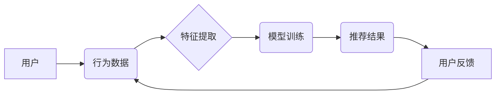

                 

## 微软的AI战略：对推荐系统的影响

> 关键词：微软、AI战略、推荐系统、机器学习、深度学习、自然语言处理、个性化推荐、云计算、Azure

## 1. 背景介绍

在当今数据爆炸的时代，推荐系统已成为互联网应用的核心组成部分，为用户提供个性化服务，提升用户体验，并驱动商业增长。微软作为科技巨头，一直致力于人工智能（AI）技术的研发和应用，其AI战略对推荐系统的发展产生了深远影响。

微软的AI战略的核心是将AI技术融入到其所有产品和服务中，构建一个智能云平台，为开发者和企业提供AI工具和服务。在推荐系统领域，微软充分利用其在云计算、机器学习、深度学习和自然语言处理等方面的优势，推出了多种先进的推荐系统解决方案，例如Azure AI Platform、Azure Cognitive Services和Bing Search。

## 2. 核心概念与联系

推荐系统旨在根据用户的历史行为、偏好和上下文信息，预测用户可能感兴趣的内容，并将其推荐给用户。

**推荐系统架构**



**核心概念:**

* **用户:** 推荐系统的目标用户群体。
* **行为数据:** 用户与系统交互产生的数据，例如点击、浏览、购买等行为。
* **特征提取:** 从行为数据中提取用户和物品的特征，用于模型训练和推荐。
* **模型训练:** 利用机器学习算法训练推荐模型，学习用户偏好和物品关系。
* **推荐结果:** 模型预测的用户可能感兴趣的内容。
* **用户反馈:** 用户对推荐结果的评价，用于模型优化和迭代。

**微软AI战略与推荐系统:**

* **云计算:** Azure云平台为推荐系统提供强大的计算资源和存储服务，支持大规模数据处理和模型训练。
* **机器学习:** 微软在机器学习领域拥有丰富的经验和技术，例如Azure Machine Learning平台，为推荐系统提供成熟的机器学习算法和工具。
* **深度学习:** 微软积极探索深度学习技术在推荐系统中的应用，例如使用深度神经网络构建更精准的推荐模型。
* **自然语言处理:** 微软的自然语言处理技术可以用于理解用户需求，提取文本特征，提升推荐系统的个性化和精准度。

## 3. 核心算法原理 & 具体操作步骤

### 3.1  算法原理概述

推荐系统算法种类繁多，常见的算法包括协同过滤、内容过滤、基于知识的推荐和混合推荐等。

* **协同过滤:** 基于用户或物品之间的相似性进行推荐，例如用户A喜欢电影X，用户B与A的喜好相似，则推荐电影X给用户B。
* **内容过滤:** 基于物品的特征进行推荐，例如用户喜欢动作片，则推荐其他动作片给用户。
* **基于知识的推荐:** 基于用户和物品之间的知识关系进行推荐，例如用户喜欢篮球，则推荐篮球相关的新闻、视频和商品。
* **混合推荐:** 结合多种算法进行推荐，例如使用协同过滤和内容过滤相结合的算法。

### 3.2  算法步骤详解

以协同过滤算法为例，其具体操作步骤如下：

1. **数据收集:** 收集用户行为数据，例如用户对物品的评分、购买记录等。
2. **数据预处理:** 对数据进行清洗、转换和特征提取，例如将评分数据转换为用户对物品的喜好度。
3. **相似性计算:** 计算用户之间的相似度或物品之间的相似度，例如使用余弦相似度或皮尔逊相关系数。
4. **推荐生成:** 根据用户与其他用户的相似度或用户与物品的相似度，生成推荐列表。
5. **评估和优化:** 对推荐结果进行评估，例如使用准确率、召回率等指标，并根据评估结果优化算法参数和模型结构。

### 3.3  算法优缺点

**协同过滤算法:**

* **优点:** 可以发现用户之间的隐性关系，推荐个性化内容。
* **缺点:** 数据稀疏性问题，新用户或新物品难以进行推荐。

### 3.4  算法应用领域

协同过滤算法广泛应用于电商推荐、电影推荐、音乐推荐等领域。

## 4. 数学模型和公式 & 详细讲解 & 举例说明

### 4.1  数学模型构建

协同过滤算法通常使用矩阵分解模型进行建模，将用户-物品交互矩阵分解成用户特征矩阵和物品特征矩阵。

假设用户集合为U，物品集合为I，用户-物品交互矩阵为R，其中R(u,i)表示用户u对物品i的评分。

用户特征矩阵为U，物品特征矩阵为V，则有：

$$R \approx U V^T$$

其中，U(u,:)表示用户u的特征向量，V(i,:)表示物品i的特征向量。

### 4.2  公式推导过程

目标是找到最优的用户特征矩阵U和物品特征矩阵V，使得预测评分与实际评分之间的误差最小。

常用的损失函数为均方误差（MSE）：

$$Loss = \frac{1}{2} \sum_{u \in U, i \in I} (R(u,i) - \hat{R}(u,i))^2$$

其中，$\hat{R}(u,i)$为预测评分。

通过梯度下降算法优化损失函数，更新U和V的特征向量。

### 4.3  案例分析与讲解

假设有一个用户-物品交互矩阵，其中用户1对物品1评分为5，用户2对物品1评分为3，用户1对物品2评分为4，用户2对物品2评分为2。

可以使用矩阵分解模型将该矩阵分解成用户特征矩阵和物品特征矩阵，并通过梯度下降算法优化损失函数，得到最优的用户特征向量和物品特征向量。

## 5. 项目实践：代码实例和详细解释说明

### 5.1  开发环境搭建

推荐系统开发环境通常包括以下组件：

* **编程语言:** Python、Java、C++等。
* **机器学习库:** scikit-learn、TensorFlow、PyTorch等。
* **云计算平台:** Azure、AWS、GCP等。
* **数据库:** MySQL、MongoDB、Redis等。

### 5.2  源代码详细实现

以下是一个使用Python和scikit-learn库实现协同过滤算法的简单代码示例：

```python
from sklearn.metrics.pairwise import cosine_similarity

# 用户-物品交互矩阵
ratings = [[5, 3, 4],
           [3, 2, 1]]

# 计算用户之间的相似度
user_similarity = cosine_similarity(ratings)

# 获取用户1与其他用户的相似度
user1_similarity = user_similarity[0]

# 根据相似度排序，获取与用户1最相似的用户
top_k_similar_users = user1_similarity.argsort()[-3:][::-1]

# 推荐物品给用户1
recommended_items = []
for similar_user in top_k_similar_users:
    for item in range(len(ratings[0])):
        if ratings[similar_user][item] > 0 and item not in recommended_items:
            recommended_items.append(item)

print(f"推荐给用户1的物品: {recommended_items}")
```

### 5.3  代码解读与分析

该代码首先定义了用户-物品交互矩阵，然后使用cosine_similarity函数计算用户之间的相似度。

接着，根据相似度排序，获取与用户1最相似的用户，并根据这些用户的评分推荐物品给用户1。

### 5.4  运行结果展示

运行该代码后，会输出推荐给用户1的物品列表。

## 6. 实际应用场景

微软的AI战略对推荐系统的影响体现在以下实际应用场景：

* **Bing搜索:** 微软利用深度学习技术构建了Bing搜索的推荐系统，根据用户的搜索历史、地理位置和兴趣爱好，推荐相关搜索结果和广告。
* **Azure AI Platform:** Azure AI Platform提供了一系列AI工具和服务，包括推荐系统构建工具，帮助开发者构建和部署个性化推荐系统。
* **Microsoft Store:** Microsoft Store使用协同过滤算法和内容过滤算法，推荐用户可能感兴趣的应用程序、游戏和音乐。
* **Xbox:** Xbox使用基于用户的行为数据和游戏属性，推荐用户可能喜欢的游戏。

### 6.4  未来应用展望

未来，微软的AI战略将继续推动推荐系统的发展，例如：

* **更精准的推荐:** 利用更先进的机器学习算法和深度学习模型，提升推荐系统的精准度和个性化程度。
* **跨平台推荐:** 将推荐系统扩展到多个平台，例如移动设备、智能家居等，提供更全面的用户体验。
* **解释性推荐:** 使推荐结果更加透明和可解释，帮助用户理解推荐背后的逻辑。
* **个性化内容生成:** 利用AI技术生成个性化的内容，例如推荐用户喜欢的音乐、文章和视频。

## 7. 工具和资源推荐

### 7.1  学习资源推荐

* **Microsoft Learn:** https://learn.microsoft.com/en-us/
* **Azure AI Documentation:** https://docs.microsoft.com/en-us/azure/ai/
* **TensorFlow Tutorials:** https://www.tensorflow.org/tutorials
* **PyTorch Tutorials:** https://pytorch.org/tutorials/

### 7.2  开发工具推荐

* **Azure Machine Learning:** https://azure.microsoft.com/en-us/services/machine-learning/
* **Scikit-learn:** https://scikit-learn.org/stable/
* **TensorFlow:** https://www.tensorflow.org/
* **PyTorch:** https://pytorch.org/

### 7.3  相关论文推荐

* **Collaborative Filtering for Implicit Feedback Datasets**
* **Deep Learning for Recommender Systems**
* **Hybrid Recommender Systems: A Survey**

## 8. 总结：未来发展趋势与挑战

### 8.1  研究成果总结

微软的AI战略对推荐系统的发展产生了深远影响，推动了推荐系统的精准度、个性化程度和应用场景的扩展。

### 8.2  未来发展趋势

未来，推荐系统将朝着更精准、更个性化、更解释性、更跨平台的方向发展。

### 8.3  面临的挑战

推荐系统面临着数据稀疏性、冷启动问题、用户隐私保护等挑战。

### 8.4  研究展望

未来研究方向包括：

* 开发更有效的算法和模型，解决数据稀疏性和冷启动问题。
* 构建更透明和可解释的推荐系统，增强用户信任。
* 研究推荐系统的公平性和可控性，保障用户权益。

## 9. 附录：常见问题与解答

* **Q: 如何评估推荐系统的性能？**

* **A:** 常用的评估指标包括准确率、召回率、NDCG等。

* **Q: 如何解决推荐系统的数据稀疏性问题？**

* **A:** 可以使用矩阵分解、协同过滤等算法，以及利用用户画像、物品属性等信息进行补充。

* **Q: 如何保证推荐系统的公平性和可控性？**

* **A:** 可以采用公平性算法、可解释性模型、用户反馈机制等手段，确保推荐结果公平公正，并可控。


作者：禅与计算机程序设计艺术 / Zen and the Art of Computer Programming 
<end_of_turn>

