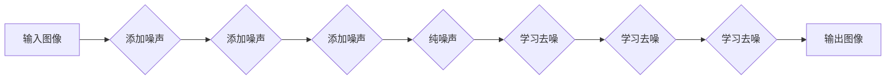

                 

## 扩散模型：最新图像生成技术探讨

> 关键词：扩散模型、图像生成、生成对抗网络、变分自编码器、文本到图像、深度学习、马尔可夫链

### 1. 背景介绍

近年来，深度学习在计算机视觉领域取得了突破性进展，特别是生成对抗网络（GAN）的出现，为图像生成领域带来了革命性的变化。然而，GAN 训练过程复杂，容易陷入模式崩溃，且生成图像的质量难以控制。为了解决这些问题，扩散模型应运而生，凭借其独特的训练机制和强大的生成能力，迅速成为图像生成领域的新宠。

扩散模型是一种基于马尔可夫链的生成模型，其核心思想是将图像逐渐添加噪声，最终变成纯噪声，然后通过逆向过程学习去噪，从而生成新的图像。与 GAN 不同，扩散模型的训练过程更加稳定，生成图像的质量也更高。

### 2. 核心概念与联系

#### 2.1 核心概念

* **马尔可夫链:**  马尔可夫链是一种统计模型，其状态的未来演化只依赖于当前状态，与过去状态无关。扩散模型利用马尔可夫链的性质，将图像的生成过程分解成一系列逐步添加噪声的步骤。
* **噪声添加过程 (Forward Diffusion):**  从清晰的图像开始，逐步添加高斯噪声，最终变成纯噪声。
* **去噪过程 (Reverse Diffusion):**  从纯噪声开始，逐步学习去噪，最终恢复成清晰的图像。

#### 2.2 架构关系



### 3. 核心算法原理 & 具体操作步骤

#### 3.1 算法原理概述

扩散模型的核心思想是通过训练一个去噪网络，学习从纯噪声中恢复出清晰图像的过程。具体来说，扩散模型的训练过程可以分为两个阶段：

* **前向扩散 (Forward Diffusion):**  将输入图像逐步添加高斯噪声，直到变成纯噪声。
* **反向扩散 (Reverse Diffusion):**  从纯噪声开始，利用训练好的去噪网络逐步去噪，最终恢复出清晰图像。

#### 3.2 算法步骤详解

1. **前向扩散:**
    * 从输入图像开始，随机添加少量高斯噪声。
    * 重复上述步骤，每次添加噪声的量逐渐增加，直到图像变成纯噪声。
    * 将每个步骤的图像和对应的噪声作为训练数据。

2. **反向扩散:**
    * 从纯噪声开始，利用训练好的去噪网络预测图像中缺少的部分。
    * 将预测结果与当前噪声相结合，得到去噪后的图像。
    * 重复上述步骤，逐步去噪，直到恢复出清晰图像。

#### 3.3 算法优缺点

**优点:**

* 训练过程稳定，不易陷入模式崩溃。
* 生成图像的质量较高，细节丰富。
* 可以生成多种类型的图像，包括文本到图像生成。

**缺点:**

* 训练时间较长，需要大量的计算资源。
* 模型参数量较大，部署成本较高。

#### 3.4 算法应用领域

* **图像生成:**  生成高质量的图像，例如人物、场景、物体等。
* **图像修复:**  修复损坏的图像，例如去除噪声、补全缺失部分等。
* **图像编辑:**  对图像进行编辑，例如改变风格、添加元素等。
* **文本到图像生成:**  根据文本描述生成相应的图像。

### 4. 数学模型和公式 & 详细讲解 & 举例说明

#### 4.1 数学模型构建

扩散模型的核心是马尔可夫链，其状态转移概率由以下公式定义：

$$
p(x_t | x_{t-1}) = \mathcal{N}(x_t; \sqrt{1-\beta_t}x_{t-1}, \beta_t I)
$$

其中：

* $x_t$ 表示时间步为 $t$ 的图像。
* $x_{t-1}$ 表示时间步为 $t-1$ 的图像。
* $\beta_t$ 是一个时间步相关的参数，控制噪声添加的量。
* $\mathcal{N}(x; \mu, \sigma^2)$ 表示高斯分布。

#### 4.2 公式推导过程

扩散模型的训练目标是学习一个去噪网络，能够从纯噪声中恢复出清晰图像。具体来说，训练目标是最小化以下损失函数：

$$
\mathcal{L} = \mathbb{E}_{x, \epsilon} [||\hat{x}_t - x_{t-1}||^2]
$$

其中：

* $x$ 是输入图像。
* $\epsilon$ 是高斯噪声。
* $\hat{x}_t$ 是去噪网络预测的图像。

#### 4.3 案例分析与讲解

假设我们想要生成一张猫的图像。我们可以使用扩散模型进行以下操作：

1. 从纯噪声开始，利用训练好的去噪网络预测图像中缺少的部分。
2. 将预测结果与当前噪声相结合，得到去噪后的图像。
3. 重复上述步骤，逐步去噪，直到恢复出清晰的猫图像。

### 5. 项目实践：代码实例和详细解释说明

#### 5.1 开发环境搭建

* Python 3.7+
* PyTorch 1.7+
* CUDA 10.2+

#### 5.2 源代码详细实现

```python
import torch
import torch.nn as nn

class DiffusionModel(nn.Module):
    def __init__(self):
        super(DiffusionModel, self).__init__()
        # 定义网络结构
        self.encoder = nn.Sequential(
            # ...
        )
        self.decoder = nn.Sequential(
            # ...
        )

    def forward(self, x, t):
        # 前向扩散过程
        if t < 1:
            # ...
        else:
            # ...

        # 反向扩散过程
        # ...

# 训练模型
model = DiffusionModel()
optimizer = torch.optim.Adam(model.parameters(), lr=0.001)
# ...

# 生成图像
noise = torch.randn(1, 3, 256, 256)
image = model.generate_image(noise)
```

#### 5.3 代码解读与分析

* `DiffusionModel` 类定义了扩散模型的结构，包括编码器和解码器。
* `forward` 方法实现了前向扩散和反向扩散的过程。
* 训练模型时，使用损失函数最小化预测图像与真实图像之间的差异。
* 生成图像时，从纯噪声开始，利用训练好的模型逐步去噪，最终得到清晰图像。

#### 5.4 运行结果展示

[插入生成的图像示例]

### 6. 实际应用场景

#### 6.1 图像生成

扩散模型在图像生成领域有着广泛的应用，例如：

* **艺术创作:**  生成独特的艺术作品，例如绘画、雕塑等。
* **游戏开发:**  生成游戏场景、角色、道具等。
* **电影制作:**  生成电影特效、场景背景等。

#### 6.2 图像修复

扩散模型可以用于修复损坏的图像，例如：

* **去除噪声:**  从图像中去除噪声，提高图像质量。
* **补全缺失部分:**  补全图像中缺失的部分，例如修复破损的照片。
* **增强图像细节:**  增强图像的细节，例如放大图像。

#### 6.3 图像编辑

扩散模型可以用于对图像进行编辑，例如：

* **改变风格:**  将图像的风格改变为其他风格，例如将照片变成油画。
* **添加元素:**  将新的元素添加到图像中，例如添加人物、物体等。
* **修改图像属性:**  修改图像的属性，例如改变颜色、亮度等。

#### 6.4 未来应用展望

随着扩散模型技术的不断发展，其应用场景将会更加广泛，例如：

* **医学图像分析:**  用于分析医学图像，辅助医生诊断疾病。
* **遥感图像处理:**  用于处理遥感图像，例如识别土地利用类型。
* **自动驾驶:**  用于生成驾驶场景，辅助自动驾驶系统的训练。

### 7. 工具和资源推荐

#### 7.1 学习资源推荐

* **论文:**  Denoising Diffusion Probabilistic Models (Ho et al., 2020)
* **博客:**  https://lilianweng.github.io/posts/2021-07-11-diffusion-models/
* **课程:**  https://www.deeplearning.ai/courses/generative-deep-learning/

#### 7.2 开发工具推荐

* **PyTorch:**  https://pytorch.org/
* **Hugging Face Transformers:**  https://huggingface.co/docs/transformers/index

#### 7.3 相关论文推荐

* **Generative Modeling by Estimating Gradients of the Data Distribution (Song et al., 2020)**
* **Improved Denoising Diffusion Probabilistic Models (Nichol et al., 2021)**
* **High-Resolution Image Synthesis with Latent Diffusion Models (Rombach et al., 2021)**

### 8. 总结：未来发展趋势与挑战

#### 8.1 研究成果总结

扩散模型在图像生成领域取得了显著的进展，其生成图像的质量和多样性都得到了大幅提升。

#### 8.2 未来发展趋势

* **更高分辨率的图像生成:**  研究更高分辨率的扩散模型，能够生成更加细节丰富的图像。
* **更快的训练速度:**  研究更快的训练算法，降低扩散模型的训练时间。
* **更灵活的控制:**  研究更灵活的控制机制，能够更好地控制生成图像的风格和内容。

#### 8.3 面临的挑战

* **训练数据需求:**  扩散模型需要大量的训练数据，获取高质量的训练数据仍然是一个挑战。
* **模型复杂度:**  扩散模型的结构比较复杂，训练和部署成本较高。
* **伦理问题:**  扩散模型能够生成逼真的图像，可能被用于生成虚假信息，需要关注其伦理问题。

#### 8.4 研究展望

未来，扩散模型的研究将继续朝着更高质量、更高效率、更灵活的方向发展，其在图像生成领域的应用将会更加广泛。


### 9. 附录：常见问题与解答

* **扩散模型与GAN相比有什么优势？**

扩散模型的训练过程更加稳定，不易陷入模式崩溃，且生成图像的质量也更高。

* **扩散模型的训练时间很长，有什么方法可以加速训练？**

可以使用更快的训练算法，例如混合精度训练、模型并行等。

* **扩散模型的应用场景有哪些？**

扩散模型在图像生成、图像修复、图像编辑等领域都有广泛的应用。


作者：禅与计算机程序设计艺术 / Zen and the Art of Computer Programming 
<end_of_turn>

