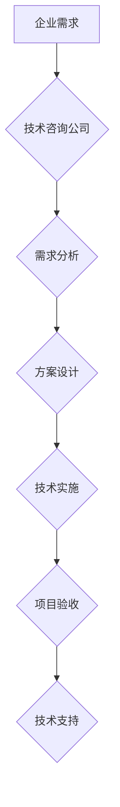

                 

## 技术咨询：从个人顾问到咨询公司

> 关键词：技术咨询、个人顾问、咨询公司、技术专家、项目实施、商业模式、市场趋势、未来发展

### 1. 背景介绍

在当今科技日新月异的时代，技术咨询已成为企业数字化转型和创新发展的关键驱动力。技术咨询服务涵盖广泛领域，从企业信息化战略规划、软件开发和实施、数据分析和人工智能应用，到云计算、网络安全和区块链技术咨询等。随着科技进步和市场需求的不断变化，技术咨询行业呈现出蓬勃发展态势。

从个人顾问到咨询公司，技术咨询服务模式也在不断演变。早期，技术咨询主要以个人顾问为主，他们凭借自身的技术专长和经验，为企业提供一对一的技术解决方案。随着行业规模的扩大和服务需求的复杂化，咨询公司应运而生，它们拥有更专业的团队、更完善的流程和更丰富的服务体系，能够提供更全面的技术咨询服务。

### 2. 核心概念与联系

**2.1 技术咨询的核心概念**

技术咨询是指运用专业技术知识和经验，为企业提供技术解决方案和咨询服务的活动。其核心目标是帮助企业解决技术难题，提升技术水平，实现业务目标。

**2.2 技术咨询与企业发展的联系**

技术咨询服务是企业数字化转型和创新发展的关键支撑。

* **战略规划:** 帮助企业制定符合自身发展战略的技术路线图，明确技术目标和实施方案。
* **技术选型:** 为企业选择最合适的技术方案，评估技术风险和效益，降低技术投入成本。
* **项目实施:** 提供技术实施方案和项目管理服务，确保项目顺利完成，达到预期效果。
* **技术培训:** 为企业员工提供技术培训和知识提升服务，提高企业技术能力。

**2.3 技术咨询服务模式**

技术咨询服务模式主要包括以下几种：

* **项目咨询:** 以特定项目为目标，提供全面的技术咨询服务，包括需求分析、方案设计、实施和验收。
* **顾问咨询:** 以企业技术发展为目标，提供持续的技术指导和支持，帮助企业解决技术难题和提升技术水平。
* **知识产权咨询:** 为企业提供知识产权保护和管理咨询服务，帮助企业维护技术优势。

**2.4 技术咨询的价值链**

技术咨询的价值链包括以下环节：

* **需求分析:** 准确理解客户需求，明确咨询目标。
* **方案设计:** 提供符合客户需求的最佳技术方案。
* **技术实施:** 将方案转化为实际应用，确保项目顺利完成。
* **技术支持:** 提供持续的技术支持和维护服务，保障客户利益。

**2.5 Mermaid 流程图**

### 3. 核心算法原理 & 具体操作步骤

**3.1 算法原理概述**

技术咨询的核心算法原理是基于对特定技术领域深厚的理解和经验积累，能够快速识别客户需求，分析问题根源，并设计出最佳的解决方案。

**3.2 算法步骤详解**

1. **需求收集:** 通过与客户深入沟通，了解客户的业务背景、技术需求和目标。
2. **问题分析:** 分析客户提出的问题，识别问题根源和关键因素。
3. **方案设计:** 根据客户需求和问题分析结果，设计出符合客户需求的最佳技术方案。
4. **方案评估:** 对方案进行评估，分析方案的优缺点、风险和效益。
5. **方案实施:** 将方案转化为实际应用，并提供技术支持和维护服务。

**3.3 算法优缺点**

* **优点:** 能够提供个性化、定制化的技术解决方案，满足客户的特定需求。
* **缺点:** 依赖于技术专家的经验和知识，缺乏标准化和可重复性。

**3.4 算法应用领域**

技术咨询算法广泛应用于以下领域:

* **软件开发:** 提供软件开发咨询、项目管理和技术支持服务。
* **数据分析:** 提供数据分析咨询、模型构建和解决方案实施服务。
* **人工智能:** 提供人工智能咨询、算法开发和应用服务。
* **云计算:** 提供云计算咨询、架构设计和迁移服务。

### 4. 数学模型和公式 & 详细讲解 & 举例说明

**4.1 数学模型构建**

技术咨询的数学模型可以用来量化技术咨询的价值，评估方案的效益，优化资源配置。例如，可以构建一个技术咨询成本-效益模型，将技术咨询成本和效益进行量化比较，帮助企业做出决策。

**4.2 公式推导过程**

假设技术咨询的成本为 $C$，效益为 $B$，则技术咨询的净效益为 $N = B - C$。

**4.3 案例分析与讲解**

例如，一家企业需要开发一个新的软件系统，预计开发成本为 $100万元，预计效益为 $200万元，则技术咨询的净效益为 $200万元 - 100万元 = 100万元$。

### 5. 项目实践：代码实例和详细解释说明

**5.1 开发环境搭建**

技术咨询项目实践需要搭建相应的开发环境，包括硬件、软件和网络环境。

**5.2 源代码详细实现**

具体代码实现需要根据项目需求和技术方案进行设计和开发。

**5.3 代码解读与分析**

代码解读需要分析代码结构、逻辑和功能，理解代码的运行机制。

**5.4 运行结果展示**

运行结果展示需要验证代码的正确性，并根据实际需求进行调整和优化。

### 6. 实际应用场景

**6.1 技术咨询在企业数字化转型中的应用**

技术咨询在企业数字化转型中扮演着至关重要的角色，帮助企业构建数字化基础设施、实现业务流程优化、提升客户体验。

**6.2 技术咨询在创新发展中的应用**

技术咨询可以帮助企业探索新技术、开发新产品、开拓新市场，推动企业创新发展。

**6.3 技术咨询在行业发展中的应用**

技术咨询可以帮助各个行业解决行业痛点，提升行业效率，推动行业发展。

**6.4 未来应用展望**

随着科技的不断发展，技术咨询的应用场景将更加广泛，服务内容将更加丰富。

### 7. 工具和资源推荐

**7.1 学习资源推荐**

* **书籍:** 《技术咨询的艺术》、《咨询师的成功之道》
* **网站:** 技术咨询行业网站、专业技术论坛
* **课程:** 在线技术咨询课程、行业培训课程

**7.2 开发工具推荐**

* **代码编辑器:** Visual Studio Code、Sublime Text
* **版本控制系统:** Git、GitHub
* **项目管理工具:** Jira、Trello

**7.3 相关论文推荐**

* **技术咨询的理论基础和实践应用**
* **技术咨询行业发展趋势分析**
* **技术咨询服务质量评价指标体系构建**

### 8. 总结：未来发展趋势与挑战

**8.1 研究成果总结**

技术咨询行业发展迅速，已经成为企业数字化转型和创新发展的关键驱动力。技术咨询服务模式不断创新，服务内容不断丰富，应用场景不断拓展。

**8.2 未来发展趋势**

* **人工智能技术应用:** 人工智能技术将被广泛应用于技术咨询领域，例如，智能客服、智能诊断、智能推荐等。
* **云计算服务:** 云计算服务将成为技术咨询的重要组成部分，例如，云平台架构设计、云应用开发、云安全服务等。
* **数据驱动咨询:** 数据分析和数据挖掘技术将被更加广泛地应用于技术咨询，帮助企业做出更科学、更精准的决策。

**8.3 面临的挑战**

* **人才短缺:** 技术咨询行业人才需求量大，但人才供给不足。
* **竞争加剧:** 技术咨询行业竞争日益激烈，需要不断提升服务质量和竞争力。
* **技术迭代快:** 科技发展日新月异，技术咨询服务需要不断跟进和更新。

**8.4 研究展望**

未来，技术咨询行业将继续朝着更加专业化、智能化、数据化的方向发展。

### 9. 附录：常见问题与解答

**9.1 技术咨询的收费标准如何确定？**

技术咨询的收费标准根据项目规模、服务内容、技术难度、咨询师经验等因素综合考虑。

**9.2 技术咨询公司如何保证服务质量？**

技术咨询公司通常会建立完善的服务体系，包括项目管理流程、质量控制机制、客户服务体系等，以保证服务质量。

**9.3 如何选择合适的技术咨询公司？**

选择合适的技术咨询公司需要考虑以下因素：

* 公司资质和经验
* 服务范围和专业领域
* 服务团队的专业能力
* 客户评价和口碑

作者：禅与计算机程序设计艺术 / Zen and the Art of Computer Programming 

<end_of_turn>

