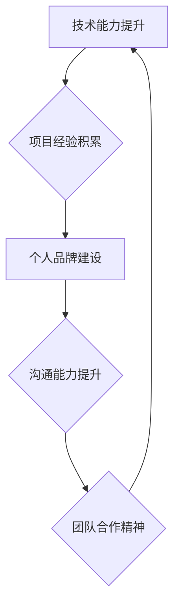

                 

## 技术演讲：提升个人市场价值

> 关键词：人工智能、机器学习、深度学习、数据科学、软件架构、技术博客、个人品牌、职业发展

## 1. 背景介绍

在当今科技飞速发展的时代，个人市场价值日益受到重视。作为一名技术人员，想要在激烈的竞争中脱颖而出，提升自身价值，就需要不断学习新技术、提升技能，并将其应用于实际项目中。

技术领域瞬息万变，新技术层出不穷，掌握前沿技术是提升个人市场价值的关键。同时，良好的沟通能力、团队合作精神和解决问题的能力也是不可或缺的。

## 2. 核心概念与联系

### 2.1 个人市场价值的构成

个人市场价值的构成是一个多维度的概念，它包括以下几个方面：

* **技术能力:** 掌握核心技术、具备解决实际问题的能力。
* **项目经验:** 参与过实际项目，积累项目经验，展示能力。
* **个人品牌:** 建立个人品牌，提升知名度和影响力。
* **沟通能力:** 能够清晰地表达自己的想法，与他人有效沟通。
* **团队合作精神:** 能够与团队成员协作，共同完成目标。

### 2.2 个人市场价值提升的架构

个人市场价值提升是一个系统工程，需要从多个方面入手，并形成一个闭环的提升体系。



## 3. 核心算法原理 & 具体操作步骤

### 3.1 算法原理概述

提升个人市场价值的核心算法可以理解为一个持续学习、实践、反馈的循环过程。

* **学习:** 持续学习新技术，掌握前沿知识。
* **实践:** 将学习到的知识应用于实际项目中，积累经验。
* **反馈:** 反思实践过程中的经验教训，不断优化学习和实践方法。

### 3.2 算法步骤详解

1. **目标设定:** 明确个人市场价值提升的目标，例如提升某个技术领域的能力、参与特定类型的项目、建立个人品牌等。
2. **资源整合:** 寻找合适的学习资源，例如在线课程、书籍、技术博客、开源项目等。
3. **知识学习:** 认真学习目标领域的技术知识，并进行实践练习。
4. **项目参与:** 积极参与实际项目，积累项目经验，并展示自己的能力。
5. **个人品牌建设:** 建立个人博客、社交媒体账号等平台，分享自己的技术经验和见解，提升个人知名度和影响力。
6. **沟通能力提升:** 积极参加技术交流活动，与他人交流学习，提升沟通能力。
7. **团队合作:** 积极参与团队项目，学习团队合作精神，提升协作能力。
8. **持续反馈:** 反思学习和实践过程中的经验教训，不断优化学习和实践方法，提升个人市场价值。

### 3.3 算法优缺点

* **优点:** 持续学习、实践、反馈的循环过程能够有效提升个人市场价值。
* **缺点:** 需要持续投入时间和精力，并保持学习和实践的动力。

### 3.4 算法应用领域

该算法适用于所有希望提升个人市场价值的技术人员，无论其经验水平如何。

## 4. 数学模型和公式 & 详细讲解 & 举例说明

### 4.1 数学模型构建

个人市场价值可以看作是一个多维度的向量，每个维度代表一个方面的能力或属性。

```latex
V = (T, P, B, C, S)
```

其中：

* $V$ 代表个人市场价值
* $T$ 代表技术能力
* $P$ 代表项目经验
* $B$ 代表个人品牌
* $C$ 代表沟通能力
* $S$ 代表团队合作精神

### 4.2 公式推导过程

每个维度的值可以通过以下公式计算：

* $T = \sum_{i=1}^{n} w_i * s_i$

其中：

* $n$ 代表掌握的技术数量
* $w_i$ 代表第 $i$ 个技术的权重
* $s_i$ 代表掌握第 $i$ 个技术的程度

* $P = \sum_{j=1}^{m} e_j * c_j$

其中：

* $m$ 代表参与的项目数量
* $e_j$ 代表第 $j$ 个项目的经验值
* $c_j$ 代表参与第 $j$ 个项目的贡献度

* $B = \sum_{k=1}^{l} f_k * i_k$

其中：

* $l$ 代表个人品牌的影响力
* $f_k$ 代表第 $k$ 个平台的影响力
* $i_k$ 代表在第 $k$ 个平台的影响力

* $C = \sum_{p=1}^{q} g_p * r_p$

其中：

* $q$ 代表沟通能力的评估指标数量
* $g_p$ 代表第 $p$ 个指标的权重
* $r_p$ 代表在第 $p$ 个指标上的得分

* $S = \sum_{u=1}^{v} h_u * d_u$

其中：

* $v$ 代表团队合作精神的评估指标数量
* $h_u$ 代表第 $u$ 个指标的权重
* $d_u$ 代表在第 $u$ 个指标上的得分

### 4.3 案例分析与讲解

假设一个技术人员想要提升个人市场价值，他可以根据上述公式进行分析，并制定相应的提升计划。例如，他可以：

* 提升技术能力：学习新的编程语言、框架或技术，并通过开源项目或个人项目进行实践。
* 积累项目经验：积极参与实际项目，并承担重要的角色，积累项目经验和领导能力。
* 建立个人品牌：建立个人博客、社交媒体账号等平台，分享自己的技术经验和见解，并积极参与技术社区活动。
* 提升沟通能力：参加技术交流活动，与他人交流学习，并练习清晰地表达自己的想法。
* 培养团队合作精神：积极参与团队项目，学习团队合作精神，并提升协作能力。

通过持续学习、实践、反馈，他可以逐步提升个人市场价值，并获得更好的职业发展机会。

## 5. 项目实践：代码实例和详细解释说明

### 5.1 开发环境搭建

为了演示提升个人市场价值的算法，我们可以创建一个简单的个人博客项目。

* **语言:** Python
* **框架:** Flask
* **数据库:** SQLite

### 5.2 源代码详细实现

```python
from flask import Flask, render_template

app = Flask(__name__)

@app.route('/')
def index():
    return render_template('index.html')

if __name__ == '__main__':
    app.run(debug=True)
```

### 5.3 代码解读与分析

* **Flask:** Flask 是一个轻量级的 Python Web 框架，用于构建 Web 应用。
* **render_template:** 这是一个 Flask 的内置函数，用于渲染 HTML 模板。
* **index.html:** 这是一个 HTML 模板文件，用于定义博客首页的布局和内容。

### 5.4 运行结果展示

运行上述代码后，我们可以访问 http://127.0.0.1:5000/，看到一个简单的博客首页。

## 6. 实际应用场景

### 6.1 个人品牌建设

个人博客可以作为个人品牌建设的重要平台，通过分享技术经验、见解和案例，提升个人知名度和影响力。

### 6.2 技术交流

个人博客可以作为技术交流的平台，与其他技术人员分享知识、讨论技术问题，并建立人脉关系。

### 6.3 项目展示

个人博客可以作为项目展示的平台，展示自己的项目经验和技术能力，吸引潜在雇主或客户。

### 6.4 未来应用展望

随着人工智能、机器学习等技术的不断发展，个人博客将更加智能化、个性化，并成为更重要的个人品牌建设和技术交流平台。

## 7. 工具和资源推荐

### 7.1 学习资源推荐

* **在线课程:** Coursera, edX, Udemy
* **技术博客:** Medium, Hacker News, Dev.to
* **开源项目:** GitHub, GitLab

### 7.2 开发工具推荐

* **代码编辑器:** VS Code, Sublime Text, Atom
* **版本控制系统:** Git
* **Web 框架:** Flask, Django

### 7.3 相关论文推荐

* **深度学习**
* **自然语言处理**
* **计算机视觉**

## 8. 总结：未来发展趋势与挑战

### 8.1 研究成果总结

提升个人市场价值是一个持续学习、实践、反馈的循环过程，需要掌握核心技术、积累项目经验、建立个人品牌、提升沟通能力和团队合作精神。

### 8.2 未来发展趋势

随着科技的不断发展，个人市场价值提升将更加注重人工智能、机器学习等技术的应用，并更加个性化、智能化。

### 8.3 面临的挑战

* **技术更新迭代快:** 需要持续学习新技术，保持学习的动力。
* **竞争激烈:** 需要不断提升自身能力，才能脱颖而出。
* **个人品牌建设难度:** 需要付出时间和精力，才能建立个人品牌。

### 8.4 研究展望

未来研究将更加注重人工智能、机器学习等技术的应用，并探索更有效的个人市场价值提升方法。

## 9. 附录：常见问题与解答

* **如何提升技术能力?**

可以通过学习在线课程、阅读技术书籍、参与开源项目等方式提升技术能力。

* **如何积累项目经验?**

可以通过积极参与实际项目、承担重要角色、并完成项目目标来积累项目经验。

* **如何建立个人品牌?**

可以通过建立个人博客、社交媒体账号、分享技术经验和见解、并积极参与技术社区活动来建立个人品牌。


作者：禅与计算机程序设计艺术 / Zen and the Art of Computer Programming 
<end_of_turn>

