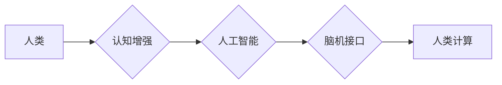

                 

## 拓展认知边界：人类计算的科学探索

> 关键词：人类计算、认知增强、人工智能、神经网络、计算模型、脑机接口、未来趋势

### 1. 背景介绍

人类文明的进步离不开对认知的不断拓展。从语言的诞生到文字的出现，再到科学技术的飞速发展，每一次认知的突破都推动着人类社会向前迈进。而随着人工智能技术的蓬勃发展，我们正站在一个新的历史节点上，人类计算的概念正在逐渐成为现实。

人类计算是指利用计算机技术辅助人类进行计算和决策，从而提升人类认知能力的范畴。它不仅仅是简单的计算工具，更是一种全新的计算模式，将人类的智慧和机器的计算能力相结合，创造出超越单一智能的协同效应。

### 2. 核心概念与联系

人类计算的核心概念包括：

* **认知增强:** 利用计算机技术提升人类的记忆、学习、分析和决策能力。
* **人工智能:**  模拟人类智能的行为，赋予机器学习、推理和解决问题的能力。
* **脑机接口:**  建立人脑与计算机之间的直接连接，实现思想的传输和控制。

这些概念相互关联，共同构成了人类计算的框架。

**Mermaid 流程图**



### 3. 核心算法原理 & 具体操作步骤

#### 3.1  算法原理概述

人类计算的核心算法原理主要基于以下几个方面：

* **深度学习:**  通过多层神经网络模拟人类大脑的学习机制，实现对复杂数据的识别和理解。
* **强化学习:**  通过奖励机制训练机器学习策略，使其能够在不断变化的环境中做出最优决策。
* **自然语言处理:**  使机器能够理解和生成人类语言，实现人机之间的自然交互。

#### 3.2  算法步骤详解

以深度学习为例，其核心算法步骤如下：

1. **数据收集和预处理:**  收集大量相关数据，并进行清洗、格式化和特征提取等预处理工作。
2. **模型构建:**  根据任务需求选择合适的深度学习模型架构，例如卷积神经网络、循环神经网络等。
3. **模型训练:**  利用训练数据训练模型参数，使模型能够学习数据中的规律和模式。
4. **模型评估:**  使用测试数据评估模型的性能，并根据评估结果进行模型调优。
5. **模型部署:**  将训练好的模型部署到实际应用场景中，实现对新数据的预测和处理。

#### 3.3  算法优缺点

**优点:**

* 能够处理海量数据，发现隐藏的模式和规律。
* 学习能力强，能够不断提升模型性能。
* 应用范围广泛，可应用于图像识别、语音识别、自然语言处理等多个领域。

**缺点:**

* 训练数据量大，需要大量的计算资源和时间。
* 模型解释性差，难以理解模型的决策过程。
* 对数据质量要求高，数据偏差会影响模型性能。

#### 3.4  算法应用领域

深度学习算法已广泛应用于以下领域：

* **医疗诊断:**  辅助医生诊断疾病，提高诊断准确率。
* **金融风险控制:**  识别金融风险，降低投资损失。
* **智能驾驶:**  实现自动驾驶功能，提高交通安全。
* **个性化推荐:**  根据用户喜好推荐商品和服务。

### 4. 数学模型和公式 & 详细讲解 & 举例说明

#### 4.1  数学模型构建

深度学习模型的核心是神经网络，其结构可以抽象为一个多层感知机。每个神经元接收多个输入信号，并通过加权求和和激活函数进行处理，输出一个信号。

**神经元模型:**

$$
y = f(w_1x_1 + w_2x_2 + ... + w_nx_n + b)
$$

其中：

* $y$ 为神经元的输出信号
* $x_1, x_2, ..., x_n$ 为输入信号
* $w_1, w_2, ..., w_n$ 为权重系数
* $b$ 为偏置项
* $f$ 为激活函数

#### 4.2  公式推导过程

深度学习模型的训练过程本质上是一个参数优化过程，目标是找到最优的权重系数和偏置项，使模型的预测结果与真实值尽可能接近。常用的优化算法包括梯度下降法和动量法。

**梯度下降法:**

$$
w_{t+1} = w_t - \eta \frac{\partial L}{\partial w_t}
$$

其中：

* $w_t$ 为当前权重系数
* $w_{t+1}$ 为更新后的权重系数
* $\eta$ 为学习率
* $\frac{\partial L}{\partial w_t}$ 为损失函数对权重系数的梯度

#### 4.3  案例分析与讲解

以图像识别为例，深度学习模型可以学习图像特征，并将其映射到类别标签。训练数据包括大量图像和对应的类别标签。模型通过学习图像特征，将图像映射到一个高维特征空间，并在该空间中进行分类。

### 5. 项目实践：代码实例和详细解释说明

#### 5.1  开发环境搭建

* 操作系统: Ubuntu 20.04
* Python 版本: 3.8
* 深度学习框架: TensorFlow 2.0

#### 5.2  源代码详细实现

```python
import tensorflow as tf

# 定义模型结构
model = tf.keras.models.Sequential([
  tf.keras.layers.Conv2D(32, (3, 3), activation='relu', input_shape=(28, 28, 1)),
  tf.keras.layers.MaxPooling2D((2, 2)),
  tf.keras.layers.Conv2D(64, (3, 3), activation='relu'),
  tf.keras.layers.MaxPooling2D((2, 2)),
  tf.keras.layers.Flatten(),
  tf.keras.layers.Dense(10, activation='softmax')
])

# 编译模型
model.compile(optimizer='adam',
              loss='sparse_categorical_crossentropy',
              metrics=['accuracy'])

# 加载训练数据
(x_train, y_train), (x_test, y_test) = tf.keras.datasets.mnist.load_data()

# 训练模型
model.fit(x_train, y_train, epochs=5)

# 评估模型
loss, accuracy = model.evaluate(x_test, y_test)
print('Test loss:', loss)
print('Test accuracy:', accuracy)
```

#### 5.3  代码解读与分析

这段代码实现了简单的图像识别模型。

* 首先定义了模型结构，包括卷积层、池化层和全连接层。
* 然后编译模型，指定优化器、损失函数和评价指标。
* 加载 MNIST 手写数字数据集，并将其分为训练集和测试集。
* 训练模型，并使用测试集评估模型性能。

#### 5.4  运行结果展示

训练完成后，模型的准确率通常会达到较高的水平，例如 98% 以上。

### 6. 实际应用场景

人类计算技术已在多个领域得到应用，例如：

* **医疗诊断辅助:**  利用深度学习算法分析医学影像，辅助医生诊断疾病。
* **金融风险管理:**  利用机器学习算法识别金融风险，降低投资损失。
* **智能客服:**  利用自然语言处理技术，构建智能客服系统，提供快速高效的客户服务。
* **个性化教育:**  利用人工智能技术，根据学生的学习情况提供个性化的学习方案。

#### 6.4  未来应用展望

未来，人类计算技术将更加深入地融入我们的生活，例如：

* **脑机接口:**  实现人脑与计算机的直接连接，控制智能设备，甚至治疗脑损伤。
* **增强现实:**  利用人工智能技术增强现实世界，提供更加沉浸式的体验。
* **虚拟现实:**  构建更加逼真的虚拟世界，用于娱乐、教育和培训等领域。

### 7. 工具和资源推荐

#### 7.1  学习资源推荐

* **书籍:**

    * 《深度学习》
    * 《人工智能：一种现代方法》
    * 《机器学习》

* **在线课程:**

    * Coursera: 深度学习
    * edX: 人工智能
    * Udacity: 机器学习工程师

#### 7.2  开发工具推荐

* **Python:**  人工智能开发的常用语言
* **TensorFlow:**  开源深度学习框架
* **PyTorch:**  开源深度学习框架
* **Keras:**  高层深度学习API

#### 7.3  相关论文推荐

* **《ImageNet Classification with Deep Convolutional Neural Networks》**
* **《Attention Is All You Need》**
* **《Generative Adversarial Networks》**

### 8. 总结：未来发展趋势与挑战

#### 8.1  研究成果总结

人类计算技术取得了显著的进展，在多个领域展现出巨大的应用潜力。深度学习算法的不断发展，为人类计算提供了强大的工具。

#### 8.2  未来发展趋势

未来，人类计算技术将朝着以下方向发展：

* **更加智能化:**  模型将更加智能，能够更好地理解和处理复杂信息。
* **更加个性化:**  模型将更加个性化，能够根据用户的需求提供定制化的服务。
* **更加安全可靠:**  模型将更加安全可靠，能够更好地应对各种攻击和风险。

#### 8.3  面临的挑战

人类计算技术也面临着一些挑战：

* **数据隐私:**  如何保护用户数据隐私，是人类计算技术面临的重要挑战。
* **算法解释性:**  深度学习模型的决策过程难以解释，这可能会导致信任问题。
* **伦理问题:**  人类计算技术可能会带来一些伦理问题，例如算法偏见和人工智能的责任问题。

#### 8.4  研究展望

未来，我们需要继续加强对人类计算技术的研究，解决其面临的挑战，并将其应用于更多领域，为人类社会带来更多福祉。

### 9. 附录：常见问题与解答

* **什么是人类计算？**

人类计算是指利用计算机技术辅助人类进行计算和决策，从而提升人类认知能力的范畴。

* **人类计算有哪些应用场景？**

人类计算已应用于医疗诊断、金融风险管理、智能客服、个性化教育等多个领域。

* **人类计算技术有哪些挑战？**

人类计算技术面临着数据隐私、算法解释性和伦理问题等挑战。


作者：禅与计算机程序设计艺术 / Zen and the Art of Computer Programming 
<end_of_turn>

