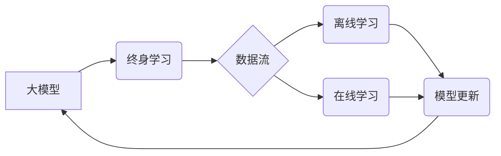

                 

## 推荐系统中的大模型终身学习与持续优化

> 关键词：推荐系统、大模型、终身学习、持续优化、模型更新、数据流、在线学习、离线学习

### 1. 背景介绍

推荐系统作为信息过滤和个性化内容展示的重要工具，在电商、社交媒体、视频平台等领域发挥着越来越重要的作用。传统的推荐系统主要依赖于特征工程和规则匹配，但随着数据量的爆炸式增长和用户行为的多样性，这些方法逐渐难以满足用户的个性化需求。

近年来，大模型的兴起为推荐系统带来了新的机遇。大模型凭借其强大的学习能力和泛化能力，能够从海量数据中学习到更丰富的用户偏好和物品特征，从而提供更精准、更个性化的推荐结果。然而，大模型的训练和部署也面临着新的挑战，例如模型规模庞大、训练成本高、数据更新频繁等。

为了应对这些挑战，终身学习和持续优化成为大模型推荐系统的关键技术。终身学习是指模型在部署后能够持续学习和更新，以适应不断变化的用户需求和数据分布。持续优化是指通过不断调整模型参数和架构，提高模型的性能和效率。

### 2. 核心概念与联系

**2.1 核心概念**

* **大模型 (Large Model):** 指参数量超过数十亿甚至千亿的深度学习模型，具备强大的学习能力和泛化能力。
* **终身学习 (Lifelong Learning):** 指模型在部署后能够持续学习和更新，以适应不断变化的环境和数据分布。
* **持续优化 (Continuous Optimization):** 指通过不断调整模型参数和架构，提高模型的性能和效率。

**2.2 架构关系**



**2.3 核心联系**

大模型推荐系统通过终身学习和持续优化机制，实现对数据流的持续学习和模型更新，从而保持推荐系统的准确性和有效性。

### 3. 核心算法原理 & 具体操作步骤

**3.1 算法原理概述**

大模型终身学习和持续优化的核心算法原理主要包括：

* **数据流处理:**  实时收集和处理用户行为数据，例如点击、浏览、购买等，并将其转化为模型可学习的格式。
* **离线学习:** 定期对历史数据进行训练，更新模型参数，提高模型的整体性能。
* **在线学习:** 实时对新数据进行训练，快速适应用户行为的变化，并进行在线模型更新。
* **模型更新策略:** 根据模型性能和数据变化情况，选择合适的模型更新策略，例如梯度下降、模型融合等。

**3.2 算法步骤详解**

1. **数据收集和预处理:** 收集用户行为数据，并进行清洗、转换和特征工程，将其转化为模型可学习的格式。
2. **离线训练:** 利用历史数据对大模型进行离线训练，更新模型参数，提高模型的整体性能。
3. **在线更新:** 实时收集新数据，对模型进行在线更新，快速适应用户行为的变化。
4. **模型评估和监控:** 定期评估模型性能，并监控模型的运行状态，及时发现问题并进行调整。

**3.3 算法优缺点**

* **优点:** 能够持续学习和更新，适应不断变化的用户需求和数据分布，提高推荐系统的准确性和有效性。
* **缺点:** 需要处理海量数据，并进行复杂的模型训练和更新，计算资源消耗较大。

**3.4 算法应用领域**

* **电商推荐:**  个性化商品推荐、新品推荐、关联推荐等。
* **社交媒体推荐:**  好友推荐、内容推荐、兴趣小组推荐等。
* **视频平台推荐:**  视频内容推荐、用户兴趣推荐、个性化播放列表等。

### 4. 数学模型和公式 & 详细讲解 & 举例说明

**4.1 数学模型构建**

推荐系统的核心目标是预测用户对物品的评分或点击概率。我们可以使用以下数学模型来表示：

$$
r_{u,i} = f(u, i, \theta)
$$

其中：

* $r_{u,i}$ 表示用户 $u$ 对物品 $i$ 的评分或点击概率。
* $u$ 表示用户特征向量。
* $i$ 表示物品特征向量。
* $\theta$ 表示模型参数。
* $f$ 表示模型函数。

**4.2 公式推导过程**

模型函数 $f$ 可以使用多种形式，例如线性回归、神经网络等。

* **线性回归:**

$$
r_{u,i} = \theta_0 + \theta_1 u_1 i_1 + \theta_2 u_2 i_2 + ... + \theta_n u_n i_n
$$

* **神经网络:**

$$
r_{u,i} = \sigma(W_1 u + b_1) \cdot \sigma(W_2 i + b_2)
$$

其中：

* $\sigma$ 表示激活函数。
* $W_1$, $W_2$ 表示权重矩阵。
* $b_1$, $b_2$ 表示偏置向量。

**4.3 案例分析与讲解**

假设我们有一个电商平台，想要推荐商品给用户。我们可以使用用户历史购买记录、浏览记录、评分等数据作为用户特征，以及商品类别、价格、描述等数据作为商品特征。

通过训练一个基于神经网络的推荐模型，我们可以学习到用户和商品之间的潜在关系，并预测用户对商品的评分或点击概率。

### 5. 项目实践：代码实例和详细解释说明

**5.1 开发环境搭建**

* 操作系统: Ubuntu 20.04
* Python 版本: 3.8
* 深度学习框架: TensorFlow 2.x

**5.2 源代码详细实现**

```python
import tensorflow as tf

# 定义用户和商品特征
user_features = tf.keras.Input(shape=(10,))
item_features = tf.keras.Input(shape=(5,))

# 定义模型层
dense_layer = tf.keras.layers.Dense(64, activation='relu')
concat_layer = tf.keras.layers.Concatenate()
output_layer = tf.keras.layers.Dense(1, activation='sigmoid')

# 模型构建
user_embedding = dense_layer(user_features)
item_embedding = dense_layer(item_features)
concat_embedding = concat_layer([user_embedding, item_embedding])
prediction = output_layer(concat_embedding)

# 模型编译
model = tf.keras.Model(inputs=[user_features, item_features], outputs=prediction)
model.compile(optimizer='adam', loss='binary_crossentropy', metrics=['accuracy'])

# 模型训练
model.fit(
    x=[user_data, item_data],
    y=target_data,
    epochs=10,
    batch_size=32
)

# 模型评估
loss, accuracy = model.evaluate(
    x=[user_test_data, item_test_data],
    y=target_test_data
)
print(f'Loss: {loss}, Accuracy: {accuracy}')
```

**5.3 代码解读与分析**

* 代码首先定义了用户和商品特征的输入层。
* 然后使用密集层和连接层构建模型，将用户和商品特征进行融合，并输出预测结果。
* 模型使用 Adam 优化器、二分类交叉熵损失函数和准确率作为评估指标进行训练。
* 最后，使用测试数据评估模型的性能。

**5.4 运行结果展示**

运行结果将显示模型的损失值和准确率，可以根据结果评估模型的性能。

### 6. 实际应用场景

**6.1 电商推荐**

大模型终身学习可以帮助电商平台个性化推荐商品，提高用户转化率。例如，可以根据用户的历史购买记录、浏览记录、评分等数据，预测用户对哪些商品感兴趣，并推荐相应的商品。

**6.2 社交媒体推荐**

大模型终身学习可以帮助社交媒体平台推荐好友、内容和兴趣小组，提高用户粘性和活跃度。例如，可以根据用户的兴趣爱好、社交关系等数据，推荐与用户兴趣相符的好友、内容和兴趣小组。

**6.3 视频平台推荐**

大模型终身学习可以帮助视频平台推荐视频内容和用户兴趣，提高用户观看时长和用户留存率。例如，可以根据用户的观看历史、点赞记录、评论等数据，推荐与用户观看习惯相符的视频内容。

**6.4 未来应用展望**

随着大模型技术的不断发展，终身学习和持续优化将成为推荐系统的重要发展方向。未来，大模型推荐系统将能够更加精准、个性化地推荐内容，并更好地理解用户的需求和意图。

### 7. 工具和资源推荐

**7.1 学习资源推荐**

* **书籍:**
    * 《深度学习》 by Ian Goodfellow, Yoshua Bengio, and Aaron Courville
    * 《推荐系统》 by  Koren, Yehuda
* **在线课程:**
    * Coursera: Machine Learning by Andrew Ng
    * Udacity: Deep Learning Nanodegree
* **博客和网站:**
    * Towards Data Science
    * Machine Learning Mastery

**7.2 开发工具推荐**

* **深度学习框架:** TensorFlow, PyTorch, Keras
* **数据处理工具:** Pandas, NumPy
* **云计算平台:** AWS, Azure, Google Cloud

**7.3 相关论文推荐**

* **Lifelong Learning:**
    * "Continual Learning: A Review" by  Zenke, et al.
    * "Learning Without Forgetting" by  McCloskey, et al.
* **Recommender Systems:**
    * "Collaborative Filtering: A User-Based Approach" by  Resnick, et al.
    * "Matrix Factorization Techniques for Recommender Systems" by  Koren, et al.

### 8. 总结：未来发展趋势与挑战

**8.1 研究成果总结**

大模型终身学习和持续优化为推荐系统带来了新的机遇，能够提高推荐系统的准确性和有效性，并更好地适应不断变化的用户需求和数据分布。

**8.2 未来发展趋势**

* **模型架构创新:**  探索新的模型架构，例如 Transformer、Graph Neural Networks 等，以更好地学习用户和物品之间的复杂关系。
* **数据增强技术:**  利用数据增强技术，例如数据合成、迁移学习等，提高模型的泛化能力和鲁棒性。
* **联邦学习:**  利用联邦学习技术，在保护用户隐私的前提下，实现模型的协同训练和更新。

**8.3 面临的挑战**

* **数据质量和稀疏性:**  推荐系统需要海量高质量的数据进行训练，而现实中数据往往存在质量问题和稀疏性。
* **模型复杂性和训练成本:**  大模型的训练成本很高，需要强大的计算资源和时间。
* **模型解释性和可解释性:**  大模型的决策过程往往难以解释，这可能会导致模型的信任度降低。

**8.4 研究展望**

未来，大模型终身学习和持续优化将继续是推荐系统研究的重要方向。通过不断探索新的算法、模型和技术，我们相信能够构建更加智能、高效、可解释的推荐系统，为用户提供更加个性化、精准的推荐服务。

### 9. 附录：常见问题与解答

**9.1 如何选择合适的终身学习策略？**

选择合适的终身学习策略需要根据具体应用场景和数据特点进行综合考虑。例如，对于数据更新频繁的场景，可以选择在线学习策略；对于数据更新较慢的场景，可以选择离线学习策略。

**9.2 如何解决模型过拟合问题？**

模型过拟合问题可以通过正则化、数据增强、早停等技术进行解决。

**9.3 如何评估模型的性能？**

模型的性能可以通过准确率、召回率、F1-score 等指标进行评估。


作者：禅与计算机程序设计艺术 / Zen and the Art of Computer Programming 
<end_of_turn>

