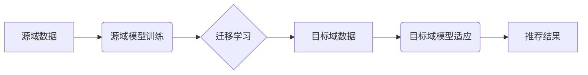

                 

## 推荐系统的跨域迁移：AI大模型的领域自适应学习

> 关键词：推荐系统、跨域迁移、领域自适应学习、AI大模型、迁移学习、知识蒸馏、Fine-tuning

## 1. 背景介绍

推荐系统作为信息过滤和个性化服务的重要组成部分，在电商、社交媒体、视频平台等领域发挥着至关重要的作用。传统的推荐系统通常依赖于海量用户行为数据进行训练，但数据孤岛、数据隐私等问题限制了其发展。近年来，随着AI大模型的兴起，跨域迁移学习成为推荐系统领域的新兴研究方向。

跨域迁移学习旨在利用源域数据训练的模型，在目标域数据上进行迁移和适应，从而降低对目标域数据量的依赖。AI大模型，例如BERT、GPT等，拥有强大的泛化能力和知识表示能力，为跨域迁移学习提供了新的可能性。

## 2. 核心概念与联系

### 2.1 核心概念

* **推荐系统:**  旨在根据用户的历史行为、偏好等信息，预测用户对特定物品的兴趣，并推荐相关物品的系统。
* **跨域迁移学习:**  利用源域数据训练的模型，在目标域数据上进行迁移和适应，从而降低对目标域数据量的依赖。
* **领域自适应学习:**  一种迁移学习的子领域，旨在使模型在不同的领域或环境中保持良好的性能。
* **AI大模型:**  拥有大量参数和训练数据，能够处理复杂任务的深度学习模型。

### 2.2 架构关系



## 3. 核心算法原理 & 具体操作步骤

### 3.1 算法原理概述

跨域迁移学习的核心思想是利用源域数据训练的模型，提取其通用特征和知识，并将其迁移到目标域中进行适应。常见的跨域迁移学习算法包括：

* **知识蒸馏:**  将大模型的知识“蒸馏”到小模型中，从而提高小模型在目标域上的性能。
* **Fine-tuning:**  在源域模型的基础上，对目标域数据进行微调，使其更适应目标域的特征分布。
* **Domain Adaptation:**  通过对模型进行结构或参数调整，使其能够更好地处理不同领域的特征差异。

### 3.2 算法步骤详解

以知识蒸馏为例，其具体操作步骤如下：

1. **训练源域模型:**  使用源域数据训练一个大型的预训练模型，例如BERT或GPT。
2. **知识蒸馏:**  将预训练模型的输出作为教师模型，使用一个较小的学生模型进行学习。
3. **目标域适应:**  使用目标域数据对学生模型进行微调，使其能够更好地适应目标域的特征分布。

### 3.3 算法优缺点

* **知识蒸馏:**  优点：能够有效地将大模型的知识迁移到小模型中，提高小模型的性能；缺点：需要大量的源域数据，对教师模型的性能要求较高。
* **Fine-tuning:**  优点：相对简单易行，对数据量要求较低；缺点：容易过拟合目标域数据，泛化能力较差。
* **Domain Adaptation:**  优点：能够更好地处理不同领域的特征差异；缺点：算法复杂度较高，需要更多的专业知识。

### 3.4 算法应用领域

跨域迁移学习在推荐系统领域具有广泛的应用场景，例如：

* **跨平台推荐:**  利用一个平台的用户行为数据训练模型，在另一个平台上进行推荐。
* **跨领域推荐:**  利用电商平台的用户行为数据训练模型，在社交媒体平台上进行推荐。
* **新用户推荐:**  利用现有用户的行为数据训练模型，为新用户进行个性化推荐。

## 4. 数学模型和公式 & 详细讲解 & 举例说明

### 4.1 数学模型构建

假设我们有一个推荐系统，用户集合为U，物品集合为I。用户u对物品i的评分为r<sub>ui</sub>。我们的目标是预测用户u对物品i的评分。

我们可以使用以下数学模型来表示推荐系统的评分预测：

$$
r_{ui} = f(u, i, \theta)
$$

其中：

* r<sub>ui</sub> 是用户u对物品i的评分。
* u 是用户u的特征向量。
* i 是物品i的特征向量。
* θ 是模型参数。
* f 是评分预测函数。

### 4.2 公式推导过程

在跨域迁移学习中，我们通常使用以下公式来计算模型的迁移损失：

$$
L_{transfer} = ||\theta_{source} - \theta_{target}||^2
$$

其中：

* θ<sub>source</sub> 是源域模型的参数。
* θ<sub>target</sub> 是目标域模型的参数。

我们的目标是最小化迁移损失，从而使目标域模型的参数与源域模型的参数尽可能接近。

### 4.3 案例分析与讲解

假设我们有一个电商平台和一个社交媒体平台，我们想利用电商平台的用户行为数据训练一个推荐模型，并在社交媒体平台上进行推荐。

我们可以使用知识蒸馏算法进行跨域迁移学习。首先，我们使用电商平台的用户行为数据训练一个大型的预训练模型，例如BERT。然后，我们使用一个较小的学生模型学习预训练模型的知识。最后，我们使用社交媒体平台的用户行为数据对学生模型进行微调，使其能够更好地适应社交媒体平台的特征分布。

## 5. 项目实践：代码实例和详细解释说明

### 5.1 开发环境搭建

* Python 3.7+
* TensorFlow 2.0+
* PyTorch 1.0+
* CUDA 10.0+

### 5.2 源代码详细实现

```python
# 知识蒸馏代码示例

import tensorflow as tf

# 定义教师模型
class TeacherModel(tf.keras.Model):
    def __init__(self):
        super(TeacherModel, self).__init__()
        # ...

    def call(self, inputs):
        # ...

# 定义学生模型
class StudentModel(tf.keras.Model):
    def __init__(self):
        super(StudentModel, self).__init__()
        # ...

    def call(self, inputs):
        # ...

# 加载预训练模型
teacher_model = TeacherModel()
teacher_model.load_weights('teacher_model_weights.h5')

# 训练学生模型
student_model = StudentModel()
optimizer = tf.keras.optimizers.Adam(learning_rate=0.001)
loss_fn = tf.keras.losses.MeanSquaredError()

for epoch in range(10):
    for batch in data_loader:
        with tf.GradientTape() as tape:
            # 获取教师模型的预测结果
            teacher_predictions = teacher_model(batch['inputs'])
            # 获取学生模型的预测结果
            student_predictions = student_model(batch['inputs'])
            # 计算损失
            loss = loss_fn(teacher_predictions, student_predictions)
        # 更新模型参数
        gradients = tape.gradient(loss, student_model.trainable_variables)
        optimizer.apply_gradients(zip(gradients, student_model.trainable_variables))

# 保存学生模型的权重
student_model.save_weights('student_model_weights.h5')
```

### 5.3 代码解读与分析

* 代码首先定义了教师模型和学生模型，并加载了预训练模型的权重。
* 然后，代码使用Adam优化器和均方误差损失函数训练学生模型。
* 在训练过程中，代码使用教师模型的预测结果作为目标值，并计算学生模型的预测结果与目标值的误差。
* 最后，代码保存了训练好的学生模型的权重。

### 5.4 运行结果展示

训练完成后，我们可以使用学生模型对目标域数据进行预测，并评估其性能。

## 6. 实际应用场景

### 6.1 跨平台推荐

例如，一个电商平台可以利用其用户行为数据训练一个推荐模型，并将该模型迁移到其社交媒体平台上，为用户推荐相关商品。

### 6.2 跨领域推荐

例如，一个新闻平台可以利用其用户阅读历史数据训练一个推荐模型，并将该模型迁移到一个音乐平台上，为用户推荐相关音乐。

### 6.3 新用户推荐

例如，一个视频平台可以利用其现有用户的观看历史数据训练一个推荐模型，并为新用户提供个性化推荐。

### 6.4 未来应用展望

随着AI大模型的不断发展，跨域迁移学习在推荐系统领域将有更广泛的应用场景，例如：

* **个性化推荐:**  利用用户画像和行为数据，为用户提供更个性化的推荐。
* **多模态推荐:**  融合文本、图像、视频等多模态数据，为用户提供更丰富的推荐体验。
* **动态推荐:**  根据用户实时行为和环境变化，动态调整推荐结果。

## 7. 工具和资源推荐

### 7.1 学习资源推荐

* **书籍:**
    * 《深度学习》
    * 《迁移学习》
* **在线课程:**
    * Coursera: 深度学习
    * Udacity: 迁移学习
* **博客:**
    * TensorFlow Blog
    * PyTorch Blog

### 7.2 开发工具推荐

* **TensorFlow:**  开源深度学习框架
* **PyTorch:**  开源深度学习框架
* **HuggingFace:**  提供预训练模型和工具

### 7.3 相关论文推荐

* 《Domain Adaptation for Recommender Systems: A Survey》
* 《Transfer Learning for Recommender Systems: A Survey》
* 《Knowledge Distillation for Recommender Systems》

## 8. 总结：未来发展趋势与挑战

### 8.1 研究成果总结

跨域迁移学习为推荐系统的发展带来了新的机遇，能够有效地降低对目标域数据量的依赖，提高推荐系统的泛化能力。

### 8.2 未来发展趋势

* **更强大的AI大模型:**  随着AI大模型的不断发展，跨域迁移学习将能够处理更复杂的任务，并取得更好的效果。
* **更有效的迁移学习算法:**  研究人员将继续开发更有效的迁移学习算法，以提高跨域迁移学习的效率和准确性。
* **多模态跨域迁移学习:**  将融合文本、图像、视频等多模态数据进行跨域迁移学习，为用户提供更丰富的推荐体验。

### 8.3 面临的挑战

* **数据质量问题:**  跨域迁移学习需要高质量的数据，但目标域数据往往质量较低。
* **领域差异问题:**  不同领域的特征分布可能存在较大差异，这使得跨域迁移学习更加困难。
* **模型解释性问题:**  AI大模型的决策过程往往难以解释，这使得跨域迁移学习的应用受到限制。

### 8.4 研究展望

未来，跨域迁移学习将继续是推荐系统领域的重要研究方向。研究人员将致力于解决上述挑战，并开发更有效的跨域迁移学习算法，为用户提供更个性化、更智能的推荐服务。

## 9. 附录：常见问题与解答

* **Q1: 跨域迁移学习与传统推荐系统的区别是什么？**

* **A1:** 传统的推荐系统通常依赖于海量目标域数据进行训练，而跨域迁移学习则利用源域数据训练的模型，在目标域数据上进行迁移和适应，从而降低对目标域数据量的依赖。

* **Q2: 跨域迁移学习有哪些常见的算法？**

* **A2:** 常见的跨域迁移学习算法包括知识蒸馏、Fine-tuning和Domain Adaptation。

* **Q3: 跨域迁移学习有哪些应用场景？**

* **A3:** 跨域迁移学习在推荐系统领域具有广泛的应用场景，例如跨平台推荐、跨领域推荐和新用户推荐。


作者：禅与计算机程序设计艺术 / Zen and the Art of Computer Programming 
<end_of_turn>

