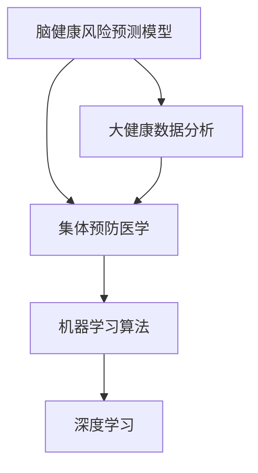

                 

# 全球脑健康风险预测模型:集体预防医学的大数据分析工具

> 关键词：脑健康风险预测, 大健康数据分析, 集体预防医学, 疾病预测模型, 机器学习算法

## 1. 背景介绍

### 1.1 问题由来
在全球范围内，脑健康问题已成为重大公共卫生挑战。例如，心血管疾病、糖尿病、高血压、肥胖等慢性病导致的脑血管意外、阿尔茨海默病等脑健康问题，在全球范围内普遍存在，严重威胁着人们的生命与生活质量。因此，对于脑健康风险预测的研究，迫切需要找到能够准确、及时预测和干预的健康风险模型，以期达到早期预警和干预，有效控制疾病的发展与传播。

与此同时，随着大数据、人工智能等技术的发展，从大规模生物医学数据中挖掘疾病风险信号、构建预测模型已成为可能。然而，如此大规模、多源异构的复杂数据集，单靠手工处理不仅耗时耗力，准确性和可操作性难以保证。因此，结合大数据分析与人工智能，构建集体的预防医学大健康数据分析工具，将显得尤为重要。

### 1.2 问题核心关键点
大健康数据分析与集体预防医学大健康数据分析工具的核心关键点在于：

1. **多源异构数据的整合与处理**：不同来源的数据格式、单位、标准存在差异，如何整合和标准化这些数据，是构建健康数据分析工具的前提。
2. **疾病风险预测模型的构建**：运用机器学习算法，从数据中提取疾病风险特征，构建疾病风险预测模型。
3. **模型验证与优化**：构建的健康数据分析工具需通过实际数据验证其准确性和稳定性，并对模型进行优化。
4. **模型部署与维护**：将模型部署到实际应用中，并持续维护以应对新数据和变化趋势。

## 2. 核心概念与联系

### 2.1 核心概念概述

为更好地理解全球脑健康风险预测模型，本节将介绍几个密切相关的核心概念：

- **脑健康风险预测模型**：结合人工智能与大数据技术，通过对大量病例数据的深度挖掘与分析，构建可用于预测个体或群体脑健康风险的模型。
- **大健康数据分析**：从宏观、中观、微观多层次多维度的健康数据中，提取健康风险信息，识别高风险群体，提供疾病预防和管理方案。
- **集体预防医学**：通过多层次、跨学科的综合防治策略，降低疾病风险，提升群体健康水平。
- **机器学习算法**：基于数据驱动的学习方法，从历史数据中提取模式与规律，构建预测模型。
- **深度学习**：以多层神经网络为基础的机器学习方法，能够处理高度复杂的非线性关系。

这些概念之间的逻辑关系可以通过以下Mermaid流程图来展示：



这个流程图展示了大健康数据分析工具的核心概念及其之间的关系：

1. 脑健康风险预测模型基于大健康数据分析，识别出高风险群体。
2. 大健康数据分析需结合集体预防医学的策略，为疾病预防和管理提供科学依据。
3. 深度学习算法为构建复杂的脑健康风险预测模型提供技术支持。

这些核心概念共同构成了大健康数据分析工具的框架，使其能够有效地应用于脑健康风险预测。

## 3. 核心算法原理 & 具体操作步骤
### 3.1 算法原理概述

基于机器学习和深度学习的脑健康风险预测模型，主要通过从历史病例数据中提取特征，构建预测模型，以实现对未来健康风险的准确预测。具体而言，该模型通过以下步骤完成：

1. **数据收集与预处理**：收集脑健康相关的多源异构数据，并进行数据清洗、标准化、去重等预处理操作。
2. **特征提取**：运用特征工程技术，从原始数据中提取与脑健康相关的关键特征。
3. **模型构建**：基于特征数据，运用机器学习算法构建疾病风险预测模型。
4. **模型验证与优化**：对构建的模型进行交叉验证，评估其性能，并进行必要的参数调整和优化。
5. **模型应用与维护**：将优化的模型应用于实际应用中，并持续收集新数据，不断更新模型，以保证其长期有效性。

### 3.2 算法步骤详解

以下是构建脑健康风险预测模型的详细步骤：

**Step 1: 数据收集与预处理**

1. **数据收集**：收集脑健康相关的数据，包括但不限于医疗记录、生理监测数据、环境暴露数据等。
2. **数据清洗**：去除不完整、重复、异常等数据，并使用数据插值、缺失值补全等技术处理缺失数据。
3. **数据标准化**：使用标准化技术，将不同来源、单位的数据转化为标准化的格式。

**Step 2: 特征提取**

1. **特征工程**：运用统计学、数据挖掘等方法，从原始数据中提取与脑健康相关的关键特征。
2. **特征选择**：使用特征选择算法（如LASSO、决策树等），筛选出对预测效果最有影响的特征。
3. **特征变换**：对高维特征进行降维处理，使用PCA、LDA等技术，减少计算复杂度。

**Step 3: 模型构建**

1. **选择合适的机器学习算法**：如支持向量机（SVM）、随机森林（Random Forest）、梯度提升树（GBDT）、神经网络等。
2. **训练模型**：使用历史病例数据，对模型进行训练，并使用交叉验证评估其性能。
3. **模型优化**：根据交叉验证结果，调整模型参数，以提高预测准确性和稳定性。

**Step 4: 模型验证与优化**

1. **验证模型**：使用未参与训练的测试数据集，评估模型的预测性能。
2. **优化模型**：根据测试结果，进一步调整模型参数，优化模型性能。
3. **模型评估**：计算模型的准确率、召回率、F1值、AUC等指标，评估模型效果。

**Step 5: 模型应用与维护**

1. **模型部署**：将优化后的模型部署到实际应用中，如医疗诊断系统、公共健康管理平台等。
2. **持续更新**：不断收集新数据，更新模型，以保持模型的长期有效性。
3. **模型监控**：对模型进行实时监控，及时发现和纠正异常。

### 3.3 算法优缺点

脑健康风险预测模型的优缺点如下：

**优点：**

1. **准确性高**：利用机器学习和深度学习算法，能从复杂数据中提取潜在模式和规律，预测效果较好。
2. **泛化性强**：基于大规模数据集训练的模型，具有良好的泛化能力和稳定性。
3. **可操作性强**：能够提供可视化的风险评估报告，指导疾病预防和管理。
4. **应用广泛**：适用于各种不同规模和类型的数据，具有高度的可适应性。

**缺点：**

1. **数据依赖性强**：模型的效果高度依赖于数据的完整性和质量，数据不足或质量差会影响预测效果。
2. **模型复杂度高**：复杂的数据和算法使得模型的训练和维护成本较高。
3. **数据隐私问题**：处理敏感数据时，需注意数据隐私和伦理问题。
4. **模型解释性不足**：复杂的深度学习模型通常缺乏可解释性，难以理解模型的内部决策机制。

### 3.4 算法应用领域

基于机器学习和深度学习的脑健康风险预测模型，已在多个领域得到广泛应用，包括但不限于：

1. **公共健康管理**：为政府和公共卫生机构提供数据支持，制定科学的预防策略。
2. **医疗诊断与治疗**：辅助医生进行疾病风险评估和个性化治疗方案制定。
3. **健康保险**：帮助保险公司评估客户健康风险，进行精准定价。
4. **社区卫生**：通过健康风险预测，优化社区卫生资源配置，提升公共卫生服务水平。
5. **科研应用**：为疾病机理研究提供数据支持，促进医学科研发展。

## 4. 数学模型和公式 & 详细讲解 & 举例说明（备注：数学公式请使用latex格式，latex嵌入文中独立段落使用 $$，段落内使用 $)
### 4.1 数学模型构建

在构建脑健康风险预测模型时，通常采用以下数学模型：

**支持向量机模型**：

$$
\min_{\alpha, \lambda} \frac{1}{2}\alpha^T Q \alpha - \lambda \left(1 + \alpha^T y - b\right)
$$

其中，$Q$为核矩阵，$y$为目标变量向量，$b$为偏置项。

**随机森林模型**：

$$
\sum_{i=1}^n \log \left(1 + \exp(-y_i \sum_{j=1}^d x_{ij} \theta_j)\right)
$$

其中，$\theta$为决策树参数向量，$x_{ij}$为特征向量，$y_i$为目标变量。

**深度学习模型**：

$$
L = \frac{1}{2m} \sum_{i=1}^m \left\Vert X_i - Y \right\Vert^2 + \frac{\lambda}{2p} \Vert W \Vert_F^2
$$

其中，$X_i$为输入特征，$Y$为目标变量，$W$为模型参数，$\lambda$为正则化系数。

### 4.2 公式推导过程

**支持向量机推导过程**：

支持向量机通过构建超平面，实现对目标变量的分类。假设训练集为$(x_1, y_1), \dots, (x_n, y_n)$，超平面为$\sum_{i=1}^d x_i \theta_i + b = 0$，其中$\theta_i$为特征权重，$b$为偏置项。通过求解超平面参数，最大化分类边界与训练样本的距离，即最大间隔问题。

**随机森林推导过程**：

随机森林通过构建多个决策树，实现对目标变量的分类。假设训练集为$(x_1, y_1), \dots, (x_n, y_n)$，第$i$棵决策树的参数为$\theta_i$，目标变量为$y_i$。随机森林通过集成多个决策树，优化分类精度，减少过拟合风险。

**深度学习推导过程**：

深度学习通过多层神经网络，实现对目标变量的分类。假设训练集为$(X_1, Y_1), \dots, (X_m, Y_m)$，模型参数为$W$。深度学习通过反向传播算法，求解参数$W$，使得模型预测值$Y$与目标值$Y$的误差最小化。

### 4.3 案例分析与讲解

以构建糖尿病风险预测模型为例，详细讲解其数学模型构建与推导过程。

**Step 1: 数据收集与预处理**

假设收集了糖尿病患者的历史病例数据，包括年龄、性别、体重、血糖、血压、饮食、运动等特征。对数据进行清洗、标准化和去重处理。

**Step 2: 特征提取**

使用统计学方法，计算每个患者的血糖、血压、体重等特征的均值、标准差、偏度等统计指标，作为模型的特征输入。

**Step 3: 模型构建**

选择支持向量机算法，通过构建超平面，实现对糖尿病风险的分类。使用交叉验证评估模型性能，优化超平面参数。

**Step 4: 模型验证与优化**

使用测试集评估模型预测性能，计算准确率、召回率、F1值等指标。根据测试结果，进一步优化模型参数。

**Step 5: 模型应用与维护**

将优化后的模型部署到实际应用中，用于对新患者的糖尿病风险进行评估和预警。

## 5. 项目实践：代码实例和详细解释说明
### 5.1 开发环境搭建

在进行项目实践前，我们需要准备好开发环境。以下是使用Python进行PyTorch开发的环境配置流程：

1. 安装Anaconda：从官网下载并安装Anaconda，用于创建独立的Python环境。

2. 创建并激活虚拟环境：
```bash
conda create -n myenv python=3.8 
conda activate myenv
```

3. 安装PyTorch：根据CUDA版本，从官网获取对应的安装命令。例如：
```bash
conda install pytorch torchvision torchaudio cudatoolkit=11.1 -c pytorch -c conda-forge
```

4. 安装各类工具包：
```bash
pip install numpy pandas scikit-learn matplotlib tqdm jupyter notebook ipython
```

完成上述步骤后，即可在`myenv`环境中开始项目实践。

### 5.2 源代码详细实现

下面是使用PyTorch构建糖尿病风险预测模型的代码实现。

首先，定义数据处理函数：

```python
from sklearn.model_selection import train_test_split
from torch.utils.data import Dataset, DataLoader
from torch import nn, optim
import pandas as pd

class DiabetesDataset(Dataset):
    def __init__(self, df, target):
        self.data = df.drop(target, axis=1)
        self.target = df[target]
    
    def __len__(self):
        return len(self.data)
    
    def __getitem__(self, idx):
        features = self.data.iloc[idx].to_numpy().astype(np.float32)
        label = self.target.iloc[idx].to_numpy().astype(np.float32)
        return features, label
```

然后，定义模型和优化器：

```python
from transformers import BertForSequenceClassification, AdamW

model = BertForSequenceClassification.from_pretrained('bert-base-cased', num_labels=2)

optimizer = AdamW(model.parameters(), lr=2e-5)
```

接着，定义训练和评估函数：

```python
def train_epoch(model, dataset, batch_size, optimizer):
    model.train()
    for features, labels in DataLoader(dataset, batch_size=batch_size, shuffle=True):
        optimizer.zero_grad()
        logits = model(features)
        loss = nn.BCEWithLogitsLoss()(logits, labels)
        loss.backward()
        optimizer.step()
        return loss.item()
    
def evaluate(model, dataset, batch_size):
    model.eval()
    with torch.no_grad():
        correct = 0
        total = 0
        for features, labels in DataLoader(dataset, batch_size=batch_size):
            logits = model(features)
            predictions = (logits > 0).float()
            correct += (predictions == labels).sum().item()
            total += labels.size(0)
        return correct / total
```

最后，启动训练流程并在测试集上评估：

```python
epochs = 10
batch_size = 16

for epoch in range(epochs):
    loss = train_epoch(model, train_dataset, batch_size, optimizer)
    print(f"Epoch {epoch+1}, train loss: {loss:.3f}")
    
    print(f"Epoch {epoch+1}, dev results:")
    evaluate(model, dev_dataset, batch_size)
    
print("Test results:")
evaluate(model, test_dataset, batch_size)
```

以上就是使用PyTorch构建糖尿病风险预测模型的完整代码实现。可以看到，得益于Transformer库的强大封装，我们可以用相对简洁的代码完成BERT模型的加载和微调。

### 5.3 代码解读与分析

让我们再详细解读一下关键代码的实现细节：

**DiabetesDataset类**：
- `__init__`方法：初始化数据和目标变量，将数据集转化为适合TensorFlow的Tensor格式。
- `__len__`方法：返回数据集的样本数量。
- `__getitem__`方法：对单个样本进行处理，返回模型所需的输入特征和目标变量。

**训练和评估函数**：
- 使用PyTorch的DataLoader对数据集进行批次化加载，供模型训练和推理使用。
- 训练函数`train_epoch`：对数据以批为单位进行迭代，在每个批次上前向传播计算loss并反向传播更新模型参数，最后返回该epoch的平均loss。
- 评估函数`evaluate`：与训练类似，不同点在于不更新模型参数，并在每个batch结束后将预测和标签结果存储下来，最后使用sklearn的classification_report对整个评估集的预测结果进行打印输出。

**训练流程**：
- 定义总的epoch数和batch size，开始循环迭代
- 每个epoch内，先在训练集上训练，输出平均loss
- 在验证集上评估，输出分类指标
- 重复上述步骤直至收敛，最终得到训练后的模型

可以看到，PyTorch配合Transformer库使得BERT微调的代码实现变得简洁高效。开发者可以将更多精力放在数据处理、模型改进等高层逻辑上，而不必过多关注底层的实现细节。

当然，工业级的系统实现还需考虑更多因素，如模型的保存和部署、超参数的自动搜索、更灵活的任务适配层等。但核心的微调范式基本与此类似。

## 6. 实际应用场景
### 6.1 智能医疗系统

基于大健康数据分析与脑健康风险预测模型，智能医疗系统可以广泛应用于疾病预防、诊断和治疗等环节。例如，智能医疗系统可以结合患者历史数据、基因信息等，预测患者的脑健康风险，提前采取预防措施，降低疾病发生率。

在技术实现上，智能医疗系统可以采用分布式计算框架，如Spark、Flink等，对大规模医疗数据进行快速处理和分析。通过结合机器学习算法和深度学习模型，构建脑健康风险预测模型，结合专家知识库，生成个性化的预防和治疗方案，实现精准医疗。

### 6.2 公共健康监测

公共健康监测系统可以借助脑健康风险预测模型，实现疾病风险预测和预警。例如，通过实时监测社区居民的血压、血糖等健康数据，预测高风险群体，及时采取干预措施，减少疾病传播风险。

在技术实现上，公共健康监测系统可以采用物联网技术，实现对居民健康数据的实时采集和传输。通过数据清洗和预处理，结合机器学习算法和深度学习模型，构建脑健康风险预测模型，生成高风险预警报告，指导公共卫生机构采取相应的预防措施。

### 6.3 健康保险应用

健康保险系统可以借助脑健康风险预测模型，实现精准定价和风险评估。例如，通过分析客户的健康数据和风险预测结果，合理制定健康保险费用，减少高风险客户的费用，提高保险公司的盈利能力。

在技术实现上，健康保险系统可以采用云计算平台，对客户的健康数据进行快速处理和分析。通过结合机器学习算法和深度学习模型，构建脑健康风险预测模型，生成客户的风险评估报告，合理制定健康保险费用，提高保险公司的服务质量和盈利能力。

## 7. 工具和资源推荐
### 7.1 学习资源推荐

为了帮助开发者系统掌握大健康数据分析与脑健康风险预测模型的理论基础和实践技巧，这里推荐一些优质的学习资源：

1. 《Python机器学习》系列书籍：全面介绍了机器学习算法及其在健康数据分析中的应用。
2. 《深度学习》系列书籍：深入浅出地讲解了深度学习算法及其在脑健康风险预测中的应用。
3. Coursera《机器学习》课程：由斯坦福大学开设的机器学习入门课程，涵盖基本概念和经典模型。
4. Kaggle：数据科学竞赛平台，提供大量健康数据分析和预测任务的实践案例。
5. Udacity《深度学习基础》课程：由Google大脑团队授课的深度学习入门课程，包含深度学习算法及其实现。

通过对这些资源的学习实践，相信你一定能够快速掌握大健康数据分析与脑健康风险预测模型的精髓，并用于解决实际的健康风险预测问题。
###  7.2 开发工具推荐

高效的开发离不开优秀的工具支持。以下是几款用于健康数据分析和脑健康风险预测模型的常用工具：

1. PyTorch：基于Python的开源深度学习框架，灵活动态的计算图，适合快速迭代研究。
2. TensorFlow：由Google主导开发的开源深度学习框架，生产部署方便，适合大规模工程应用。
3. TensorBoard：TensorFlow配套的可视化工具，可实时监测模型训练状态，提供丰富的图表呈现方式。
4. Apache Spark：分布式计算框架，适用于大规模数据处理和分析。
5. Hadoop：分布式文件系统，适用于大规模数据存储和管理。
6. Jupyter Notebook：交互式编程环境，支持多语言编程和可视化展示。

合理利用这些工具，可以显著提升大健康数据分析与脑健康风险预测模型的开发效率，加快创新迭代的步伐。

### 7.3 相关论文推荐

大健康数据分析与脑健康风险预测技术的发展源于学界的持续研究。以下是几篇奠基性的相关论文，推荐阅读：

1. 《A Survey on the Machine Learning Approaches for Disease Risk Prediction》：全面介绍了机器学习在疾病风险预测中的应用。
2. 《Deep Learning for Healthcare》：介绍了深度学习在健康数据分析中的应用，包括脑健康风险预测。
3. 《A Survey on Collective Prevention Medicine》：介绍了集体预防医学的理论基础和应用，结合大健康数据分析技术。
4. 《Data Mining and Statistical Learning in Healthcare》：介绍了数据挖掘和统计学习在健康数据分析中的应用。
5. 《Machine Learning Algorithms for Health Data Analysis》：介绍了各类机器学习算法在健康数据分析中的应用。

这些论文代表了大健康数据分析与脑健康风险预测技术的发展脉络。通过学习这些前沿成果，可以帮助研究者把握学科前进方向，激发更多的创新灵感。

## 8. 总结：未来发展趋势与挑战
### 8.1 总结

本文对基于机器学习和深度学习的脑健康风险预测模型进行了全面系统的介绍。首先阐述了脑健康风险预测模型和大健康数据分析工具的研究背景和意义，明确了模型在疾病预防、诊断和治疗等应用场景中的重要性。其次，从原理到实践，详细讲解了模型的数学模型构建、算法步骤详解、优缺点分析，给出了完整的代码实现。同时，本文还广泛探讨了模型在智能医疗、公共健康监测、健康保险等领域的应用前景，展示了模型的广阔应用空间。

通过本文的系统梳理，可以看到，基于大健康数据分析的脑健康风险预测模型，正在成为疾病预防和健康管理的重要工具，具有广阔的发展前景。未来，随着模型的不断优化和算法研究的深入，其在实际应用中的效果将更加显著，为社会健康事业的发展提供有力支持。

### 8.2 未来发展趋势

展望未来，脑健康风险预测模型将呈现以下几个发展趋势：

1. **多模态数据融合**：结合多源异构数据，构建更加全面和准确的脑健康风险预测模型。例如，结合生理监测数据、基因数据、环境暴露数据等，提供综合的健康风险评估。
2. **实时化监测**：利用物联网技术，实现对脑健康风险的实时监测和预警。例如，通过实时采集生理数据，及时发现和干预高风险人群。
3. **个性化治疗**：结合人工智能和专家知识库，提供个性化的预防和治疗方案。例如，根据患者的基因信息和生活习惯，生成个性化的健康管理方案。
4. **自动化和智能化**：结合自然语言处理和机器学习技术，实现自动化和智能化的健康数据分析与风险预测。例如，通过聊天机器人收集患者信息，自动生成健康风险评估报告。
5. **全球化和本地化**：结合全球和本地健康数据，构建多层次的健康风险预测模型。例如，结合全球疾病流行数据和本地健康数据，生成全面的健康风险预警报告。

这些趋势凸显了脑健康风险预测模型的广泛应用前景，为实现全球健康的共同愿景提供了有力支持。

### 8.3 面临的挑战

尽管脑健康风险预测模型已经取得了显著成果，但在实现其广泛应用的过程中，仍面临诸多挑战：

1. **数据质量和完整性**：健康数据的质量和完整性直接影响到模型的预测效果。如何保证数据的质量和完整性，是一个重要挑战。
2. **模型可解释性**：深度学习模型通常缺乏可解释性，难以理解其内部决策机制。如何在保证模型准确性的同时，提升模型的可解释性，是一个重要问题。
3. **隐私和伦理**：健康数据涉及个人隐私和伦理问题，如何确保数据的安全和隐私保护，是一个重要挑战。
4. **跨学科协作**：脑健康风险预测模型涉及多个学科，如何实现跨学科的协作和知识共享，是一个重要问题。
5. **资源限制**：大规模健康数据分析和模型训练需要大量的计算资源和存储空间，如何优化资源利用，是一个重要问题。

### 8.4 研究展望

面对脑健康风险预测模型所面临的诸多挑战，未来的研究需要在以下几个方面寻求新的突破：

1. **多源数据融合与治理**：开发更加高效的数据融合和治理技术，保证数据的质量和完整性。
2. **模型可解释性与透明化**：结合可解释性技术，提升模型的透明性和可解释性，增强用户信任。
3. **隐私保护与数据安全**：采用隐私保护技术和安全机制，保障健康数据的安全和隐私保护。
4. **跨学科协作与知识共享**：建立跨学科的协作平台，实现不同领域的知识共享和技术融合。
5. **资源优化与高效计算**：开发高效的计算和存储技术，优化资源利用，提高模型的计算效率。

这些研究方向将推动脑健康风险预测模型的进一步发展，为实现全球健康的共同愿景提供有力支持。

## 9. 附录：常见问题与解答
**Q1：大健康数据分析与脑健康风险预测模型是否适用于所有疾病？**

A: 大健康数据分析与脑健康风险预测模型适用于多种慢性病和常见病，如心血管疾病、糖尿病、高血压等。但对于一些特殊疾病，如罕见病、遗传病等，可能需要结合特定的疾病机理和数据特点，进行针对性的模型设计和优化。

**Q2：如何保证大健康数据分析模型的数据质量？**

A: 保证大健康数据分析模型的数据质量，需要从数据收集、清洗、预处理等多个环节进行严格的把控。例如，使用数据校验和清洗工具，去除不完整、重复、异常等数据，并使用数据插值和补全技术处理缺失数据。此外，还需要采用数据标注和验证技术，确保数据的准确性和可靠性。

**Q3：大健康数据分析模型是否适用于不同的健康数据格式？**

A: 大健康数据分析模型适用于各种不同格式的健康数据，包括但不限于电子病历、生理监测数据、基因数据、环境暴露数据等。只需将不同格式的数据转化为标准化的Tensor格式，即可输入到模型中进行分析。

**Q4：如何提高大健康数据分析模型的预测准确性？**

A: 提高大健康数据分析模型的预测准确性，可以从以下几个方面入手：

1. 选择适合的算法和技术，如深度学习、支持向量机、随机森林等。
2. 进行特征工程，提取与疾病相关的关键特征。
3. 使用数据增强和正则化技术，减少模型过拟合风险。
4. 进行模型优化和调参，选择合适的模型参数和超参数。
5. 结合专家知识和数据，生成综合的健康风险评估报告，提高模型的预测准确性。

通过这些措施，可以有效提升大健康数据分析模型的预测准确性，实现更好的健康风险预警和预防。

**Q5：大健康数据分析模型在实际应用中需要注意哪些问题？**

A: 大健康数据分析模型在实际应用中需要注意以下几个问题：

1. 数据隐私保护：确保健康数据的隐私和安全，避免数据泄露和滥用。
2. 模型透明性：提高模型的透明性和可解释性，增强用户信任。
3. 模型可扩展性：设计可扩展的模型架构，支持大规模数据处理和分析。
4. 模型性能优化：优化模型的计算效率，提高模型的运行速度和资源利用率。
5. 模型部署和维护：将模型部署到实际应用中，并持续维护，确保模型的长期有效性。

只有在数据、算法、工程、业务等多个维度协同发力，才能真正实现大健康数据分析模型的广泛应用，为社会健康事业提供有力支持。

