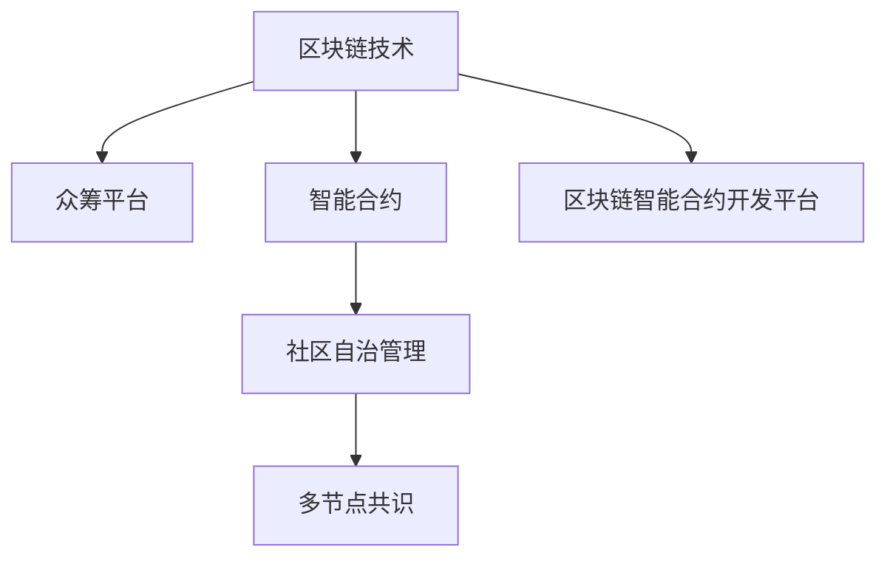

                 

# 全球脑创意众筹平台:集体创新项目的孵化温床

> 关键词：
1. 区块链技术
2. 众筹平台
3. 集体智慧
4. 区块链智能合约
5. 智能合约开发平台
6. 众筹项目监管
7. 社区自治机制

## 1. 背景介绍

在过去的几年中，区块链技术迅猛发展，极大地改变了传统行业的运营模式。去中心化、透明公开、不可篡改的特性使得区块链成为推动数字化变革的关键工具。其中，区块链众筹平台成为激发集体创新的一个重要平台。

### 1.1 问题由来
区块链众筹平台通过对项目资金进行智能合约化管理，可以极大提高项目的透明度和公平性。但传统的区块链众筹平台多采用中心化管理模式，存在项目融资门槛高、审核繁琐、资金使用不透明等问题。为了解决这些问题，社区自治的区块链智能合约平台应运而生。

### 1.2 问题核心关键点
社区自治的区块链众筹平台通过智能合约实现项目的全流程管理，极大提升了项目融资的效率和透明度。其核心要点包括：

1. **智能合约执行**：通过智能合约自动执行项目资金的分配和归还。
2. **社区自治管理**：采用去中心化的社区自治模式，确保项目的资金和信息公开透明。
3. **众筹项目监管**：通过社区共识机制，对项目进行实时监管和审计。
4. **多节点共识**：利用区块链的多节点共识机制，保证平台和社区成员的信任度。

本文将详细介绍如何利用智能合约开发平台构建全球脑创意众筹平台，并探讨其优势和应用前景。

## 2. 核心概念与联系

### 2.1 核心概念概述

为更好地理解全球脑创意众筹平台的设计原理，本节将介绍几个密切相关的核心概念：

- **区块链技术**：一种去中心化的分布式账本技术，能够保证数据的不可篡改和透明公开。
- **众筹平台**：通过互联网公开募集资金，用于支持项目开发和运营的平台。
- **智能合约**：一种运行在区块链上的代码，自动执行预设的合同条款，具有自动执行、不可篡改的特点。
- **社区自治管理**：利用区块链的多节点共识机制，让社区成员共同管理项目，确保项目的公开透明。
- **多节点共识**：区块链中通过多节点共同验证和确认交易，保证数据的真实性和可信度。

这些核心概念之间的逻辑关系可以通过以下Mermaid流程图来展示：



这个流程图展示了大脑创意众筹平台的核心概念及其之间的关系：

1. 众筹平台依托区块链技术，以智能合约为核心，实现项目的自动化和透明化管理。
2. 智能合约采用社区自治模式，通过多节点共识机制，确保资金和信息的公开透明。
3. 区块链智能合约开发平台是构建该众筹平台的关键工具，提供智能合约开发和部署的支持。

## 3. 核心算法原理 & 具体操作步骤
### 3.1 算法原理概述

全球脑创意众筹平台的核心原理是通过智能合约实现项目的全流程管理，利用区块链的多节点共识机制确保项目资金和信息的公开透明。

具体而言，该平台由以下几部分组成：

1. **智能合约开发平台**：提供智能合约的开发、部署和管理工具，支持多语言、多平台开发。
2. **智能合约执行引擎**：负责执行智能合约代码，自动处理项目的资金分配和归还。
3. **社区自治模块**：实现社区成员对项目的共同管理，确保项目的公开透明和公正公平。
4. **多节点共识模块**：利用多节点共识算法，确保所有交易和操作得到多方验证和确认。

### 3.2 算法步骤详解

以下详细介绍全球脑创意众筹平台的主要算法步骤：

**Step 1: 设计智能合约代码**

- 根据项目需求，设计智能合约代码，包括项目资金的募集、使用、分配和归还等操作。
- 使用智能合约开发平台进行代码编写和调试，确保合约的正确性和安全性。

**Step 2: 部署智能合约**

- 将智能合约代码部署到区块链上，自动生成合约地址和哈希值。
- 发布智能合约，社区成员可以查看和查询智能合约的代码和状态。

**Step 3: 资金募集和分配**

- 项目发起方通过智能合约自动发布募资信息，社区成员可以查看并参与募资。
- 募资完成后，智能合约自动分配募集资金到项目账户，并记录在区块链上。

**Step 4: 项目执行和管理**

- 项目团队使用智能合约进行项目资金的管理和分配。
- 社区成员可以对项目进度和资金使用情况进行实时查看和监督。

**Step 5: 资金归还和审计**

- 项目完成后，智能合约自动将项目剩余资金归还给投资者。
- 社区成员可以对项目审计和资金归还情况进行监督和确认。

**Step 6: 社区自治**

- 社区成员可以通过智能合约进行投票，决定项目的重要决策，如资金使用方案、审计结果等。
- 投票结果自动生效，确保项目的公开透明和社区共识。

### 3.3 算法优缺点

全球脑创意众筹平台采用智能合约和区块链技术，具有以下优点：

1. **自动执行**：智能合约具有自动执行的特点，无需人为干预，大大提升了项目资金管理的效率。
2. **透明度高**：所有操作和数据都在区块链上记录，确保了资金和信息的公开透明。
3. **公正公平**：采用社区自治和多方共识的机制，确保了项目的公正公平，减少了中心化管理的弊端。

但该平台也存在一定的缺点：

1. **开发复杂度**：智能合约的编写和调试需要一定的技术门槛，对开发者要求较高。
2. **智能合约漏洞**：智能合约代码可能存在漏洞，导致资金和信息安全风险。
3. **社区管理难度**：社区自治机制依赖于社区成员的参与和共识，难以保证高效运行。

### 3.4 算法应用领域

全球脑创意众筹平台可以在多个领域进行应用，例如：

- **科学研究项目**：如生物医学研究、天文学研究等，通过众筹平台筹集资金，进行科学研究。
- **艺术创作项目**：如电影制作、音乐创作等，通过众筹平台筹集资金，实现创意作品的创作和传播。
- **社会公益项目**：如环境保护、灾后重建等，通过众筹平台筹集资金，进行社会公益活动。
- **创业孵化项目**：如创业团队筹集启动资金，进行企业孵化和产品开发。

这些领域都可以通过全球脑创意众筹平台实现公开透明、高效公平的项目管理。

## 4. 数学模型和公式 & 详细讲解 & 举例说明

### 4.1 数学模型构建

全球脑创意众筹平台的核心算法主要涉及智能合约的编写和执行，其数学模型构建主要基于区块链技术中的智能合约执行机制。

假设智能合约的执行过程如下：

- 项目启动后，智能合约生成唯一合约地址和哈希值。
- 社区成员通过智能合约界面进行资金募集操作，将募集资金自动存入项目账户。
- 项目团队使用智能合约进行资金分配，资金分配结果自动记录在区块链上。
- 项目结束后，智能合约自动归还剩余资金，并记录在区块链上。

定义合约地址为 $C$，募集资金总额为 $F$，项目团队账户为 $A$，社区成员账户为 $B$，资金分配比例为 $r_i$，资金归还金额为 $R$。

智能合约的数学模型可以表示为：

$$
F_{total} = F_0 + \sum_{i=1}^n r_i F_i
$$

其中，$F_0$ 表示项目启动时的资金总额，$r_i$ 表示第 $i$ 个社区成员的资金分配比例，$F_i$ 表示第 $i$ 个社区成员分配到的资金，$n$ 表示社区成员总数。

### 4.2 公式推导过程

根据上述定义，智能合约的资金分配公式可以进一步推导如下：

1. **募集资金**：

$$
F_{total} = \sum_{i=1}^N f_i
$$

其中，$N$ 表示募资轮次，$f_i$ 表示第 $i$ 轮募资的金额。

2. **项目资金分配**：

$$
\sum_{i=1}^n r_i F_i = R
$$

其中，$R$ 表示项目结束后的剩余资金，$f_i$ 表示第 $i$ 轮募资的金额。

3. **资金归还**：

$$
R = F_{total} - \sum_{i=1}^n r_i F_i
$$

其中，$R$ 表示项目结束后的剩余资金，$r_i$ 表示第 $i$ 个社区成员的资金分配比例，$F_i$ 表示第 $i$ 个社区成员分配到的资金。

### 4.3 案例分析与讲解

以一个具体的艺术创作项目为例：

1. **项目启动**：艺术家通过智能合约发布募资信息，设置募资目标为 $F_{total} = 10,000$ 美元。
2. **募资过程**：社区成员共认购了 $n = 100$ 份份额，每份份额 $f_i = 100$ 美元，分配比例为 $r_i = 1/100$。
3. **项目执行**：艺术家使用智能合约进行项目资金管理，共使用 $R = 5,000$ 美元。
4. **项目结束**：项目完成后，智能合约自动归还剩余资金 $R = 5,000$ 美元。

通过以上计算，可以得出智能合约执行的过程和结果。

## 5. 项目实践：代码实例和详细解释说明
### 5.1 开发环境搭建

在进行智能合约开发实践前，我们需要准备好开发环境。以下是使用Solidity进行以太坊智能合约开发的开发环境配置流程：

1. 安装Node.js和npm：
```
sudo apt-get update
sudo apt-get install nodejs npm
```

2. 安装Truffle：
```
npm install -g truffle
```

3. 安装Solidity编译器：
```
npm install -g solc
```

4. 安装Metamask：浏览器插件，用于以太坊网络测试。

完成上述步骤后，即可在本地搭建智能合约开发环境。

### 5.2 源代码详细实现

以下是使用Solidity语言实现一个简单的全球脑创意众筹平台智能合约的示例代码：

```solidity
pragma solidity ^0.6.0;

contract GlobalBrainCrowdsale {
    
    address public owner;
    uint public totalFunds;
    uint public totalAmount;
    uint public remainingFunds;
    uint public remainingAmount;
    uint public cap;
    uint public totalInvestors;
    uint public totalShares;
    uint public currentIndex;
    
    struct Share {
        uint share;
        uint amount;
    }
    
    mapping(address => Share) public shares;
    
    event SharePurchased(address indexed buyer, uint amount, uint share);
    event FundsWithdrawn(address indexed buyer, uint amount);
    
    modifier onlyOwner {
        require(msg.sender == owner, "Only owner can call this function.");
        _;
    }
    
    constructor(uint cap) {
        owner = msg.sender;
        cap = cap;
        totalFunds = 0;
        totalAmount = 0;
        remainingFunds = cap;
        remainingAmount = cap;
        totalInvestors = 0;
        totalShares = 0;
        currentIndex = 0;
    }
    
    function depositFunds() public payable {
        uint amount = msg.value;
        require(amount > 0, "Must enter a value.");
        require(remainingFunds - amount >= 0, "Not enough funds to deposit.");
        totalFunds += amount;
        totalAmount += amount;
        remainingFunds -= amount;
        remainingAmount += amount;
        totalInvestors += 1;
        totalShares += amount;
        shares[msg.sender] = Share(cap, amount);
        emit SharePurchased(msg.sender, amount, cap);
    }
    
    function withdrawFunds(uint amount) public {
        require(amount > 0, "Must enter a value.");
        require(remainingFunds >= amount, "Not enough funds to withdraw.");
        totalFunds -= amount;
        totalAmount -= amount;
        remainingFunds += amount;
        remainingAmount += amount;
        emit FundsWithdrawn(msg.sender, amount);
    }
    
    function getShares() public view returns (uint shares) {
        return shares[msg.sender].share;
    }
    
    function getRemainingFunds() public view returns (uint remainingFunds) {
        return remainingFunds;
    }
    
    function getTotalFunds() public view returns (uint totalFunds) {
        return totalFunds;
    }
    
    function getTotalInvestors() public view returns (uint totalInvestors) {
        return totalInvestors;
    }
    
    function getTotalShares() public view returns (uint totalShares) {
        return totalShares;
    }
    
    function getRemainingAmount() public view returns (uint remainingAmount) {
        return remainingAmount;
    }
    
    function getCap() public view returns (uint cap) {
        return cap;
    }
    
    function updateCap(uint newCap) public onlyOwner {
        cap = newCap;
        remainingFunds = newCap;
        remainingAmount = newCap;
    }
}
```

### 5.3 代码解读与分析

让我们再详细解读一下关键代码的实现细节：

**GlobalBrainCrowdsale 合同**：
- 定义了多个变量，包括合约地址、募集资金总额、分配比例、剩余资金等。
- 定义了多个事件，用于记录关键操作。

**depositFunds 函数**：
- 接受社区成员的资金存款操作，记录总资金、总金额、剩余资金等。
- 生成份额信息并记录在映射中。
- 使用 SharePurchased 事件记录操作。

**withdrawFunds 函数**：
- 接受社区成员的资金提取操作，记录总资金、总金额、剩余资金等。
- 使用 FundsWithdrawn 事件记录操作。

**getShares 函数**：
- 提供给社区成员查询自己的份额。

**getRemainingFunds 函数**：
- 提供给社区成员查询剩余资金。

**getTotalFunds 函数**：
- 提供给社区成员查询总资金。

**getTotalInvestors 函数**：
- 提供给社区成员查询投资人数。

**getTotalShares 函数**：
- 提供给社区成员查询总份额。

**getRemainingAmount 函数**：
- 提供给社区成员查询剩余金额。

**getCap 函数**：
- 提供给合约所有者查询资金上限。

**updateCap 函数**：
- 提供给合约所有者修改资金上限。

这些函数实现了项目的资金募集、分配、提取和管理等功能，是智能合约开发的关键部分。

## 6. 实际应用场景
### 6.1 智能合约开发平台

智能合约开发平台是实现全球脑创意众筹平台的重要工具，需要支持多语言、多平台开发。

**Step 1: 平台选择**

- 选择适合的平台，如Truffle、Remix等，进行智能合约开发。

**Step 2: 智能合约编写**

- 根据项目需求，使用Solidity等语言编写智能合约代码。
- 进行测试，确保合约的正确性和安全性。

**Step 3: 合约部署**

- 使用平台提供的工具，将智能合约部署到以太坊主网。

**Step 4: 智能合约管理**

- 在平台中进行合约的调用、管理、升级等操作。

### 6.2 智能合约执行引擎

智能合约执行引擎负责执行智能合约代码，自动处理项目的资金分配和归还。

**Step 1: 合约部署**

- 将智能合约部署到以太坊主网，生成合约地址和哈希值。

**Step 2: 合约调用**

- 社区成员通过合约接口进行资金募集、提取等操作。

**Step 3: 自动执行**

- 合约自动执行资金分配、归还等操作，并记录在区块链上。

**Step 4: 数据查询**

- 社区成员查询项目的资金情况和操作记录。

### 6.3 社区自治模块

社区自治模块实现社区成员对项目的共同管理，确保项目的公开透明和公正公平。

**Step 1: 社区成员加入**

- 社区成员通过合约界面进行注册，成为项目的共同管理者。

**Step 2: 社区投票**

- 社区成员对项目的重要决策进行投票，确保决策的公正公平。

**Step 3: 投票结果生效**

- 投票结果自动生效，确保项目的透明公开。

## 7. 工具和资源推荐
### 7.1 学习资源推荐

为了帮助开发者系统掌握全球脑创意众筹平台的设计原理和实践技巧，这里推荐一些优质的学习资源：

1. **《以太坊智能合约开发指南》**：详细介绍了Solidity语言的基础知识和智能合约的开发流程，适合初学者入门。
2. **《以太坊区块链技术与应用》**：深入讲解了以太坊的区块链技术和智能合约的实际应用，适合进阶学习。
3. **《Solidity官方文档》**：Solidity语言的官方文档，提供了详尽的语言规范和开发教程。
4. **《Truffle官方文档》**：Truffle开发平台的官方文档，提供了平台的使用和智能合约开发指南。
5. **《Remix官方文档》**：Remix开发平台的官方文档，提供了智能合约的编写和测试工具。

通过对这些资源的学习实践，相信你一定能够快速掌握全球脑创意众筹平台的设计思路和开发技巧。

### 7.2 开发工具推荐

高效的开发离不开优秀的工具支持。以下是几款用于全球脑创意众筹平台开发的常用工具：

1. **Solidity 语言**：以太坊智能合约的编写语言，支持多平台开发。
2. **Truffle 平台**：以太坊智能合约的开发、测试和部署平台，提供丰富的工具和资源。
3. **Remix IDE**：以太坊智能合约的开发和测试工具，支持代码编写、编译、部署等操作。
4. **Metamask 浏览器插件**：以太坊网络测试工具，方便开发者进行本地测试和部署。
5. **Ganache 本地测试网络**：以太坊本地测试网络，用于测试智能合约的功能和性能。

合理利用这些工具，可以显著提升全球脑创意众筹平台的开发效率，加快创新迭代的步伐。

### 7.3 相关论文推荐

全球脑创意众筹平台的设计原理和应用前景涉及多个前沿技术领域，以下是几篇奠基性的相关论文，推荐阅读：

1. **《区块链技术原理与实践》**：详细讲解了区块链技术的原理和应用，适合入门学习。
2. **《智能合约设计与安全》**：介绍了智能合约的设计思路和安全机制，适合进阶学习。
3. **《全球脑创意众筹平台设计》**：详细阐述了全球脑创意众筹平台的设计思路和应用场景，适合应用实践。
4. **《区块链众筹平台安全性研究》**：研究了区块链众筹平台的安全性问题，适合风险控制。

这些论文代表了大脑创意众筹平台的研究发展脉络，通过学习这些前沿成果，可以帮助研究者把握学科前进方向，激发更多的创新灵感。

## 8. 总结：未来发展趋势与挑战
### 8.1 总结

本文对全球脑创意众筹平台的设计原理和实践技巧进行了全面系统的介绍。首先阐述了全球脑创意众筹平台的背景和意义，明确了智能合约在项目资金管理中的应用价值。其次，从原理到实践，详细讲解了智能合约的编写、部署、执行和社区自治等关键步骤，给出了智能合约开发的全流程示例。同时，本文还探讨了智能合约开发平台和执行引擎等工具在平台构建中的作用，展示了智能合约开发平台的优势和应用前景。

通过本文的系统梳理，可以看到，全球脑创意众筹平台通过智能合约和区块链技术，实现项目的自动执行、公开透明、社区自治等功能，极大提升了项目的融资效率和管理水平。未来，伴随区块链技术的发展和智能合约的优化，全球脑创意众筹平台必将在更多行业领域得到应用，为集体创新项目提供更加高效、透明、公正的管理工具。

### 8.2 未来发展趋势

展望未来，全球脑创意众筹平台的发展趋势如下：

1. **去中心化程度提高**：随着区块链技术的成熟，全球脑创意众筹平台将进一步去中心化，减少中心化管理带来的弊端。
2. **智能合约优化升级**：智能合约的开发和部署将更加高效、安全，具备更高的可扩展性和灵活性。
3. **多币种支持**：支持多种加密货币，提高项目的募资灵活性和适用性。
4. **社区自治机制完善**：完善社区自治机制，增强社区成员的参与度和共识度。
5. **平台功能拓展**：拓展平台的功能，如项目审计、监管报告等，增强项目的监管能力。

以上趋势凸显了全球脑创意众筹平台的应用前景和潜力，这些方向的探索发展，必将进一步提升项目的融资效率和管理水平，为集体创新项目提供更加高效、透明、公正的管理工具。

### 8.3 面临的挑战

尽管全球脑创意众筹平台在融资效率和管理水平上有显著优势，但仍面临诸多挑战：

1. **智能合约安全问题**：智能合约代码可能存在漏洞，导致资金和信息安全风险。
2. **社区管理难度**：社区自治机制依赖于社区成员的参与和共识，难以保证高效运行。
3. **技术门槛较高**：智能合约的开发和调试需要一定的技术门槛，对开发者要求较高。
4. **平台扩展性不足**：现有平台的功能和应用场景有限，难以满足更多复杂的需求。

### 8.4 研究展望

面对全球脑创意众筹平台所面临的挑战，未来的研究需要在以下几个方面寻求新的突破：

1. **智能合约安全性提升**：开发更加安全、可靠的智能合约，提高系统的鲁棒性和安全性。
2. **社区自治机制优化**：优化社区自治机制，提高社区成员的参与度和共识度，减少管理难度。
3. **开发工具升级**：提升智能合约开发工具的易用性和高效性，降低技术门槛。
4. **平台功能拓展**：拓展平台的功能，增强项目的监管能力，提高平台的扩展性和灵活性。

这些研究方向的探索，必将引领全球脑创意众筹平台迈向更加智能化、普适化的应用场景，为集体创新项目提供更加高效、透明、公正的管理工具。面向未来，全球脑创意众筹平台需要与其他区块链技术和人工智能技术进行更深入的融合，共同推动集体创新项目的成长和进步。

## 9. 附录：常见问题与解答

**Q1：全球脑创意众筹平台如何使用？**

A: 全球脑创意众筹平台主要通过智能合约实现项目的自动执行和社区自治，具体使用步骤如下：

1. 社区成员通过智能合约界面进行资金募集操作，将募集资金自动存入项目账户。
2. 项目团队使用智能合约进行项目资金的管理和分配。
3. 社区成员可以对项目进度和资金使用情况进行实时查看和监督。
4. 项目完成后，智能合约自动归还剩余资金，并记录在区块链上。

**Q2：智能合约开发平台有哪些功能？**

A: 智能合约开发平台主要具备以下功能：

1. 智能合约编写和调试工具，支持多语言、多平台开发。
2. 智能合约部署工具，将合约部署到以太坊主网。
3. 智能合约管理工具，支持合约的调用、管理、升级等操作。

**Q3：智能合约执行引擎如何实现自动执行？**

A: 智能合约执行引擎通过以太坊的智能合约机制实现自动执行，具体过程如下：

1. 社区成员通过合约界面进行资金募集、提取等操作。
2. 智能合约自动执行资金分配、归还等操作，并记录在区块链上。
3. 社区成员查询项目的资金情况和操作记录。

**Q4：智能合约安全性如何保障？**

A: 智能合约安全性可以通过以下措施保障：

1. 使用安全审计工具对合约进行审计，发现潜在漏洞。
2. 使用多重签名机制，提高合约的安全性。
3. 使用智能合约管理平台，定期升级合约代码。

**Q5：社区自治机制如何实现？**

A: 社区自治机制通过智能合约实现，具体过程如下：

1. 社区成员通过合约界面进行注册，成为项目的共同管理者。
2. 社区成员对项目的重要决策进行投票，确保决策的公正公平。
3. 投票结果自动生效，确保项目的透明公开。

这些关键问题的解答，有助于理解全球脑创意众筹平台的设计思路和实际应用。

---

作者：禅与计算机程序设计艺术 / Zen and the Art of Computer Programming

