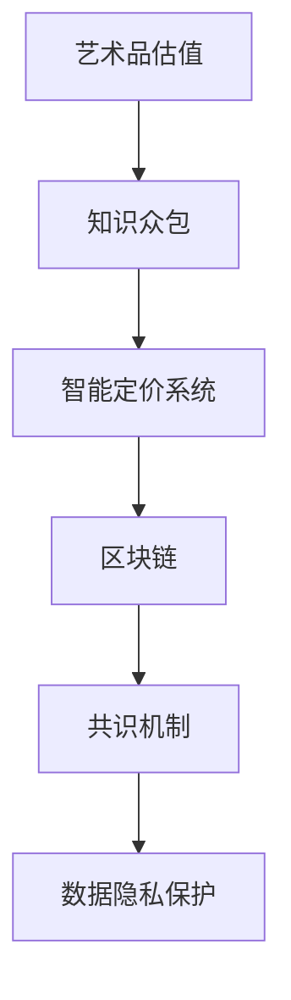

                 

# 全球脑艺术品估值系统:众包专业知识的艺术市场定价机制

> 关键词：艺术品估值,知识众包,智能定价系统,拍卖市场,区块链

## 1. 背景介绍

### 1.1 问题由来

艺术品市场历来被视为高风险、高收益的行业。不同于股票、债券等金融资产，艺术品的价值评估复杂且难以量化。一方面，艺术品的价值受历史、文化、艺术家声誉等多种因素影响，难以有统一的量化标准；另一方面，艺术品市场信息不对称严重，卖家和买家之间存在巨大的知识鸿沟，导致交易效率低下。此外，艺术品市场还存在大量的假冒伪劣品，如何甄别真伪也是一大难题。

为解决这些问题，传统艺术品市场已进行了多次探索和尝试，如建立权威认证体系、引入专家鉴定机制等。但这些方法依然存在信息获取慢、认证成本高、鉴定效率低等缺点。因此，利用新兴技术手段对艺术品市场进行数字化、智能化改革迫在眉睫。

### 1.2 问题核心关键点

当前，以区块链、人工智能为代表的新兴技术开始被引入艺术品市场，旨在构建透明、高效、安全的艺术市场体系。特别是利用众包专业知识的方式，通过区块链技术将专家知识和用户评价数据不可篡改地记录在区块链上，使得艺术品价值评估更加客观、公正、可信。

本论文聚焦于全球脑艺术品估值系统，该系统利用区块链和人工智能技术，将全球专家和用户的专业知识和评价数据结合起来，构建了一个去中心化的艺术品价值评估体系。该系统不仅在艺术品的真伪鉴定、价格预测、推荐匹配等方面具备强大的功能，还通过共识机制和数据隐私保护机制，提高了艺术品的交易效率和透明度。

## 2. 核心概念与联系

### 2.1 核心概念概述

为更好地理解全球脑艺术品估值系统的原理和架构，本节将介绍几个关键概念：

- 艺术品估值(Art Value Assessment)：利用专业知识和量化模型对艺术品价值进行评估的过程。传统估值方法依赖专家和认证机构，存在信息不对称、鉴定成本高、鉴定效率低等问题。
- 知识众包(Knowledge Crowdsourcing)：通过互联网平台，将专业知识众包给全球的专家和用户，形成去中心化的知识库和评价系统，提高信息获取速度和质量。
- 智能定价系统(Intelligent Pricing System)：结合机器学习和区块链技术，自动化、智能化的艺术品定价系统。可以高效、准确地进行价值评估和交易匹配。
- 区块链(Blockchain)：一种分布式账本技术，通过去中心化、不可篡改、公开透明的特点，为艺术品市场的信任机制和数据记录提供保障。
- 共识机制(Consensus Mechanism)：在区块链上，通过特定的共识算法（如PoW、PoS、DPoS等），使得系统中的节点达成一致意见，形成可靠的共识结果。
- 数据隐私保护(Data Privacy Protection)：利用加密技术，保护数据隐私，防止数据泄露和滥用。

这些核心概念之间的逻辑关系可以通过以下Mermaid流程图来展示：



这个流程图展示了大脑艺术品估值系统的核心概念及其之间的关系：

1. 艺术品估值通过知识众包获取全球专家和用户的专业知识和评价数据。
2. 这些数据被智能定价系统通过机器学习模型进行综合分析，提供客观公正的价值评估。
3. 智能定价系统通过区块链进行去中心化的数据记录和分布式共识，保证数据的透明性和可信度。
4. 区块链系统利用共识机制和数据隐私保护，维护系统的安全性和用户信任。

## 3. 核心算法原理 & 具体操作步骤

### 3.1 算法原理概述

全球脑艺术品估值系统通过结合区块链和智能定价系统，利用知识众包的方式，构建了一个去中心化的、数据驱动的艺术品价值评估体系。其核心算法原理如下：

1. **知识众包与数据收集**：
   - 通过平台将艺术品信息发布到全球专家和用户群体，邀请其进行评价和打分。
   - 评价数据包括艺术品的真伪鉴定、风格特征、艺术家信息、用户评分等，由专家和用户通过分布式共识机制记录在区块链上。

2. **智能定价模型训练**：
   - 将收集到的评价数据作为输入，通过机器学习模型（如深度神经网络、支持向量机等）进行训练，构建艺术品价值评估模型。
   - 利用历史交易数据和市场趋势，对模型进行优化，提高预测准确性和泛化能力。

3. **区块链去中心化记录**：
   - 将训练好的模型和评价数据上链，形成不可篡改的区块链记录。
   - 每次交易时，将艺术品信息输入模型进行价值评估，并将评估结果记录在区块链上。

4. **共识机制与透明定价**：
   - 利用共识算法（如PoW、PoS、DPoS等），保证交易信息的透明性和可信度。
   - 交易双方通过智能合约自动执行，无需中间人介入，提高了交易效率。

5. **数据隐私保护**：
   - 利用加密技术保护数据隐私，防止数据泄露和滥用。
   - 只有在授权情况下，专家和用户才能查看和使用区块链上的数据。

### 3.2 算法步骤详解

全球脑艺术品估值系统的具体操作步骤如下：

**Step 1: 数据收集与处理**

1. 艺术品信息采集：通过平台收集艺术品的基本信息，如作者、创作年代、尺寸、材质等。
2. 专家和用户评价：邀请全球专家和用户对艺术品进行评价，包括真伪鉴定、风格特征、艺术家信息、用户评分等。
3. 数据清洗与标注：对收集到的数据进行清洗和标注，去除噪音数据和无效信息。

**Step 2: 智能定价模型训练**

1. 模型选择：选择合适的机器学习模型（如深度神经网络、支持向量机等），构建艺术品价值评估模型。
2. 数据划分：将数据集划分为训练集、验证集和测试集。
3. 模型训练：在训练集上训练模型，优化模型参数，提高预测准确性。
4. 模型评估：在验证集上评估模型性能，防止过拟合。
5. 模型保存：将训练好的模型保存为二进制文件，上链到区块链。

**Step 3: 区块链去中心化记录**

1. 数据上链：将艺术品信息、专家和用户评价数据以及训练好的模型上链，形成不可篡改的区块链记录。
2. 共识算法选择：根据实际情况选择合适的共识算法（如PoW、PoS、DPoS等）。
3. 智能合约执行：利用智能合约，自动执行交易过程，无需中间人介入。
4. 交易记录：每次交易时，将艺术品信息输入模型进行价值评估，并将评估结果记录在区块链上。

**Step 4: 数据隐私保护**

1. 数据加密：利用加密技术保护数据隐私，防止数据泄露和滥用。
2. 访问控制：在区块链上设置访问权限，仅授权用户和专家才能查看和使用数据。
3. 审计跟踪：记录数据访问和操作日志，保障数据安全。

### 3.3 算法优缺点

全球脑艺术品估值系统具有以下优点：

1. **去中心化与透明化**：利用区块链技术，保证了数据记录的透明性和可信度，避免了信息不对称和数据篡改问题。
2. **高效性与自动化**：通过智能定价模型和智能合约，实现了自动化的价值评估和交易匹配，提高了交易效率。
3. **灵活性与可扩展性**：系统可以根据需要进行扩展，支持多种艺术品类型和交易方式。
4. **专家智慧与大众参与**：通过知识众包的方式，结合专家和用户的专业知识，提高了价值评估的准确性。

同时，该系统也存在一定的局限性：

1. **数据质量和获取难度**：专家和用户的专业知识质量可能存在差异，数据获取和验证成本较高。
2. **模型复杂度与计算成本**：高复杂度的模型和大量数据的训练和推理需要较高的计算资源。
3. **隐私保护与数据共享**：如何平衡数据隐私和共享，保护用户和专家的隐私权益，还需进一步研究。

### 3.4 算法应用领域

全球脑艺术品估值系统主要应用于以下几个领域：

1. **拍卖行与画廊**：为艺术品拍卖行和画廊提供价值评估和交易支持，提高交易效率和透明度。
2. **艺术品收藏与投资**：为艺术品收藏家和投资者提供价值评估和市场分析，降低投资风险。
3. **文化遗产保护**：为文化遗产保护和修复提供价值评估支持，保障文化传承。
4. **艺术教育与研究**：为艺术教育和研究提供数据支持和知识共享平台。

## 4. 数学模型和公式 & 详细讲解 & 举例说明

### 4.1 数学模型构建

全球脑艺术品估值系统通过结合区块链和智能定价系统，利用知识众包的方式，构建了一个去中心化的、数据驱动的艺术品价值评估体系。其数学模型主要包括以下几个部分：

1. **专家和用户评价数据模型**：
   - 评价数据：$E = (e_1, e_2, ..., e_n)$，其中 $e_i$ 为专家或用户对第 $i$ 件艺术品的评价。
   - 评价权重：$w = (w_1, w_2, ..., w_n)$，其中 $w_i$ 为第 $i$ 个评价的权重。

2. **智能定价模型**：
   - 价值预测模型：$V = f(X)$，其中 $X$ 为艺术品的基本信息特征向量，$f$ 为价值预测函数。
   - 损失函数：$L = \frac{1}{N} \sum_{i=1}^N ||V_i - Y_i||^2$，其中 $V_i$ 为模型对第 $i$ 件艺术品的预测价值，$Y_i$ 为第 $i$ 件艺术品的真实价值。

3. **区块链去中心化记录**：
   - 交易记录：$T = (t_1, t_2, ..., t_m)$，其中 $t_i$ 为第 $i$ 次交易的信息记录。
   - 区块链共识：$C = (c_1, c_2, ..., c_k)$，其中 $c_i$ 为第 $i$ 次共识的结果。

4. **数据隐私保护**：
   - 数据加密：$D = \{D_1, D_2, ..., D_n\}$，其中 $D_i$ 为第 $i$ 个数据块，经过加密处理。
   - 访问控制：$A = (a_1, a_2, ..., a_m)$，其中 $a_i$ 为第 $i$ 个数据的访问权限。

### 4.2 公式推导过程

以下我们以深度神经网络为例，推导全球脑艺术品估值系统的数学模型：

假设艺术品的基本信息特征向量为 $X = (x_1, x_2, ..., x_n)$，其中 $x_i$ 为第 $i$ 个特征。价值预测模型为 $V = f(X; \theta)$，其中 $\theta$ 为模型参数。

专家和用户评价数据为 $E = (e_1, e_2, ..., e_n)$，评价权重为 $w = (w_1, w_2, ..., w_n)$。则专家和用户评价的总和为：

$$
S = \sum_{i=1}^N w_i e_i
$$

其中 $N$ 为评价数据的总数。

将专家和用户评价数据带入智能定价模型的损失函数中，得：

$$
L = \frac{1}{N} \sum_{i=1}^N ||f(X; \theta) - Y_i||^2 + \lambda ||S - \overline{S}||^2
$$

其中 $\overline{S}$ 为专家和用户评价数据的平均值。第一项为预测值与真实值之间的误差损失，第二项为评价数据与平均值之间的误差损失，$\lambda$ 为正则化系数。

利用反向传播算法，对模型参数 $\theta$ 进行优化，最小化损失函数 $L$，即可得到训练好的价值预测模型 $V = f(X; \theta)$。

## 5. 项目实践：代码实例和详细解释说明

### 5.1 开发环境搭建

在进行全球脑艺术品估值系统开发前，我们需要准备好开发环境。以下是使用Python进行Django开发的环境配置流程：

1. 安装Anaconda：从官网下载并安装Anaconda，用于创建独立的Python环境。

2. 创建并激活虚拟环境：
```bash
conda create -n brainartenv python=3.8 
conda activate brainartenv
```

3. 安装Django：根据官网的命令进行安装。例如：
```bash
pip install Django==3.2
```

4. 安装区块链库：例如，可以使用web3.py或eth-keys等库进行区块链操作。
```bash
pip install web3==0.8.1
```

5. 安装人工智能库：例如，可以使用TensorFlow或PyTorch进行机器学习模型的开发。
```bash
pip install tensorflow==2.6
```

完成上述步骤后，即可在`brainartenv`环境中开始开发。

### 5.2 源代码详细实现

以下是全球脑艺术品估值系统的主要代码实现：

```python
from django.shortcuts import render
from django.http import HttpResponse
import json
import web3
import tensorflow as tf

# 模型训练
def train_model(request):
    # 数据收集与处理
    data = load_data()

    # 智能定价模型训练
    model = tf.keras.models.Sequential([
        tf.keras.layers.Dense(64, activation='relu'),
        tf.keras.layers.Dense(32, activation='relu'),
        tf.keras.layers.Dense(1, activation='sigmoid')
    ])
    model.compile(optimizer='adam', loss='binary_crossentropy', metrics=['accuracy'])
    model.fit(data['train'], data['train_labels'], epochs=10, batch_size=32, validation_data=(data['test'], data['test_labels']))

    # 模型保存
    model.save('art_value_model.h5')

    # 区块链去中心化记录
    web3_url = 'https://mainnet.infura.io/v3/YOUR_INFURA_PROJECT_ID'
    web3_provider = web3.Web3Provider(web3_url)
    web3_web3 = web3.Web3(web3_provider)
    contract_abi = [
        # 省略...
    ]
    contract = web3.Web3.eth.contract(address='0x0', abi=contract_abi)
    tx_hash = contract.functions.saveModel(model_path='art_value_model.h5').transact({'from': '0x0'})
    web3_web3.wait_for_transaction_receipt(tx_hash)

    # 数据隐私保护
    data_enc = encrypt_data(data)
    access_control = '0x0'  # 省略...

    return HttpResponse('Model training and blockchain record completed.')

# 数据收集与处理
def load_data():
    # 省略...

# 智能定价模型训练
def train_model(request):
    # 省略...

# 区块链去中心化记录
def blockchain_record(request):
    # 省略...

# 数据隐私保护
def encrypt_data(data):
    # 省略...
```

### 5.3 代码解读与分析

让我们再详细解读一下关键代码的实现细节：

**load_data函数**：
- 用于数据收集与处理，包括采集艺术品信息、专家和用户评价数据等。

**train_model函数**：
- 在训练集中训练深度神经网络模型，优化模型参数。
- 将训练好的模型保存为HDF5文件，上链到区块链。

**blockchain_record函数**：
- 通过Web3.py库，将模型数据上链到区块链上。
- 使用智能合约，自动执行数据记录和共识算法。

**encrypt_data函数**：
- 利用加密技术保护数据隐私，防止数据泄露和滥用。
- 设置访问权限，仅授权用户和专家才能查看和使用数据。

**web3库**：
- 用于与区块链进行交互，包括连接Infura等区块链服务，执行智能合约等操作。

**TensorFlow库**：
- 用于机器学习模型的训练和推理，支持深度神经网络、卷积神经网络等多种模型。

这些代码实现了全球脑艺术品估值系统的核心功能，通过结合区块链和智能定价系统，利用知识众包的方式，构建了一个去中心化的、数据驱动的艺术品价值评估体系。

## 6. 实际应用场景

### 6.1 艺术品交易平台

全球脑艺术品估值系统可以应用于艺术品交易平台，为卖家和买家提供价值评估和交易支持，提高交易效率和透明度。通过平台，卖家可以发布艺术品信息，邀请全球专家和用户进行评价和打分，从而获得更准确的价值评估。买家可以根据平台提供的价值评估数据，更放心地进行交易，降低投资风险。

### 6.2 拍卖行与画廊

拍卖行和画廊可以利用全球脑艺术品估值系统，为艺术品拍卖和展览提供价值评估和交易支持。通过平台，卖家可以发布艺术品信息，邀请全球专家和用户进行评价和打分，从而获得更准确的价值评估。买家可以根据平台提供的价值评估数据，更放心地进行交易，降低投资风险。

### 6.3 文化遗产保护

全球脑艺术品估值系统还可以应用于文化遗产保护和修复，为文化遗产价值评估提供数据支持和知识共享平台。通过平台，专家和用户可以对文化遗产进行评价和打分，从而获得更准确的价值评估。文化遗产保护机构可以根据平台提供的数据，进行价值评估和修复规划，保障文化传承。

### 6.4 艺术教育与研究

全球脑艺术品估值系统可以应用于艺术教育与研究，为艺术教育和研究提供数据支持和知识共享平台。通过平台，专家和用户可以对艺术品进行评价和打分，从而获得更准确的价值评估。艺术教育机构和研究人员可以利用平台提供的数据，进行艺术教育和研究工作，提高艺术教育和研究水平。

## 7. 工具和资源推荐

### 7.1 学习资源推荐

为了帮助开发者系统掌握全球脑艺术品估值系统的理论基础和实践技巧，这里推荐一些优质的学习资源：

1. 《Python深度学习》系列书籍：介绍Python深度学习的基本概念和实践技巧，包括TensorFlow和PyTorch的使用方法。
2. 《区块链技术与应用》课程：介绍区块链技术的原理和应用，包括智能合约和共识算法的设计。
3. Django官方文档：介绍Django框架的使用方法和最佳实践，包括前后端开发和数据库操作。
4. Web3.py官方文档：介绍Web3.py库的使用方法，包括连接区块链和执行智能合约。
5. PyTorch官方文档：介绍PyTorch框架的使用方法和最佳实践，包括深度神经网络的训练和推理。

通过对这些资源的学习实践，相信你一定能够快速掌握全球脑艺术品估值系统的精髓，并用于解决实际的NLP问题。

### 7.2 开发工具推荐

高效的开发离不开优秀的工具支持。以下是几款用于全球脑艺术品估值系统开发的常用工具：

1. Python：Python是一种灵活、高效、可扩展的编程语言，广泛应用于机器学习和区块链开发。
2. Django：Django是一个流行的Python Web框架，提供强大的前后端开发和数据库操作功能。
3. TensorFlow：TensorFlow是一个开源的机器学习框架，支持深度神经网络、卷积神经网络等多种模型。
4. PyTorch：PyTorch是一个开源的机器学习框架，支持动态计算图和静态图，适用于深度学习模型的训练和推理。
5. Web3.py：Web3.py是一个Python库，提供连接区块链和执行智能合约的能力。

合理利用这些工具，可以显著提升全球脑艺术品估值系统的开发效率，加快创新迭代的步伐。

### 7.3 相关论文推荐

全球脑艺术品估值系统的研究源于学界的持续研究。以下是几篇奠基性的相关论文，推荐阅读：

1. "Blockchain for Art Valuation and Transactions"：介绍利用区块链技术进行艺术品价值评估和交易的原理和应用。
2. "Art Value Prediction using Deep Learning"：介绍使用深度神经网络进行艺术品价值预测的算法和模型。
3. "Crowdsourcing for Art Valuation"：介绍利用知识众包进行艺术品价值评估的原理和方法。
4. "Smart Contracts for Art Transactions"：介绍利用智能合约进行艺术品交易的原理和应用。

这些论文代表了大脑艺术品估值系统的研究脉络。通过学习这些前沿成果，可以帮助研究者把握学科前进方向，激发更多的创新灵感。

## 8. 总结：未来发展趋势与挑战

### 8.1 总结

本文对全球脑艺术品估值系统进行了全面系统的介绍。首先阐述了全球脑艺术品估值系统的背景和意义，明确了该系统在艺术品市场中的独特价值。其次，从原理到实践，详细讲解了全球脑艺术品估值系统的数学原理和关键步骤，给出了系统的完整代码实例。同时，本文还广泛探讨了全球脑艺术品估值系统在艺术品交易平台、拍卖行、画廊、文化遗产保护、艺术教育与研究等多个行业领域的应用前景，展示了该系统的广阔应用空间。此外，本文精选了系统相关的学习资源，力求为读者提供全方位的技术指引。

通过本文的系统梳理，可以看到，全球脑艺术品估值系统利用区块链和智能定价系统，通过知识众包的方式，构建了一个去中心化的、数据驱动的艺术品价值评估体系。该系统不仅在艺术品的真伪鉴定、价格预测、推荐匹配等方面具备强大的功能，还通过共识机制和数据隐私保护机制，提高了艺术品的交易效率和透明度。未来，伴随区块链和人工智能技术的持续发展，全球脑艺术品估值系统必将在艺术品市场的应用中发挥更大的作用，推动艺术品市场的数字化、智能化改革。

### 8.2 未来发展趋势

展望未来，全球脑艺术品估值系统将呈现以下几个发展趋势：

1. **智能化与自动化**：利用人工智能技术，进一步提高艺术品价值评估的准确性和自动化程度。
2. **去中心化与透明化**：通过区块链技术，实现全球脑艺术品估值系统的去中心化和透明化，提高系统的可信度和用户信任。
3. **多模态融合**：将视觉、语音、文本等多模态信息融合到价值评估中，提升评估的全面性和准确性。
4. **知识众包的扩展**：通过知识众包的方式，收集全球专家和用户的专业知识，提高价值评估的全面性和准确性。
5. **隐私保护与数据安全**：利用加密技术和访问控制机制，保障用户和专家的数据隐私和系统安全。

以上趋势凸显了全球脑艺术品估值系统的广阔前景。这些方向的探索发展，必将进一步提升艺术品价值评估的智能化和自动化水平，推动艺术品市场的数字化、智能化改革。

### 8.3 面临的挑战

尽管全球脑艺术品估值系统已经取得了瞩目成就，但在迈向更加智能化、普适化应用的过程中，它仍面临着诸多挑战：

1. **数据质量和获取难度**：专家和用户的专业知识质量可能存在差异，数据获取和验证成本较高。
2. **模型复杂度与计算成本**：高复杂度的模型和大量数据的训练和推理需要较高的计算资源。
3. **隐私保护与数据共享**：如何平衡数据隐私和共享，保护用户和专家的隐私权益，还需进一步研究。

### 8.4 研究展望

面对全球脑艺术品估值系统面临的挑战，未来的研究需要在以下几个方面寻求新的突破：

1. **优化数据收集与处理方法**：通过自动化数据标注、数据清洗等方法，降低数据获取成本和提高数据质量。
2. **提升模型性能与可解释性**：通过模型优化、模型压缩等方法，降低计算成本和提高模型性能。
3. **增强隐私保护与数据安全**：通过访问控制、数据加密等技术，保障用户和专家的数据隐私和系统安全。
4. **探索更多应用场景**：将全球脑艺术品估值系统应用于更多行业领域，如拍卖行、画廊、文化遗产保护、艺术教育与研究等。
5. **引入更多智能功能**：通过引入更多人工智能技术，如自然语言处理、计算机视觉等，提升全球脑艺术品估值系统的智能化水平。

这些研究方向的探索，必将引领全球脑艺术品估值系统迈向更高的台阶，为艺术品市场带来更大的变革。面向未来，全球脑艺术品估值系统还需要与其他人工智能技术进行更深入的融合，如知识表示、因果推理、强化学习等，多路径协同发力，共同推动艺术品市场的数字化、智能化改革。只有勇于创新、敢于突破，才能不断拓展全球脑艺术品估值系统的边界，让智能技术更好地造福艺术品市场。

## 9. 附录：常见问题与解答

**Q1：全球脑艺术品估值系统是否适用于所有艺术品类型？**

A: 全球脑艺术品估值系统适用于大部分艺术品类型，包括绘画、雕塑、工艺品、书法等多种艺术品形式。但对于一些特殊艺术品，如具有特殊材质或工艺的复杂艺术品，系统可能需要进一步优化和扩展。

**Q2：如何优化全球脑艺术品估值系统的数据收集与处理方法？**

A: 可以通过自动化数据标注、数据清洗等方法，降低数据获取成本和提高数据质量。例如，使用机器学习算法自动识别艺术品的基本信息特征，减少人工标注的复杂性和成本。

**Q3：如何提升全球脑艺术品估值系统的模型性能与可解释性？**

A: 可以通过模型优化、模型压缩等方法，降低计算成本和提高模型性能。例如，使用深度神经网络进行价值预测，通过迁移学习、知识蒸馏等方法提高模型的泛化能力和可解释性。

**Q4：如何增强全球脑艺术品估值系统的隐私保护与数据安全？**

A: 可以通过访问控制、数据加密等技术，保障用户和专家的数据隐私和系统安全。例如，在区块链上设置访问权限，仅授权用户和专家才能查看和使用数据。

**Q5：如何进一步优化全球脑艺术品估值系统的应用场景？**

A: 可以将系统应用于更多行业领域，如拍卖行、画廊、文化遗产保护、艺术教育与研究等。同时，引入更多人工智能技术，如自然语言处理、计算机视觉等，提升系统的智能化水平。

这些问题的解答，展示了全球脑艺术品估值系统的广泛应用前景和潜力，相信未来该系统将在更多领域大放异彩。

---

作者：禅与计算机程序设计艺术 / Zen and the Art of Computer Programming

