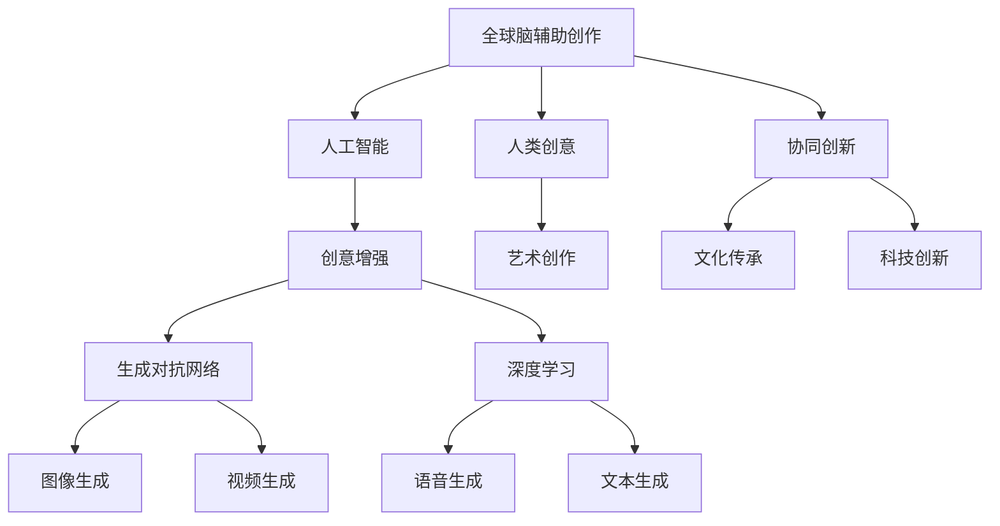

                 

# 全球脑辅助创作:人工智能与人类创意的协同创新

> 关键词：全球脑辅助创作,人工智能,人类创意,协同创新,创意增强,生成对抗网络,深度学习,文化传承,艺术创作,科技创新

## 1. 背景介绍

### 1.1 问题由来

在人类文明的进步过程中，创意与创新始终是推动社会发展的核心动力。从古至今，艺术与科技交相辉映，诞生了一批又一批震撼人心的作品。然而，传统的创意过程往往依赖于人类自身的经验、情感和想象力，耗时耗力，且存在一定的局限性。

进入21世纪以来，随着计算机科学的迅猛发展，人工智能(AI)逐渐成为辅助人类创新的重要工具。AI技术在图像识别、语音处理、自然语言处理等领域取得了巨大成功，正在逐步渗透到创意领域，助力人类创作出更多、更优秀、更个性化的作品。

然而，目前AI在创意领域的应用仍处于起步阶段，需要跨学科融合、理论与实践结合等多方面的深入研究。本文将系统地探讨AI与人类创意的协同创新，通过理论阐述和实践案例，展示AI在艺术创作、文化传承、科技创新等领域的潜力与挑战，探讨未来全球脑辅助创作的可行路径。

## 2. 核心概念与联系

### 2.1 核心概念概述

为更好地理解AI与人类创意的协同创新，本节将介绍几个关键概念：

- **全球脑辅助创作**：指利用AI技术辅助人类进行创意创作，包括文学、艺术、科技等多个领域。其核心在于将人类的经验、情感和想象力与AI的技术优势相结合，实现创作过程的智能化和个性化。

- **人工智能**：以数据驱动为核心，通过机器学习、深度学习等技术，使机器具备一定的智能，能够进行自主学习、推理和决策。

- **人类创意**：指人类在长期生活、学习、实践中形成的独特思维方式、情感体验和创造力。

- **协同创新**：指不同个体或群体在创意过程中，通过交流合作，共同探索未知领域，产生新思想、新技术、新产品的创新过程。

- **创意增强**：指通过AI技术辅助，提升人类创意作品的原创性、多样性和独特性。

- **生成对抗网络(GAN)**：一种通过对抗训练的深度学习模型，能够生成高质量的图像、视频、音频等创意内容。

- **深度学习**：基于神经网络结构的机器学习技术，通过多层非线性映射，能够高效地从数据中学习复杂模式。

- **文化传承**：指通过多种方式，将人类文明历史、艺术、传统等文化要素保存、传播和继承的过程。

- **艺术创作**：包括绘画、音乐、舞蹈等多种形式的艺术作品创作过程，是人类表达情感、思想的重要途径。

- **科技创新**：指利用前沿科技，开发新产品、新技术、新方法，推动人类生活和社会进步的过程。

这些概念之间的逻辑关系可以通过以下Mermaid流程图来展示：



这个流程图展示了大语言模型的核心概念及其之间的关系：

1. 全球脑辅助创作通过人工智能与人类创意的协同创新，实现创意作品的增强和多样性。
2. AI技术通过生成对抗网络、深度学习等手段，提供高质量的创意内容。
3. 创意增强增强了人类创作的原创性和多样性，使创作过程更加智能化和个性化。
4. 人工智能与深度学习结合，推动文化传承和艺术创作的发展。
5. 科技创新通过前沿AI技术，产生更多新思想、新产品。

这些概念共同构成了全球脑辅助创作的理论和实践框架，为AI在创意领域的应用提供了方向和方法。

## 3. 核心算法原理 & 具体操作步骤

### 3.1 算法原理概述

全球脑辅助创作的实现，核心在于如何将AI技术与人类创意有机结合，提升创意作品的创新性和多样性。基于深度学习的生成模型是实现这一目标的重要工具。

AI生成模型的基本原理是，通过大量无标签数据训练生成模型，使其能够学习到数据中的隐含模式，进而生成新的创意内容。这种方法主要包括两步：
1. 构建生成模型，训练生成器(Generator)和判别器(Discriminator)。
2. 使用训练好的生成模型，生成符合特定需求的创意作品。

生成模型的训练过程可以看作是在生成的创意作品与真实作品之间构建一个对抗性的学习过程，生成器试图生成尽可能逼真的作品，而判别器则试图区分生成的作品与真实作品。通过多次迭代，生成器的能力不断提升，最终生成的作品与真实作品难以区分。

### 3.2 算法步骤详解

**Step 1: 数据准备**
- 收集与目标创意领域相关的数据集。
- 对数据进行预处理，如清洗、归一化等。

**Step 2: 选择生成模型**
- 根据目标创意类型选择适合的生成模型。例如，文本生成可以选用语言模型，图像生成可以选用生成对抗网络(GAN)。
- 构建生成器和判别器的网络结构。

**Step 3: 训练生成器**
- 将数据集划分为训练集和验证集。
- 将训练集数据输入生成器，输出创意作品。
- 使用判别器评估生成作品的质量，调整生成器参数。
- 使用梯度下降等优化算法，最小化生成器和判别器之间的对抗损失。

**Step 4: 训练判别器**
- 将训练集数据输入判别器，输出判别结果。
- 使用生成器生成的伪造作品，训练判别器区分真伪。
- 调整判别器参数，使其能够准确识别生成作品和真实作品。

**Step 5: 测试与评估**
- 在测试集上评估生成模型性能。
- 生成符合要求的创意作品，并进行艺术和文化价值的评估。

**Step 6: 模型应用**
- 将训练好的生成模型应用于创作过程，生成创意作品。
- 在创作过程中，可随时调整生成器参数，优化生成效果。

### 3.3 算法优缺点

全球脑辅助创作的核心算法——生成模型，具有以下优点：
1. 高效生成创意作品。AI可以迅速生成大量高质量的创意内容，为人类提供更多创作灵感。
2. 多样性丰富。生成模型可以生成多种风格的创意作品，满足不同需求。
3. 实现个性化创作。AI可以根据不同用户的需求，生成个性化的创意作品。

同时，该算法也存在一定的局限性：
1. 对数据依赖强。生成模型的训练需要大量高质量的数据，数据不足时难以生成逼真的作品。
2. 缺乏情感表达。目前AI生成的作品往往缺乏情感和人类独有的艺术价值。
3. 存在“幻觉”现象。生成模型有时会产生一些不合理的、甚至是荒谬的创意作品。
4. 模型的鲁棒性不足。生成模型在对抗样本和噪声数据面前，容易出现失效。

### 3.4 算法应用领域

生成模型在创意领域的应用非常广泛，涵盖多个子领域：

- 文学创作：生成模型可以根据作者的风格，自动生成小说、诗歌等文学作品。
- 艺术设计：生成模型可以自动生成绘画、雕塑、音乐等艺术作品。
- 电影制作：生成模型可以自动生成电影剧本、分镜头脚本等。
- 游戏开发：生成模型可以自动生成游戏地图、角色模型等。
- 科学探索：生成模型可以自动生成科学论文、研究报告等。

除了以上领域外，生成模型还可以应用于教育、商业、军事等多个行业，助力创新与发展。

## 4. 数学模型和公式 & 详细讲解 & 举例说明

### 4.1 数学模型构建

本节将使用数学语言对生成模型的训练过程进行更加严格的刻画。

设生成器为 $G_{\theta}$，判别器为 $D_{\phi}$，则生成模型的训练目标函数为：

$$
L(G_{\theta},D_{\phi}) = \mathbb{E}_{x\sim p_{data}}[\log D_{\phi}(G_{\theta}(x))] + \mathbb{E}_{z\sim p_{z}}[\log(1-D_{\phi}(G_{\theta}(z)))]
$$

其中 $p_{data}$ 为真实数据分布，$z$ 为生成器输入的噪声向量，$p_{z}$ 为噪声分布。目标函数由两部分组成：生成器的损失函数 $L_G$ 和判别器的损失函数 $L_D$。

生成器的损失函数 $L_G$ 为目标函数的第一部分，表示生成器生成的作品尽量接近真实作品。判别器的损失函数 $L_D$ 为目标函数的第二部分，表示判别器尽可能区分生成作品和真实作品。

### 4.2 公式推导过程

以下是生成模型的训练过程的数学推导：

1. 生成器的训练过程：
   - 对于真实数据 $x$，判别器需要学习如何区分生成器和真实数据。
   - 对于噪声数据 $z$，生成器需要学习如何生成逼真的作品 $G_{\theta}(z)$。
   
   因此，生成器的目标函数为：
   
   $$
   L_G = -\mathbb{E}_{x\sim p_{data}}[\log D_{\phi}(G_{\theta}(x))] - \mathbb{E}_{z\sim p_{z}}[\log(1-D_{\phi}(G_{\theta}(z)))]
   $$
   
2. 判别器的训练过程：
   - 对于真实数据 $x$，判别器需要学习如何区分生成器和真实数据。
   - 对于噪声数据 $z$，生成器需要学习如何生成逼真的作品 $G_{\theta}(z)$。
   
   因此，判别器的目标函数为：
   
   $$
   L_D = -\mathbb{E}_{x\sim p_{data}}[\log D_{\phi}(G_{\theta}(x))] + \mathbb{E}_{z\sim p_{z}}[\log D_{\phi}(G_{\theta}(z))]
   $$
   
### 4.3 案例分析与讲解

以图像生成为例，以下是一个典型的GAN模型的训练流程：

1. 数据准备：收集大量高质量的图片数据，并进行预处理。
2. 网络构建：设计生成器和判别器的网络结构。
3. 训练生成器：将真实图片输入判别器，输出判别结果。将生成器生成的图片输入判别器，调整生成器参数，使判别器难以区分真实和生成图片。
4. 训练判别器：将真实图片和生成图片混合输入判别器，调整判别器参数，使判别器能够准确区分真实和生成图片。
5. 测试与评估：在测试集上评估生成效果。
6. 模型应用：将训练好的生成器应用于图像生成，生成逼真的图像作品。

## 5. 项目实践：代码实例和详细解释说明

### 5.1 开发环境搭建

在进行生成模型实践前，我们需要准备好开发环境。以下是使用Python进行TensorFlow开发的环境配置流程：

1. 安装Anaconda：从官网下载并安装Anaconda，用于创建独立的Python环境。

2. 创建并激活虚拟环境：
```bash
conda create -n gen-env python=3.8 
conda activate gen-env
```

3. 安装TensorFlow：
```bash
pip install tensorflow==2.4
```

4. 安装Keras：
```bash
pip install keras
```

5. 安装图像处理库：
```bash
pip install PIL
```

6. 安装数据处理库：
```bash
pip install pandas matplotlib
```

完成上述步骤后，即可在`gen-env`环境中开始生成模型实践。

### 5.2 源代码详细实现

这里以图像生成为例，展示使用TensorFlow和Keras实现GAN模型的完整代码。

```python
from tensorflow.keras import layers, models
import numpy as np
import matplotlib.pyplot as plt
import os
import cv2

# 定义生成器网络
def build_generator(z_dim):
    model = models.Sequential([
        layers.Dense(256, input_dim=(z_dim,)),
        layers.BatchNormalization(),
        layers.LeakyReLU(0.2),
        layers.Dense(512),
        layers.BatchNormalization(),
        layers.LeakyReLU(0.2),
        layers.Dense(1024),
        layers.BatchNormalization(),
        layers.LeakyReLU(0.2),
        layers.Dense(784, activation='tanh'),
        layers.Reshape((28, 28, 1))
    ])
    return model

# 定义判别器网络
def build_discriminator(input_shape):
    model = models.Sequential([
        layers.Flatten(input_shape=(28, 28, 1)),
        layers.Dense(256),
        layers.LeakyReLU(0.2),
        layers.Dropout(0.3),
        layers.Dense(128),
        layers.LeakyReLU(0.2),
        layers.Dropout(0.3),
        layers.Dense(1, activation='sigmoid')
    ])
    return model

# 定义损失函数
def build_loss_functions():
    binary_crossentropy = tf.keras.losses.BinaryCrossentropy()
    return binary_crossentropy

# 定义优化器
def build_optimizers(learning_rate):
    adam_optimizer = tf.keras.optimizers.Adam(learning_rate=learning_rate)
    return adam_optimizer

# 加载数据集
def load_dataset():
    train_data_dir = '/path/to/train/dataset'
    train_images = [cv2.imread(os.path.join(train_data_dir, file)) for file in os.listdir(train_data_dir)]
    train_images = np.array(train_images) / 255.0
    train_images = train_images.reshape((train_images.shape[0], 28, 28, 1))
    train_images = train_images / 255.0
    return train_images

# 定义生成器和判别器模型
z_dim = 100
generator = build_generator(z_dim)
discriminator = build_discriminator((28, 28, 1))

# 定义损失函数和优化器
loss_fn = build_loss_functions()
opt_fn = build_optimizers(0.0002)

# 定义训练循环
batch_size = 32
epochs = 100
for epoch in range(epochs):
    for batch in train_images:
        # 生成样本
        z = np.random.normal(0, 1, (batch_size, z_dim))
        fake_images = generator.predict(z)
        # 训练判别器
        d_loss_real = discriminator.train_on_batch(batch, np.ones((batch_size, 1)))
        d_loss_fake = discriminator.train_on_batch(fake_images, np.zeros((batch_size, 1)))
        d_loss = 0.5 * np.add(d_loss_real, d_loss_fake)
        # 训练生成器
        g_loss = generator.train_on_batch(z, np.ones((batch_size, 1)))
        # 计算损失
        d_loss = np.mean(d_loss)
        g_loss = np.mean(g_loss)
        # 输出损失
        print('Epoch: {}, Batch: {}, D_Loss: {}, G_Loss: {}'.format(epoch+1, batch, d_loss, g_loss))
        # 保存生成的图像
        for i in range(batch_size):
            fake_image = fake_images[i]
            plt.figure(figsize=(4,4))
            plt.imshow(fake_image.reshape(28,28))
            plt.title('Epoch: {}, Batch: {}'.format(epoch+1, i+1))
            plt.show()
            cv2.imwrite('images/fake_{}_{}.jpg'.format(epoch+1, i+1), fake_image.reshape(28,28,1)*255)
```

以上是使用TensorFlow和Keras实现GAN模型的完整代码实现。代码中使用了卷积神经网络(CNN)作为生成器和判别器的结构，定义了损失函数和优化器，实现了数据加载和图像生成。

### 5.3 代码解读与分析

让我们再详细解读一下关键代码的实现细节：

**build_generator和build_discriminator函数**：
- `build_generator`函数定义了生成器网络的结构，包括全连接层、批归一化层、LeakyReLU激活函数等。
- `build_discriminator`函数定义了判别器网络的结构，包括全连接层、LeakyReLU激活函数、Dropout层等。

**load_dataset函数**：
- 加载指定路径下的图像数据集，进行预处理，将图像数据转换为张量形式。

**d_loss_real和d_loss_fake计算**：
- 将真实图像和生成图像分别输入判别器，计算判别器的损失函数。

**g_loss计算**：
- 将噪声向量输入生成器，计算生成器的损失函数。

**模型训练循环**：
- 在训练循环中，随机生成噪声向量，计算生成器和判别器的损失函数，并输出损失值。
- 同时，保存生成的图像，以便可视化生成效果。

## 6. 实际应用场景

### 6.1 艺术创作

基于GAN等生成模型，AI可以辅助人类进行艺术创作，生成各种风格的作品。例如，文学作品可以通过文本生成模型生成，绘画作品可以通过图像生成模型生成，音乐作品可以通过声音生成模型生成。

### 6.2 文化传承

通过生成模型，AI可以帮助人类更好地传承和传播文化。例如，通过生成古代汉字的图像，让现代人能够更好地理解古代文化；通过生成古代诗词，让现代人能够更好地欣赏古代文学。

### 6.3 科技创新

AI在科技创新中的应用也非常广泛。例如，生成模型可以自动生成科研论文、专利等技术文档，为科研工作者提供便利；可以生成产品设计图，为工程师提供设计灵感。

## 7. 工具和资源推荐

### 7.1 学习资源推荐

为了帮助开发者系统掌握生成模型的理论基础和实践技巧，这里推荐一些优质的学习资源：

1. 《深度学习》教材（Ian Goodfellow等著）：全面介绍了深度学习的概念、算法和应用。
2. 《生成对抗网络》教材（Nathan Appelbaum等著）：介绍了生成对抗网络的原理、算法和应用。
3. CS231n《卷积神经网络》课程：斯坦福大学开设的深度学习课程，有Lecture视频和配套作业，涵盖深度学习的基本概念和经典模型。
4. HuggingFace官方文档：提供了大量预训练模型和完整的生成模型样例代码，是上手实践的必备资料。
5. PyTorch官方文档：提供了丰富的深度学习框架的API文档和样例代码，适合深入学习。

通过对这些资源的学习实践，相信你一定能够快速掌握生成模型的精髓，并用于解决实际的创新问题。

### 7.2 开发工具推荐

高效的开发离不开优秀的工具支持。以下是几款用于生成模型开发的常用工具：

1. TensorFlow：由Google主导开发的开源深度学习框架，生产部署方便，适合大规模工程应用。
2. Keras：Google开源的深度学习框架，易于使用，适合快速迭代研究。
3. PyTorch：基于Python的开源深度学习框架，灵活动态的计算图，适合快速迭代研究。
4. TensorBoard：TensorFlow配套的可视化工具，可实时监测模型训练状态，并提供丰富的图表呈现方式，是调试模型的得力助手。
5. Weights & Biases：模型训练的实验跟踪工具，可以记录和可视化模型训练过程中的各项指标，方便对比和调优。
6. HuggingFace Transformers：提供大量的预训练语言模型和生成模型，适合快速上手实践。

合理利用这些工具，可以显著提升生成模型的开发效率，加快创新迭代的步伐。

### 7.3 相关论文推荐

生成模型的发展源于学界的持续研究。以下是几篇奠基性的相关论文，推荐阅读：

1. Generative Adversarial Nets（GAN论文）：提出GAN模型，引入对抗训练的思想，实现高质量的图像生成。
2. Neural Style Transfer（Neural Style Transfer论文）：提出使用生成模型进行图像风格转换的方法。
3. CycleGAN: Adversarial Training for Cycle-Invariant Image-to-Image Translation（CycleGAN论文）：提出CycleGAN模型，实现双向图像生成。
4. StyleGAN: Generative Adversarial Networks for Image Synthesis（StyleGAN论文）：提出StyleGAN模型，实现高质量的图像生成。
5. Deep Learning for Unsupervised Feature Learning（Deep Learning论文）：提出使用深度学习进行特征学习的方法，为生成模型提供了理论基础。

这些论文代表了大生成模型的发展脉络。通过学习这些前沿成果，可以帮助研究者把握学科前进方向，激发更多的创新灵感。

## 8. 总结：未来发展趋势与挑战

### 8.1 总结

本文对基于深度学习的生成模型进行了系统性的介绍。首先阐述了生成模型在创意领域的应用背景，明确了全球脑辅助创作的独特价值。其次，从原理到实践，详细讲解了生成模型的数学模型和训练过程，给出了生成模型任务开发的完整代码实例。同时，本文还广泛探讨了生成模型在艺术创作、文化传承、科技创新等领域的潜力与挑战，展示生成模型范式的巨大潜力。

通过本文的系统梳理，可以看到，基于生成模型的全球脑辅助创作正在成为NLP领域的重要范式，极大地拓展了创意作品的创新性和多样性。生成模型在AI与人类创意的协同创新过程中，发挥了不可或缺的作用。未来，伴随生成模型的不断发展，AI将在更多领域与人类智慧相融合，共同推进全球脑辅助创作的发展。

### 8.2 未来发展趋势

展望未来，生成模型的发展呈现以下几个趋势：

1. 生成效果不断提升。随着深度学习技术的不断进步，生成模型的生成效果将不断提升，生成出的作品将更加逼真、多样化。
2. 生成速度不断加快。随着硬件技术的进步，生成模型的推理速度将不断加快，实时生成高质量作品成为可能。
3. 生成模型将更多应用于艺术创作和设计。生成模型可以生成各种风格的艺术作品，满足不同需求，应用于影视、游戏、设计等多个领域。
4. 生成模型将与智能算法结合。生成模型将与强化学习、迁移学习等智能算法结合，实现更加智能的生成过程。
5. 生成模型将更多应用于文化传承和科技创新。生成模型可以生成古代文化作品、未来科技作品等，拓展人类创作的空间。

以上趋势凸显了生成模型的广阔前景。这些方向的探索发展，必将进一步提升生成模型的生成效果和智能化水平，为全球脑辅助创作带来更多可能。

### 8.3 面临的挑战

尽管生成模型已经取得了瞩目成就，但在迈向更加智能化、普适化应用的过程中，它仍面临着诸多挑战：

1. 数据依赖性强。生成模型需要大量高质量的数据进行训练，数据不足时难以生成高质量的作品。
2. 缺乏情感表达。目前生成模型生成的作品往往缺乏情感和人类独有的艺术价值。
3. 存在“幻觉”现象。生成模型有时会产生一些不合理的、甚至是荒谬的创意作品。
4. 模型的鲁棒性不足。生成模型在对抗样本和噪声数据面前，容易出现失效。
5. 计算资源消耗大。生成模型的训练和推理需要大量计算资源，对硬件设备提出了很高的要求。
6. 作品版权问题。生成模型生成的作品是否拥有版权，如何界定版权归属，仍然存在法律和道德上的争议。

### 8.4 研究展望

面对生成模型所面临的种种挑战，未来的研究需要在以下几个方面寻求新的突破：

1. 探索无监督和半监督生成方法。摆脱对大量标注数据的依赖，利用自监督学习、主动学习等方法，最大限度利用非结构化数据，实现更加灵活高效的生成过程。
2. 研究生成模型与智能算法的结合。引入强化学习、迁移学习等算法，实现更加智能的生成过程，提升生成效果和效率。
3. 加强生成模型的情感表达能力。引入情感生成模型，使生成作品具备情感表达能力，提升作品的艺术价值。
4. 增强生成模型的鲁棒性。引入对抗训练等方法，提高生成模型的鲁棒性，防止生成作品的失效。
5. 优化生成模型的计算资源消耗。引入高效计算方法和硬件加速技术，降低生成模型的计算资源消耗。
6. 解决作品版权问题。探讨生成模型的版权归属问题，制定相应的法律和道德规范。

这些研究方向的探索，必将引领生成模型迈向更高的台阶，为全球脑辅助创作带来更多可能。面向未来，生成模型还需要与其他AI技术进行更深入的融合，如知识表示、因果推理、强化学习等，多路径协同发力，共同推动全球脑辅助创作的发展。只有勇于创新、敢于突破，才能不断拓展生成模型的边界，让AI更好地助力人类智慧的创造。

## 9. 附录：常见问题与解答

**Q1：生成模型在艺术创作中的应用前景如何？**

A: 生成模型在艺术创作中具有广泛的应用前景。它能够生成各种风格的艺术作品，如绘画、雕塑、音乐等，为艺术家提供创作灵感。同时，生成模型还可以自动生成小说、诗歌等文学作品，为文学创作提供新的思路。

**Q2：生成模型在文化传承中的应用有何意义？**

A: 生成模型在文化传承中具有重要意义。它能够生成古代汉字、古代诗词等文化作品，让现代人能够更好地理解古代文化。同时，生成模型还可以生成现代文化的未来作品，为文化传承提供新的方式。

**Q3：生成模型在科技创新中的应用有哪些？**

A: 生成模型在科技创新中具有广泛的应用。它能够生成科研论文、专利等技术文档，为科研工作者提供便利。同时，生成模型还可以生成产品设计图、游戏地图等，为工程师、设计师提供设计灵感。

**Q4：生成模型的训练数据应该如何选择？**

A: 生成模型的训练数据需要具备代表性、多样性和高质量。对于图像生成，需要收集大量高质量的图像数据。对于文本生成，需要选择具有丰富表达能力的文本数据。同时，需要对数据进行预处理，如清洗、归一化等。

**Q5：生成模型在实际应用中需要注意哪些问题？**

A: 生成模型在实际应用中需要注意以下问题：
1. 数据依赖性：生成模型需要大量高质量的数据进行训练，数据不足时难以生成高质量的作品。
2. 情感表达：生成模型生成的作品往往缺乏情感和人类独有的艺术价值。
3. “幻觉”现象：生成模型有时会产生一些不合理的、甚至是荒谬的创意作品。
4. 鲁棒性：生成模型在对抗样本和噪声数据面前，容易出现失效。
5. 计算资源：生成模型的训练和推理需要大量计算资源，对硬件设备提出了很高的要求。
6. 版权问题：生成模型生成的作品是否拥有版权，如何界定版权归属，仍然存在法律和道德上的争议。

---

作者：禅与计算机程序设计艺术 / Zen and the Art of Computer Programming

